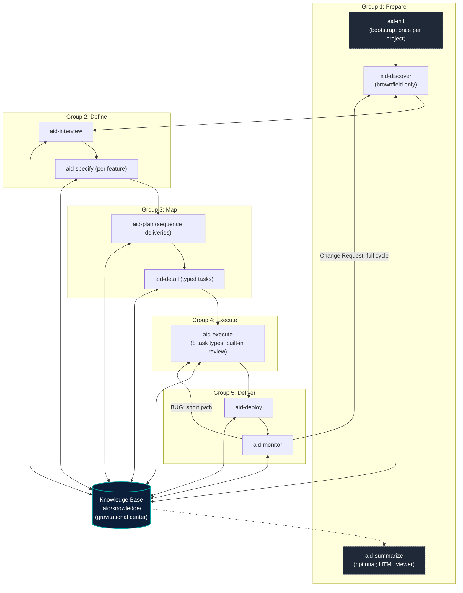
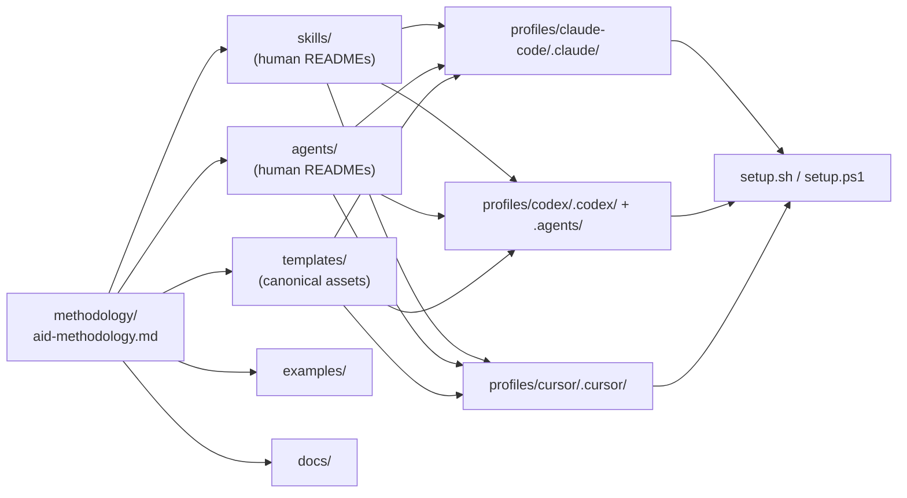
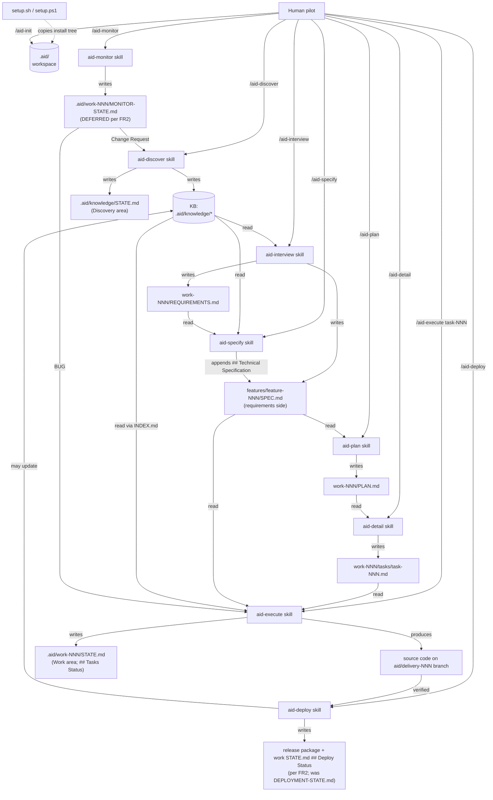

# Architecture

> **Source:** aid-discover (discovery-architect)
> **Status:** Populated (initial dogfood pass, 2026-05-21)
> **Companions:** `project-structure.md` (inventory), `technology-stack.md` (toolchain), `ui-architecture.md` (HTML summary viewer).

This document describes the **conceptual architecture of the AID methodology** (the abstract pipeline of phases, agents, loops, and artifacts that AID prescribes for any project) and the **physical architecture of this repository** (how the methodology is packaged for three host AI coding tools). For the file inventory and module triplication facts, see `project-structure.md` — it is the source of truth and is referenced rather than restated here.

---

## 1. Project Type

| Dimension | Value |
|---|---|
| Type | **Methodology specification + multi-tool install bundle** (no runtime service, no API, no database, no application binary) |
| Deployable artifact | None. Distribution unit is the git repository itself. |
| Top-level interface to consumers | `setup.sh` / `setup.ps1` (the installer) and, post-install, the host AI tool's slash-command surface (`/aid-init`, `/aid-discover`, ...). |
| Number of supported host tools | 3 with payloads (Anthropic Claude Code, OpenAI Codex CLI, Cursor); 2 named-as-future (GitHub Copilot, Google Antigravity) with no payload — see `external-sources.md` §7-8. |
| Dogfooded? | Yes. This repo's `.aid/knowledge/` is currently being populated by AID's own discovery pipeline running against itself. Heartbeat files (.aid/.heartbeat/) are always gitignored; the rest of .aid/ may or may not be gitignored depending on the user's aid-init Q7 choice. |

Evidence: `README.md:1-30`; `setup.sh` (161 lines); `methodology/aid-methodology.md:1-31` (Executive Summary states "AID is a structured methodology"); `project-structure.md` "What This Repository Is" (lines 9-20).

---

## 2. The Two-Level Architecture

AID has two architectures stacked on top of each other:

1. **Pipeline architecture** — the abstract methodology: phases, stage groups, formal feedback loops, a shared Knowledge Base, and three role separations (Director / Orchestrator / Specialist). This is what `methodology/aid-methodology.md` specifies.
2. **Repository architecture** — the concrete packaging: how skills, agents, templates, and three per-tool install trees compose to deliver the pipeline on Claude Code, Codex, and Cursor. This is what `project-structure.md` inventories.

The pipeline is the **product**. The repository is the **shipping container**.

### 2.1 Pipeline Architecture

#### Stage groups and phases

Per `methodology/aid-methodology.md:17-21` and `:199-205`:

| Group | Phases | Skill (host-tool slash command) |
|---|---|---|
| **Prepare** (1 phase + 2 non-phase skills) | Discover — plus `aid-init` (setup) and `aid-summarize` (optional) | `/aid-init`, `/aid-discover`, `/aid-summarize` |
| **Define** (2 phases) | Interview, Specify | `/aid-interview`, `/aid-specify` |
| **Map** (2 phases) | Plan, Detail | `/aid-plan`, `/aid-detail` |
| **Execute** (1 phase) | Execute (typed: RESEARCH / DESIGN / IMPLEMENT / TEST / DOCUMENT / MIGRATE / REFACTOR / CONFIGURE) | `/aid-execute` |
| **Deliver** (2 phases) | Deploy, Monitor | `/aid-deploy`, `/aid-monitor` |

The **Prepare** group holds two non-phase skills per `architecture.md` §Pattern 1 (Skills as state-machine orchestrators):
- `/aid-init` — bootstrap skill (NOT a numbered phase): scaffolds `.aid/knowledge/` and creates `CLAUDE.md` / `AGENTS.md` placeholders. Runs once per project.
- `/aid-summarize` — optional post-discovery skill (NOT a numbered phase): generates a single-file `knowledge-summary.html` from `.aid/knowledge/`.

**Canonical taxonomy — user-confirmed via DISCOVERY-STATE Q16 (2026-05-21):**

> **1 setup phase (Init) + 8 development phases (Discover, Interview, Specify, Plan, Detail, Execute, Deploy, Monitor) + 1 optional phase (Summarize) = 10 SKILL.md files total.**
> `aid-verify` is folded into `aid-execute`'s built-in review loop and `aid-deploy`'s final-verification step (it is **not** a distinct phase).
> `aid-correct` is a tombstone (`canonical/skills/aid-correct/README.md` reads "Correct (Deprecated)" — phase merged into Triage/Monitor per `methodology/aid-methodology.md:889`; pending deletion per Q6).

**Doc-vs-canon alignment** (resolved 2026-05-21, Q16): `methodology/aid-methodology.md` (`## 3. The Phases`), `README.md`, `architecture.md` §Pattern 1 (Skills as state-machine orchestrators), and this KB doc now share one 5-group taxonomy — **Prepare** (Init, Discover, Summarize) · **Define** (Interview, Specify) · **Map** (Plan, Detail) · **Execute** · **Deliver** (Deploy, Monitor) — over the 10-SKILL canonical set (1 setup + 8 development phases + 1 optional).

#### The pipeline diagram

The canonical visual is `methodology/aid-methodology.md:920-994` (ASCII) and `methodology/images/1-pipeline.png`. Three other PNGs at `methodology/images/`: `2-comparison.png` (AID vs SDD), `3-ironman.png` (human-as-pilot collaboration model), `4-feedback-loops.png` (the formal loops).



The 10 SKILL files (1 setup + 8 dev + 1 optional). Setup and optional are dashed to distinguish them from the 8 development phases that form the linear pipeline. The KB sits at the center; every development phase reads/writes it; `aid-summarize` is a read-only sink that emits an HTML viewer.

#### Phase definitions (cited)

Each phase has a normative description in `methodology/aid-methodology.md`:

| Phase | Line range in `methodology/aid-methodology.md` |
|---|---|
| Discover | 214-238 |
| Interview | 239-290 |
| Specify | 292-320 |
| Plan | 329-352 |
| Detail | 353-378 |
| Execute | 387-421 |
| Deploy | 430-447 |
| Monitor | 449-470 |

#### Feedback loops

Per `methodology/aid-methodology.md:476-543`, plus `README.md:15` which calls them "eleven formal feedback loops that let any phase revise upstream artifacts when reality contradicts assumptions". Cited line ranges in the methodology doc:

| Loop | Lines | Trigger |
|---|---|---|
| L1 Interview → Discovery | 482-486 | Human's answer reveals KB is wrong |
| L2 Specify → Discovery | 488-492 | Writing spec exposes KB insufficiency |
| L3 Plan → Discovery | 494-498 | Planning reveals KB gap |
| L4 Plan → Specify | 500-504 | KB OK but SPEC ambiguous |
| L5 Detail → Plan | 506-510 | Plan too vague to decompose |
| L6 Implement → Discovery/Plan/Spec | 512-516 | Assumptions don't hold in actual code |
| L7 Review → Any upstream | 518-522 | Review finds KB/SPEC/ARCH problems, not just CODE |
| L8 Test → Implement | 524-528 | Tests fail in staging |
| L9 Monitor → Execute (Bug path) | 532-536 | Monitor classifies finding as BUG |
| L10 Monitor → Discover (CR path) | 538-542 | Monitor classifies finding as Change Request |

⚠️ The methodology header `methodology/aid-methodology.md:478` says "The Eleven Loops"; the body enumerates ten. **Resolution per DISCOVERY-STATE Q17:** add an explicit `Loop 11: Any phase → aid-discover (targeted re-entry)` between L8 and L9 in `methodology/aid-methodology.md`, with the same Trigger/Protocol format. The "Discovery re-entry from any phase" pattern is real (the pipeline diagram at `methodology/aid-methodology.md:993` shows the "ANY PHASE → aid-discover (targeted) → .aid/knowledge/* → resume" arrow) — it just hasn't been numbered. Out-of-scope for this KB doc; tracked in `tech-debt.md`.

#### Roles

Per `methodology/aid-methodology.md:97-103`: **Director** (human, sets direction), **Orchestrator** (AI or human, manages the pipeline), **Specialist** (AI coding agent, executes tasks). The Director never writes code; the Specialist never makes architectural decisions; the Orchestrator bridges both.

#### Three convictions

Per `methodology/aid-methodology.md:24-28` and `README.md:17`:

1. **Understanding precedes specification** (drives the existence of the Discover phase and the brownfield-first emphasis).
2. **Specs are hypotheses, not contracts** (drives the existence of the feedback loops and the rev-tracked artifact templates).
3. **The Knowledge Base is the gravitational center** (drives every phase reading from and writing to `.aid/knowledge/`).

These three convictions are the architectural axioms from which every other repository decision follows.

### 2.2 Repository Architecture

The pipeline above must run inside an AI coding tool that the user already has installed. Three are supported with full payloads. The repository layout is dictated by the union of those three tools' file-format conventions.

See `project-structure.md` §"Top-Level Layout" (lines 22-43) and §"Per-Tool Installation Trees (the Triplication Pattern)" (lines 58-72) for the inventory. Summary:

| Layer | Where it lives | Role |
|---|---|---|
| Normative spec | `methodology/aid-methodology.md` (1,071 lines, verified 2026-05-23) + 4 PNGs in `methodology/images/` | The single source of truth for what AID is. |
| Human-readable references | `canonical/skills/aid-*/README.md` (10 skill READMEs), `canonical/agents/*/README.md` (22 agent READMEs), `docs/` (FAQ, glossary), `examples/` (3 case studies) | Documentation aimed at humans who want to understand AID without LLM optimization. |
| LLM-format payload — Claude Code | `profiles/claude-code/.claude/{agents,skills,templates}/` + `profiles/claude-code/CLAUDE.md` | Markdown + YAML frontmatter (`name`, `description`, `tools`, `model`); skills are `skills/aid-*/SKILL.md`; complex skills externalize content into `references/` and `scripts/` subdirs. |
| LLM-format payload — Codex CLI | `profiles/codex/.codex/agents/*.toml` (TOML) + `profiles/codex/.agents/{skills,templates}/` (markdown shared assets) + `profiles/codex/AGENTS.md` | Split layout: agents under `.codex/`, skills + templates under `.agents/`. Post-work-002 (canonical-generator): byte-identical to Claude Code and Cursor for skill bodies (`aid-discover/SKILL.md`: 596 lines across all 3 trees (post subagent-visibility-patch), verified via `wc -l`). Pre-2026-05-22 narrative claimed 1,078-vs-453 line divergence (Q73) — RESOLVED by `run_generator.py`. |
| LLM-format payload — Cursor | `profiles/cursor/.cursor/{rules,agents,skills,templates}/` + `profiles/cursor/AGENTS.md` | Same markdown + YAML shape as Claude Code, plus `.mdc` rules files (`profiles/cursor/.cursor/rules/aid-methodology.mdc` always-on, `aid-review.mdc` glob-scoped). Post-work-002: byte-identical SKILL.md bodies across all 3 trees (596 lines for `aid-discover` (post subagent-visibility-patch; was 548 pre-patch)). Pre-2026-05-22 1,090-line claim is obsolete. |
| Source-of-truth templates | `canonical/templates/` (KB doc templates, requirements / specs / delivery plans / feedback artifacts / knowledge-summary assets / shell scripts; KB-F1 lifted 6 orphans: feature.md, feature-inventory.md, known-issues.md, package.md, requirements.md, ui-architecture.md) | Rendered to each profile tree by `run_generator.py` (canonical-generator), then copied verbatim by `setup.sh` / `setup.ps1`. |
| Installers | `setup.sh` (161 lines), `setup.ps1` (156 lines) | Interactive menu selects one or more of Claude Code / Codex / Cursor; copies the matching tree into a target project. |

**Post-work-002 (canonical-generator) implication:** every change to a skill, agent, or template is made ONCE in `canonical/` and propagated to the 3 profile trees by `python run_generator.py`. VERIFY-4a enforces byte-identical re-rendering. The pre-2026-05-22 `CONTRIBUTING.md:21-26` quadruplicate-update rule is OBSOLETE — see `coding-standards.md §9 (The Canonical-Generator Authoring Rule)` for the current 4-step workflow.

---

## 3. Module Boundaries

This repository has no language-level modules (no packages, no namespaces, no compiled units), but it does have **content modules** with clear ownership boundaries. Cross-reference `project-structure.md` for the full inventory; here is what each module *owns*:

| Module | Owns (responsibility) | Cross-reference |
|---|---|---|
| `methodology/` | The single normative document and its 4 canonical diagram PNGs. Everything else in the repo is derived from this. | `project-structure.md:184-194` |
| `canonical/skills/aid-*/` | Source of truth for all 10 AID skills (post-work-002 canonical-generator). Each skill is a folder with `SKILL.md` (canonical body, propagated byte-identically to all 3 profile trees), `README.md` (human-readable docs), and `references/` + `scripts/` subdirs (also propagated). The pre-2026-05-22 top-level `skills/` README hub is retired; per-skill READMEs live alongside their SKILL.md in canonical/. | `project-structure.md:78-91` |
| `canonical/agents/*/` | Source of truth for all 22 AID agents (7 Core + 6 Specialist + 3 Utility + 6 Discovery sub-agents). Each agent is a folder with `AGENT.md` (canonical body) and `README.md` (human-readable docs). Propagated to 3 profile trees via canonical-generator with per-tool format conversion (Claude Code/Cursor: .md with YAML; Codex: .toml). | `project-structure.md:97-141` |
| `canonical/templates/` | Source of truth for all templates. Sub-folders: `knowledge-base/` (16 KB doc templates), `requirements/`, `specs/`, `delivery-plans/`, `feedback-artifacts/`, `knowledge-summary/` (HTML viewer assets, ~25 files), `scripts/` (`build-project-index.sh`, `verify-kb-claims.sh`). At root: `grading-rubric.md`, `work-state-template.md` (NEW per FR2), `discovery-state-template.md` (NEW per FR2), `rough-time-hints.md` (NEW per FR1), plus 6 templates lifted from install trees by KB-F1 (feature, feature-inventory, known-issues, package, requirements, ui-architecture). Retired post-FR2: `interview-state.md`, `feature-state.md`, `implementation-state.md`, `deployment-state.md`. | `project-structure.md:144-183` |
| `profiles/claude-code/.claude/` | Install payload for Anthropic Claude Code. Agents as `*.md` with YAML frontmatter; skills with `references/` and `scripts/` externalization; templates rendered from `canonical/templates/` via run_generator.py. | `project-structure.md:62-66` |
| `profiles/codex/` | Install payload for OpenAI Codex CLI (generated from canonical/). Split into `.codex/agents/*.toml` and `.agents/{skills,templates}/`. Per `profiles/codex/README.md:12-15`, this split is intentional. | `project-structure.md:62-66` |
| `canonical/` + `run_generator.py` | The canonical-generator (work-002). Single-source-of-truth `canonical/{skills,agents,templates,rules}/` propagates to `profiles/{claude-code,codex,cursor}/` via `python run_generator.py` (5-stage pipeline: render_agents → render_skills → render_templates → emission-manifest deletion pass → VERIFY-4a + VERIFY-4b). Replaces the pre-2026-05-22 quadruplicate-update rule. | `run_generator.py`; `.claude/skills/aid-generate/scripts/` |
| `profiles/cursor/.cursor/` | Install payload for Cursor. Same markdown shape as Claude Code, plus `.mdc` rule files. | `project-structure.md:62-66` |
| `examples/` | Three anonymized case studies showing AID applied to: brownfield-enterprise (Java/OSGi), desktop-app (.NET/Avalonia/MVVM), data-pipeline (multi-agent analytics). | `project-structure.md:196-202` |
| `docs/` | Adopter-facing FAQ and glossary. 2 files. | `project-structure.md:184-194` |
| `setup.sh`, `setup.ps1` | The installation entry point. Identical menu, identical copy semantics. Both at repo root. | `project-structure.md:37-38` |
| Root files | `README.md` (286 lines, project overview), `CONTRIBUTING.md` (116 lines, triplication rule), `LICENSE` (MIT), `CLAUDE.md` (this repo's own dogfood config), `.gitignore` (project-dependent; always includes `.aid/.heartbeat/` per subagent-visibility-patch) | `project-structure.md:39-43` |

### Inter-module dependencies (content level)



Arrow direction is "is derived from / is the source for". The methodology is upstream of everything. The install payloads are downstream of skills + agents + templates. The installer reads the install payloads and writes them into the target project.

---

## 4. Architectural Patterns

### Pattern 1: Skills as state-machine orchestrators

Every skill is a **stateful, resumable orchestrator** that does one step per invocation, persists its state to disk, and exits. The user re-invokes the same skill to advance the state machine.

Evidence:

- `aid-discover` — explicit `State machine: GENERATE → REVIEW → Q&A → FIX → APPROVAL → DONE` in its frontmatter description (`profiles/claude-code/.claude/skills/aid-discover/SKILL.md:6-7`). Six modes documented at `:46-55`. State detection logic at `:57-79`. Each mode is a single bounded step ending with "Run /aid-discover again to ..." (e.g., `:215`, `:251`, `:292`, `:348`).
- `aid-execute` — explicit `State machine: EXECUTE → REVIEW → FIX → back to REVIEW → DONE when grade ≥ minimum` (`profiles/claude-code/.claude/skills/aid-execute/SKILL.md:6-7`). State table at `:154-163` (Check 6: Determine State).
- `aid-summarize` — 9-state machine: `PREFLIGHT → STALE-CHECK → PROFILE → GENERATE → VALIDATE → FIX → APPROVAL → WRITEBACK → DONE` (`profiles/claude-code/.claude/skills/aid-summarize/SKILL.md:7-9`). State detection at `:56-95`.

Two invariants make this pattern work:

- **"FILESYSTEM IS THE ONLY SOURCE OF TRUTH"** — declared verbatim at `aid-discover/SKILL.md:42-43` and `aid-summarize/SKILL.md:58`. The skill never trusts memory between invocations; it always re-reads disk to determine which state to enter. This is what makes resumption deterministic across LLM sessions, machines, and time.
- **"Print the state at the start of the run"** — `[State: GENERATE]`, `[State: REVIEW]`, etc. (`aid-discover/SKILL.md:78`, `aid-summarize/SKILL.md:95`). This makes the state visible to the user in real time and serves as a built-in trace.

### Pattern 2: Sub-agent dispatch (orchestrator-worker)

An orchestrator skill dispatches multiple specialized sub-agents in parallel, waits for completion, then merges results. The orchestrator does no investigation itself — it only coordinates.

Canonical example: `aid-discover` Steps 2-5 (`profiles/claude-code/.claude/skills/aid-discover/SKILL.md:130-156`):

1. **Step 1** runs `discovery-scout` *alone, first*, because it produces the `project-structure.md` and `external-sources.md` that every other agent depends on.
2. **Steps 2-5** then dispatch four sub-agents in parallel with `background: true`:
   - `discovery-architect` → `architecture.md`, `technology-stack.md`, `ui-architecture.md`
   - `discovery-analyst` → `module-map.md`, `coding-standards.md`, `data-model.md`
   - `discovery-integrator` → `api-contracts.md`, `integration-map.md`, `domain-glossary.md`
   - `discovery-quality` → `test-landscape.md`, `security-model.md`, `tech-debt.md`, `infrastructure.md`
3. The orchestrator then **waits without polling**: `"After dispatching, WAIT. Do not check files. Do not take any action. ... Only proceed when ALL dispatched agents have reported completion."` (`:152-156`).
4. After convergence, a separate `discovery-reviewer` agent is dispatched with **clean context** (no info about which agents ran, no prior state) — `:230-237` and `:334-340`. This is the *Reviewer ≠ Executor* invariant declared at `architecture.md` §Pattern 8 (Three-tier agent model).

The same pattern recurs in `aid-execute` (`profiles/claude-code/.claude/skills/aid-execute/SKILL.md:42-60`) where each task Type dispatches a specific executor agent (RESEARCH → `researcher`, DESIGN → `ux-designer`, IMPLEMENT/TEST/REFACTOR → `developer`, etc.) followed by a separate `reviewer` agent.

### Pattern 3: Reference-file decomposition (canonical-uniform across all profiles)

> **Status (cycle 11):** Rewritten. The pre-work-002 "Claude-Code-only decomposition" claim is obsolete. All 10 canonical skills now externalize the same way; the renderer copies the entire `references/` and `scripts/` subtree byte-identically (modulo per-profile filename substitutions like `CLAUDE.md` <-> `AGENTS.md`).

Every canonical skill under `canonical/skills/aid-{name}/` externalizes verbose content into `references/` and `scripts/` subdirectories so the main `SKILL.md` stays orchestration-shaped. The `render_skills.py` generator (`.claude/skills/aid-generate/scripts/render_skills.py`, 450 lines) copies the entire subtree into each profile tree (`profiles/claude-code/.claude/skills/`, `profiles/codex/.agents/skills/`, `profiles/cursor/.cursor/skills/`) — see `run_generator.py:40` (`render_skills(repo, profile, manifest, repo)`).

Evidence (cycle-11 disk truth, all line counts verified by `wc -l`):

- `canonical/skills/aid-discover/SKILL.md` = **596 lines**. References: `agent-prompts.md` (142), `document-expectations.md` (121), `reviewer-prompt.md` (75). Scripts: `check-preflight.sh` (45), `verify-kb.sh` (60).
- All three profile trees ship **596 lines each** for `aid-discover/SKILL.md` (`profiles/claude-code/.claude/skills/aid-discover/SKILL.md`, `profiles/codex/.agents/skills/aid-discover/SKILL.md`, `profiles/cursor/.cursor/skills/aid-discover/SKILL.md` — verified `wc -l` cycle 11).
- The `references/` subtree is identical across all three profile trees **except** for per-profile filename substitutions performed by the renderer (e.g., `CLAUDE.md` in the Claude-Code tree becomes `AGENTS.md` in the Codex and Cursor trees — driven by `[filename_map] project_context_file` in each `profiles/{tool}.toml`; verified by `diff -r` cycle 11, only 2 substitution-driven line diffs in `document-expectations.md:117` and `reviewer-prompt.md:54`).

Historical drift (Q73) — the pre-work-002 era recorded 453 / 1,078 / 1,090-line divergence between the Claude Code, Codex, and Cursor variants of `aid-discover/SKILL.md`. **That drift was resolved by work-002 (canonical-generator).** The numbers no longer apply.

The residual length tension is now between canonical and the 500-line skill-body guideline (tracked as `tech-debt.md M5` — `aid-discover/SKILL.md` at 596 lines still exceeds the 500-line target, but the magnitude is roughly half of the pre-generator 1,078 number).

### Pattern 4: The Knowledge Base as gravitational center (Conviction #3)

`methodology/aid-methodology.md:107-109`: *"The Knowledge Base (.aid/knowledge/) is the gravitational center of the entire methodology. Every phase reads from it. Any phase can trigger updates to it."*

This is implemented as:

- A **fixed-shape directory** with 16 standard KB documents (per DISCOVERY-STATE Q102: `project-structure`, `external-sources`, `architecture`, `technology-stack`, `module-map`, `coding-standards`, `data-model`, `api-contracts`, `integration-map`, `domain-glossary`, `test-landscape`, `security-model`, `tech-debt`, `infrastructure`, `ui-architecture`, `feature-inventory`) + **3 meta-documents** (`INDEX.md`, `README.md`, `DISCOVERY-STATE.md`) + **1 generated pre-pass** (`project-index.md`) + extensions outside the standard 16 (currently `host-tools-matrix.md`). `feature-inventory.md` is a **standard KB doc**, NOT a meta-document — earlier wording was incorrect. Templates for 15 of the 16 standard docs live in `canonical/templates/knowledge-base/` at canonical root; the 16th (`ui-architecture.md`) is missing at canonical root but each install tree ships a 5-line stub — see DISCOVERY-STATE Q114 + Q126 for the lift-to-root resolution.
- A **completeness-tracked `README.md`** (`methodology/aid-methodology.md:132-145`) showing which documents are Complete / Partial / Missing with the source agent.
- A **lightweight `INDEX.md`** with 2-3 line summaries of every document (`methodology/aid-methodology.md:161-191`). Every task's prompt receives INDEX.md as context. This is **RAG-by-convention** — predictable file structure plus a navigation index, not a vector database. Cost: ~200-500 tokens; value: the agent self-serves additional context on demand.
- A **`feature-inventory.md`** that gets populated by `aid-discover` Q&A → FIX cycle (`aid-discover/SKILL.md:319-323`) and serves as the bridge from raw KB facts to user-facing feature names.

#### Progressive disclosure — the 3-tier context-economy model

The KB is deliberately structured so an agent **never loads the whole repository — or even the whole KB — into its context window**. Retrieval happens in three tiers, cheapest first:

1. **Tier 1 — `INDEX.md`, always loaded.** Every task prompt carries `INDEX.md`: a 2-3 line summary of every KB document, ~200-500 tokens total (`methodology/aid-methodology.md:161-191`). At negligible context cost the agent knows *what knowledge exists and which file holds it*.
2. **Tier 2 — one specific KB document, loaded on demand.** From an `INDEX.md` entry the agent decides which of the 16 standard KB docs (or the 3 meta-docs / extensions) a task actually needs and reads only that file. The **fixed-shape directory** makes this deterministic — `data-model.md` always holds schemas, `tech-debt.md` always holds debt — so the agent navigates by convention, never by search.
3. **Tier 3 — an exact repository location, pinpointed via citation.** Every factual claim in a KB document carries an inline `path:line` citation (the mandatory convention in `coding-standards.md §4.4`; `profiles/claude-code/.claude/agents/discovery-analyst.md:27` "Every claim must cite a file path. No unsourced assertions"). From a KB doc the agent jumps straight to the precise file and line in the 49,226-line repository — never globbing, never bulk-loading unrelated source.

**Net effect:** the agent pays ~200-500 tokens to know the location of *everything*, then spends context budget only on the one KB doc and the specific repo lines a task genuinely needs. This is what "RAG-by-convention" means here — predictable structure + a navigation index + mandatory citations deliver retrieval-augmented behavior with **no vector database, no embeddings, no chunking**. The same `path:line` citations that enforce accuracy (Tier 3, verified by `discovery-reviewer` spot-checks) double as the context-economy navigation layer.

### Pattern 5: Spec-as-hypothesis with formal revision (Conviction #2)

> **Status (cycle 11):** Updated for FR2 (work-003 area-STATE rule). Per-artifact STATE files (DISCOVERY-STATE.md, INTERVIEW-STATE.md, FEATURE-STATE.md, task-NNN-STATE.md, DEPLOYMENT-STATE.md, MONITOR-STATE.md) were consolidated into **area-STATE.md** files (one `STATE.md` per area: Discovery area, work-NNN area, etc.). See `coding-standards.md §8.5` and `data-model.md §1A` for the FR2 rule.

Every artifact template has a `## Revision History` table at the bottom. Every change requires a revision row with date, source, and description. Example template at `methodology/aid-methodology.md:546-556`.

This is enforced by:

- The feedback loops (see §2.1 above) — each loop produces a Q&A entry in the appropriate **area-STATE.md** file (`.aid/knowledge/STATE.md` for Discovery-area concerns including KB gaps and requirements/spec feedback that lands back in the KB; `.aid/work-NNN-{name}/STATE.md` for work-area concerns including interview Q&A, feature/spec gaps, task status, deployment status, and monitor findings) or an `IMPEDIMENT.md` (`canonical/templates/feedback-artifacts/IMPEDIMENT.md`, 116 lines) that explicitly identifies what artifact needs revision. **Per-artifact STATE files are retired** — the pre-FR2 names (DISCOVERY-STATE.md, INTERVIEW-STATE.md, FEATURE-STATE.md, task-NNN-STATE.md, DEPLOYMENT-STATE.md, MONITOR-STATE.md) no longer exist on disk; their content rolls up into the area STATE.md `## Tasks Status`, `## Q&A`, `## Review History`, etc. sections (`canonical/templates/work-state-template.md`, 82 lines; the dogfood `.aid/knowledge/STATE.md` itself is the live exemplar).
- The `## Change Log` section that prefixes user-facing requirements artifacts like REQUIREMENTS.md (`methodology/aid-methodology.md:611-614`) and per-feature SPEC.md (`:636-639`).
- The Reviewer agent that tags every issue by source (`[CODE]` / `[TASK]` / `[SPEC]` / `[KB]` / `[ARCHITECTURE]`) per `methodology/aid-methodology.md:814` — so a review can route a problem upstream to whichever artifact owns it.

### Pattern 6: Deterministic grading (separation of judgment from arithmetic)

The Reviewer agent **does not assign a letter grade**. It produces a structured issue list with `[CRITICAL]` / `[HIGH]` / `[MEDIUM]` / `[LOW]` / `[MINOR]` severity tags. A separate, deterministic shell script (`canonical/templates/scripts/grade.sh`, 141 lines) reads the structured list and computes the grade via the rubric in `canonical/templates/grading-rubric.md` (74 lines).

Declared at `methodology/aid-methodology.md:814`: *"The Reviewer does not assign a letter grade. The grade is computed deterministically by `canonical/templates/scripts/grade.sh` from the bracketed severity tags."* Reiterated in `aid-execute/SKILL.md:62-71` and `architecture.md` §Pattern 8 (Three-tier agent model): *"the agent that writes is never the agent that grades, and the grader's tier is never below the writer's."*

A second variant `canonical/templates/knowledge-summary/scripts/grade.sh` (194 lines) handles the more elaborate HTML/accessibility gating for the `aid-summarize` output. Same architectural pattern, different rubric.

### Pattern 7: Canonical-rendered install payloads (single source -> 3 profile trees)

> **Status (cycle 11):** Rewritten. The pre-work-002 "triplicated install payloads with manual cross-tree sync" pattern was retired by `run_generator.py`. Drift between trees is no longer a manual maintenance burden — it is now **prevented by construction**, with the renderer + `VERIFY-4a` enforcing byte-identical-where-applicable output.

A single canonical source (`canonical/`, top-level since work-002) propagates to three profile trees (`profiles/claude-code/.claude/`, `profiles/codex/.agents/` + `profiles/codex/.codex/`, `profiles/cursor/.cursor/`) via `run_generator.py` (top-level, 83 lines). Each profile is described by a TOML file at `profiles/{claude-code,codex,cursor}.toml` (64, 78, ~70 lines) that declares the per-tool layout, frontmatter shape, model-tier mapping, tool-name remapping, and filename substitutions (e.g., `CLAUDE.md` <-> `AGENTS.md`, `reviewer_output_file = STATE.md`).

The renderer pipeline (`run_generator.py:7-13, 38-41`):

1. `render_agents(repo, profile, manifest, repo)` — `.claude/skills/aid-generate/scripts/render_agents.py` (503 lines): converts `canonical/agents/{name}/AGENT.md` (markdown + YAML) into per-profile shape (markdown for Claude Code / Cursor, TOML for Codex).
2. `render_skills(repo, profile, manifest, repo)` — `render_skills.py` (450 lines): copies `canonical/skills/aid-{name}/` (SKILL.md + `references/` + `scripts/`) into the profile's skills directory, applying filename substitutions to `.md` files and carrying scripts byte-identically.
3. `render_templates(repo, profile, manifest, repo)` — `render_templates.py` (245 lines): copies the entire `canonical/templates/` subtree into the profile's templates location with the same substitution discipline.
4. Each render emits an `emission-manifest.jsonl` (one per profile, e.g., `profiles/claude-code/emission-manifest.jsonl`) that records every emitted file's `sha256` + relative destination path. The deletion pass diffs the previous manifest against the current one and removes files no longer emitted, pruning empty parent directories (`run_generator.py:43-60`).
5. `VERIFY-4a` (`verify_deterministic.py`, 513 lines) and `VERIFY-4b` (`verify_advisory.py`, 343 lines) run after every generation to enforce determinism and flag advisory drift (`run_generator.py:71-80`).

Supporting modules under `.claude/skills/aid-generate/scripts/`:

- `profile.py` (516 lines) — loads + validates per-tool profile TOMLs (`load_profile`, `validate`).
- `harness.py` (615 lines) — provides `EmissionManifest` (load / diff / write), `read_canonical_file`, `substitute_filenames`, `sha256_hex`.
- `test_manifest_safety.py` (254 lines) — manifest-safety regression test.

A **4th tree** — the dogfood `.claude/` at the repo root — mirrors `profiles/claude-code/.claude/` and is used by this repository's own host (Claude Code) to invoke AID against itself. It is currently a manual copy (not driven by `run_generator.py`); keeping it in sync with `profiles/claude-code/.claude/` is the only remaining cross-tree-sync responsibility, and it is small in scope (one tree mirroring one other tree, both Claude-Code-shaped).

The 4-way "duplication" recorded as pre-work-002 tech debt is now **intentional generator output**, not drift — see `tech-debt.md H1` (RE-FRAMED post-canonical-generator) and `tech-debt.md H4` (RE-FRAMED). The post-generator risk profile is different: drift between `canonical/` and what the generator actually produces, plus orphan files in install trees that have no canonical source (currently 6 such orphans — Q190, escalated cycle 11). The historical `CONTRIBUTING.md:21-26` "quadruplicate rule" is superseded; contributors edit `canonical/` and re-run `python run_generator.py`.

### Pattern 8: Three-tier agent model

Per `architecture.md` §Pattern 8 (Three-tier agent model):

- **Core Agents** (7) — always present: `orchestrator`, `researcher`, `interviewer`, `architect`, `developer`, `reviewer`, `operator`.
- **Specialist Agents** (6) — invoked on demand: `ux-designer`, `devops`, `tech-writer`, `security`, `data-engineer`, `performance`.
- **Utility Agents** (3, Small tier) — called only *by* full agents, never at the skill layer: `simple-extractor`, `simple-formatter`, `simple-glob`.
- **Discovery Sub-Agents** (6) — dispatched by `aid-discover` only: `discovery-architect`, `discovery-analyst`, `discovery-integrator`, `discovery-quality`, `discovery-scout`, `discovery-reviewer`.

Total visible to install trees: 22 agents (per `project-structure.md` file counts at line 238).

Tiers are provider-agnostic capability levels (Small / Medium / Large) per `architecture.md` §Pattern 8 (Three-tier agent model) §"Model Tiers". Current model examples:

| Tier | Anthropic | OpenAI |
|---|---|---|
| Large | Claude Opus | `gpt-5.5` (high reasoning) |
| Medium | Claude Sonnet | `gpt-5.4` (medium reasoning) |
| Small | Claude Haiku | `gpt-5.4-mini` (low reasoning) |

---

## 5. Data Flow

There is no runtime data flow (no requests, no events, no messages). The "data" is **artifact files** moving through the pipeline.



### Artifact registry (where each template lives)

Per `methodology/aid-methodology.md:589-606` (Artifacts Reference table) and the actual file inventory:

| Artifact | Template path | Produced by |
|---|---|---|
| KB documents (16) | `canonical/templates/knowledge-base/*.md` | Discover |
| `INDEX.md` | (generated; no template) | Discover (Step 6 of `aid-discover/SKILL.md:165-176`) |
| `.aid/knowledge/STATE.md` (per FR2; absorbs former DISCOVERY-STATE.md + SUMMARY-STATE.md) | `canonical/templates/discovery-state-template.md` | Discover |
| `REQUIREMENTS.md` | `canonical/templates/requirements/requirements-template.md` (95 lines) | Interview |
| Feature `SPEC.md` | `canonical/templates/specs/spec-template.md` (75 lines) | Interview (req side) + Specify (tech side) |
| `PLAN.md` | (no template; format defined inline by `aid-plan`) | Plan |
| `task-NNN.md` | `canonical/templates/delivery-plans/task-template.md` (20 lines) | Detail |
| `IMPEDIMENT.md` | `canonical/templates/feedback-artifacts/IMPEDIMENT.md` (118 lines) | Execute (Developer agent) |
| `MONITOR-STATE.md` | (referenced in `templates/README.md` but file is **missing** — see `project-structure.md` Anomaly #8 line 261 and Q8 in `.aid/knowledge/STATE.md ## Q&A` per FR2) | Monitor |

### Workspace shape

Per `methodology/aid-methodology.md:245-258` and `aid-execute/SKILL.md:73-87`:

```
.aid/
  knowledge/                       # shared KB (from Discovery)
    INDEX.md
    README.md
    STATE.md  # Discovery area (per FR2)
    architecture.md, module-map.md, ... (16 KB docs)
    project-index.md, project-structure.md, external-sources.md
    feature-inventory.md
  work-NNN-{name}/                 # one work per interview
    STATE.md  # Work area (per FR2; absorbs former INTERVIEW-STATE.md + per-feature STATE × N + per-task STATE × N)
    REQUIREMENTS.md
    PLAN.md
    known-issues.md
    features/
      feature-NNN-{name}/
        SPEC.md
        STATE.md
    tasks/
      task-NNN.md
      # per-task state now lives in work STATE.md ## Tasks Status (per FR2 §1A)
```

Multiple `work-NNN` directories coexist per project (e.g., a client requests auth now, reporting later — each is a separate work). All share the same `.aid/knowledge/`.

---

## 6. Dependency Injection (the equivalent for this codebase)

There is no runtime DI container — there is no runtime at all. The equivalent question for AID is: **how do skills bind to agents?**

### 6.1 Skill → Agent wiring

The frontmatter of each Claude Code skill declares the agent it dispatches at runtime. Example `profiles/claude-code/.claude/skills/aid-execute/SKILL.md:1-12`:

```yaml
---
name: aid-execute
description: ...
allowed-tools: Read, Glob, Grep, Write, Edit, Bash
context: fork
agent: developer
argument-hint: "..."
---
```

The `agent: developer` field is the **default** executor. The skill body then **overrides** this default per task type via the explicit `subagent_type` parameter when invoking the host tool's Task tool (`aid-execute/SKILL.md:197-203`):

> Dispatch with the Task tool, setting `subagent_type` explicitly to the chosen executor — this overrides the skill's default `agent: developer` from frontmatter. Example: a DESIGN task dispatches with `subagent_type: ux-designer`...

So the **skill is the wiring document**; the **task Type** is the selector key; the **agent definition file** (e.g., `profiles/claude-code/.claude/agents/ux-designer.md`) is the implementation. This is a hand-coded service locator pattern, not a container.

### 6.2 Tool-access declaration

Each agent file declares which host-tool capabilities (Read, Write, Edit, Bash, Glob, Grep, Agent, etc.) it is allowed to use. Example `profiles/claude-code/.claude/agents/architect.md:1-6`:

```yaml
---
name: architect
description: ...
tools: Read, Glob, Grep, Write, Edit, Bash
model: opus
---
```

The host tool enforces this allow-list. AID has no enforcement layer of its own — it relies entirely on Claude Code / Codex / Cursor to honor the declaration.

### 6.3 Model tier wiring

Per agent file:
- Claude Code: `model: opus | sonnet | haiku` in YAML frontmatter.
- Codex: `model = "gpt-5.5"` + `model_reasoning_effort = "high|medium|low"` in TOML (`profiles/codex/.codex/agents/architect.toml:3-4`).
- Cursor: same as Claude Code per `profiles/cursor/.cursor/agents/architect.md` (and `profiles/cursor/AGENTS.md:1-45` notes Cursor's Task-tool support is `experimental — Mar 2026`).

The skill body may further override the model at dispatch time for genuinely complex work (`aid-execute/SKILL.md:58`): *"For genuinely complex work — REFACTOR over a tangled module, MIGRATE with edge cases, IMPLEMENT touching critical security paths — the orchestrator may dispatch with an explicit higher-tier model in the Task tool's `model` parameter. This is a runtime decision per dispatch, not a skill configuration."*

### 6.4 Permission allow-lists

The repo's own `.claude/settings.json` (11 lines) and the typo file `.claude/settings..json` (12 lines, see `project-structure.md` Anomaly #2 line 255) contain narrow Bash allow-lists scoped to this dogfood session. These are not part of the install payload — they govern only this worktree. The install-time equivalent is the project-config placeholder at `profiles/claude-code/CLAUDE.md` (which currently says `## Project (pending discovery)`).

---

## 7. Entry Points

### 7.1 Install-time entry

| Entry | Lines | Behavior |
|---|---|---|
| `setup.sh` | 161 | Bash installer. Interactive menu (1=Claude Code, 2=Codex, 3=Cursor, 4=Install, 5=Quit). Copies the matching tree(s) into the target project. Safe re-run: identical files skipped, changed files prompted, `--force` to overwrite. |
| `setup.ps1` | 156 | PowerShell port with identical semantics. |

Distribution model per `README.md:31-53` is `git clone` + `./setup.sh`. There is no npm / pip / Homebrew / winget package, no curl-pipe-bash bootstrap, no published tarball. See `external-sources.md` and `DISCOVERY-STATE.md` Q2 for the open question on distribution model.

### 7.2 Runtime entry (per host tool)

After install, every entry point is a slash command provided by the host AI tool:

| Slash command | Skill file (Claude Code) |
|---|---|
| `/aid-init` | `canonical/skills/aid-init/SKILL.md` (531 lines; byte-identical across all 3 profile trees) |
| `/aid-discover` | `canonical/skills/aid-discover/SKILL.md` (596 lines; byte-identical across all 3 profile trees; pre-2026-05-22 was 453/1078/1090 — see Q73) |
| `/aid-interview` | `canonical/skills/aid-interview/SKILL.md` (527 lines) |
| `/aid-specify` | `canonical/skills/aid-specify/SKILL.md` (442 lines) |
| `/aid-plan` | `canonical/skills/aid-plan/SKILL.md` (360 lines) |
| `/aid-detail` | `canonical/skills/aid-detail/SKILL.md` (417 lines) |
| `/aid-execute` | `canonical/skills/aid-execute/SKILL.md` (512 lines) |
| `/aid-deploy` | `canonical/skills/aid-deploy/SKILL.md` (359 lines) |
| `/aid-monitor` | `canonical/skills/aid-monitor/SKILL.md` (333 lines) |
| `/aid-summarize` | `canonical/skills/aid-summarize/SKILL.md` (545 lines) |

Required ordering per `README.md:64-72` and `architecture.md` §Pattern 1 (Skills as state-machine orchestrators): `/aid-init` once → then either `/aid-discover` (brownfield) or `/aid-interview` (greenfield) → then `/aid-specify` → `/aid-plan` → `/aid-detail` → `/aid-execute` (per task) → `/aid-deploy` → `/aid-monitor`. `/aid-summarize` is optional and runs after Discovery is approved.

---

## 8. External Integration Surface

**There is no runtime integration surface.** AID does not call any HTTP API, does not connect to any database, does not subscribe to any queue, does not interact with any external service at runtime.

The integration boundaries are with the **host AI coding tool** — Claude Code, Codex, or Cursor — via that tool's native agent / skill / settings format. See `external-sources.md` §"Local Cross-Reference" (lines 50-132) for the complete vendor-by-vendor mapping. Summary:

| Boundary | What AID provides | What the host tool provides |
|---|---|---|
| Anthropic Claude Code | Agent `.md` files with YAML frontmatter; Skill `SKILL.md` files with optional `references/` and `scripts/`; templates copied into `templates/` inside `.claude/` | Slash-command loader; the `Task` tool for sub-agent dispatch; `permissionMode`, `background` flags; settings.json allow-list |
| OpenAI Codex CLI | TOML agent defs under `.codex/agents/`; shared markdown skills/templates under `.agents/`; `AGENTS.md` project context | TOML agent loader; AGENTS.md hierarchical context; `model_reasoning_effort` honoring |
| Cursor | `.mdc` rules (always-on or glob-scoped); markdown agents identical to Claude Code; `AGENTS.md` | Rules engine; agent loader; cross-tool compatibility (Cursor also reads `.claude/skills/` and `.codex/skills/` per `profiles/cursor/README.md:142`); Task tool (experimental as of Mar 2026 per `profiles/cursor/AGENTS.md`) |

Two install-time boundaries:

- The user's **filesystem** (the install payload is plain files copied with `cp`).
- The host tool's **slash-command surface** (the skill becomes invocable as `/aid-{name}` automatically once present in the right directory).

Three runtime helper boundaries used by skills (on the *user's* machine, not at install time):

- **Bash** (for `aid-discover` pre-pass `build-project-index.sh`, the `verify-kb.sh` script, the knowledge-summary validation scripts).
- **Node.js** (for `validate-diagrams.mjs` and `contrast-check.mjs` used by `aid-summarize`).
- **Network** (optional, for `aid-summarize` only: `https://registry.npmjs.org/mermaid/latest` + `https://cdn.jsdelivr.net/npm/mermaid@{ver}/dist/mermaid.min.js` per `aid-summarize/SKILL.md:175-179` — bypassable with `--cdn-mermaid` flag).

---

## 9. Doc-vs-Code Discrepancies

Spot-checks performed against `methodology/aid-methodology.md`, the human READMEs under `skills/` and `agents/`, and the Claude Code install payload.

### Skill spot-checks

| Skill | Methodology / human README claims | Claude Code SKILL.md reality | Match? |
|---|---|---|---|
| `aid-discover` | Methodology `:214-238`: "Brownfield discovery, produces 16-document KB plus INDEX.md, 11 steps from structure scan to context index generation." | `profiles/claude-code/.claude/skills/aid-discover/SKILL.md:59-63` lists 16 expected docs (matches); state machine with 6 modes; INDEX.md generated in Step 6 at `:165-176`. | Faithful. The methodology's process numbered list (steps 1-11) maps loosely to the SKILL.md's mode-by-mode flow; the SKILL.md is more explicit about the state machine. |
| `aid-execute` | Methodology `:387-421`: "Type-aware: 8 task types (RESEARCH/DESIGN/IMPLEMENT/TEST/DOCUMENT/MIGRATE/REFACTOR/CONFIGURE). Universal loop with separate reviewer." | `profiles/claude-code/.claude/skills/aid-execute/SKILL.md:30-39` lists the same 8 types with identical names; Agent Selection table at `:46-55` shows executor + reviewer + specialist consult per type. | Faithful. |
| `aid-summarize` | `architecture.md` §Pattern 1 (Skills as state-machine orchestrators): "Optional. Runs after `/aid-discover` reaches DONE. Generates single-file `knowledge-summary.html` with Mermaid, WCAG-AA, idempotent." | `profiles/claude-code/.claude/skills/aid-summarize/SKILL.md:1-28` matches description verbatim. State machine `PREFLIGHT → STALE-CHECK → PROFILE → GENERATE → VALIDATE → FIX → APPROVAL → WRITEBACK → DONE` declared in description, implemented in body. | Faithful. |

### Agent spot-checks

| Agent | Human `agents/{name}/README.md` claims | Claude Code agent definition | Codex agent definition | Match? |
|---|---|---|---|---|
| `architect` | "Transforms understanding into structure. SPEC.md / PLAN.md / TASK files. Opus tier. Invoked in Specify/Plan/Detail." (`canonical/agents/architect/README.md:1-18`) | `name: architect`, `model: opus`, `tools: Read, Glob, Grep, Write, Edit, Bash`. Body: "Transform REQUIREMENTS.md + KB into grounded SPEC.md" etc. (`profiles/claude-code/.claude/agents/architect.md`) | `name = "architect"`, `model = "gpt-5.5"`, `model_reasoning_effort = "high"`. Same body content. (`profiles/codex/.codex/agents/architect.toml`) | Faithful across all three. The Codex `developer_instructions` strips YAML `##` markdown headers from the body but preserves all content. |
| `discovery-architect` (this agent) | No human README under `agents/discovery-architect/` — discovery sub-agents are documented only in `architecture.md` §Pattern 8 (Three-tier agent model) and within `profiles/claude-code/.claude/agents/discovery-architect.md` (172 lines). | 172-line agent definition declaring "Discovery Architect — a specialized analysis agent in the AID discovery pipeline" with full output document templates and the firm `**Bash is READ-ONLY.**` constraint. | TOML equivalent at `profiles/codex/.codex/agents/discovery-architect.toml` (169 lines). | ⚠️ **Discrepancy.** The 6 discovery sub-agents have no individual `agents/{name}/README.md` human-readable docs. They are documented only inline in `architecture.md` §Pattern 8 (Three-tier agent model) and in the install-tree agent definitions. This is a documentation gap, not a behavioral one. Recorded as Q18. |
| `reviewer` | "Adversarial quality evaluator. Produces structured issue list with severity + source tags. Does NOT fix; does NOT compute grade — `grade.sh` does that." (`canonical/agents/reviewer/README.md` per `project-structure.md:108`) | 60 lines (`profiles/claude-code/.claude/agents/reviewer.md`). Tier: opus. | TOML equivalent at `profiles/codex/.codex/agents/reviewer.toml` (59 lines). | Faithful. The "does NOT fix" and "does NOT compute grade" rules are consistent across the README, the SKILL.md files that invoke the reviewer (`aid-execute/SKILL.md:232`, `aid-discover/SKILL.md:336`), the methodology `:814`, and the agent definition itself. |

### Other discrepancies (recorded but lower-impact)

- **Phase-count drift** (covered in §2.1 above and Q16): the doc title says "9 phases", the body lists "8 development phases", `architecture.md` §Pattern 1 (Skills as state-machine orchestrators) lists "8 phases + 1 setup + 1 optional" = 10 SKILL files, the user prompt refers to "11 phases", and an `aid-correct` stub exists for an 11th.
- **Loop-count drift** (covered in §2.1 above and Q17): the methodology and README both say "eleven feedback loops"; the body of `methodology/aid-methodology.md:482-543` enumerates ten (L1-L10). The 11th is plausibly the "any-phase → Discovery targeted re-entry" but is not numbered.
- **Missing templates** (per `project-structure.md` Anomaly #8 line 261 and `DISCOVERY-STATE.md` Q8): `canonical/templates/reports/track-report-template.md` and `canonical/templates/feedback-artifacts/MONITOR-STATE.md` are referenced in `templates/README.md` but do not exist on disk.
- **`aid-correct` placeholder** (per `project-structure.md` Anomaly #6 line 259 and `DISCOVERY-STATE.md` Q6): `canonical/skills/aid-correct/README.md` is a 5-line stub with no implementation in any install tree and no body in the methodology document.

---

## 10. Access Limitations

None encountered during this dogfood pass. All files cited above were readable; all line ranges referenced exist in the cited files at the time of writing (2026-05-21).
