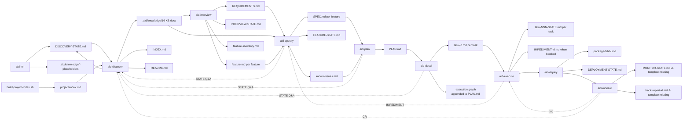

# Data Model

> **Source:** aid-discover (discovery-analyst)
> **Status:** Populated (initial dogfood pass)
> **Last Updated:** 2026-05-21

> ⚠️ **Important:** This repository has **no database, no ORM, no schema files, no migrations** — it is a methodology + multi-tool install bundle (see `module-map.md`). The traditional "data model" sections (tables / columns / FKs / indices) do not apply. Verified by `Glob` against `project-index.md`: no `*.sql`, no `migrations/`, no `*.prisma`, no `*.csproj` with EF Core packages, no `pom.xml`, no `package.json`, no `requirements.txt`. The Specialty `data-engineer` agent description (`agents/data-engineer/README.md`) governs the schema/migration patterns for projects USING AID, not this repo itself.
>
> What this document captures instead is the **structured-artifact model** of the AID pipeline: the set of markdown / TOML / YAML / shell files produced and consumed across the **10 SKILL files** of AID (1 setup [Init] + 8 development + 1 optional [Summarize] per user-confirmed canonical taxonomy DISCOVERY-STATE Q16). These are AID's actual "data" — they flow between phases the same way records flow through a database in a traditional application.

---

## 1. Artifact Inventory — the 23 structured artifacts

Each row is one artifact "type". Producer/consumer mappings are extracted from skill SKILL.md bodies and template README references.

| # | Artifact (filename pattern) | Location | Type | Producer | Consumer(s) | Template |
|---|---------------------------|---------|------|----------|-------------|----------|
| 1 | `.aid/knowledge/*.md` (16 standard KB docs per DISCOVERY-STATE Q102: `project-structure`, `external-sources`, `architecture`, `technology-stack`, `module-map`, `coding-standards`, `data-model`, `api-contracts`, `integration-map`, `domain-glossary`, `test-landscape`, `security-model`, `tech-debt`, `infrastructure`, `ui-architecture`, `feature-inventory`) | `.aid/knowledge/` | structured markdown | `aid-discover` sub-agents | every downstream skill | `templates/knowledge-base/*.md` (15 templates on disk at canonical root; `ui-architecture.md` MISSING at canonical root but each install tree ships a 5-line stub — see DISCOVERY-STATE Q114 + Q126 for lift-to-root resolution) |
| 2 | `.aid/knowledge/INDEX.md` | `.aid/knowledge/` | markdown | `aid-discover` Step 6 | every downstream skill (task context) | `templates/knowledge-base/INDEX.md` |
| 3 | `.aid/knowledge/README.md` | `.aid/knowledge/` | markdown | `aid-discover` Step 6 | humans | `templates/knowledge-base/README.md` |
| 4 | `DISCOVERY-STATE.md` | `.aid/knowledge/` | structured markdown | `aid-init` (creates), `aid-discover` (updates) | `aid-discover` state machine | `{install-tree}/templates/discovery-state.md` + `templates/reports/discovery-state-template.md` (reviewer variant) |
| 5 | `REQUIREMENTS.md` | `.aid/knowledge/` | structured markdown | `aid-interview` | `aid-specify`, `aid-plan` | `templates/requirements/requirements-template.md` |
| 6 | `INTERVIEW-STATE.md` | per-work `.aid/works/{work}/` | structured markdown | `aid-interview` | `aid-interview` (resume) | `{install-tree}/templates/interview-state.md` |
| 7 | `FEATURE-STATE.md` | per-feature `.aid/works/{work}/features/{feature}/` | structured markdown | `aid-specify` | `aid-specify` (resume) | `{install-tree}/templates/feature-state.md` |
| 8 | `feature.md` (one per feature) | per-feature folder | markdown | `aid-interview` | `aid-specify` | `{install-tree}/templates/feature.md` |
| 9 | `feature-inventory.md` | `.aid/knowledge/` | structured markdown | `aid-discover` (FIX cycle) | `aid-interview`, `aid-specify` | `{install-tree}/templates/feature-inventory.md` + `templates/knowledge-base/feature-inventory.md` |
| 10 | `SPEC.md` (one per feature) | per-feature folder | structured markdown | `aid-specify` | `aid-plan`, `aid-execute` | `templates/specs/spec-template.md` |
| 11 | `PLAN.md` | per-work | structured markdown | `aid-plan` | `aid-detail` | (no template; format defined inline by `aid-plan`) |
| 12 | `task-NNN.md` (one per task) | per-work | structured markdown | `aid-detail` | `aid-execute` | `templates/delivery-plans/task-template.md` |
| 13 | `task-NNN-STATE.md` (one per task) | per-task | structured markdown | `aid-execute` | `aid-execute` review loop | `templates/implementation-state.md` + `{install-tree}/templates/implementation-state.md` |
| 14 | `package-{NNN}.md` | per-package | structured markdown | `aid-deploy` | `aid-deploy` | `{install-tree}/templates/package.md` |
| 15 | `DEPLOYMENT-STATE.md` | per-work | structured markdown | `aid-deploy` | `aid-deploy` (resume) | `{install-tree}/templates/deployment-state.md` |
| 16 | `MONITOR-STATE.md` | per-work | structured markdown | `aid-monitor` | `aid-monitor` (resume) | ⚠️ **Template MISSING** — referenced at `templates/README.md:31` but no file on disk (Q31) |
| 17 | `track-report-{id}.md` | per-work | structured markdown | `aid-monitor` | `aid-execute` (bugs) / `aid-discover` (CRs) | ⚠️ **Template MISSING** — referenced at `templates/README.md:37` but no file on disk (Q31) |
| 18 | `IMPEDIMENT-{id}.md` | per-task | structured markdown | `aid-execute` | `aid-specify`, `aid-plan` (revision) | `templates/feedback-artifacts/IMPEDIMENT.md` |
| 19 | `KI-{n}` entries (in `known-issues.md`) | per-work | structured markdown subdocument | `aid-specify` | `aid-plan` (sequencing) | `{install-tree}/templates/known-issues.md` |
| 20 | `project-index.md` | `.aid/knowledge/` | structured markdown (generated) | `templates/scripts/build-project-index.sh` | every `aid-discover` sub-agent | (generated script output, no separate template) |

(Cross-reference: every "template" path comes from `project-index.md`; producer/consumer mappings come from `module-map.md` Per-template consumption matrix and each skill's SKILL.md body.)

---

## 2. Detailed Schemas

### 2.1 DISCOVERY-STATE.md

The central state file for `aid-discover`. Two schemas exist on disk because `aid-init` scaffolds one shape (`templates/discovery-state.md`) and `discovery-reviewer` rewrites it to a richer shape (`templates/reports/discovery-state-template.md`).

**Init-time schema** (verified at `claude-code/.claude/templates/discovery-state.md:1-23`):

| Field | Type | Required | Description |
|-------|------|----------|-------------|
| `**Grade:**` | enum (`Not Started` / `Pending` / `A+`/`A`/`A-`/... / `F`) | yes | Current overall grade |
| `**Minimum Grade:**` | enum (`A+`/`A`/`A-`/... / `F`) | yes | Threshold for "done"; set by `--grade` flag |
| `**Project Type:**` | enum (`Brownfield` / `Greenfield`) | yes | From init Q1 |
| `**User Approved:**` | enum (`yes` / `no`) | yes | Set in APPROVAL mode |
| `## External Documentation` | freeform | yes (may be "None provided") | List of paths from init Q4 |
| `## Issues` | freeform (populated by reviewer) | yes | Reviewer-emitted issues |
| `## Q&A` | sequence of `### Q{N}` entries | yes | Sub-schema below |
| `## Review History` | markdown table (5 columns) | yes | One row per review/fix/approval cycle |

**Reviewer-time schema** (verified at `templates/reports/discovery-state-template.md:1-67`): adds `## Settings`, `## Current Grade`, `## Documents` table (18-row grade matrix), `## Issues Found` (severity-tagged), `## Verification Spot-Checks` (claim/document/verified/evidence table, ≥15 rows), `## Cross-Cutting Concerns`. The reviewer template's `## Documents` column count is 4 (Document / Grade / Status / Issues); the init template has no Documents table.

**Q&A entry sub-schema** (verified at `claude-code/.claude/skills/aid-discover/SKILL.md:191-199`):

| Field | Type | Required | Example |
|-------|------|----------|---------|
| `### Q{N}` | sequential ID, monotonic across runs | yes | `### Q1` |
| `- **Category:**` | freeform tag | yes | `Architecture`, `Security`, `Features`, `User Feedback` |
| `- **Impact:**` | enum (`Required` / `High` / `Medium` / `Low`) | yes | `High` |
| `- **Status:**` | enum (`Pending` / `Answered` / `Skipped`) | yes | `Pending` |
| `- **Context:**` | freeform | yes | "why this question matters" |
| `- **Suggested:**` | freeform OR `—` | yes (may be em-dash) | inferred default answer if available |
| `- **Question:**` | freeform | yes | the actual question text |
| `- **Answer:**` | freeform | conditional (when Status=Answered) | user's reply or accepted suggestion |
| `- **Applied to:**` | filename(s) | conditional (set in FIX cycle) | which KB doc absorbed the answer |

**Review History sub-schema** (verified at `claude-code/.claude/templates/discovery-state.md:22-23`):

| Column | Type | Example |
|--------|------|---------|
| `#` | integer | `1`, `2`, ... |
| `Date` | ISO date | `2026-05-21` |
| `Grade` | grade enum | `B+`, `A` |
| `Source` | enum | `Review`, `Fix`, `Q&A`, `Approval` |
| `Notes` | freeform | "12 issues fixed, 3 Q&A answered" |

### 2.2 REQUIREMENTS.md

Verified at `templates/requirements/requirements-template.md:22-80`. Schema:

| Section | Required | Notes |
|---------|----------|-------|
| `# Requirements` (H1) | yes | First line |
| `## Change Log` (table: Date \| Change \| Source) | yes | Per `requirements-template.md:11` "Change Log is mandatory" |
| `## 1. Objective` | yes | Stakeholder's own words preferred |
| `## 2. Problem Statement` | yes | — |
| `## 3. Users & Stakeholders` (with Role/Description/Primary Needs table) | yes | — |
| `## 4. Scope` (with `### In Scope` and `### Out of Scope` H3s) | yes | — |
| `## 5. Functional Requirements` | yes | — |
| `## 6. Non-Functional Requirements` | yes | Measurable; see `aid-interview` for cross-reference enforcement |
| `## 7. Constraints` | yes | — |
| `## 8. Assumptions & Dependencies` | yes | — |
| `## 9. Acceptance Criteria` | yes | Must be testable per template note ("API response < 200ms p95", not "fast") |
| `## 10. Priority` | yes | Must/Should/Could or numbered |

**Convention:** any section not yet discussed contains `*(pending)*` as a placeholder (`requirements-template.md:14`). Cross-reference runs add Change Log entries with source `/aid-interview (cross-reference)` (`requirements-template.md:15`).

### 2.3 INTERVIEW-STATE.md

Verified at `claude-code/.claude/templates/interview-state.md:1-29`.

| Field | Type | Required | Notes |
|-------|------|----------|-------|
| `# INTERVIEW-STATE.md` | H1 | yes | Literal filename as title |
| `**Status:**` | enum (`In Progress` / `Complete` / etc.) | yes | Initial value `In Progress` |
| `**Grade:**` | grade enum | yes | Initial value `—` |
| `**Minimum Grade:**` | grade enum | yes | Default `A` |
| `## Section Status` | 10-row table | yes | One row per REQUIREMENTS section (1–10), columns: `#` / `Section` / `Status` / `Last Updated` |
| `## Pending Q&A` | freeform or `(none)` | yes | — |
| `## Review History` | table (`#` / `Date` / `Grade` / `Source` / `Notes`) | yes | — |

### 2.4 SPEC.md (per-feature)

Verified at `templates/specs/spec-template.md:1-75`.

| Section | Required | Phase that fills it |
|---------|----------|---------------------|
| `# {Feature Title}` | yes | aid-interview |
| `## Change Log` | yes | aid-interview |
| `## Source` (REQUIREMENTS.md back-refs) | yes | aid-interview |
| `## Description` | yes | aid-interview |
| `## User Stories` | yes | aid-interview |
| `## Priority` (Must/Should/Could) | yes | aid-interview |
| `## Acceptance Criteria` (Given/When/Then) | yes | aid-interview |
| `## Technical Specification` | yes | aid-specify |
| `### Data Model` | yes | aid-specify |
| `### Feature Flow` | yes | aid-specify |
| `### Layers & Components` | yes | aid-specify |
| Conditional H3s (18 options) | optional | aid-specify when triggered |

The 18 conditional H3s (per `spec-template.md:55-75`): `API Contracts`, `UI Specs`, `Events & Messaging`, `DDD Analysis`, `BDD Scenarios`, `CQRS Specs`, `State Machines`, `Security Specs`, `Migration Plan`, `Cache Strategy`, `External Integrations`, `Batch/Jobs`, `Mobile Specs`, `Search/Indexing`, `AI Enhancements`, `Telemetry & Tracking`, `Recovery Management`, `Cloud Support`, `Hardware Requirements`.

### 2.5 PLAN.md

PLAN.md has **no template file** — its format is defined inline by `aid-plan`. It holds the ordered Deliveries (a "Delivery" is a section within PLAN.md, not a separate file) plus the execution graph appended by `aid-detail`. Schema (per `aid-plan`'s inline definition):

| Section | Required | Purpose |
|---------|----------|---------|
| Front-matter metadata (Project / Created / Source / Status) | yes | Provenance + lifecycle status (e.g., `Draft`, `Approved`, `In Progress`) |
| `## Overview` | yes | One-paragraph delivery summary |
| `## Deliveries` | yes | Ordered list of delivery blocks; each block has Title, Goal, Scope (in/out), Acceptance Criteria, Estimated tasks, Dependencies on prior deliveries |
| `## Sequencing Rationale` | yes | Why this order: dependency chains + MVP-slice reasoning |
| `## Execution Graph` | yes | Appended by `aid-detail` — dependency and parallel-wave tables across all tasks |
| `## Risks` | optional | Open risks per delivery |
| `## Revision History` | yes | Date / Change / Source rows — every edit |

Cardinality: 1 PLAN.md per Work. Each delivery becomes a git branch `aid/{delivery-NNN}` during `aid-execute`.

### 2.6 task-NNN.md

Verified at `templates/delivery-plans/task-template.md:1-20`. Six sections only — nothing else. `aid-detail` produces one `task-NNN.md` per task directly (there is no `DETAIL.md` artifact) and appends the execution graph to `PLAN.md`.

| Field / Section | Type | Required | Notes |
|-----------------|------|----------|-------|
| `# task-NNN: {Title}` | H1 | yes | — |
| `**Type:**` | enum (`RESEARCH` / `DESIGN` / `IMPLEMENT` / `TEST` / `DOCUMENT` / `MIGRATE` / `REFACTOR` / `CONFIGURE`) | yes | One type per task; never mixed |
| `**Source:**` | reference | yes | `feature-NNN-{name} → delivery-NNN` |
| `**Depends on:**` | reference | yes | `task-NNN [, task-NNN]` or `— (none)` for the first task |
| `**Scope:**` | bullet list | yes | What the task produces or modifies — depends on Type; specific and bounded |
| `**Acceptance Criteria:**` | checkbox list | yes | Concrete, testable; always ends with "All §6 quality gates pass" |

**Task type taxonomy** (verified at `templates/implementation-state.md:5`): enum of `RESEARCH | DESIGN | IMPLEMENT | TEST | DOCUMENT | MIGRATE | REFACTOR | CONFIGURE`. One type per task. The type drives execution rules — `claude-code/.claude/skills/aid-execute/references/task-type-rules.md` (104 lines) details per-type protocols.

### 2.7 task-NNN-STATE.md

Verified at `templates/implementation-state.md:1-30`.

| Field | Type | Required | Notes |
|-------|------|----------|-------|
| `# Task State — task-NNN` | H1 | yes | Filename echoes task ID |
| `**Status:**` | enum (default `Pending`) | yes | — |
| `**Task:**` | task ID | yes | — |
| `**Type:**` | task-type enum | yes | One of the 8 types above |
| `**Feature:**` | feature ID | yes | — |
| `**Delivery:**` | delivery ID | yes | — |
| `**Minimum Grade:**` | grade enum | yes | Inherited from DISCOVERY-STATE.md |
| `**Branch:**` | branch name | yes | Convention `aid/{delivery-NNN}` |
| `## Current Review` (Cycle / Grade) | yes | — |
| `### Issues` | freeform | yes | Initial `_No issues yet._` |
| `## Dispatches` (5-col table) | yes | Step / Agent / Reason / Cycle |
| `## Review History` | yes | Initial `_No reviews yet._` |

Review and test outcomes are recorded here in `task-NNN-STATE.md` — there is no separate `REVIEW.md` or `TEST-REPORT.md` artifact.

### 2.8 IMPEDIMENT-{id}.md

Verified at `templates/feedback-artifacts/IMPEDIMENT.md:1-119`.

| Section | Required | Notes |
|---------|----------|-------|
| `# IMPEDIMENT: IMP-{id}` | yes | Note: ID prefix is `IMP-`, not `IMPEDIMENT-` |
| Metadata block (Generated by / Task / Date / Status) | yes | — |
| `## Summary` | yes | — |
| `## Type` (checkbox enum) | yes | 6 types: `wrong-assumption` / `missing-dependency` / `architecture-conflict` / `kb-gap` / `spec-gap` / `scope-creep` |
| `## Source` | yes | Task / Phase / File encountered |
| `## What Was Found` (Expected / Actual / Evidence) | yes | — |
| `## KB Impact` (Document / Section / Current / Correct) | yes | — |
| `## Options` (`### Option A/B/C`) | yes | Each with Approach / Effort / Risk / Scope impact / Spec impact |
| `## Recommendation` | yes | Brief rationale, no decision |
| `## Resolution` | conditional | — |
| `## Revision History` | yes | — |

### 2.9 known-issues.md (per-work)

Verified at `claude-code/.claude/templates/known-issues.md:1-15`. Schema is documented as **HTML comments** in the template (lines 6–14). Per-entry schema:

| Field | Type | Required | Notes |
|-------|------|----------|-------|
| `## KI-NNN: {Title}` | H2 with ID | yes | — |
| `- **Type:**` | enum | yes | `Bug` / `Security` / `Deprecated Dependency` / `Breaking API Contract` |
| `- **Severity:**` | enum | yes | `Critical` / `High` / `Medium` |
| `- **Affects:**` | feature ID list | yes | `feature-NNN-{name}` |
| `- **Source:**` | path:line OR dependency:version | yes | — |
| `- **Description:**` | freeform | yes | — |
| `- **See also:**` | tech-debt cross-ref | optional | `tech-debt.md #TD-NNN` |

### 2.10 DEPLOYMENT-STATE.md + package-NNN.md

Verified at `claude-code/.claude/templates/deployment-state.md:1-9` and `claude-code/.claude/templates/package.md:1-27`.

**DEPLOYMENT-STATE schema** (minimal):

| Field | Type | Required | Default |
|-------|------|----------|---------|
| `# Deployment State — {work-NNN}` | H1 | yes | — |
| `**Status:**` | enum | yes | `Idle` |
| `**Active Package:**` | package ID or `—` | yes | `—` |
| `**Minimum Grade:**` | grade enum | yes | inherited |
| `## History` | freeform list | yes | `_No packages created yet._` |

**package-NNN schema**:

| Section | Required | Fields |
|---------|----------|--------|
| `# package-NNN: {version/name}` | yes | H1 |
| `## Deliveries` | yes | `delivery-NNN: {name}` list |
| `## Deployment` | yes | `Type:` enum (`container` / `installer` / `package` / `static-site` / `executable` / `library`); `Target:`; `Version:`; `Tag:` |
| `## Environment` | yes | `Runtime:`; `Config:`; `Secrets:`; `Dependencies:` |
| `## Verification` | yes | Build / Tests / Lint, each `pending` initially |
| `## Release Notes` | yes | Generated during packaging |
| `## Status:` | yes | `Draft` initially |

### 2.11 MONITOR-STATE.md and track-report-*.md

⚠️ **Both templates are MISSING from disk** (Q8 / Q31 / Q77). `templates/README.md:31` references `templates/feedback-artifacts/MONITOR-STATE.md` and `templates/README.md:37` references `templates/reports/track-report-template.md`. Neither file is present per `project-index.md`. The skill `aid-monitor/SKILL.md` (242 lines per `project-index.md`) presumably defines or expects these — but without the templates, agents generating these artifacts have no canonical shape to follow. **Per DISCOVERY-STATE Q8 resolution: author both templates.** Tracked as `tech-debt.md H7` (promoted from MEDIUM to HIGH because it blocks the Monitor phase end-to-end).

### 2.12 project-index.md (generated)

Verified at `.aid/knowledge/project-index.md:1-13`. Schema:

| Section | Required | Notes |
|---------|----------|-------|
| `# Project Index` | yes | H1 |
| Source-attribution block-quote | yes | "Generated by `templates/scripts/build-project-index.sh` for AID discovery." |
| `## Summary` (4-row metrics table) | yes | Total files / Total lines / Generated / Root |
| `## Language Breakdown` (Language / Files / Lines table) | yes | Aggregated by file extension |
| `## Notable Files` | yes | Manifest, build config, CI files identified by name |
| `## Top {N} Largest Source Files` | yes | Default N=20 per `build-project-index.sh:24` |
| `## Full File Inventory` (Path / Language / Lines / Modified) | yes | All files, alphabetical |

Producer: `templates/scripts/build-project-index.sh` (368 lines). Consumer: every `aid-discover` sub-agent (per `aid-discover/SKILL.md:136-140` foundation reference block).

### 2.13 Agent / Skill frontmatter (cross-reference)

Schemas already documented in `coding-standards.md` §1 (SKILL.md), §2.1 (Claude Code agents), §2.2 (Codex TOML), §2.3 (Cursor agents), §3 (Cursor .mdc rules). Not duplicated here.

---

## 3. Relationships

### 3.1 Artifact dependency graph



### 3.2 Cardinality

| From → To | Cardinality | Notes |
|-----------|-------------|-------|
| `aid-init` → `DISCOVERY-STATE.md` | 1:1 per project | Created once |
| `aid-discover` → `.aid/knowledge/*.md` | 1:16 | One run produces 16 KB docs |
| `aid-interview` → `REQUIREMENTS.md` | 1:1 per project | Single doc, mutated across runs |
| `aid-interview` → `feature.md` | 1:N | One per identified feature |
| `aid-specify` → `SPEC.md` | 1:1 per feature | Same file mutated to add Technical Specification |
| `aid-plan` → `PLAN.md` | 1:1 per work | — |
| `aid-detail` → `task-NNN.md` | 1:N | One per task |
| `aid-execute` → `task-NNN-STATE.md` | 1:1 per task | — |
| `aid-deploy` → `package-{NNN}.md` | 1:1 per package | — |
| `aid-deploy` → `DEPLOYMENT-STATE.md` | 1:1 per work | Mutated across deploys |
| Any phase → STATE-file Q&A entry | 1:N | One per KB/upstream gap (DISCOVERY-STATE.md / INTERVIEW-STATE.md / feature STATE.md) |
| `aid-execute` → `IMPEDIMENT-{id}.md` | 1:N | One per impediment |
| `discovery-reviewer` → `DISCOVERY-STATE.md` updates | N:1 | Each review cycle rewrites issues + appends Review History row |

### 3.3 First-class artifact identification

Per `templates/requirements/requirements-template.md:16` and `aid-discover/SKILL.md:59-63`, the **first-class** artifacts (UPPERCASE filenames living at the `.aid/knowledge/` root or per-work root) are:

- `REQUIREMENTS.md`
- `SPEC.md` (per feature)
- `PLAN.md`
- `DISCOVERY-STATE.md`
- `INTERVIEW-STATE.md`
- `FEATURE-STATE.md`
- `task-NNN-STATE.md`
- `DEPLOYMENT-STATE.md`
- `MONITOR-STATE.md`

All other artifacts (the 16 KB docs, `INDEX.md`, `README.md`, `feature-inventory.md`, `task-NNN.md`, `package-{NNN}.md`) are **second-class** — kebab-case or sub-numbered, living under per-work folders or as nested supporting documents.

---

## 4. Dataflow Diagram — the 10 SKILL files

The artifact propagation across the **10 SKILL files** (1 setup + 8 development + 1 optional per user-confirmed canonical taxonomy DISCOVERY-STATE Q16; see `architecture.md §2.1` for the full taxonomy and pipeline diagram). Each arrow shows producer → consumer with the carried artifact in parentheses.

```
Phase 0  Init
         user input --> aid-init --> DISCOVERY-STATE.md (skeleton)
                                   --> .aid/knowledge/ (16 placeholders)
                                   --> .aid/knowledge/external-sources.md (registered URLs)

Phase 1  Discover (brownfield only)
         project source code --> aid-discover (5 sub-agents + reviewer)
                              --> .aid/knowledge/{16 KB docs}.md
                              --> DISCOVERY-STATE.md (Q&A, grade, review history)
                              --> .aid/knowledge/INDEX.md, README.md

Phase 2  Interview
         REQUIREMENTS.md (none) + .aid/knowledge/ --> aid-interview
                                                  --> REQUIREMENTS.md
                                                  --> INTERVIEW-STATE.md
                                                  --> feature.md (per feature)
                                                  --> feature-inventory.md (updated)

Phase 3  Specify (per feature)
         feature.md + REQUIREMENTS.md + .aid/knowledge/ --> aid-specify
                                                       --> SPEC.md (Technical Specification appended)
                                                       --> FEATURE-STATE.md
                                                       --> known-issues.md (entries)
                                                       --> Q&A entry in feature STATE.md / DISCOVERY-STATE.md (if KB gap discovered)

Phase 4  Plan
         all SPEC.md + .aid/knowledge/tech-debt.md + known-issues.md --> aid-plan
                                                                    --> PLAN.md (deliverables, sequencing)

Phase 5  Detail
         PLAN.md + SPEC.md + .aid/knowledge/ --> aid-detail
                                             --> task-NNN.md (one per task)
                                             --> execution graph (parallel-wave tables) appended to PLAN.md

Phase 6  Execute (per task)
         task-NNN.md + .aid/knowledge/ --> aid-execute (reviewer loop)
                                         --> code modifications (in target project, not in .aid/)
                                         --> task-NNN-STATE.md (per task)
                                         --> review report
                                         --> IMPEDIMENT-{id}.md (when blocked) → loops back to aid-specify

Phase 7  Deploy
         all completed task-NNN-STATE.md + .aid/knowledge/infrastructure.md --> aid-deploy
                                                                                  --> package-{NNN}.md
                                                                                  --> DEPLOYMENT-STATE.md
                                                                                  --> release notes

Phase 8  Monitor
         production telemetry + DEPLOYMENT-STATE.md --> aid-monitor
                                                     --> MONITOR-STATE.md (⚠️ template missing)
                                                     --> track-report-{id}.md (⚠️ template missing)
                                                     --> classified findings:
                                                         - bug → routes to aid-execute (new task)
                                                         - change request → routes to aid-discover (re-entry)
```

(Phases 9–11 in the broader methodology cover Triage, Correct, and ongoing iteration but are not separate skills today — `aid-correct/README.md` is a 5-line placeholder.)

---

## 5. Validation

There is no central validation layer for these artifacts. The validation that exists is **inside the skills themselves**:

| Validation point | What's checked | Where |
|------------------|----------------|-------|
| Pre-flight (state file exists) | `DISCOVERY-STATE.md` presence | `aid-discover/SKILL.md:22`, `aid-discover/scripts/check-preflight.sh` |
| Pre-flight (16 KB docs exist) | File presence | `aid-discover/scripts/verify-kb.sh` |
| Reviewer grading | Schema integrity + claim accuracy | `discovery-reviewer.md` (15+ spot-checks min) |
| Grade calculation | Worst-issue-dominates rubric | `templates/scripts/grade.sh` + `discovery-reviewer.md:151-168` |
| HTML output validation | WCAG-AA, link integrity, mermaid syntax | `templates/knowledge-summary/scripts/{validate-html.sh, validate-links.sh, validate-diagrams.mjs, contrast-check.mjs}` |
| Stale-check on KB summary | mtime-based regeneration trigger | `templates/knowledge-summary/scripts/stale-check.sh` |

**Not validated** (gaps):

- No schema validator for SKILL.md / agent frontmatter.
- No schema validator for any artifact template — a SPEC.md missing required sections will not be flagged automatically.
- No referential integrity check (e.g., does every `task-NNN.md`'s `Source:` field point to a real `feature-NNN → delivery-NNN` pair in PLAN.md?).
- No producer-consumer parity check (e.g., does the version of REQUIREMENTS.md that aid-specify reads match the version aid-interview last wrote?).

---

## 6. Migrations

There are no migrations in the traditional sense (this repo has no database). The closest analogue is **template-shape evolution** — when a template's schema changes, downstream artifacts may need to be regenerated or migrated by hand. There is no migration tool. The discipline is: when a template changes, update the four copies (root + three trees per `CONTRIBUTING.md:21-26`), then re-run the producer skill on a fresh project to validate output.

The `codex/README.md:35` "May 2026 migration note" referenced in `external-sources.md:81` documents a past tier-assignment migration (correcting agent `model_reasoning_effort` values). This is the only documented migration event in the repo.

---

## 7. Indexes (n/a — no database)

Not applicable. Search across artifacts is performed by skills via the Grep/Glob tools at runtime.

---

## Revision History

| Rev | Date | Source | Description |
|-----|------|--------|-------------|
| 1.0 | 2026-05-21 | aid-discover (discovery-analyst) | Initial dogfood pass: 15 artifact-section entries cataloged with schemas, cardinality, dataflow diagram across the 10 SKILL files of the AID pipeline, validation surface assessed, MONITOR-STATE.md and track-report-template.md gaps recorded. |
