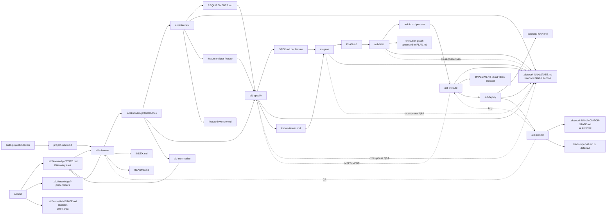

# Data Model

> **Source:** aid-discover (discovery-analyst)
> **Status:** Populated (cycle-11 FIX — post work-002 canonical-generator + work-003 FR2 area-STATE consolidation)
> **Last Updated:** 2026-05-23

> ⚠️ **Important:** This repository has **no database, no ORM, no schema files, no migrations** — it is a methodology + multi-tool install bundle (see `module-map.md`). The traditional "data model" sections (tables / columns / FKs / indices) do not apply. Verified by `Glob` against `project-index.md`: no `*.sql`, no `migrations/`, no `*.prisma`, no `*.csproj` with EF Core packages, no `pom.xml`, no `package.json`, no `requirements.txt`. The Specialty `data-engineer` agent description (`canonical/agents/data-engineer/README.md`) governs the schema/migration patterns for projects USING AID, not this repo itself.
>
> What this document captures instead is the **structured-artifact model** of the AID pipeline: the set of markdown / TOML / YAML / shell files produced and consumed across the **10 SKILL files** of AID (1 setup [Init] + 8 development + 1 optional [Summarize] per user-confirmed canonical taxonomy DISCOVERY-STATE Q16). These are AID's actual "data" — they flow between phases the same way records flow through a database in a traditional application.

---

## 1. Artifact Inventory — the structured artifacts

Each row is one artifact "type". Producer/consumer mappings are extracted from skill SKILL.md bodies and canonical-template references. **State-file rows reflect the FR2 area-STATE consolidation (work-003-traceability).**

| # | Artifact (filename pattern) | Location | Type | Producer | Consumer(s) | Source-of-truth template |
|---|---------------------------|---------|------|----------|-------------|--------------------------|
| 1 | `.aid/knowledge/*.md` (16 standard KB docs per DISCOVERY-STATE Q102: `project-structure`, `external-sources`, `architecture`, `technology-stack`, `module-map`, `coding-standards`, `data-model`, `api-contracts`, `integration-map`, `domain-glossary`, `test-landscape`, `security-model`, `tech-debt`, `infrastructure`, `ui-architecture`, `feature-inventory`) | `.aid/knowledge/` | structured markdown | `aid-discover` sub-agents | every downstream skill | `canonical/templates/knowledge-base/*.md` (16 templates; propagated to 3 install trees by `run_generator.py`) |
| 2 | `.aid/knowledge/INDEX.md` | `.aid/knowledge/` | markdown | `aid-discover` Step 6 | every downstream skill (task context) | `canonical/templates/knowledge-base/INDEX.md` |
| 3 | `.aid/knowledge/README.md` | `.aid/knowledge/` | markdown | `aid-discover` Step 6 | humans | `canonical/templates/knowledge-base/README.md` |
| 4 | **`.aid/knowledge/STATE.md`** (Discovery area) | `.aid/knowledge/` | structured markdown | `aid-init` (creates), `aid-discover` + `aid-summarize` (update) | `aid-discover` state machine, `aid-summarize` writeback | `canonical/templates/discovery-state-template.md` (83 lines) — absorbs the legacy `DISCOVERY-STATE.md` + `SUMMARY-STATE.md` per FR2 |
| 5 | `REQUIREMENTS.md` | per-work `.aid/work-NNN-{name}/` | structured markdown | `aid-interview` | `aid-specify`, `aid-plan` | `canonical/templates/requirements/requirements-template.md` |
| 6 | **`.aid/work-NNN-{name}/STATE.md`** (Work area) | per-work | structured markdown | `aid-init` (creates), `aid-interview` + `aid-specify` + `aid-plan` + `aid-detail` + `aid-execute` + `aid-deploy` (update) | the same skills (resume), `aid-discover` (cross-phase Q&A surface) | `canonical/templates/work-state-template.md` (82 lines) — absorbs the legacy `INTERVIEW-STATE.md` + per-feature `STATE.md` × N + per-task `task-NNN-STATE.md` × N + `DEPLOYMENT-STATE.md` per FR2 |
| 7 | `feature.md` (one per feature) | per-feature folder | markdown | `aid-interview` | `aid-specify` | `canonical/templates/feature.md` |
| 8 | `feature-inventory.md` | `.aid/knowledge/` | structured markdown | `aid-discover` (FIX cycle) | `aid-interview`, `aid-specify` | `canonical/templates/feature-inventory.md` + `canonical/templates/knowledge-base/feature-inventory.md` |
| 9 | `SPEC.md` (one per feature) | per-feature folder | structured markdown | `aid-specify` | `aid-plan`, `aid-execute` | `canonical/templates/specs/spec-template.md` |
| 10 | `PLAN.md` | per-work | structured markdown | `aid-plan` | `aid-detail` | (no template; format defined inline by `aid-plan`) |
| 11 | `task-NNN.md` (one per task) | per-work | structured markdown | `aid-detail` | `aid-execute` | `canonical/templates/delivery-plans/task-template.md` |
| 12 | `package-{NNN}.md` | per-package | structured markdown | `aid-deploy` | `aid-deploy` | `canonical/templates/package.md` |
| 13 | **`.aid/work-NNN-{name}/MONITOR-STATE.md`** (Monitor area, **DEFERRED**) | per-work | structured markdown | `aid-monitor` (when implemented) | `aid-monitor` (resume) | ⚠️ **Template not yet authored** — Monitor area implementation deferred (OQ-3 / DISCOVERY-STATE Q31). The standalone `MONITOR-STATE.md` filename reflects that *Monitor is itself the state* — no separate artifact to suffix against. Will follow the same area-STATE pattern when authored. |
| 14 | `track-report-{id}.md` | per-work | structured markdown | `aid-monitor` (when implemented) | `aid-execute` (bugs) / `aid-discover` (CRs) | ⚠️ **Template MISSING** — referenced at `canonical/templates/README.md` but no file on disk; deferred with Monitor area (Q31) |
| 15 | `IMPEDIMENT-{id}.md` | per-task | structured markdown | `aid-execute` | `aid-specify`, `aid-plan` (revision) | `canonical/templates/feedback-artifacts/IMPEDIMENT.md` |
| 16 | `KI-{n}` entries (in `known-issues.md`) | per-work | structured markdown subdocument | `aid-specify` | `aid-plan` (sequencing) | `canonical/templates/known-issues.md` |
| 17 | `project-index.md` | `.aid/knowledge/` | structured markdown (generated) | `canonical/templates/scripts/build-project-index.sh` | every `aid-discover` sub-agent | (generated script output, no separate template) |

(Cross-reference: every "template" path comes from `project-index.md` and the canonical tree at `canonical/templates/`; producer/consumer mappings come from `module-map.md` Per-template consumption matrix and each skill's SKILL.md body. Install-tree mirrors at `profiles/{claude-code,codex,cursor}/...templates/...` are byte-identical copies emitted by `run_generator.py`.)

---

## 1A. State-File Rule (FR2 — work-003-traceability)

**One STATE.md per area.** AID has three areas with distinct lifecycles:

- **Discovery** (persistent to the repo) — KB + visual summary. One `.aid/knowledge/STATE.md` absorbs the legacy `DISCOVERY-STATE.md` + `SUMMARY-STATE.md`.
- **Work** (per-work dev lifecycle) — req → spec → plan → impl → deploy. One `.aid/work-NNN-{name}/STATE.md` absorbs the legacy `INTERVIEW-STATE.md` + per-feature `STATE.md` × N + per-task `task-NNN-STATE.md` × N + `DEPLOYMENT-STATE.md`.
- **Monitor** (per-work post-conclusion) — observe → classify → route. **Deferred** until the Monitor area matures; `.aid/work-NNN-{name}/MONITOR-STATE.md` will follow the same area-STATE pattern when authored. The standalone naming reflects that *Monitor is itself the state* — no separate artifact to suffix against.

**Artifact files keep their inline `## Change Log` sections** — that is *content history* (what changed in the document), distinct from *process state* (where are we in the workflow). Artifact files (REQUIREMENTS.md, SPEC.md, PLAN.md, task-NNN.md, KB docs) are unchanged.

**Canonical templates** for the area-STATE shape live at `canonical/templates/discovery-state-template.md` (83 lines) and `canonical/templates/work-state-template.md` (82 lines). The legacy per-artifact templates (`interview-state.md`, `feature-state.md`, `implementation-state.md`, `deployment-state.md`, the old `discovery-state.md`, the `reports/discovery-state-template.md` reviewer variant) have all been retired — they no longer exist on disk under `canonical/templates/` nor under any of the three install trees.

**Sections §2.1, §2.3, §2.7, §2.10 below describe the legacy per-skill / per-artifact state files.** Their schemas are preserved as historical reference; they no longer exist as separate files on disk. The active schemas are in the canonical templates referenced above.

## 2. Detailed Schemas

### 2.1 STATE.md (Discovery area) — current shape

Canonical template: `canonical/templates/discovery-state-template.md` (83 lines).

| Section | Required | Notes |
|---------|----------|-------|
| `# Discovery State` (H1) | yes | Fixed title (no project name in H1) |
| Metadata block (Source / Status / Minimum Grade / Current Grade / User Approved / Last KB Review / Last Summary) | yes | Block-quote header — Source includes both `aid-init` and downstream skills |
| `## External Documentation` (Path / Type / Accessible / Notes table) | yes | Initial value `None provided` row |
| `## KB Documents Status` (16-row Document / Status / Grade / Last Reviewed / Notes table) | yes | Pre-populated with the 16 canonical KB docs in fixed order |
| `## Knowledge Summary Status` (Field / Value table) | yes | Tracks `aid-summarize` runs (Profile, Theme, Grades, Output, Mermaid Version, Mermaid Cached) |
| `## Q&A (Pending)` | yes | `### Q{N}: [{Category}: {Impact}]` entries with Question / Context / Suggested / Status / Answer / Applied to |
| `## Review History` (table: # / Date / Grade / Source / Notes) | yes | One row per `/aid-discover` review cycle |
| `## Summarization History` (table: # / Date / Grade / Profile / Mermaid / Output / Notes) | yes | One row per `/aid-summarize` run |

**Q&A entry sub-schema** (Q&A bullets — fields):

| Field | Type | Required | Example |
|-------|------|----------|---------|
| `### Q{N}: [{Category}: {Impact}]` | sequential ID, monotonic across runs | yes | `### Q1: [Architecture: High]` |
| `- **Question:**` | freeform | yes | the actual question text |
| `- **Context:**` | freeform | yes | "why this matters" |
| `- **Suggested:**` | freeform OR `—` | yes (may be em-dash) | inferred default answer if available |
| `- **Status:**` | enum (`Pending` / `Answered` / `Skipped`) | yes | `Pending` |
| `- **Answer:**` | freeform | conditional (when Status=Answered) | user's reply or accepted suggestion |
| `- **Applied to:**` | filename(s) | conditional (set in FIX cycle) | which KB doc absorbed the answer |

**Review History sub-schema:**

| Column | Type | Example |
|--------|------|---------|
| `#` | integer | `1`, `2`, ... |
| `Date` | ISO date | `2026-05-21` |
| `Grade` | grade enum | `B+`, `A` |
| `Source` | text | `/aid-discover (REVIEW cycle 1)`, `/aid-summarize (writeback)` |
| `Notes` | freeform | "12 issues fixed, 3 Q&A answered" |

### 2.1-LEGACY DISCOVERY-STATE.md *(RETIRED — absorbed into `.aid/knowledge/STATE.md` per FR2; schema preserved as historical reference only)*

The pre-FR2 `DISCOVERY-STATE.md` had two on-disk shapes (an `aid-init` skeleton at ~23 lines and a richer reviewer-rewritten variant at ~67 lines). Both have been retired. The active schema is §2.1 above.

### 2.2 REQUIREMENTS.md

Verified at `canonical/templates/requirements/requirements-template.md:22-80` (95 lines). Schema:

| Section | Required | Notes |
|---------|----------|-------|
| `# Requirements` (H1) | yes | First line |
| `## Change Log` (table: Date \| Change \| Source) | yes | Per `requirements-template.md:11` "Change Log is mandatory" |
| `## 1. Objective` | yes | Stakeholder's own words preferred |
| `## 2. Problem Statement` | yes | — |
| `## 3. Users & Stakeholders` (with Role/Description/Primary Needs table) | yes | — |
| `## 4. Scope` (with `### In Scope` and `### Out of Scope` H3s) | yes | — |
| `## 5. Functional Requirements` | yes | — |
| `## 6. Non-Functional Requirements` | yes | Measurable; see `aid-interview` for cross-reference enforcement |
| `## 7. Constraints` | yes | — |
| `## 8. Assumptions & Dependencies` | yes | — |
| `## 9. Acceptance Criteria` | yes | Must be testable per template note ("API response < 200ms p95", not "fast") |
| `## 10. Priority` | yes | Must/Should/Could or numbered |

**Convention:** any section not yet discussed contains `*(pending)*` as a placeholder (`requirements-template.md:14`). Cross-reference runs add Change Log entries with source `/aid-interview (cross-reference)` (`requirements-template.md:15`).

### 2.3 STATE.md (Work area) — current shape

Canonical template: `canonical/templates/work-state-template.md` (82 lines).

| Section | Required | Notes |
|---------|----------|-------|
| `# Work State — work-NNN-{name}` (H1) | yes | Includes the work-NNN slug |
| Metadata block (Status / Phase / Minimum Grade / Started / User Approved) | yes | Block-quote header |
| `## Interview Status` (10-row Section Status table) | yes | One row per REQUIREMENTS section (1–10); columns: `#` / `Section` / `Status` / `Last Updated`. Initial values `Pending` / `—`. |
| `## Features Status` (table: # / Feature / Spec Status / Spec Grade / Q&A Count / Notes) | yes | One row per feature spec'd via `/aid-specify` |
| `## Plan / Deliveries` (table: Delivery / Status / Tasks / Notes) | yes | One row per delivery from PLAN.md |
| `## Tasks Status` (table: # / Task / Type / Wave / Status / Review / Elapsed / Notes) | yes | One row per task; replaces the per-task `task-NNN-STATE.md` files |
| `## Deploy Status` (table: Delivery / State / PR / KB Updated / Tag / Notes) | yes | One row per delivery from `/aid-deploy`; replaces `DEPLOYMENT-STATE.md` |
| `## Cross-phase Q&A (Pending)` | yes | `### Q{N}: [{Phase}: {Category}: {Impact}]` entries with Question / Context / Source / Suggested / Status / Answer / Applied to |
| `## Lifecycle History` (table: Date / Phase Transition / Gate / Grade / Notes) | yes | Append-only audit trail |

### 2.3-LEGACY INTERVIEW-STATE.md *(RETIRED — absorbed into `.aid/work-NNN/STATE.md` `## Interview Status` section per FR2; schema preserved as historical reference)*

The pre-FR2 `INTERVIEW-STATE.md` was a standalone file with its own `## Section Status`, `## Pending Q&A`, `## Review History` sections. Those sections are now folded into the per-work `STATE.md` per §2.3 above. The standalone `interview-state.md` template no longer exists on disk.

### 2.4 SPEC.md (per-feature)

Verified at `canonical/templates/specs/spec-template.md:1-75`.

| Section | Required | Phase that fills it |
|---------|----------|---------------------|
| `# {Feature Title}` | yes | aid-interview |
| `## Change Log` | yes | aid-interview |
| `## Source` (REQUIREMENTS.md back-refs) | yes | aid-interview |
| `## Description` | yes | aid-interview |
| `## User Stories` | yes | aid-interview |
| `## Priority` (Must/Should/Could) | yes | aid-interview |
| `## Acceptance Criteria` (Given/When/Then) | yes | aid-interview |
| `## Technical Specification` | yes | aid-specify |
| `### Data Model` | yes | aid-specify |
| `### Feature Flow` | yes | aid-specify |
| `### Layers & Components` | yes | aid-specify |
| Conditional H3s (18 options) | optional | aid-specify when triggered |

The 18 conditional H3s (per `spec-template.md:55-75`): `API Contracts`, `UI Specs`, `Events & Messaging`, `DDD Analysis`, `BDD Scenarios`, `CQRS Specs`, `State Machines`, `Security Specs`, `Migration Plan`, `Cache Strategy`, `External Integrations`, `Batch/Jobs`, `Mobile Specs`, `Search/Indexing`, `AI Enhancements`, `Telemetry & Tracking`, `Recovery Management`, `Cloud Support`, `Hardware Requirements`.

### 2.5 PLAN.md

PLAN.md has **no template file** — its format is defined inline by `aid-plan`. It holds the ordered Deliveries (a "Delivery" is a section within PLAN.md, not a separate file) plus the execution graph appended by `aid-detail`. Schema (per `aid-plan`'s inline definition):

| Section | Required | Purpose |
|---------|----------|---------|
| Front-matter metadata (Project / Created / Source / Status) | yes | Provenance + lifecycle status (e.g., `Draft`, `Approved`, `In Progress`) |
| `## Overview` | yes | One-paragraph delivery summary |
| `## Deliveries` | yes | Ordered list of delivery blocks; each block has Title, Goal, Scope (in/out), Acceptance Criteria, Estimated tasks, Dependencies on prior deliveries |
| `## Sequencing Rationale` | yes | Why this order: dependency chains + MVP-slice reasoning |
| `## Execution Graph` | yes | Appended by `aid-detail` — dependency and parallel-wave tables across all tasks |
| `## Risks` | optional | Open risks per delivery |
| `## Revision History` | yes | Date / Change / Source rows — every edit |

Cardinality: 1 PLAN.md per Work. Each delivery becomes a git branch `aid/{delivery-NNN}` during `aid-execute`.

### 2.6 task-NNN.md

Verified at `canonical/templates/delivery-plans/task-template.md:1-20`. Six sections only — nothing else. `aid-detail` produces one `task-NNN.md` per task directly (there is no `DETAIL.md` artifact) and appends the execution graph to `PLAN.md`.

| Field / Section | Type | Required | Notes |
|-----------------|------|----------|-------|
| `# task-NNN: {Title}` | H1 | yes | — |
| `**Type:**` | enum (`RESEARCH` / `DESIGN` / `IMPLEMENT` / `TEST` / `DOCUMENT` / `MIGRATE` / `REFACTOR` / `CONFIGURE`) | yes | One type per task; never mixed |
| `**Source:**` | reference | yes | `feature-NNN-{name} → delivery-NNN` |
| `**Depends on:**` | reference | yes | `task-NNN [, task-NNN]` or `— (none)` for the first task |
| `**Scope:**` | bullet list | yes | What the task produces or modifies — depends on Type; specific and bounded |
| `**Acceptance Criteria:**` | checkbox list | yes | Concrete, testable; always ends with "All §6 quality gates pass" |

**Task type taxonomy:** enum of `RESEARCH | DESIGN | IMPLEMENT | TEST | DOCUMENT | MIGRATE | REFACTOR | CONFIGURE`. One type per task. The type drives execution rules — `canonical/skills/aid-execute/references/task-type-rules.md` (104 lines) details per-type protocols.

### 2.7 task-NNN-STATE.md *(RETIRED — absorbed into the per-work `.aid/work-NNN/STATE.md` `## Tasks Status` table per FR2; schema preserved as historical reference. `task-NNN.md` task-definition files remain unchanged at the 6-section template — definition stays inside the task file, status moves to work STATE.md.)*

The pre-FR2 `task-NNN-STATE.md` file (one per task, with `## Current Review`, `## Issues`, `## Dispatches`, `## Review History`) has been retired. Its data is now one row in the per-work `STATE.md` `## Tasks Status` table per §2.3 above. The standalone `implementation-state.md` template no longer exists on disk under `canonical/templates/` nor any install tree. Review and test outcomes for a task are now recorded in the work-STATE row plus inline in the task's review report.

### 2.8 IMPEDIMENT-{id}.md

Verified at `canonical/templates/feedback-artifacts/IMPEDIMENT.md:1-119`.

| Section | Required | Notes |
|---------|----------|-------|
| `# IMPEDIMENT: IMP-{id}` | yes | Note: ID prefix is `IMP-`, not `IMPEDIMENT-` |
| Metadata block (Generated by / Task / Date / Status) | yes | — |
| `## Summary` | yes | — |
| `## Type` (checkbox enum) | yes | 6 types: `wrong-assumption` / `missing-dependency` / `architecture-conflict` / `kb-gap` / `spec-gap` / `scope-creep` |
| `## Source` | yes | Task / Phase / File encountered |
| `## What Was Found` (Expected / Actual / Evidence) | yes | — |
| `## KB Impact` (Document / Section / Current / Correct) | yes | — |
| `## Options` (`### Option A/B/C`) | yes | Each with Approach / Effort / Risk / Scope impact / Spec impact |
| `## Recommendation` | yes | Brief rationale, no decision |
| `## Resolution` | conditional | — |
| `## Revision History` | yes | — |

### 2.9 known-issues.md (per-work)

Verified at `canonical/templates/known-issues.md:1-15`. Schema is documented as **HTML comments** in the template (lines 6–14). Per-entry schema:

| Field | Type | Required | Notes |
|-------|------|----------|-------|
| `## KI-NNN: {Title}` | H2 with ID | yes | — |
| `- **Type:**` | enum | yes | `Bug` / `Security` / `Deprecated Dependency` / `Breaking API Contract` |
| `- **Severity:**` | enum | yes | `Critical` / `High` / `Medium` |
| `- **Affects:**` | feature ID list | yes | `feature-NNN-{name}` |
| `- **Source:**` | path:line OR dependency:version | yes | — |
| `- **Description:**` | freeform | yes | — |
| `- **See also:**` | tech-debt cross-ref | optional | `tech-debt.md #TD-NNN` |

### 2.10 package-NNN.md (and Deploy Status row)

**DEPLOYMENT-STATE.md is RETIRED** — its data is now the `## Deploy Status` table in the per-work `STATE.md` (§2.3). The standalone `deployment-state.md` template no longer exists on disk. `package-NNN.md` is unchanged.

Verified at `canonical/templates/package.md:1-27`.

**package-NNN schema:**

| Section | Required | Fields |
|---------|----------|--------|
| `# package-NNN: {version/name}` | yes | H1 |
| `## Deliveries` | yes | `delivery-NNN: {name}` list |
| `## Deployment` | yes | `Type:` enum (`container` / `installer` / `package` / `static-site` / `executable` / `library`); `Target:`; `Version:`; `Tag:` |
| `## Environment` | yes | `Runtime:`; `Config:`; `Secrets:`; `Dependencies:` |
| `## Verification` | yes | Build / Tests / Lint, each `pending` initially |
| `## Release Notes` | yes | Generated during packaging |
| `## Status:` | yes | `Draft` initially |

**Work STATE.md `## Deploy Status` row** (per §2.3 above): one row per delivery with `Delivery` / `State` / `PR` / `KB Updated` / `Tag` / `Notes` columns.

### 2.11 MONITOR-STATE.md and track-report-*.md *(Monitor area STATE per FR2 — DEFERRED until Monitor area matures)*

⚠️ **Both templates remain unauthored** (Q8 / Q31 / Q77 — deferred per OQ-3). When the Monitor area matures, `MONITOR-STATE.md` will follow the area-STATE pattern (one per-work `.aid/work-NNN/MONITOR-STATE.md`). The standalone `MONITOR-STATE.md` filename (rather than plain `STATE.md`) reflects that *Monitor is itself the state* — no separate artifact to suffix against. Tracked as `tech-debt.md H7`.

### 2.12 project-index.md (generated)

Verified at `.aid/knowledge/project-index.md:1-13`. Schema:

| Section | Required | Notes |
|---------|----------|-------|
| `# Project Index` | yes | H1 |
| Source-attribution block-quote | yes | "Generated by `canonical/templates/scripts/build-project-index.sh` for AID discovery." |
| `## Summary` (4-row metrics table) | yes | Total files / Total lines / Generated / Root |
| `## Language Breakdown` (Language / Files / Lines table) | yes | Aggregated by file extension |
| `## Notable Files` | yes | Manifest, build config, CI files identified by name |
| `## Top {N} Largest Source Files` | yes | Default N=20 per `build-project-index.sh:24` |
| `## Full File Inventory` (Path / Language / Lines / Modified) | yes | All files, alphabetical |

Producer: `canonical/templates/scripts/build-project-index.sh` (368 lines, propagated identically to all 3 profile trees by `run_generator.py`). Consumer: every `aid-discover` sub-agent (per `aid-discover/SKILL.md` foundation reference block).

### 2.13 Agent / Skill frontmatter (cross-reference)

Schemas already documented in `coding-standards.md` §1 (SKILL.md), §2.1 (Claude Code agents), §2.2 (Codex TOML), §2.3 (Cursor agents), §3 (Cursor .mdc rules). Not duplicated here.

---

## 3. Relationships

### 3.1 Artifact dependency graph (post-FR2, post-canonical-generator)



### 3.2 Cardinality

| From → To | Cardinality | Notes |
|-----------|-------------|-------|
| `aid-init` → `.aid/knowledge/STATE.md` (Discovery area) | 1:1 per project | Created once |
| `aid-discover` → `.aid/knowledge/*.md` | 1:16 | One run produces 16 KB docs |
| `aid-init` → `.aid/work-NNN/STATE.md` (Work area) | 1:1 per work | Created when work folder created |
| `aid-interview` → `REQUIREMENTS.md` | 1:1 per work | Single doc, mutated across runs |
| `aid-interview` → `feature.md` | 1:N | One per identified feature |
| `aid-specify` → `SPEC.md` | 1:1 per feature | Same file mutated to add Technical Specification |
| `aid-specify` → work `STATE.md` row in `## Features Status` | 1:N | One row per feature |
| `aid-plan` → `PLAN.md` | 1:1 per work | — |
| `aid-detail` → `task-NNN.md` | 1:N | One per task |
| `aid-execute` → work `STATE.md` row in `## Tasks Status` | 1:N | One row per task (replaces retired `task-NNN-STATE.md`) |
| `aid-deploy` → `package-{NNN}.md` | 1:1 per package | — |
| `aid-deploy` → work `STATE.md` row in `## Deploy Status` | 1:N | One row per delivery (replaces retired `DEPLOYMENT-STATE.md`) |
| Any phase → work `STATE.md` `## Cross-phase Q&A` entry | 1:N | One per cross-phase open question |
| `aid-discover`/`aid-summarize` → `.aid/knowledge/STATE.md` `## Q&A` entry | 1:N | One per KB question |
| `aid-execute` → `IMPEDIMENT-{id}.md` | 1:N | One per impediment |
| `aid-summarize` → `.aid/knowledge/STATE.md` `## Summarization History` row | N:1 | Each run appends a row (via `writeback-state.sh`) |
| `discovery-reviewer` → `.aid/knowledge/STATE.md` `## Review History` row | N:1 | Each review cycle rewrites issues + appends Review History row |

### 3.3 First-class artifact identification

Per `canonical/templates/requirements/requirements-template.md:16` and `aid-discover/SKILL.md`, the **first-class** artifacts (UPPERCASE filenames living at the `.aid/knowledge/` root or per-work root) are:

- `REQUIREMENTS.md`
- `SPEC.md` (per feature)
- `PLAN.md`
- `STATE.md` (Discovery area — at `.aid/knowledge/STATE.md`)
- `STATE.md` (Work area — at `.aid/work-NNN/STATE.md`, one per work)
- `MONITOR-STATE.md` (Monitor area — deferred)

All other artifacts (the 16 KB docs, `INDEX.md`, `README.md`, `feature-inventory.md`, `task-NNN.md`, `package-{NNN}.md`) are **second-class** — kebab-case or sub-numbered, living under per-work folders or as nested supporting documents.

---

## 4. Dataflow Diagram — the 10 SKILL files (post-FR2)

The artifact propagation across the **10 SKILL files** (1 setup + 8 development + 1 optional per user-confirmed canonical taxonomy DISCOVERY-STATE Q16; see `architecture.md §2.1` for the full taxonomy and pipeline diagram). Each arrow shows producer → consumer with the carried artifact in parentheses. **Two area-STATE files (Discovery + Work) absorb all process-state writes.**

```
Phase 0  Init
         user input --> aid-init --> .aid/knowledge/STATE.md (Discovery skeleton)
                                   --> .aid/knowledge/ (16 placeholders)
                                   --> .aid/knowledge/external-sources.md (registered URLs)
                                   --> .aid/work-NNN/STATE.md (Work skeleton, when work folder created)

Phase 1  Discover (brownfield only)
         project source code --> aid-discover (5 sub-agents + reviewer)
                              --> .aid/knowledge/{16 KB docs}.md
                              --> .aid/knowledge/STATE.md (Q&A, KB Documents Status, Review History)
                              --> .aid/knowledge/INDEX.md, README.md

Phase 2  Interview
         REQUIREMENTS.md (none) + .aid/knowledge/ --> aid-interview
                                                  --> REQUIREMENTS.md
                                                  --> .aid/work-NNN/STATE.md (Interview Status section update)
                                                  --> feature.md (per feature)
                                                  --> feature-inventory.md (updated)

Phase 3  Specify (per feature)
         feature.md + REQUIREMENTS.md + .aid/knowledge/ --> aid-specify
                                                       --> SPEC.md (Technical Specification appended)
                                                       --> .aid/work-NNN/STATE.md (Features Status row + Cross-phase Q&A)
                                                       --> known-issues.md (entries)

Phase 4  Plan
         all SPEC.md + .aid/knowledge/tech-debt.md + known-issues.md --> aid-plan
                                                                    --> PLAN.md (deliverables, sequencing)
                                                                    --> .aid/work-NNN/STATE.md (Plan / Deliveries section)

Phase 5  Detail
         PLAN.md + SPEC.md + .aid/knowledge/ --> aid-detail
                                             --> task-NNN.md (one per task)
                                             --> execution graph (parallel-wave tables) appended to PLAN.md
                                             --> .aid/work-NNN/STATE.md (Tasks Status seed rows)

Phase 6  Execute (per task)
         task-NNN.md + .aid/knowledge/ --> aid-execute (reviewer loop)
                                         --> code modifications (in target project, not in .aid/)
                                         --> .aid/work-NNN/STATE.md (Tasks Status row update per task)
                                         --> review report
                                         --> IMPEDIMENT-{id}.md (when blocked) → loops back to aid-specify

Phase 7  Deploy
         all completed tasks + .aid/knowledge/infrastructure.md --> aid-deploy
                                                                  --> package-{NNN}.md
                                                                  --> .aid/work-NNN/STATE.md (Deploy Status row update)
                                                                  --> release notes

Phase 8  Monitor (DEFERRED — area not yet implemented)
         production telemetry --> aid-monitor
                                --> .aid/work-NNN/MONITOR-STATE.md (⚠️ template not yet authored)
                                --> track-report-{id}.md (⚠️ template not yet authored)
                                --> classified findings:
                                    - bug → routes to aid-execute (new task)
                                    - change request → routes to aid-discover (re-entry)

Phase 9  Summarize (optional)
         .aid/knowledge/* --> aid-summarize
                          --> .aid/knowledge/knowledge-summary.html
                          --> .aid/knowledge/STATE.md (Summarization History row via writeback-state.sh)
```

(Phases beyond Monitor — Triage, Correct, ongoing iteration — are not separate skills today. `aid-correct` was merged into Triage/Monitor.)

---

## 5. Validation

There is no central validation layer for these artifacts. The validation that exists is **inside the skills themselves**:

| Validation point | What's checked | Where |
|------------------|----------------|-------|
| Pre-flight (state file exists) | `.aid/knowledge/STATE.md` presence | `canonical/skills/aid-discover/SKILL.md`, `canonical/skills/aid-discover/scripts/check-preflight.sh` (45 lines) |
| Pre-flight (16 KB docs exist) | File presence | `canonical/skills/aid-discover/scripts/verify-kb.sh` (60 lines) |
| Reviewer grading | Schema integrity + claim accuracy | `canonical/agents/discovery-reviewer/AGENT.md` (15+ spot-checks min) |
| Grade calculation | Worst-issue-dominates rubric | `canonical/templates/scripts/grade.sh` (141 lines) + `discovery-reviewer` agent body |
| KB-claim verification | line counts, file existence, spot-checks | `canonical/templates/scripts/verify-kb-claims.sh` (356 lines) |
| HTML output validation | WCAG-AA, link integrity, mermaid syntax | `canonical/templates/knowledge-summary/scripts/{validate-html.sh, validate-links.sh, validate-diagrams.mjs, contrast-check.mjs}` |
| Stale-check on KB summary | mtime-based regeneration trigger | `canonical/templates/knowledge-summary/scripts/stale-check.sh` |
| STATE.md writeback | grade format + history row append | `canonical/templates/knowledge-summary/scripts/writeback-state.sh` (173 lines) |
| Generator output verification | deterministic propagation | `.claude/skills/aid-generate/scripts/verify_deterministic.py` (513 lines), invoked by `run_generator.py` |

**Not validated** (gaps):

- No schema validator for SKILL.md / agent frontmatter (the `run_generator.py` validates *profile* TOMLs, not skill frontmatter).
- No schema validator for any artifact template — a SPEC.md missing required sections will not be flagged automatically.
- No referential integrity check (e.g., does every `task-NNN.md`'s `Source:` field point to a real `feature-NNN → delivery-NNN` pair in PLAN.md?).
- No producer-consumer parity check (e.g., does the version of REQUIREMENTS.md that aid-specify reads match the version aid-interview last wrote?).

---

## 6. Migrations

There are no migrations in the traditional sense (this repo has no database). The closest analogues are:

1. **Canonical-generator propagation** (work-002, deployed 2026-05) — when a canonical asset under `canonical/{agents,skills,templates}/` changes, `run_generator.py` re-emits the 3 profile trees (`profiles/claude-code/.claude/`, `profiles/codex/.agents/` + `profiles/codex/.codex/`, `profiles/cursor/.cursor/`). Replaces the pre-work-002 manual cross-tree sync discipline.
2. **FR2 state-file consolidation** (work-003, deployed 2026-05) — one-time consolidation of `INTERVIEW-STATE.md`, `FEATURE-STATE.md`, `task-NNN-STATE.md`, `DEPLOYMENT-STATE.md`, `DISCOVERY-STATE.md`, `SUMMARY-STATE.md` into per-area `STATE.md` files. The legacy templates were retired (deleted) from `canonical/templates/` and from all 3 install trees.
3. **Codex tier-rename** (per `profiles/codex/README.md:35` "May 2026 migration note") — a past correction to agent `model_reasoning_effort` values, verified clean across all 22 agents × 3 trees.

There is no migration tool for end-user `.aid/` artifacts; if a project's `.aid/work-NNN/` directory predates FR2, the consolidation is manual.

---

## 7. Indexes (n/a — no database)

Not applicable. Search across artifacts is performed by skills via the Grep/Glob tools at runtime.

---

## Revision History

| Rev | Date | Source | Description |
|-----|------|--------|-------------|
| 1.0 | 2026-05-21 | aid-discover (discovery-analyst) | Initial dogfood pass: 15 artifact-section entries cataloged with schemas, cardinality, dataflow diagram across the 10 SKILL files of the AID pipeline, validation surface assessed, MONITOR-STATE.md and track-report-template.md gaps recorded. |
| 1.1 | 2026-05-23 | aid-discover cycle-11 FIX (KB-FIX work) | §1 Artifact Inventory rewritten: retired DISCOVERY-STATE/INTERVIEW-STATE/FEATURE-STATE/task-NNN-STATE/DEPLOYMENT-STATE rows replaced with 3 area-STATE rows (Discovery / Work / Monitor-deferred); template paths updated to `canonical/templates/*` post-canonical-generator (work-002); §§2.1, 2.3, 2.10 rewritten to describe the new area-STATE shapes; §§3-4 Mermaid + textual dataflow diagrams redrawn to show area-STATE flows; §6 Migrations section added documenting work-002 + work-003 + Codex tier-rename. Resolves cycle-11 HIGH findings on data-model.md §1 and §§3-4. |
