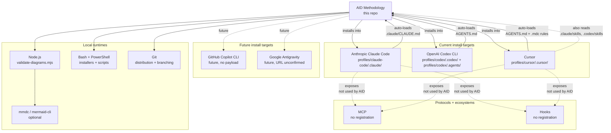

# Integration Map

> **Source:** aid-discover (discovery-integrator)
> **Status:** Populated (initial dogfood pass; cycle-11 FIX applied — script rename `writeback-state.sh` propagated, API consumption matrix annotated with FR2 area-STATE writes)
> **Last Updated:** 2026-05-23

> AID's "integrations" are not the usual stack of message queues, caches, and webhooks. They are the **host AI coding tools** AID installs itself into, the **MCP / hook ecosystem** those tools expose, and a small number of **local runtimes** (Node, Bash/PowerShell, Git, optional `mmdc`) needed to execute the bundled scripts. See `api-contracts.md` "Consumed APIs" for the (empty) HTTP surface — everything here is install-time or local-runtime.

---

## Host AI Coding Tools (Primary Integration Targets)

### Anthropic Claude Code

| Attribute | Value |
|-----------|-------|
| Kind | Host AI coding tool (CLI + IDE) |
| Direction | AID installs into Claude Code (one-way) |
| Install location | `<project>/.claude/` (per-project) or `~/.claude/` (global) |
| Loader picks up | `agents/`, `skills/`, `templates/`; reads `settings.json`; auto-loads `CLAUDE.md` at project root |
| Local payload | `profiles/claude-code/.claude/` (64 files: 22 agents + 10 skills + 31 templates/scripts per `project-structure.md`); `profiles/claude-code/CLAUDE.md` placeholder |
| Version pins (model IDs) | `opus` (10 agents), `sonnet` (9 agents), `haiku` (3 agents) — symbolic aliases; concrete model resolved by Claude Code |
| Source-of-truth doc | `external-sources.md` row 1: <https://docs.claude.com/en/docs/claude-code/overview> |
| Known-issues / open gaps | ⚠️ Pending vendor-doc fetch — full frontmatter inventory, Hooks lifecycle, Plugins API, MCP server registration, `permissionMode: bypassPermissions` semantics, `background: true` long-running agent semantics (`external-sources.md:67-68`). ⚠️ Per-session SKILL.md caching observed (Q192): host harness loads `SKILL.md` text once at session start — restart required after edits to skill bodies |
| Evidence | `profiles/claude-code/.claude/agents/*.md` (22 files); `profiles/claude-code/.claude/skills/aid-*/SKILL.md` (10 skills per Q16 canonical taxonomy); `profiles/claude-code/CLAUDE.md`; `profiles/cursor/README.md:142` (Cursor cross-load reference) |

### Anthropic Claude Agent SDK

| Attribute | Value |
|-----------|-------|
| Kind | SDK (programmatic agent dispatch) |
| Direction | None — AID has no programmatic SDK integration in this repo |
| Install location | n/a (would be a separate library) |
| Loader picks up | n/a |
| Local payload | **None.** No `package.json`, no Python SDK consumer, no programmatic agent loader anywhere in the tree |
| Version pins | n/a |
| Source-of-truth doc | `external-sources.md` row 2: <https://docs.claude.com/en/api/agent-sdk/overview> |
| Known-issues / open gaps | Listed for completeness. AID currently relies on the Claude Code CLI's built-in agent dispatch (via the `Agent` tool — used only by `aid-discover/SKILL.md`); the SDK is not consumed |
| Evidence | Negative search: no `package.json`, no `@anthropic-ai/*` import, no `claude_agent_sdk` import anywhere in the 353-file inventory (`project-index.md`) |

### OpenAI Codex CLI

| Attribute | Value |
|-----------|-------|
| Kind | Host AI coding tool (CLI) |
| Direction | AID installs into Codex CLI (one-way) |
| Install location | `<project>/.codex/agents/` (TOML agents) + `<project>/.agents/{skills,templates}/` (markdown skills/templates); `AGENTS.md` at project root |
| Loader picks up | `.codex/agents/*.toml` for agent definitions, `.agents/skills/aid-*/SKILL.md` for skill bodies, `AGENTS.md` for project context |
| Local payload | `profiles/codex/.codex/agents/` (22 TOML files) + `profiles/codex/.agents/skills/` (10 skill folders) + `profiles/codex/.agents/templates/` (KB + script templates) + `profiles/codex/AGENTS.md` (28 lines) |
| Version pins (model IDs) | `gpt-5.5` (Opus tier, 10 agents), `gpt-5.4` (Sonnet tier, 9 agents), `gpt-5.4-mini` (Haiku tier, 3 agents) — pinned per `Grep` over `profiles/codex/.codex/agents/*.toml` |
| Source-of-truth doc | `external-sources.md` rows 3-4: <https://github.com/openai/codex>, <https://developers.openai.com/codex/> |
| Known-issues / open gaps | ⚠️ AGENTS.md authoritative schema unverified; whether Codex CLI reads `.agents/skills/` at all needs vendor confirmation; sub-agent dispatch mechanism unknown (`external-sources.md:83`); May-2026 tier-migration history at `profiles/codex/README.md:35` |
| Evidence | `profiles/codex/.codex/agents/architect.toml:3-4`; `profiles/codex/AGENTS.md:1-28`; `profiles/codex/README.md:1-117` |

### Cursor

| Attribute | Value |
|-----------|-------|
| Kind | Host AI coding tool (IDE) |
| Direction | AID installs into Cursor (one-way) |
| Install location | `<project>/.cursor/{agents,rules,skills,templates}/`; `AGENTS.md` at project root |
| Loader picks up | `.cursor/rules/*.mdc` for always-on / glob-scoped rules, `.cursor/agents/*.md` for agent definitions, `.cursor/skills/aid-*/SKILL.md` for skills, `AGENTS.md` for project context |
| Local payload | `profiles/cursor/.cursor/` (≈80 files: 22 agents + 2 rules + 10 skills + 45 templates/scripts); `profiles/cursor/AGENTS.md` (45 lines) |
| Version pins (model IDs) | Same symbolic aliases as Claude Code (`opus` / `sonnet` / `haiku`) |
| Source-of-truth doc | `external-sources.md` rows 5-6: <https://docs.cursor.com/context/rules-for-ai>, <https://docs.cursor.com/context/model-context-protocol> |
| Known-issues / open gaps | ⚠️ Task tool dispatch marked **experimental as of March 2026** (`profiles/cursor/AGENTS.md:30`, `profiles/cursor/README.md:128`); precedence between `.cursor/rules/` vs. `AGENTS.md` vs. `.cursor/skills/` unverified; `Terminal` vs `Bash` tool naming divergence from Claude Code observed (see `api-contracts.md` 3b) |
| Cross-tool compatibility | Cursor will additionally load skills from `.claude/skills/` and `.codex/skills/` per `profiles/cursor/README.md:142` — only documented loader fallback chain in the AID install set |
| Evidence | `profiles/cursor/.cursor/agents/architect.md:1-7`; `profiles/cursor/.cursor/rules/aid-methodology.mdc:1-30`; `profiles/cursor/AGENTS.md:1-45`; `profiles/cursor/README.md:140-146` |

### GitHub Copilot CLI

| Attribute | Value |
|-----------|-------|
| Kind | Host AI coding tool (CLI + IDE) |
| Direction | None yet (future target) |
| Install location | n/a (no install tree in this repo) |
| Loader picks up | n/a |
| Local payload | **None.** No `copilot/` directory, no `copilot-instructions.md`, no `.github/copilot*` file anywhere in the tree (verified per `external-sources.md:108`) |
| Version pins | n/a |
| Source-of-truth doc | `external-sources.md` row 7: <https://docs.github.com/en/copilot> |
| Known-issues / open gaps | Future target — adopters using Copilot currently load `skills/` READMEs manually (`README.md:87`, `README.md:267`, `CONTRIBUTING.md:58`, `docs/faq.md:28`) |
| Evidence | Three documentation mentions, zero payload files |

### Google Antigravity

| Attribute | Value |
|-----------|-------|
| Kind | Host AI coding tool |
| Direction | None yet (future target — URL unconfirmed) |
| Install location | n/a |
| Loader picks up | n/a |
| Local payload | **None.** Zero footprint in repo per `external-sources.md:116` |
| Version pins | n/a |
| Source-of-truth doc | `external-sources.md` row 8: <https://antigravity.google/docs> (URL flagged as "to confirm via search") |
| Known-issues / open gaps | Future target. Even the basic shape of Antigravity's agent/skill/workflow model is unknown to AID. ⚠️ URL existence to be confirmed |
| Evidence | Single mention in `external-sources.md:24`; zero in payload trees |

---

## MCP (Model Context Protocol)

| Attribute | Value |
|-----------|-------|
| Kind | Protocol — cross-tool standard for exposing tools/resources to AI agents |
| Direction | n/a (AID would consume MCP servers; AID does not currently register any) |
| Local payload | **None.** Zero MCP server registration files in this repo. No `mcp.json`, no `.mcp/`, no `mcp.config.*` |
| Version pins | n/a |
| Source-of-truth doc | `external-sources.md` row 6 (via Cursor docs): <https://docs.cursor.com/context/model-context-protocol>. Likely also supported by Claude Code (see `external-sources.md:67`) |
| Known-issues / open gaps | ⚠️ MCP is referenced as a documented integration surface for both Claude Code and Cursor (`external-sources.md:67`, `external-sources.md:98`) but AID does not register or consume any MCP server. Future opportunity: an AID-specific MCP server could expose KB query as an MCP resource |
| Evidence | Negative search: zero MCP-related files across all 353 files inventoried in `project-index.md` |

---

## Hooks Ecosystem

| Attribute | Value |
|-----------|-------|
| Kind | Lifecycle event integration (host-tool-specific) |
| Direction | AID would register hooks; AID currently does not |
| Local payload | **None.** No hook examples ship in any install payload. No `.claude/hooks/`, no `.cursor/hooks/`, no Codex hook-equivalent file |
| Version pins | n/a |
| Source-of-truth doc | `external-sources.md` row 1 (Claude Code hooks), row 6 (Cursor hooks) |
| Known-issues / open gaps | ⚠️ Hook lifecycle, event payload schema, exit-code semantics, and blocking-vs-non-blocking behavior are all on the vendor-doc fetch list (`external-sources.md:33`). AID is leaving the hook surface unused. A natural future use: a Claude Code pre-edit hook that enforces "Discovery agents may only write under `.aid/knowledge/`" |
| Evidence | Negative search; documentation gap noted in `external-sources.md:67` |

---

## Local Runtimes

### Node.js (for `.mjs` validators)

| Attribute | Value |
|-----------|-------|
| Kind | Local runtime |
| Direction | AID invokes Node to run validation scripts |
| Local artifacts | `canonical/templates/knowledge-summary/scripts/validate-diagrams.mjs` (294 lines), `canonical/templates/knowledge-summary/scripts/contrast-check.mjs` (151 lines) plus three copies (Claude Code, Cursor, Codex trees) propagated by `run_generator.py` |
| Version pins | None observed. No `package.json`, no `.node-version`, no `engines` field |
| Known-issues / open gaps | ⚠️ `validate-diagrams.mjs` uses ES module syntax with top-level `await` (`validate-diagrams.mjs:177`); minimum Node version is not stated. Likely Node 18+ but unverified. [Q54] |
| Evidence | `canonical/templates/knowledge-summary/scripts/validate-diagrams.mjs:1-50`; `project-index.md` JavaScript breakdown (16 files, 3,428 lines) |

### Mermaid CLI (`mmdc`)

| Attribute | Value |
|-----------|-------|
| Kind | Local CLI tool (optional) |
| Direction | AID invokes `mmdc` (or `npx @mermaid-js/mermaid-cli` as fallback) for diagram parse/render validation |
| Local artifacts | n/a (external tool) |
| Version pins | None pinned. Both `mmdc` direct and `npx @mermaid-js/mermaid-cli` invocation paths are attempted with no `--version` lower bound check (`validate-diagrams.mjs:163-166`) |
| Used by | `aid-summarize` skill exclusively — via `canonical/templates/knowledge-summary/scripts/validate-diagrams.mjs:158-227` |
| Known-issues / open gaps | Graceful degradation: if `mmdc` is unavailable the script falls back to a regex sanity check (`validate-diagrams.mjs:178-188`). No installation guidance in the install payloads. [Q55] |
| Evidence | `validate-diagrams.mjs:1-50, 158-227`; `canonical/templates/knowledge-summary/scripts/fetch-mermaid.sh` (77 lines) appears to be a related bootstrap helper |

### Bash / PowerShell

| Attribute | Value |
|-----------|-------|
| Kind | Local shell runtimes |
| Direction | AID invokes both for installer + runtime scripts |
| Local artifacts | 43 `.sh` files (5,490 lines per `project-index.md`); 5 `.ps1` files (300 lines). Key scripts: `setup.sh` / `setup.ps1` (installer), `canonical/templates/scripts/build-project-index.sh` (368-line discovery pre-pass), `canonical/templates/scripts/grade.sh` (141-line deterministic grader), `canonical/templates/knowledge-summary/scripts/*.sh` (10 validation/preflight scripts including `writeback-state.sh`) |
| Version pins | None observed. Bash invoked as `bash <script>`; PowerShell as `pwsh` or via `.ps1` extension |
| Known-issues / open gaps | The `.sh` scripts use Bash idioms (heredocs, process substitution) so POSIX `sh` will not always suffice. The `.ps1` files mirror `.sh` semantics 1:1 but the PowerShell variants are smaller / fewer (only `setup.ps1` + 4× `concatenate.ps1`) |
| Evidence | `project-index.md` Language Breakdown (Shell 43 files / 5,490 lines; PowerShell 5 files / 300 lines) |

### Git

| Attribute | Value |
|-----------|-------|
| Kind | Distribution + branching mechanism |
| Direction | AID consumes Git (clone for distribution; branch-per-delivery for aid-execute) |
| Local artifacts | `.gitignore` (47 lines; selectively excludes `.aid/knowledge/.cache/` + `.aid/.heartbeat/`; does NOT exclude the full `.aid/` tree); no `.gitattributes`, no `.gitmodules` |
| Version pins | None |
| Known-issues / open gaps | Git is the only assumed install/distribution mechanism. No npm package, no Homebrew tap, no PyPI module observed — adopters clone or copy the relevant tool tree (`README.md`, `setup.sh:1-162`). `aid-execute` uses one Git branch per delivery (`aid/{delivery-NNN}`, see `profiles/claude-code/.claude/skills/aid-execute/SKILL.md:74-79`) |
| Evidence | `.gitignore` (47 lines); `setup.sh`; `aid-execute/SKILL.md:74-79`; absence of npm/PyPI manifests |

---

## Caches, Queues, Webhooks, Feature Flags, Third-Party Services

**None.** Negative search across all 353 files inventoried in `project-index.md`:

- **Caches:** No Redis, Memcached, Varnish, or in-process cache invocation. No `cache.config.*` files.
- **Message queues / event buses:** No Kafka, RabbitMQ, NATS, SQS, Pub/Sub, EventBridge, or in-process bus. No `.proto` files.
- **Webhooks:** No incoming-webhook receiver. No outgoing-webhook caller. No `webhook.*` config.
- **Third-party services:** No API client SDK consumed at runtime. No `axios`, `requests`, `httpx`, `okhttp`, etc. The only external URLs anywhere are the 8 vendor documentation entries in `external-sources.md:15-24` and the AID methodology repo URL (`https://github.com/AndreVianna/aid-methodology`) embedded in `profiles/codex/AGENTS.md:24`, `profiles/cursor/AGENTS.md:41`, and similar placeholders.
- **Feature flags:** No LaunchDarkly, Unleash, Statsig, or in-house flag system. No `flags.*` config.

This is consistent with `project-structure.md`'s observation that "this repo is fundamentally a static set of markdown + shell + a few JS files — not a deployable application."

---

## Integration Topology

Solid arrows = active integration. Dashed arrows = future / unused. AID sits at the center of a star pattern with three current spokes (Claude Code, Codex, Cursor), two dashed spokes (Copilot, Antigravity), four local-runtime spokes (Node, mmdc, shell, Git), and two unused protocol spokes (MCP, Hooks).

---

## API Consumption Matrix

Which AID skill invokes which host-tool API (across all three currently-supported tools). "API" here means the host harness's tool surface — `Agent`, `Bash`, `Read`, `Write`, `Edit`, `Glob`, `Grep` — not HTTP.

Per-skill state-file writes reflect the FR2 area-STATE rule (per `coding-standards.md §8.5` and `data-model.md §1A`): every dev-phase skill updates the per-work `STATE.md` (Work area); `aid-discover` and `aid-summarize` update `.aid/knowledge/STATE.md` (Discovery area); `aid-monitor` will use `MONITOR-STATE.md` (deferred).

| Skill | Read | Glob | Grep | Bash | Write | Edit | Agent | Notes |
|-------|------|------|------|------|-------|------|-------|-------|
| `aid-init` | ✅ | ✅ | ✅ | ✅ | ✅ | ✅ | — | Scaffolds `.aid/` + KB templates + CLAUDE.md / AGENTS.md placeholders; creates the Discovery-area `.aid/knowledge/STATE.md` skeleton and (when a work-NNN dir is created) the Work-area `STATE.md` skeleton per FR2 (`aid-init/SKILL.md:8`) |
| `aid-discover` | ✅ | ✅ | ✅ | ✅ | ✅ | ✅ | **✅** | Only skill that dispatches sub-agents in parallel via the **Agent tool** (5 discovery sub-agents + reviewer). Updates `.aid/knowledge/STATE.md` (Discovery area) across REVIEW / Q&A / FIX / APPROVAL modes — `aid-discover/SKILL.md:8` |
| `aid-interview` | ✅ | ✅ | ✅ | ✅ | ✅ | ✅ | — | Pre-loads `interviewer` agent via `agent: interviewer` frontmatter (`aid-interview/SKILL.md:9`); switches to `architect` (State 5) and `reviewer` (State 6) via in-body dispatch points. Updates the Work-area `STATE.md` `## Interview Status` table + `## Cross-phase Q&A` (per FR2; absorbs retired INTERVIEW-STATE.md) |
| `aid-specify` | ✅ | ✅ | ✅ | ✅ | ✅ | ✅ | — | Pre-loads `architect` agent (`aid-specify/SKILL.md:9`); switches to `reviewer` for REVIEW step. Updates the Work-area `STATE.md` `## Features Status` row per feature (per FR2; absorbs retired per-feature FEATURE-STATE.md) |
| `aid-plan` | ✅ | ✅ | ✅ | ✅ | ✅ | ✅ | — | Pre-loads `architect` agent (`aid-plan/SKILL.md:9`); switches to `reviewer` for REVIEW step. Writes PLAN.md + appends rows to Work-area `STATE.md` `## Plan / Deliveries` |
| `aid-detail` | ✅ | ✅ | ✅ | ✅ | ✅ | ✅ | — | Pre-loads `architect` agent (`aid-detail/SKILL.md:10`); `context: fork` (`aid-detail/SKILL.md:9`). Writes `task-NNN.md` files + appends rows to Work-area `STATE.md` `## Tasks Status` |
| `aid-execute` | ✅ | ✅ | ✅ | ✅ | ✅ | ✅ | — | Pre-loads `developer` agent (`aid-execute/SKILL.md:10`); dispatches type-specific executor (RESEARCH→researcher, IMPLEMENT→developer, etc.) and `reviewer` for grading. Invokes Bash to run `grade.sh`. Updates per-task row in Work-area `STATE.md` `## Tasks Status` (per FR2; absorbs retired task-NNN-STATE.md) |
| `aid-deploy` | ✅ | ✅ | ✅ | ✅ | ✅ | — | — | Pre-loads `operator` agent (`aid-deploy/SKILL.md:10`). Bash for build verification / PR creation. Writes `package-NNN.md` + appends rows to Work-area `STATE.md` `## Deploy Status` (per FR2; absorbs retired DEPLOYMENT-STATE.md `## History`) |
| `aid-monitor` | ✅ | ✅ | ✅ | ✅ | ✅ | — | — | Pre-loads `orchestrator` agent (`aid-monitor/SKILL.md:10`). Bash for telemetry collection. ⚠️ Will write to `.aid/work-NNN-{name}/MONITOR-STATE.md` when the Monitor area matures (deferred per FR2 OQ-3; no canonical template yet) |
| `aid-summarize` | ✅ | ✅ | ✅ | ✅ | ✅ | ✅ | — | Bash invokes `validate-diagrams.mjs` (Node + `mmdc` subprocess), `contrast-check.mjs`, `validate-html.sh`, `validate-links.sh`, `stale-check.sh`, `check-preflight.sh`, `writeback-state.sh` (`canonical/templates/knowledge-summary/scripts/*` — renamed from `writeback-discovery-state.sh` per work-002 / FR2). Writeback updates `.aid/knowledge/STATE.md` `## Summarization History` |

**Key takeaways:**
- The **Agent tool** is used by **exactly one skill** (`aid-discover`) — for parallel sub-agent dispatch. All other skills use the harness's pre-loaded `agent:` field or in-body dispatch points that are documented but not declared as tool prerequisites.
- The **Bash tool** is used by **every one of the 10 skills** — it is universally required, primarily for `grade.sh` invocation and for the discovery pre-pass / summarize validation scripts.
- The **Edit tool** is absent from `aid-deploy` and `aid-monitor` — both of which produce new artifacts rather than mutate existing ones (per `aid-deploy/SKILL.md:8` and `aid-monitor/SKILL.md:8`).
- **State-file writes consolidated under FR2.** All dev-phase skills (`aid-interview` → `aid-deploy`) write to a **single per-work `STATE.md`** in the work directory rather than the 5 retired per-skill state files (`INTERVIEW-STATE.md`, per-feature `FEATURE-STATE.md`, `task-NNN-STATE.md`, `DEPLOYMENT-STATE.md`, plus the discovery-side `DISCOVERY-STATE.md`). `aid-discover` + `aid-summarize` write to the **Discovery-area `.aid/knowledge/STATE.md`**. See `coding-standards.md §8.5` and `data-model.md §1A` for the area-STATE rule.
- No skill consumes any HTTP or MCP surface.

## Recipes Catalog (FR8, work-001 feature-011 — shipped 2026-05-25)

**Producer:** Maintainer-authored Markdown files under `canonical/recipes/` (5 seed recipes + meta-template).

**Consumer:** `aid-interview` skill, TRIAGE state Step 5a. When the user's work matches a recipe's `applies-to` field (via T3-derived workType), the skill offers recipe choice + runs the slot-fill loop + emits execution-ready lite-path output.

**Helper:** `canonical/skills/aid-interview/scripts/parse-recipe.sh` is the only consumer-side script. It exposes 4 modes:
- `--list <dir>` — enumerate recipes in a directory
- `--validate <file>` — verify front-matter + body schema
- `--spec <file>` — extract spec block
- `--tasks <file>` — extract tasks block
- `--render <file> <slot-json>` — substitute slots + emit final spec + tasks

**Cross-tree propagation:** `run_generator.py` mirrors `canonical/recipes/` into all 3 profile trees (`profiles/{claude-code/.claude,codex/.agents,cursor/.cursor}/recipes/`) byte-identically. `EMISSION-MANIFEST.md` tracks recipes as an asset kind.

**Runtime install location:** `setup.sh` / `setup.ps1` copies the profile's `recipes/` directory into the user's project (path varies by profile — typically `.claude/recipes/` for Claude Code, `.codex/recipes/` for Codex, `.cursor/recipes/` for Cursor).

**Escalation path:** If a recipe-instantiated work proves a poor fit, `recipe-to-lite-escalation.md` defines the trigger + slot-preservation contract (escalation falls back to standard lite-path; preserves filled slot values as carry-block).
