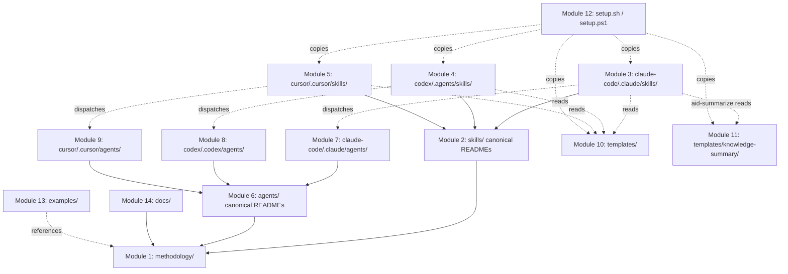

# Module Map

> **Source:** aid-discover (discovery-analyst)
> **Status:** Populated (initial dogfood pass)
> **Last Updated:** 2026-05-21

> Source of truth for file counts and line totals: `.aid/knowledge/project-index.md` (353 files, 49,226 lines). Source of truth for narrative repo shape: `.aid/knowledge/project-structure.md`. This document does NOT restate that inventory; it groups the inventory into the 14 functional **modules** of the AID repository and documents each module's dependencies, downstream consumers, and validation coverage.

## Important — What a "Module" Means Here

This repository is the **AID methodology + multi-tool install bundles**. There is no traditional source code (no Java/Python/Go/Node service, no `package.json`, no `pom.xml`, no compiled artifact). The repository is 249 markdown files + 43 shell scripts + 22 TOML agent files + 16 JavaScript files + a handful of CSS / HTML / PowerShell / JSON. Therefore the "modules" mapped below are **functional groupings of methodology assets**, not code modules:

- **Methodology spec** — the normative document.
- **Skills** (canonical + 3 install trees) — runnable phase definitions.
- **Agents** (canonical + 3 install trees) — runnable role definitions.
- **Templates** (canonical + 3 install trees) — KB / requirements / spec / report templates.
- **Knowledge-summary asset bundle** (canonical + 3 install trees) — HTML viewer for `aid-summarize`.
- **Installers** — the `setup.{sh,ps1}` scripts.
- **Examples** — anonymized case studies.
- **Reference docs** — adopter-facing `docs/`.

The **triplication relationship** (root canonical → `claude-code/.claude/...` → `codex/.agents/...` + `codex/.codex/agents/...` → `cursor/.cursor/...`) is documented per-module below and again in the dependency graph at the bottom.

---

## Module 1 — Methodology Spec

| Field | Value |
|-------|-------|
| **Path** | `methodology/` |
| **Files** | 5 (1 markdown + 4 PNG diagrams) |
| **Lines (markdown)** | 1,158 |
| **Key files** | `methodology/aid-methodology.md` (the V3 normative spec, 1,158 lines); `methodology/images/1-pipeline.png`, `2-comparison.png`, `3-ironman.png`, `4-feedback-loops.png` |
| **Purpose** | Single normative document for the AID methodology. Defines the **10 SKILL files** (1 setup [Init] + 8 development + 1 optional [Summarize] per user-confirmed canonical taxonomy DISCOVERY-STATE Q16), the feedback loops, the human-vs-AI division of labor, the knowledge-base shape, the artifact lifecycle, and the grading model. Every other module is downstream of this. The methodology document's own heading "## 3. The Nine Phases" is pending update to match the canonical 10-SKILL view per Q16 resolution (out-of-KB code change). |
| **Internal dependencies** | None. This is the root. |
| **External dependencies** | None at runtime. References the four PNG diagrams. |
| **Downstream consumers** | Every skill body, every agent body, every README, every template — they *implement* what this document specifies. |
| **Test / validation coverage** | None. There is no script that lints `aid-methodology.md` for structural integrity. ⚠️ Inferred from absence of `*.sh` / `*.mjs` referencing this path in `project-index.md`. |

---

## Module 2 — Skills (Canonical Human-Readable READMEs)

| Field | Value |
|-------|-------|
| **Path** | `skills/` |
| **Files** | 11 (top-level `README.md` + 10 skill folders, each with one `README.md`) |
| **Lines** | 1,162 across all skill READMEs (`skills/README.md` 77 + `aid-discover/README.md` 244 + `aid-deploy/README.md` 198 + `aid-interview/README.md` 191 + `aid-specify/README.md` 102 + `aid-plan/README.md` 93 + `aid-detail/README.md` 88 + `aid-execute/README.md` 58 + `aid-monitor/README.md` 28 + `aid-correct/README.md` 5 — placeholder) |
| **Key files** | `skills/README.md`, `skills/aid-discover/README.md`, plus one folder per skill |
| **Purpose** | Human-readable per-skill descriptions. No frontmatter, no allowed-tools, no argument-hint — these are the "what does this phase do, in prose" docs that contributors read first. |
| **Internal dependencies** | References `methodology/aid-methodology.md` (the canonical phase definitions); references `templates/` for the artifact shapes each skill produces. |
| **External dependencies** | None. |
| **Downstream consumers** | (a) Contributors reading the methodology. (b) The three install-tree SKILL.md authors — when a skill changes, all four files change per `CONTRIBUTING.md:21-26`. (c) Adopters whose tool has no install tree (e.g., GitHub Copilot, Antigravity) — the canonical READMEs are the manual-setup fallback per `README.md` quick-start fallback table. |
| **Test / validation coverage** | None. No script verifies that the human README and the three SKILL.md siblings stay in sync. ⚠️ Drift is possible and undetected — Anomaly 7 in `project-structure.md` documents `aid-discover` line counts of 244 (README) vs. 453 (Claude Code) vs. 1,078 (Codex) vs. 1,090 (Cursor). |
| **Placeholder / Tombstone** | `skills/aid-correct/README.md` is a 5-line **tombstone** — reads "# Correct (Deprecated)" and "This phase has been merged into Triage". Phase confirmed merged into Triage/Monitor per `methodology/aid-methodology.md:889`. Pending deletion per DISCOVERY-STATE Q6. Not counted as an active skill. |

---

## Module 3 — Skills (Claude Code Install Tree)

| Field | Value |
|-------|-------|
| **Path** | `claude-code/.claude/skills/` |
| **Files** | 24 (10 SKILL.md + 11 `references/*.md` + 2 `scripts/*.sh` + top-level `README.md`) — verified `find claude-code/.claude/skills -type f \| wc -l` = 24 |
| **Lines** | 4,028 (SKILL.md bodies total) + 952 (references/) + 105 (scripts/) |
| **Key files** | `aid-discover/SKILL.md` (453 lines), `aid-interview/SKILL.md` (477), `aid-init/SKILL.md` (438), `aid-summarize/SKILL.md` (430), `aid-specify/SKILL.md` (413), `aid-detail/SKILL.md` (390), `aid-execute/SKILL.md` (386), `aid-plan/SKILL.md` (336), `aid-deploy/SKILL.md` (265), `aid-monitor/SKILL.md` (242) |
| **Decomposition pattern** | When a skill grows large, Claude Code extracts content into sibling `references/*.md` and `scripts/*.sh` and the SKILL.md uses references-by-name. Codex and Cursor inline the same content. |
| **Internal dependencies** | Each SKILL.md frontmatter declares its `allowed-tools` (see table). All read from `.aid/knowledge/` and `templates/` directories at runtime. `aid-discover/SKILL.md:107` invokes `bash ../../templates/scripts/build-project-index.sh`. `aid-discover/SKILL.md:142-149` dispatches to the 5 discovery sub-agents under `claude-code/.claude/agents/discovery-*.md`. |
| **External dependencies** | The Claude Code CLI itself (frontmatter `allowed-tools` are Claude Code names: `Read, Glob, Grep, Bash, Write, Edit, Agent`). |
| **Downstream consumers** | The Claude Code agent runtime when a user types `/aid-{phase}`. Also referenced by `claude-code/CLAUDE.md` and `claude-code/.claude/skills/README.md`. |
| **Test / validation coverage** | `aid-discover` ships `scripts/verify-kb.sh` (60 lines) which checks 16-file presence, and `scripts/check-preflight.sh` (45 lines) which verifies init has run. `aid-summarize` references the `templates/knowledge-summary/scripts/` validators (`validate-html.sh`, `validate-links.sh`, `validate-diagrams.mjs`, `contrast-check.mjs`). No tests for the SKILL.md frontmatter schema itself. |

### Per-skill detail (Claude Code tree)

| Skill | SKILL.md lines | `allowed-tools` | references/ | scripts/ |
|-------|----------------|-----------------|-------------|----------|
| `aid-init` | 438 | Read, Glob, Grep, Bash, Write, Edit | — | — |
| `aid-discover` | 453 | Read, Glob, Grep, Bash, Write, Edit, Agent | `agent-prompts.md` (142), `document-expectations.md` (121), `reviewer-prompt.md` (75) | `check-preflight.sh` (45), `verify-kb.sh` (60) |
| `aid-interview` | 477 | Read, Glob, Grep, Bash, Write, Edit | `cross-reference.md` (97), `feature-decomposition.md` (82), `interview-strategies.md` (81), `kb-hydration.md` (106) | — |
| `aid-specify` | 413 | Read, Glob, Grep, Bash, Write, Edit | `handling-outcomes.md` (37), `known-issues-scope.md` (52) | — |
| `aid-plan` | 336 | Read, Glob, Grep, Write, Edit, Bash | — | — |
| `aid-detail` | 390 | Read, Glob, Grep, Write, Edit, Bash | — | — |
| `aid-execute` | 386 | Read, Glob, Grep, Write, Edit, Bash | `reviewer-guide.md` (82), `task-type-rules.md` (104) | — |
| `aid-deploy` | 265 | Read, Glob, Grep, Bash, Write | — | — |
| `aid-monitor` | 242 | Read, Glob, Grep, Bash, Write | — | — |
| `aid-summarize` | 430 | Read, Glob, Grep, Bash, Write, Edit | — | (uses `templates/knowledge-summary/scripts/`) |

(Lines and frontmatter cross-referenced against `project-index.md` and direct reads of `claude-code/.claude/skills/aid-discover/SKILL.md:1-10` and `claude-code/.claude/skills/aid-init/SKILL.md:1-10`. The `allowed-tools` for skills other than `aid-init`, `aid-discover` are inferred from `project-structure.md` Skills Inventory — ⚠️ not directly re-read this pass.)

---

## Module 4 — Skills (Codex Install Tree)

| Field | Value |
|-------|-------|
| **Path** | `codex/.agents/skills/` |
| **Files** | 12 (10 SKILL.md + 1 `references/kb-hydration.md` + 1 top-level `README.md`) — verified `find codex/.agents/skills -type f \| wc -l` = 12 |
| **Lines** | 5,888 (SKILL.md bodies total — significantly larger than Claude Code due to inlining) + 106 (references) |
| **Key files** | `aid-discover/SKILL.md` (1,078 lines — 2.4x Claude Code), `aid-interview/SKILL.md` (694), `aid-execute/SKILL.md` (558), `aid-specify/SKILL.md` (485), `aid-summarize/SKILL.md` (436), `aid-init/SKILL.md` (412), `aid-detail/SKILL.md` (386), `aid-plan/SKILL.md` (332), `aid-deploy/SKILL.md` (265), `aid-monitor/SKILL.md` (242) |
| **Frontmatter shape** | Same YAML shape as Claude Code (verified by reading `codex/.agents/skills/aid-discover/SKILL.md:1-10` — identical `name`, `description`, `allowed-tools: Read, Glob, Grep, Bash, Write, Edit, Agent`, `argument-hint`). ⚠️ The frontmatter mentions Claude Code tool names (`Agent`) but Codex's actual dispatch model may differ — see `external-sources.md` for vendor-doc gaps. |
| **Decomposition pattern** | Codex inlines what Claude Code factors out — that is why `aid-discover/SKILL.md` is 1,078 lines here vs. 453 + 142 + 121 + 75 = 791 lines in Claude Code, and why most skills have no `references/` siblings (the one exception, `aid-interview/references/kb-hydration.md`, is 106 lines and identical to Claude Code's). |
| **Internal dependencies** | Reads from `.aid/knowledge/` and `codex/.agents/templates/` at runtime. References `codex/.codex/agents/discovery-*.toml` for sub-agent dispatch. |
| **External dependencies** | The OpenAI Codex CLI runtime. |
| **Downstream consumers** | Codex CLI when invoked by a user with `/aid-{phase}` or equivalent. ⚠️ It is unclear from local files alone whether Codex CLI reads skills from `.agents/skills/` at all — flagged in `external-sources.md` for Codex. |
| **Test / validation coverage** | None — Codex tree does NOT carry the `verify-kb.sh` / `check-preflight.sh` scripts that Claude Code uses. ⚠️ Inferred from absence in `project-index.md` (no entries under `codex/.agents/skills/*/scripts/`). |

---

## Module 5 — Skills (Cursor Install Tree)

| Field | Value |
|-------|-------|
| **Path** | `cursor/.cursor/skills/` plus `cursor/.cursor/rules/*.mdc` |
| **Files** | 12 (10 SKILL.md + 1 `references/kb-hydration.md` + 1 top-level `README.md`) + 2 `.mdc` rules — verified `find cursor/.cursor/skills -type f \| wc -l` = 12 |
| **Lines** | 5,943 (SKILL.md bodies total — Cursor is slightly larger than Codex), 106 (references), 40 (rules: 29 + 11) |
| **Key files** | `aid-discover/SKILL.md` (1,090 lines — longest of the three trees), `aid-interview/SKILL.md` (698), `aid-execute/SKILL.md` (562), `aid-specify/SKILL.md` (488), `aid-summarize/SKILL.md` (436), `aid-init/SKILL.md` (438), `aid-detail/SKILL.md` (390), `aid-plan/SKILL.md` (336), `aid-deploy/SKILL.md` (265), `aid-monitor/SKILL.md` (242) |
| **Cursor-specific addition** | `cursor/.cursor/rules/aid-methodology.mdc` (always-on, 29 lines, `alwaysApply: true`) — injects KB-first workflow on every Cursor request. `cursor/.cursor/rules/aid-review.mdc` (glob-scoped, 11 lines, `globs: "**/*.{java,py,ts,js,cs,go,rs}"`, `alwaysApply: false`) — adds review constraints when editing code files. |
| **Frontmatter shape** | Same YAML as Claude Code (`name`, `description`, `allowed-tools`, `argument-hint` — verified at `cursor/.cursor/skills/aid-discover/SKILL.md:1-10`). |
| **Internal dependencies** | Reads from `.aid/knowledge/` and `cursor/.cursor/templates/`. References `cursor/.cursor/agents/discovery-*.md` (markdown, same shape as Claude Code agents). |
| **External dependencies** | The Cursor IDE runtime. Per `cursor/AGENTS.md`, the Task tool is marked experimental as of March 2026. |
| **Downstream consumers** | Cursor when a user invokes a skill. `cursor/README.md:142` indicates Cursor will also read skills from `.claude/skills/` and `.codex/skills/` for cross-tool compatibility. |
| **Test / validation coverage** | None — same gap as Codex. |

---

## Module 6 — Agents (Canonical Human-Readable READMEs)

| Field | Value |
|-------|-------|
| **Path** | `agents/` |
| **Files** | 17 READMEs (top-level `README.md` + 16 agent folders per `project-index.md`). ⚠️ Per `project-structure.md`, the canonical `agents/` tree includes 7 Core + 6 Specialist + 3 Utility = 16 + the top-level `README.md`. Discovery sub-agents are documented *implicitly* by the Researcher README and live as runnable files only under the three install trees. |
| **Lines** | 1,289 (all READMEs summed) |
| **Key files** | `agents/README.md` (174 — the index), then per-agent: `reviewer/README.md` (103), `simple-glob/README.md` (89), `orchestrator/README.md` (83), `simple-extractor/README.md` (83), `simple-formatter/README.md` (78), `developer/README.md` (69), `architect/README.md` (68), `operator/README.md` (66), `interviewer/README.md` (64), `researcher/README.md` (63), `data-engineer/README.md` (53), `devops/README.md` (52), `performance/README.md` (52), `security/README.md` (52), `tech-writer/README.md` (51), `ux-designer/README.md` (49) |
| **Purpose** | Human-readable agent role definitions: What You Do, What You Don't Do, Key Constraints, Output Format, When to Escalate. |
| **Internal dependencies** | References `methodology/aid-methodology.md`, `templates/` for output formats. |
| **Downstream consumers** | (a) Contributors. (b) Authors of the three install trees (`.claude/agents/`, `.codex/agents/`, `.cursor/agents/`). (c) Adopters with manual setup. |
| **Test / validation coverage** | None. |

---

## Module 7 — Agents (Claude Code Install Tree)

| Field | Value |
|-------|-------|
| **Path** | `claude-code/.claude/agents/` |
| **Files** | 22 (all `.md` with YAML frontmatter) |
| **Lines** | 1,743 |
| **Tier breakdown** | **6 discovery sub-agents** (all Opus, all `permissionMode: bypassPermissions`, all `background: true`): `discovery-reviewer.md` (381 — by far the largest), `discovery-architect.md` (172), `discovery-scout.md` (153), `discovery-quality.md` (145), `discovery-analyst.md` (105), `discovery-integrator.md` (103). **7 Core**: `orchestrator.md` (50, Sonnet), `reviewer.md` (60, Opus), `architect.md` (40, Opus), `developer.md` (39, Sonnet), `operator.md` (39, Sonnet), `interviewer.md` (39, Opus), `researcher.md` (38, Sonnet). **6 Specialist**: `performance.md` (34), `security.md` (34), `data-engineer.md` (33), `tech-writer.md` (33), `devops.md` (32), `ux-designer.md` (31). **3 Utility** (Haiku tier): `simple-extractor.md` (50), `simple-glob.md` (46), `simple-formatter.md` (36). |
| **Frontmatter shape** | YAML with `name`, `description`, `tools` (comma-separated list — NOT YAML array), `model` (one of `opus`/`sonnet`/`haiku`), optional `permissionMode: bypassPermissions`, optional `background: true`. Verified at `claude-code/.claude/agents/architect.md:1-6` and `claude-code/.claude/agents/discovery-reviewer.md:1-11`. |
| **Internal dependencies** | Called by skills via the `Agent` tool. `aid-discover/SKILL.md:142-149` lists the discovery sub-agent dispatch mapping. |
| **External dependencies** | Claude Code agent runtime. |
| **Downstream consumers** | The Claude Code Agent tool. Skills under `claude-code/.claude/skills/` dispatch these agents. |
| **Test / validation coverage** | None. No frontmatter schema validation. |

---

## Module 8 — Agents (Codex Install Tree)

| Field | Value |
|-------|-------|
| **Path** | `codex/.codex/agents/` |
| **Files** | 22 `.toml` |
| **Lines** | 1,522 (TOML total) |
| **Tier breakdown** | Same 22 agents as Claude Code in TOML format. The 6 discovery sub-agents map to `gpt-5.5` + `model_reasoning_effort = "high"`: `discovery-reviewer.toml` (314), `discovery-architect.toml` (169), `discovery-quality.toml` (142), `discovery-scout.toml` (127), `discovery-analyst.toml` (102), `discovery-integrator.toml` (100). Architect (`architect.toml` 39, `gpt-5.5` / `high`) verified directly. Utility tier maps to `gpt-5.4-mini` + `model_reasoning_effort = "low"` — verified at `codex/.codex/agents/simple-extractor.toml:3-4`. |
| **Frontmatter shape** | TOML at top of file: `name = "..."`, `description = "..."`, `model = "..."`, `model_reasoning_effort = "..."`, then `developer_instructions = """..."""` (triple-quoted multi-line string containing the agent's prose body). Verified at `codex/.codex/agents/architect.toml:1-5` and `codex/.codex/agents/simple-extractor.toml:1-5`. |
| **Tier mapping (VERIFIED)** | Opus → `gpt-5.5` + `high`. Sonnet → `gpt-5.4` + `medium` (VERIFIED per DISCOVERY-STATE Q36 + reviewer spot-check #17: `grep model codex/.codex/agents/{orchestrator,operator,researcher,developer,interviewer}.toml` all return the same). Haiku → `gpt-5.4-mini` + `low`. The May 2026 migration note in `codex/README.md:35` documents that prior inconsistencies were corrected; this discovery verified the corrections held across all 22 agents × 3 trees (`tech-debt.md L6`). |
| **Internal dependencies** | Called by skills under `codex/.agents/skills/`. |
| **External dependencies** | OpenAI Codex CLI runtime. Whether Codex honors `model_reasoning_effort` is unconfirmed against vendor docs (flagged in `external-sources.md`). |
| **Downstream consumers** | Codex CLI. |
| **Test / validation coverage** | None. |
| **Notable divergence from Claude Code body** | `codex/.codex/agents/discovery-reviewer.toml` references `AGENTS.md` instead of `CLAUDE.md` as the project context file, and writes its review to `DISCOVERY-GRADE.md` instead of `DISCOVERY-STATE.md` (verified at `codex/.codex/agents/discovery-reviewer.toml:37` and `codex/.codex/agents/discovery-reviewer.toml:258` vs. `claude-code/.claude/agents/discovery-reviewer.md:74` and `claude-code/.claude/agents/discovery-reviewer.md:304`). This is real **drift** between trees — same agent, different output filename and different project context filename. ⚠️ See Q30 below. |

---

## Module 9 — Agents (Cursor Install Tree)

| Field | Value |
|-------|-------|
| **Path** | `cursor/.cursor/agents/` |
| **Files** | 22 `.md` (same set as Claude Code, in markdown + YAML frontmatter) |
| **Lines** | 1,747 (essentially identical to Claude Code's 1,743 — minor offsets per agent) |
| **Frontmatter shape** | Same YAML as Claude Code (`name`, `description`, `tools`, `model`, optional `permissionMode`, optional `background`). |
| **Internal dependencies** | Called by skills under `cursor/.cursor/skills/`. |
| **External dependencies** | Cursor IDE runtime. ⚠️ Per `cursor/AGENTS.md`, the Task tool is experimental as of March 2026 — sub-agent dispatch from skills may not work the same way it does in Claude Code. |
| **Downstream consumers** | Cursor agent runtime. `cursor/README.md` indicates cross-tool reading from `.claude/agents/` and `.codex/agents/` may also occur. |
| **Test / validation coverage** | None. |

---

## Module 10 — Templates (Canonical)

| Field | Value |
|-------|-------|
| **Path** | `templates/` |
| **Files** | `knowledge-base/` (17 markdown templates including `INDEX.md` and `README.md`), `requirements/` (1), `specs/` (1), `delivery-plans/` (1 — `task-template.md`), `feedback-artifacts/` (1 — `IMPEDIMENT.md`), `reports/` (1 — `discovery-state-template.md`), `knowledge-summary/` (25 — see Module 11), `scripts/` (2 — `build-project-index.sh` 368, `grade.sh` 141), and root `grading-rubric.md` (74), `implementation-state.md` (30), `README.md` (49). |
| **Lines** | See `project-index.md` for exact counts. Highlights: `knowledge-base/coding-standards.md` 118, `knowledge-base/api-contracts.md` 110, `knowledge-base/architecture.md` 111, `knowledge-base/data-model.md` 108, `requirements/requirements-template.md` 95, `specs/spec-template.md` 75, `delivery-plans/task-template.md` 20, `feedback-artifacts/IMPEDIMENT.md` 118. |
| **Purpose** | Source-of-truth artifact templates. Each AID phase produces files using these as starting shapes. |
| **Internal dependencies** | None on each other (each template is self-contained). |
| **External dependencies** | None at build time; some templates assume Mermaid is renderable downstream (e.g., `data-model.md` and `module-map.md` embed `mermaid` code blocks). |
| **Downstream consumers** | The three install-tree templates directories (`claude-code/.claude/templates/`, `codex/.agents/templates/`, `cursor/.cursor/templates/`) carry verbatim copies — see `project-index.md` showing every large template script appearing **four times** (root + three trees). |
| **Test / validation coverage** | `templates/scripts/build-project-index.sh` is itself an executable producing structured output, but no test verifies it. `templates/knowledge-summary/scripts/*` validate the *output* of `aid-summarize` but not the templates themselves. |
| **Notable gaps** | `templates/README.md:31` references `templates/feedback-artifacts/MONITOR-STATE.md` and `templates/README.md:37` references `templates/reports/track-report-template.md` — **neither file exists on disk** (verified by `Glob` against `project-index.md`). Per DISCOVERY-STATE Q8 / Q31 / Q77 resolution: **author both templates**. Tracked as `tech-debt.md H7`. Also: the 6 discovery sub-agents (architect, analyst, integrator, quality, scout, reviewer) currently lack individual READMEs under `agents/<name>/README.md` — pending authoring per DISCOVERY-STATE Q18. |

### Per-template consumption matrix (the KB document templates)

| Template | Lines | Producer skill | Consumer skill(s) |
|----------|-------|----------------|-------------------|
| `knowledge-base/INDEX.md` | 28 | aid-discover Step 6 | every downstream skill (task context) |
| `knowledge-base/architecture.md` | 111 | aid-discover (discovery-architect) | aid-specify, aid-plan |
| `knowledge-base/module-map.md` | 90 | aid-discover (discovery-analyst) | aid-specify, aid-execute |
| `knowledge-base/technology-stack.md` | 93 | aid-discover (discovery-architect) | aid-execute (Build/Lint commands) |
| `knowledge-base/coding-standards.md` | 118 | aid-discover (discovery-analyst) | aid-execute, reviewer |
| `knowledge-base/data-model.md` | 108 | aid-discover (discovery-analyst) | aid-specify (Data Model section), aid-execute |
| `knowledge-base/api-contracts.md` | 110 | aid-discover (discovery-integrator) | aid-specify |
| `knowledge-base/integration-map.md` | 117 | aid-discover (discovery-integrator) | aid-specify, aid-execute |
| `knowledge-base/domain-glossary.md` | 100 | aid-discover (discovery-integrator) | every downstream skill |
| `knowledge-base/test-landscape.md` | 111 | aid-discover (discovery-quality) | aid-execute (Test Commands) |
| `knowledge-base/security-model.md` | 117 | aid-discover (discovery-quality) | aid-specify, reviewer |
| `knowledge-base/tech-debt.md` | 118 | aid-discover (discovery-quality) | aid-plan (sequencing) |
| `knowledge-base/infrastructure.md` | 121 | aid-discover (discovery-quality) | aid-deploy |
| `knowledge-base/external-sources.md` | 55 | aid-init + aid-discover (discovery-scout) | discovery-architect, discovery-integrator |
| `knowledge-base/project-structure.md` | 75 | aid-discover (discovery-scout) | all downstream skills |
| `knowledge-base/feature-inventory.md` | 8 | aid-discover (FIX-cycle) | aid-interview, aid-specify |
| `knowledge-base/README.md` | 81 | aid-discover Step 6 | humans |

### Per-template consumption matrix (artifact templates, root)

| Template | Lines | Producer skill | Consumer skill(s) |
|----------|-------|----------------|-------------------|
| `requirements/requirements-template.md` | 95 | aid-interview | aid-specify |
| `specs/spec-template.md` | 75 | aid-specify | aid-plan, aid-execute |
| `delivery-plans/task-template.md` | 20 | aid-detail | aid-execute |
| `implementation-state.md` (root) | 30 | aid-execute | aid-execute reviewer loop |
| `feedback-artifacts/IMPEDIMENT.md` | 118 | aid-execute | aid-specify, aid-plan (revision) |
| `reports/discovery-state-template.md` | 67 | aid-discover (discovery-reviewer) | aid-discover (Q&A, FIX modes) |
| `grading-rubric.md` (root) | 74 | (constant) | every reviewer agent |

### Per-template consumption matrix (install-tree-only templates)

These templates exist ONLY under the install trees, not at the canonical `templates/` root (genuine asymmetry — ⚠️ Q32):

| Template | Lines | Producer skill | Consumer skill(s) | Path |
|----------|-------|----------------|-------------------|------|
| `discovery-state.md` | 23 | aid-init | aid-discover (state machine) | `{tree}/templates/discovery-state.md` |
| `interview-state.md` | 29 | aid-interview | aid-interview (resume) | `{tree}/templates/interview-state.md` |
| `feature.md` | 33 | aid-interview | aid-specify | `{tree}/templates/feature.md` |
| `feature-state.md` | 22 | aid-specify | aid-specify (resume) | `{tree}/templates/feature-state.md` |
| `feature-inventory.md` | 8 | aid-discover (FIX cycle) | aid-interview | `{tree}/templates/feature-inventory.md` |
| `implementation-state.md` | 30 | aid-execute | aid-execute (resume) | `{tree}/templates/implementation-state.md` |
| `deployment-state.md` | 9 | aid-deploy | aid-deploy (resume) | `{tree}/templates/deployment-state.md` |
| `package.md` | 27 | aid-deploy | aid-deploy | `{tree}/templates/package.md` |
| `known-issues.md` | 15 | aid-specify | aid-plan | `{tree}/templates/known-issues.md` |
| `grading-rubric.md` | 74 | (constant) | reviewer agents | `{tree}/templates/grading-rubric.md` |
| `ui-architecture.md` | 5 (each install-tree variant) | aid-discover (discovery-architect) | aid-specify | ⚠️ **Asymmetry per DISCOVERY-STATE Q114 + Q126**: NO `templates/knowledge-base/ui-architecture.md` at canonical root (verified `ls templates/knowledge-base/` returns 17 files: 15 KB-doc templates + INDEX + README); BUT each install tree DOES ship a 5-line stub at `claude-code/.claude/templates/ui-architecture.md`, `codex/.agents/templates/ui-architecture.md`, `cursor/.cursor/templates/ui-architecture.md` (verified). Resolution: lift the install-tree stub to canonical root + flesh it out so the 16-doc template story is complete. |

---

## Module 11 — Knowledge-Summary Asset Bundle

| Field | Value |
|-------|-------|
| **Path** | `templates/knowledge-summary/` (canonical) + same content under each install tree |
| **Files** | 25 per location × 4 locations = 100 file entries in `project-index.md` |
| **Lines (canonical)** | Major files: 642 (`component-css.css`) + 359 (`lightbox.js`) + 294 (`scripts/validate-diagrams.mjs`) + 248 (`prompt.md`) + 226 (`grading-rubric.md`) + 194 (`scripts/grade.sh`) + 187 (`mermaid-examples.md`) + 151 (`scripts/contrast-check.mjs`) + 138 (`scripts/writeback-discovery-state.sh`) + 125 (`accessibility-checklist.md`) + 124 (`design-tokens.md`) + 101 (`html-skeleton.html`) + 100 (`scripts/check-preflight.sh`) + 98 (`section-templates/web-app.md`) + 94 (`scripts/validate-html.sh`) + 93 (`scripts/stale-check.sh`) + 87 (`section-templates/microservices.md`) + 78 (`scripts/validate-links.sh`) + 77 (`scripts/fetch-mermaid.sh`) + 77 (`section-templates/cli.md`) + 70 (`section-templates/library.md`) + 53 (`mermaid-init.js`) + 36 (`scripts/concatenate.ps1`) + 23 (`scripts/concatenate.sh`) + 107 (`section-templates/auto-detect.md`) + 104 (`section-templates/data-pipeline.md`) |
| **Purpose** | Asset bundle that `aid-summarize` consumes to generate a single offline `knowledge-summary.html` from `.aid/knowledge/`. Includes HTML skeleton, CSS design tokens, JavaScript for the lightbox + mermaid initialization, section templates per project profile, and a suite of validation scripts. |
| **Internal dependencies** | None (self-contained). |
| **External dependencies** | Mermaid (for diagram rendering — fetched by `scripts/fetch-mermaid.sh`). WCAG-AA color contrast validated by `scripts/contrast-check.mjs`. |
| **Downstream consumers** | Only `aid-summarize` skill. Output is a single HTML file consumed by humans in a browser. |
| **Test / validation coverage** | This module IS the validation layer. `scripts/validate-html.sh`, `scripts/validate-links.sh`, `scripts/validate-diagrams.mjs`, `scripts/contrast-check.mjs`, `scripts/check-preflight.sh`, `scripts/stale-check.sh` validate the *generated HTML output* — not the assets themselves. |

---

## Module 12 — Installers

| Field | Value |
|-------|-------|
| **Path** | repo root |
| **Files** | 2 (`setup.sh` 161 lines, `setup.ps1` 156 lines) |
| **Purpose** | Interactive menu installer. Lets the user pick one or more of Claude Code / Codex / Cursor; copies the matching tree into a target project directory. Safe re-run: skips identical files, prompts on differences, `--force` overwrites. |
| **Internal dependencies** | Reads from `claude-code/`, `codex/`, `cursor/` trees. Does NOT regenerate them — pure copy. |
| **External dependencies** | None beyond bash / PowerShell. |
| **Downstream consumers** | End users who clone this repo to install AID into their own project. |
| **Test / validation coverage** | None. No script verifies installer parity between sh and ps1, or that the install tree it copies actually matches the canonical sources. |

---

## Module 13 — Examples

| Field | Value |
|-------|-------|
| **Path** | `examples/` |
| **Files** | 9 (top-level `README.md` 27 + `brownfield-enterprise/` 3 files + `desktop-app/` 3 files + `data-pipeline/` 2 files) |
| **Lines** | 610 across all examples |
| **Purpose** | Three anonymized case studies showing AID in production-like settings: brownfield-enterprise (21 GB Java/OSGi monorepo, 3-day discovery), desktop-app (.NET/Avalonia/MVVM transcription app, 0 to 1,100+ tests across 6 deliveries), data-pipeline (multi-brand e-commerce analytics, 12 specialist agents, 5 data sources, 1% tolerance). |
| **Internal dependencies** | References templates by shape (`discovery-report.md`, `delivery-plan.md`, `task-spec.md`, `pipeline-architecture.md`) but does not import them. |
| **External dependencies** | None. |
| **Downstream consumers** | Humans evaluating whether AID fits their workflow. |
| **Test / validation coverage** | None. |

---

## Module 14 — Reference Docs

| Field | Value |
|-------|-------|
| **Path** | `docs/` |
| **Files** | 2 (`faq.md` 61, `glossary.md` 80) |
| **Purpose** | Adopter-facing reference: FAQ (tool-agnosticism, multi-tool usage, AID vs. SDD comparison) and glossary (terminology). |
| **Internal dependencies** | References `methodology/aid-methodology.md`, top-level `README.md`. |
| **External dependencies** | None. |
| **Downstream consumers** | Humans evaluating AID; new contributors. |
| **Test / validation coverage** | None. |

---

## Triplication Relationship — Same Asset, Three Tool Trees

Because no tooling propagates changes between trees, every skill/agent/template change must be made up to **four times**. The drift surface across trees has already been demonstrated:

| Asset | Root canonical | claude-code | codex | cursor |
|-------|----------------|-------------|-------|--------|
| `aid-discover` skill body | `skills/aid-discover/README.md` (244 lines, human README) | `claude-code/.claude/skills/aid-discover/SKILL.md` (453) + 3 references (338) + 2 scripts (105) = 896 lines spread across 6 files | `codex/.agents/skills/aid-discover/SKILL.md` (1,078, all inlined) | `cursor/.cursor/skills/aid-discover/SKILL.md` (1,090, all inlined) |
| `aid-interview` skill body | `skills/aid-interview/README.md` (191) | `claude-code/.claude/skills/aid-interview/SKILL.md` (477) + 4 references (366) | `codex/.agents/skills/aid-interview/SKILL.md` (694) + 1 reference (106) | `cursor/.cursor/skills/aid-interview/SKILL.md` (698) + 1 reference (106) |
| `discovery-reviewer` agent body | `agents/reviewer/README.md` (103, generic reviewer doc) | `claude-code/.claude/agents/discovery-reviewer.md` (381) | `codex/.codex/agents/discovery-reviewer.toml` (314) | `cursor/.cursor/agents/discovery-reviewer.md` (381) |
| `architect` agent body | `agents/architect/README.md` (68) | `claude-code/.claude/agents/architect.md` (40) | `codex/.codex/agents/architect.toml` (39) | `cursor/.cursor/agents/architect.md` (40) |
| `templates/scripts/build-project-index.sh` | `templates/scripts/build-project-index.sh` (368) | `claude-code/.claude/templates/scripts/build-project-index.sh` (368) | `codex/.agents/templates/scripts/build-project-index.sh` (368) | `cursor/.cursor/templates/scripts/build-project-index.sh` (368) |

**Observed drift** (real, on disk, not hypothetical):
1. `discovery-reviewer` writes to `DISCOVERY-STATE.md` in Claude Code/Cursor but `DISCOVERY-GRADE.md` in Codex (Q30 — see analyst questions).
2. `discovery-reviewer` reads `CLAUDE.md` as project context in Claude Code, `AGENTS.md` in Codex — both correct for their host tool, but a contributor updating only the Claude Code version will not propagate any semantic change.
3. SKILL.md bodies for `aid-discover`, `aid-interview`, `aid-execute`, `aid-specify` are 2x–2.4x larger in Codex/Cursor because Claude Code factors content into `references/` siblings. A change to a `references/` file in Claude Code is INVISIBLE unless the contributor also re-inlines into Codex and Cursor.
4. `templates/README.md` references `MONITOR-STATE.md` and `track-report-template.md`, which exist in NO tree (Q31).
5. Codex `discovery-reviewer.toml` Document Expectations references `open-questions.md` (line 220) while Claude Code (line 261) references `additional-info.md` — same logical concept, different filename. Confirms Q30 is widespread.

---

## Dependency Graph

Textual (Mermaid-readable) graph of how the modules depend on each other at design time. Arrows point from consumer to producer.



**Key flows** (text form):

```
aid-discover (Claude Code)
  -> reads templates/scripts/build-project-index.sh (Step 0c)
  -> dispatches discovery-scout, discovery-architect, discovery-analyst,
     discovery-integrator, discovery-quality (Steps 1-5)
  -> dispatches discovery-reviewer (REVIEW mode)
  -> reads templates/knowledge-base/*.md as starting shapes
  -> writes to .aid/knowledge/*.md
  -> updates .aid/knowledge/DISCOVERY-STATE.md (was created by aid-init)

aid-summarize (Claude Code)
  -> reads .aid/knowledge/*.md
  -> reads templates/knowledge-summary/{html-skeleton.html, component-css.css,
     lightbox.js, mermaid-init.js, prompt.md, design-tokens.md, section-templates/*}
  -> runs templates/knowledge-summary/scripts/{check-preflight.sh, stale-check.sh,
     validate-html.sh, validate-links.sh, validate-diagrams.mjs, contrast-check.mjs}
  -> writes .aid/knowledge/knowledge-summary.html
  -> runs writeback-discovery-state.sh to update DISCOVERY-STATE.md
```

---

## Revision History

| Rev | Date | Source | Description |
|-----|------|--------|-------------|
| 1.0 | 2026-05-21 | aid-discover (discovery-analyst) | Initial dogfood pass: 14 functional modules mapped, triplication relationship documented, dependency graph generated, drift instances cited. |
