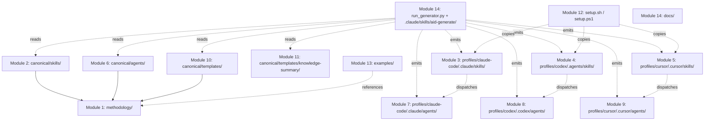

# Module Map

> **Source:** aid-discover (discovery-analyst)
> **Status:** Populated (cycle-11 FIX — post work-002 canonical-generator + work-003 FR2 area-STATE)
> **Last Updated:** 2026-05-23

> Source of truth for file counts and line totals: `.aid/knowledge/project-index.md` (631 files, 90,011 lines, regenerated 2026-05-23). Source of truth for narrative repo shape: `.aid/knowledge/project-structure.md`. This document does NOT restate that inventory; it groups the inventory into the **14 functional modules** of the AID repository and documents each module's dependencies, downstream consumers, and validation coverage.

## Important — What a "Module" Means Here

This repository is the **AID methodology + multi-tool install bundles**. There is no traditional source code (no Java/Python/Go/Node service, no `package.json`, no `pom.xml`, no compiled artifact). Therefore the "modules" mapped below are **functional groupings of methodology assets**, not code modules:

- **Methodology spec** — the normative document at `methodology/`.
- **Skills** — canonical authority at `canonical/skills/`, generated into 3 install trees by `run_generator.py`.
- **Agents** — canonical authority at `canonical/agents/`, generated into 3 install trees.
- **Templates** — canonical authority at `canonical/templates/`, generated into 3 install trees.
- **Knowledge-summary asset bundle** — canonical authority at `canonical/templates/knowledge-summary/`, generated into 3 install trees.
- **Canonical generator** — the propagation tool at `run_generator.py` + `.claude/skills/aid-generate/scripts/`.
- **Installers** — the `setup.sh` / `setup.ps1` scripts.
- **Examples** — anonymized case studies.
- **Reference docs** — adopter-facing `docs/`.

**The canonical-generator pattern (work-002, deployed 2026-05):** `run_generator.py` (top-level, 84 lines) reads each `profiles/{tool}.toml`, loads canonical sources from `canonical/{agents,skills,templates,rules}/`, and emits the per-tool install tree under `profiles/{tool}/...`. Every change goes to `canonical/` first; the 3 install trees plus the dogfood `.claude/` tree are propagated automatically. The pre-work-002 narrative — "3 install trees as parallel sources of truth maintained by manual cross-tree sync" — is RETIRED. There is no longer any divergence between trees for the same logical asset (verified: all 3 profile `aid-discover/SKILL.md` files are 258 lines, byte-identical, matching `canonical/skills/aid-discover/SKILL.md`).

---

## Module 1 — Methodology Spec

| Field | Value |
|-------|-------|
| **Path** | `methodology/` |
| **Files** | 5 (1 markdown + 4 PNG diagrams) |
| **Lines (markdown)** | 1,071 (`methodology/aid-methodology.md` per `project-index.md:351`) |
| **Key files** | `methodology/aid-methodology.md` (the V3 normative spec, 1,071 lines); `methodology/images/2-comparison.png`, `3-ironman.png`, plus 2 other diagram PNGs |
| **Purpose** | Single normative document for the AID methodology. Defines the **10 SKILL files** (1 setup [Init] + 8 development + 1 optional [Summarize] per user-confirmed canonical taxonomy DISCOVERY-STATE Q16), the feedback loops, the human-vs-AI division of labor, the knowledge-base shape, the artifact lifecycle, and the grading model. Every other module is downstream of this. |
| **Internal dependencies** | None. This is the root. |
| **External dependencies** | None at runtime. References the PNG diagrams. |
| **Downstream consumers** | Every skill body, every agent body, every README, every template — they *implement* what this document specifies. |
| **Test / validation coverage** | None. There is no script that lints `aid-methodology.md` for structural integrity. ⚠️ Inferred from absence of `*.sh` / `*.mjs` referencing this path in `project-index.md`. |

---

## Module 2 — Skills (Canonical — Source of Truth)

| Field | Value |
|-------|-------|
| **Path** | `canonical/skills/` |
| **Files** | 92 across 10 skill folders: 10 SKILL.md + 10 README.md + 72 `references/*.md` (state-keyed + thematic per skill, e.g. aid-discover has 6 state-*.md + 3 prompt-aux; aid-interview has 12 state-*.md + 6 aux; etc.) + 6 `scripts/*.sh` (5 in `aid-discover/`, 2 in `aid-interview/`) (verified via `find canonical/skills`) |
| **Lines (SKILL.md bodies)** | 2,108 total: `aid-discover/SKILL.md` (258), `aid-interview/SKILL.md` (357), `aid-init/SKILL.md` (119), `aid-summarize/SKILL.md` (233), `aid-execute/SKILL.md` (279), `aid-specify/SKILL.md` (207), `aid-detail/SKILL.md` (77), `aid-plan/SKILL.md` (208), `aid-deploy/SKILL.md` (147), `aid-monitor/SKILL.md` (223), `aid-generate/SKILL.md` (261, in `.claude/skills/` — not under `canonical/skills/`, see Module 14) |
| **Lines (references/)** | 845 total (e.g., `aid-discover/references/agent-prompts.md` 142, `aid-interview/references/kb-hydration.md` 106, `aid-execute/references/task-type-rules.md` 104, `aid-specify/references/known-issues-scope.md` 52, etc.) |
| **Lines (scripts/)** | ~705 total: `aid-discover/scripts/check-preflight.sh` 45 + `aid-discover/scripts/verify-kb.sh` 60; `aid-interview/scripts/parse-recipe.sh` 540 + `aid-interview/scripts/test-parse-recipe.sh` (smoke); `aid-interview/scripts/test-lite-subpaths.sh`; `aid-interview/scripts/test-lite-to-full-escalation.sh` |
| **Lines (per-skill READMEs)** | 1,068 total: `aid-discover/README.md` (236), `aid-deploy/README.md` (199), `aid-interview/README.md` (193), `aid-specify/README.md` (104), `aid-plan/README.md` (95), `aid-detail/README.md` (90), `aid-execute/README.md` (60), `aid-init/README.md` (36), `aid-summarize/README.md` (35), `aid-monitor/README.md` (30) |
| **Purpose** | Canonical source-of-truth for every skill. Each `canonical/skills/aid-{phase}/` folder holds the SKILL.md (LLM body), an optional human-oriented README.md, optional `references/*.md` siblings (factored prompts/explanations), and optional `scripts/*.sh` for runtime helpers. `run_generator.py` reads from here and emits identical copies into each profile's install tree. |
| **Internal dependencies** | References `methodology/aid-methodology.md` for phase definitions; references `canonical/templates/` for artifact shapes; references `canonical/agents/` for sub-agent dispatch. |
| **External dependencies** | None. |
| **Downstream consumers** | `run_generator.py` (which propagates to the 3 install trees + dogfood `.claude/`). Contributors authoring methodology changes. |
| **Test / validation coverage** | `aid-discover/scripts/verify-kb.sh` (60 lines) checks 16-file presence; `aid-discover/scripts/check-preflight.sh` (45 lines) verifies init has run. Generator output is verified by `.claude/skills/aid-generate/scripts/verify_deterministic.py` (513 lines), invoked by `run_generator.py`. No frontmatter schema validator. |
| **Tombstones** | The old top-level `canonical/skills/aid-correct/README.md` (5-line "merged into Triage" tombstone) no longer exists — the entire pre-work-002 top-level `skills/` directory was removed. Correct merge is documented in `methodology/aid-methodology.md` and `architecture.md`. |

### Per-skill detail (canonical — identical across all 3 profile trees post-generator)

| Skill | SKILL.md lines | `allowed-tools` | references/ files | scripts/ files |
|-------|----------------|-----------------|-------------------|----------------|
| `aid-init` | 119 | Read, Glob, Grep, Bash, Write, Edit | step-0-preflight.md, step-1-collect.md, step-2-scaffold.md, step-3-meta-docs.md, step-4-setup.md | — |
| `aid-discover` | 258 | Read, Glob, Grep, Bash, Write, Edit, Agent | state-generate.md, state-review.md, state-q-and-a.md, state-fix.md, state-approval.md, state-done.md, plus agent-prompts.md (142), document-expectations.md (121), reviewer-prompt.md (75) | check-preflight.sh (45), verify-kb.sh (60) |
| `aid-interview` | 357 | Read, Glob, Grep, Bash, Write, Edit | 12 state-*.md (state-first-run, state-q-and-a, state-triage, state-continue, state-completion, state-feature-decomposition, state-cross-reference, state-done, state-condensed-intake, state-task-breakdown, state-lite-review, state-lite-done) + 6 aux (cross-reference.md, feature-decomposition.md, interview-strategies.md, kb-hydration.md, lite-to-full-escalation.md, recipe-to-lite-escalation.md) | parse-recipe.sh (540), test-parse-recipe.sh |
| `aid-specify` | 207 | Read, Glob, Grep, Bash, Write, Edit | state-initialize.md, state-continue.md, state-spike.md, state-blocked.md, state-review.md, state-done.md, plus handling-outcomes.md (37), known-issues-scope.md (52) | — |
| `aid-plan` | 208 | Read, Glob, Grep, Write, Edit, Bash | first-run-loop.md, review-deliverables.md | — |
| `aid-detail` | 77 | Read, Glob, Grep, Write, Edit, Bash | first-run.md, review.md, task-decomposition.md, execution-graph-generation.md | — |
| `aid-execute` | 279 | Read, Glob, Grep, Write, Edit, Bash | state-execute.md, state-review.md, state-fix.md, state-delivery-gate.md, state-re-run.md, reviewer-guide.md (82), task-type-rules.md (104) | — |
| `aid-deploy` | 147 | Read, Glob, Grep, Bash, Write | state-idle.md, state-selecting.md, state-verifying.md, state-packaging.md, state-re-run.md | — |
| `aid-monitor` | 223 | Read, Glob, Grep, Bash, Write | state-observe.md, state-classify.md, state-route.md | — |
| `aid-summarize` | 233 | Read, Glob, Grep, Bash, Write, Edit | state-preflight.md, state-stale-check.md, state-profile.md, state-generate.md, state-validate.md, state-manual-checklist.md, state-writeback.md, state-done.md, plus 2 aux | (uses `canonical/templates/knowledge-summary/scripts/`) |

(Counts cross-referenced against `project-index.md` regenerated 2026-05-23. All 3 profile trees and the dogfood `.claude/skills/` contain byte-identical SKILL.md files emitted from `canonical/skills/` by `run_generator.py`.)

---

## Module 3 — Skills (Claude Code Install Tree — Generated)

| Field | Value |
|-------|-------|
| **Path** | `profiles/claude-code/.claude/skills/` |
| **Files** | 25 (10 SKILL.md + 9 `references/*.md` + 2 `scripts/*.sh` + 4 top-level entries including `README.md`) — verified via `project-index.md` (paths 377-400) |
| **Lines (SKILL.md bodies)** | 2,108 total — byte-identical to `canonical/skills/` (258 + 279 + 77 + 207 + 147 + 223 + 208 + 119 + 357 + 233) |
| **Generation** | Emitted from `canonical/skills/` by `run_generator.py` via `.claude/skills/aid-generate/scripts/render_skills.py` (450 lines). Emission manifest at `profiles/claude-code/emission-manifest.jsonl` records every file. |
| **Frontmatter** | YAML — `name`, `description`, `allowed-tools` (comma-separated string, NOT YAML array), `argument-hint`. May add `context: fork` / `agent: <name>` per Claude Code conventions. |
| **Internal dependencies** | Each SKILL.md declares its `allowed-tools` (see Module 2 table). All read from `.aid/knowledge/` and `profiles/claude-code/.claude/templates/` at runtime. `aid-discover/SKILL.md` dispatches the 5 discovery sub-agents under `profiles/claude-code/.claude/agents/discovery-*.md`. |
| **External dependencies** | The Claude Code CLI runtime. |
| **Downstream consumers** | The Claude Code agent runtime when a user types `/aid-{phase}`. Also referenced by `profiles/claude-code/CLAUDE.md`. |
| **Test / validation coverage** | Same as Module 2 — `verify-kb.sh` + `check-preflight.sh` are propagated into this tree (`profiles/claude-code/.claude/skills/aid-discover/scripts/{check-preflight.sh,verify-kb.sh}`). No frontmatter schema validation. |

---

## Module 4 — Skills (Codex Install Tree — Generated)

| Field | Value |
|-------|-------|
| **Path** | `profiles/codex/.agents/skills/` (skills + references) + `profiles/codex/.codex/agents/` (TOML agent files) |
| **Files** | 25 in `.agents/skills/` (10 SKILL.md + 9 `references/*.md` + 2 `scripts/*.sh` + 4 top-level) — paths 469-500+ in `project-index.md` |
| **Lines (SKILL.md bodies)** | 2,108 total — **byte-identical to canonical and to Claude Code** (258 + 279 + 77 + 207 + 147 + 223 + 208 + 119 + 357 + 233). The pre-work-002 narrative of "Codex inlines what Claude Code factors out → 2.4× larger" is RETIRED — all three trees now ship the same SKILL.md plus the same `references/` siblings. |
| **Generation** | Emitted from `canonical/skills/` by `run_generator.py`. Emission manifest at `profiles/codex/emission-manifest.jsonl`. |
| **Frontmatter** | Same YAML shape as Claude Code. Codex omits `context:` / `agent:` extras. |
| **Internal dependencies** | Reads from `.aid/knowledge/` and `profiles/codex/.agents/templates/` at runtime. References `profiles/codex/.codex/agents/discovery-*.toml` for sub-agent dispatch. |
| **External dependencies** | The OpenAI Codex CLI runtime. |
| **Downstream consumers** | Codex CLI when invoked by a user. |
| **Test / validation coverage** | Same propagated scripts as Module 3 — `verify-kb.sh` + `check-preflight.sh` ship in this tree too post-generator. |

---

## Module 5 — Skills (Cursor Install Tree — Generated)

| Field | Value |
|-------|-------|
| **Path** | `profiles/cursor/.cursor/skills/` plus `profiles/cursor/.cursor/rules/*.mdc` |
| **Files** | 25 in `.cursor/skills/` (10 SKILL.md + 9 `references/*.md` + 2 `scripts/*.sh` + 4 top-level) + 2 `.mdc` rules |
| **Lines (SKILL.md bodies)** | 2,108 total — byte-identical to canonical and to the other profile trees. |
| **Generation** | Emitted from `canonical/skills/` + `canonical/rules/` by `run_generator.py`. |
| **Cursor-specific additions** | `profiles/cursor/.cursor/rules/aid-methodology.mdc` (40 lines per `project-index.md:238`, `alwaysApply: true`) — injects KB-first workflow on every Cursor request. `profiles/cursor/.cursor/rules/aid-review.mdc` (11 lines, `globs: "**/*.{java,py,ts,js,cs,go,rs}"`, `alwaysApply: false`) — adds review constraints when editing code files. Sourced from `canonical/rules/`. |
| **Frontmatter** | Same YAML as Claude Code. Cursor uses `tools: ... Terminal` instead of `Bash` (Q52 — handled by `render_skills.py` profile-aware substitution). |
| **Internal dependencies** | Reads from `.aid/knowledge/` and `profiles/cursor/.cursor/templates/`. References `profiles/cursor/.cursor/agents/discovery-*.md`. |
| **External dependencies** | The Cursor IDE runtime. |
| **Downstream consumers** | Cursor when a user invokes a skill. |
| **Test / validation coverage** | Same propagated scripts as Module 3. |

---

## Module 6 — Agents (Canonical — Source of Truth)

| Field | Value |
|-------|-------|
| **Path** | `canonical/agents/` (one folder per agent: `architect/`, `data-engineer/`, `developer/`, `devops/`, `discovery-analyst/`, `discovery-architect/`, `discovery-integrator/`, `discovery-quality/`, `discovery-reviewer/`, `discovery-scout/`, `interviewer/`, `operator/`, `orchestrator/`, `performance/`, `researcher/`, `reviewer/`, `security/`, `simple-extractor/`, `simple-formatter/`, `simple-glob/`, `tech-writer/`, `ux-designer/`) |
| **Files** | 44 total — 22 `AGENT.md` (LLM body) + 22 `README.md` (human docs); verified via `project-index.md` paths 193-236 |
| **Lines (AGENT.md bodies)** | 2,074 total — `discovery-reviewer/AGENT.md` (405 — by far the largest), `discovery-architect/AGENT.md` (172), `discovery-quality/AGENT.md` (145), `discovery-scout/AGENT.md` (110), `discovery-analyst/AGENT.md` (105), `discovery-integrator/AGENT.md` (103), `reviewer/AGENT.md` (60), `simple-extractor/AGENT.md` (50), `orchestrator/AGENT.md` (49), `simple-glob/AGENT.md` (46), `architect/AGENT.md` (39), `developer/AGENT.md` (39), `interviewer/AGENT.md` (39), `operator/AGENT.md` (39), `researcher/AGENT.md` (38), `simple-formatter/AGENT.md` (36), `performance/AGENT.md` (34), `security/AGENT.md` (34), `data-engineer/AGENT.md` (33), `tech-writer/AGENT.md` (33), `devops/AGENT.md` (32), `ux-designer/AGENT.md` (31) |
| **Lines (READMEs)** | 1,333 total — `reviewer/README.md` (106), `simple-glob/README.md` (91), `simple-extractor/README.md` (85), `orchestrator/README.md` (84), `simple-formatter/README.md` (80), `developer/README.md` (71), `architect/README.md` (69), `operator/README.md` (68), `interviewer/README.md` (66), `researcher/README.md` (65), `data-engineer/README.md` (55), `devops/README.md` (54), `performance/README.md` (54), `security/README.md` (54), `tech-writer/README.md` (53), `ux-designer/README.md` (51), `simple-formatter/README.md` (80), discovery sub-agent READMEs (40-49 each). |
| **Purpose** | Canonical source-of-truth for all 22 agents. `AGENT.md` is the LLM-facing body, `README.md` is the human-facing role doc (What You Do, What You Don't Do, Key Constraints, Output Format, When to Escalate). |
| **Internal dependencies** | References `methodology/aid-methodology.md`, `canonical/templates/` for output formats. |
| **Downstream consumers** | `run_generator.py` (propagation). Contributors. |
| **Test / validation coverage** | None at the agent level. Generator's `verify_deterministic.py` confirms output byte-equality across profile trees. |

---

## Module 7 — Agents (Claude Code Install Tree — Generated)

| Field | Value |
|-------|-------|
| **Path** | `profiles/claude-code/.claude/agents/` |
| **Files** | 22 (all `.md` with YAML frontmatter) — emitted from `canonical/agents/*/AGENT.md` |
| **Lines** | 2,074 (same as canonical AGENT.md totals) |
| **Tier breakdown** | **6 discovery sub-agents** (all Opus, all `permissionMode: bypassPermissions`, all `background: true`): `discovery-reviewer.md` (378), `discovery-architect.md` (172), `discovery-scout.md` (110), `discovery-quality.md` (145), `discovery-analyst.md` (105), `discovery-integrator.md` (103). **7 Core**: `orchestrator.md` (49, Sonnet), `reviewer.md` (60, Opus), `architect.md` (39, Opus), `developer.md` (39, Sonnet), `operator.md` (39, Sonnet), `interviewer.md` (39, Opus), `researcher.md` (38, Sonnet). **6 Specialist**: `performance.md` (34), `security.md` (34), `data-engineer.md` (33), `tech-writer.md` (33), `devops.md` (32), `ux-designer.md` (31). **3 Utility** (Haiku tier): `simple-extractor.md` (50), `simple-glob.md` (46), `simple-formatter.md` (36). |
| **Frontmatter shape** | YAML with `name`, `description`, `tools` (comma-separated), `model` (one of `opus`/`sonnet`/`haiku`), optional `permissionMode: bypassPermissions`, optional `background: true`. |
| **Internal dependencies** | Called by skills via the `Agent` tool. `aid-discover/SKILL.md` lists the discovery sub-agent dispatch mapping. |
| **External dependencies** | Claude Code agent runtime. |
| **Downstream consumers** | Claude Code Agent tool. Skills under `profiles/claude-code/.claude/skills/` dispatch these agents. |
| **Test / validation coverage** | Generator verify_deterministic.py confirms emission integrity. |

---

## Module 8 — Agents (Codex Install Tree — Generated)

| Field | Value |
|-------|-------|
| **Path** | `profiles/codex/.codex/agents/` |
| **Files** | 22 `.toml` — emitted from `canonical/agents/*/AGENT.md` (markdown body wrapped in `developer_instructions = """..."""`) |
| **Lines** | ~1,500 total TOML (slightly smaller than markdown equivalents due to no separate header markup; body identical). |
| **Tier mapping (VERIFIED, generator-enforced)** | Opus → `gpt-5.5` + `model_reasoning_effort = "high"`. Sonnet → `gpt-5.4` + `medium`. Haiku → `gpt-5.4-mini` + `low`. Mapping defined in `profiles/codex.toml` (78 lines) and applied by `render_agents.py`. |
| **Frontmatter shape** | TOML: `name`, `description`, `model`, `model_reasoning_effort`, then `developer_instructions = """..."""` (triple-quoted multi-line containing the markdown body). |
| **Internal dependencies** | Called by skills under `profiles/codex/.agents/skills/`. |
| **External dependencies** | OpenAI Codex CLI runtime. |
| **Downstream consumers** | Codex CLI. |
| **Test / validation coverage** | Generator verify_deterministic.py. |
| **Notable** | Pre-work-002 there was real cross-tree drift (`discovery-reviewer` writing to `DISCOVERY-GRADE.md` in Codex vs `DISCOVERY-STATE.md` in Claude Code; different open-questions filenames). Post-generator, drift is canonicalized — any tool-specific filename substitution is centralized in `render_agents.py` and `harness.substitute_filenames`. ⚠️ The canonical `discovery-reviewer/AGENT.md` writes to `STATE.md` (Discovery area) post-FR2, not `DISCOVERY-STATE.md` or `DISCOVERY-GRADE.md`. |

---

## Module 9 — Agents (Cursor Install Tree — Generated)

| Field | Value |
|-------|-------|
| **Path** | `profiles/cursor/.cursor/agents/` |
| **Files** | 22 `.md` (same set as Claude Code, in markdown + YAML frontmatter) — emitted from canonical. |
| **Lines** | 2,074 (essentially identical to Claude Code; minor profile-specific substitutions like `tools: ... Terminal` vs `Bash`). |
| **Frontmatter shape** | Same YAML as Claude Code (`name`, `description`, `tools`, `model`, optional `permissionMode`, optional `background`). |
| **Internal dependencies** | Called by skills under `profiles/cursor/.cursor/skills/`. |
| **External dependencies** | Cursor IDE runtime. ⚠️ Per `profiles/cursor/AGENTS.md`, the Task tool is marked experimental — sub-agent dispatch may behave differently than Claude Code. |
| **Downstream consumers** | Cursor agent runtime. |
| **Test / validation coverage** | Generator verify_deterministic.py. |

---

## Module 10 — Templates (Canonical — Source of Truth)

| Field | Value |
|-------|-------|
| **Path** | `canonical/templates/` |
| **Files** | Top-level: `discovery-state-template.md` (83), `work-state-template.md` (137), `feature.md` (33), `feature-inventory.md` (8), `grading-rubric.md` (75), `known-issues.md` (15), `package.md` (27), `README.md` (42), `requirements.md` (30), `rough-time-hints.md` (28), `ui-architecture.md` (5). Subfolders: `knowledge-base/` (18 markdown templates including `INDEX.md` and `README.md`), `requirements/` (1 — `requirements-template.md` 95), `specs/` (1 — `spec-template.md` 75), `delivery-plans/` (1 — `task-template.md` 19), `feedback-artifacts/` (1 — `IMPEDIMENT.md` 116), `knowledge-summary/` (25 — see Module 11), `scripts/` (3 — `build-project-index.sh` 368, `grade.sh` 141, `verify-kb-claims.sh` 356). |
| **Highlights** | `knowledge-base/coding-standards.md` 118, `knowledge-base/api-contracts.md` 110, `knowledge-base/architecture.md` 111, `knowledge-base/data-model.md` 108, `requirements/requirements-template.md` 95, `specs/spec-template.md` 75, `delivery-plans/task-template.md` 19, `feedback-artifacts/IMPEDIMENT.md` 116. |
| **Purpose** | Source-of-truth artifact templates. Each AID phase produces files using these as starting shapes. **All templates are lifted to `canonical/templates/` and propagated to the 3 install trees by `run_generator.py`** — there are no more install-tree-only orphans post-KB-F1 (work-003 cleanup). |
| **Internal dependencies** | None on each other (each template is self-contained). |
| **External dependencies** | Some templates assume Mermaid is renderable downstream (e.g., `data-model.md` and `module-map.md` embed `mermaid` code blocks). |
| **Downstream consumers** | The 3 install-tree templates directories (`profiles/claude-code/.claude/templates/`, `profiles/codex/.agents/templates/`, `profiles/cursor/.cursor/templates/`) are byte-identical mirrors emitted by `render_templates.py` (245 lines, in `.claude/skills/aid-generate/scripts/`). |
| **Test / validation coverage** | `canonical/templates/scripts/build-project-index.sh` is itself an executable producing structured output. `canonical/templates/scripts/verify-kb-claims.sh` (356 lines) validates KB-document claims against on-disk reality. `canonical/templates/knowledge-summary/scripts/*` validate the *output* of `aid-summarize`. Generator's `verify_deterministic.py` ensures byte-equality across trees. |
| **Notable gaps** | `canonical/templates/README.md` references `MONITOR-STATE.md` and `track-report-template.md` — **neither file exists**, deferred with the Monitor area (Q31, OQ-3). Tracked as `tech-debt.md H7`. |

### Per-template consumption matrix (the KB document templates)

| Template (path under `canonical/templates/knowledge-base/`) | Lines | Producer skill | Consumer skill(s) |
|----------|-------|----------------|-------------------|
| `INDEX.md` | 30 | aid-discover Step 6 | every downstream skill (task context) |
| `architecture.md` | 111 | aid-discover (discovery-architect) | aid-specify, aid-plan |
| `module-map.md` | 90 | aid-discover (discovery-analyst) | aid-specify, aid-execute |
| `technology-stack.md` | 93 | aid-discover (discovery-architect) | aid-execute (Build/Lint commands) |
| `coding-standards.md` | 118 | aid-discover (discovery-analyst) | aid-execute, reviewer |
| `data-model.md` | 108 | aid-discover (discovery-analyst) | aid-specify (Data Model section), aid-execute |
| `api-contracts.md` | 110 | aid-discover (discovery-integrator) | aid-specify |
| `integration-map.md` | 117 | aid-discover (discovery-integrator) | aid-specify, aid-execute |
| `domain-glossary.md` | 100 | aid-discover (discovery-integrator) | every downstream skill |
| `test-landscape.md` | 111 | aid-discover (discovery-quality) | aid-execute (Test Commands) |
| `security-model.md` | 117 | aid-discover (discovery-quality) | aid-specify, reviewer |
| `tech-debt.md` | 118 | aid-discover (discovery-quality) | aid-plan (sequencing) |
| `infrastructure.md` | 121 | aid-discover (discovery-quality) | aid-deploy |
| `external-sources.md` | 55 | aid-init + aid-discover (discovery-scout) | discovery-architect, discovery-integrator |
| `project-structure.md` | 75 | aid-discover (discovery-scout) | all downstream skills |
| `ui-architecture.md` | 129 | aid-discover (discovery-architect) | aid-specify |
| `feature-inventory.md` | 8 | aid-discover (FIX-cycle) | aid-interview, aid-specify |
| `README.md` | 83 | aid-discover Step 6 | humans |

### Per-template consumption matrix (state + artifact templates, top-level)

| Template (path under `canonical/templates/`) | Lines | Producer skill | Consumer skill(s) |
|----------|-------|----------------|-------------------|
| `discovery-state-template.md` | 83 | aid-init (skeleton), aid-discover + aid-summarize (update) | aid-discover state machine, aid-summarize writeback |
| `work-state-template.md` | 137 | aid-init (skeleton), every dev-lifecycle skill (update) | every dev-lifecycle skill (resume) |
| `requirements/requirements-template.md` | 95 | aid-interview | aid-specify |
| `requirements.md` (top-level shorthand) | 30 | aid-interview seed | aid-interview |
| `specs/spec-template.md` | 75 | aid-specify | aid-plan, aid-execute |
| `delivery-plans/task-template.md` | 19 | aid-detail | aid-execute |
| `feature.md` | 33 | aid-interview | aid-specify |
| `feature-inventory.md` | 8 | aid-discover (FIX cycle) | aid-interview |
| `package.md` | 27 | aid-deploy | aid-deploy |
| `known-issues.md` | 15 | aid-specify | aid-plan |
| `ui-architecture.md` (top-level stub, 5 lines) | 5 | aid-discover (discovery-architect) seed | aid-specify |
| `feedback-artifacts/IMPEDIMENT.md` | 116 | aid-execute | aid-specify, aid-plan (revision) |
| `grading-rubric.md` | 75 | (constant) | every reviewer agent |
| `rough-time-hints.md` | 28 | (constant reference) | aid-plan, aid-detail |

**Note (KB-F1 cleanup):** The pre-cleanup "install-tree-only templates" table is obsolete. All templates that previously existed only under `profiles/{tool}/.../templates/` (the 6 orphans identified in Q190: `feature.md`, `feature-inventory.md`, `known-issues.md`, `package.md`, `requirements.md`, `ui-architecture.md`) have been lifted to `canonical/templates/` and are now propagated by `run_generator.py`. Verified 2026-05-23: `diff <(find canonical/templates -type f) <(find profiles/claude-code/.claude/templates -type f)` returns no output (zero diff). Per-artifact state templates retired by work-003 FR2 (per-area STATE rule — `coding-standards.md §8.5`) are deleted from `canonical/templates/` and all 3 install trees; the two replacement area-STATE templates are `work-state-template.md` and `discovery-state-template.md`.

---

## Module 11 — Knowledge-Summary Asset Bundle

| Field | Value |
|-------|-------|
| **Path** | `canonical/templates/knowledge-summary/` (source of truth) + propagated mirrors under each profile tree at `profiles/{tool}/.../templates/knowledge-summary/` |
| **Files** | 25 per location × 4 locations (canonical + 3 profiles) = 100 file entries in `project-index.md` |
| **Lines (canonical, key files)** | `component-css.css` 657, `validate-diagrams.mjs` 574, `grade.sh` 527, `lightbox.js` 359, `manual-checklist.sh` 269, `prompt.md` 253, `grading-rubric.md` 261, `validate-html.sh` 259, `mermaid-examples.md` 192, `spot-check-facts.sh` 176, `writeback-state.sh` 173 (renamed from `writeback-discovery-state.sh`), `contrast-check.mjs` 151, `accessibility-checklist.md` 125, `design-tokens.md` 124, `section-templates/auto-detect.md` 115, `section-templates/data-pipeline.md` 110, `stale-check.sh` 107, `section-templates/web-app.md` 104, `html-skeleton.html` 101, `check-preflight.sh` 100, `section-templates/microservices.md` 93, `section-templates/cli.md` 83, `validate-links.sh` 78, `fetch-mermaid.sh` 77, `section-templates/library.md` 76, `mermaid-init.js` 53, `concatenate.ps1` 36, `concatenate.sh` 23 |
| **Purpose** | Asset bundle that `aid-summarize` consumes to generate a single offline `knowledge-summary.html` from `.aid/knowledge/`. Includes HTML skeleton, CSS design tokens, JavaScript for the lightbox + mermaid initialization, section templates per project profile, and a suite of validation scripts. |
| **Internal dependencies** | None (self-contained). |
| **External dependencies** | Mermaid (fetched by `scripts/fetch-mermaid.sh`). WCAG-AA color contrast validated by `scripts/contrast-check.mjs`. |
| **Downstream consumers** | Only `aid-summarize` skill. Output is a single HTML file consumed by humans in a browser. |
| **Test / validation coverage** | This module IS the validation layer. `scripts/validate-html.sh`, `scripts/validate-links.sh`, `scripts/validate-diagrams.mjs`, `scripts/contrast-check.mjs`, `scripts/check-preflight.sh`, `scripts/stale-check.sh` validate the *generated HTML output*. `scripts/writeback-state.sh` appends to `.aid/knowledge/STATE.md` (Discovery area, FR2). |

---

## Module 12 — Installers

| Field | Value |
|-------|-------|
| **Path** | repo root |
| **Files** | 2 (`setup.sh` 162 lines, `setup.ps1` 157 lines) |
| **Purpose** | Interactive menu installer. Lets the user pick one or more of Claude Code / Codex / Cursor; copies the matching profile tree into a target project directory. Safe re-run: skips identical files, prompts on differences, `--force` overwrites. |
| **Internal dependencies** | Reads from `profiles/{claude-code,codex,cursor}/`. Does NOT regenerate them — pure copy of the already-generated install trees. |
| **External dependencies** | None beyond bash / PowerShell. |
| **Downstream consumers** | End users who clone this repo to install AID into their own project. |
| **Test / validation coverage** | None. No script verifies installer parity between sh and ps1, or that the install tree it copies actually matches the canonical sources (that's `run_generator.py`'s responsibility). |

---

## Module 13 — Examples

| Field | Value |
|-------|-------|
| **Path** | `examples/` |
| **Files** | 9 (top-level `README.md` 27 + `brownfield-enterprise/` 3 files + `desktop-app/` 3 files + `data-pipeline/` 2 files) |
| **Lines** | 610 across all examples |
| **Purpose** | Three anonymized case studies showing AID in production-like settings: brownfield-enterprise (21 GB Java/OSGi monorepo, 3-day discovery), desktop-app (.NET/Avalonia/MVVM transcription app, 0 to 1,100+ tests across 6 deliveries), data-pipeline (multi-brand e-commerce analytics, 12 specialist agents, 5 data sources, 1% tolerance). |
| **Internal dependencies** | References templates by shape (`discovery-report.md`, `delivery-plan.md`, `task-spec.md`, `pipeline-architecture.md`) but does not import them. |
| **External dependencies** | None. |
| **Downstream consumers** | Humans evaluating whether AID fits their workflow. |
| **Test / validation coverage** | None. |

---

## Module 14 — Canonical Generator + Reference Docs

| Field | Value |
|-------|-------|
| **Path** | `run_generator.py` (top-level, 84 lines), `.claude/skills/aid-generate/scripts/` (the generator implementation, 8 Python files), `docs/` (2 files) |
| **Files** | `run_generator.py` (84 lines), `.claude/skills/aid-generate/scripts/{harness.py 615, profile.py 516, verify_deterministic.py 513, render_agents.py 503, render_skills.py 450, verify_advisory.py 343, test_manifest_safety.py 254, render_templates.py 245}` = 3,439 lines of Python. Plus `docs/faq.md` 61, `docs/glossary.md` 76. Profile manifests: `profiles/claude-code.toml` 64, `profiles/codex.toml` 78, `profiles/cursor.toml` (in `profiles/`). |
| **Purpose** | The canonical-generator pipeline (work-002). `run_generator.py` orchestrates: for each `profiles/*.toml`, load profile → render agents + skills + templates from `canonical/` → diff against previous manifest → delete removed files → write new manifest. Followed by `verify_deterministic.py` (VERIFY-4a, deterministic byte-equality) and `verify_advisory.py` (VERIFY-4b, advisory checks). The dogfood `.claude/` tree is also a generator output (claude-code profile rendered at repo root for self-use). Plus `docs/` for adopter-facing FAQ + glossary. |
| **Internal dependencies** | Reads `canonical/` + `profiles/*.toml`; writes `profiles/{tool}/...` and `.claude/` (claude-code profile dogfood). Emission manifests at `profiles/{tool}/emission-manifest.jsonl` track what was written. |
| **External dependencies** | Python 3.11+. |
| **Downstream consumers** | Humans running `python run_generator.py` after editing `canonical/`. Adopters reading `docs/`. |
| **Test / validation coverage** | `test_manifest_safety.py` (254 lines) is the only Python test. `verify_deterministic.py` confirms byte-equality of generator output across trees. `verify_advisory.py` runs structural checks. |

---

## Canonical → Profile Tree Relationship (post-canonical-generator)

Since work-002, every skill/agent/template edit goes to `canonical/` and `run_generator.py` propagates to the 4 destinations. The pre-work-002 "manual quadruplicate edits" discipline is RETIRED.

| Asset | Canonical source | Profile mirrors (all 3 identical, post-generator) | Dogfood mirror |
|-------|------------------|----------------------------------------------------|----------------|
| `aid-discover` SKILL.md | `canonical/skills/aid-discover/SKILL.md` (258) | `profiles/{claude-code,codex,cursor}/.../skills/aid-discover/SKILL.md` (258 each) | `.claude/skills/aid-discover/SKILL.md` (258) |
| `aid-discover` references | `canonical/skills/aid-discover/references/{agent-prompts,document-expectations,reviewer-prompt}.md` | propagated identically to all 3 profiles | propagated to `.claude/` |
| `aid-interview` SKILL.md | `canonical/skills/aid-interview/SKILL.md` (357) | `profiles/{...}/skills/aid-interview/SKILL.md` (357 each) | `.claude/skills/aid-interview/SKILL.md` (357) |
| `discovery-reviewer` agent body | `canonical/agents/discovery-reviewer/AGENT.md` (405) | `profiles/claude-code/.claude/agents/discovery-reviewer.md` (378), `profiles/codex/.codex/agents/discovery-reviewer.toml` (~314 TOML), `profiles/cursor/.cursor/agents/discovery-reviewer.md` (378) | `.claude/agents/discovery-reviewer.md` (378) |
| `architect` agent body | `canonical/agents/architect/AGENT.md` (39) | `profiles/claude-code/.claude/agents/architect.md` (39), `profiles/codex/.codex/agents/architect.toml` (39), `profiles/cursor/.cursor/agents/architect.md` (39) | `.claude/agents/architect.md` (39) |
| `canonical/templates/scripts/build-project-index.sh` | `canonical/templates/scripts/build-project-index.sh` (368) | propagated 1:1 to 3 profile trees | propagated to `.claude/` |

**Generator-enforced invariants** (verified by `verify_deterministic.py`):
1. For each canonical asset, the rendered body in every profile is byte-identical to canonical (modulo profile-specific tool-name substitution, e.g., `Bash` → `Terminal` for Cursor — handled deterministically by `render_skills.py`).
2. No file in `canonical/` is orphaned in any profile (every canonical asset has a rendered output).
3. No file in any profile is unaccounted for in the emission manifest (drift detection).
4. Codex tier mapping (Opus→`gpt-5.5`+high, Sonnet→`gpt-5.4`+medium, Haiku→`gpt-5.4-mini`+low) is verified across all 22 agents.

**Residual discipline** (post-generator):
- Profile-specific filenames (e.g., `CLAUDE.md` vs `AGENTS.md` for project-context) are handled by `harness.substitute_filenames` in a centralized table — no longer per-file manual sync.
- ⚠️ The orphan-detection check inside `run_generator.py` is still pending hardening (Q190 follow-up) — currently relies on the deletion pass picking up removed canonical files; new install-tree-only files are detected by `verify_advisory.py` but not blocked.

---

## Dependency Graph



**Key flows** (text form):

```
aid-discover (canonical)
  -> reads canonical/templates/scripts/build-project-index.sh (Step 0c)
  -> dispatches discovery-scout, discovery-architect, discovery-analyst,
     discovery-integrator, discovery-quality (Steps 1-5)
  -> dispatches discovery-reviewer (REVIEW mode)
  -> reads canonical/templates/knowledge-base/*.md as starting shapes
  -> writes to .aid/knowledge/*.md
  -> updates .aid/knowledge/STATE.md (Discovery area — created by aid-init)

aid-summarize (canonical)
  -> reads .aid/knowledge/*.md
  -> reads canonical/templates/knowledge-summary/{html-skeleton.html, component-css.css,
     lightbox.js, mermaid-init.js, prompt.md, design-tokens.md, section-templates/*}
  -> runs canonical/templates/knowledge-summary/scripts/{check-preflight.sh, stale-check.sh,
     validate-html.sh, validate-links.sh, validate-diagrams.mjs, contrast-check.mjs}
  -> writes .aid/knowledge/knowledge-summary.html
  -> runs writeback-state.sh to append Summarization History row to .aid/knowledge/STATE.md
```

---

## Revision History

| Rev | Date | Source | Description |
|-----|------|--------|-------------|
| 1.0 | 2026-05-21 | aid-discover (discovery-analyst) | Initial dogfood pass: 14 functional modules mapped, triplication relationship documented, dependency graph generated, drift instances cited. |
| 1.1 | 2026-05-23 | aid-discover cycle-11 FIX (KB-FIX work) | Module 2-3 (and analogously 4-5, 6-9, 10-11) rewritten to describe the canonical-generator pattern post-work-002: `canonical/` is now the source of truth; `run_generator.py` propagates to 3 profile trees + dogfood `.claude/`. Per-skill SKILL.md line counts refreshed from `project-index.md` (2026-05-23): aid-discover 258, aid-interview 357, aid-init 119, aid-summarize 233, aid-execute 279, aid-specify 207, aid-detail 77, aid-plan 208, aid-deploy 147, aid-monitor 223 — all byte-identical across canonical + 3 profile trees + dogfood. Install-tree-only templates table retired (KB-F1 lifted all 6 orphans into canonical). Triplication Relationship table renamed/rewritten as "Canonical → Profile Tree Relationship". Module 14 added documenting `run_generator.py` + 8 Python generator files. STATE-file references updated to `.aid/knowledge/STATE.md` (Discovery area) per FR2. Resolves cycle-11 HIGH findings on module-map.md Module 2-3 paths, per-skill line counts, and install-tree-only templates table. |
