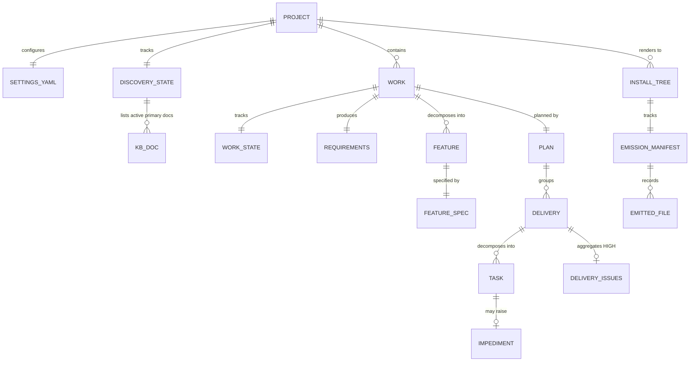

# Schemas

> **There is no database.** AID is a methodology + multi-tool distribution; it
> ships skills, agents, templates, recipes, and helper scripts. Every "schema"
> below is a document or config contract — YAML, JSONL, or structured Markdown —
> that the pipeline reads + writes.

## 1. Database

| Property | Value |
|----------|-------|
| **Type** | None — no DB. AID ships no application; state lives in filesystem documents. |
| **Persistent state** | `.aid/` directory tree (settings, knowledge base, per-work state, generated artifacts) |
| **Ephemeral state** | `.aid/.heartbeat/` (subagent heartbeat files, gitignored per `.gitignore` `.aid/.heartbeat/`), `.aid/.temp/` (skill scratch / review-pending ledgers) |
| **Cache** | `.aid/knowledge/.cache/` (Mermaid library cache for `aid-summarize`; gitignored per `.gitignore` `.aid/knowledge/.cache/`) |
| **Configs (non-runtime)** | `profiles/*.toml` (generator profiles), `.claude/settings.json` (Claude Code permissions) |

---

## 2. Settings — `.aid/settings.yml`

**Source of truth:** `canonical/templates/settings.yml` → rendered identically into all 3 install trees and copied to `.aid/settings.yml` by `/aid-config` on first run.

**Schema (YAML 1.2, per `canonical/templates/settings.yml` header `# .aid/settings.yml — AID pipeline configuration`):**

| Path | Type | Default | Purpose |
|------|------|---------|---------|
| `project.name` | string | `<project-name>` | Set during `/aid-config` INIT |
| `project.description` | string | `<project-description>` | Sole source of truth (not duplicated in CLAUDE.md/AGENTS.md per `settings.yml` `description:` comment "sole source of truth") |
| `project.type` | enum `brownfield`|`greenfield` | `brownfield` | Project class |
| `tools.installed` | list of strings | `[claude-code]` | Which install trees are active; valid values: `claude-code`, `codex`, `cursor` |
| `review.minimum_grade` | grade string | `A` | Quality bar for every skill's REVIEW state |
| `execution.max_parallel_tasks` | int | `5` | Parallel pool dispatch capacity (FR6 / work-001 feature-009) |
| `traceability.heartbeat_interval` | int (minutes) | `1` | L3 heartbeat interval; `0` disables heartbeat entirely |
| `<skill>.minimum_grade` | grade string | — | Optional per-skill override; falls back to `review.minimum_grade` |

**Grade enum** (per `canonical/templates/settings.yml` comment `# Valid grade values:`):
```
A+, A, A-, B+, B, B-, C+, C, C-, D+, D, D-, E+, E, E-, F
```

**Per-skill override skills** (per `canonical/templates/settings.yml` `# Examples:` block):
`discover`, `summary`, `interview`, `specify`, `plan`, `detail`, `execute`,
`deploy`, `monitor` — each may set `minimum_grade:`.

**Resolution helper:** `canonical/scripts/config/read-setting.sh` implements
the per-skill override → global default → hardcoded `--default` fallback
(per its header comment `read-setting.sh` "canonical resolution order").

### 2a. `discovery.doc_set` — Declared KB Doc-Set

**Source of truth:** `canonical/skills/aid-discover/references/doc-set-resolve.md`.

**Purpose:** declares which KB documents are in scope for this project's discovery run,
who owns each, and whether each is required or conditional. Absent → the default seed is
synthesized from `canonical/templates/knowledge-base/*.md` by `synth_default_seed`.

**Schema (YAML block-list inside the `discovery:` section of `.aid/settings.yml`):**

```yaml
discovery:
  doc_set:
    - architecture.md|discovery-architect|required
    - infrastructure.md|discovery-quality|conditional:has CI/CD or deployment config
    # each item: filename | owner | presence[:when]
```

**Field grammar** (per `canonical/skills/aid-discover/references/doc-set-resolve.md` `### Field grammar`):

| Field | Constraints | Purpose |
|-------|-------------|---------|
| `filename` | basename under `.aid/knowledge/`; no path separator | Joins to doc frontmatter `kb-category:` and to `document-expectations.md` `### <filename>` |
| `owner` | one of `discovery-scout`, `discovery-architect`, `discovery-analyst`, `discovery-integrator`, `discovery-quality`, `orchestrator` | Determines which agent produces this doc |
| `presence` | `required` or `conditional`; MAY carry `:<when>` suffix | `<when>` is a human display hint — not machine-evaluated; the user-confirm step is the gate |

**Delimiter constraint:** No field value may contain a comma. `read-setting.sh`'s
`lookup_list` round-trips items through comma-join/comma-split; a comma inside a field
value (including the `<when>` hint) shreds the record into spurious fragments. Rephrase
any list-like `when` with `;` or `/` (e.g., `conditional:has CI; CD; or deploy config`).

**When the section is absent or empty:** `resolve_doc_set` delegates to
`synth_default_seed`, which enumerates `canonical/templates/knowledge-base/*.md` and
applies the §2.2 ownership map (single source of truth — edit the map to change defaults).
This is backward-compatible: an unmodified settings.yml runs discovery with the canonical
standard doc-set.

**Accepting the default during propose→confirm writes nothing to settings.yml** — the
absent-section-means-default-seed invariant is preserved (per `state-generate.md`
`### On confirm (resume path)`).

**Source:** `canonical/skills/aid-discover/references/doc-set-resolve.md` `## Schema: discovery.doc_set in .aid/settings.yml`

---

## 3. Discovery State — `.aid/knowledge/STATE.md`

**Source of truth:** `canonical/templates/discovery-state-template.md`.

**Purpose:** the per-area state hub for the Discovery area (per FR2 area-state
consolidation — see `coding-standards.md §7e`). Absorbs former `DISCOVERY-STATE.md` +
`SUMMARY-STATE.md`.

**Schema (Markdown, per `canonical/templates/discovery-state-template.md` `# Discovery State`):**

| Section | Shape | Cardinality |
|---------|-------|-------------|
| Top-level metadata (blockquote) | `Source:`, `Status:` (Initial / In Progress / Approved), `Current Grade:`, `User Approved:`, `Last KB Review:`, `Last Summary:` | 1 |
| `## External Documentation` | Table: `Path | Type | Accessible | Notes` | 1 table |
| `## KB Documents Status` | Table: `# | Document | Status | Grade | Last Reviewed | Notes` | One row per active primary KB doc (count varies by project — equals the declared doc-set; default seed = templates in `canonical/templates/knowledge-base/`; resolved by `state-generate.md` Step 0) |
| `## Knowledge Summary Status` | Table: `Field | Value` with 10 fields (Profile, Profile Source, Profile Confidence, Theme, Machine Grade, Human Grade, User Approved, Last Run, Output, Mermaid Version, Mermaid Cached) | 1 table |
| `## Q&A (Pending)` | One `### Q{N}` block per entry with sub-bullets: `Category`, `Impact`, `Status`, `Context`, `Suggested`, `Answer` (Style A per `coding-standards.md §12`) | 0..N |
| `## Review History` | Append-only table: `# | Date | Grade | Source | Notes` | 1..N |
| `## Summarization History` | Append-only table: `# | Date | Grade | Profile | Mermaid | Output | Notes` | 1..N |

**Active KB documents** — count varies by project. The canonical default seed (when
`discovery.doc_set` is absent from `.aid/settings.yml`) is derived from
`canonical/templates/knowledge-base/*.md`; for this repo (post-Q3 FIX) that yields:
project-structure, external-sources, architecture, technology-stack, module-map,
coding-standards, schemas (was data-model), pipeline-contracts (was api-contracts),
integration-map, domain-glossary, test-landscape, tech-debt, infrastructure,
feature-inventory — plus the repo-specific custom doc `repo-presentation`.
The actual active set for any given project is whatever was confirmed in Step 0d
(propose→confirm) of the most recent GENERATE run.

---

## 4. Work State — `.aid/work-NNN-{name}/STATE.md`

**Source of truth:** `canonical/templates/work-state-template.md`.

**Purpose:** the single per-area state hub for one work item; absorbs former
`INTERVIEW-STATE.md` + per-feature `STATE.md` × N + per-task `task-NNN-STATE.md`
× N + (future) `DEPLOYMENT-STATE.md` per `work-state-template.md` "single state file for **this work**" preamble.

**Schema (Markdown):**

| Section | Shape | Cardinality |
|---------|-------|-------------|
| Top-level metadata (blockquote) | `Status:`, `Phase:`, `Minimum Grade:`, `Started:`, `User Approved:` | 1 |
| `## Triage` | Bullets: `Path:` (lite/full), `Work Type:` enum, `Sub-path:` enum, `Sub-path (auto):`, `Decision rationale:`, `Override:`, `Recipe:` | 1 |
| `## Escalation Carry` | Conditional — only when work was escalated from lite to full | 0 or 1 |
| `## Interview Status` | Table: 10 standard sections (Objective / Problem Statement / Users & Stakeholders / Scope / Functional Requirements / Non-Functional Requirements / Constraints / Assumptions & Dependencies / Acceptance Criteria / Priority) with Status + Last Updated | Fixed 10 rows |
| `## Features Status` | Table: `# | Feature | Spec Status | Spec Grade | Q&A Count | Notes` | 0..N |
| `## Plan / Deliveries` | Table: `Delivery | Status | Tasks | Notes` | 0..N |
| `## Tasks Status` | Table: `# | Task | Type | Wave | Status | Review | Elapsed | Notes` | 0..N |
| `## Deploy Status` | Table: `Delivery | State | PR | KB Updated | Tag | Notes` | 0..N |
| `## Cross-phase Q&A (Pending)` | Free-form Q-blocks (same shape as discovery-state Q&A) | 0..N |
| `## Delivery Gates` | Free-form per-delivery blocks: `Reviewer Tier`, `Grade`, `Issue List`, `Timestamp` | 0..N |
| `## Quick Check Findings` | Free-form per-task blocks: `Reviewer Tier`, `Findings` list with severity tags | 0..N |
| `## Lifecycle History` | Append-only table: `Date | Phase Transition / Gate | Grade | Notes` | 1..N |

**Triage enum values** (per `work-state-template.md` `## Triage`):

- `Path:` ∈ {`lite`, `full`}
- `Work Type:` ∈ {`bug-fix`, `single-doc`, `small-refactor`, `small-new-feature`} (omitted for full path)
- `Sub-path:` ∈ {`LITE-BUG-FIX`, `LITE-DOC`, `LITE-REFACTOR`, `LITE-FEATURE`, `—`}
- `Override:` ∈ {`yes`, `no`}

**Task `Type` enum** (per `work-state-template.md` `## Tasks Status` Type column + `canonical/templates/delivery-plans/task-template.md` `**Type:**` line):
8 values — `RESEARCH`, `DESIGN`, `IMPLEMENT`, `TEST`, `DOCUMENT`, `MIGRATE`, `REFACTOR`, `CONFIGURE`.

**Quick-Check finding severity enum** (per `work-state-template.md` `## Quick Check Findings`):
`[CRITICAL]` (Fixed-on-spot), `[HIGH]` (Deferred-to-gate); no `[MEDIUM]` /
`[LOW]` / `[MINOR]` appear in quick-check (they remain inline in the broader
delivery gate per `canonical/scripts/grade.sh` header comment on Severity/Status columns).

---

## 5. KB Document Frontmatter

**Source of truth:** `canonical/templates/kb-authoring/frontmatter-schema.md`.

**Schema (YAML, delimited by `---` markers as the FIRST content in the file):**

| Field | Type | Required? | Allowed values |
|-------|------|-----------|----------------|
| `kb-category` | enum | YES | `primary` / `meta` / `extension` (per frontmatter-schema.md `### \`kb-category:\``) |
| `source` | enum | YES | `hand-authored` / `generated` (per frontmatter-schema.md `### \`source:\``) |
| `generator` | string | YES iff `source: generated` | Build-script name relative to `canonical/scripts/` (per frontmatter-schema.md `### \`generator:\``) |
| `intent` | folded string (YAML `|`) | YES | 1-4 sentences describing what the doc is FOR (per frontmatter-schema.md `### \`intent:\``) |
| `contracts` | list of strings | NO (defaults to `[]`) | Each entry is a structural cardinality assertion validated by the `discovery-reviewer` in REVIEW state (per `canonical/agents/discovery-reviewer/AGENT.md`; spec at frontmatter-schema.md `### \`contracts:\``) |
| `changelog` | list of dated entries | NO (defaults to `[]`) | Free-form ISO-dated notes; exempt from review (per frontmatter-schema.md `### \`changelog:\``) |

**Parsing rules** (per frontmatter-schema.md `## Parsing rules (for tools)`):

- Block MUST be the first content (no whitespace, no BOM, no comments before).
- Opening + closing `---` on their own lines.
- Body MUST be valid YAML 1.2.
- Missing fields default-empty.
- Unknown fields tolerated (forward-compatible).
- Parse failure → doc treated as `kb-category: primary, source: hand-authored` with empty intent/contracts/changelog + lint emits HIGH-severity warning.

**Per-doc review treatment** (per `canonical/templates/kb-authoring/review-rubric.md` `## Routing — which rubric applies`): the combination of `kb-category` and `source` selects one of six rubrics — Full Primary (hand-authored), Full Primary + Build-Verify (generated INDEX.md), Spot-Check Snapshot (meta hand-authored), Build-Verify Only (meta generated, e.g., metrics.md / project-index.md), Extension-Scope, Extension Build-Verify.

---

## 6. Skill Frontmatter

**Source of truth:** `canonical/skills/*/SKILL.md` (10 user-facing + 1 maintainer-only) + `profiles/claude-code.toml` `[skill.frontmatter]` (skill frontmatter schema declaration).

**Schema (YAML, per `profiles/claude-code.toml` `[skill.frontmatter]`):**

| Field | Type | Required? | Notes |
|-------|------|-----------|-------|
| `name` | string | YES | Matches the skill directory name (e.g., `aid-discover`) |
| `description` | folded string (YAML `>`) | YES | One paragraph describing the skill's purpose + state-machine summary |
| `allowed-tools` | comma-separated string | YES | Subset of `Read, Glob, Grep, Bash, Write, Edit, Agent, AskUserQuestion` |
| `argument-hint` | string | NO | Brief flag description shown by the host's slash-command help |
| `context` | string | NO (claude-code-only) | Injected by renderer for Claude Code (per `profiles/claude-code.toml` `[skill.frontmatter]` `claude_code_optional`) |
| `agent` | string | NO (claude-code-only) | Injected by renderer for Claude Code |

**Renderer behavior** (per `.claude/skills/aid-generate/scripts/render_skills.py` `_rewrite_skill_frontmatter`):

- Tool name remapping applied to `allowed-tools:` line via the profile's `[tool_names]` table (identity map for Claude Code per `profiles/claude-code.toml` `[tool_names]`).
- `claude_code_optional` fields are dropped from non-Claude-Code renders.

---

## 7. Agent Frontmatter

**Source of truth:** `canonical/agents/*/AGENT.md` (22 agents) + `profiles/claude-code.toml` `[agent.frontmatter]`.

**Schema (YAML, per `profiles/claude-code.toml` `[agent.frontmatter]`):**

| Field | Type | Required? | Notes |
|-------|------|-----------|-------|
| `name` | string | YES | Kebab-case, matches the directory name; used as `subagent_type` in the host's Task tool call |
| `description` | string OR folded YAML `>` | YES | One paragraph; for sub-agent-only utilities, must begin with `INTERNAL UTILITY (sub-agent only — do NOT invoke from a skill)` per `canonical/agents/simple-extractor/AGENT.md` `description:` line |
| `tier` | enum | YES (canonical) | `large` / `medium` / `small` — maps to `model:` via the profile's `[model_tiers]` table |
| `tools` | comma-separated string | YES | Subset of `Read, Glob, Grep, Bash, Write, Edit` |
| `model` | string | YES (rendered output, NOT canonical input) | Derived by the renderer from `tier:` via `[model_tiers]` (per `.claude/skills/aid-generate/scripts/render_agents.py` `_resolve_model`) |
| `permissionMode` | enum | NO | `bypassPermissions` — set on all 5 `discovery-*` sub-agents (per `canonical/agents/discovery-analyst/AGENT.md` `permissionMode:` line) |
| `background` | bool | NO | `true` — set on all 5 `discovery-*` sub-agents (per `canonical/agents/discovery-analyst/AGENT.md` `background:` line) |

**Tier → model mapping** (per `profiles/claude-code.toml` `[model_tiers]`):
- `large` → `opus`
- `medium` → `sonnet`
- `small` → `haiku`

Codex uses a `[model_tiers.<tier>]` sub-table with `model` + `reasoning_effort` fields (per `.claude/skills/aid-generate/scripts/aid_profile.py` `class ModelTierDetailed`).

---

## 8. Emission Manifest — `<install-tree>/emission-manifest.jsonl`

**Source of truth:** `canonical/EMISSION-MANIFEST.md`.

**Purpose:** authoritative safety boundary for the generator's pure-mirror deletion logic (per `canonical/EMISSION-MANIFEST.md` `## Purpose`). Every file the generator emits is recorded; only manifest-tracked paths are eligible for deletion.

**Format:** JSON-Lines (`.jsonl`); one record per line, LF-only line endings even on Windows (per `EMISSION-MANIFEST.md` `## Line-Ending and Trailing-Newline Rule`).

**Record schemas:**

**Sentinel object** (first line of every manifest):
```json
{"_manifest_version": 1}
```

**Data record** (lines 2..N):

| Key | Type | Description |
|-----|------|-------------|
| `profile` | string | Profile name — one of `claude-code`, `codex`, `cursor` (per `EMISSION-MANIFEST.md` `## Record Schema`) |
| `src` | string | Repo-relative path inside `canonical/` |
| `dst` | string | Path inside the install tree, relative to the manifest's directory |
| `sha256` | string | Lowercase hex SHA-256 of the rendered file's bytes |

**Ordering** (per `EMISSION-MANIFEST.md` `## Ordering`): records sorted lexicographically by `dst` before writing.

**One manifest per profile** at the deepest common parent (per `EMISSION-MANIFEST.md` `## Filename and Location`):

| Profile | Manifest path |
|---------|---------------|
| `claude-code` | `profiles/claude-code/emission-manifest.jsonl` |
| `codex` | `profiles/codex/emission-manifest.jsonl` (covers BOTH `.codex/` and `.agents/` split roots) |
| `cursor` | `profiles/cursor/emission-manifest.jsonl` |

**Safety-boundary algorithm** (per `EMISSION-MANIFEST.md` `## Safety-Boundary Semantics`):

1. Load previous run's committed manifest.
2. Render — add each emitted path to current in-memory manifest.
3. Diff: compute `added_dst` (no action), `removed_dst` (delete from disk), `changed_dst` (overwrite via renderer).
4. Delete each path in `removed_dst`; prune empty parents within the generator-owned subtree.
5. Write current manifest to disk.

Files **outside** any manifest are NEVER touched.

---

## 9. Profile TOML — `profiles/*.toml`

**Source of truth:** `profiles/claude-code.toml`, `profiles/codex.toml`, `profiles/cursor.toml`.

**Schema (TOML 1.0, parsed by `.claude/skills/aid-generate/scripts/aid_profile.py` `_parse_layout` etc.):**

| Section | Keys | Purpose |
|---------|------|---------|
| `[layout]` | `output_root` (single-root tools), `agents_root` + `assets_root` (split-root Codex), `agents_dir`, `skills_dir`, `templates_dir`, `recipes_dir`, `scripts_dir`, `rules_dir` (Cursor only), `project_context_file` | Where rendered files go |
| `[agent]` | `format` ∈ {`markdown`, `toml`} | Per-tool agent output format |
| `[agent.frontmatter]` | `required` list, `optional` list, `claude_code_optional` list | Which frontmatter keys are required/optional in agent output |
| `[skill]` | `decomposition` (always `"references"` per Decision F per `aid_profile.py` `decomposition` field) | Skill body decomposition strategy |
| `[skill.frontmatter]` | `required` list, `optional` list, `claude_code_optional` list | Same as agent frontmatter |
| `[model_tiers]` | `large`, `medium`, `small` — string OR sub-table | Tier-to-model mapping |
| `[tool_names]` | flat map, e.g., `Read = "read_file"` | Per-tool tool-name remapping (identity for Claude Code per `claude-code.toml` `[tool_names]`) |
| `[filename_map]` | `project_context_file`, `reviewer_output_file`, `open_questions_file` | Per-tool placeholder substitutions for `{project_context_file}` etc. |
| `[extras]` | varies; for Cursor includes `[[extras.rules]]` array of `{filename, always_apply, description, globs}` | Tool-specific extras |
| `[capabilities]` | `hooks`, `skill_chaining`, `background_execution`, `stop_hook_autocontinue` (booleans) | Tool capabilities (verified against host docs) |

The dataclasses mirror this schema 1:1 in `.claude/skills/aid-generate/scripts/aid_profile.py` (the `@dataclass` block from `class LayoutConfig` onward).

---

## 10. Recipe Front-Matter + Body — `canonical/recipes/*.md`

**Source of truth:** `canonical/templates/recipe-template.md` +
`canonical/scripts/interview/parse-recipe.sh`.

**Front-matter schema (YAML, all fields required per `recipe-template.md` `## YAML front-matter fields (all required)`):**

| Field | Type | Validation |
|-------|------|------------|
| `name` | string (kebab-case) | Must match the file basename without `.md` |
| `applies-to` | enum | One of `bug-fix`, `small-refactor`, `single-doc`, `small-new-feature`, or `*` (matches any workType — use sparingly per `recipe-template.md` `## Conventions`) |
| `slot-count` | integer | Count of unique `{{slot-name}}` tokens in body; parser warns on mismatch |
| `task-count` | integer | Count of `### task-NNN` headings in `## tasks` block; parser warns on mismatch |

**Body schema** (per `recipe-template.md` `## ## spec block`):

- `## spec` block (lowercase intentional per `recipe-template.md` `## ## spec block`) — becomes the rendered `.aid/work-NNN/SPEC.md`. Must include sections: `# {title}`, metadata block (4 bold key/value lines: Work / Created / Source / Status), `## Goal`, `## Context`, `## Acceptance Criteria`, `## Tasks` (table), `## Execution Graph` (two tables), `## Revision History`.
- `## tasks` block — one `### task-NNN — Title` heading per task; renders one `task-NNN.md` per heading.

**Slot syntax** (per `recipe-template.md` `## Slot syntax`):

- Slots written as `{{slot-name}}` anywhere in body.
- Slot names match POSIX ERE `[a-z][a-z0-9-]*` — lowercase ASCII letter first, then lowercase letters / digits / hyphens.
- No underscores, no uppercase, no dots, no spaces.

**Escape** (per `recipe-template.md` `## Slot syntax`): `{!{` renders as literal `{{` at emit time without being treated as a slot token. Use when a recipe body discusses AID slot syntax as content.

**Parser modes** (per `canonical/scripts/interview/parse-recipe.sh` usage header): `--list`, `--validate`, `--spec`, `--tasks`, `--render --recipe X --slots-json Y --work-dir Z`.

---

## 11. Task Template — `canonical/templates/delivery-plans/task-template.md`

**Source of truth:** `canonical/templates/delivery-plans/task-template.md`.

**Schema (Markdown, 6 sections — flat, no nesting):**

1. `# task-NNN: {Title}` — heading
2. `**Type:**` — one of 8 enum values (RESEARCH/DESIGN/IMPLEMENT/TEST/DOCUMENT/MIGRATE/REFACTOR/CONFIGURE)
3. `**Source:**` — `feature-NNN-{name} → delivery-NNN`
4. `**Depends on:**` — `task-NNN[, task-NNN]` or `— (none)`
5. `**Scope:**` — bullet list, type-dependent
6. `**Acceptance Criteria:**` — checklist bullets

**Invariants** (per `task-template.md` "Six sections … Nothing else." note):
- Six sections, nothing else.
- One Type per task; never mix.
- Every task except the first declares at least one `Depends on` entry.

---

## 12. Delivery Issues Log — `.aid/work-NNN/delivery-NNN-issues.md`

**Source of truth:** `canonical/templates/delivery-issues.md`.

**Purpose:** aggregates all `[HIGH]` findings deferred from per-task quick-checks. Input to the delivery-gate reviewer (per `delivery-issues.md` "input to the delivery gate reviewer" note).

**Schema (Markdown, single table):**

```
| Source task | Severity | Description | Status |
|-------------|----------|-------------|--------|
| task-NNN    | [HIGH]   | ...         | Open   |
```

**Column constraints** (per `delivery-issues.md` `## Deferred [HIGH] Issues`):

- `Source task` — the `task-NNN` that generated the finding.
- `Severity` — always `[HIGH]` (`[CRITICAL]` findings are fixed on-the-spot; never deferred).
- `Description` — one-line summary matching the original quick-check finding.
- `Status` ∈ {`Open`, `Resolved`, `Accepted`}.

**Writer:** `canonical/scripts/execute/writeback-state.sh --append-issue` (sentinel-lock concurrent-safe per `writeback-state.sh` `--append-issue` handler).

---

## 13. IMPEDIMENT Schema — `.aid/{work}/task-NNN/IMPEDIMENT.md`

**Source of truth:** `canonical/templates/feedback-artifacts/IMPEDIMENT.md`.

**Schema (Markdown):**

| Section | Shape | Required |
|---------|-------|----------|
| Header blockquote | `Generated by`, `Task`, `Date`, `Status` (Open / Escalated / Resolved / No Action) | YES |
| `## Summary` | One sentence | YES |
| `## Type` | Checkbox — exactly one of: `wrong-assumption`, `missing-dependency`, `architecture-conflict`, `kb-gap` (per IMPEDIMENT.md `## Type`) | YES |
| `## Source` | `Task:`, `Phase:`, `File encountered:` | YES |
| `## What Was Found` | Expected vs. Actual code blocks + Evidence block | YES |
| `## KB Impact` | `Document:`, `Section:`, `Current content:`, `Correct content:` | Conditional (when `kb-gap`) |
| `## Options` | One `### Option A: {Name}` per option with `Approach`, `Effort` (S/M/L/XL), `Risk`, `Scope impact`, `Spec impact` | YES, ≥ 2 options |

---

## 14. Generated-Files Registry — `canonical/templates/generated-files.txt`

**Source of truth:** `canonical/templates/generated-files.txt`.

**Purpose:** registry of every file in `.aid/generated/` with its build command. Consumed by `/aid-discover` FIX state (refresh-all at end of cycle per P3) and by the `discovery-reviewer` in REVIEW state (freshness check).

**Format** (per `generated-files.txt` header comment `# One line per generated file in .aid/generated/`):

```
<output-path>|<build-command>
```

- `output-path` — relative to the target project root (where `.aid/` lives).
- `build-command` — shell command to regenerate, run from the target project root.
- Comments (lines starting with `#`) and blank lines are ignored.
- Order matters: scripts are executed top-to-bottom; list dependencies first.

**Path-rewriting convention** (per `generated-files.txt` `# PATH CONVENTION:` comment): build commands cite repo-root paths under `canonical/`. The renderer (`run_generator.py` + `rewrite_install_paths` in `render_lib.py`) rewrites those at render time to each profile's install-tree root (`.claude` for Claude Code, `.agents` for Codex assets, `.cursor` for Cursor). Comment blocks at the top of the file are skipped by the rewriter so the prose survives intact in profile renders.

**Currently registered** (per `generated-files.txt` entry rows): `.aid/generated/project-index.md` (`build-project-index.sh`), `.aid/generated/metrics.md` (`build-metrics.sh`), `.aid/knowledge/INDEX.md` (`build-kb-index.sh`). Note: INDEX.md lives under `.aid/knowledge/`, not `.aid/generated/` — per Q12 resolution (cycle-1) it was moved to sit alongside the KB docs it indexes.

---

## 15. Filesystem Layout (logical ER)

This is the closest the project has to a "relationship diagram" — each work item, each KB document, each emission tree relates to others via shared identifiers + paths.



**Identifier conventions** (per `coding-standards.md` §2d):

- `work-NNN` — zero-padded 3-digit, optional kebab suffix (e.g., `work-001`, `work-002-canonical-generator`)
- `feature-NNN` — zero-padded 3-digit (e.g., `feature-005`)
- `delivery-NNN` — zero-padded 3-digit (e.g., `delivery-001`)
- `task-NNN` — zero-padded 3-digit (e.g., `task-019`)
- `Q{N}` — Q&A entry (NOT zero-padded; per `discovery-state-template.md` `### Q{N}`)

**Foreign keys** are textual: task → delivery via `task.Source = "feature-NNN → delivery-NNN"` (per `task-template.md` `**Source:**` line); feature → work via `feature.Source = "REQUIREMENTS.md §5.{n}"` (per `feature.md` `## Source`).

---

## 16. No Migrations, No Indexes, No Soft Deletes

| Aspect | Status |
|--------|--------|
| **Migrations** | N/A — no DB. Document schema changes are tracked via the per-doc `changelog:` frontmatter field (per `frontmatter-schema.md` `### \`changelog:\``) + KB doc cycle history in `STATE.md ## Review History`. |
| **Indexes** | N/A — no DB. The closest analog is `.aid/knowledge/INDEX.md` — an agent-facing RAG navigation index built by `canonical/scripts/kb/build-kb-index.sh` from each KB doc's `intent:` frontmatter. |
| **Soft Deletes** | N/A — no DB. The emission-manifest's `removed_dst` set serves a related purpose: only paths previously emitted by the generator are eligible for deletion (per `EMISSION-MANIFEST.md` `## Safety-Boundary Semantics`); user-created files are NEVER touched. |
| **Validation** | Three mechanisms: (1) `discovery-reviewer` sub-agent (in `/aid-discover REVIEW`) validates KB frontmatter + cited durable anchors + doc presence + generated-files freshness; (2) `.claude/skills/aid-generate/scripts/aid_profile.py` `validate()` validates profile TOML; (3) `parse-recipe.sh --validate` validates recipe front-matter + body. |

---

## 17. Data Volume

T3 numeric volume facts (file counts + line counts per language and per category) live in `.aid/generated/project-index.md` and `.aid/generated/metrics.md`. They are intentionally not duplicated here — those generated files are regenerated from disk on every discovery cycle so any inline copy would drift.

**Volume shape note (T1):** every canonical asset is multiplied ~4x by the renderer (canonical + 3 install trees + dogfood `.claude/`), so the headline file count overstates unique content by roughly 4x (per project-structure.md `## Unusual Structure Notes`, "Quadruple mirror" note).
