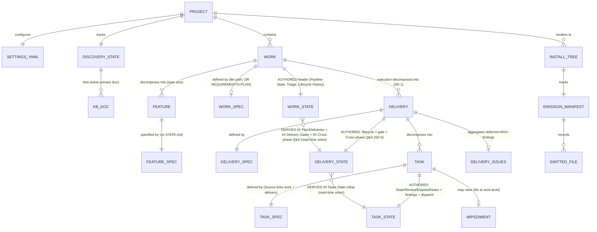

# Schemas

> **There is no database.** AID is a methodology + multi-tool distribution; it
> ships skills, agents, templates, recipes, and helper scripts. Every "schema"
> below is a document or config contract — YAML, JSONL, or structured Markdown —
> that the pipeline reads + writes.

## 1. Database

| Property | Value |
|----------|-------|
| **Type** | None — no DB. AID ships no application; state lives in filesystem documents. |
| **Persistent state** | `.aid/` directory tree (settings, knowledge base, per-work state, generated artifacts) |
| **Ephemeral state** | `.aid/.heartbeat/` (subagent heartbeat files, gitignored per `.gitignore` `.aid/.heartbeat/`), `.aid/.temp/` (skill scratch / review-pending ledgers) |
| **Cache** | `.aid/knowledge/.cache/` (Mermaid library cache for `aid-summarize`; gitignored per `.gitignore` `.aid/knowledge/.cache/`) |
| **Configs (non-runtime)** | `profiles/*.toml` (generator profiles), `.claude/settings.json` (Claude Code permissions) |

---

## 2. Settings — `.aid/settings.yml`

**Source of truth:** `canonical/templates/settings.yml` → rendered identically into all 5 install trees and copied to `.aid/settings.yml` by `/aid-config` on first run.

**Schema (YAML 1.2, per `canonical/templates/settings.yml` header `# .aid/settings.yml — AID pipeline configuration`):**

| Path | Type | Default | Purpose |
|------|------|---------|---------|
| `project.name` | string | `<project-name>` | Set during `/aid-config` INIT |
| `project.description` | string | `<project-description>` | Sole source of truth (not duplicated in CLAUDE.md/AGENTS.md per `settings.yml` `description:` comment "sole source of truth") |
| `project.type` | enum `brownfield`|`greenfield` | `brownfield` | Project class |
| `tools.installed` | list of strings | `[claude-code]` | Which install trees are active; valid values are the profile names (one per `profiles/*.toml`): `claude-code`, `codex`, `cursor`, `copilot-cli`, `antigravity`. (The `canonical/templates/settings.yml` `installed:` block only shows `claude-code`/`codex`/`cursor` as commented examples; the `aid` CLI installs all 5 — `aid add <tool>`, one per profile, per `bin/aid` `_aid_usage`. The authoritative record of what is installed per project is the install manifest `.aid/.aid-manifest.json` — see §8a — not this settings field.) |
| `review.minimum_grade` | grade string | `A` | Quality bar for every skill's REVIEW state |
| `execution.max_parallel_tasks` | int | `5` | Parallel pool dispatch capacity (FR6 / work-001 feature-009) |
| `traceability.heartbeat_interval` | int (minutes) | `1` | L3 heartbeat interval; `0` disables heartbeat entirely |
| `<skill>.minimum_grade` | grade string | — | Optional per-skill override; falls back to `review.minimum_grade` |

**Grade enum** (per `canonical/templates/settings.yml` comment `# Valid grade values:`):
```
A+, A, A-, B+, B, B-, C+, C, C-, D+, D, D-, E+, E, E-, F
```

**Per-skill override skills** (per `canonical/templates/settings.yml` `# Examples:` block):
`discover`, `summary`, `interview`, `specify`, `plan`, `detail`, `execute`,
`deploy`, `monitor` — each may set `minimum_grade:`.

**Resolution helper:** `canonical/scripts/config/read-setting.sh` implements
the per-skill override → global default → hardcoded `--default` fallback
(per its header comment `read-setting.sh` "canonical resolution order").

### 2a. `discovery.doc_set` — Declared KB Doc-Set

**Source of truth:** `canonical/skills/aid-discover/references/doc-set-resolve.md`.

**Purpose:** declares which KB documents are in scope for this project's discovery run,
who owns each, and whether each is required or conditional. Absent → the default seed is
synthesized from `canonical/templates/knowledge-base/*.md` by `synth_default_seed`.

**Schema (YAML block-list inside the `discovery:` section of `.aid/settings.yml`):**

```yaml
discovery:
  doc_set:
    - architecture.md|aid-researcher|required
    - infrastructure.md|aid-researcher|conditional:has CI/CD or deployment config
    # each item: filename | owner | presence[:when]
```

**Field grammar** (per `canonical/skills/aid-discover/references/doc-set-resolve.md` `### Field grammar`):

| Field | Constraints | Purpose |
|-------|-------------|---------|
| `filename` | basename under `.aid/knowledge/`; no path separator | Joins to doc frontmatter `kb-category:` and to `document-expectations.md` `### <filename>` |
| `owner` | `aid-researcher` (all KB analysis docs, replacing the former 5 discovery-* agents) or `aid-orchestrator` (orchestration meta-docs) | Determines which agent produces this doc |
| `presence` | `required` or `conditional`; MAY carry `:<when>` suffix | `<when>` is a human display hint — not machine-evaluated; the user-confirm step is the gate |

**Delimiter constraint:** No field value may contain a comma. `read-setting.sh`'s
`lookup_list` round-trips items through comma-join/comma-split; a comma inside a field
value (including the `<when>` hint) shreds the record into spurious fragments. Rephrase
any list-like `when` with `;` or `/` (e.g., `conditional:has CI; CD; or deploy config`).

**When the section is absent or empty:** `resolve_doc_set` delegates to
`synth_default_seed`, which enumerates `canonical/templates/knowledge-base/*.md` and
applies the §2.2 ownership map (single source of truth — edit the map to change defaults).
This is backward-compatible: an unmodified settings.yml runs discovery with the canonical
standard doc-set.

**Accepting the default during propose→confirm writes nothing to settings.yml** — the
absent-section-means-default-seed invariant is preserved (per `state-generate.md`
`### On confirm (resume path)`).

**Source:** `canonical/skills/aid-discover/references/doc-set-resolve.md` `## Schema: discovery.doc_set in .aid/settings.yml`

---

## 3. Discovery State — `.aid/knowledge/STATE.md`

**Source of truth:** `canonical/templates/discovery-state-template.md`.

**Purpose:** the per-area state hub for the Discovery area (per FR2 area-state
consolidation — see `coding-standards.md §7e`). Absorbs former `DISCOVERY-STATE.md` +
`SUMMARY-STATE.md`.

**Schema (Markdown, per `canonical/templates/discovery-state-template.md` `# Discovery State`):**

| Section | Shape | Cardinality |
|---------|-------|-------------|
| Top-level metadata (blockquote) | `Source:`, `Status:` (Initial / In Progress / Approved), `Current Grade:`, `User Approved:`, `Last KB Review:`, `Last Summary:` | 1 |
| `## External Documentation` | Table: `Path | Type | Accessible | Notes` | 1 table |
| `## KB Documents Status` | Table: `# | Document | Status | Grade | Last Reviewed | Notes` | One row per active primary KB doc (count varies by project — equals the declared doc-set; default seed = templates in `canonical/templates/knowledge-base/`; resolved by `state-generate.md` Step 0) |
| `## Knowledge Summary Status` | Table: `Field | Value` with 10 fields (Profile, Profile Source, Profile Confidence, Theme, Machine Grade, Human Grade, User Approved, Last Run, Output, Mermaid Version, Mermaid Cached) | 1 table |
| `## Q&A (Pending)` | One `### Q{N}` block per entry with sub-bullets: `Category`, `Impact`, `Status`, `Context`, `Suggested`, `Answer` (Style A per `coding-standards.md §12`) | 0..N |
| `## Review History` | Append-only table: `# | Date | Grade | Source | Notes` | 1..N |
| `## Summarization History` | Append-only table: `# | Date | Grade | Profile | Mermaid | Output | Notes` | 1..N |

**Active KB documents** — count varies by project. The canonical default seed (when
`discovery.doc_set` is absent from `.aid/settings.yml`) is derived from
`canonical/templates/knowledge-base/*.md`; for this repo (post-Q3 FIX) that yields:
project-structure, external-sources, architecture, technology-stack, module-map,
coding-standards, schemas (was data-model), pipeline-contracts (was api-contracts),
integration-map, domain-glossary, test-landscape, tech-debt, infrastructure,
feature-inventory — plus the repo-specific custom doc `repo-presentation`.
The actual active set for any given project is whatever was confirmed in Step 0d
(propose→confirm) of the most recent GENERATE run.

---

## 4. Work State — Uniform Unit Hierarchy

### 4.0 Hierarchy Overview (SD-1)

Every AID execution unit is a **folder** containing its own `SPEC.md` (immutable
definition) and `STATE.md` (mutable state). Tasks nest under their delivery; deliveries
nest under their work. This uniform pattern governs the **execution axis only** —
`features/` is the specification axis and retains its own shape (see §4.1 below).

```
.aid/work-NNN-{name}/
  SPEC.md                               # work definition (lite path); OR
  REQUIREMENTS.md + PLAN.md             # work definition (full path); both MAY coexist
  STATE.md                              # work-level state: AUTHORED header + DERIVED views
  delivery-NNN/
    SPEC.md                             # delivery definition (scope, gate criteria)
    STATE.md                            # delivery state: lifecycle + gate + Q&A + derived task rollup
    delivery-NNN-issues.md              # deferred [HIGH] issues log (already disjoint)
    tasks/
      task-NNN/
        SPEC.md                         # task definition (the former flat tasks/task-NNN.md)
        STATE.md                        # task mutable cells: State/Review/Elapsed/Notes + logs
  features/{feature}/
    SPEC.md                             # feature specification (spec axis; no STATE.md)
```

**SD-1 boundary (features/ vs delivery/):** `features/` is a specification decomposition
(produced by `/aid-specify`); `delivery-NNN/` is an execution decomposition (produced by
`/aid-plan`). Feature progress is tracked in the work-level derived `## Features State`
view only. Features gain no `STATE.md`; no new unit types are introduced.

**SD-1 work-level SPEC.md rule:** On the **lite path** the work `SPEC.md` is the sole
definition artifact. On the **full path** `REQUIREMENTS.md` + `PLAN.md` remain the
definition artifacts; the work `SPEC.md` is optional (the reader resolves identity from
`REQUIREMENTS.md` first, `SPEC.md` fallback). Every work unit MUST have `STATE.md`.

**Migration / coexistence (SD-6):** Per-work detection is presence-based. If
`delivery-NNN/tasks/task-NNN/STATE.md` exists for a work, the reader derives views from
the per-unit files. Otherwise the reader falls back to the legacy monolithic `STATE.md`
inline tables (current behavior). Works of mixed vintage in the same repo all render
correctly.

---

### 4.1 Disjoint Writes + Derived Parents

Each unit's `STATE.md` is written by **exactly one branch** — the branch that owns that
delivery or task. No two branches ever write the same `STATE.md`. Merge-back is
conflict-free by construction.

**DERIVED-view rule.** A parent unit's `STATE.md` has two distinct zones:

1. **AUTHORED zone** — the unit's own lifecycle/header state, written by the single
   branch that owns the unit.
2. **DERIVED zone** — a read-only view assembled at READ TIME from per-child STATE.md
   files. Never written. The dashboard reader unions child contributions; no agent
   writes to these sections directly.

The work-level `## Tasks State`, `## Plan / Deliveries`, `## Delivery Gates`, and
`## Cross-phase Q&A` are **DERIVED views** — they are never write targets. Each
delivery branch writes ONLY into its own `delivery-NNN/STATE.md` (and its tasks'
STATE.md files). The work-level Pipeline State header is authored solely by the work
owner on the work's active branch.

**Cross-phase Q&A partition (SD-5).** To prevent the two-branch write collision on the
shared work file, the delivery gate writes its SPEC Q&A into the delivery's OWN
`delivery-NNN/STATE.md ## Cross-phase Q&A` section. The work-level `## Cross-phase Q&A`
is the DERIVED union of all delivery Q&A sections plus any work-owner-authored
work-level entries (written on the work's active branch, single writer).

---

### 4.2 Work-Level STATE.md — `.aid/work-NNN-{name}/STATE.md`

**Source of truth:** `canonical/templates/work-state-template.md`.

**Purpose:** the single per-area state hub for one work item, covering the full dev
lifecycle from requirement to spec to plan to implementation to deploy.

**Two zones:**
- **AUTHORED** (single-writer): `## Pipeline State`, `## Triage`, `## Escalation Carry`,
  `## Interview State`, `## Lifecycle History`, `## Deploy State` (authored by `aid-deploy`;
  single-writer, one row per delivery; per-delivery hierarchy migration is future work).
- **DERIVED** (read-only, assembled at read time from per-delivery and per-task
  STATE.md files): `## Features State`, `## Plan / Deliveries`, `## Tasks State`,
  `## Delivery Gates`, `## Cross-phase Q&A`, `## Calibration Log`,
  `## Dispatches`.

**AUTHORED section schema:**

| Section | Shape | Cardinality |
|---------|-------|-------------|
| Top-level metadata (blockquote) | `State:`, `Phase:`, `Minimum Grade:`, `Started:`, `User Approved:` | 1 |
| `## Pipeline State` | Bullets: `Lifecycle:` enum, `Phase:` enum, `Active Skill:` enum, `Updated:`, `Pause Reason:` (conditional), `Block Reason:` (conditional), `Block Artifact:` (conditional) | 1 |
| `## Triage` | Bullets: `Path:` (lite/full), `Work Type:` enum, `Sub-path:` enum, `Sub-path (auto):`, `Decision rationale:`, `Override:`, `Recipe:` | 1 |
| `## Escalation Carry` | Conditional — only when work was escalated from lite to full | 0 or 1 |
| `## Interview State` | Table: 10 standard sections with State + Last Updated | Fixed 10 rows |
| `## Lifecycle History` | Append-only table: `Date | Phase Transition / Gate | Grade | Notes` | 1..N |
| `## Deploy State` | Table: `Delivery | State | PR | KB Updated | Tag | Notes` | Authored by `aid-deploy` (single-writer); per-delivery hierarchy migration is future work | 0..N |

**DERIVED section schema:**

| Section | Shape | Source |
|---------|-------|--------|
| `## Features State` | Table: `# | Feature | Spec State | Spec Grade | Q&A Count | Notes` | Per `features/{feature}/SPEC.md` progress |
| `## Plan / Deliveries` | Table: `Delivery | State | Tasks | Notes` | Per `delivery-NNN/STATE.md` lifecycle fields |
| `## Tasks State` | Table: `# | Task | Type | Wave | State | Review | Elapsed | Notes` | Per `delivery-NNN/tasks/task-NNN/STATE.md` mutable cells |
| `## Delivery Gates` | Per-delivery gate blocks | Union of per `delivery-NNN/STATE.md ## Delivery Gate` |
| `## Cross-phase Q&A` | Q-blocks (same shape as discovery-state Q&A) | Union of per-delivery Q&A + work-owner-authored entries (SD-5) |
| `## Calibration Log` | Table: `Date | Agent | Task / Cycle | ETA Band | Actual | Notes` | Union of per-task `## Dispatch Log` sections |
| `## Dispatches` | Per-task sub-sections | Union of per-task dispatch logs |

**Pipeline State enum values** (per `work-state-template.md` `## Pipeline State`):

- `Lifecycle:` ∈ {`Running`, `Paused-Awaiting-Input`, `Blocked`, `Completed`, `Canceled`}
- `Phase:` ∈ {`Interview`, `Specify`, `Plan`, `Detail`, `Execute`, `Deploy`, `Monitor`}
- `Active Skill:` — `aid-{skill}` or `none`

**Triage enum values** (per `work-state-template.md` `## Triage`):

- `Path:` ∈ {`lite`, `full`}
- `Work Type:` ∈ {`bug-fix`, `new-feature`, `refactor`} (omitted for full path)
- `Sub-path:` ∈ {`LITE-BUG-FIX`, `LITE-REFACTOR`, `LITE-FEATURE`, `—`}
- `Override:` ∈ {`yes`, `no`}

**State naming rule:** All section/field names use "state" not "status" (work-004 naming
contract). Legacy sections `## Tasks Status`, `## Pipeline Status`, `## Features Status`,
`## Interview Status`, `## Deploy Status` are renamed `## Tasks State`, `## Pipeline State`,
`## Features State`, `## Interview State`, `## Deploy State` respectively. Per-task field
"Status" is renamed "State". **Closed enum VALUES are unchanged:**
`Pending | In Progress | In Review | Blocked | Done | Failed | Canceled`.

---

### 4.3 Delivery-Level STATE.md — `.aid/work-NNN-{name}/delivery-NNN/STATE.md`

**Source of truth:** `canonical/templates/delivery-state-template.md`.

**Purpose:** the state hub for one delivery; carries the delivery's independent lifecycle,
its delivery gate block, its Cross-phase Q&A (SD-5), and a derived task rollup.

**Two zones:**
- **AUTHORED** (single writer = this delivery's branch): `## Delivery Lifecycle`,
  `## Delivery Gate`, `## Cross-phase Q&A`.
- **DERIVED** (read-only): `## Tasks State` (rollup from per-task STATE.md files).

**Schema:**

| Section | Shape | Zone | Cardinality |
|---------|-------|------|-------------|
| Header blockquote | `Delivery:`, `Work:`, `Branch:` | n/a | 1 |
| `## Delivery Lifecycle` | Bullets: `State:` (SD-8 enum), `Updated:`, `Block Reason:` (conditional), `Block Artifact:` (conditional) | AUTHORED | 1 |
| `## Delivery Gate` | Bullets: `Reviewer Tier:`, `Grade:`, `Issue List:`, `Timestamp:` | AUTHORED | 1 |
| `## Cross-phase Q&A` | Q-blocks (per §4.3a below) — written by delivery-gate step of `aid-execute` (SD-5) | AUTHORED | 0..N |
| `## Tasks State` | Table: `# | Task | Type | Wave | State | Review | Elapsed | Notes` | DERIVED | 0..N |

**Delivery lifecycle enum (SD-8 — independently authored, NOT derived from task rollup):**

```
Pending-Spec   -- delivery folder created; awaiting aid-specify
Specified      -- aid-specify complete; tasks defined
Executing      -- aid-execute in progress (at least one task dispatched)
Gated          -- delivery gate running
Done           -- gate passed; delivery complete
Blocked        -- impediment raised; awaiting resolution
```

`aid-plan` creates the delivery folder with `State: Pending-Spec`. `aid-specify` advances
it to `Specified`. `aid-execute` advances `Executing → Gated → Done`, or `Blocked` on an
impediment.

**SD-9 rationale (why independently authored):** A SPIKE `delivery-001` may define
`delivery-002`; `delivery-002` then sits at `Pending-Spec` with ZERO tasks while
`delivery-001`'s tasks are `In Progress`. A pure task-rollup derivation cannot represent
a task-less but in-flight delivery — there are no task states to roll up — so the
delivery lifecycle MUST be independently authored.

**Cross-phase Q&A entry shape (§4.3a):**

| Field | Value |
|-------|-------|
| `Category:` | e.g., Architecture, Requirements, Security |
| `Impact:` | `High` / `Medium` / `Low` / `Required` |
| `State:` | `Pending` / `Answered` / `Skipped` |
| `Context:` | Why this matters; what the downstream phase observed |
| `Suggested:` | Answer if inferrable, or `--` |
| `Answer:` | Filled when State is Answered |
| `Applied to:` | Artifact(s) the answer was applied to |

---

### 4.4 Task-Level STATE.md — `.../delivery-NNN/tasks/task-NNN/STATE.md`

**Source of truth:** `canonical/templates/task-state-template.md`.

**Purpose:** the sole write target for all per-task mutable state. ALL sections are
AUTHORED by a single writer: the delivery branch that owns this task.

**Schema:**

| Section | Shape | Cardinality |
|---------|-------|-------------|
| Header blockquote | `Task:`, `Delivery:`, `Work:` | 1 |
| `## Task State` | Bullets: `State:` (closed enum), `Review:`, `Elapsed:`, `Notes:` | 1 |
| `## Quick Check Findings` | Bullets: `Reviewer Tier:`, `Findings:` (severity-tagged list) | 1 |
| `## Dispatch Log` | Append-only table: `Date | Agent | ETA Band | Actual | Outcome` | 1 table |

**Task State closed enum (values unchanged):**
`Pending | In Progress | In Review | Blocked | Done | Failed | Canceled`

**Quick-Check finding severity enum:**
`[CRITICAL]` (Fixed-on-spot), `[HIGH]` (Deferred-to-gate).

**SD-2 State Advancement Ordering (authoritative — for same-work reconcile):**

```
Done  >  Canceled  >  In Review  >  In Progress  >  Blocked  >  Failed  >  Pending
```

Rationale: the dashboard "most-advanced wins" reconcile answers "how far has this work
gotten across all worktree branches." `Done`/`Canceled` are terminal-resolved and rank
highest. `In Review` outranks `In Progress` (review is a later pipeline stage). `Blocked`
outranks `Failed` because a blocked task is recoverable-in-place and signals "needs
attention now," whereas a failed task represents a completed-but-rejected attempt that a
parallel branch may have already superseded. Both `Blocked` and `Failed` rank above
`Pending` because they represent work that was attempted and surfaced information.
`Canceled` ranks just below `Done` (terminal-resolved). This ordering is encoded ONCE in
`canonical/templates/work-state-template.md` and both reader twins (Python + Node) derive
it from schemas.md.

---

### 4.5 Delivery SPEC.md — `.../delivery-NNN/SPEC.md`

**Source of truth:** `canonical/templates/delivery-spec-template.md`.

**Purpose:** the immutable definition for a delivery. Written once by `aid-plan` /
`aid-specify`. State lives in the sibling `delivery-NNN/STATE.md`.

**Schema (6 sections):**

| Section | Shape |
|---------|-------|
| Header blockquote | `Delivery:`, `Work:`, `Created:` |
| `## Objective` | One paragraph: what this delivery achieves |
| `## Scope` | Bounded deliverables list + "Out of scope:" note |
| `## Gate Criteria` | Ordered acceptance criteria checklist |
| `## Tasks` | Navigational table: `Task | Type | Title` |
| `## Dependencies` | `Depends on:` + `Blocks:` bullets |
| `## Notes` | Design notes, constraints, references |

---

### 4.6 Task SPEC.md — `.../delivery-NNN/tasks/task-NNN/SPEC.md`

**Source of truth:** `canonical/templates/task-spec-template.md`.

**Purpose:** the immutable definition for a task. Written once by `aid-detail`. State
lives in the sibling `task-NNN/STATE.md`. Shape mirrors
`canonical/templates/delivery-plans/task-template.md` (6 sections, nothing else).

**Schema (6 sections):**

1. `# task-NNN: {Title}` — heading
2. `**Type:**` — one of 8 enum values (RESEARCH/DESIGN/IMPLEMENT/TEST/DOCUMENT/MIGRATE/REFACTOR/CONFIGURE)
3. `**Source:**` — `work-NNN-{name} -> delivery-NNN`
4. `**Depends on:**` — `task-NNN[, task-NNN]` or `-- (none)`
5. `**Scope:**` — bullet list, type-dependent
6. `**Acceptance Criteria:**` — checklist bullets

---

### 4.7 Worktree Discovery (SD-3)

**Purpose:** the dashboard reader discovers persistent git worktrees and aggregates all
same-work pipelines from all branches in a single project view.

**Discovery method:** for each registered repo root, the reader runs read-only
`git -C <root> worktree list --porcelain` via the existing fixed-argv / no-shell
subprocess pattern (verb hard-coded in argv; safe by construction). Parses `worktree
<path>` and `branch refs/heads/<branch>` lines. For each worktree path, locates its
`.aid/` and enumerates `work-*` folders.

**Allow-list status:** there is currently NO enforced git-verb allow-list. Node's
`runGitCommand` has none; Python's `_GIT_ALLOWED_VERBS` (`derivation.py`) is documentary,
never referenced. Discovery does NOT depend on adding `worktree` to an allow-list. If a
hardening verb-guard is wanted, it must be made REAL (enforced at the call site in both
twins, with `worktree` permitted) — a documentary-only list is not a guard.

**Degradation:** if git is unavailable, the root is not a git repo, or the subprocess
times out (2 s bound, matching KB-freshness) → fall back to the main root only (current
behavior). Never throws.

**Same-work reconcile (Pillar 5):** when a `work_id` appears across N worktrees + main:
- Per task: take the MOST-ADVANCED `State` by the SD-2 ordering (§4.4).
- Work-level Pipeline State: take the copy with the newest `Updated:` timestamp; on a
  timestamp tie, break deterministically by a stable secondary key (branch-label lexical
  sort, main root first).
- Derived views: union the per-task/per-delivery contributions across worktrees; no winner.

**Task `Type` enum** (per `task-spec-template.md` `**Type:**` line):
8 values — `RESEARCH`, `DESIGN`, `IMPLEMENT`, `TEST`, `DOCUMENT`, `MIGRATE`, `REFACTOR`, `CONFIGURE`.

---

## 5. KB Document Frontmatter

**Source of truth:** `canonical/templates/kb-authoring/frontmatter-schema.md`.

**Schema (YAML, delimited by `---` markers as the FIRST content in the file):**

| Field | Type | Required? | Allowed values |
|-------|------|-----------|----------------|
| `kb-category` | enum | YES | `primary` / `meta` / `extension` (per frontmatter-schema.md `### \`kb-category:\``) |
| `source` | enum | YES | `hand-authored` / `generated` (per frontmatter-schema.md `### \`source:\``) |
| `generator` | string | YES iff `source: generated` | Build-script name relative to `canonical/scripts/` (per frontmatter-schema.md `### \`generator:\``) |
| `intent` | folded string (YAML `|`) | YES | 1-4 sentences describing what the doc is FOR (per frontmatter-schema.md `### \`intent:\``) |
| `contracts` | list of strings | NO (defaults to `[]`) | Each entry is a structural cardinality assertion validated by `aid-reviewer` in REVIEW state (per `canonical/agents/aid-reviewer/AGENT.md`; spec at frontmatter-schema.md `### \`contracts:\``) |
| `changelog` | list of dated entries | NO (defaults to `[]`) | Free-form ISO-dated notes; exempt from review (per frontmatter-schema.md `### \`changelog:\``) |

**Parsing rules** (per frontmatter-schema.md `## Parsing rules (for tools)`):

- Block MUST be the first content (no whitespace, no BOM, no comments before).
- Opening + closing `---` on their own lines.
- Body MUST be valid YAML 1.2.
- Missing fields default-empty.
- Unknown fields tolerated (forward-compatible).
- Parse failure → doc treated as `kb-category: primary, source: hand-authored` with empty intent/contracts/changelog + lint emits HIGH-severity warning.

**Per-doc review treatment** (per `canonical/templates/kb-authoring/review-rubric.md` `## Routing — which rubric applies`): the combination of `kb-category` and `source` selects one of six rubrics — Full Primary (hand-authored), Full Primary + Build-Verify (generated INDEX.md), Spot-Check Snapshot (meta hand-authored), Build-Verify Only (meta generated, e.g., metrics.md / project-index.md), Extension-Scope, Extension Build-Verify.

---

## 6. Skill Frontmatter

**Source of truth:** `canonical/skills/*/SKILL.md` (10 user-facing + 1 maintainer-only) + `profiles/claude-code.toml` `[skill.frontmatter]` (skill frontmatter schema declaration).

**Schema (YAML, per `profiles/claude-code.toml` `[skill.frontmatter]`):**

| Field | Type | Required? | Notes |
|-------|------|-----------|-------|
| `name` | string | YES | Matches the skill directory name (e.g., `aid-discover`) |
| `description` | folded string (YAML `>`) | YES | One paragraph describing the skill's purpose + state-machine summary |
| `allowed-tools` | comma-separated string | YES | Subset of `Read, Glob, Grep, Bash, Write, Edit, Agent, AskUserQuestion` |
| `argument-hint` | string | NO | Brief flag description shown by the host's slash-command help |
| `context` | string | NO (claude-code-only) | Injected by renderer for Claude Code (per `profiles/claude-code.toml` `[skill.frontmatter]` `claude_code_optional`) |
| `agent` | string | NO (claude-code-only) | Injected by renderer for Claude Code |

**Renderer behavior** (per `.claude/skills/generate-profile/scripts/render_skills.py` `_rewrite_skill_frontmatter`):

- Tool name remapping applied to `allowed-tools:` line via the profile's `[tool_names]` table (identity map for Claude Code per `profiles/claude-code.toml` `[tool_names]`).
- `claude_code_optional` fields are dropped from non-Claude-Code renders.

---

## 7. Agent Frontmatter

**Source of truth:** `canonical/agents/aid-*/AGENT.md` (9 agents) + `profiles/claude-code.toml` `[agent.frontmatter]`.

**Schema (YAML, per `profiles/claude-code.toml` `[agent.frontmatter]`):**

| Field | Type | Required? | Notes |
|-------|------|-----------|-------|
| `name` | string | YES | Kebab-case, matches the directory name; used as `subagent_type` in the host's Task tool call |
| `description` | string OR folded YAML `>` | YES | One paragraph; for sub-agent-only utilities, must begin with `INTERNAL UTILITY (sub-agent only — do NOT invoke from a skill)` per `canonical/agents/aid-clerk/AGENT.md` `description:` line |
| `tier` | enum | YES (canonical) | `large` / `medium` / `small` — maps to `model:` via the profile's `[model_tiers]` table |
| `tools` | comma-separated string | YES | Subset of `Read, Glob, Grep, Bash, Write, Edit` |
| `model` | string | YES (rendered output, NOT canonical input) | Derived by the renderer from `tier:` via `[model_tiers]` (per `.claude/skills/generate-profile/scripts/render_agents.py` `_resolve_model`) |
| `permissionMode` | enum | NO | `bypassPermissions` — set on `aid-researcher` when dispatched for parallel KB analysis (per the former discovery-* sub-agent pattern; confirm in `canonical/agents/aid-researcher/AGENT.md`) |
| `background` | bool | NO | `true` — set on `aid-researcher` when dispatched for parallel KB analysis |

**Tier → model mapping** (per `profiles/claude-code.toml` `[model_tiers]`):
- `large` → `opus`
- `medium` → `sonnet`
- `small` → `haiku`

Codex + Antigravity use a `[model_tiers.<tier>]` sub-table with `model` + `reasoning_effort` fields (per `.claude/skills/generate-profile/scripts/aid_profile.py` `class ModelTierDetailed`; `profiles/antigravity.toml` `[model_tiers.large]`); Claude Code, Cursor + Copilot CLI use the simple string form (`ModelTierSimple`; per `profiles/copilot-cli.toml` `[model_tiers]`).

---

## 8. Emission Manifest — `<install-tree>/emission-manifest.jsonl`

**Source of truth:** `canonical/EMISSION-MANIFEST.md`.

**Purpose:** authoritative safety boundary for the generator's pure-mirror deletion logic (per `canonical/EMISSION-MANIFEST.md` `## Purpose`). Every file the generator emits is recorded; only manifest-tracked paths are eligible for deletion.

**Format:** JSON-Lines (`.jsonl`); one record per line, LF-only line endings even on Windows (per `EMISSION-MANIFEST.md` `## Line-Ending and Trailing-Newline Rule`).

**Record schemas:**

**Sentinel object** (first line of every manifest):
```json
{"_manifest_version": 1}
```

**Data record** (lines 2..N):

| Key | Type | Description |
|-----|------|-------------|
| `profile` | string | Profile name — equals the profile-TOML stem; one of `claude-code`, `codex`, `cursor`, `copilot-cli`, `antigravity` (verify against the `profile` field of each `profiles/*/emission-manifest.jsonl`; per `EMISSION-MANIFEST.md` `## Record Schema`, which still illustrates with the original 3) |
| `src` | string | Repo-relative path inside `canonical/` |
| `dst` | string | Path inside the install tree, relative to the manifest's directory |
| `sha256` | string | Lowercase hex SHA-256 of the rendered file's bytes |

**Ordering** (per `EMISSION-MANIFEST.md` `## Ordering`): records sorted lexicographically by `dst` before writing.

**One manifest per profile** at the deepest common parent (per `EMISSION-MANIFEST.md` `## Filename and Location`):

| Profile | Manifest path |
|---------|---------------|
| `claude-code` | `profiles/claude-code/emission-manifest.jsonl` |
| `codex` | `profiles/codex/emission-manifest.jsonl` (covers the unified `.codex/` root) |
| `cursor` | `profiles/cursor/emission-manifest.jsonl` |
| `copilot-cli` | `profiles/copilot-cli/emission-manifest.jsonl` (single `.github/` root) |
| `antigravity` | `profiles/antigravity/emission-manifest.jsonl` (single `.agent/` root) |

⚠️ The location table in `canonical/EMISSION-MANIFEST.md` (`## Filename and Location`) still lists only the original 3 profiles; the 2 new manifests exist on disk and follow the same deepest-common-parent rule. The renderer derives the path from `LayoutConfig.common_parent()` (per `.claude/skills/generate-profile/scripts/aid_profile.py`), so the rule generalizes regardless of the doc's example set.

**Safety-boundary algorithm** (per `EMISSION-MANIFEST.md` `## Safety-Boundary Semantics`):

1. Load previous run's committed manifest.
2. Render — add each emitted path to current in-memory manifest.
3. Diff: compute `added_dst` (no action), `removed_dst` (delete from disk), `changed_dst` (overwrite via renderer).
4. Delete each path in `removed_dst`; prune empty parents within the generator-owned subtree.
5. Write current manifest to disk.

Files **outside** any manifest are NEVER touched.

---

## 8a. Install Manifest — `<project>/.aid/.aid-manifest.json`

**Source of truth:** `lib/aid-install-core.sh` (`manifest_write` / the manifest-shape
comment block above `manifest_read_tool_paths`) and `lib/AidInstallCore.psm1`.

**Purpose:** the authoritative per-project record of what the `aid` CLI installed — which
tools, at which version, which files, and the ownership sha256 of each root agent file
(driving FR11 protect-on-diff and `aid status`/`aid update`/`aid remove`). Distinct from
the generator's emission-manifest (§8); written by the **installer**, not the renderer.

**Format:** a single JSON object, 2-space indent, **LF-only** newlines, trailing newline,
written atomically via temp-file + rename (no UTF-8 BOM — asserted by
`tests/windows/Test-AidInstaller.ps1` T03/T04).

**Top-level keys:**

| Key | Type | Description |
|-----|------|-------------|
| `manifest_version` | int | Schema version (currently `1`) |
| `aid_version` | string | The `aid` CLI version that last wrote the manifest (e.g. `1.1.0`) |
| `installed_at` | string | ISO-8601 UTC timestamp of first manifest write (preserved across merges) |
| `tools` | object | Map keyed by canonical tool id (`claude-code` / `codex` / `cursor` / `copilot-cli` / `antigravity`) → per-tool entry |

**Per-tool entry** (`tools.<tool>`):

| Key | Type | Description |
|-----|------|-------------|
| `version` | string | The AID version installed for this tool |
| `installed_at` | string | ISO-8601 UTC timestamp of this tool's first install (preserved on re-install) |
| `paths` | list of strings | Project-relative POSIX paths of every file the installer wrote for this tool (de-duplicated union across re-installs) |
| `root_agent_files` | list of objects | One entry per root agent file (`CLAUDE.md` / `AGENTS.md`) this tool owns |

**`root_agent_files[]` entry:**

| Key | Type | Description |
|-----|------|-------------|
| `path` | string | Root agent filename (`CLAUDE.md` or `AGENTS.md`) |
| `sha256` | string | Lowercase hex SHA-256 of the AID-written bytes (the ownership token FR11 checks before overwriting) |
| `status` | string | `owned` (AID wrote/owns it) or `pending-merge` (a user-authored file differed → incoming written as `<path>.aid-new`) |

**Example shape** (per the `lib/aid-install-core.sh` schema comment):

```json
{
  "manifest_version": 1,
  "aid_version": "1.1.0",
  "installed_at": "2026-06-05T12:00:00Z",
  "tools": {
    "claude-code": {
      "version": "1.1.0",
      "installed_at": "2026-06-05T12:00:00Z",
      "paths": [".claude/skills/aid-discover/SKILL.md"],
      "root_agent_files": [
        { "path": "CLAUDE.md", "sha256": "<hex>", "status": "owned" }
      ]
    }
  }
}
```

Companion file: `<project>/.aid/.aid-version` records the installed AID version as a plain
string (`write_version_marker` in `lib/aid-install-core.sh`).

---

## 9. Profile TOML — `profiles/*.toml`

**Source of truth:** `profiles/claude-code.toml`, `profiles/codex.toml`, `profiles/cursor.toml`, `profiles/copilot-cli.toml`, `profiles/antigravity.toml` (5 profiles).

**Schema (TOML 1.0, parsed by `.claude/skills/generate-profile/scripts/aid_profile.py` `_parse_layout` etc.):**

| Section | Keys | Purpose |
|---------|------|---------|
| `[layout]` | `output_root` (single-root tools — `.claude` / `.cursor` / `.github` (Copilot CLI, per `profiles/copilot-cli.toml` `[layout]`) / `.agent` (Antigravity, per `profiles/antigravity.toml` `[layout]`)), `agents_root` + `assets_root` (split-root Codex), `agents_dir`, `skills_dir`, `templates_dir`, `recipes_dir`, `scripts_dir`, `rules_dir` (Cursor + Antigravity), `project_context_file` | Where rendered files go |
| `[agent]` | `format` ∈ {`markdown`, `toml`, `copilot-agent`, `antigravity-rule`} (the `_KNOWN_AGENT_FORMATS` set in `aid_profile.py`); validated by `validate()` | Per-tool agent output format |
| `[agent.frontmatter]` | `required` list, `optional` list, `claude_code_optional` list | Which frontmatter keys are required/optional in agent output |
| `[skill]` | `decomposition` (always `"references"` per Decision F per `aid_profile.py` `decomposition` field) | Skill body decomposition strategy |
| `[skill.frontmatter]` | `required` list, `optional` list, `claude_code_optional` list | Same as agent frontmatter |
| `[model_tiers]` | `large`, `medium`, `small` — string (`ModelTierSimple`: Claude Code / Cursor / Copilot CLI) OR sub-table (`ModelTierDetailed` with `model` + `reasoning_effort`: Codex / Antigravity) | Tier-to-model mapping |
| `[tool_names]` | flat map, e.g., `Read = "read_file"` (identity for Claude Code per `claude-code.toml` `[tool_names]`; empty map → identity passthrough, e.g., Antigravity per `profiles/antigravity.toml` `[tool_names]`) | Per-tool tool-name remapping |
| `[filename_map]` | `project_context_file`, `reviewer_output_file`, `open_questions_file` | Per-tool placeholder substitutions for `{project_context_file}` etc. |
| `[extras]` | `rules_frontmatter` (string\|None — e.g., `"trigger"` for Antigravity, controlling extras-rules frontmatter dialect; absent → verbatim source copy, e.g., Cursor) + `[[extras.rules]]` array of `{filename, always_apply, description, globs, output_filename?}` | Tool-specific extras (methodology rule files placed via `render_skills._render_cursor_extras`) |
| `[capabilities]` | `hooks`, `skill_chaining`, `background_execution`, `stop_hook_autocontinue` (booleans) | Tool capabilities (verified against host docs) |

The dataclasses mirror this schema 1:1 in `.claude/skills/generate-profile/scripts/aid_profile.py` (the `@dataclass` block from `class LayoutConfig` onward — `LayoutConfig`, `FrontmatterConfig`, `AgentConfig`, `SkillConfig`, `ModelTierSimple`, `ModelTierDetailed`, `RuleEntry`, `ExtrasConfig`, `CapabilitiesConfig`, `Profile`).

**`[[extras.rules]]` → `RuleEntry`** (per `aid_profile.py` `class RuleEntry`):

| Key | Type | Default | Purpose |
|-----|------|---------|---------|
| `filename` | string | (required) | Canonical source name under `canonical/rules/` (e.g., `aid-methodology.mdc`) |
| `always_apply` | bool | `false` | `true` → `trigger: always_on`; `false` → `trigger: glob` (when trigger-dialect is active) |
| `description` | string | `""` | Rule description carried into regenerated frontmatter |
| `globs` | list of strings | `[]` | Glob patterns for `trigger: glob` rules |
| `output_filename` | string \| None | `None` | Optional output-name override — when set, source is written to this name (enables `.mdc → .md` rename for Antigravity per `profiles/antigravity.toml` `[[extras.rules]]`); `None` → source name preserved, so Cursor stays byte-identical |

**`[extras]` → `ExtrasConfig`** (per `aid_profile.py` `class ExtrasConfig`):

| Key | Type | Default | Purpose |
|-----|------|---------|---------|
| `rules` | list of `RuleEntry` | `[]` | Methodology rule files to emit into the rules dir |
| `rules_frontmatter` | string \| None | `None` | Frontmatter dialect for extras-rules emission. `None` → verbatim source copy (Cursor byte-identical path). `"trigger"` → Antigravity dialect: strip source `.mdc` frontmatter, regenerate from `RuleEntry` fields using `trigger:`/`description`/`globs` keys (`always_apply=true` → `trigger: always_on`; `always_apply=false` → `trigger: glob` + globs). DECOUPLED from `[agent].format` (extras-rules + agent emission are separate paths per delivery-003). |

---

## 10. Recipe Front-Matter + Body — `canonical/recipes/*.md`

**Source of truth:** `canonical/templates/recipe-template.md` +
`canonical/scripts/interview/parse-recipe.sh`.

**Front-matter schema (YAML, per `recipe-template.md` `## YAML front-matter fields`; the four fields below are required, `summary` is the one optional field):**

| Field | Type | Validation |
|-------|------|------------|
| `name` | string (kebab-case) | Must match the file basename without `.md` |
| `applies-to` | enum | One of `bug-fix`, `new-feature`, `refactor`, or `*` (matches any workType — use sparingly per `recipe-template.md` `## Conventions`) |
| `summary` | string (one-line) | Optional. One-line recipe description, agent-read; used by TRIAGE for description→recipe matching (per `canonical/recipes/README.md ### YAML Front-Matter` + `recipe-template.md`). NOT validated by `parse-recipe.sh`. |
| `slot-count` | integer | Count of unique `{{slot-name}}` tokens in body; parser warns on mismatch |
| `task-count` | integer | Count of `### task-NNN` headings in `## tasks` block; parser warns on mismatch |

**Body schema** (per `recipe-template.md` `## ## spec block`):

- `## spec` block (lowercase intentional per `recipe-template.md` `## ## spec block`) — becomes the rendered `.aid/work-NNN/SPEC.md`. Must include sections: `# {title}`, metadata block (4 bold key/value lines: Work / Created / Source / Status), `## Goal`, `## Context`, `## Acceptance Criteria`, `## Tasks` (table), `## Execution Graph` (two tables), `## Revision History`.
- `## tasks` block — one `### task-NNN — Title` heading per task; renders one `task-NNN.md` per heading.

**Slot syntax** (per `recipe-template.md` `## Slot syntax`):

- Slots written as `{{slot-name}}` anywhere in body.
- Slot names match POSIX ERE `[a-z][a-z0-9-]*` — lowercase ASCII letter first, then lowercase letters / digits / hyphens.
- No underscores, no uppercase, no dots, no spaces.

**Escape** (per `recipe-template.md` `## Slot syntax`): `{!{` renders as literal `{{` at emit time without being treated as a slot token. Use when a recipe body discusses AID slot syntax as content.

**Parser modes** (per `canonical/scripts/interview/parse-recipe.sh` usage header): `--list`, `--validate`, `--spec`, `--tasks`, `--render --recipe X --slots-json Y --work-dir Z`.

---

## 11. Task SPEC — Path + Template

**Template source of truth:** `canonical/templates/task-spec-template.md`
(mirrors shape of `canonical/templates/delivery-plans/task-template.md`).

**Path (new hierarchy):** `.aid/work-NNN-{name}/delivery-NNN/tasks/task-NNN/SPEC.md`
(sibling `STATE.md` at same path: `.../tasks/task-NNN/STATE.md`).

**Legacy path (monolithic works):** `.aid/work-NNN-{name}/tasks/task-NNN.md` (flat).

The reader detects the hierarchy via presence of `delivery-NNN/tasks/task-NNN/STATE.md`.
For monolithic works (no per-task STATE.md present) the reader falls back to the flat
`tasks/task-NNN.md` shape (current behavior). Both coexist per-work.

**Schema (Markdown, 6 sections — flat, no nesting):**

1. `# task-NNN: {Title}` — heading
2. `**Type:**` — one of 8 enum values (RESEARCH/DESIGN/IMPLEMENT/TEST/DOCUMENT/MIGRATE/REFACTOR/CONFIGURE)
3. `**Source:**` — `work-NNN-{name} -> delivery-NNN`
4. `**Depends on:**` — `task-NNN[, task-NNN]` or `-- (none)`
5. `**Scope:**` — bullet list, type-dependent
6. `**Acceptance Criteria:**` — checklist bullets

**Invariants** (per `task-spec-template.md`):
- Six sections, nothing else.
- One Type per task; never mix.
- Every task except the first declares at least one `Depends on` entry.
- State lives in the sibling `STATE.md`, not in this file (this file is immutable once created).

---

## 12. Delivery Issues Log — `.aid/work-NNN-{name}/delivery-NNN/delivery-NNN-issues.md`

**Source of truth:** `canonical/templates/delivery-issues.md`.

**Purpose:** aggregates all `[HIGH]` findings deferred from per-task quick-checks. Input
to the delivery-gate reviewer (per `delivery-issues.md` "input to the delivery gate
reviewer" note). This file is already disjoint by construction (one file per delivery, one
writer = the delivery branch) and is RETAINED as-is under the new hierarchy — it now sits
inside the `delivery-NNN/` folder alongside `SPEC.md` and `STATE.md`.

**Path:** `.aid/work-NNN-{name}/delivery-NNN/delivery-NNN-issues.md`
(legacy path was `.aid/work-NNN/delivery-NNN-issues.md` — same physical location, now
consistently described as inside the `delivery-NNN/` folder in the uniform hierarchy).

**Schema (Markdown, single table):**

```
| Source task | Severity | Description | Status |
|-------------|----------|-------------|--------|
| task-NNN    | [HIGH]   | ...         | Open   |
```

**Column constraints** (per `delivery-issues.md` `## Deferred [HIGH] Issues`):

- `Source task` — the `task-NNN` that generated the finding.
- `Severity` — always `[HIGH]` (`[CRITICAL]` findings are fixed on-the-spot; never deferred).
- `Description` — one-line summary matching the original quick-check finding.
- `Status` ∈ {`Open`, `Resolved`, `Accepted`}.

**Writer:** `canonical/scripts/execute/writeback-state.sh --append-issue` (sentinel-lock concurrent-safe per `writeback-state.sh` `--append-issue` handler).

---

## 13. IMPEDIMENT Schema — `.aid/{work}/IMPEDIMENT-task-NNN.md`

**Source of truth:** `canonical/templates/feedback-artifacts/IMPEDIMENT.md`.

**Schema (Markdown):**

| Section | Shape | Required |
|---------|-------|----------|
| Header blockquote | `Generated by`, `Task`, `Date`, `Status` (Open / Escalated / Resolved / No Action) | YES |
| `## Summary` | One sentence | YES |
| `## Type` | Checkbox — exactly one of: `wrong-assumption`, `missing-dependency`, `architecture-conflict`, `kb-gap` (per IMPEDIMENT.md `## Type`) | YES |
| `## Source` | `Task:`, `Phase:`, `File encountered:` | YES |
| `## What Was Found` | Expected vs. Actual code blocks + Evidence block | YES |
| `## KB Impact` | `Document:`, `Section:`, `Current content:`, `Correct content:` | Conditional (when `kb-gap`) |
| `## Options` | One `### Option A: {Name}` per option with `Approach`, `Effort` (S/M/L/XL), `Risk`, `Scope impact`, `Spec impact` | YES, ≥ 2 options |

---

## 14. Generated-Files Registry — `canonical/templates/generated-files.txt`

**Source of truth:** `canonical/templates/generated-files.txt`.

**Purpose:** registry of every file in `.aid/generated/` with its build command. Consumed by `/aid-discover` FIX state (refresh-all at end of cycle per P3) and by `aid-reviewer` in REVIEW state (freshness check).

**Format** (per `generated-files.txt` header comment `# One line per generated file in .aid/generated/`):

```
<output-path>|<build-command>
```

- `output-path` — relative to the target project root (where `.aid/` lives).
- `build-command` — shell command to regenerate, run from the target project root.
- Comments (lines starting with `#`) and blank lines are ignored.
- Order matters: scripts are executed top-to-bottom; list dependencies first.

**Path-rewriting convention** (per `generated-files.txt` `# PATH CONVENTION:` comment): build commands cite repo-root paths under `canonical/`. The renderer (`run_generator.py` + `rewrite_install_paths` in `render_lib.py`) rewrites those at render time to each profile's install-tree root (`.claude` for Claude Code, `.agents` for Codex assets, `.cursor` for Cursor, `.github` for Copilot CLI, `.agent` for Antigravity). Comment blocks at the top of the file are skipped by the rewriter so the prose survives intact in profile renders.

**Currently registered** (per `generated-files.txt` entry rows): `.aid/generated/project-index.md` (`build-project-index.sh`), `.aid/generated/metrics.md` (`build-metrics.sh`), `.aid/knowledge/INDEX.md` (`build-kb-index.sh`). Note: INDEX.md lives under `.aid/knowledge/`, not `.aid/generated/` — per Q12 resolution (cycle-1) it was moved to sit alongside the KB docs it indexes.

---

## 15. Filesystem Layout (logical ER)

This is the closest the project has to a "relationship diagram" — each work item, each KB document, each emission tree relates to others via shared identifiers + paths.



**Identifier conventions** (per `coding-standards.md` §2d):

- `work-NNN` — zero-padded 3-digit, optional kebab suffix (e.g., `work-001`, `work-002-canonical-generator`)
- `feature-NNN` — zero-padded 3-digit (e.g., `feature-005`)
- `delivery-NNN` — zero-padded 3-digit (e.g., `delivery-001`)
- `task-NNN` — zero-padded 3-digit (e.g., `task-019`)
- `Q{N}` — Q&A entry (NOT zero-padded; per `discovery-state-template.md` `### Q{N}`)

**Foreign keys** are textual:
- task → work + delivery via `task.Source = "work-NNN-{name} -> delivery-NNN"` (per `task-spec-template.md` `**Source:**` line; writeback-state.sh resolves the delivery path from this field when `--delivery-id` is omitted)
- feature → work via `feature.Source = "REQUIREMENTS.md §5.{n}"` (per `feature.md` `## Source`)
- delivery → work via folder nesting: `work-NNN-{name}/delivery-NNN/` (structural, no explicit FK field)
- task → delivery via folder nesting: `delivery-NNN/tasks/task-NNN/` (structural)

---

## 16. No Migrations, No Indexes, No Soft Deletes

| Aspect | Status |
|--------|--------|
| **Migrations** | N/A — no DB. Document schema changes are tracked via the per-doc `changelog:` frontmatter field (per `frontmatter-schema.md` `### \`changelog:\``) + KB doc cycle history in `STATE.md ## Review History`. |
| **Indexes** | N/A — no DB. The closest analog is `.aid/knowledge/INDEX.md` — an agent-facing RAG navigation index built by `canonical/scripts/kb/build-kb-index.sh` from each KB doc's `intent:` frontmatter. |
| **Soft Deletes** | N/A — no DB. The emission-manifest's `removed_dst` set serves a related purpose: only paths previously emitted by the generator are eligible for deletion (per `EMISSION-MANIFEST.md` `## Safety-Boundary Semantics`); user-created files are NEVER touched. |
| **Validation** | Three mechanisms: (1) `aid-reviewer` (in `/aid-discover REVIEW`) validates KB frontmatter + cited durable anchors + doc presence + generated-files freshness; (2) `.claude/skills/generate-profile/scripts/aid_profile.py` `validate()` validates profile TOML (incl. `[agent].format ∈ _KNOWN_AGENT_FORMATS`); (3) `parse-recipe.sh --validate` validates recipe front-matter + body. |

---

## 17. Data Volume

T3 numeric volume facts (file counts + line counts per language and per category) live in `.aid/generated/project-index.md` and `.aid/generated/metrics.md`. They are intentionally not duplicated here — those generated files are regenerated from disk on every discovery cycle so any inline copy would drift.

**Volume shape note (T1):** every canonical asset is multiplied by the renderer across canonical + 5 install trees + the dogfood `.claude/`, so the headline file count overstates unique content by roughly that multiplier (per project-structure.md `## Unusual Structure Notes` mirror note).
