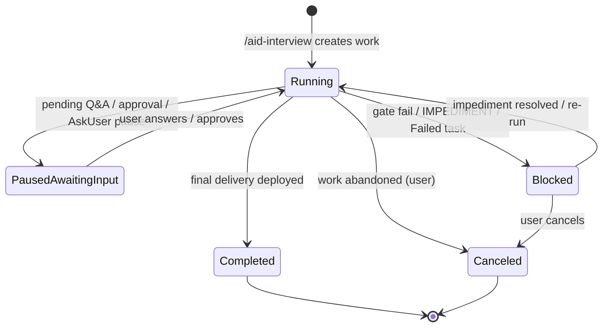

# Pipeline State Architecture (Research + Behavior-Preserving Refactor)

## Change Log

| Date | Change | Source |
|------|--------|--------|
| 2026-06-10 | Feature identified from REQUIREMENTS.md §5 FR17, FR16; §7 C4; §8 OQ4 | /aid-interview |

## Source

- REQUIREMENTS.md §5 FR17 (pipeline state-management review & normalization — owner)
- REQUIREMENTS.md §5 FR16 (lifecycle-state *primitives* — making the signals legible/reliable)
- REQUIREMENTS.md §7 C4 (behavior preservation — owner)
- REQUIREMENTS.md §8 OQ4 (where skill/task run-state lives — resolved here)
- REQUIREMENTS.md §3a (the four monitoring levels and their data sources)

## Description

The **producer-side foundation** of the work. Today, AID pipeline state is fragmented across
many places — work `STATE.md` sections (`## Tasks Status`, `## Quick Check Findings`,
`## Delivery Gates`), `.aid/.temp/*STATE*.md` run-state files, `MONITOR-STATE.md`, `.aid/.heartbeat/`,
`IMPEDIMENT-*` files, and pending-Q&A blocks — which makes it unreliable to answer "what is this
pipeline doing right now?"

This feature **reviews in full how the AID pipeline stores and manages state** and performs a
**behavior-preserving refactor** to produce a clean, reliable, **single-source normalized state
contract** that a deterministic reader can consume. Everything is on the table: where state files
live, what information is captured and when, file names, skill behavior, and agent definitions.

It deliberately does **not** build any dashboard UI — it produces the *contract* the dashboard's
reader (feature-002) consumes. It is the first feature/phase of the work.

**Scope of the redesign (user decision, 2026-06-10): fully open.** Everything about state storage
is on the table — including re-opening the FR2 STATE.md consolidation and the `## Housekeep Status`
layout if a better model warrants it. The **only invariant is C4 behavior preservation**: FR17 may
change the state *representation/format*, but observable pipeline behavior must not change and all
tests/CI/render-drift must stay green. The existing state design (FR2 consolidation, `## Housekeep
Status` relocation, `.aid/.temp/*STATE*.md`, heartbeat, `MONITOR-STATE.md` — see
`.aid/knowledge/pipeline-contracts.md`) must be **fully catalogued** by the research as the thing
being changed, but is **reference context, not a frozen baseline**.

## User Stories

- As a **dashboard developer**, I want a single reliable on-disk source of pipeline state so the
  reader can deterministically know each work's lifecycle state without scraping many scattered files.
- As an **AID maintainer**, I want the state refactor to preserve the pipeline's existing behavior
  so no phase, gate, output, or decision changes and all tests/CI stay green.
- As an **operator handing off a pipeline**, I want the per-pipeline state to travel with the work
  folder so another user can pick it up.

## Priority

Must (MVP — Phase 0 foundation; on the MVP critical path).

## Acceptance Criteria

- [ ] Given the current pipeline, when its state storage is reviewed, then a documented inventory
      of all state sources and a target **normalized state contract** (schema, locations, file
      names, capture timing) exists, and **OQ4 is resolved** (a single reliable source for
      "what skill/task is running and its status").
- [ ] Given the FR16 state set (Running / Paused-awaiting-input / Blocked / Completed / Canceled),
      when the contract is defined, then the on-disk state deterministically exposes the primitives
      needed to derive each state.
- [ ] Given any refactor increment, when CI runs, then **render-drift, the full `tests/run-all.sh`
      suite, and the Windows installer suite all stay green** and observable pipeline behavior
      (phases, gates, outputs, decisions) is unchanged (C4). Any observable-behavior change is a
      CRITICAL finding.
- [ ] Given the canonical→5-tree render pipeline, when canonical skills/agents/templates/scripts
      change, then the **FULL `run_generator.py`** is re-run and **all five install trees stay
      byte-identical** (no render-drift); the tri-tree edit surface (canonical/ source vs
      .claude/ dogfood vs profiles/ mirrors) is reconciled so the dashboard-consumed `.aid/` STATE
      and the rendered toolchain producers remain consistent.

---

## Technical Specification

> Activated sections (per `canonical/templates/specs/spec-template.md`): **Data Model** (the
> normalized STATE contract), **Feature Flow** (state production + read paths), **Layers &
> Components** (which producers write state + the dashboard read contract). Conditional:
> **State Machines** (FR16 lifecycle derivation), **Migration Plan** (C4 behavior-preserving,
> REQUIRED), **Telemetry & Tracking** (heartbeat / calibration as run-state signals). Skipped:
> API Contracts, UI Specs, Security, Mobile, Cache, etc. (not this feature — they belong to
> features 002–008).

This feature is **producer-side only**: it catalogues today's fragmented state surface, then
specifies a normalized single-source contract a deterministic reader (feature-002) can consume.
It builds no UI. The hard guardrail is **C4 behavior preservation** — the redesign may change
state *representation/format/location/filenames*, but not the pipeline's observable behavior
(phases, gates, outputs, decisions), and every increment keeps render-drift + `tests/run-all.sh`
+ the Windows installer suite green.

---

### 1. Current-State Inventory (the thing being changed)

State today is spread across **four physical homes** with **no single derivation surface**. Each
row below is what/where/when/who-writes/who-reads, with file:line evidence against `canonical/`.

#### 1a. Persistent per-work state — work `STATE.md` (FR2 consolidation)

One `STATE.md` per `.aid/work-NNN-{name}/` (`canonical/templates/work-state-template.md:1`).
Template-declared sections and their producer/consumer (per
`pipeline-contracts.md ## Work STATE.md` + the template):

| Section | Shape | Producer (file:line) | Consumer |
|---------|-------|----------------------|----------|
| Top blockquote `Status:` / `Phase:` / `Minimum Grade:` / `Started:` / `User Approved:` | 5 free-text fields | `aid-interview` (`state-lite-done.md`); thereafter **hand-edited prose** by each phase skill — no helper script writes the blockquote | every skill's State Detection (informal) |
| `## Triage` | bullets (`Path`, `Work Type`, `Sub-path`, …) | `aid-interview` TRIAGE | lite/full router |
| `## Interview Status` | fixed 10-row table + `Status`/`Grade` | `aid-interview` States 1–4 | interview CONTINUE/COMPLETION |
| `## Features Status` | table `# | Feature | Spec Status | Spec Grade | Q&A Count | Notes` | `aid-specify` (`state-initialize.md:81-83`, `state-continue.md:25,54,99`) — **hand-edited Markdown** | `aid-plan`, `aid-detail` |
| `## Plan / Deliveries` | table `Delivery | Status | Tasks | Notes` | `aid-plan` (hand-edited) | `aid-detail`, `aid-execute` |
| `## Tasks Status` | table `# | Task | Type | Wave | Status | Review | Elapsed | Notes` | `aid-execute` **via `writeback-state.sh --field`** (`state-execute.md:165,230,256,311`) | every execute state + delivery gate |
| `## Quick Check Findings` | per-task `### task-NNN` blocks | reviewer **via `writeback-state.sh --findings`** (`state-review.md:104`) | delivery-gate aggregator |
| `## Delivery Gates` | per-delivery `### delivery-NNN` blocks | reviewer **via `writeback-state.sh --block`** (`state-delivery-gate.md:355`) | `aid-deploy` |
| `## Deploy Status` | table | `aid-deploy` (hand-edited) | `aid-monitor` |
| `## Cross-phase Q&A (Pending)` | `### Q{N}` blocks (Style A) | all phases (loopback) | owning phase's Q&A state |
| `## Lifecycle History` | append-only table | all phases (hand-edited) | audit/human |

Plus one persistent **work-scoped** (not STATE.md) state file:

| File | Shape | Producer (mode) | Consumer |
|------|-------|-----------------|----------|
| `delivery-NNN-issues.md` | deferred-`[HIGH]` issue log per delivery | reviewer **via `writeback-state.sh --append-issue`** (`schemas.md §12`) | delivery-gate aggregator |

**Write mechanisms** to the work STATE.md / state files: (a) `writeback-state.sh` —
sentinel-locked + schema-validated, with **four** modes: `--field` (`## Tasks Status`),
`--findings` (`## Quick Check Findings`), `--block` (`## Delivery Gates`), and `--append-issue`
(`delivery-NNN-issues.md`); (b) free-form Markdown hand-edits by skill prose (everything else,
including the lifecycle-bearing top blockquote); (c) **on-demand section creation** by dispatch
protocols. (The helper does NOT write the top blockquote or any lifecycle field today — that gap
is exactly what M2's new `--pipeline` mode closes.)

#### 1b. Persistent discovery-area state — `.aid/knowledge/STATE.md`

The discovery equivalent (`schemas.md §3`, `pipeline-contracts.md ## Knowledge-Base STATE.md`):
`## Q&A (Pending)`, `## Review History`, `## Knowledge Summary Status`, `## KB Documents Status`,
`## Summarization History`, and the `**User Approved:**` gate. Produced by `aid-discover` /
`aid-summarize`; the approval flag is read back by `aid-housekeep` and `aid-summarize` preflight.
This is the **Level-1 KB-state source** (REQUIREMENTS §3a, FR15).

#### 1c. Transient run-state — `.aid/.temp/` + `.aid/.heartbeat/` (gitignored)

| Signal | File | Producer (file:line) | Who reads | Lifecycle |
|--------|------|----------------------|-----------|-----------|
| Housekeep run-state | `.aid/.temp/HOUSEKEEP_STATE_<YYYYMMDDHHMM>.md` (`## Housekeep Status` block, 9 `**Field:** value` lines) | `housekeep-state.sh --write` (`pipeline-contracts.md ## Housekeep Status Run-State Block`) | `housekeep-state.sh --resume`; **never** a work STATE.md (relocated PR #51) | created on run; removed at DONE |
| Sub-agent heartbeat | `.aid/.heartbeat/<agent>-<unix-ts>.txt` (single pipe-delimited line) | dispatcher pre-creates; subagent overwrites every N min (`subagent-heartbeat-protocol.md`) | dispatcher narration only | created on dispatch; deleted on completion |
| Reviewer ledger | `.aid/.temp/review-pending/<scope>.md` (7-col table) | `aid-reviewer` (`aid-reviewer/AGENT.md:49`); per-phase scopes (`detail.md`, `deploy.md`, `discovery.md`, …) | the dispatching skill's grade step | transient per review |
| Writeback lock | `.aid/work/.writeback-state.lock` | `writeback-state.sh` (`writeback-state.sh:138`) | itself (mutex) | created/removed per write |

#### 1d. Identity / install state — Level 0 + Level 1 config

- `.aid/.aid-manifest.json` — per-project install record (`schemas.md §8a`): tools, version,
  `installed_at`, paths, `root_agent_files[].sha256`. Written by the `aid` CLI installer, not the
  pipeline. **This is the Level-0 / install source** (REQUIREMENTS §3a level 0; FR7).
- `.aid/.aid-version` — plain version string.
- `.aid/settings.yml` — pipeline config (`schemas.md §2`): `project.*`, `tools.installed`,
  `review.minimum_grade`, `execution.max_parallel_tasks`, `traceability.heartbeat_interval`.

#### 1e. Catalogued discrepancies (the OQ4 problem, made concrete)

1. **`MONITOR-STATE.md` does not exist.** REQUIREMENTS §3a and this feature's Description cite it
   as a current source, but it is explicitly **deferred** —
   `canonical/skills/aid-monitor/SKILL.md:48` ("The Monitor area STATE is deferred until the area
   matures"). aid-monitor keeps an **in-memory** monitor context only (`SKILL.md:53-61`). So the
   "many scattered files" list overstates: monitor contributes *no* persistent run-state today.
2. **`## Calibration Log` + task `## Dispatches` are schema-orphans.** Written on demand by
   `aid-discover/SKILL.md:103` (`## Calibration Log`; the `## Dispatches` sub-column write is `:105`),
   `aid-monitor/SKILL.md:162-164`, `aid-housekeep/SKILL.md:89`, and
   `aid-execute`, but **declared in no state template** (neither `work-state-template.md` nor
   `discovery-state-template.md`). `pipeline-contracts.md` lists `## Calibration Log` as a required
   work-STATE section, but the template it cites omits it. Registered as **KI-001**.
3. **IMPEDIMENT path is documented two ways.** `schemas.md §13` says
   `.aid/{work}/task-NNN/IMPEDIMENT.md`; the producer `aid-execute` writes
   `.aid/{work}/IMPEDIMENT-task-NNN.md` (`state-execute.md:322,368`). Registered as **KI-002**.
4. **The OQ4 core fragmentation:** "what skill/task is running, and its status" has **no single
   home.** It must be reconstructed by joining: the work STATE.md top blockquote `Phase:`
   (hand-edited prose, no enum guarantee) + `## Tasks Status` rows (`Status` ∈ free text written by
   `writeback-state.sh`) + the presence/absence of a heartbeat file + the presence of an IMPEDIMENT
   file + a pending `### Q{N}` under `## Cross-phase Q&A` + the housekeep run-state file (a
   *different* file, not in the work folder). No field anywhere is a typed lifecycle enum; the
   reader must infer.

---

### 2. Target Normalized State Model (the redesign)

#### 2.1 Design principles (derived from REQUIREMENTS + NFRs)

| Principle | Source | Consequence for the model |
|-----------|--------|---------------------------|
| Per-pipeline state travels with the work folder (handoff) | §3 secondary user; user story 3 | All work-scoped state stays under `.aid/work-NNN-*/`; nothing pipeline-specific in `.aid/.temp/` |
| Level-0 from the global CLI | §3a level 0; FR7 | Reader reads `.aid/.aid-manifest.json` + `.aid/.aid-version` (already correct — no change) |
| Read-only, deterministic, no LLM at runtime | NFR2, NFR7 | Every derivable lifecycle field must be a **literal enum on disk**, not prose for an agent to interpret |
| Behavior preserved | C4 | Producers keep emitting the *same observable behavior*; only the field they write becomes typed/relocated |

#### 2.2 The single source of truth: a `## Pipeline Status` block in work `STATE.md`

The normalization introduces **one new contracted section** in `canonical/templates/work-state-template.md`
that is the deterministic reader's single entry point, and **types** the fields the reader needs.
It does not replace the existing rich sections — it is the **derivation summary** that the reader
consumes, written by the same producers that already transition the pipeline (so no new behavior).

```markdown
## Pipeline Status

> Single-source derivation summary for read-only consumers (the dashboard reader, FR16).
> Written ONLY by the helper `writeback-state.sh --pipeline ...` (new mode) at every existing
> phase/state transition the pipeline already performs. Never hand-edited. All values are
> closed enums so a deterministic reader needs no inference.

- **Lifecycle:** Running | Paused-Awaiting-Input | Blocked | Completed | Canceled
- **Phase:** Interview | Specify | Plan | Detail | Execute | Deploy | Monitor
- **Active Skill:** aid-{skill} | none
- **Updated:** {YYYY-MM-DDTHH:MM:SSZ}
- **Pause Reason:** {short text} | —          (present only when Lifecycle = Paused-Awaiting-Input)
- **Block Reason:** {short text} | —          (present only when Lifecycle = Blocked)
- **Block Artifact:** {relative path} | —     (e.g. IMPEDIMENT-task-NNN.md, or the failed gate)
```

Why a typed block (not reuse the prose blockquote): the existing top blockquote `Phase:` /
`Status:` is hand-edited free text with no enum guarantee (inventory 1a). FR16 needs a *closed*
enum the reader can switch on without an LLM (NFR7). The block is grep-recoverable
(`**Field:** value`), matching the established `## Housekeep Status` shape, and is written by the
same locked helper that already owns concurrent work-STATE writes.

#### 2.3 Concurrency: per-task lifecycle stays in `## Tasks Status` (FR14)

Parallel tasks are **not** flattened into the single `Lifecycle`. The block's `Lifecycle` is the
**work-level rollup**; the per-task detail the level-3 view needs already lives in `## Tasks Status`
(`Status` column). The normalization **types the `Status` column to a closed enum** so the reader
can render N concurrent tasks deterministically:

`## Tasks Status` `Status` ∈ `Pending | In Progress | In Review | Blocked | Done | Failed | Canceled`
(today the first six strings are written by `writeback-state.sh --field Status --value …` from
`state-execute.md:165,230,256,311` but are not constrained). **`Canceled` is a reserved enum member
with no current task-level producer** — cancellation is recorded at the *work* level
(`Lifecycle: Canceled`, §3), not per task; it is included so the validator accepts it if a future
producer emits it, and so the reader's switch is total. The enum validator must also accept the
empty `_none yet_` placeholder row. Rollup rule (deterministic, §3 below) derives the work
`Lifecycle` from the multiset of task `Status` values + the pause/block signals.

#### 2.4 What lives where (mapped to the four levels)

| Level | Scope | Source file(s) — TARGET | Change vs today |
|-------|-------|-------------------------|-----------------|
| 0 — tool | machine CLI | `.aid/.aid-manifest.json`, `.aid/.aid-version` | none (already correct) |
| 1 — repo | `.aid/` incl. KB | `.aid/knowledge/STATE.md` (`## Knowledge Summary Status`, `## KB Documents Status`, `**User Approved:**`), `.aid/knowledge/README.md` | none structural; consumed read-only by FR15 |
| 2 — work | per pipeline | `.aid/work-NNN-*/STATE.md` `## Pipeline Status` (NEW, the reader's entry point) + existing sections | **new typed block**; existing sections retained |
| 3 — skill/task | live | `.aid/work-NNN-*/STATE.md` `## Tasks Status` (typed `Status` enum) + `.aid/.heartbeat/<agent>-*.txt` (liveness) | `Status` enum typed; heartbeat unchanged |

**Run-state relocation decision (DD-2 below):** the only pipeline-relevant transient that lives
*outside* the work folder is the housekeep run-state (`.aid/.temp/HOUSEKEEP_STATE_<ts>.md`) — but
`/aid-housekeep` is **project maintenance, not a work pipeline** (off the mandatory pipeline,
no work folder), so it correctly stays project-scoped and is **out of the FR16 work-lifecycle
model**. The reader simply does not treat housekeep as a work. Heartbeat files remain gitignored
transient liveness (they do not travel on handoff — a handed-off pipeline is, by definition, not
mid-dispatch).

#### 2.5 The read contract (what feature-002 consumes)

For each `.aid/work-NNN-*/` the deterministic reader:
1. Reads `STATE.md` `## Pipeline Status` → `Lifecycle`, `Phase`, `Active Skill`, `Updated`,
   and the conditional `Pause/Block Reason/Artifact`. Single grep per field (`**Field:** value`).
2. For level-3 concurrency, reads `## Tasks Status` rows → per-task `Status` enum + `Wave`.
3. For liveness/freshness, may stat `.aid/.heartbeat/` (optional; `Updated` is authoritative).
4. Never writes, never invokes an agent (NFR2, NFR7). Absence of `## Pipeline Status` →
   reader falls back to the legacy derivation (feature-002's adapter) — which is why migration
   is incremental, not big-bang.

---

### 3. FR16 Lifecycle — State Machine + On-Disk Derivation

The five states are **derived** read-only. The `## Pipeline Status` `Lifecycle` field is the
authoritative literal; the table below is the deterministic rule the *producers* apply when they
write it (and the fallback the reader applies if the block is absent during migration).



| Lifecycle | Authoritative literal | Deterministic derivation primitives (fallback if block absent) |
|-----------|-----------------------|----------------------------------------------------------------|
| **Running** | `Lifecycle: Running` | Some `## Tasks Status` row `Status = In Progress`/`In Review`, OR an `Active Skill ≠ none` with no pause/block signal. Heartbeat freshness is corroborating, not required. |
| **Paused — Awaiting Input** | `Lifecycle: Paused-Awaiting-Input` + `Pause Reason` | A `### Q{N}` with `Status: Pending` under `## Cross-phase Q&A`, OR a PAUSE-FOR-USER-ACTION / PAUSE-FOR-USER-DECISION transition (`state-machine-chaining.md:41-63`). Approvals are a kind of input (FR16) — `**User Approved:** no` at a gate maps here. |
| **Blocked — error/impediment** | `Lifecycle: Blocked` + `Block Reason` + `Block Artifact` | An `IMPEDIMENT-task-NNN.md` exists (`state-execute.md:322`), OR a `## Tasks Status` row `Status = Failed`, OR a `## Delivery Gates` block whose `Grade < minimum`. |
| **Completed** | `Lifecycle: Completed` | `## Deploy Status` shows the final delivery shipped, OR all deliveries `Done` and work closed. |
| **Canceled** | `Lifecycle: Canceled` | Explicit user cancellation recorded in `## Lifecycle History` + `Lifecycle: Canceled`. (No prior auto-state — only a user action.) |

**Parallelism (FR14):** the work `Lifecycle` is a rollup over the per-task `Status` enum:
`Blocked` if any task `Failed`/blocked-unresolved; else `Paused-Awaiting-Input` if a pending
input/approval signal exists; else `Running` if any task `In Progress`/`In Review`; else terminal.
The reader renders the **individual** task states from `## Tasks Status` for the level-3 concurrent
view — the rollup does not hide them.

---

### 4. Behavior-Preserving Migration Plan (C4)

**Strategy:** normalize **one signal at a time**, each increment independently shippable, each
verified by the full C4 surface, so feature-002's fallback adapter can switch signals over
progressively (it always falls back to legacy derivation for not-yet-migrated signals).

**Verification surface (every increment — the C4 checklist):**
- [ ] Re-run the **FULL** generator: `python3 .claude/skills/aid-generate/scripts/run_generator.py`
      (NOT a per-script renderer) — all five install trees + the dogfood `.claude/` byte-identical,
      no render-drift; `verify_deterministic.py` exits 0.
- [ ] `bash tests/run-all.sh` green (35 canonical suites; add/extend suites where a new helper mode
      or enum is introduced).
- [ ] Windows installer suite green (`tests/windows/Test-AidInstaller.ps1` + the `*-ps1`/`*-parity`
      canonical suites) — run on a Windows runner per the testing-cadence memory.
- [ ] Shipped scripts remain **ASCII-only** (`coding-standards.md §Bash/PowerShell`;
      `tests/canonical/test-ascii-only.sh`).
- [ ] **Observable behavior unchanged:** same phases, same gates, same outputs, same decisions.
      Any observable-behavior change is a **CRITICAL** finding (AC3). The only new write is the
      typed `## Pipeline Status` block, emitted at transitions the pipeline *already* performs.

| Inc. | Scope | Producers touched | Verify focus |
|------|-------|-------------------|--------------|
| **M0** | Reconcile docs only (no behavior): fix KI-002 IMPEDIMENT path in `schemas.md §13` to match the producer; declare `## Calibration Log` + task `## Dispatches` in `work-state-template.md` (KI-001). | templates + KB docs only | render-drift (template is rendered); KB-hygiene CI; no test change |
| **M1** | Add the `## Pipeline Status` section to `work-state-template.md` (initial values written by `aid-interview` at work creation). | `work-state-template.md`, `aid-interview` state-lite-done / feature-decomposition | full generator; run-all; new template-shape assertion |
| **M2** | Add `writeback-state.sh --pipeline --field FIELD --value VALUE` mode (sentinel-locked, enum-validated) — the ONLY writer of the block. | `canonical/scripts/execute/writeback-state.sh` + new `tests/canonical/test-writeback-state.sh` cases | run-all (extend the 69-test suite); full generator (7 byte-identical copies) |
| **M3** | Type the `## Tasks Status` `Status` column to the closed enum; `writeback-state.sh --field Status` validates it. | `writeback-state.sh`, `state-execute.md` value strings | run-all; behavior diff = none (the six produced strings are unchanged, now validated; `Canceled` is a reserved member with no producer, and the `_none yet_` placeholder row is accepted) |
| **M4** | Wire each phase skill to call `--pipeline` at its existing transitions (`aid-specify`, `aid-plan`, `aid-detail`, `aid-execute`, `aid-deploy`) — emit Lifecycle/Phase/Active Skill at the points they already transition. | each skill's `references/state-*.md` | full generator; run-all; manual: confirm no new prompts/gates |
| **M5** | Wire pause/block signals: write `Paused-Awaiting-Input` on pending Q&A / PAUSE transitions; `Blocked` on IMPEDIMENT / Failed / sub-min gate. | `state-machine-chaining` consumers, `aid-execute` impediment path | run-all; manual: pause/resume + impediment flows unchanged |
| **M6** | Reader-readiness check: feature-002 adapter switched off legacy fallback per fully-migrated signal. | (feature-002 consumes; no producer change) | feature-002 tests |

Increments are independently revertible; each is one delivery in `/aid-plan`.

---

### 5. Risks / Open Items (and how bounded)

| Risk | Bound |
|------|-------|
| New write at every transition could change timing/observable output | New write is a **single locked helper call** emitting an enum; it prints no user-facing line and gates nothing. C4 checklist's "observable behavior unchanged" + manual pause/impediment walk-throughs catch any leak. |
| `writeback-state.sh` is on the parallel-pool hot path; a new mode could introduce a race | Reuse the **existing sentinel lock** (`writeback-state.sh:138-168`); add concurrency cases to the existing 69-test suite (M2). |
| Render-drift across 7 copies of any edited script/template | Always run the **FULL `run_generator.py`** (render-drift memory), never per-script renderers; `verify_deterministic.py` is the gate. |
| Enum drift between producer strings and reader expectations | Enums are declared once in `work-state-template.md` + validated in `writeback-state.sh`; the reader (feature-002) imports the same enum list. Single source of truth. |
| Scope creep into FR2 re-litigation | The redesign is **additive** (one typed block + typing existing columns), not a teardown of FR2. The fully-open mandate is honored by *evaluating* re-opening FR2 and concluding additive-normalization is the behavior-preserving minimum (DD-3). |
| Open: exact `Active Skill`/`Phase` granularity for parallel discover/execute waves | Defaulted to work-level rollup + per-task detail in `## Tasks Status`; revisit if feature-002 needs finer phase granularity (carry to `/aid-plan`). |
