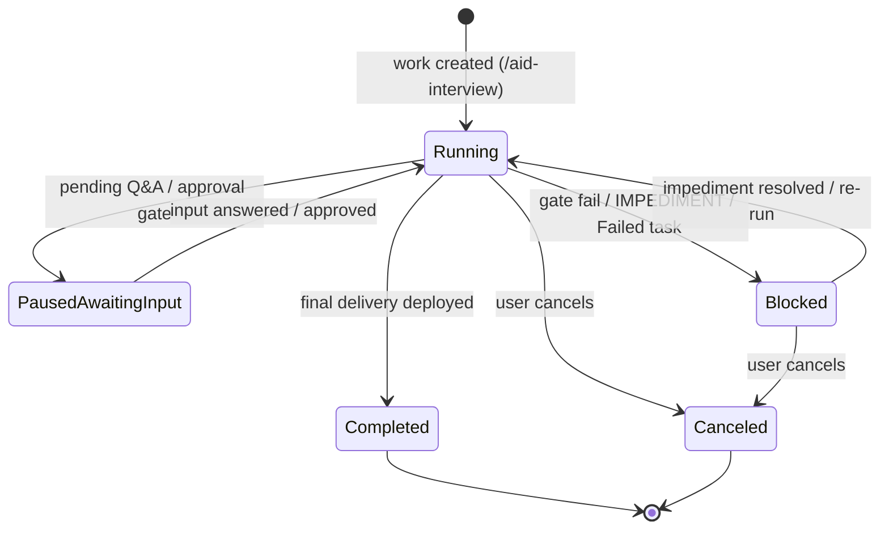

# State Reader Foundation (Read-Only Dashboard Model)

## Change Log

| Date | Change | Source |
|------|--------|--------|
| 2026-06-10 | Feature identified from REQUIREMENTS.md §5 FR2, FR6, FR12, FR16; §3a level-3 open item; consumes feature-001 contract | /aid-interview |

## Source

- REQUIREMENTS.md §5 FR2 (four-level view — model side)
- REQUIREMENTS.md §5 FR6 (maximal tracking detail — defines the per-level display field-set)
- REQUIREMENTS.md §5 FR12 (per-work-folder history/retention — enumerates work folders)
- REQUIREMENTS.md §5 FR16 (lifecycle-state **derivation function**)
- REQUIREMENTS.md §3a (data sources per level); consumes feature-001's normalized contract
- REQUIREMENTS.md §6 NFR2 (read-only), NFR4 (low overhead)

## Description

The **consumer-side foundation**: a **read-only** reader that loads AID state for a repo and
produces a **normalized in-memory display model** for the four monitoring levels. It enumerates the
work folders that persist in `.aid/` (retention = which folders exist; no separate history store),
defines the field-set to show per level, and **derives each work's lifecycle state** (Running /
Paused-awaiting-input / Blocked / Completed / Canceled) from the normalized state.

It reads the normalized contract defined by feature-001, with a **temporary fallback adapter** that
can read today's fragmented state so a useful dashboard is demonstrable before the refactor fully
lands. The reader never writes anything and uses no agents/LLM.

## User Stories

- As a **dashboard developer**, I want one model that represents project/work/skill-task state so
  every view renders from the same normalized data.
- As an **operator**, I want completed and in-flight works alike to appear, as long as their folders
  remain in the repo.

## Priority

Must (MVP).

## Acceptance Criteria

- [ ] Given a repo's `.aid/`, when the reader runs, then it produces a normalized model covering
      levels 1–3 (and the level-0 hook) without modifying any file (NFR2).
- [ ] Given multiple work folders, when the reader enumerates them, then each appears in the model;
      retention follows folder persistence (FR12).
- [ ] Given a work's normalized state, when lifecycle is derived, then exactly one of
      {Running, Paused-awaiting-input, Blocked, Completed, Canceled} is produced (FR16).
- [ ] Given feature-001's contract is only partially migrated, when the reader runs, then the
      fallback adapter supplies the not-yet-normalized signals, and each fallback path is tracked
      as temporary tech-debt.

---

## Technical Specification

> Activated sections (per `canonical/templates/specs/spec-template.md`): **Data Model** (the
> normalized in-memory display model — types for levels 0–3 + how they map from feature-001's
> on-disk contract), **Feature Flow** (the read path: discover `.aid/` → enumerate work folders →
> parse each level's source → emit the model), **Layers & Components** (reader components, the
> read-only boundary, the fallback adapter for not-yet-migrated state). Conditional:
> **State Machines** (the FR16 derivation function — feature-001 primitives → 5 lifecycle states,
> the work-level rollup over per-task `Status` (FR14)), **Telemetry & Tracking** (heartbeat liveness
> as a corroborating-only signal). Skipped: UI Specs / API Contracts / serving (feature-003), CLI
> (feature-004), remote exposure & Security (feature-005), Migration Plan (owned by feature-001's
> M0–M6).

This feature is **consumer-side only**: a deterministic, **read-only** reader that loads a repo's
`.aid/` state into a **normalized in-memory display model** for the four monitoring levels
(REQUIREMENTS §3a), enumerates work folders (FR12), and **derives each work's FR16 lifecycle
state**. It builds no UI, opens no socket, invokes no agent/LLM (NFR2, NFR7). It **consumes**
feature-001's contract (the typed `## Pipeline Status` block + typed `## Tasks Status` `Status`
enum) and falls back to legacy fragmented signals for any work whose state feature-001 has not yet
migrated (feature-001 M0–M6). The model is the single input every feature-003+ view renders from.

**Grounding posture.** feature-001's `## Pipeline Status` block and typed `## Tasks Status` `Status`
enum are **not yet on disk** — `canonical/templates/work-state-template.md` (read 2026-06-10) has no
`## Pipeline Status` section and an unconstrained `Status` column. Therefore the reader is specified
**fallback-first**: every lifecycle fact has a legacy derivation that works against today's template,
and a preferred normalized path that activates per-work as feature-001 lands. This is not optional
polish — until feature-001 M1–M5 ship, the fallback IS the reader.

**Runtime-agnostic contract.** The dashboard's exact runtime (Python stdlib-only vs Node
built-ins-only) is feature-003's OQ2 decision (REQUIREMENTS §8). This spec defines the model's
**types, fields, parse rules, and derivation logic** in implementation-neutral terms — every parse
rule is a single anchored grep / line-scan expressible in either runtime with **zero third-party
dependencies** (`technology-stack.md`: Python 3.11+ stdlib-only, Node built-ins-only). Where a
concrete shape helps, types are shown as language-neutral record definitions, not a committed
language.

---

### Data Model

No relational schema — AID ships no database (`schemas.md`). The "data model" here is the
**normalized in-memory display model**: a tree of plain records the reader builds per read pass and
hands to the renderer. All fields are **read-derived**; the reader never persists it.

#### DM-1. Top-level shape

```
RepoModel
├─ tool:    ToolInfo          # Level 0 — machine CLI (FR7)
├─ repo:    RepoInfo          # Level 1 — project / .aid/ + KB-state hook (FR15, this feature: hook only)
├─ works:   list<WorkModel>   # Level 2 — one per .aid/work-NNN-*/ folder (FR12)
└─ read:    ReadMeta          # provenance of THIS read pass (timing, fallback usage, parse warnings)
```

#### DM-2. Level 0 — `ToolInfo` (FR7)

Source (unchanged by feature-001; `pipeline-contracts.md ## File-Format Contracts`,
`schemas.md §8a`): `.aid/.aid-manifest.json` + `.aid/.aid-version`. Verified on disk 2026-06-10
(manifest keys `manifest_version, aid_version, installed_at, tools`; tool entry keys
`version, installed_at, paths, root_agent_files`).

| Field | Type | Source field | Notes |
|-------|------|--------------|-------|
| `aid_version` | string | `.aid-manifest.json:aid_version` (fallback `.aid/.aid-version` plain string) | both read 2026-06-10 = `1.0.0` |
| `installed_at` | ISO-8601 string | `.aid-manifest.json:installed_at` | |
| `tools_installed` | list<string> | keys of `.aid-manifest.json:tools` | e.g. `["claude-code"]` |
| `manifest_present` | bool | `.aid-manifest.json` stat | false → render "tool info unavailable", do not error |

This feature delivers Level-0 parsing as a **data hook** only; the level-0 card UI is feature-006
(FR7). Reading it here keeps the model complete and proves the read-only manifest path.

#### DM-3. Level 1 — `RepoInfo` (FR1, FR15 hook)

| Field | Type | Source | Notes |
|-------|------|--------|-------|
| `project_name` | string | `.aid/settings.yml` `project.name` | read via the model's settings parse (see DM-7) |
| `aid_dir` | path | the resolved `.aid/` root | the per-repo scope (FR1) |
| `kb_state` | `KbStateRef` \| null | `.aid/knowledge/STATE.md` + `README.md` | **hook only** — see below |

`KbStateRef` is a **thin reference**, not the full KB dashboard (FR15's rich card is feature-007).
This feature populates only what FR16/FR3 cards need to *exist*; it captures:
`summary_approved` (bool, from `.aid/knowledge/STATE.md` `## Knowledge Summary Status`
`**User Approved:**` line — verified present 2026-06-10), `last_summary_date`, and
`doc_count` (rows under `.aid/knowledge/README.md ## Completeness` table). Absent KB → `null`
(repo never ran `/aid-discover`); render gracefully. Deeper KB fields are explicitly deferred to
feature-007 and **not** modeled here.

#### DM-4. Level 2 — `WorkModel` (FR2, FR6, FR12)

One per `.aid/work-NNN-*/` directory. Enumeration = retention (FR12): the model contains exactly the
work folders that exist on disk; there is no separate history store, and completed and in-flight
works are represented identically (FR12, user story 2).

| Field | Type | Source (preferred → fallback) | Notes |
|-------|------|-------------------------------|-------|
| `work_id` | string | folder name `work-NNN-{slug}` | the stable key (FR12) |
| `name` | string | folder slug | display label |
| `lifecycle` | `Lifecycle` enum | `## Pipeline Status` `Lifecycle` → SM-2 fallback derivation | the FR16 state (SM-1) |
| `phase` | `Phase` enum \| null | `## Pipeline Status` `Phase` → top-blockquote `Phase:` (free text, best-effort map) | feature-001's 7-member `Phase` enum |
| `active_skill` | string \| null | `## Pipeline Status` `Active Skill` → null in fallback | `aid-{skill}` or `none` |
| `updated` | ISO-8601 \| null | `## Pipeline Status` `Updated` → newest `## Lifecycle History` row date (fallback) | authoritative freshness when present |
| `pause_reason` | string \| null | `## Pipeline Status` `Pause Reason` → derived signal label | present only when `lifecycle = Paused-Awaiting-Input` |
| `block_reason` | string \| null | `## Pipeline Status` `Block Reason` → derived signal label | present only when `lifecycle = Blocked` |
| `block_artifact` | path \| null | `## Pipeline Status` `Block Artifact` → discovered IMPEDIMENT path | e.g. `IMPEDIMENT-task-NNN.md` |
| `tasks` | list<`TaskModel`> | `## Tasks Status` rows | level-3 concurrency (DM-5, FR14) |
| `pending_inputs` | list<`PendingInput`> | `## Cross-phase Q&A (Pending)` `### Q{N}` with `Status: Pending` (approvals included — they surface as pending Q&A). Excludes the terminal top-blockquote `**User Approved:**` work-completion gate (see SM-2 prio-4). | drives Paused derivation + FR11 attention |
| `source_mode` | enum `normalized \| fallback \| mixed` | which path produced `lifecycle` | provenance for FR12 trust + tech-debt tracking |

`source_mode` is load-bearing for AC4: it records, per work, whether the normalized
`## Pipeline Status` block was found or the legacy fallback was used — the reader's machine-readable
record of which temporary fallback paths are still in play.

#### DM-5. Level 3 — `TaskModel` (FR6, FR14)

One per `## Tasks Status` row (table columns confirmed in
`canonical/templates/work-state-template.md`: `# | Task | Type | Wave | Status | Review | Elapsed |
Notes`). The placeholder `_none yet_` row (present in the live template and in this work's STATE.md,
verified 2026-06-10) is **skipped**, yielding an empty `tasks` list.

| Field | Type | Source column | Notes |
|-------|------|---------------|-------|
| `task_id` | string | `Task` (and leading `#`) | |
| `type` | string | `Type` | e.g. CODE / DESIGN / RESEARCH |
| `wave` | string \| null | `Wave` | parallel-wave grouping (FR14) |
| `status` | `TaskStatus` enum | `Status` | typed by feature-001 M3; fallback accepts the six legacy strings + maps unknowns to `Unknown` |
| `review_grade` | string \| null | `Review` | reviewer grade if present (FR6, FR13 hook) |
| `elapsed` | string \| null | `Elapsed` | |
| `notes` | string \| null | `Notes` | |

**FR14 representation.** Concurrency is **first-class**: `WorkModel.tasks` is a flat list and each
`TaskModel` carries its own `status` and `wave`, so N simultaneously-active tasks render side by side
with their individual states. The model never collapses parallel tasks into a single "current task"
(AC2). The renderer groups by `wave` for the concurrent level-3 view; the model just supplies the
rows. The work-level `lifecycle` rollup (SM-3) is a **summary that sits alongside** the per-task
list, never a replacement for it.

#### DM-6. Enum definitions (single source of truth = feature-001)

The reader **imports the same enum members feature-001 declares** in
`canonical/templates/work-state-template.md` — it does not invent a parallel vocabulary (feature-001
DD risk "enum drift": single source of truth). Members reproduced here for the reader's switch
totality:

- `Lifecycle` ∈ `Running | Paused-Awaiting-Input | Blocked | Completed | Canceled` (FR16; SM-1).
- `Phase` ∈ `Interview | Specify | Plan | Detail | Execute | Deploy | Monitor` (feature-001 §2.2).
- `TaskStatus` ∈ `Pending | In Progress | In Review | Blocked | Done | Failed | Canceled`
  (feature-001 §2.3). The reader adds one **reader-only** sentinel **`Unknown`** for a fallback row
  whose `Status` string matches no enum member — so the reader's switch is total and an unmigrated /
  malformed value renders as "unknown" rather than crashing (NFR7: deterministic, never throws on
  data). `Unknown` is never written anywhere (NFR2); it exists only in-memory.

#### DM-7. `ReadMeta` (provenance — NFR4, AC4)

| Field | Type | Notes |
|-------|------|-------|
| `read_at` | ISO-8601 | wall-clock of this pass (the only place the reader reads the clock) |
| `work_count` | int | works enumerated |
| `fallback_works` | list<string> | `work_id`s whose `source_mode ≠ normalized` — the live tech-debt surface for AC4 |
| `parse_warnings` | list<string> | non-fatal anomalies (missing section, unparseable row) — never raised as exceptions |
| `bytes_read` | int | corroborates NFR4 (low overhead); for feature-003's polling budget |

Settings parse (DM-3 `project_name`): the reader reads `.aid/settings.yml` directly for the single
`project.name` scalar **for display only**. It does **not** reimplement grade-resolution semantics —
`read-setting.sh` is the contract for *resolution* (`pipeline-contracts.md`), but a read-only display
tool needs only the literal name, and shelling to a script is a runtime decision deferred to
feature-003. Modeled as: "obtain `project.name`; on any failure fall back to the folder basename."

---

### Feature Flow

The read path (NFR2 read-only, NFR7 no agents). All steps are pure filesystem reads + string parsing;
no step writes, locks, or dispatches.

```
read_repo(aid_root) -> RepoModel
  1. RESOLVE     verify aid_root/.aid exists; if absent -> empty RepoModel + parse_warning (per-repo, FR1)
  2. LEVEL-0     parse .aid/.aid-manifest.json (+ .aid/.aid-version)            -> ToolInfo      (DM-2)
  3. LEVEL-1     parse .aid/settings.yml project.name; stat .aid/knowledge/     -> RepoInfo      (DM-3)
  4. ENUMERATE   glob .aid/work-NNN-*/ (dirs only); each is one work (FR12)     -> work_id list
  5. PER WORK (for each folder; independent, order-independent):
       5a. read STATE.md once into memory (single file read)
       5b. try NORMALIZED: locate '## Pipeline Status' block; grep typed fields  -> partial WorkModel
       5c. parse '## Tasks Status' rows (skip _none yet_)                        -> tasks[] (DM-5)
       5d. parse '## Cross-phase Q&A (Pending)' for Status: Pending + approval gates -> pending_inputs
       5e. if 5b found block: source_mode=normalized
           else FALLBACK adapter (LC-3) reconstructs lifecycle from legacy signals; source_mode=fallback
       5f. DERIVE lifecycle via SM-2 (normalized authoritative) or SM-3 rollup (fallback)
       5g. set updated, pause/block fields per SM-1
  6. ASSEMBLE    RepoModel{tool, repo, works, read=ReadMeta}                     -> return
```

- **Entry point (this feature's deliverable):** a single pure function `read_repo(aid_root) ->
  RepoModel`. It is the reader's only public surface. **Polling/refresh is feature-003's** (FR4/FR5)
  — feature-003 calls `read_repo` on its interval; this feature guarantees the call is cheap
  (single bounded pass, no writes) and idempotent. Re-reading is the entire refresh mechanism, which
  is why the model is rebuilt fresh each pass (no caching state in the reader; NFR3 freshness ≤ poll
  interval falls out for free).
- **Per-work independence (FR1/FR12):** step 5 is per-folder and order-independent; one malformed
  STATE.md yields a `parse_warning` + a best-effort `WorkModel` (lifecycle may be `Running` with
  `source_mode=fallback`), never aborts the whole pass. A repo with zero works returns a valid
  `RepoModel` with `works=[]`.
- **`.aid/.temp/` and `.aid/.heartbeat/` are NOT enumerated as works** (DD-3): the housekeep
  run-state lives in `.aid/.temp/HOUSEKEEP_STATE_<ts>.md` and is **not a work** (feature-001 §2.4 +
  DD-2). The reader's work-glob is exactly `.aid/work-NNN-*/`, so housekeep and transient dirs are
  structurally excluded — no special-casing needed.
- **No write, no lock, no agent:** the reader opens files **read-only** and never acquires
  `writeback-state.sh`'s sentinel lock — it tolerates reading a STATE.md mid-write (a torn read
  yields a `parse_warning` + fallback for that one work on that one pass; the next poll corrects it).
  This is the deliberate NFR2/NFR4 trade: zero contention with the live pipeline, eventual
  consistency within one poll interval (NFR3).

---

### Layers & Components

Three thin components behind the `read_repo` entry point. Per `coding-standards.md` (small, single
-purpose units; deterministic; no hidden I/O) and `module-map.md` (the dashboard reader is a new
module the dashboard app, feature-003, will consume).

| Component | Responsibility | Reads | Never does |
|-----------|----------------|-------|------------|
| **LC-1 Locator** | resolve `.aid/` root, enumerate `work-NNN-*/`, stat manifest/KB | filesystem listing only | no parse, no write |
| **LC-2 Parsers** | per-source structural parse: manifest JSON, settings scalar, STATE.md section/table/block parsers | file bytes | no derivation, no write |
| **LC-3 Fallback Adapter** | reconstruct lifecycle from **legacy** fragmented signals when `## Pipeline Status` is absent | LC-2 outputs + IMPEDIMENT/heartbeat stat | no write; flagged as temporary |
| **(derivation)** | SM-1/SM-2/SM-3 lifecycle logic — pure function over LC-2/LC-3 outputs | in-memory records | no I/O at all |

- **Read-only boundary (NFR2, hard).** The boundary is structural, not conventional: only **LC-1**
  and **LC-2** touch the filesystem and they use read/stat/glob exclusively — there is no write/open
  -for-append/lock call anywhere in the reader. A test asserts the reader module contains no write
  primitive (mirrors feature-001's `branch-commit.sh` "no git push" self-check pattern,
  `pipeline-contracts.md`; and `cleanup-classify.sh`'s read-only self-check). This makes NFR2
  enforceable in CI, not just asserted in prose.
- **No-LLM boundary (NFR7, hard).** All of LC-1/LC-2/LC-3 + derivation are deterministic code; the
  reader has no Agent/LLM call path. The derivation table (SM-1) is a closed switch over enum
  literals — no inference, no model call. This is why feature-001 types the on-disk fields: so the
  consumer never needs an LLM to interpret prose.
- **The Fallback Adapter (LC-3) — temporary by construction.** It exists only because feature-001's
  M1–M5 migration is incremental (feature-001 §4, M6 = "reader switched off legacy fallback per
  fully-migrated signal"). Each fallback derivation path (SM-2 fallback column) is registered as
  temporary tech-debt (KI-003, KI-004 below) so AC4 is auditable: when feature-001 confirms a signal
  is fully normalized, the corresponding LC-3 branch is deleted and the tech-debt entry closed.
  `ReadMeta.fallback_works` is the runtime evidence of which works still need it.
- **Dependency direction:** feature-003 (app) → `read_repo` → {LC-1, LC-2, LC-3, derivation}. The
  reader depends on **nothing** in feature-003/004/005 (no server, no CLI, no socket). It depends on
  feature-001's *contract* (enum members + section names + the IMPEDIMENT path KI-002 resolves), not
  on feature-001's *code*.

---

### State Machines

#### SM-1. FR16 lifecycle — the five states (consumes feature-001 SM verbatim)

The reader does **not** re-design the lifecycle — feature-001 §3 owns the state machine and the
producer-side transitions. The reader **derives the current state read-only**, consuming feature-001's
`## Pipeline Status` `Lifecycle` literal as authoritative, and computing the same result from legacy
primitives only when that block is absent (migration window).



#### SM-2. Derivation function — `derive_lifecycle(work) -> Lifecycle`

Deterministic, total, side-effect-free (NFR7). **Preferred path:** if the `## Pipeline Status` block
is present, its `Lifecycle` literal is returned verbatim (feature-001 made it authoritative;
`source_mode=normalized`). **Fallback path** (block absent; `source_mode=fallback`): apply the rules
below **in priority order** — first match wins, guaranteeing exactly one state (AC3). The priority
order resolves the multi-signal case (e.g. a Failed task AND a pending Q&A → Blocked, because an
error outranks an input wait).

| Prio | Result | Normalized literal | Fallback primitive (legacy signals, against today's template) |
|------|--------|--------------------|---------------------------------------------------------------|
| 1 | **Canceled** | `Lifecycle: Canceled` | a `## Lifecycle History` row whose **Phase Transition / Gate** column matches `/cancel|canceled/i` (terminal; no auto-entry — only user action, feature-001 §3). This is a **best-effort** legacy primitive: if no such row is found the rule does not fire (fall through); the reader records a `parse_warnings` note when a row mentions cancellation ambiguously. (Normalized `Lifecycle: Canceled` is authoritative once feature-001 lands.) |
| 2 | **Completed** | `Lifecycle: Completed` | `## Deploy Status` shows the final delivery shipped, OR all `## Plan / Deliveries` rows `Done` with no open task | 
| 3 | **Blocked** | `Lifecycle: Blocked` + `Block Reason`/`Artifact` | an `IMPEDIMENT-task-NNN.md` exists in the work folder (flat path per KI-002 / `state-execute.md:322`), OR any `## Tasks Status` row `Status = Failed`, OR a `## Delivery Gates` block `Grade < minimum` |
| 4 | **Paused — Awaiting Input** | `Lifecycle: Paused-Awaiting-Input` + `Pause Reason` | any `### Q{N}` under `## Cross-phase Q&A (Pending)` with `Status: Pending` — a genuine open question/decision awaiting the user. **Note:** the top-blockquote `**User Approved:**` field is the *terminal work-completion* gate (`work-state-template.md:7`), **not** a mid-run pause signal, so it is **deliberately excluded** from this primitive (using it would wrongly derive Paused for any not-yet-completed live work). There is no per-Q&A/per-gate approval field in today's template; an "awaiting approval" pause is represented as a `### Q{N}` `Status: Pending` (approvals are surfaced as pending Q&A — see this work's own Q1–Q3). |
| 5 | **Running** | `Lifecycle: Running` | any `## Tasks Status` row `Status ∈ {In Progress, In Review}`, OR an active phase with none of the above; **the default** for a live work with no terminal/pause/block signal |

Notes binding the table to disk:
- **IMPEDIMENT path:** the fallback scans the **flat** `.aid/{work}/IMPEDIMENT-task-NNN.md`
  (the producer's de-facto path, `state-execute.md:322`), **not** the `task-NNN/IMPEDIMENT.md`
  subdir that `schemas.md §13` wrongly documents. feature-001 KI-002 resolves the doc; the reader
  follows the producer. Registered as **KI-003** so the reader's hard-coded path tracks feature-001's
  resolution.
- **Heartbeat is corroborating only** (Telemetry below): it can confirm "Running is live" but its
  absence never demotes a work out of Running — a work between dispatches is still Running. SM-2 does
  **not** read heartbeat as a primitive (it would create false Blocked/idle states); heartbeat
  informs only the freshness badge (feature-003).
- **`Updated` / freshness:** when the block is present, `Updated` is authoritative (feature-001 §2.5).
  In fallback, the reader uses the newest `## Lifecycle History` date as a coarse `updated` and marks
  it approximate in `parse_warnings`.

#### SM-3. Work-level rollup over per-task status (FR14)

When deriving the **fallback** `Running`/`Blocked` distinction for a work with multiple concurrent
tasks, the rollup mirrors feature-001 §3 exactly (the reader applies the same rule the producer would
write, so normalized and fallback agree):

```
rollup(tasks, pending_inputs, impediment, deploy_done):
    if user_cancellation_recorded:            return Canceled
    if deploy_done or all_deliveries_done:     return Completed
    if impediment_exists or any task.status == Failed
       or any sub-min delivery gate:           return Blocked
    if pending_inputs non-empty:               return Paused-Awaiting-Input
    if any task.status in {In Progress, In Review}: return Running
    return Running   # live work, between waves — never "Idle" (FR16: no Idle state)
```

The rollup produces the **work-level** `lifecycle`; it does **not** flatten the per-task list.
`WorkModel.tasks` retains every task's individual `status` and `wave` (DM-5) so feature-003's
level-3 view shows all concurrent tasks at once (AC2/FR14). The rollup and the per-task list are
complementary outputs of the same read pass.

---

### Telemetry & Tracking

Heartbeat liveness is the only telemetry signal the reader touches, and it is **corroborating only**
(never a lifecycle primitive — see SM-2).

- **Source:** `.aid/.heartbeat/<agent>-<unix-ts>.txt`, single pipe-delimited line
  (`pipeline-contracts.md ## Heartbeat File`; schema
  `[<ISO-8601-UTC>] <STATE> | <progress> | <activity> (~<eta-remaining>)`). Parser-friendly:
  `head -1` + split on `|` (the contract's own stated parse). The directory is gitignored and may be
  absent (verified 2026-06-10: no `.aid/.heartbeat/` currently exists) — absence is normal.
- **Use:** the reader may `stat` the directory to compute a per-work/per-agent **liveness freshness**
  signal (newest heartbeat mtime vs `read_at`) that feature-003 renders as a "live/stale" badge
  alongside a Running work. It is advisory: a fresh heartbeat corroborates Running; a stale/absent one
  is **not** evidence of Blocked or Completed (a handed-off or between-dispatch pipeline legitimately
  has no heartbeat — feature-001 §2.4).
- **Cost (NFR4):** stat-only, no file reads in the common path; bounded by the heartbeat-file count
  (one per in-flight dispatch). The reader records `bytes_read` so feature-003 can budget the poll.
- **Cross-work attribution caveat:** heartbeat filenames key on `<agent>-<unix-ts>`, not on
  `work_id`, so a heartbeat cannot be attributed to a specific work with certainty when multiple works
  run concurrently. The reader therefore treats heartbeat as a **repo-level** liveness hint, not a
  per-work fact, and never lets it influence `lifecycle`. Registered as **KI-004** (corroborating-only
  by design; revisit if feature-001 adds work-scoped liveness).

---

### Known issues registered by this feature

Registered in `.aid/work-001-aid-dashboard/known-issues.md` — only for code/contract this feature
touches:

- **KI-003** — the reader's Blocked-state IMPEDIMENT scan hard-codes the flat
  `.aid/{work}/IMPEDIMENT-task-NNN.md` path; it must track feature-001 KI-002's path reconciliation.
- **KI-004** — heartbeat files are not work-scoped (`<agent>-<unix-ts>`), so liveness is a repo-level
  hint only; the reader deliberately never derives lifecycle from it.

(KI-001/KI-002 are feature-001's; this feature consumes their resolution and does not duplicate them.)

