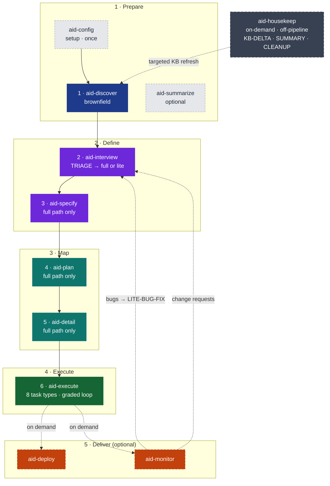
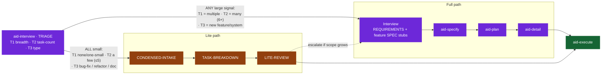
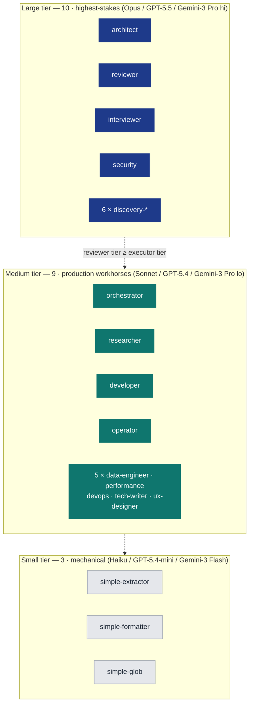
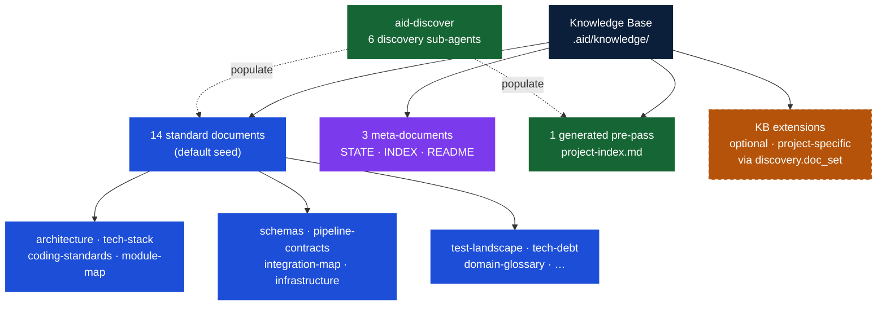
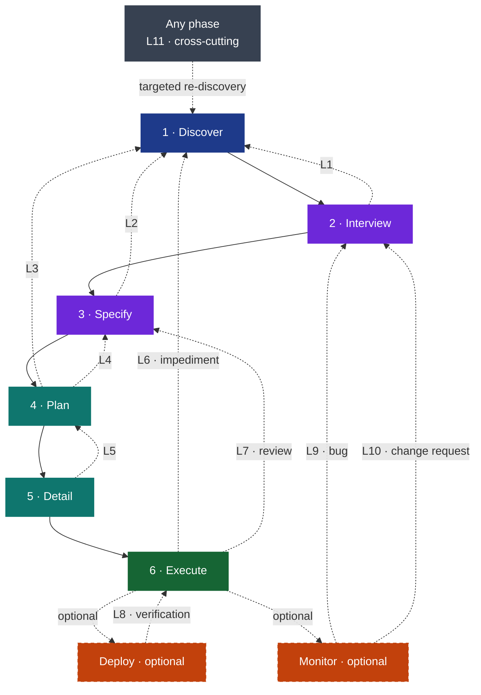

# Approved diagrams — work-002 visual-first rewrite

These Mermaid blocks were reviewed and **user-approved** (rendered + validated). Writers
must paste them VERBATIM (only the README hero may drop the two `Mon -.-> Intv` feedback
arrows for a simpler glance version). Keep the shared palette below consistent in ANY new
diagram or table.

## Shared palette (use everywhere — diagrams AND table accents)

| Role | Hex | Mermaid classDef |
|------|-----|------------------|
| Prepare | `#1E3A8A` (navy) | `prep` |
| Define | `#6D28D9` (purple) | `def` |
| Map | `#0F766E` (teal) | `map` |
| Execute | `#166534` (green) | `exe` |
| Deliver / optional | `#C2410C` (orange, dashed) | `delopt` (stroke-dasharray:5 4) |
| Off-pipeline | `#374151` (slate, dashed) | `offpipe` (stroke-dasharray:6 4) |
| Auxiliary (config/summarize) | `#E5E7EB` (grey, dashed) | `aux` |
| Lite path | `#92400E` (amber) | `lite` |
| KB center | `#0B1F3A` · standard `#1D4ED8` · meta `#7C3AED` · generated `#166534` · extensions `#B45309` | kb/std/meta/gen/ext |

GitHub callouts: `> [!NOTE]`, `> [!TIP]`, `> [!IMPORTANT]`. Dashed = optional/off-pipeline.

---

## D1 — Hero pipeline (README pre-## block + methodology §1)

README simplified caption: "11 skills · 5 groups · 2 paths (TRIAGE-routed)." Methodology caption keeps the full explanation. README version MAY omit the two `Mon -.-> Intv` lines.

---

## D2 — TRIAGE routing (README "The Lite Path" + methodology §4 Interview)

---

## D3 — Agent model, 22 agents / 3 tiers (README compact form; methodology §5 may list all names)

Authoritative roster (22): **Large (10)** architect, reviewer, interviewer, security, discovery-scout, discovery-architect, discovery-analyst, discovery-integrator, discovery-quality, discovery-reviewer · **Medium (9)** orchestrator, researcher, developer, operator, data-engineer, performance, devops, tech-writer, ux-designer · **Small (3)** simple-extractor, simple-formatter, simple-glob.

---

## D4 — Knowledge Base (methodology §3; README may link instead)

---

## D5 — Feedback loops (methodology §6) — group-specific colors

> Verify loop count/labels against `domain-glossary.md` / methodology §6 before shipping;
> keep numbering consistent with the prose.

## SDD-vs-AID comparison (methodology §9)

Reuse the existing §9 comparison Mermaid if present; restyle its AID side with the group
palette above (not monochrome). Keep the comparison TABLE as the primary element; the
diagram complements it.
