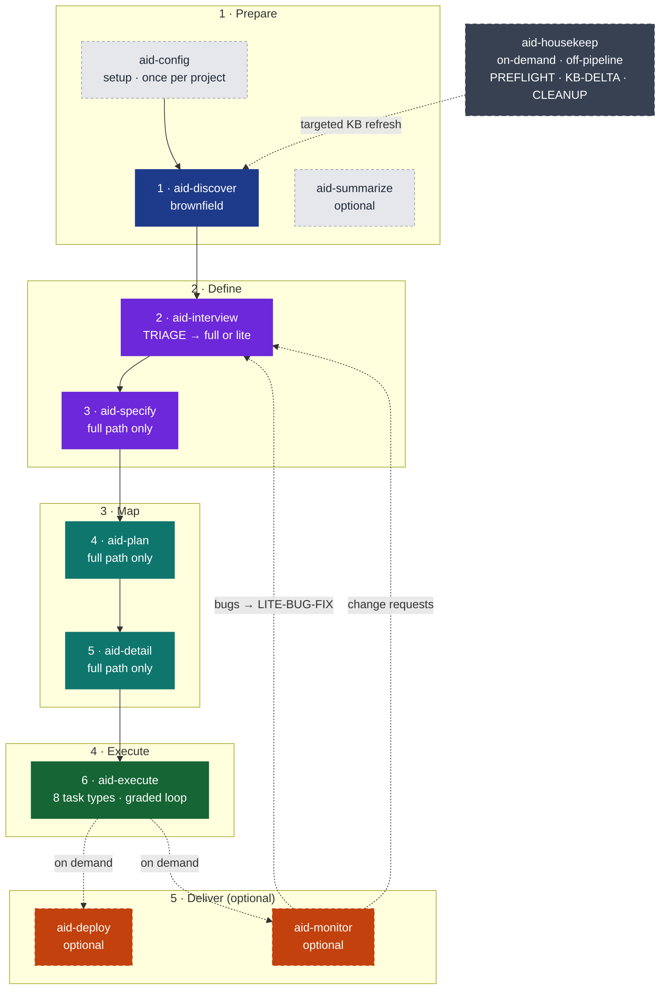
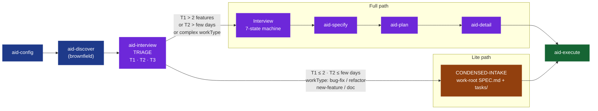
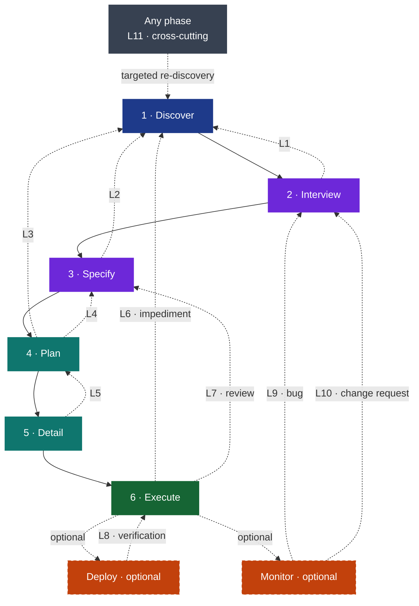

# Visual Restructure Spec
## work-002 · AID User-Facing Documentation

**Produced by:** UX Designer (task-003 design phase)
**Date:** 2026-06-03
**Consumed by:** Writers executing tasks 002 and 003

Guiding principle: **visuals are MORE important than prose.** Every section leads with
a diagram or table; prose annotates the visual. A reader scanning at 30 seconds/section
must extract the concept from the visual alone.

---

## A. README Restructure

### A1. New Section Order

README must be **action-first**: identity + hero visual → Install → Quick Start → conceptual
depth. Current README buries Install at position 9 of 11 sections. New order reverses this.

**Pre-`##` identity block** (appears before any heading):

- Title: `# AID — AI Integrated Development`
- Badge row: license · version · 5-tool platform row (one badge per tool: Claude Code /
  Codex CLI / Cursor / Copilot CLI / Antigravity)
- Tagline: keep current one-sentence version or sharpen
- Two-line "what it is": 11-skill pipeline · 22 agents · 5 AI tools · Knowledge Base
- Hero pipeline Mermaid diagram (see Appendix AP-1 — corrected, adds `aid-housekeep` node)
- `> [!TIP]` callout: "New to AID? Install takes 2 minutes. Run slash commands directly
  in your AI coding tool — no plugins."

Remove the `## Contents` link list entirely. GitHub renders the TOC in the sidebar
automatically; the list adds length without navigation value.

**Exact H2 heading list (new order):**

```
## Install
## Quick Start
## Why AID? — The Failure Modes It Removes
## The Pipeline
## The Lite Path
## The Knowledge Base
## The Agent Model
## Feedback Loops
## AID vs. SDD
## What Gets Installed
## Versioning
## Repository Structure
## Contributing
```

Reversal principle: everything above `## Install` must be scannable in under 10 seconds.
Everything below `## Quick Start` is depth for readers who want to understand before they try.

### A2. Verbosity-Reduction Strategy

| Action | Target | Rationale |
|--------|--------|-----------|
| **Cut** | "What is AID?" H2 section (~300 words of philosophy before Install) | Replaced by the 2-line identity block and hero pipeline diagram in the pre-## zone |
| **Cut** | `## Contents` link list | GitHub renders the sidebar TOC automatically |
| **Collapse into `<details>`** | `## Repository Structure` full `aid-methodology/` tree code block | Useful but long; summary: "Expand repository layout" |
| **Collapse into `<details>`** | "What Gets Installed" file-listing subsections (`.claude/`, `.codex/`, etc.) | Tool-specific detail; available on demand |
| **Delegate to methodology** | Waterfall+AI philosophy narrative, Iron Man model description | Link to `methodology/aid-methodology.md §2 Philosophy` |
| **Delegate to methodology** | Per-phase deep-dives, per-agent detail | Link to `methodology/aid-methodology.md §4 The Phases` and `§5 The Agent Model` |
| **Delegate to FAQ** | "How do I...?" operational questions embedded as inline prose | Link to `docs/faq.md` |
| **Link** | All `> [!NOTE]` / `> [!TIP]` callouts that expand a topic | Each callout ends with a link to the relevant methodology section |

**Target reading time:** under 60 seconds from title to first slash command.

### A3. Visual Inventory for README

| # | Name | Type | Placement | What It Shows / Why It Earns Its Space |
|---|------|------|-----------|----------------------------------------|
| R1 | Hero pipeline (corrected) | Mermaid `flowchart TB` | Pre-## identity block — first thing reader sees | All 11 skills in groups; `aid-housekeep` off-pipeline node (currently missing); shapes mental model before any prose. See AP-1 (simplified — no Monitor→Interview arrows). |
| R2 | TRIAGE routing diagram | Mermaid `flowchart LR` | `## The Lite Path` — opens the section | Full vs. lite decision tree from T1/T2/T3 questions. The routing logic IS the lite path concept; seeing it before reading it lands the idea instantly. See AP-2. |
| R3 | Compact agent 3-tier roster | Mermaid `graph TB` | `## The Agent Model` — opens the section | 3 subgraphs: Large (10) / Medium (9) / Small (3) with tier descriptions only — NOT all 22 agent names (those live in methodology M11). Uses same classDefs as AP-1. |
| R4 | Failure mode table | Table 6×3 | `## Why AID?` — primary element | Failure mode → what it looks like → how AID removes it. The core value proposition in a scannable format. |
| R5 | Pipeline skill+output table | Table ~11×4 | `## The Pipeline` — primary element | Group → Phase → Skill → What it produces. Must include `aid-housekeep` row marked "off-pipeline / on-demand" and corrected footnote (deploy/monitor optional, not numbered). |
| R6 | Agent tier per-tool table | Table 3×6 | `## The Agent Model` — after R3 | Tier (Large/Medium/Small) × 5 profiles. Key correctness fix: current table shows only 2 tools; must show all 5 (Claude Code, Codex CLI, Cursor, Copilot CLI, Antigravity). |
| R7 | AID vs. SDD comparison table | Table ~14×3 | `## AID vs. SDD` — primary element | Dimension × SDD × AID. Most persuasive single-page comparison for evaluating adopters. |
| R8 | Repo nav table | Table 4×2 | `## Repository Structure` — after collapsed tree | "Want to... → Go to" quick-reference. |
| R9 | Quickstart `> [!TIP]` callout | GitHub callout | Pre-## identity block | Single most important action signal at zero reading cost. |

**Not included in README (moved to methodology):** KB structure diagram, 3-tier context economy
diagram, feedback loops diagram, SDD comparison Mermaid, detailed 22-agent roster. README
links to methodology for each of these.

**Housekeep correction (R1, R5):** Both elements must add `aid-housekeep`. In R1 the diagram
adds the `HK` node using `offpipe` classDef (dark slate, dashed — see palette C1). In R5 the
table adds a row: Group "off-pipeline" / Phase "—" / Skill `/aid-housekeep` / Output "KB-DELTA
refresh · SUMMARY-DELTA · workspace CLEANUP."

---

## B. Methodology Restructure

### B1. Stale Framing in §1 Philosophy, §2 Knowledge Base, §3 The Phases

Each item: location in current doc → current (stale) framing → corrected framing.

| # | Location | Current Stale Framing | Corrected Framing |
|---|----------|----------------------|-------------------|
| SF-1 | §1 Philosophy — opening narrative | AID is a Waterfall+AI methodology. User decides whether the pipeline's cost is worth it by weighing heaviness vs. value. Lite path is mentioned only as "§4 collapses the overhead dramatically" — a footnote. | AID has TWO paths, TRIAGE-routed from the first Interview question. The "heavy pipeline" only runs when scope warrants it. Small work takes the lite path automatically — no manual cost-benefit decision required. The lite path is the default for the majority of individual tasks. |
| SF-2 | §1 Philosophy — "Pros and Cons" subsection | Frames the lite path as the user's manual mitigation for AID's heaviness. "AID's lite path (§4) is specifically designed to make the cost commensurate with scope." | TRIAGE automates proportionality. You answer T1/T2/T3 and the methodology routes you. The lite path is not a cost mitigation strategy to weigh; it is the default path for small work. Philosophy section should open with this routing insight, not bury it in a Pros/Cons bullet. |
| SF-3 | §1 Philosophy — "The Iron Man Model" | "Every design phase follows the same universal loop: AI proposes, human and AI discuss, AI writes, AI reviews." Stated as universal. | The 4-step loop is universal on the FULL PATH. The lite path uses CONDENSED-INTAKE — a conversational slot-fill — not the full 4-step loop. The Iron Man model is the right framing for Specify, Plan, Detail, and Execute; the lite path Interview is a condensed variant. Qualify the universality claim. |
| SF-4 | §2 KB — "Structure" section | A code block lists exactly 14 named documents, implying the doc-set is fixed. Text says "project-configurable" but the visual impression of 14 named files dominates. | Replace the code block listing with the KB structure Mermaid diagram (M7) as the OPENING visual. The diagram makes configurable-not-fixed visible: shows `KB extensions · optional · project-specific` as a node. Keep the code block as a collapsible reference below the diagram. |
| SF-5 | §2 KB — no leading visual | §2 opens with a prose paragraph. The KB structure diagram exists in README but not in methodology §2. | §2 must open with the KB structure diagram (M7, graph TD) as its FIRST element, followed by the 3-tier context economy diagram (M8). Both diagrams currently exist only in README and must move to methodology §3 (§2 in new numbering). |
| SF-6 | §3 The Phases — intro paragraph | "The Prepare group also holds **two** non-phase skills: `aid-config` and `aid-summarize`. A third optional skill, `aid-housekeep`..." Internal contradiction: says "two" then names three. | Corrected: "The Prepare group also holds three non-phase skills: `aid-config` (bootstrap, once per project), `aid-summarize` (optional KB viewer), and `aid-housekeep` (optional off-pipeline KB maintenance). None are numbered phases; none participate in phase gates." |
| SF-7 | §3 The Phases — Interview subsection | TRIAGE is described in 3 bullets then immediately deferred: "See §4 for the complete lite path description." Full-path 7-state machine gets many pages of detail; lite path gets 3 lines. TRIAGE is the first move of EVERY Interview yet appears as a forward-reference. | TRIAGE and the lite path belong inside §4 Interview (§3 in new numbering), not deferred to a separate section. Interview subsection must open with the TRIAGE routing diagram (M9/AP-2), then describe BOTH paths with proportional depth: TRIAGE → Full Path walkthrough → Lite Path walkthrough (CONDENSED-INTAKE → TASK-BREAKDOWN → LITE-REVIEW → LITE-DONE) → Recipes → Escalation. Current §4 "The Lite Path" is dissolved into this subsection. |
| SF-8 | §3 The Phases — `aid-housekeep` placement | `aid-housekeep` is described inside Group 5 Deliver (after Monitor), despite being explicitly "off-pipeline." Group 5's intro states it's not a Deliver skill but still nests it there. Creates false impression housekeep is part of the delivery workflow. | `aid-housekeep` must have its OWN subsection at the same structural level as the Group headings, clearly labeled `### Off-Pipeline: aid-housekeep`, positioned AFTER Group 5 and NOT embedded within any Group. |

### B2. New Heading List with Primary Visual per Section

**Key structural changes:**
- Current §8 "The Pipeline" (pipeline visual overview) moves to §1 — the diagram is
  the opening visual of the entire document, not a late-section element.
- Current §4 "The Lite Path" is dissolved into §4 The Phases → Interview subsection.
- Result: 10 sections (was 11). Numbered renumbered for clarity.

| New § | Heading | Primary Visual — opens the section |
|-------|---------|-------------------------------------|
| 1 | **The Pipeline** | Hero pipeline Mermaid (AP-1 full — includes Monitor→Interview arrows). Caption explains all 11 skills in one glance. |
| 2 | **Philosophy** | Iron Man PNG (`methodology/images/3-ironman.png`) — universal Propose→Discuss→Write→Review loop. Opens after the one-sentence "why AID exists" statement. |
| 3 | **The Knowledge Base** | KB structure Mermaid `graph TD` (M7, moved from README) — KB center → 4 doc categories → sub-agent groups. Followed immediately by 3-tier context economy Mermaid (M8). |
| 4 | **The Phases** | Skill → group → output table (M2, updated — opens section). Each group subsection opens with a bold purpose statement. Interview subsection opens with TRIAGE routing Mermaid (M9/AP-2). |
| 5 | **The Agent Model** | Agent 3-tier roster Mermaid (M11) — detailed, all 22 agents by name in 3 subgraphs. |
| 6 | **Feedback Loops** | Feedback loops Mermaid (M14/AP-3) — corrected group-specific phase colors. |
| 7 | **Artifacts Reference** | Artifact lifecycle table (M16) — artifact → location → produced by → consumed by → lifecycle. |
| 8 | **Case Studies** | Per-case-study summary table (2 rows × 4 cols: phase used / what was applied / outcome / key insight) opens each subsection. |
| 9 | **Comparison with SDD** | SDD vs. AID Mermaid (M17) — side-by-side diagram. Corrected: AID side uses group-specific colors, not monochrome `#166534`. |
| 10 | **Adoption Guide** | Incremental adoption table (M-adopt) — starting point → add-on → what you gain. |

**Exact methodology heading list (new order):**

```
## 1. The Pipeline
### The Full Path
### The Lite Path at a Glance
### Skill Inventory

## 2. Philosophy
### Waterfall + AI — and That Is the Point
### The Iron Man Model: Human-in-the-Middle
### Three Core Principles
### What AID Removes
### Honest Assessment

## 3. The Knowledge Base
### Structure
### The Declared Doc-Set
### Context Feeding Strategy — RAG by Convention
### The KB Outlives the Project

## 4. The Phases
### Group 1: Prepare
#### `aid-config` — Bootstrap (not a numbered phase)
#### Phase 1: Discover (`aid-discover`)
#### `aid-summarize` — Optional KB Viewer (not a numbered phase)
### Group 2: Define
#### Phase 2: Interview (`aid-interview`)
##### TRIAGE Routing
##### Full Path
##### Lite Path
##### Recipes
##### Escalation
#### Phase 3: Specify (`aid-specify`)
### Group 3: Map
#### Phase 4: Plan (`aid-plan`)
#### Phase 5: Detail (`aid-detail`)
### Group 4: Execute
#### Phase 6: Execute (`aid-execute`)
### Group 5: Deliver
#### Deploy (`aid-deploy`) — Optional
#### Monitor (`aid-monitor`) — Optional
### Off-Pipeline: `aid-housekeep`

## 5. The Agent Model
### The Three Tiers
### Tier Mapping per Profile
### Agent Formats
### The Five Profiles
### Skill → Agent Dispatch

## 6. Feedback Loops
### The Eleven Loops
#### Development Loops (1–8)
#### Post-Production Loops (9–10)
#### Cross-Cutting Loop (11)
### The Revision Trail
### Feedback Loop Artifacts

## 7. Artifacts Reference
### Core Artifacts
### Templates Reference

## 8. Case Studies
### Greenfield — VivaVoz Desktop Application
### Brownfield — Enterprise Java
### Operational Automation — Zac Pipeline

## 9. Comparison with SDD
### Where We Overlap
### Where We Diverge

## 10. Adoption Guide
### Starting with an Existing Project (Brownfield)
### Starting a New Project (Greenfield)
### Using the Lite Path and Recipes
### Adopting Incrementally
### Anti-Patterns
```

### B3. Visual Inventory for Methodology

| # | Name | Type | Placement | What It Shows / Why It Earns Its Space |
|---|------|------|-----------|----------------------------------------|
| M1 | Hero pipeline (full) | Mermaid `flowchart TB` | §1 The Pipeline — opens section | Full version: includes Monitor→Interview feedback arrows. All 11 skills, housekeep off-pipeline, group subgraphs. See AP-1. |
| M2 | Skill inventory table | Table 11×4 | §1 The Pipeline — after M1 | Skill · Group · Phase# · In mandatory pipeline? Includes housekeep row marked "off-pipeline / on-demand." |
| M3 | Iron Man model | Raster PNG | §2 Philosophy — after opening paragraph | Universal Propose→Discuss→Write→Review loop; human as pilot, AI as suit. Existing asset — keep as-is. Placed in "The Iron Man Model" subsection with existing caption. |
| M4 | Roles table | Table 3×2 | §2 Philosophy — after M3 | Director / Orchestrator / Specialist with responsibilities. Existing table — Specialist row already lists all 5 host tools (correct). |
| M5 | Failure mode table | Table 6×3 | §2 Philosophy — "What AID Removes" | Failure mode → symptom → how AID removes it. Same content as R4; methodology version may add more detail per row. |
| M6 | Pros/cons table | Table 2×2 | §2 Philosophy — "Honest Assessment" | Where AID wins / Where AID is heavier. Replaces current bulleted list — same information, more scannable. Columns: "AID wins" / "AID is heavier." Rows: scenario categories. |
| M7 | KB structure diagram | Mermaid `graph TD` | §3 Knowledge Base — opens section | KB center → 4 categories (14 standard / 3 meta / 1 generated / extensions) → per sub-agent groups. Currently in README only — moves here. Uses KB color space (navy center, blue standard, purple meta, green generated, amber extensions). |
| M8 | 3-tier context economy | Mermaid `flowchart TB` | §3 Knowledge Base — after M7 | INDEX (Tier 1) → one KB doc (Tier 2) → exact path:line (Tier 3). Currently in README — moves here. Same diagram, same colors. |
| M9 | TRIAGE routing diagram | Mermaid `flowchart LR` | §4 The Phases → Interview → TRIAGE subsection | Full vs. lite routing decision tree (T1/T2/T3). OPENS the Interview section — diagram before prose. Same as AP-2 / R2. |
| M10 | Lite path sub-paths table | Table 4×3 | §4 The Phases → Interview → Lite Path subsection | workType → sub-path name → typical task set. Currently in §4 standalone — integrates into Interview description. |
| M11 | Agent 3-tier roster (detailed) | Mermaid `graph TB` | §5 The Agent Model — opens section | 3 subgraphs listing ALL 22 agents by name. Large (10): architect, reviewer, interviewer, security, discovery-scout/architect/analyst/integrator/quality/reviewer. Medium (9): orchestrator, researcher, developer, operator, data-engineer, performance, devops, tech-writer, ux-designer. Small (3): simple-extractor, simple-formatter, simple-glob. |
| M12 | Agent tier per-tool table | Table 3×6 | §5 The Agent Model — after M11 | Tier × 5 profiles with model names. Corrects current 2-tool table to 5 tools (Claude Code, Codex CLI, Cursor, Copilot CLI, Antigravity). |
| M13 | Skill → agent dispatch | Mermaid `graph LR` | §5 The Agent Model — after M12 | Which agent executes + which reviews each skill. Shows reviewer-tier-≥-executor invariant. Keep existing diagram — correct content, good layout. |
| M14 | Feedback loops diagram (corrected) | Mermaid `flowchart TB` | §6 Feedback Loops — opens section | All 11 loops with group-specific phase colors (corrected from current single-teal). See AP-3. |
| M15 | Feedback loop descriptions table | Table 11×4 | §6 Feedback Loops — after M14 | Loop# → From → To → Trigger condition. Supplements the prose descriptions; makes all 11 loops scannable without reading every paragraph. |
| M16 | Artifact lifecycle table | Table ~15×5 | §7 Artifacts Reference — opens section | Artifact → location → produced by → consumed by → lifecycle (living/frozen). Keep existing table; ensure housekeep output (`KB-DELTA` Q&A entry) is included. |
| M17 | SDD vs. AID comparison diagram | Mermaid `flowchart TB` | §9 Comparison with SDD — opens section | Side-by-side: SDD linear flow (left, `#1E3A8A` blue) vs. AID pipeline with KB + Deliver (right, corrected group colors). Existing diagram uses monochrome `#166534` for all AID phases — fix to per-group colors. |

---

## C. Shared Visual System

### C1. Color Palette

Two semantic color spaces: **pipeline group space** (primary, used everywhere) and **KB
document space** (secondary, KB-specific diagrams M7/M8 only).

#### Pipeline Group Space — Primary

| Semantic Role | Fill Hex | Text | Stroke-Dasharray | What It Marks |
|--------------|----------|------|------------------|---------------|
| Prepare group | `#1E3A8A` | `#ffffff` | none | `aid-discover`; Prepare group subgraph |
| Define group | `#6D28D9` | `#ffffff` | none | `aid-interview`, `aid-specify`; Define group subgraph |
| Map group | `#0F766E` | `#ffffff` | none | `aid-plan`, `aid-detail`; Map group subgraph |
| Execute group | `#166534` | `#ffffff` | none | `aid-execute`; Execute group subgraph |
| Deliver — optional | `#C2410C` | `#ffffff` | `5 4` | `aid-deploy`, `aid-monitor` (ALWAYS dashed — optional = dashed; no exceptions) |
| Off-pipeline | `#374151` | `#ffffff` | `6 4` | `aid-housekeep`; "Any phase" cross-cutting loop node; off-pipeline concepts |
| Auxiliary / non-numbered | `#E5E7EB` | `#1F2937` | `4 3` | `aid-config`, `aid-summarize` (lighter: non-numbered, not optional per se) |
| KB / identity | `#0B1F3A` | `#ffffff` | none | KB center nodes; brand identity elements |
| Lite path | `#92400E` | `#ffffff` | none | CONDENSED-INTAKE; lite path nodes in routing diagrams |

Note on agent tier colors: the agent tier diagram intentionally echoes pipeline group colors —
Large tier uses `#1E3A8A` (Prepare-range), Medium uses `#0F766E` (Map-range), Small uses
`#B45309` (amber). This is semantic overlap by design: Large handles high-stakes judgment
(like Discovery); Medium handles operational execution (like Map/Execute); Small handles
mechanical tasks. Document this as intentional — do not "fix" it.

**Invariant: `classDef del` (solid orange, no dash) is retired.** Use only `classDef delopt`
for Deliver-group skills. Never use Map teal (`#0F766E`) for optional or off-pipeline nodes.

#### KB Document Space — Secondary (use only in M7/M8)

| Semantic Role | Fill Hex | What It Marks |
|--------------|----------|---------------|
| Standard KB docs | `#1D4ED8` | The 14 standard documents (grouped by sub-agent) |
| Meta documents | `#7C3AED` | INDEX.md, README.md, STATE.md |
| Generated output | `#166534` | project-index.md (shares Execute green — intentional) |
| KB extensions | `#B45309` | Optional project-specific custom documents |

#### Standard classDef Block (copy into every pipeline Mermaid diagram)

```
classDef prep     fill:#1E3A8A,stroke:#1E3A8A,color:#ffffff
classDef def      fill:#6D28D9,stroke:#6D28D9,color:#ffffff
classDef map      fill:#0F766E,stroke:#0F766E,color:#ffffff
classDef exe      fill:#166534,stroke:#166534,color:#ffffff
classDef delopt   fill:#C2410C,stroke:#C2410C,color:#ffffff,stroke-dasharray:5 4
classDef aux      fill:#E5E7EB,stroke:#9CA3AF,color:#1F2937,stroke-dasharray:4 3
classDef offpipe  fill:#374151,stroke:#374151,color:#ffffff,stroke-dasharray:6 4
classDef kb       fill:#0B1F3A,stroke:#0B1F3A,color:#ffffff
classDef lite     fill:#92400E,stroke:#92400E,color:#ffffff
```

### C2. Mermaid Conventions

| Use Case | Diagram Type | Notes |
|----------|-------------|-------|
| Pipeline overview (all skills in groups) | `flowchart TB` | Subgraphs for groups. Solid `-->` for mandatory forward flow; `-.->` with label for optional/feedback. |
| Routing decision (TRIAGE, full vs. lite) | `flowchart LR` | Decision node center; paths branch left and right or below. |
| Entity roster (agents, KB documents) | `graph TB` with subgraphs | Use TB for tall groupings. Subgraphs per tier/category. |
| Dispatch / relationship diagrams | `graph LR` | Skill nodes left; agent nodes right. Dashed for task-type-routed paths. |
| Feedback loops | `flowchart TB` | Phase nodes use group-specific classDef (NEVER single-color). Loop arrows always `-.->` with loop-number label. |

| Convention | Rule |
|-----------|------|
| **Dashed lines** | `-.->` = optional skill, feedback loop, or "on demand" flow. Solid `-->` = mandatory forward flow ONLY. |
| **Node label format** | Primary label first line; sub-label second line via `<br/>`. Sub-labels: short phrase only (e.g., `"brownfield"`, `"full path only"`, `"8 task types"`). No full sentences. |
| **Subgraph labels** | Format: `" N · Name "` — spaces for padding, number-dot-name pattern (e.g., `" 1 · Prepare "`). |
| **Optional subgraph suffix** | Add `(optional)` to subgraph title for Deliver group: `" 5 · Deliver (optional) "`. |
| **Dead classes** | Remove unused classDef declarations from all diagrams. Only declare classes that are actually used (`:::className`) in the diagram body. |

### C3. Callout Conventions

Use GitHub-flavored `> [!TYPE]` callouts for these purposes ONLY:

| Type | When to Use | Max per Doc |
|------|-------------|-------------|
| `> [!TIP]` | Actionable shortcut the reader might miss | 1 per doc |
| `> [!NOTE]` | Context that changes how the reader interprets adjacent content | 3 per doc |
| `> [!WARNING]` | Consequence of skipping a step or anti-pattern | 2 per doc |
| `> [!IMPORTANT]` | Hard constraint or design invariant (must be followed) | 2 per doc |

Do NOT use callouts for: general prose commentary, interesting notes, or summaries of content
already stated in the same paragraph. Every callout must contain information not findable by
reading the adjacent prose.

Suggested callout placements:
- README: `> [!TIP]` in pre-## identity block (quickstart shortcut)
- README: `> [!NOTE]` in `## Install` (brownfield vs. greenfield entry point)
- Methodology §4 Discovery: `> [!WARNING]` for "Skipping Discovery on brownfield produces hallucination"
- Methodology §4 Execute: `> [!IMPORTANT]` for "The reviewer's tier is always ≥ the executor's tier"

### C4. Table-Styling Conventions

| Convention | Rule |
|-----------|------|
| Column count | Maximum 5 columns. Beyond 5, split into two tables or use a different visual. |
| First-column emphasis | Bold the first column if it is the primary key (skill name, failure mode, dimension). |
| Alignment | Left-align all columns; no center or right alignment. |
| Captions | Methodology tables get an italicized one-line caption below. README tables may omit captions if the preceding heading is sufficient context. |
| Header naming | Match terminology used in adjacent prose. No creative renaming of columns. |

### C5. Emoji and Icon Rules

| Rule | Spec |
|------|------|
| Permitted | Status indicators in tables: ✅ Complete · ⚠️ Partial · ❌ Missing (KB README convention) |
| Permitted | GitHub callout icons (rendered automatically — do not add emoji to callout body text) |
| Prohibited | Emoji in H1/H2/H3/H4 headings |
| Prohibited | Emoji as prose decoration (e.g., 🚀 for excitement) |
| Prohibited | Icon bullets replacing standard `-` list items |

### C6. Raster Image Policy

**`methodology/images/3-ironman.png` — Keep as-is.**

The Iron Man model PNG uses a dark navy background with color-coded loop steps (teal Propose /
purple Discuss / green Write / amber Review) that echo the pipeline group colors. This
subliminal cross-doc color coherence cannot be matched by a Mermaid diagram at the same quality.

- Placement: methodology §2 Philosophy → "The Iron Man Model" subsection only
- Do NOT embed in README (too complex for the action-first zone)
- Alt text: keep existing — `"The Iron Man Model — the universal Propose → Discuss → Write → Review loop, with human as pilot and AI as suit"` — satisfies WCAG 2.1 SC 1.1.1
- The image earns its space because the loop structure is central to understanding ALL full-path phases; a static image conveys the circular/iterative nature better than a Mermaid flowchart

**No new raster images.** All new diagrams use Mermaid. If `methodology/images/2-comparison.png`
exists (a pipeline comparison image), it must be replaced by the SDD vs. AID Mermaid (M17) —
agents cannot emit raster and the Mermaid version is maintainable.

---

## Appendix: Corrected Mermaid Diagrams

Copy-paste–ready code blocks. Use them in the sections specified in A3/B3 without modifying
classDef declarations or structure. Node labels and caption text may be adjusted to match
final written content.

### AP-1. Hero Pipeline Diagram (Corrected)

Use in:
- README: pre-## identity block (simplified — **remove** the two `Mon -.->` lines)
- Methodology §1: full version below (includes Monitor→Interview feedback arrows)



*Methodology caption: "Eleven user-facing skills, five groups. The six numbered phases (Discover through Execute) form the mandatory sequential pipeline — brownfield enters at Discover, greenfield at Interview. `/aid-interview`'s TRIAGE routes small work to the lite path automatically. Deploy and Monitor are optional end-of-pipeline Deliver skills. `aid-housekeep` runs off the pipeline on demand for KB maintenance."*

*README caption (simplified version — no Mon→Intv lines): "11 skills · 5 groups · 2 paths (TRIAGE-routed). Full methodology: [methodology/aid-methodology.md](methodology/aid-methodology.md)."*

**Changes from current diagrams:**
- ADDED: `HK` node with `offpipe` classDef (currently missing from BOTH README and methodology pipeline diagrams)
- ADDED: `HK -.-> Disc` arrow "targeted KB refresh"
- ADDED: `Mon -.-> Intv` feedback arrows (methodology version only)
- ADDED: `"TRIAGE → full or lite"` sub-label on Interview node
- ADDED: `"full path only"` sub-label on Specify, Plan, Detail nodes
- ADDED: `"(optional)"` to G5 subgraph title
- REMOVED: dead `classDef del` (only `delopt` is used — `del` was defined but never applied in the current diagram)
- CHANGED: all Deliver nodes from `:::del` to `:::delopt` (now consistent everywhere)

### AP-2. TRIAGE Routing Diagram (New)

Use in: README `## The Lite Path` (R2) and methodology §4 Interview → TRIAGE subsection (M9).
Same diagram in both docs.



*Caption: "TRIAGE routes at the start of every interview. Any 'large' signal on T1, T2, or T3 routes to full path. All three 'small' signals route to lite path automatically. A lite work can escalate to full mid-flight if scope grows (`Path: escalated` in STATE.md)."*

### AP-3. Feedback Loops Diagram (Corrected Group Colors)

Use in: methodology §6 Feedback Loops (M14). Replaces the current single-color `#0F766E` diagram.



*Caption: "Eleven formal feedback loops — eight within development, two from production back to development, one cross-cutting from any phase. Each dashed arrow is a formal protocol that produces a Q&A entry in a STATE file, an IMPEDIMENT file, or a MONITOR-STATE finding."*

**Changes from current diagram:**
- CHANGED: all phase nodes now use group-specific colors (was single `classDef phase fill:#0F766E` for all — Map/teal for every node is incorrect)
- CHANGED: Deliver nodes now use `delopt` (burnt orange + dashes) instead of `optional` (teal + dashes — wrong color)
- ADDED: `Any phase` node uses `offpipe` (`#374151`) — it represents a meta-concept spanning all phases; using KB navy `#0B1F3A` or Prepare blue would imply a group association it doesn't have
- No change to loop numbering, arrow targets, or labels

