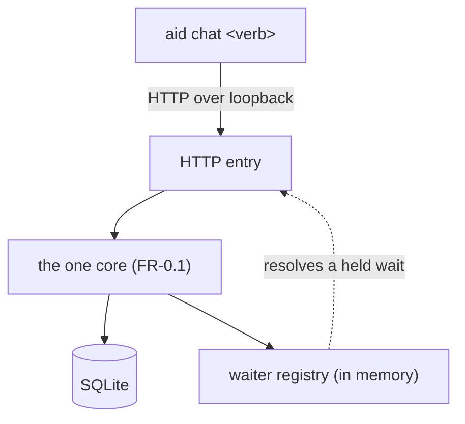
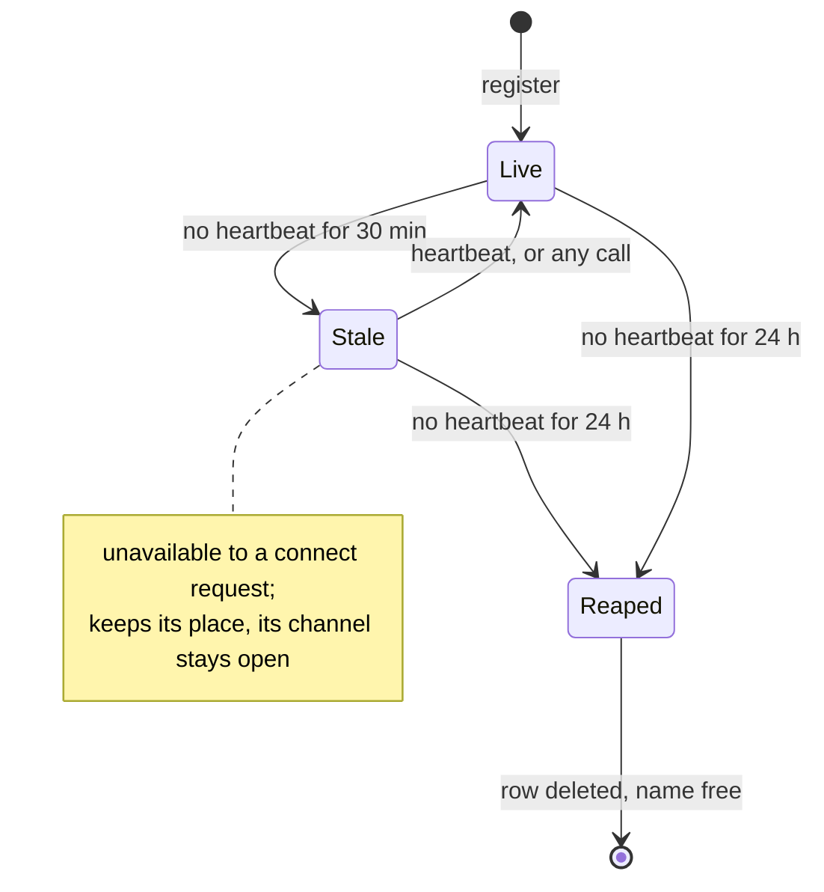
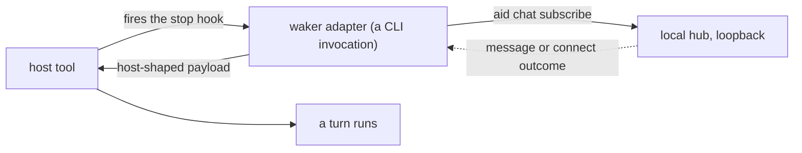
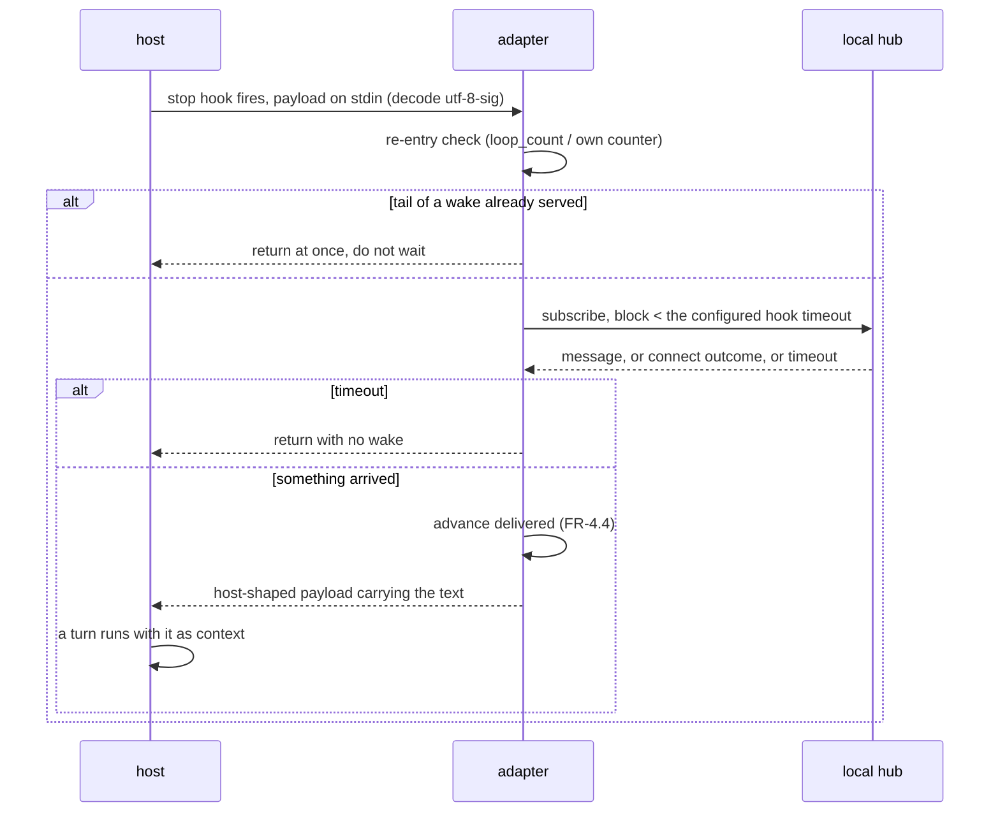
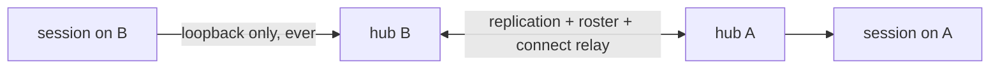

# Requirements

- **Name:** Agent Chat Channel
- **Description:** Delivers a local, CLI-administered node that lets AI coding-assistant sessions message one another across repositories, tools, and LAN-connected machines.

> **Seeded from a predecessor rather than interviewed from zero.** §1–§3, §6 and §10 are
> carried verbatim; §5 carries FR-0–FR-7 with FR-8 withdrawn and deliberately not
> renumbered; §9 was renumbered to a gapless **AC-1–AC-22** at seeding, since a fresh work has no
> citation history to protect and the criteria deleted during the interview or withdrawn
> with FR-8 needed no struck rows. **It has since grown to AC-1–AC-34 and is no longer
> gapless**: AC-19 and AC-21 are retired rows, kept precisely so that references to them
> resolve, which is the citation history this work now does have. §9 is the authority for the
> live set; this bullet records only where the numbering started.
>
> **§4, §7 and §8 are carried as-is and left open** — `state: Pending` in `STATE.yml`, which is
> what makes `/aid-describe` resume on exactly those three. Each is correct in substance but
> still carries narrative about a scope reset that is this document's prehistory rather than its
> content, and cleaning that up is a conversation with the stakeholder, not a mechanical edit.
> (`Pending` rather than a more descriptive `Partial` because `Pending | Complete` is the enum
> the state template declares, and an out-of-enum value in a machine-read field is a defect
> however well it reads.)

## 1. Objective

Provide a communication channel that lets one AI coding-assistant session send messages or
notifications to another. The sessions work in **different repositories**, and are started
by the operator's own orchestrator rather than by a lead-spawns-teammates framework.

Sessions talk in **channels**. A channel is the only thing a message is addressed to, and the
smallest channel — two members — *is* a direct message. Larger channels add **mention** (aimed at
someone, visible to all) and **whisper** (visible only to one member).

A channel is a walkie-talkie channel rather than a room: a name agreed on, replicated to every
machine with a member in it and owned by none of them, holding **one agent at a time** from each
participating session, and lasting only while somebody is on it. Getting *into* a conversation is a
separate plane — an agent joins its machine's **hub** when it registers, sees who is available
there, and asks to be connected with one named agent.

The channel is delivered as a **local node**, or hub — a service started and administered by the
`aid` CLI, running on each machine and serving every session on it, regardless of tool. The
node itself has a single responsibility, message exchange, and ships no operator surface of
its own. **A session speaks only to its own machine's hub, ever**, and hubs federate to other
machines over a trusted LAN. Sessions reach the node
**through the `aid` CLI**, which carries the whole message plane over one core; a **rendered
chat skill** makes that surface discoverable to a session without being a second surface of its
own (§4, FR-0).

A hosting server is available but is **deliberately unused in v1**; it is held in reserve
for a later delivery, should NAT traversal or relay ever be required.

## 2. Problem Statement

An AI coding-assistant session is **turn-based, not a server**. It has no event loop that
can be pushed to, and receives nothing asynchronously mid-turn; between turns it is idle,
waiting for input. Consequently the transport is not the hard part — **getting a message
into a turn is**.

Delivery splits by the recipient's lifecycle at the moment the message arrives:

| Recipient state | What "notify" actually means |
|---|---|
| Idle (finished its task, sitting there) | A turn must be **started** for it |
| Actively running its own loop | It can only be handed the message at its **next turn boundary** |
| Not yet started | The notification *is* the **launch** |

This is why named pipes, Unix sockets, and Redis pub/sub feel correct but do not by
themselves solve the problem: nothing inside the recipient is listening on the socket,
because these tools expose no listener loop. The pattern must be chosen by the recipient's
lifecycle, not by the IPC technology.

Today there is no shared mechanism for this coordination.

### Prior art considered (input, not a decision)

1. **Resume an idle instance** — `claude -p --resume <session-id> "<message>" --bare`,
   serialized with `flock`. Lands as a real user turn with context intact; no live process
   or relay daemon; survives reboot. Caveat: `--resume` spawns a *new* process continuing
   the session, so a still-live original on the same working tree causes conflicts. Saved
   mid-session hook output replays stale; only `SessionStart` hooks re-run
   (`source=resume`).
2. **File inbox + `Stop`-hook turn-guard** — sender appends to a JSONL inbox; the
   recipient's `Stop` hook blocks turn-end when mail is unread. Requires the
   `stop_hook_active` guard or it loops forever. Limitation: only fires while the recipient
   is still taking turns; a fully idle recipient never picks the mail up.
3. **Persistent bidirectional streaming** — `claude -p --input-format stream-json
   --output-format stream-json`. The only CLI mechanism for bidirectional programmatic
   comms in print mode, but underdocumented and subject to a block-buffering bug when
   piped. Amounts to building and babysitting a daemon.
4. **First-party Agent Teams** (`CLAUDE_CODE_EXPERIMENTAL_AGENT_TEAMS=1`) — mailbox +
   `SendMessage` + shared task list, but modeled as one lead spawning teammates on a
   *shared* codebase, experimental, and token-heavy. Its *mechanism* (file inbox,
   between-turn pickup) is applicable; its framing is not.

## 3. Users & Stakeholders

**Participants (the messaging endpoints).** AI coding-assistant sessions, explicitly not
one vendor:

| Participant | Status |
|---|---|
| Claude Code | **v1 proving pair.** Reference host; **wake demonstrated** by the P0 spike — an idle session acted on an arriving message with no human action (§8) |
| Cursor | **v1 proving pair.** **Wake demonstrated** by the P0 spike, despite the vendor's documentation stating that no background process can start a turn (§8). The blocking bound turned out not to be a host constant but the hook's own configured timeout (FR-5.8) |
| Antigravity | Named target; not a v1 gate. Researched, but its documentation is **silent** on external wake — no route known |
| Copilot CLI | Named target; not a v1 gate. Wake route documented (`agentStop`), unmeasured. (GitHub Copilot CLI — named **Copilot CLI** throughout, matching the profile AID renders into) |
| Codex | Named target; not a v1 gate. **Not researched at all** — the only host nobody has looked at, which is a different gap from Antigravity's, where the looking was done and found nothing |
| Future/unknown tools | Must be supportable without redesign — via the FR-5.2 adapter contract |

**The target case:** a developer in Cursor on one machine exchanging messages with a
developer in Claude Code on another machine on the same network. Every other case — both
sessions on one machine, both in the same tool, one-way only — is a subset of it. Solving
the target case solves them all.

**Operator.** The human running the fleet, who launches sessions via their own
orchestrator and needs to see and audit what was sent between them.

## 4. Scope

### In Scope

- **Channel-based messaging between sessions**, regardless of which tool hosts each session.
  A channel is the only addressing unit for messages; a two-member channel is a direct message.
  Within a channel of more than two, a message may **mention** members (visible to all) or
  **whisper** to one (visible only to them). **An agent holds one channel at a time**, and a
  channel lasts only while somebody is on it — it is a live conversation, not an archive.
- **A hub plane, which is how agents meet.** A session joins its machine's hub when it registers,
  independently of any channel; there it can see which agents are available and **ask to be
  connected with one named agent**. This is signalling rather than messaging, and it is the only
  thing that can reach an agent sharing no channel with the caller.
- A **local service (node)**, started by the CLI, that all local sessions connect to.
  There is no installation step: the node ships inside the `aid` payload (FR-7.6).
- **Cross-machine** connection between hubs on a **trusted LAN**: peers **find each other**,
  channels **replicate** to every hub with a member in them, and a hub queues for a peer it
  cannot reach so that being offline delays rather than loses. **The discovery mechanism is deliberately not named here** — it is
  stated as an outcome, because the research behind FR-6.1 found that no single mechanism
  works everywhere users actually are.
  **And the promise is deliberately bounded: discovery always works, by a path that depends
  on no network feature. Finding peers *without configuration* is a convenience layered
  above that, offered where the network permits and promised nowhere** — the environments
  that defeat it are ordinary ones (FR-6.1), and a promise the product cannot keep on a
  developer's own laptop is worse than one it does not make.
- **Delivery to a live session that is not currently taking a turn**, via an in-tool
  subscriber that holds a token-free wait open and turns an arriving message into a turn
  (FR-5.2). An idle session is woken on arrival; a busy one receives at its next turn
  boundary. **Pull remains the universal floor** — a session with no subscriber armed reads
  its inbox at its own turn boundaries using the same read tool.
- **No process spawning or session resumption anywhere in the product.** Launching a
  session that is closed or does not yet exist remains the responsibility of the
  operator's existing orchestrator.
- **A rendered chat skill**, in the repository's existing canonical-skill form, so that a
  session *discovers* the chat exists. The `aid` CLI is on PATH but is not advertised to a
  model; a skill is. It renders into all five host dialects through machinery this repository
  already has, invokes the CLI (FR-7.4), and reimplements nothing.

### Out of Scope

- **An MCP façade.** The rendered chat skill above is the agent-facing surface instead, and it
  serves the only thing a second surface was needed for — discoverability — on better terms:
  all five hosts by construction, no third-party dependency, and nothing for the user to
  install by hand. §7 carries the full reasoning.
- **Raising the repository's Python floor.** Nothing in this design depends on what the
  repository declares — the node states its own runtime requirement (FR-7.7) — so the raise is
  not this work's to make, whatever else changes around it. (A channel decision has been
  described to this document as settled; it is an input, not a fact this document asserts, and
  the exclusion holds either way — see the FR-8 note.) The maintainer-only profile renderer
  stays on Python and is a separate, maintainer-scoped concern.
- **A second implementation of the node.** One runtime, one implementation. The local
  dashboard server's Node/Python twin is a precedent this work declines to follow — roughly
  8,300 lines mirroring roughly 10,100, kept in step by a dedicated CI parity gate. A node
  carrying durable storage, federation and per-host adapters would be worse.

- **NAT/firewall traversal** and any internet-scale or cross-network reach. v1 assumes a
  flat, trusted LAN.
- **Relay / rendezvous infrastructure.** The available hosting server is deliberately
  unused in v1 and held in reserve for a later delivery.
- **Untrusted or public networks.** Trust is implicit in network membership: being on the
  LAN is the only condition for participating. There is no key, password, or login
  anywhere in this product — so the network itself must be a controlled one.
- **Launching or resuming sessions.**
- **Broadcast to every agent, and any channel that everybody is on.** A message reaches the members
  of one channel and no wider audience (FR-3.8). This follows from an agent holding one channel at a
  time, and it is listed so the absence is a recorded decision rather than a gap somebody later
  reads as an oversight. Reaching an agent you share no channel with is the hub's connect request.
- **A conversation that outlives its participants.** A channel's log is discarded when its last
  member is gone (FR-3.3), so there is no archive, no history browser, and no resuming yesterday's
  channel. Anything worth keeping is the participants' to write down elsewhere.
- **A total order across speakers.** Each speaker's own messages arrive in order; two speakers'
  messages carry no promised relative order (§6). Anything needing causality states it in the
  message, through `reply_to`.

## 5. Functional Requirements

**One surface, one core.** The **`aid` CLI** is the whole product surface — administration,
the subscriber, and the full message plane. HTTP is the node's internal transport, not a
second public surface: the subscriber reaches it through a CLI invocation (FR-7.4), so
nothing outside the product calls it directly.

A **rendered chat skill** sits above the CLI as *documentation the model can find*, not as a
second surface. It carries no logic and holds no state: every operation it describes is an
`aid chat` invocation.

### FR-0 — Surface

| # | Requirement |
|---|---|
| FR-0.1 | There is **one core implementation** of the message plane. No face may reimplement it, and a face that cannot be expressed as a call into that core is not added |
| FR-0.2 | **A session reaches the message plane through the CLI** — `send`, `inbox`, `ack`, plus its own channel (open, `join`, `leave`, which-channel-am-I-in; FR-3.4) and the hub verbs (roster, connect request; FR-9). Administrative operations exist on the same CLI and are **not** described by the chat skill (see FR-7.3) |
| FR-0.3 | The CLI covers administration, the subscriber, **and** the full message plane, so the product is fully functional on every host, with no per-host protocol support required of anyone |
| FR-0.4 | **The product writes no host tool's configuration.** It renders a skill into the host dialects it already supports, through the same pipeline as every other AID skill, and touches nothing else — no MCP registration, no settings file, no hook wiring. A host whose skill is absent loses discoverability, never capability: the full message plane stays reachable over the CLI per FR-0.3 |

### FR-1 — Node lifecycle

| # | Requirement |
|---|---|
| FR-1.1 | **The node needs no installation step.** It ships inside the `aid` payload (FR-7.6), so there is nothing to fetch, resolve, verify or install: the CLI **starts** it, and starting it is safe to run without checking whether it is already running |
| FR-1.2 | The node runs as a background service, independent of any session's lifetime |
| FR-1.3 | The CLI reports node status and can stop it |

> **One sub-decision is deliberately left to `/aid-specify`, and named rather than assumed.**
> FR-1.1's "safe to run without checking" was previously carried by `deploy`, which was
> idempotent; `start` was not, and returned a distinct code when the node was already running,
> matching `aid dashboard start`. With `deploy` deleted there is no longer a verb holding that
> property, so `start` must either **absorb it** (already-running becomes success) or **keep the
> distinct code** and leave FR-1.1 satisfied by the absence of an install step alone. The
> dashboard precedent points one way and this requirement's original wording points the other.
> Nothing else in this document depends on the answer.

### FR-2 — Session registration

| # | Requirement |
|---|---|
| FR-2.1 | A session registers with `register(name, tool, cwd, capabilities)`, binding itself to a **stable name**. The name is an **identity, not an address** — it is how a session is recognised inside a channel, mentioned, and whispered to; it is never a destination on its own |
| FR-2.2 | A session's full id is **machine address + session name**. Names are unique per machine — a session genuinely lives on one machine, which is why its id stays machine-qualified even though a channel's no longer is (FR-3.2). Re-registering an existing name **reattaches** that session to its channel *if that channel is still open*, at its **acknowledged** position (FR-4.4). Where the channel closed in the meantime, the name is re-registered with no channel: reattachment restores a place in a conversation that still exists and never resurrects one that ended |
| FR-2.3 | **Liveness is tracked** (heartbeat or connection), and drives **two distinct states at two thresholds** (§6). **Stale** — quiet past the stale threshold — is a *display* state: the member is shown as probably gone, is **unavailable** to a connect request (FR-9.3), and **nothing is released**. **Reaped** — quiet past the longer reap threshold — is the node giving the member up for good: its registration is released and it **stops counting toward its channel's trim point**, which is what lets those logs be trimmed again — **including messages it never acknowledged.** Its identity is not destroyed: the name is free and re-registering it is accepted at any time. Tracking and stale-marking belong to registration; reaping belongs to retention. **A dropped connection is never a leave.** A session that crashes, loses its network, or has its host closed has not left its channel — it goes stale, then reaped, on the thresholds above. This is load-bearing rather than pedantic: a channel closes when its last member is gone (FR-3.3), so treating a dropped connection as a departure would let a network blip destroy a live conversation and its log |
| FR-2.4 | **The product mints its own conversation id, and no host's is adopted as identity.** A registration is bound to a conversation id the product generates. **The reason is immutability, and it is the product's to guarantee:** an identifier the product does not issue is one whose stability it cannot promise, because another program may re-issue, re-scope or reuse it on its own schedule. Reach reinforces that but does not carry it — one host offers such an id today, four do not, and the one that does leaves it undocumented and so withdrawable without notice. A host-supplied id **may be recorded as correlation metadata** beside the product's own, for reconciling the product's log against the host's, and nothing may key on it |

### FR-3 — Channels and addressing

**The channel is the only addressing unit for messages.** There is no direct-to-session
message address. A message is always sent *to a channel*. A two-member channel **is** a direct
message — the same mechanism, not a special case. This is deliberate: one concept instead of two,
with private conversation as its smallest instance. Aiming at one individual is a **visibility
rule inside** a channel (whisper, FR-3.6), never a second address space.

> **A channel has at least *one* member, not two, and the correction matters.** Two members are
> what a *conversation* needs; one is a legitimate and unavoidable state of a *channel*. It arises
> three ways, none of them exceptional: an agent has opened a channel and its invitee has not
> arrived yet (FR-9.3), the peer has left and this member has not (FR-3.3 closes a channel on the
> last member, not the second-to-last), or a cross-machine request landed just as the other side
> left (FR-9.4). An earlier draft asserted "at least two members" as an invariant; it was false
> against FR-3.3 on the day it was written, and nothing should be built on it.
>
> **A send into a channel with no other member is REJECTED**, with an explicit error naming that
> there is nobody to receive it. An earlier draft of this blockquote said such a send would "sit in
> the log for whoever joins next", which contradicted FR-4.2 outright — a joiner arrives at the
> head and receives nothing sent before it — and would have produced exactly the failure `§6`
> builds the overflow rule to prevent: a message sent, never delivered, and never reported as
> undelivered. Rejecting is also the same choice ID-9 already made for a full mailbox, for the same
> reason: the sender must learn.

> **A channel is a walkie-talkie channel, and the metaphor is load-bearing rather than
> decorative.** It is a name people agree to use, not an object a machine owns. Anyone reachable
> can tune in, because there is no authentication anywhere in this product to gate it with (§4).
> Each speaker frames its own transmission, so a message is an atomic unit and a listener never
> sees half of one. Two speakers' transmissions are ordered relative to themselves and not to
> each other (§6), and a channel exists only while somebody is on it.
>
> **Requests to connect are a different plane** — signalling, not messages — and live in FR-9.

| # | Requirement |
|---|---|
| FR-3.1 | **Listing has a local half and a network half, and they ship at different stages.** *Local* — list the open channels this hub knows and the channel the calling session is in. *Network* — list machines on the network and the agents they host, with name, tool, liveness, declared capabilities, and whether each is available to connect. Arrives with federation. The agent-facing half of this is the roster of FR-9.2 |
| FR-3.2 | **A channel is named, not owned. There is no machine address in a channel's id.** A channel is a bare name, the same name on every hub — like a radio frequency rather than a room in a particular building. It is **replicated to every hub that has a member in it**, and no hub is authoritative over it. *This requirement previously gave a channel a machine-qualified id with local-only resolution; both are retired, and the number is kept rather than reused so that a later reference resolves here instead of to something that inherited it.* |
| FR-3.3 | **A channel's life is bounded by its membership, not by a clock.** It comes into being when an agent opens it and ends when its **last member leaves explicitly or is reaped** (FR-2.3) — at which point its log is discarded. There is **deliberately no channel inactivity timeout**: idle waiting is this product's normal state, so a timer on the channel would destroy a conversation during exactly the case the product exists for. Where a bound on idleness is wanted, it belongs to the *session* (§6 stale and reap thresholds) and to the operator's ability to remove one (FR-7.2). *This requirement previously gave every chat a home machine; that is retired with FR-3.2.* |
| FR-3.4 | **An agent manages its own channel membership, and holds at most one channel at a time.** It may open a channel (which is create-and-join in one step), `join` an open one, `leave` the one it is in, and see which one that is. **Joining while already in a channel is refused with an explicit error** — the agent leaves first. One channel at a time is what bounds channel creation, so no separate quota is needed. The **creator has no lasting claim**: a channel does not close because whoever opened it left, only when the last member is gone (FR-3.3) |
| FR-3.5 | **Mention** — a message may flag one or more members by name. The message stays visible to the whole channel; the flag marks who it is aimed at |
| FR-3.6 | **Whisper** — a message may be directed to exactly one member, and is then visible **only** to that member and its sender. Other members never see it, in delivery or in history. **This is the only way to aim at an individual**, and it works inside a channel: no direct session-to-session message address exists (FR-3 preamble, FR-2.1) |
| FR-3.7 | Mention and whisper are meaningful only in a channel of **more than two** members. In a two-member channel every message already has exactly one recipient, so neither is required — and a whisper there is equivalent to an ordinary message |
| FR-3.8 | **There is no broadcast to every agent, and no channel that everybody is on.** A message reaches exactly the members of one channel. This is a consequence of FR-3.4 rather than a separate restriction — an agent holding one channel at a time cannot also sit on an all-call — and it is stated so that "send to everyone" is a recorded exclusion rather than an unnoticed gap. Reaching an agent that shares no channel with the caller is the connect request's job (FR-9.3), not a message's |

### FR-4 — Messaging

| # | Requirement |
|---|---|
| FR-4.1 | `send(body, kind?, idempotency_key?, mention?, whisper_to?)` delivers to the channel the caller is in — which is the only one it can be in (FR-3.4), so the channel is not a parameter. **It fails with an explicit error where the caller is in no channel, and where the caller is the channel's only member** — the second because a message with nobody to receive it must not be silently accepted (FR-3 preamble). `mention` flags members without restricting visibility; `whisper_to` restricts visibility to one member (FR-3.5, FR-3.6). The two are mutually exclusive on a single message |
| FR-4.2 | Each **channel** owns a **message log**, replicated to every hub with a member in it, and each **member holds its own position** in that log. **A member joins at the channel's current head: it receives what is said after it arrives, and no history from before.** So a hub acquiring a channel for the first time starts an **empty** replica and accumulates from the join point — there is no backfill, nothing to choose a source hub for, and no way for two hubs' differing trim points (§6 Retention) to produce two different pasts for the same conversation. This is the walkie-talkie rule again: tuning in mid-transmission does not replay what was already said. It also means the only history question left is a *returning* member's, which FR-2.2 answers by its acknowledged position. A session holds **one position pair** (FR-4.4), because it is in one channel. **Durability is bounded by the channel's life, and that bound is stated rather than implied:** the log survives a session restart and a node restart, and is **discarded when the channel closes** (FR-3.3). A channel is a live conversation, not an archive — there is no resuming yesterday's channel, and anything worth keeping is the participants' to write down elsewhere |
| FR-4.3 | `inbox(cursor?)` returns messages after the caller's **acknowledged** position in its channel — the default, and the only baseline that governs redelivery (FR-4.4). **`cursor` is a read-only override and moves neither position:** given one, the call returns messages after *that* point instead, which lets a caller re-read something it has already acknowledged without rewinding its own progress. A cursor ahead of `acked` skips nothing permanently, because `acked` is untouched and those messages are still returned by the next default call. **Because the override moves nothing, it also confers no right to acknowledge**: a cursor beyond `delivered` may return messages the session has not been handed, and acknowledging those fails under FR-4.4. Re-reading is what the override is for; making progress is what a bare `inbox()` is for. Whispers not addressed to the caller are never returned |
| FR-4.4 | **A member holds two positions, `delivered` and `acked`, and redelivery keys on `acked`.** `delivered` records what has been handed toward the session and is advanced by **whatever performed the handing, on both paths**: the waker adapter on the push path, since a woken turn cannot be assumed able to call anything (FR-5.7); and **`inbox()` itself on the pull path** (FR-5.3), where there is no adapter — a read hands messages over, so it advances `delivered`. **It advances to the end of the contiguous prefix, never simply to the last message returned**: per-speaker ordering can hold a message back while later-arriving ones are handed over, and a position that jumped over the held-back one would strand it behind the cursor permanently. Naming both is not pedantry: if `delivered` never moved on the pull path, the split would have no meaning for a pull-only session and at-least-once would be undefined on the one path every host falls back to. `ack(cursor)` advances `acked`, and only the session does that; **`acked` may never exceed `delivered`, and an `ack` beyond it fails with an explicit error** rather than being clamped — a session acknowledging what was never handed to it is a caller defect, and silently clamping it would hide the defect while skipping the messages in between. **A message that was delivered but never acknowledged is presented again**, deduped by FR-4.5's idempotency key. This is what keeps at-least-once honest on a host that gates the session's own calls: without the split, a crash between the hand-off and the turn would mark a message read that no model ever saw, and the adapter would be silently converting at-least-once into at-most-once |
| FR-4.5 | Delivery is at-least-once; recipients dedupe on the idempotency key. **FR-4.4 makes this load-bearing rather than a formality** — re-presentation of an unacknowledged message is a normal event, not an error path |
| FR-4.6 | Messages carry a `kind` and an optional `correlation_id` / `reply_to` |
| FR-4.7 | A reply is an **ordinary asynchronous message** that wakes the requester through the normal path. The API exposes **no blocking operation** — no session's turn ever stalls waiting on another session |

### FR-5 — Wake and subscription

| # | Requirement |
|---|---|
| FR-5.1 | The node offers a **push subscription** — a connection a subscriber holds open and the node pushes to on arrival (WebSocket, or a long-poll for hosts that cannot hold a socket). The subscriber is **not required to exit** to deliver |
| FR-5.2 | **Waker adapter, one per host tool.** Every adapter satisfies one contract: *wait without consuming model tokens, and turn an arriving message into a turn.* The node, the store, and the wire protocol are identical across hosts; only the adapter differs. A host with no viable adapter degrades to FR-5.3, it does not block the product |
| FR-5.3 | **Pull floor:** reading the inbox is fully usable with no subscriber armed |
| FR-5.4 | **Idle and busy are different paths, both required.** *Idle* — the adapter produces a turn as soon as a message arrives. *Busy* — messages accumulate and are delivered at the session's next turn boundary. Neither path loses a message; the busy path only delays it |
| FR-5.5 | **The wait must be free.** An adapter blocks in a process outside the model, never by keeping the model in a poll loop. Cost while idle is zero tokens |
| FR-5.6 | **Every adapter carries a re-entry rule.** Waking is inherently a loop: the wake ends a turn, ending a turn fires the stop hook, and the stop hook wakes the session again. An adapter must therefore distinguish a stop that should wait from one that is merely the tail of a wake it already served, and "block on every stop event" is not an implementable adapter. Where the host reports how many automatic follow-ups a conversation has already triggered, the adapter reads it; where the host offers no such signal, or offers no cap, the adapter carries the count itself |
| FR-5.7 | **The woken turn requires no authorisation.** Whatever the adapter asks the woken session to do must be something the host will perform without a human approving it, because a gate on that action is a human and an autonomous channel cannot wait on one. An adapter that needs a privileged action must have it pre-authorised by host configuration the operator installs knowingly — never assumed |
| FR-5.8 | **The block stays strictly inside the host's own hook timeout — and the product does not write that timeout, because it writes no host configuration at all (FR-0.4).** A host may abandon an over-running hook rather than killing it: output discarded, wait abandoned, **process left running and its connection still open.** Each such wake leaks a process and inflates the node's count of connected waiters, and nothing in the host reports it. So the adapter's block must end before the host stops listening, and the ownership of that number is split three ways rather than assumed: **the operator writes it**, in the host configuration only the operator touches; **the product states the required value** in the rendered skill and the install instructions, since it is the product that knows what its long-poll needs; and **the adapter is told it** and bounds its own block by what it was told. Where the adapter is told nothing it must **not inherit the platform default** — measurement put one host's default under 60 s, shorter than this product's own 30 s long-poll (§6) — and must instead fall back to a block short enough to be safe under the shortest default known, accepting a shorter wait rather than a wake that never arrives |
| FR-5.9 | **The host's wake contract is per-host and taken from its documentation.** Both the payload an adapter reads and the response shape it returns differ by host, and an undocumented shape that happens to work is not a contract — it may change without notice. An adapter must also **tolerate a byte-order mark** on the host's payload: a leading BOM is not permitted in JSON and makes a strict parser reject an otherwise valid document, reporting it as malformed at its first character |
| FR-5.10 | **An adapter assumes nothing about how the host invokes it, nor about the shell the woken turn uses.** The host may run the hook through a shell that is not the platform's native one, so any path the adapter emits must survive that shell, and it must resolve its own interpreter from the running process rather than from `PATH` — a `PATH` entry may be a shim that re-launches the real interpreter as a child, which leaves the process the host is watching unrelated to the process that blocks. These are two questions and not one: measurement found a host that invokes its hook through one shell while running the woken turn's command in another, and the two disagree about how a leading quoted path is read, so a command string correct on one host is a syntax error on the other |
| FR-5.11 | **The node is host-blind, and stays that way; only the adapter knows which host it serves.** One canonical message format on the wire and in the store; the adapter renders it into the host's shape at the last step (FR-5.9). A session declares its **capabilities** — data the node can honour without interpretation, such as a payload ceiling or an inability to act on a gated call — and the `tool` it runs in is recorded for the operator's benefit (FR-7.1), **never as a formatting switch**. This is what keeps FR-5.2's promise real: if the node formatted per host, it would grow a branch per host, every new host would touch the node and the store, and "only the adapter differs" would be false |

### FR-6 — Cross-machine (trusted LAN)

| # | Requirement |
|---|---|
| FR-6.1 | **Nodes find each other on the LAN.** This is stated as an *outcome* rather than a mechanism, deliberately: research established that no single mechanism reaches every environment users are actually in — WSL2 host-to-distro multicast is an open upstream defect, access-point client isolation and VLAN splits defeat broadcast and multicast alike, and macOS 15+ gates both silently for a per-user agent. Of eleven comparable local-first tools surveyed, only two make mDNS their primary mechanism, and **every one of them ships a manual path as the backstop.** The requirement is therefore that discovery **works**, with a guaranteed path that depends on no network feature, and zero-configuration discovery layered above it as best-effort. `/aid-specify` fixes the layers; this requirement fixes only that the outcome is reached and that no layer is load-bearing alone |
| FR-6.2 | Node-to-node trust is **implicit in network membership** — a node reachable on the trusted LAN participates. No key, password, or login is required, of a peer node or of a session |
| FR-6.3 | **A hub queues for a peer hub it cannot currently reach, and catches that peer up on reconnect.** With no home machine to be offline (FR-3.2), what store-and-forward now covers is replication lag: a message accepted locally is delivered to every peer hub with a member in the channel, immediately where the peer is reachable and on reconnect where it is not. Being offline delays; it does not lose. **A peer that returns after its channel has closed everywhere else receives nothing to catch up on**, which is correct rather than a gap — the conversation ended (FR-3.3) |
| FR-6.4 | The handshake compares protocol versions by **semantic versioning**: nodes sharing a **major** version interoperate, and minor or patch differences are compatible by contract. Only a **major** difference — which by definition means a breaking change — fails the handshake, and it fails with an explicit error |
| FR-6.5 | **The inter-node link is long-lived and must survive an idle network, and this is a requirement because it is the one link no evidence covers.** It carries three things at once: channel replication (FR-6.3), the federated roster (FR-9.2), and connect-request relay (FR-9.4). It must therefore tolerate a router, NIC, or OS idle-connection timeout closing it — by keepalive, by reconnect, or by both — and a reconnect must not lose a queued message or leave the roster stating something that is no longer true. **The P0 spike could not measure this**: it had one stub and no second node, so what it exercised was a subscriber holding a connection across a LAN, which no part of this design opens. Validating it belongs to whichever feature builds federation, and the duty is larger than it looks, because presence and replication are held on the link rather than occasional requests over it |

### FR-7 — Administration and the privilege boundary

The **`aid` CLI is the complete administrative interface** to the local node. All service
management goes through it; sessions reach only the message plane.

"The CLI" throughout this document means **the `aid` CLI**. The node itself ships no
operator-facing command — it is a service, administered from outside. This mirrors the
existing local dashboard server: a loopback-bound background service with no CLI of its
own, administered through `aid`, with state under `$AID_HOME`.

| # | Requirement |
|---|---|
| FR-7.1 | The CLI shows machines and registered sessions, the open channels this hub knows with their members, each member's unread depth and how long it has been idle, and a message audit log |
| FR-7.2 | All service management — start, stop, status, configuration, retention policy, and **removing a session from its channel** — is performed **through the CLI only**. The CLI still holds everything a session can do for itself, so the operator can act on a session's behalf. **Channel lifecycle has LEFT this list**, and that is a deliberate reversal rather than an omission: an agent opens and closes its own channel (FR-3.4), because requiring a human to pre-create a channel would defeat an autonomous channel between two agents, and FR-7.3 already concedes the boundary was never enforcement. **What the operator keeps is eviction** — removing a session from its channel — which is also the remedy for a session that sits idle forever (§6). **`deploy` was the first item on this list and is deleted, not moved:** the node ships in the `aid` payload (FR-7.6), so there is no install operation to administer. There is no peer-pairing operation either: trust is implicit in network membership (FR-6.2), so there is nothing to exchange or approve |
| FR-7.3 | **The agent-facing surface describes the message plane, the hub plane, and nothing else.** The chat skill documents `send` / `inbox` / `ack`, the session's own channel — opening, joining and leaving it (FR-3.4) — and the hub verbs: the roster and the connect request (FR-9.2, FR-9.3). It does not describe stopping the node, altering configuration, retention policy, or removing another session from its channel. It documents no `wait` either: FR-4.7 forbids a blocking operation anywhere, and waiting is the waker adapter's job. **This is a surface boundary, not a sandbox** — and the honesty is now structural rather than a caveat: the boundary is a *skill that omits things*, and any session whose host lets it run shell commands can invoke the full CLI directly. It states what the product **offers** an agent and is explicit that it prevents nothing. Real containment would need a session-scoped credential, which this product does not have (there is no authentication anywhere — §4) and does not claim |
| FR-7.4 | **Every face invokes the CLI rather than reimplementing node behaviour**, and the node publishes no client library or SDK for one to bind to. The chat skill is instructions that call `aid chat`; the subscriber of FR-5.1 is a CLI invocation. Together these keep the HTTP transport internal to the node |
| FR-7.5 | The node has a **single responsibility: message exchange.** It ships no CLI and no operator surface of its own, and every human-facing operation against it is an `aid` subcommand. A change that would give the node its own operator-facing command is out of scope |
| FR-7.6 | **The node ships inside the `aid` payload, and carries no third-party dependency.** The node needs no third-party library at all: mDNS is replaced by a discovery design built on the standard library (FR-6.1), and the MCP server implementation left with the façade (§4 Out of Scope). A component with zero dependencies costs an uninterested user nothing but disk, so the separation bought nothing and cost a whole install-and-fetch surface. The node is therefore provisioned exactly as `dashboard/` already is: a runtime component at the repository root, listed in a manifest that every publication channel derives its file set from. **AID's zero-runtime-dependency decision is preserved literally, not amended** — no carve-out is required, because there is nothing to carve out |
| FR-7.7 | **A Node runtime is a prerequisite of the chat node, and this is stated rather than implied.** The `aid` CLI itself remains runtime-free — Bash and PowerShell only — so installing, updating and removing AID needs nothing but a shell. What this requirement governs is **the chat node**. Two other components need Node already, before and independently of this work, and are named for context rather than claimed as scope: the two on-demand skills that invoke Node scripts, and the dashboard server, which has offered a Node runtime alongside a Python one for as long as it has existed — **which of those two the dashboard keeps is adjacent work, not this requirement's** (see §10). The prerequisite is **checked before any side effect, with an explicit, actionable error** — never a stack trace, never a silent failure. It is honest about reach, and the distinction it draws is the load-bearing one: the audience installs its host tools through npm, so a runtime is **present**, but **no named host tool establishes which version** — several bundle their own or declare no minimum at all (§8 states this per host rather than as a count, deliberately). So Node may be assumed present; *a recent* Node may not, which argues for a **low** declared floor. **The node's floor is therefore `>=22.13.0`** — low, and determined rather than chosen: the built-in SQLite module the store depends on does not exist before 22.5.0 and needs a flag the node cannot assume until 22.13.0 (§8). It is stated here rather than deferred precisely because it looks like a judgement call and is not; a reader weighing the adoption argument alone would reasonably inherit the repository's `>=22` and ship a node that cannot open its own store on five of that line's releases. **The floor for components every adopter runs is a separate number and is not this requirement's** — they have different needs and need not agree. **One consequence of that floor is a requirement in its own right: the node emits no runtime warning the operator cannot act on.** Below Node 24.15.0 the built-in SQLite module prints an `ExperimentalWarning` to stderr on every open, so on the declared floor every start would carry a line nobody can do anything about. The node suppresses **that** message on **that** runtime range and nothing else — never warnings wholesale, so a different experimental warning still reaches the operator. This is the same principle as the actionable-error rule above, applied to success rather than failure: the node's stderr is where AC-22's prerequisite error has to land, and a line on every start is what teaches an operator to stop reading it |

### FR-8 — withdrawn

**The number FR-8 is not reused**, so that any reference to FR-8.1–FR-8.7 resolves here rather
than to a different requirement that inherited it.

FR-8 would have raised the repository's declared Python floor. **It is withdrawn because that
raise was never a prerequisite for this work** — nothing in the messaging design depends on
what the repository declares, and the node states its own runtime requirement (FR-7.7). The
floor is due a raise on its own merit, and belongs to whichever work is due to do it.

> **What this withdrawal does *not* rest on.** A channel decision has been described to this
> document as settled — that PyPI is dropped, after which no shipped artifact would declare a
> Python floor at all. That is an **input this document was handed, not a fact it may assert
> about the repository**, and the withdrawal above is deliberately independent of it: if the
> channel stays, FR-8 is still withdrawn, for the reason given. Executing any of it — deleting
> `packages/pypi/`, retiring the publish job, choosing the dashboard's surviving implementation
> — is adjacent work, in scope for neither this document nor any criterion in §9.
>
> **On disk today `packages/pypi/pyproject.toml` still exists and still reads `>=3.8`**, so the
> Knowledge Base entry recording that untested floor (`M5`) is accurate and must not be closed
> until the deletion lands — at which point it closes as *Not Applicable*, its premise removed
> rather than its defect fixed.

The maintainer-only profile renderer remains on Python. It declares no floor of its own today,
and if it should, that is a separate maintainer-scoped change with no adopter-facing effect.

### FR-9 — The hub plane

**A session's connection to the hub is separate from, and outlives, any channel.** This is the
control plane: it is how an agent becomes visible, sees who else is there, and gets into a
conversation with an agent it shares no channel with. The message plane (FR-3, FR-4) carries
traffic *within* a channel; this one carries signalling *about* channels.

> **Why this exists at all.** With one channel per agent (FR-3.4) and no all-call (FR-3.8), an
> agent in no channel is unreachable by any message — a wake only ever reaches members of a
> channel. To talk you need a shared channel; to agree on a shared channel you need to talk. The
> hub plane breaks that deadlock, and it is the *only* thing that does.

| # | Requirement |
|---|---|
| FR-9.1 | **A session joins the hub when it registers (FR-2.1), independently of any channel, and remains on it until reaped.** Hub membership is registration plus liveness — **not a held socket.** The held wait belongs to the subscriber (FR-5.1), and an agent in no channel still holds one, because a connect request must be able to reach it |
| FR-9.2 | **Roster.** A session may ask its hub who else is there: each agent's name, the tool hosting it, its declared capabilities, its liveness, and **whether it is available** — registered, not stale, and not already in a channel. The roster spans hubs (FR-9.4), so an agent on one machine sees agents on another. It is the agent-facing half of FR-3.1's listing |
| FR-9.3 | **A connect request is directed at one named agent, and the hub answers it from state with no accept step.** **The asking session must already be in the channel it names** — it opens one first (FR-3.4), so a request always pulls a target into a conversation its asker is present in, never into an empty one. To reach several, it sends several requests, all naming the channel it is already in. **A session may not name itself as the target.** Where a request fails, the asker is simply left alone in its channel (which is a legitimate state — FR-3 preamble) and may ask somebody else or leave, which closes it. There is no broadcast form (FR-3.8). The hub answers immediately from what it already knows: **target available** — the target is joined to the channel and learns so on its next wake; **target unavailable** — already in a channel, stale, or unknown — the request **fails at once with an explicit reason.** There is no pending invitation, no accept, no decline, and no timeout, so nothing accumulates and nothing expires. **The reason there is no accept step is measured, not stylistic:** an accept would be a call the woken session makes, and on a host that gates an agent's calls behind human approval that call waits on a person, which FR-5.7 forbids assuming. Answering from state removes the human from the path entirely. **Consent is not what is being modelled here** — there is no authentication anywhere in this product (§4), so a gate would be advisory at best; what the request supplies is *notification*, and availability is arbitrated by FR-3.4's one-channel bound |
| FR-9.4 | **Requests and the roster cross machines hub to hub, and the answer does not change with distance.** A session speaks only to its local hub, ever (FR-6, FR-7.4); the hubs relay between themselves over the link of FR-6.5. A request to an agent on another machine succeeds or fails on the same rules as a local one, and **a hub that cannot currently reach the peer fails the request rather than queueing it** — a connect request answered minutes later would arrive after the asking agent's circumstances changed, which is the pending state FR-9.3 exists to avoid |
| FR-9.5 | **One wait serves both planes, and the adapter tells the two apart.** The subscriber's held wait (FR-5.1) returns on *either* an arriving message or an arriving connect-request outcome, so no second connection and no second waiting mechanism is introduced. The wake payload therefore carries an **event kind**, and the adapter renders each into the host's shape (FR-5.9) — a message is content to read, a connect outcome is a change in the agent's own situation. **A connect outcome is durable per-session state, not a transient event**, and this is what makes it impossible to miss: being placed in a channel *is* the notification, so a session that was between arms, mid-turn, or restarting learns of it on its next wake or its next call of any kind. Nothing has to be buffered and replayed, because there is no event to lose — only a state to read |
| FR-9.6 | **Two reciprocal requests cannot both succeed, and no coordination is needed to guarantee that.** It falls out of FR-9.3's precondition: an asker is already in its own channel, and an agent in a channel is **not available** (FR-9.2), so each side's request finds the other busy. The outcomes are therefore either one success (where one side asked before the other opened) or **two symmetric failures** — never the divergent case where each ends up in the other's channel with nothing shared. Two failures leave both agents alone in their own channels, free to retry; **an implementation must not retry in lockstep**, or two agents can fail each other indefinitely, and that is a real livelock rather than a theoretical one |
| FR-9.7 | **A relayed request is answered against the target hub's state at the moment it arrives, and it never fails for not recognising the channel.** A channel is a name (FR-3.2), so a hub asked to place a local agent into a name it has never seen **creates its local replica and joins the agent** — there is nothing to look up and no authority to consult. One consequence is accepted rather than engineered away: if the asker left in the interval, the target arrives alone in a channel whose conversation has ended, and that channel then closes when the target leaves or is reaped (FR-3.3). Making this correct instead would require agreement between hubs about a channel's existence, which is the consensus problem the whole model is shaped to avoid |

## 6. Non-Functional Requirements

### Delivery semantics

Treated as a conventional durable pub/sub problem — established solutions apply; no novel
mechanism required.

| Property | Requirement |
|---|---|
| Durability | Messages persist in the channel's log and survive subscriber disconnect and node restart — **for as long as the channel is open.** A closed channel's log is discarded (FR-3.3, FR-4.2). Durability here means "no message is lost while the conversation is live", not "the conversation is archived" |
| Delivery guarantee | **At-least-once**, with an idempotency key so a recipient can dedupe. Re-presentation of an unacknowledged message is normal (FR-4.4), so dedupe is exercised in ordinary operation rather than only after a fault |
| Progress tracking | **Two positions per member — `delivered` and `acked`** (FR-4.4). Redelivery keys on `acked`, so an unsubscribed interval, or a hand-off the model never acted on, **delays** delivery rather than losing it |
| Ordering | **Per-speaker FIFO, and nothing stronger.** Every member sees one speaker's messages in the order that speaker sent them. **There is deliberately no total order across speakers** and none is promised: two speakers' messages may reach different members in different relative orders. Nor is there any ordering guarantee across channels — though with one channel per agent (FR-3.4) that has little left to bite on. **Causality is therefore carried in the message, not inferred from position:** a reply names what it answers, through FR-4.6's `reply_to` / `correlation_id`. This is the walkie-talkie property — a channel has no sequencer, and "replying to" is spoken aloud rather than deduced |
| Retention | **Local to each hub, and that is the whole rule.** Each hub trims its own replica of a channel's log using **its own** members' acknowledged positions: a message is removed once it is **past its TTL *and* acknowledged by every live member on that hub** — never while an un-reaped local member has still not read it. Plus a max **unread depth per member** (below), and **dead-session reaping** so a member that never reads cannot pin the log indefinitely. **No hub waits on another hub's readers**, so no cross-hub position gossip exists and none needs designing; the consequence, stated plainly, is that the same message may live longer on one machine than another, which no member can observe |

### Limits, retention, and policy

**Every parameter below is configurable.** The values are defaults, not constants — no
limit is hardcoded. All configuration is applied through the CLI (FR-7.2).

| Parameter | Default |
|---|---|
| Message TTL | **24 h** — the age at which a message becomes *eligible* for removal. It is removed only once every live local member has also acknowledged it; age alone never deletes an unacknowledged message |
| Max unread depth per member | 1,000 messages |
| **Overflow policy** | **Reject the new send with an explicit error** (alternative: drop-oldest). **Judged on local knowledge:** a hub applies this to the members it holds positions for, since it holds no other hub's (Retention, above) |
| Max payload size | **None — messages are not size-limited** |
| Stale-session threshold | 30 min without heartbeat → marked unavailable in the roster (FR-9.2). **Nothing is discarded** — the member keeps its place in its channel, and its channel stays open |
| **Reap threshold** | **24 h** without heartbeat → the hub gives the member up for gone and **drops its claim on its channel**. What is released is its hold on the trim point, so messages it never acknowledged *do* then become removable — that is the point. **If it was the channel's last member, the channel closes** (FR-3.3). Its **name is not destroyed**: re-registering it is accepted at any time |
| Long-poll timeout | **30 s**; the subscriber reconnects on timeout. **Must stay strictly under the host's hook timeout** (FR-5.8), which the operator writes and the adapter is told |
| Gap grace | **60 s** — how long a message waits for its immediate per-speaker predecessor before the hub declares the gap permanent, releases the successor, and records the skip. Without a bound, a predecessor that never arrives holds every later message from that sender **forever, silently**; with one, a rare loss is visible and bounded |
| Adapter timeout margin | **5 s** — the headroom an adapter leaves between its own block and the host's configured hook timeout (FR-5.8). Sized from measurement rather than taste: the observed wake-to-turn maximum was 4.303 s and still rising |
| **Channel inactivity timeout** | **None, deliberately — there is no such parameter.** A quiet channel is the normal state of this product, so a timer here would close a conversation while both parties were waiting on each other. Idleness is bounded on the *session* instead, by the two thresholds above, plus the operator's ability to remove a session from its channel (FR-7.2) |

**Nothing bounds an eternally idle but live session, and that is a decision rather than an
oversight.** What such a session actually holds is bounded already: its channel's log by the TTL,
its held connection and hook process by FR-5.8's no-orphan rule, and its name by reaping. What is
left is the channel's continued existence, which costs a row. And the product **cannot distinguish**
a session legitimately waiting hours for a peer's long task from one that will never receive
anything — only the human knows which. So v1 adds no mechanism and relies on reaping for the dead
plus FR-7.1's visibility and FR-7.2's eviction for the rest. *If that proves insufficient, the
growth path is to **probe rather than assume** — wake the session after a generous configurable
period and ask whether it is still waiting, resetting on an answer and reaping on silence, which
costs a few cheap turns a day and asks a question instead of guessing. It is recorded here as the
named alternative, not adopted.*

Overflow rejects rather than drops: a member that has fallen 1,000 messages behind is
broken, and the sender must learn that rather than have messages disappear silently.

**No message is destroyed unread by a member that is still there — on the hub that holds it.**
A hub trims its replica only up to the point *every live local* member has acknowledged, and a
message is removed only when it is **both** past its TTL **and** acknowledged by all of them. The
TTL is an eligibility condition, not a hard expiry — age alone never deletes a message a live
member has not seen. This is deliberate: a message that was sent, never delivered and never
reported as undelivered is exactly the failure the overflow policy above exists to prevent, and a
hard expiry would reintroduce it by another door.

**The guarantee is per hub, and that is the trade the replicated model buys.** No hub can see
another's positions, so each answers only for its own members. Two consequences, both accepted:
the same message may be trimmed on one machine while it still exists on another, which no member
can observe because a member only ever reads its own hub (FR-7.4); and **a hub is never held up by
a slow reader on another machine**, which is what removes cross-hub position gossip from the design
entirely.

**A reaped member stops counting.** Reaping is the one thing that can cause an unacknowledged
message to be removed, and that is its entire purpose: once a member is given up for gone, it is no
longer one of the members the trim point waits for, so a message only it never acknowledged becomes
removable. The guarantee is therefore bounded, not absolute — a message survives for as long
as some member on that hub that has not been reaped still has not acknowledged it.

**What bounds storage is therefore not time.** Three mechanisms carry it. The **unread-depth
limit** stops a channel growing behind a member that has stopped reading: once any local member is
1,000 messages behind, further sends to that channel are rejected with an explicit error.
**Reaping** then clears the blockage: a member silent past the reap threshold is given up for gone
and its claim on the trim point is dropped, after which the expired messages go. And **the channel
closing** discards the log outright (FR-3.3), which is the mechanism that makes the other two
rarely matter — an ephemeral channel does not accumulate for long. One consequence is accepted and
stated plainly rather than left to be discovered: a channel holding unacknowledged messages for a
crashed session **keeps** them, and may stop accepting new sends, until that session is reaped.

**Stale and reaped are two different states, and only the second releases anything.** Marking
a member **stale** (30 min without heartbeat) makes it unavailable to a connect request (FR-9.3)
and changes nothing else — it keeps its place and its channel stays open. **Reaping** (24 h) is the
hub deciding a member is gone for good and releasing its claim, so the trim point can move again —
which does mean messages that member never acknowledged can now go, and which closes the channel if it was
the last member. Its **name survives**: re-registering it is accepted at any time, and the member
either rejoins its channel where that channel is still open, or starts with none (FR-2.2).

The reap threshold and the message TTL share a 24 h default but are **separate settings**, so
message lifetime and dead-session patience can be tuned independently.

**There is no maximum payload size.** A message is never rejected or truncated for being
large. The consequence is that a channel's storage is bounded only by its message *count*, not
by its size on disk — the unread-depth limit caps how many messages may wait, not how many
bytes.

### Performance targets

**None for v1.** No latency, throughput, or wake-time target is set, and none is a
release condition. Speed is deliberately unconstrained until the design is proven.

**Two measured figures are on record, as inputs to design rather than targets — and they are
explicitly NOT comparable to each other.** One host turned a returned hook into a completed
one-word reply in about **3.7 s**; the other completed a woken turn that spawned an interpreter and
made an HTTP round trip in about **7.5 s**. Those are different actions, so the pair ranks nothing
about the hosts, and no reader should read the smaller number as the faster host. What they jointly
establish is an order of magnitude: seconds, not tens of seconds. Anything deriving a timeout from
them must use the **observed maximum with headroom**, never the mean — the observed maximum rose as
samples accumulated, and five samples bound no tail.

**One capacity figure is *not* on record, and is called out so it is not assumed:** concurrent
waiters were demonstrated at **two**, not at *n*. A machine running several idle sessions holds
several waits at once (FR-9.1), and nothing measured bounds how many one hub serves.

## 7. Constraints

- The originating case is two sessions on **the same machine**; v1 additionally federates
  across a **trusted LAN**. The available hosting server is intentionally not part of the
  v1 topology.
- Sessions are launched by the operator's **own orchestrator**, not by a
  lead-spawns-teammates framework — the solution must not assume a shared codebase or a
  single lead.
- A session cannot be pushed to asynchronously; any design must respect the turn boundary.
- **A rendered skill is the agent-facing surface, and the reason is discoverability alone.**
  The `aid` CLI is on PATH globally and carries the whole message plane, so *capability* needs
  no second surface. What the CLI cannot do is **announce itself**: nothing advertises
  `aid chat` to a model, and a session that does not know the command exists will not guess it.
  A skill is exactly the artifact that fixes that, and this repository already renders one
  canonical skill into all five host dialects automatically.
  **An MCP façade is the alternative, and it loses on every axis that matters here.** The one
  thing it could do that a skill cannot — reach a session not running AID at all — is not a
  case that exists: AID must be present for a channel to exist, and the globally-installed CLI
  already reaches any session a skill could not. Against that it costs a third-party
  dependency, a per-host configuration snippet the **user** installs by hand, and coverage
  established for only two of the five named hosts — where the skill route covers all five by
  construction, costs no dependency, and needs no step from the user.
  **What this is deliberately *not* claimed on:** hosts that permit tool calls but forbid shell
  execution. Such a host would be reachable by MCP and not by a skill. All five named targets
  are terminal coding agents for which shell access is constitutive, so the category is
  believed empty here — but it is the one real thing given up, and it is named rather than
  argued away.
- **Host-agnostic (hard constraint).** Must work across Claude Code, Cursor, Antigravity,
  Copilot CLI, Codex, and future tools — no design may assume a single host's CLI or session
  model. This holds for the **pull** surface but **not** for waking an idle session.

### Decisions taken, and the alternatives rejected

Twenty-two decisions that shaped this design, each with the alternative it rejected and why.
ID-1 to ID-14 came from the predecessor's decision registry, several since overridden in part and
said so in place; **ID-15 to ID-22 were taken in the architecture review that reshaped the message
plane**, and they are the ones a later reader is most likely to want to re-propose. The
rejected branch is the load-bearing half: the conclusions above and in §5 can be restated from
the design, but *what was tried and discarded* cannot, and without it a later reader re-proposes
a rejected option in good faith.

They were settled in an earlier `/aid-describe` run in another repository and carried here with
the requirements. **None has passed this work's approval gate, so any may be revisited** — they
are rationale, not ratified constraints. Three (ID-9, ID-12, ID-13) had an element overturned by a
later decision; each override is stated inside its own row, because a conclusion copied without
its override reinstates a design that was rejected.

> **Why these live here and not in `.aid/knowledge/decisions.md`.** That document requires each
> decision to be grounded in its evidence, and every entry in it cites a file that exists. This
> product does not exist yet, so the only evidence these could cite is this work folder — which
> the Knowledge Base may not reference, by rule, because the folder is pruned when the work
> ships. **Promotion to the Knowledge Base is ship-time work**, as `D30`+ with real evidence
> citations — ordinary ship-time KB work rather than a criterion of this requirement set.
>
> **On the ids.** These were `D1`–`D14` while they lived in `STATE.md`, and are `ID-1`–`ID-14`
> here — `ID` for *interview decision*, mapping exactly `Dn` → `ID-n`. Two live namespaces
> already claim the obvious spellings: `.aid/knowledge/decisions.md` uses `D1`–`D29` for AID's
> own decisions. A prefix that cannot be confused with that is worth more than continuity with
> a numbering that only ever existed in a file now retired. (An earlier draft also cited a
> per-feature Scope Ledger using `D-1`–`D-8`; that specification is not carried forward, so
> the collision it warned about no longer exists.)

| # | Decision | Rejected alternative, and why |
|---|---|---|
| ID-1 | **MCP cannot wake an idle session.** MCP is pull-only — invoked *by* an agent, *during* a turn. Server→client notifications and `sampling` exist in the protocol, but no host maps them to "start a turn" | A hosted MCP bus as the whole solution — architecturally cannot notify an idle session |
| ID-2 | **A local node per machine**, stood up by the CLI | A hosted central broker — cannot reach into a local process, and a hosted service that spawns local processes is remote code execution by design |
| ID-3 | **Wake = in-tool subscriber.** A skill arms a background process; the host's own background-completion notification produces the turn | An external waker (`claude -p --resume` plus `flock`) — per-host fragmentation, session-id capture, and two processes mutating one working tree. Also a `Stop`-hook mailbox — never fires once a session is fully idle |
| ID-4 | **The pull floor is retained** — a session with no subscriber reads its inbox at its own turn boundaries | Subscriber-only. Rejected because the floor is *free*: a woken session must read its mail anyway, so the read tool exists regardless |
| ID-5 | **No process spawning and no session resumption in the product** | Channel-owns-launching — the operator's orchestrator already launches sessions, so a dead session is a launch problem rather than a wake problem |
| ID-6 | **Address by stable name**, session id internal; the mailbox binds to the name | Session-id addressing — sessions restart constantly (context limits, crashes, `/clear`), which orphans undelivered mail and forces every sender to re-discover ids |
| ID-7 | **Async request/reply** via `correlation_id`, and **no blocking API** | A synchronous `ask(timeout)` — couples two turn-based agents' timelines; the asking agent stalls while the peer may not even be awake, and any timeout is a guess |
| ID-8 | **Durable log, at-least-once, per-member cursor, explicit ack.** **Two elements are OVERRIDDEN.** *Durability is now bounded by the channel's life* — a closed channel's log is discarded (FR-3.3, FR-4.2), so "durable" means no loss while the conversation is live, not an archive. And *one cursor became two* — `delivered` and `acked` (FR-4.4) — because on a host that gates the session's own calls the hand-off and the acknowledgement are performed by different parties, and collapsing them would silently convert at-least-once into at-most-once. **The surviving core is unchanged** | Fire-and-forget. Under the durable model the re-arm gap becomes *latency* rather than loss — standard consumer-offset semantics |
| ID-9 | **Reject on overflow.** A full mailbox means a broken consumer, and the sender must learn that rather than have messages vanish. **The oversized-payload half of this decision is OVERRIDDEN:** it originally also hard-rejected large payloads, and there is now **no message size limit** at all — a message is never rejected or truncated for being large (§6). One consequence follows and is stated in §6: storage is bounded by message *count*, never by bytes | Drop-oldest, or truncation. Silent truncation had already been recorded as tech debt in the originating workspace |
| ID-10 | **Every limit is configurable through the CLI** | Hardcoded constants |
| ID-11 | **The CLI is the complete administrative interface**, and no administrative operation is reachable from the agent-facing surface. **The word "absolute" is OVERRIDDEN twice over.** First by candour: FR-7.3 states that the boundary is a skill that omits things, not a sandbox, and any session whose host runs shell commands can call the CLI directly. Second by scope: **channel lifecycle is no longer administrative** — an agent opens and closes its own channel (FR-3.4), because requiring a human to pre-create one would defeat an autonomous exchange between two agents. What remains administrative is service management, retention policy, and evicting a session from its channel | Exposing administration over MCP — an agent could then pair an unknown peer or stop the node |
| ID-12 | **One shared core, and no second implementation of the message plane.** **The MCP half of this decision is OVERRIDDEN ENTIRELY** (§4 Out of Scope): it originally put the message plane on *both* the CLI and an MCP façade over one core, and the façade is withdrawn — a rendered chat skill takes its place. **Note what the override does to the rejected alternative opposite:** the objection to CLI-only was that skills are the least portable layer and would need hand-authoring per host, and that is now known to be false for this repository, which renders one canonical skill into all five host dialects automatically. The surviving half — one core, no second implementation — is unchanged and is now FR-0.1 | CLI-only — skills are the least portable layer and would need hand-authoring per tool, forever, including future ones. MCP-only — leaves hosts with weak MCP configuration stranded |
| ID-13 | **v1 is same-machine plus a trusted LAN**, with no NAT traversal and no relay. **Two elements are OVERRIDDEN.** The pre-shared key is gone: there is **no authentication anywhere** in this product, and trust is implicit in network membership, which makes the network itself the security boundary (§4, §8). mDNS is gone as a *named mechanism*: FR-6.1 now states discovery as an **outcome**, because research found no single mechanism reaches every environment users are actually in — of eleven comparable local-first tools surveyed only two make mDNS primary, and **all eleven** ship a manual backstop. **The surviving core is unchanged** | Same-machine-only — loses the federation the stakeholder wanted. Full NAT traversal or a relay tier — all of the risk, none of the core value |
| ID-14 | **Risk-first priority:** the P0 spike runs before anything is built | Folding validation into P2 — would build federation on top of a wake mechanism that may not exist on three of the five target hosts |
| ID-15 | **Per-speaker order, not a total order.** Each speaker's messages arrive in that speaker's order; two speakers' messages carry no promised relative order, and causality is stated in the message via `reply_to` | A total order per channel — needs a sequencer, and a sequencer is a per-channel owner by another name, which reintroduces everything ID-16 removes. Logical clocks with a tie-break, or a CRDT — turns a problem §6 classes as solved into a distributed-consensus problem, for a LAN of two or three machines |
| ID-16 | **No per-channel home. A channel is a name, replicated to every hub with a member in it, authoritative nowhere** | A single home machine per channel — it decided whose disk held the log, whose uptime gated *reads*, and whose retention policy governed the conversation, and nothing in the design ever told the operator they were choosing that. It also forced cross-hub position gossip for the trim point, which the local rule now deletes outright |
| ID-17 | **One channel per agent at a time**, so opening one is bounded by leaving the last | Membership in several channels at once — a position pair per channel, an inbox that fans in across channels, and channel creation needing a quota nobody had specified. The bound removes all three, and its cost — an agent must leave one conversation to join another — is accepted |
| ID-18 | **A channel ends when its last member leaves or is reaped, and never on a clock** | A channel inactivity timeout — proposed at one hour and rejected because idle waiting is this product's normal state: two agents each waiting on the other are "inactive" by definition, so the timer would destroy the conversation during precisely the case the product exists for. Treating a dropped connection as a departure — a network blip would then garbage-collect a live channel and its log |
| ID-19 | **A hub control plane: a roster of who is available, and a directed connect request the hub answers from state with no accept step** | An all-call channel used as a hailing frequency — incompatible with ID-17, since an agent cannot sit on both its channel and the all-call, and it wakes every idle agent for every hail. Pending invitations with an explicit accept — an accept is a call the woken session makes, and measurement found a host that gates such a call behind a human click, so the request would wait on a person (FR-5.7). Human-mediated rendezvous, the operator naming the channel to both agents — workable and needing no mechanism, but it makes a human a component of every autonomous exchange |
| ID-20 | **The operator writes the host's hook timeout; the product states the value it needs and the adapter is told it** | The product writing the host's configuration — FR-0.4 forbids it, and that prohibition is load-bearing, not a preference. The adapter inheriting the platform default — measurement put one host's default under 60 s, shorter than this product's own 30 s long-poll, so inheriting it means the wake never arrives and nothing reports why |
| ID-21 | **The node is host-blind; only the adapter knows which host it serves** | The node rendering per host, using the `tool` a session declares — it grows a branch per host in the node and the store, every new host then touches both, and FR-5.2's "only the adapter differs" becomes false. What a session declares instead is capability *data* the node can honour without interpreting |
| ID-22 | **Nothing bounds an eternally idle but live session in v1** — reaping removes the dead, and the operator can see and evict the rest | A generic idle timeout — the product cannot tell a session waiting hours for a peer's long task from one that will never receive anything, and only the human can. A probe-on-idle wake that asks rather than assumes is the recorded growth path, not the v1 choice |

## 8. Assumptions & Dependencies

**Cross-machine reach — resolved.** v1 assumes a flat, **trusted LAN**: peers find each other
(FR-6.1 — stated as an outcome),
trust implicit in network membership, store-and-forward for offline peers. Because there is
no authentication anywhere in the product, the security boundary *is* the network — anything
that can reach the LAN can send, read, and register. NAT/firewall traversal and any
relay tier are out of scope for v1; the hosting server is held in reserve. Corporate
networks that block inbound peer connections would invalidate this and force the relay
tier forward.

**Wake heterogeneity persists independently of node locality.** Moving the service
on-machine removes the remote-trigger problem, but not the per-host wake problem: each
tool has its own (or no) headless entry point. A session running inside a **GUI IDE** may
have *no* external injection path at all — launching that tool's CLI creates a *new*
session rather than delivering into the one the user is watching.

**Inverted delivery (the chosen model).** Rather than an external process injecting a turn,
something **inside the tool** subscribes to the local node and the host's own machinery
turns an arriving message into a turn — same session, context preserved. Consequences:

- No external trigger, no remote-code-execution surface, no session-id capture, no
  `flock`, no risk of two processes mutating one working tree.
- The host requirement is *"can hold a wait open outside the model and surface an event to
  the agent"* — a materially lower bar than *"exposes a headless resume CLI"*.
- Only applies to a **live** session. A closed session is not woken.

**Host research — what is actually known.** The wake is the only unproven part of this
product; transport, storage, and sending are ordinary work.

**Read the sourcing column, not just the verdict.** Cursor, Copilot CLI and Antigravity were
checked against **published vendor documentation**, catalogued in the Knowledge Base's
external-source registry. **Claude Code was not** — its row rests on the capability
description exposed by the tool at runtime, which is first-hand but is not a citable
published document and is not in that registry. That asymmetry matters, because Claude Code
is the host whose mechanism was understood in the most detail — and, when this was written, not
one that had been demonstrated. **That is no longer the position.** The P0 spike woke an idle
session on both Claude Code and Cursor, so FR-5 now has two demonstrated instances rather than
none, and the risk this paragraph was written to flag has been retired.

The sourcing asymmetry itself stands: Claude Code's row still rests on first-hand runtime
description rather than a citable document, so what changed is that the *mechanism* is now backed
by measurement on this project's own hardware. Cursor's route went the other way and is worth
recording plainly — its documentation says no mechanism exists for a background process to
initiate a turn, and the blocking `stop` hook nevertheless wakes it. Documentation silence is
therefore evidence about documentation, not about capability.

The table below rates confidence in the mechanism, and the two proven rows now say so.

| Host | Wakes an idle agent? | Confidence |
|---|---|---|
| **Claude Code** | **Yes — demonstrated.** A blocking `Stop` hook held for 30 s, returned under its own power, and the woken session acted with no human involvement | **Measured**, on Windows 11 / Claude Code 2.1.258. The mechanism description remains first-hand rather than cited, but the wake itself is no longer inferred |
| **Cursor** | **Yes — demonstrated**, despite documentation to the contrary. Its docs state plainly that no mechanism exists for a background process to initiate a turn; its `stop` hook nevertheless blocks until mail arrives and then injects the next user message via `followup_message`. Blocks of 30, 60 and 120 s all held | **Measured**, on Cursor 3.18.9. The blocking duration is **not a host constant**: it is bounded by the hook's own `timeout` setting, whose platform default is under 60 s and which accepted an explicit 3600 (FR-5.8) |
| **Copilot CLI** | **Not directly.** Docs are explicit that no idle hook exists and no external process can inject into a session. Its `agentStop` hook can force a further turn, giving the same blocking-hook route as Cursor | High on the limit, unmeasured on the route |
| **Antigravity** | **Unknown.** Documentation is silent | Low |
| **Codex** | **Unknown — not researched.** The fifth profile AID renders into, and the one host nobody has looked at. Recorded so its absence is a stated gap rather than an oversight | None |

Two further findings bound the design. First, **MCP could never have been the waker**:
server-initiated messages (sampling, elicitation) are unsupported in Copilot CLI and
unimplemented in Cursor, so it could only ever have been a pull surface. This finding is
retained even though the façade is now out of scope (§4), and it earns its place twice over:
it is the constraint that would bind any future reconsideration of MCP, and it is evidence
that the façade was never load-bearing for the one hard part of this product. Second, the pull
floor is not a nicety — on any host whose blocking-hook route fails, it is the only mechanism
left.

**Assumption validated (P0) — this was the one that could have invalidated the design.** That a
host can hold a token-free wait and turn an arriving message into a turn **while the session is
otherwise idle**. It now holds on **both** proving hosts, demonstrated end to end, and it holds
**across two machines in both directions**: a session on the far machine was woken by a message
that originated off-machine, and its woken turn reached back across the LAN to the other machine's
service.

The question that was expected to decide the design — how long a Cursor `stop` hook may block
before the host kills it — **turned out to be malformed**. The host does not kill it, and the bound
is not a host constant: it is the hook's own configured `timeout`, which the waker writes (FR-5.8).
Everything the spike measured, along with twelve findings and the questions it deliberately left
open, is in Feature 001's `FINDINGS.md`.

**Toolchain — Node, with no third-party runtime dependency.**

| Concern | Choice | Third-party dependency |
|---|---|---|
| Runtime | Node | — |
| Durable store | the **built-in SQLite module**, `node:sqlite` | **none** |
| HTTP transport | the built-in HTTP server | **none** |
| Long-poll timeout / abort | the runtime's own cancellation primitive plus the request-closed event | **none** |
| LAN discovery | the built-in UDP socket module, plus a static peer list (FR-6.1) | **none** |
| Agent-facing surface | a rendered chat skill invoking the CLI (§4, FR-0.4) | **none** |

**The count is zero, and that is what inverted FR-7.6.** The previous toolchain needed two
libraries and the node was separated *because of them*; both are gone, so the node ships inside
the `aid` payload instead. AID's decision D10 — zero runtime dependencies, enforced by empty
dependency sets in both shipped manifests — is preserved **literally**, with no carve-out for an
opt-in component.

**The store contract was verified by execution, not by reading documentation.** Every clause
`/aid-specify` needs was run against the built-in module on **Node v24.19.0** and **v26.7.0**:
write-ahead logging engages and persists across reopen; full-synchronous durability sticks; a
partial unique index rejects a duplicate idempotency key while permitting many null ones;
cascading delete fires; a reader held a transaction open for three seconds while a writer
committed forty-nine sends with a slowest commit of three milliseconds; and a hard kill
mid-transaction left the committed rows intact, discarded the uncommitted one, and passed an
integrity check. **Two findings from that exercise are inputs to `/aid-specify`, not trivia:**
the default busy timeout is **zero**, so a non-zero value is *required* rather than advisable —
without it a second writer fails instantly instead of waiting — and there is **no
transaction-wrapper helper**, so the wrapper is hand-written.

**Re-verified on the floor the repository actually declares (2026-09-01).** The run above used
v24.19.0 and v26.7.0; the adopter-facing floor is `>=22`, so the two were never the same claim.
Every clause was therefore re-executed on **v22.14.0** and every one holds — write-ahead logging,
full-synchronous durability, the partial unique index rejecting a duplicate while two null keys
coexist, cascading delete, a clean integrity check — **including both findings**, which reproduce
exactly. The store decision is sound on the declared floor and not only on the versions it was
first tried against.

> **But `>=22` is not the floor this store can actually run on, and the gap is precise.**
> `node:sqlite` was **added in v22.5.0** behind `--experimental-sqlite`, and the flag requirement
> was **removed in v22.13.0** (and v23.4.0); release-candidate stability arrives in v24.15.0
> (`nodejs.org/api/sqlite.html`, accessed 2026-09-01). So `>=22` admits **22.0–22.4, where the
> module does not exist at all**, and **22.5–22.12, where it exists only behind a flag**. The
> effective floor for the node is therefore **22.13.0**. On 22.x and 23.x the module additionally
> emits an `ExperimentalWarning` on stderr at every open.
>
> **This is the same shape of defect the Knowledge Base already records against the Python
> channel** — a declared floor that nothing demonstrates — arriving from the other direction, so
> inheriting `>=22` silently would be that error made twice. **So the node declares
> `>=22.13.0`** (FR-7.7), which is what these measurements determine rather than merely inform.
> **The coupled question is settled with it: the node suppresses that warning** (FR-7.7). On
> 22.x and 23.x the module prints an `ExperimentalWarning` to stderr at every open — observed
> first-hand on v22.14.0 while running the store contract above — and release-candidate status
> arrives only in 24.15.0, so on the declared floor it would appear on every start. The filter
> is deliberately narrow: that message, on that runtime range, so any other experimental
> warning still surfaces. It also expires by construction — once the declared floor reaches
> 24.15.0 there is nothing left for it to match and it can be deleted.

**One dependency remains available and unused, and the reason is recorded.** The store is
`node:sqlite` at release-candidate stability rather than a pinned third-party binding. That
means it cannot be pinned or patched independently of the runtime, and the SQLite version it
carries follows whatever Node the user runs. The mitigation is a **seam, not a second
implementation**: all storage access sits behind one module, so substituting a pinned binding
later is a migration rather than a rewrite. **Building both was considered and rejected** — it
would double the test matrix permanently to insure against a failure that has not occurred, in
a product with no performance target. What is built instead is a startup assertion on the
runtime's reported SQLite version and the engine's own reported version, failing with an
actionable message rather than a stack trace.

**Two floors, not one — and only one of them is still open.** The components every adopter runs
and the opt-in node have different needs and need not agree. The research below is explicit
that both argue for a **low** floor rather than a fashionable one. **The node's is settled at
`>=22.13.0`** (FR-7.7): the store fixes its lower bound, so that number is read off the
evidence rather than chosen, and it is the lowest one that actually works. What remains
`/aid-specify`'s to fix is the **other** floor — the one for components every adopter runs,
which no store constrains. **Not one of the five named host
tools is established to require a recent system runtime**, and the evidence is stated per host
rather than as a count, because a count is what would be wrong here:

| Host | What was verified | Bearing on the floor |
|---|---|---|
| Claude Code | Its own documentation states the package downloads a native binary that does not use the system runtime, which is absent from its stated requirements | Says nothing about the user's PATH |
| Copilot CLI | Declares **no** engine minimum at all | Says nothing |
| Codex | **Lowered** its declared minimum to a version far below this repository's | Says nothing, and trends the wrong way |
| Cursor | Installs by script rather than through npm | Says nothing |
| Antigravity | **Not verified.** Its minimum was not opened against vendor documentation and must not be assumed | Unknown, and recorded as unknown |

The one tool the research did confirm as a genuine system-runtime consumer is **not one of the
five** this product targets, so it carries no weight here. Add that at least one current
long-term-support Linux distribution ships a runtime below the newest release line, and the
conclusion follows: a floor the system package manager cannot satisfy pushes users onto a
version manager, which is an adoption cost paid for nothing unless a capability actually
requires it. **The audience's runtime is present because npm was the install path, not because
any host tool guarantees a version.**

## 9. Acceptance Criteria

| # | Criterion |
|---|---|
| AC-1 | **The wake works, across tools.** A Cursor session and a Claude Code session **on the same machine**, in different repositories, share a channel and exchange a message, and the recipient **acts on it without any human action**. This is the stage-P2 form: it proves the wake and the cross-tool adapter contract without depending on federation |
| AC-2 | **The target case, end to end.** The same exchange with the two sessions on **different machines on the same network**. Identical to AC-1 except for the network hop, and deliberately separate because federation does not exist until stage P3 — AC-1 cannot pass at P2 while requiring a second machine |
| AC-3 | **A restart does not lose mail, and a dropped connection does not end a conversation.** A member whose session restarts mid-flight re-registers under the same name, rejoins the channel it was in *provided that channel is still open*, and resumes from its **acknowledged** position — so anything delivered but never acknowledged is presented again (FR-4.4). The same run demonstrates the other half: while that session was gone it was **stale, not departed**, so the channel did not close under it (FR-2.3, FR-3.3) |
| AC-4 | **Two machines on the LAN discover each other**, complete the handshake, and deliver a message across. Stated as an outcome: the criterion is silent on *how* they discover each other, because FR-6.1 is. It must be satisfiable by the guaranteed path alone — a criterion that can only pass when a particular network feature happens to work is a criterion that fails for reasons the product does not control |
| AC-5 | **An unreachable peer delays, never loses.** A message sent while a peer hub is unreachable is delivered to that hub once it returns, and its local members then read it. Where the channel has closed everywhere in the meantime there is nothing to deliver, which is the correct outcome rather than a loss (FR-6.3) |
| AC-6 | With **no subscriber armed**, the message is still readable via `inbox()` at the session's next turn |
| AC-7 | **A two-member channel is a direct message.** Two sessions exchange private messages through an ordinary channel, using no mention and no whisper |
| AC-8 | A duplicate delivery is deduped by idempotency key; a reply correlates to its originating request |
| AC-9 | **The CLI stands the node up on a clean machine with no installation step**, and running the command again is safe. "Clean machine" now means only that `aid` is installed and the node has never run — there is nothing to fetch, resolve or verify, so the criterion no longer has an install path to exercise. Its remaining substance is that a first run works from nothing but the shipped payload, and that a second run does not fail. The precise form of the second half is the sub-decision named under FR-1.1 |
| AC-10 | **Node restart:** unacknowledged messages and every member's position survive a restart of the node itself — not merely of a session |
| AC-11 | **Retention holds per hub, and nothing is lost to a live local member.** A message past its TTL that every live member *on that hub* has acknowledged is removed; a message past its TTL that an un-reaped local member has **not** acknowledged is **kept**. The max-unread-depth bound is enforced. A member silent past the **reap threshold** has its claim dropped and stops counting toward the trim point, after which that hub's replica can be trimmed past where it had reached — **including messages that member never acknowledged**, which is the whole purpose of reaping. **The criterion is deliberately silent about other hubs**: no hub waits on another's readers, so a message outliving its TTL on a second machine is conformant, not a defect (§6 Retention) |
| AC-12 | **Re-arm window:** messages arriving while the subscriber is between arms are all delivered, in order, on the next arm |
| AC-13 | **Channel delivery, and the case where there is nobody to deliver to.** A message sent to a channel reaches every member of that channel, whether it has two members or many, and on whichever machine each member sits. **A send by the channel's only member fails with an explicit error, and so does a send by a session in no channel** — neither is silently accepted, because a message accepted and delivered to nobody is the failure the overflow rule exists to prevent (FR-4.1, §6) |
| AC-14 | **Operator visibility:** the CLI shows machines and sessions, the open channels this hub knows and their members, per-member unread depth and idle time, and the audit log |
| AC-15 | **Surface boundary holds, where the boundary now runs.** The agent-facing surface — the rendered chat skill — describes no operation that stops the node, changes configuration, sets retention policy, or removes another session from its channel; and it *does* describe the session's own channel (open, join, leave) and the hub verbs (roster, connect request). **Channel creation is on the agent side now, which is a deliberate reversal** — requiring a human to pre-create a channel would defeat an autonomous exchange. **And the verification is a check on what the skill *offers*, not that an agent is *prevented*:** FR-7.3 was always explicit that the boundary is not a sandbox, and with the surface being documentation rather than a protocol that is plain instead of a caveat |
| AC-16 | **Only a major-version difference errors:** two nodes differing by minor or patch version interoperate normally; a major-version difference fails the handshake with a clear error — never silently half-work |
| AC-17 | **Whisper is private:** in a channel of three or more, a whispered message reaches only its target. Every other member sees it neither on delivery nor in history |
| AC-18 | **Mention is visible:** a mentioned message reaches every member, and the mentioned member can tell it was aimed at them |
| AC-19 | **RETIRED, and the number is not reused.** It required local-only resolution of a chat name given without a machine address. A channel no longer *has* a machine address (FR-3.2) — it is one name on every hub — so the criterion tests a distinction the product no longer draws. Kept as a row so that a reference to AC-19 resolves here rather than to a criterion that inherited the number |
| AC-20 | **The spike answers, and the answers are written down.** All four P0 questions have recorded outcomes: whether an idle Claude Code session acts on a message with no human action; whether an idle Cursor session does; **what bounds how long a Cursor `stop` hook may block, and what the host does when that bound is passed**; and whether the exchange holds across two machines on the LAN. A "we could not determine it" is a valid answer only when it records what was tried. No P0 code survives into P1 |

> **Why the third question is no longer "the measured limit … before the host kills it".** It was
> written expecting a host constant, and asked for it as a number. The spike found neither. The
> bound is the hook's own configured `timeout`, which the operator writes — so the "limit" is a
> setting, not a discovery — and on passing it the host **abandons** the hook rather than killing
> it: output discarded, process left running. Asked in its original form the question has no honest
> answer, because it presumes a kill that does not happen and a number that is whatever was
> configured. Restated, it is answerable and the answer is more useful: it yields FR-5.8.
| AC-21 | **RETIRED, and the number is not reused.** It made chat lifecycle the operator's, verified through the CLI. Channel lifecycle is now the agent's (FR-3.4) and its end is automatic (FR-3.3), so there is no operator create or delete left to exercise. What replaced it is AC-29 (an agent opens a channel and holds one at a time) and AC-30 (a channel ends when its last member is gone). Kept as a row so that a reference to AC-21 resolves here |
| AC-22 | **A missing runtime fails clearly, and only for the component that needs it.** On a machine with `aid` installed and no usable Node present, starting the node fails with an explicit message naming Node as the prerequisite — not a stack trace — and every `aid` command that needs no runtime continues to work. **Restated, not withdrawn:** the criterion previously named Python and the `deploy` verb; the prerequisite is now Node and the verb is `start`, but the property being tested is unchanged and still worth testing, because the CLI itself remains runtime-free and that promise is exactly what this criterion protects |
| AC-23 | **A wake does not loop.** A session woken by an arriving message runs one turn and settles. The stop event that ends the woken turn does not start another wait, and the session does not wake again until a further message arrives — demonstrated on a host whose stop hook re-fires after the woken turn, which is the case that makes this non-trivial (FR-5.6) |
| AC-24 | **The woken turn completes with no human in the path.** From arrival to the session having acted, no approval prompt is raised, on a host whose default is to gate an agent's privileged actions. Where the design chose pre-authorisation instead, the operator's install step is what satisfies this and the criterion is met only with that step performed (FR-5.7) |
| AC-25 | **An over-running wake leaves nothing behind.** After a wake whose block would exceed the host's hook timeout, no adapter process survives and the node's count of connected waiters returns to what it was. Verified by process and connection count, not by absence of error, since the host reports nothing in this case (FR-5.8) |
| AC-26 | **A host payload carrying a byte-order mark is read, not rejected.** The adapter parses a stop payload prefixed with a UTF-8 BOM and acts on its contents (FR-5.9) |
| AC-27 | **The roster shows who can be reached.** A session asks its hub who else is there and gets, for each agent, its name, host tool, declared capabilities, liveness, and whether it is **available** — registered, not stale, and not already in a channel. Agents on other machines appear in the same answer once federation exists, and a session in no channel appears in every other agent's roster (FR-9.1, FR-9.2) |
| AC-28 | **A directed connect request is answered from state, immediately, with no human in the path.** Sent at an **available** agent, it joins that agent to the named channel and the agent learns so on its next wake. Sent at an agent **already in a channel**, or stale, or unknown, it **fails at once with an explicit reason**. No approval prompt is raised at either end, nothing is left pending, and there is no accept, decline, or expiry to observe (FR-9.3). **Verified on one machine; the cross-machine cases are AC-34**, because they need federation and this criterion must pass a stage before federation exists |
| AC-29 | **One channel at a time, and an agent opens its own.** A session with no channel opens one and is in it. A session already in a channel that tries to join another is **refused with an explicit error**, and succeeds after leaving. A session's own `leave` removes only itself, and the channel survives its creator leaving while another member remains (FR-3.3, FR-3.4) |
| AC-30 | **A channel ends when its last member is gone — and only then.** It closes when the last member leaves explicitly, and it closes when the last member is **reaped**; its log is then discarded. It does **not** close because it fell quiet, because its creator left, or because a member's connection dropped: a dropped connection is stale, then reaped (FR-2.3, FR-3.3). The absence of an inactivity close is part of the criterion — a channel whose two members both wait past any plausible timer is still there |
| AC-31 | **Per-speaker order holds; no cross-speaker order is claimed.** Every member receives one speaker's messages in the order that speaker sent them. The criterion asserts **nothing** about the relative order of two speakers' messages, and a run in which two members observe two speakers in different relative orders is **conformant, not a defect** — which is why a reply is matched by `reply_to` rather than by position (§6 Ordering, AC-8) |
| AC-32 | **Delivered is not acknowledged.** A message handed toward a session that never acknowledged it is **presented again**, and the recipient dedupes it on the idempotency key. Demonstrated by interrupting a session between the hand-off and its acknowledgement, after which the message is still there — the case that would otherwise silently turn at-least-once into at-most-once (FR-4.4, FR-4.5) |
| AC-33 | **Identity is the product's own.** A session's conversation id is one the product minted: it is not equal to, not derived from, and not invalidated by any value the host supplied, and a session registered on a host that supplies such a value **still gets a product-minted id**, with the host's value recorded only as correlation metadata that nothing keys on. Verified on the one host that supplies one, since on the other four there is nothing to be tempted by (FR-2.4) |
| AC-34 | **The connect request behaves the same across machines, in both of its cross-machine cases.** A request naming an agent on another machine is relayed, answered against that machine's state at the moment the relay arrives, and returns the same outcomes as a local one. An **unreachable** peer makes the request **fail rather than queue** (FR-9.4) — messages are store-and-forwarded and requests are not, and the asymmetry is the criterion, not an omission. A peer that has **never seen the named channel** creates its own replica and joins its agent rather than failing, because a channel is a name and there is no authority to consult (FR-9.7) |

> **Every criterion above is settled; none is pending.** Most are stakeholder-ratified
> outright. Nine arrived from a quality check in an earlier interview and were unratified on
> arrival; they were reviewed one at a time and resolved — two **deleted** (the negative-auth
> criterion, because all authentication was removed from the product, and the oversized-payload
> criterion, because the size limit was removed), two **rewritten** (chat delivery, and version
> mismatch, now bound to semantic versioning), and the rest ratified as written. Nothing in this
> table is carried, assumed, or open.
>
> **Six criteria carry wording written by `/aid-define` rather than by the stakeholder**, whether
> newly created or re-worded. They are named because the distinction matters: the stakeholder
> ratified the requirements these verify, not these wordings.
>
> **Three from feature decomposition:** **AC-2** (new — AC-1 could not pass at its assigned
> stage, so it was split and the two-machine half became its own criterion), **AC-20** (new —
> stage P0 had no acceptance criterion at all), and **AC-1 itself**, re-worded by that same
> split, since the "on the same machine" qualifier and the stage-P2 explanation are both
> pipeline text.
>
> **Three from the cross-reference pass:** **AC-21** (new — chat lifecycle was verified by
> nothing, though every other criterion depends on a chat existing; **since retired**, because
> channel lifecycle became the agent's and its end automatic — AC-29 and AC-30 replaced it), **AC-22** (new — carrying
> the stakeholder's decision that a runtime is a prerequisite of the node rather than of AID),
> and the rewrite of **AC-11**, which now turns on the live-member bound and the reap threshold.
>
> **Two of the six verify a requirement the same pass also wrote**, which is worth flagging
> rather than burying:
>
> - **AC-22** verifies FR-7.7, a runtime as the node's prerequisite — but that requirement came
>   straight from a stakeholder decision, so only the wording is the pipeline's.
> - **AC-11** verifies FR-2.3's reaping clause and §6's reap threshold. Neither existed at
>   interview close, but both follow from decisions the stakeholder took: that a reap threshold
>   is a setting distinct from the 30-minute stale threshold, and that removal requires a message
>   to be **both** past its lifetime **and** read by every live member, so age alone never
>   destroys an unread message.
>
> The remaining four make an already-ratified requirement testable without adding scope. Where a
> requirement's own text had to be extended to make a criterion possible, that is said here
> rather than left to be discovered.

## 10. Priority

Ordered **risk-first**: the stage that could invalidate the architecture runs before anything
is built on top of it. From P1 onward each stage leaves something usable behind; **P0 is the
exception and is meant to be** — it produces answers, not product.

| Stage | Scope | Verifies |
|---|---|---|
| **P0 — POC** | Four tests against a throwaway stub node (one endpoint that waits, then returns a message), on **Claude Code and Cursor only**: (1) idle Claude Code session acts on a message with no human action; (2) idle Cursor session does the same via a blocking `stop` hook; (3) **what bounds how long a Cursor `stop` hook may block, and what the host does at that bound**; (4) the same exchange across two machines on the LAN | AC-20 — the single unvalidated assumption |
| **P1 — Skeleton** | Node lifecycle + CLI + registration by stable name + **the hub plane** (roster and the directed connect request, FR-9) + an agent opening / joining / leaving its **one** channel and that channel's automatic end (FR-3.3, FR-3.4) + the operator's **eviction** of a session from its channel (FR-7.2) + the local half of listing (FR-3.1) + durable `send`/`inbox`/`ack` with the two positions (FR-4.4) and fan-out to every member, **pull only** (FR-5.3 — the pull floor ships here, not at P2). **The hub plane lands here and not later, because nothing else can create a channel:** with one channel per agent and no all-call, the connect request is the only way two agents ever meet (FR-9), so P2's headline exchange cannot be set up without it | AC-3, AC-6, AC-7, AC-8, AC-9, AC-10, AC-13, AC-22, AC-27, AC-28, AC-29, AC-30, AC-31, AC-32, AC-33 |
| **P2 — The wake** | Subscriber and re-arm (FR-5.1, FR-5.2, FR-5.4, FR-5.5 — FR-5.3's pull floor already shipped at P1), and the **rendered chat skill** (FR-0.2, FR-0.4 — FR-0.1 already shipped at P1), which replaces the withdrawn MCP façade. **FR-0.3 completes here, not at P1:** P1 delivered its administration and message-plane halves, but FR-0.3 also requires the CLI to carry the subscriber, which does not exist until this stage | **AC-1 (headline — same machine, cross-tool)**, AC-12, AC-15, AC-23, AC-24, AC-25, AC-26 |
| **P3 — Federation** | Discovery, handshake, version negotiation (FR-6.1–6.4), **channel replication and queue-on-unreachable-peer** (FR-6.3), the **federated roster and cross-machine connect request** (FR-9.4), the network half of listing (FR-3.1), and **the durability of the inter-node link itself** (FR-6.5 — the one link no measurement covers, and it now carries presence and replication rather than occasional requests). **Discovery is layered, and the layering is matched by what §4 promises:** the guaranteed path (a static peer list plus heartbeat) satisfies AC-4, and it is also the whole of the promise — §4 offers zero-configuration discovery as a convenience where the network permits and commits to it nowhere | **AC-2 (the target case)**, AC-4, AC-5, AC-16, AC-34 |
| **P4 — Completeness** | Mention and whisper, audit/operator visibility, retention enforcement. Channels of more than two need nothing new here — fan-out to every member is P1 (AC-13); what P4 adds is **addressing within** a larger channel, plus the per-hub trim rule (§6 Retention) | AC-11, AC-14, AC-17, AC-18 |

**Every stage is required. None is optional.** The stages are a delivery *order*, not a
priority scale — each is reached in turn, and from P1 onward each leaves working product
behind (P0 excepted, above). Every criterion
in §9 is a ratified release condition, including the four that land last (AC-11, AC-14,
AC-17, AC-18), and §4 In Scope names mention and whisper explicitly. A late stage is late,
not optional; nothing here may be dropped at planning time without reopening §9.

**The stage sequence is now P0 → P1 → P2 → P3 → P4, with no parallel stage.** P0b was the only
one, and its removal takes with it the only breaking change this work was going to ship to
existing users and the only deliverable whose value was independent of whether the wake
mechanism works at all. Everything remaining is on the critical path, and everything remaining
depends on P0's answer.

**This requirement set ships no breaking change of its own**, and the distinction matters
enough to state rather than leave implied.

Two breaking changes sit nearby and are **not** in this document's scope, nor verified by any
criterion in §9: dropping the PyPI publication channel, and which implementation of the
dashboard is the shipped one. This is the Agent Chat Channel — §4 In Scope names the chat, the
node, federation, delivery and the chat skill, and names no publication channel and no dashboard
work. Both are released and announced on their own terms.

They are disclaimed rather than adopted, and deliberately so: a breaking change buried inside a
feature is how breaking changes ship by accident.

**Rationale.** P0 is near-free — a stub endpoint that waits, then answers — and is the only
stage capable of invalidating the architecture. If a host cannot hold a token-free wait and
turn an arriving message into a turn, the wake degrades to pull-only on that host. That
answer is needed before P1, not after P3.

**P0 expectations, stated so they are not mistaken later.**

| P0 is | P0 is not |
|---|---|
| Disposable. Every line is thrown away | The first slice of the node |
| Answering four questions, one of them a measured number | Producing anything shippable |
| Two hosts — Claude Code and Cursor | All five hosts |
| Done when the four answers exist | Done when something works nicely |

**Its only deliverable is the answers**, including the measured Cursor `stop`-hook blocking
limit. No P0 code is carried into P1.

**The other three hosts are named targets, not gates.** Copilot CLI, Antigravity and Codex
are expected to reuse the same adapter contract (FR-5.2), and none of them gates v1. Codex
is the weakest-known of the three — the fifth profile AID renders into, and the only host
whose harness has not been researched at all. That is stated rather than left silent, since
an unexamined host reads as an oversight otherwise.

**Why these two hosts.** Claude Code and Cursor are the v1 proving pair. The target case is
a developer in Cursor on one machine exchanging messages with a developer in Claude Code on
another machine on the same network — **every other case is a subset of it**: same machine,
same tool, or one-way. Copilot CLI, Antigravity and Codex remain named targets in §3 and are
expected to reuse the same adapter contract (FR-5.2), but none of the three gates v1.

## 11. Features

One `###` subsection per feature — a decomposition of §5 into an independently implementable
unit, not a second place to state requirements. Every §5 functional requirement maps to at
least one feature, and **every §9 criterion is owned by exactly one feature**, so both are
checkable. §9 holds **AC-1–AC-34**, of which **thirty-two are live** — AC-19 and AC-21 are retired rows kept
so that references to them resolve, and are owned by nobody, which is why the range is **not**
gapless. §9 is the authority for that set and this preamble restates it; where the two ever
disagree, §9 wins and this line is the defect. The ownership below accounts
for all thirty-two live criteria, once each, matching §10 stage for stage.

**Five features, one per §10 stage, and the count is a floor rather than a preference.** Two
things set it. **The spike cannot merge into anything:** AC-20 requires that no code from it be
carried forward, which is a statement about a feature boundary — with no separate feature there
is nothing for the criterion to be true of. **And the product cannot be a single feature:**
`/aid-plan` sequences features into deliveries, so one product feature yields one delivery and
§10's requirement that each stage from P1 leaves working product behind would exist only as
prose. Below those two constraints, the stages are also where cohesion falls, because they were
drawn around what ships together.

> **Feature ids were reassigned when this set was re-decomposed, and that is a hazard worth
> naming rather than a fact worth burying.** Eleven features became five, and three of the new
> ids — 003, 004, 005 — now denote something different from what they denoted before. Prose
> carried across that change kept citing the old numbers and therefore silently named the wrong
> feature. A cross-reference pass caught it, and **the sweep that fixed it found further
> occurrences than the review had listed** — which is why it was swept on the property (no
> citation names a feature other than the one that owns the thing cited) rather than on the
> lines the review named. No count is given here on purpose: a stated count is the thing most
> likely to drift out of date, and this document's predecessor got exactly that wrong six times
> in a row.
>
> **The lesson for anything written from here on:** cite a feature by id *and* title on first
> mention in a passage, so a future reassignment surfaces as a contradiction rather than
> resolving quietly to the wrong target. Criterion ids are safer to cite bare, because §9's are
> stable — but that is a property of §9, not a guarantee from tooling: **no repository script
> checks criterion ownership.** It was verified for this document by hand and by an ad-hoc
> script that is not part of the repository, so a later reader should re-derive it rather than
> assume it still holds.

### Feature 001 — Wake Feasibility Spike

- **Priority:** Must
- **Requirements:** **No §5 requirement.** This feature produces evidence, not product — it
  verifies the §8 assumption that a host can hold a token-free wait and turn an arriving message
  into a turn. Traces to §10 stage P0 and §8 Assumptions (host research; the unvalidated
  assumption)
- **Criteria:** AC-20  ← ids from §9; never restated here
- **Status:** **Done. AC-20 is satisfied.** All four questions have recorded outcomes — both hosts
  wake, the Cursor bound is the hook's own configured `timeout` and not a host constant, and the
  exchange holds across two machines in both directions. The evidence and twelve findings are in
  `FINDINGS.md`; six of them became FR-5.6 through FR-5.10 and FR-2.4, one restated AC-20's own
  third question, which had presumed a host constant that does not exist, and one retired half of
  test 4 as measuring a link the product does not open. Questions the spike raised and left open
  are routed to Features 002, 003 and 004 in `FINDINGS.md`, none of them blocking

> **Runs first, and alone.** Everything else in §11 is built on the answer this produces, and
> AC-20 requires that none of its code survive into the next stage — which is why it stays its
> own feature no matter how far the others are merged.

#### Description

Answer the one question that can invalidate the whole design, before anything is built on
top of it: **can a message arriving from outside turn an idle AI session into a live turn,
with no human touching anything?**

> **Read this section as the question the spike was given, not as the current state of
> knowledge.** It is preserved in its original tense because it records *why* the spike was
> designed the way it was, and rewriting it would erase the reasoning. **Both hosts are now
> proven** — see the Status field above and `FINDINGS.md`.

**Neither host had actually been proven when this was written.** For Claude Code the mechanism was
understood first-hand — a long-lived monitor streams events into a session, and events arrive even
while the session sits waiting — but that is a runtime capability description, not a published
document and not a demonstration, so it was untested like everything else here. That is
precisely why it is **test 1**: if the one host rated most likely to work does not, FR-5 has
no demonstrated instance at all. Cursor is weaker still. Cursor's
documentation states plainly that no background process can start a turn; the only way in
is its `stop` hook, which fires when a turn ends and can submit the next message. So the
route exists, and everything depends on a number nobody has measured: **how long Cursor
lets that hook block before killing it.** Block long enough and Cursor behaves like Claude
Code. Die after a second and Cursor falls back to reading its own mail.

The work is a throwaway stub — one endpoint that waits, then answers — driven against two
real tools on two real machines. **Every line is discarded.** The deliverable is four
recorded answers, one of them a measured number, and nothing else.

#### User Stories

- As the operator, I want to know whether an idle Cursor session can be woken at all, so
  that I find out before P1 is built rather than after P3.
- As the operator, I want the Cursor hook's blocking limit as a number, so that the
  subscriber's timeout is chosen from evidence rather than guessed.
- As a developer, I want a recorded "we could not determine it, and here is what we tried",
  so that an unanswered question is visibly unanswered instead of silently assumed.

#### Technical Specification

This specifies an **experiment, not a component**. What follows is an apparatus, a procedure,
and a record format. It deliberately designs no part of the node — the node's shape is
Feature 003's subject, and anything decided here would be decided before the evidence
exists, which is the whole reason this stage runs first.

Two properties govern every choice below:

1. **Nothing is proven yet.** Both wake mechanisms are hypotheses. Claude Code's is
   understood first-hand and is not a citable document (REQUIREMENTS §8, and
   `.aid/knowledge/external-sources.md` § Host agent-tool documentation: "Treat any Claude
   Code harness claim as unsourced until a published reference exists"). Cursor's route is
   documented but its one load-bearing number is unmeasured. The apparatus therefore treats
   both hosts identically and lets neither pass on reputation.
2. **Every artifact is thrown away** (AC-20, §10 "P0 expectations"). The location, the
   naming, and the file count below are chosen so that promotion into P1 requires a
   deliberate act that a reviewer can see, rather than an omission nobody notices.

##### Data Model

**Deliberately excluded — no schema exists to specify.** The spike persists nothing that
outlives a run: no chat, no message log, no member position. It writes exactly two on-disk
shapes, both of them evidence rather than state — an append-only run log (§ Telemetry &
Tracking) and the answer record (§ Recording the Answers). Both are specified where they are
used. Introducing a durable store here would be the first step toward the node, which this
stage exists to *not* build.

##### Feature Flow

###### The stub node — one endpoint, and only one

| Property | Value |
|---|---|
| Method and path | `GET /wait` |
| Query parameters | `after` (integer seconds, default `0`), `text` (string, default `""`), `run` (opaque run id, echoed back) |
| Behaviour | Sleep `after` seconds on the request's own thread, then respond |
| Success response | `200 application/json` — `{"run": "<run>", "text": "<text>", "sent_at": <epoch_ms>, "seq": <n>}`. **`seq`** is a per-process counter incremented once per request served, starting at `1`, reset when the stub restarts. It exists so two responses within the same millisecond are still orderable in the log, and so a restarted stub is visible as a counter that went backwards rather than as a silent gap |
| Errors | `404` unknown path; `400` non-integer, negative, or above `--max-wait` (default `86400`) `after` |
| Concurrency | `http.server.ThreadingHTTPServer` — a single-threaded server would serialise the two waiters and fail test 4 for a reason that has nothing to do with the wake |
| Every request | Logged before the sleep begins and again after the response is written (§ Telemetry & Tracking) |

**`after` is the send.** The stub has no `send` operation and gains none: the arrival time is
chosen by the caller when it arms the wait, and the timer expiring *is* the message being
sent. A real send path is Feature 002, and building one here would produce exactly the
artifact most likely to be promoted. `after=0` therefore does double duty — it is how a woken
session reports that it woke (the request itself is the machine-readable witness), at the cost
of nothing, because an immediate return is the same code path.

###### What the words mean, operationally

These three definitions are load-bearing; without them test 1 can pass while proving nothing.

- **Idle** — *no model tokens are being consumed and no turn is in progress.* This is FR-5.5's
  bar ("an adapter blocks in a process outside the model"), not "the window is unfocused". A
  session holding a foreground shell call open is **busy**, not idle, and a run arranged that
  way is invalid. The evidence that a run was idle is that the block lived entirely inside a
  hook process (the hook log spans the interval) while the session transcript shows no
  assistant activity across it.
- **No human action** — between arming and the arrival, the operator issues no input, clicks
  nothing, and answers no prompt. A host permission prompt for the woken turn's command counts
  as human action and invalidates the run for the pass criterion (see § Test Method, "What
  invalidates a run").
- **Acts on it** — the woken turn performs one externally observable act: it runs
  `<python> <spike-dir>/spike_hook.py --act <run> --url <stub-url>`, which issues
  `GET /wait?after=0&text=ACT-<run>&run=<run>`. **`run` is mandatory on every request**, here
  as everywhere — it has no default (see the endpoint contract above), and every log line from
  every process carries it, which is what makes a run's lines separable from a neighbour's.
  The stub's request log records it with a timestamp, so "it acted" is a line in a file rather
  than an impression of a transcript. The transcript is kept as corroboration, not as the
  primary witness.

###### Arrangement CC — Claude Code

1. The operator registers a `Stop` hook whose command is an absolute interpreter path plus an
   absolute path to `spike_hook.py --host claude` (host configuration, never the repository's
   — see § Layers & Components).
2. The operator gives the session one trivial prompt and stops touching the machine. The turn
   ends; `Stop` fires; the hook process starts and the session is idle by the definition above.
3. The hook checks the `stop_hook_active` guard the host provides and exits `0` immediately,
   without blocking, when it is set — omitting this guard loops the session forever
   (REQUIREMENTS §2, prior art 2). **How that flag is carried to the hook is read from the
   host's own hook contract at execution time and copied into the record's apparatus block**,
   for the same reason Cursor's payload schema is (below): the Knowledge Base holds no citable
   Claude Code harness document, so a transport asserted here would be a guess. The hook also
   exits immediately when this run's `<run>.armed` sentinel is already consumed, so a run arms
   exactly once and a repeat cannot pollute the next measurement.
4. The hook issues `GET /wait?after=<N>&run=<run>` against the stub and blocks.
5. At `t0+N` the stub responds. The hook emits the continuation payload that makes the session
   take a further turn, carrying the instruction to perform the act.
6. The act reaches the stub. Test 1's answer is the presence or absence of that line, plus the
   idle and no-human-action evidence.

**Arrangement CC is the constructible one, not the one §8 describes.** §8's Claude Code row
rests on a long-lived monitor streaming events into the session; the spike has no such server,
and a stub that grew one would stop being a stub. The blocking `Stop` hook is the route this
work has already written down (§2, prior art 2) and is what CC tests. If it fails, the second
attempt is §8's streamed-event path, and if that proves unconstructible against a stub, *that
is the recorded answer* — AC-20 admits "could not determine" precisely here, provided the
record says what was tried. Which arrangement produced the answer is a required field of the
record.

###### Arrangement CU — Cursor

Identical in shape, with three differences that come from the host:

1. The hook is Cursor's **`stop`** hook, which fires when the agent loop ends and can submit
   the next user message (`https://cursor.com/docs/hooks`, catalogued in
   `.aid/knowledge/external-sources.md`).
2. The continuation payload is Cursor's, not Claude Code's. **The exact field names are read
   from that vendor page at execution time and copied verbatim into the record's apparatus
   block.** They are not stated here: the Knowledge Base registry records the hook's semantics
   and not its payload schema, and a schema guessed in a specification is a defect that
   surfaces as a mysterious test failure.
3. Cursor is the host under measurement in test 3, so the same hook binary carries the
   block-limit instrumentation.

##### Layers & Components

There are **three files**, and the count is itself a design decision — a spike with a module
layout is a spike someone will promote.

| Artifact | Role |
|---|---|
| `spike_stub_node.py` | The one endpoint above. `--port` (default `8811` — see § External Integrations for why not 8787 or 8799), `--bind` (default `127.0.0.1`), `--max-wait`, `--log` (default `throwaway/logs/stub-<port>.ndjson`; § Telemetry) |
| `spike_hook.py` | Both hooks and the act. `--host claude` or `--host cursor`, `--url`, `--after`, `--deadline`, `--run`, `--log` (default `throwaway/logs/<run>.ndjson`; § Telemetry); `--act <run>` performs the woken turn's single request. Arms once per run via a `<run>.armed` sentinel beside it |
| `spike_probe.py` | External observer. `--run` (required — which run to watch), `--log` (default `throwaway/logs/<run>.ndjson` — the same file the hook resolves for that run; see § Telemetry), `--interval-ms` (default `250`). Reads the run log until it sees that run's `proc: hook` / `event: start` line, takes the `pid` from it (the schema in § Telemetry names that line as where the probe learns it), then samples that pid's liveness every `--interval-ms` and appends `probe` events to the same log. Exits when the pid dies or the run ends. It exists only to tell *killed* from *abandoned* (§ Test Method) |

###### Where they live, and why that location is the disposability mechanism

All three live in **`.aid/works/work-001-agent-chat/throwaway/`** — a new directory, created by
this feature and deleted by it. (Re-homed on 2026-09-01: the path was under a per-feature folder,
and features are now sections of this document rather than folders, so there is no per-feature
directory to nest it in. Nothing about the disposability argument below depends on the depth.)

Three independent things make promotion hard, which is what "disposable by construction" has
to mean if it is to mean anything:

- **The repository rule.** `CLAUDE.md` states that work folders are transient and that **no
  permanent artifact may depend on the contents of a specific work folder.** A P1 task that
  imported from this path would break a standing rule, visibly, in review — not merely be in
  poor taste.
- **The disk.** The work folder is pruned when the work ships, so the code stops existing
  without anyone deciding to delete it.
- **Git.** Untracked-by-accident is not a guarantee, so this feature adds **one
  line** to `.gitignore` for the `throwaway/` directory, in the existing
  "Transient pipeline work folders -- kept LOCAL only, never committed" block that already
  carries `.aid/works/work-023-ticket-integration/` and
  `.aid/works/work-004-optimize-skill-library/`. That line is removed when the work ships. It
  is a rule *about* a work folder rather than a dependency *on* one, which is why it does not
  offend the transience rule — and the precedent for it is already in the file.

The `spike_` prefix on every filename is chosen so the no-carry-forward check is a search
rather than a judgement (§ Recording the Answers).

###### Where they must not live, and the concrete mechanism each would trip

| Location | What would happen |
|---|---|
| `tests/canonical/` | `tests/run-all.sh` discovers suites by the glob `tests/canonical/test-*.sh` and runs each under `timeout 300` (`tests/run-all.sh`:8,:93). A spike script there is auto-enrolled into CI merely by existing, and the block-limit run needs longer than 300 s — it would red master while measuring nothing |
| `canonical/` | Rendered into `profiles/` by `run_generator.py` and guarded by the render-drift gate; the spike would ship to every adopter |
| `dashboard/` | The file set is derived from `dashboard/MANIFEST` by five consumers and gated by `tests/canonical/test-dashboard-manifest.sh` |
| `packages/npm/`, `packages/pypi/` | Both declare empty dependency sets on purpose (decision D10, FR-7.6); anything here is distribution |

###### Language, runtime, and conformance

**Python, standard library only, `3.9+`**, and the actual interpreter version on each machine is
recorded. Stdlib-only
means nothing to install on the second machine. Not shell, because both hooks must run unchanged
on Windows and on the LAN peer, and because the measurement needs a monotonic clock and — on
POSIX, where one can be installed — a signal handler inside the process being timed.

> **The spike stays Python, and stays deliberately unaligned with the product's runtime.**
> This paragraph originally stated `3.9+` while taking **no** position on either the repository
> floor or the node's 3.12 — a spike that pinned either would be a spike with an opinion about
> P1. On 2026-08-10 both anchors disappeared: the repository-floor feature was withdrawn and the
> node moved to Node (REQUIREMENTS §8 Toolchain). **The `3.9+` here is unaffected, because it
> never derived from either.** It is a floor this spike sets for itself.
>
> **Why not follow the product to Node.** What the spike measures is a *host* property — whether
> a tool can hold a token-free wait and turn an arriving message into a turn, and how long a
> blocking hook survives before the host kills it. That is runtime-independent: no finding of
> this feature changes with the language. What the choice does affect is the assumption imposed
> on the two machines the spike runs across, and there Python is the **weaker** assumption, being
> present by default on more Linux and macOS installations than Node is — which is precisely why
> stdlib-only was chosen in the first place. Add that the code is deleted when the spike closes,
> and alignment with P1 buys nothing while a rewrite of three files risks a defect in the one
> stage whose output is a measurement.
>
> **This is recorded rather than left implicit** because a reader arriving after the runtime
> reset would otherwise reasonably expect Node here, and reasonably suspect the Python below of
> being an oversight. It is a decision.

The three files follow `.aid/knowledge/coding-standards.md` § Python Conventions —
`#!/usr/bin/env python3`, a header block stating Purpose / Usage / Exit codes (§ File Header
Convention), `from __future__ import annotations`, type hints, `argparse` inside
`main() -> int` with `sys.exit(main())`, results on stdout and diagnostics on stderr. Exit
codes reuse the documented scheme (§ Exit Codes): `0` success, `1` runtime failure, `2` usage
or argument error, `3` for a bind or connection failure, whose semantics match the existing
network/fetch code. Each header additionally opens with the line
`THROWAWAY - work-001 stage P0. Deleted when the spike closes. Do not import, copy, or
promote.`

###### Host configuration is the operator's, and never this repository's

Each host session for the spike runs in **a scratch project directory outside the AID
repository**, and its hook is registered in that scratch project's own host configuration or in
the operator's user-scope configuration. The repository's `.claude/settings.json` is **tracked**
(verified with `git ls-files`) and the repository's `.claude/` tree is written only by the
install path — a spike that edited it would both pollute the dogfood tree and put a hook into
every AID contributor's checkout. If a project-scope file is used at all it is the git-ignored
`.claude/settings.local.json` (`.gitignore`:55). This is **required by FR-0.4, not merely aligned with it** — and that changed on
2026-08-10. FR-0.4 previously said AID writes and manages no host tool's **MCP**
configuration, and this paragraph reasoned from that narrow wording: a hook is not MCP
configuration, so the requirement did not govern the spike, which then followed its spirit *by
choice*. **The restated FR-0.4 is broader** — "the product writes no host tool's configuration",
with MCP named only as one instance — so it now governs the spike's hook directly. **The
practice below is unchanged and already complies**; what changes is that compliance is no longer
optional, and a future spike edit that reached into a tracked host-config file would be a
requirement violation rather than a lapse of taste.

##### Test Method / Measurement Protocol

###### Common apparatus and run discipline

- **A run is identified** by `<test>-<parameter>-<repeat>`, e.g. `T3-060-b`, and that id
  appears on every log line the run produces, in both processes and on both machines.
- **Clocks.** Elapsed times come from `time.monotonic()`; wall-clock ISO-8601 UTC is logged
  alongside it only for correlating the two machines and the host's own logs. No elapsed figure
  is ever computed from wall clock.
- **Before each run:** the stub is restarted, machine sleep and display-sleep are disabled, no
  other hook is registered, and the woken turn's command is pre-approved in the host's
  permission settings.
- **During each run:** the operator does not touch either machine. The no-touch window is
  recorded with its start and end.
- **After each run:** the operator records the outcome and the log excerpt immediately. A run
  reconstructed from memory later is not evidence.

###### What invalidates a run

Any of the following voids the run, which is re-executed rather than interpreted: the operator
interacted with the session; the host raised a permission prompt; the machine slept; the stub
restarted or returned early; the hook's own log shows a gap larger than 2 s between heartbeats
without a matching probe observation. Void runs are logged with their reason — the count of
void runs and why is part of the record, because a test that can only be run four times in ten
attempts is itself a finding.

###### Test 1 — an idle Claude Code session (AC-20 question 1)

Arrangement CC with `--after 60`. **Pass** when all four hold: the act appears in the stub's
request log; it appears after the arrival; the transcript shows no assistant activity between
arming and arrival; and the no-touch window covers the whole interval. **Fail** when the
arrival is served and no act follows within 120 s. Three runs; the answer is the majority with
all three outcomes recorded, and a 2–1 split is reported as intermittent rather than smoothed
into a pass.

###### Test 2 — an idle Cursor session (AC-20 question 2)

Arrangement CU, `--after 60`, otherwise identical to test 1. Test 2 is only meaningful for a
block that Cursor tolerates, so it runs at `after=60` first and, if the hook is killed before
the arrival, is re-run at a duration test 3 has shown to survive. Ordering note: test 3 may
therefore have to run before test 2 completes, and the record states the order actually used.

###### Test 3 — the number (AC-20 question 3)

This is the deliverable that is a measurement, so its procedure is stated to the point of
tedium.

**What is being measured.** Not "how long the process lives" but **how long a `stop` hook may
block and still have its continuation honoured** — the usable blocking budget. A hook that
survives 300 s and whose submitted message Cursor then ignores is worth exactly as much as one
that was killed at 5 s, and a protocol that only watched the pid would score the first as a
success.

**Apparatus.** The hook blocks on a real socket read, not on `sleep`: it issues
`GET /wait?after=<D+30>&run=<run>` against the stub on **loopback** and applies its own client deadline
of `D`. So the stub can never return first, the block is a genuine network wait (some hosts
time out on silence rather than on runtime, and `sleep` would not exercise that), and a hook
that is left alone returns under its own power at exactly `D`. Loopback is deliberate: test 3
measures the host, not the network. The hook is invoked as an absolute interpreter path plus an
absolute script path, with **no shell wrapper**, so the process the host spawns is the process
being measured — a wrapper would leave the interpreter as an orphaned grandchild and make
"still alive" unreadable.

**Instrumentation.** The hook writes `start` (with its pid and `D`), then a `beat` every
250 ms, then one terminal line. On POSIX it installs handlers for SIGTERM, SIGINT and SIGHUP
that write `killed` with the elapsed time and the signal number, giving the kill instant
exactly. **On Windows there is no such signal** — a terminated process gets no chance to
write — so the last `beat` bounds the kill to within 250 ms, and the reported number carries
that resolution explicitly. `spike_probe.py` samples the pid on the same 250 ms cadence from
outside, which is what distinguishes a dead process from a live but ignored one. Each log line
is flushed to the OS on write; `fsync` is not used, because a process kill does not lose data
already handed to the kernel and 2,400 syncs would perturb the thing being timed.

**The three outcomes, defined before any data is collected.**

- **SURVIVED(D)** — the hook returned on its own at `D`, *and* the act reached the stub. Both
  halves are required.
- **KILLED(t)** — the heartbeat stopped at `t < D` and the probe confirms the pid gone. `t` is
  exact on POSIX and `±0.25 s` on Windows.
- **ABANDONED(D)** — the probe shows the process alive through `D` and the hook returned, but no
  act follows within 120 s: Cursor stopped waiting and moved on without honouring the
  continuation.

The usable budget is bounded by whichever of KILLED and ABANDONED appears first, and the record
names which mode was observed. Treating them as one number would hide the more interesting
failure.

**Phase 0 — the prior.** Re-read `https://cursor.com/docs/hooks` and record whatever timeout it
states, including "none stated", together with the Cursor version. A documented number is not a
measured one; the measurement is performed regardless, and a disagreement between the two is a
finding recorded in both directions.

**Phase 1 — ladder.** One run each at `D` = 5, 15, 30, 60, 120, 300, 600 s, ascending. Stop at
the first non-SURVIVED outcome. This yields `S` (largest survived) and `F` (smallest failed).
If 600 s survives, stop the ladder and go straight to phase 3, confirming at the 600 s ceiling,
for the answer **"≥ 600 s, no limit observed"** — that is a complete answer for the design's
purposes, since §6's long-poll default
is 30 s, and chasing an upper bound past 600 s spends hours to change no decision. Record the
ceiling that was probed, so "≥ 600 s" is never mistaken for "unbounded".

**The degenerate case has to be handled, because it is the one that changes the architecture.**
If the lowest rung fails, there is no `S` to bisect from, so the ladder continues *downward* at
2 s and 1 s. If 1 s also fails, the recorded answer is **"the `stop` hook may not block at
all"** — with the terminal mode and the observed `t` — and the consequence is stated rather than
softened: Cursor has no viable waker adapter and degrades to the FR-5.3 pull floor, which is
FR-5.2's stated fallback and is exactly the outcome §10's rationale says this stage exists to
discover before P1.

**Phase 2 — bisection.** Probe `D = round((S+F)/2)`, one run, and replace `S` or `F` by the
outcome. Repeat until `F - S ≤ max(5 s, 0.10 × F)`. From a `[300, 600]` bracket this is three
to four runs.

**Phase 3 — confirmation.** Three runs at `S` and three at `F`. (Where phase 1 reached the
ceiling, `S` is 600 s and there is no `F`; the three ceiling runs are the whole of phase 3.)
The result is accepted only
when `S` survives 3 of 3 and `F` fails 3 of 3. Any mixed endpoint means the limit is **not
deterministic**, which is reported as such — the bracket, plus the per-endpoint outcome counts
— rather than averaged into a number the design would then trust. Three repetitions and not
thirty because the number feeds a timeout choice with a safety margin, not a statistical claim:
what the design needs is a conservative floor and an order of magnitude.

**Stopping rule.** The measurement ends at the first of: phase 3 confirms — at a bisected `S`,
at the 600 s ceiling, or at the "may not block at all" floor; or the budget of **25 runs or
4 hours of wall clock** is exhausted. In the last case
the record states the bracket reached, every run performed, and why it stopped — which is
exactly the shape AC-20 requires of a "could not determine".

**Reported form.** Largest duration surviving 3 of 3; smallest failing 3 of 3; the bracket;
terminal mode (killed, abandoned, or both); signal or "none observable (Windows)"; resolution;
run count including void runs; Cursor version; OS and version; network (loopback).

**What the number is for, stated but not acted on here.** §6 defaults the long-poll timeout to
30 s. If `S` lands near or below 60 s, that default is challenged, and if it lands in the
hundreds of seconds it is comfortably safe. Recording the implication is in scope; changing
the requirement is not — **that belongs to Feature 003 (The Wake)**, which owns both the
subscription and the per-host adapters, and whose own note already says it is shaped by this
number.

###### Test 4 — two machines on the LAN (AC-20 question 4)

Machine **A** runs the stub bound to `0.0.0.0` — so the local waiter reaches it on loopback and
machine B reaches it on the LAN address, from one process — and hosts the **Claude Code**
session. Machine **B** hosts the **Cursor** session, whose hook holds its block across
the network. This is the shape of the target case in REQUIREMENTS §3 — Cursor on one machine,
Claude Code on another — and it puts the LAN hop under the host with the weaker route, where a
router, NIC or OS idle-connection timeout would bite first.

Procedure: arm both sessions; each calls `GET /wait?after=<N>&run=<run>` with an `N` chosen so
both are armed before the arrival; at `t0+N` both are released by the same stub. Each woken turn
performs its act, and machine B's act crosses the LAN back to the stub.

**Pass** when the stub's request log holds two waits carrying two different `client=` addresses —
one loopback, one machine B's — and two acts, one of them arriving from machine B's address. The log
is one file on one machine, so the ordering is unambiguous and no clock synchronisation between the
machines is required — the reason the stub, and not the sessions, holds the authoritative log.

> **Corrected during execution: there is no "single arrival" to look for.** The criterion originally
> required both waits, *one* arrival, and both acts, on the assumption that one stub release would
> free both waiters. It cannot: each waiter's release is timed from **its own** request, and a human
> arms two sessions on two machines seconds apart. The waits overlap, which is what matters, but they
> end separately. The criterion above is what the stub log can actually witness.

**The confirmation run at `S` over the LAN is retired, not run.** It was specified to catch a router,
NIC or OS idle-connection timeout biting a held connection, which is a real risk — but in this spike
the held connection runs from **subscriber to node**, and the product never opens that connection
across a machine boundary (FR-6 puts the LAN hop between *nodes*; a session subscribes to its local
node over loopback). A number from this arrangement would bound a connection nothing makes, and a
later reader would reasonably mistake it for the product's cross-machine limit. The risk moves to
Feature 004, where the inter-node link is designed and can be measured on the link that exists.

**What test 4 does not prove, stated plainly.** It proves that a message crossing the LAN wakes
a session on the far machine and that the woken turn can reach the other machine's service. It
does **not** prove node-to-node federation, peer discovery, or store-and-forward — those are
FR-6 and Feature 004 at stage P3, and no line of this spike touches them.

##### External Integrations

The only integration is the LAN hop in test 4, and it is deliberately as thin as it can be.

| Concern | Decision |
|---|---|
| Transport | Plain HTTP/1.1 over TCP. No TLS: REQUIREMENTS §4 has no authentication anywhere in the product and §8 makes the network the security boundary; adding TLS here would test a property the product does not have |
| Bind | `127.0.0.1` by default; `0.0.0.0` **only** for test 4, and only for as long as that test runs |
| Port | `--port`, **default `8811`**, recorded in the apparatus. **AID does have a fixed port to avoid: `8787`**, the dashboard default in `bin/aid` and `bin/aid.ps1`. `8799` is also excluded — `.aid/knowledge/infrastructure.md` documents the maintainer's own local command as `aid dashboard start node --port 8799`, on the very machine this spike runs on, and it is used by the UI test harness besides; a stub that silently squats it would surface as a mysterious dashboard outage rather than as a spike error. `8811` collides with neither, nor with any other port this repository names. The stub **fails loudly on a bound port** — **exit `3`**, the documented code for a bind or connection failure (§ Exit Codes), with the port in the message — rather than falling back to another, so a collision is a stopped run, not a run measured against somebody else's server. The operator confirms the port is free on both machines and records it |
| Firewall | An inbound rule on machine A for that port, added for the test and removed after. Whether one was required is recorded — on Windows it usually is, and a reader repeating this will otherwise lose an hour to a silent block |
| Discovery | None. Machine A's address is passed to machine B on the command line. Discovery is FR-6.1 and stage P3 — and FR-6.1 is stated as an **outcome**, not as mDNS, since 2026-08-10; the spike's hand-passed address is therefore not a stand-in for any particular mechanism |
| Precedent guarded | The shipped dashboard server binds `127.0.0.1` and its `--remote` flag is a clear-fail stub (`.aid/knowledge/tech-debt.md` § Security Observations). The stub's non-loopback bind sets **no** precedent for the node: Feature 003 decides the node's bind policy on its own evidence |

##### Telemetry & Tracking

The measurement is only as good as its log, so the log has a schema.

**One append-only NDJSON file per run**, written by both `spike_hook.py` and `spike_probe.py`,
plus one per stub process. One JSON object per line, flushed on write.

**Where it lives, and what it is called.** All three scripts resolve `--log` the same way, and
the convention is stated here once because three flags defaulting to "the same file" is
meaningless unless something computes it:

```
throwaway/logs/<run>.ndjson       # per-run log: spike_hook.py and spike_probe.py
throwaway/logs/stub-<port>.ndjson # per-stub-process log: spike_stub_node.py
```

relative to the `throwaway/` directory named under § Layers & Components, with `logs/` created
on first write. `<run>` is the run id already carried on every line. So `--log` on
`spike_hook.py` and `spike_probe.py` defaults to `throwaway/logs/<run>.ndjson` for the `--run`
they were given — which is what makes the probe and the hook meet in the same file without the
operator having to pass matching paths to both. `--log` remains available on all three to
override it; nothing in the protocol depends on the override.

| Field | Meaning |
|---|---|
| `ts_wall` | ISO-8601 UTC, for cross-machine and cross-tool correlation only |
| `t_mono` | Seconds since that process's start, from `time.monotonic()` — the only field elapsed figures are computed from |
| `run` | The run id, on every line from every process |
| `proc` | `stub`, `hook`, or `probe` |
| `machine` | `A` or `B` |
| `pid` | The writing process's pid; the hook's `start` line is where the probe learns it |
| `event` | `start`, `beat`, `request`, `respond`, `act`, `end`, `killed`, `abandoned`, `probe`, `void`, `error` |
| `d` | The run's target block duration, on hook lines |
| `seq` | The stub's per-process request counter, on `request` and `respond` lines only. It is what makes two events inside the same millisecond orderable, and what makes a restarted stub visible — the counter goes backwards instead of the log showing a silent gap |
| `alive` | Boolean, on `probe` lines only |
| `signal` | Signal number, on `killed` lines from POSIX only |
| `note` | Free text; carries the void reason on `void` lines |

**Nothing else is instrumented.** No metrics endpoint, no aggregation, no summary file — the
answer record is written by hand from these logs, and a tool that summarised them would be a
tool worth keeping, which is the failure mode this stage is guarding against.

##### Recording the Answers

**The record is the deliverable** (§10: "Its only deliverable is the answers"). It is written
to
**`.aid/works/work-001-agent-chat/FINDINGS.md`** — at the work root, outside `throwaway/`, so
that deleting the code does not delete the result. (Re-homed on 2026-09-01 with the `throwaway/`
directory above, for the same reason: features are sections of this document now, not folders.)

Its shape:

1. **Apparatus block** — for each host: tool and version, OS and version, machine role, Python
   version, the hook configuration file actually used, the continuation payload schema copied
   verbatim from the vendor page, the stub's port and bind, and whether a firewall rule was
   needed. This block is why a later reader can tell whether the answer still applies after a
   host update.
2. **The four answers, one row each:** question, verdict (`Pass`, `Fail`, or `Inconclusive`),
   the answer itself, runs performed (including void runs), the log excerpt that evidences it,
   and the date. Question 3's answer is the reported form specified in test 3 — a number with a
   bracket, a terminal mode, and a resolution, never a bare figure.
3. **A "what was tried" paragraph, mandatory for every `Inconclusive` row** — the arrangements
   attempted, the outcome of each, and why the question could not be closed. AC-20 admits
   "we could not determine it" **only** in this form, so a row is not complete without it. An
   empty paragraph is a failed criterion, not a formatting lapse.
4. **Order of execution**, since test 2 may depend on test 3's result (see test 2).
5. **The implication for the design**, recorded and not acted upon: what the measured budget
   means for the §6 long-poll default, addressed to Feature 003 (The Wake).

###### Disposal and the no-carry-forward check

When the four answers are transcribed and the record is complete, `throwaway/` is deleted and
the `.gitignore` line goes with it. The feature's last acceptance criterion — no code carried
forward — is then checked three ways, because the obvious check is vacuous:

- **`git ls-files` proves nothing here** and must not be cited as if it did: the work folder is
  untracked, so a path-based search over tracked files returns empty whether or not the spike
  ever existed. Stating this is part of the check.
- **The directory is absent from disk** at the moment P1's first task starts.
- **The names are absent from the repository.** A search of tracked files for `spike_stub_node`,
  `spike_hook`, and `spike_probe` returns nothing. This one is not vacuous — it is what catches
  a file copy-pasted into `canonical/`, `dashboard/` or `tests/`, which is the realistic way P0
  code survives.
- **No P1 task cites the path.** No task DETAIL under this work references `throwaway/`. This
  catches promotion by reference, which the name search would miss.

###### Promotion to the Knowledge Base (stakeholder decision Q22)

AC-20 requires the answers to be written down and does not say where they live **after** this
work ships. `FINDINGS.md` satisfies the criterion and serves every consumer inside this work,
but the work folder is prunable by rule — and the measured Cursor number is a durable fact
about a third-party harness, not pipeline state. Feature 003's adapter design turns on it,
and re-measuring costs hours.

**Decided: the results are promoted to `.aid/knowledge/external-sources.md` when the spike
completes.** That document already draws the first-hand-versus-cited distinction for these
exact hosts, so the entries land beside the claims they settle:

| Promoted | Recorded as |
|---|---|
| The Cursor `stop`-hook blocking limit | First-hand measurement: the number, its confidence bound, the method in one sentence, the host version, the OS, and the date |
| Whether an idle Claude Code session acts with no human action | First-hand result. That document has **no Claude Code row** — deliberately: its § Host agent-tool documentation preamble explains that Claude Code's harness is exposed at runtime rather than published, and instructs the reader to "treat any Claude Code harness claim as unsourced until a published reference exists". The spike produces the project's first **measured** claim about it, so the promotion amends that preamble rather than filling a table row, and the distinction it draws — first-hand versus citable — is preserved, not erased |
| Whether the exchange held across the LAN | One line, with the arrangement tested |

The **full run record stays in `FINDINGS.md`** and is pruned with the folder. What is promoted
is the conclusion and enough method to trust or re-derive it — not the raw ladder.

**One hard constraint on the KB entry.** It states the measurement and its method **only**:
no work id and no work-folder path — in prose, table or frontmatter. "Measured by the P0
spike of work-NNN" is exactly the shape to avoid; "measured 2026-09-01 against Cursor
x.y, method as below" is the shape to use.
The project's context file forbids naming a work in the Knowledge Base, for the exact reason
that applies here: the folder this measurement came from will not exist, so a citation to it
is a dangling pointer by design. Cite the host, the version and the date instead.

The promotion happens at execute time, when the numbers exist. This specification records the
obligation; it does not pre-write the entry.

##### BDD Scenarios

> **Provenance.** The scenarios below are not `/aid-specify` output. They were authored
> during requirements work under a retired schema that held feature-level acceptance
> criteria; §9 is now the only place a criterion is stated, so these are verification
> detail and an input to `/aid-specify`. Several cover a claimed FR clause that no §9
> criterion reaches on its own, which is why they were kept rather than deleted.

> **Checked boxes below are the spike's recorded outcome, not an intention.** Each was verified
> against an NDJSON run log and is written up in `FINDINGS.md`, cited by run id. The boxes were
> left open in an earlier draft, which read as though nothing had been run.

- [x] Given an idle Claude Code session with the stub armed, when a message is sent, then
      the session acts on it with no human action — **pass** (`T1-000-a`).
- [x] Given an idle Cursor session with a blocking `stop` hook, when a message is sent,
      then the session acts on it with no human action — **pass** (`T2-001-a`).
- [x] Given a Cursor `stop` hook asked to block past its configured `timeout`, when that timeout
      passes, then **what the host does is recorded** — and what it does is *abandon* the hook, not
      terminate it: output discarded, wait abandoned, process still running. *This scenario
      originally read "when the host terminates it, then the elapsed time is recorded as a number",
      which presumed both a kill and a host constant. Measurement found neither, so the scenario is
      restated to ask what happens rather than to assume it.*
- [x] Given the two sessions on different machines on the same network, when a message is
      sent, then the exchange is recorded as pass or fail — **pass in both directions**
      (`T4-000-f`).
- [x] Given any test that could not be completed, when the spike closes, then the record
      states what was attempted and why it was inconclusive — silence is not an outcome.
      Satisfied by two entries rather than vacuously: the held-connection-over-LAN
      confirmation run is recorded **not applicable with its reason**, and machine B's wake
      latency is recorded as **not derivable** with its reason.
- [ ] Given the spike is complete, when P1 begins, then **no code from this feature has
      been carried forward**. *Still open by construction — P1 has not begun. The operator's
      teardown of the throwaway apparatus is also still outstanding.*

### Feature 002 — Node and Message Plane

- **Priority:** Must
- **Requirements:** §5 FR-0.1, FR-0.3 *(the administration and message-plane halves — the
  subscriber half completes in Feature 003)*, FR-1.1–1.3, FR-2.1, FR-2.2 *(the single-machine
  half: the id's shape)*, FR-2.3 *(liveness tracking and stale-marking — reaping belongs to
  Feature 005)*, FR-2.4 *(conversation identity — ratified, see the note below)*, FR-3.1 *(local
  half)*, FR-3.2, FR-3.3, FR-3.4, FR-3.8, FR-4.1–4.7 *(the plain-delivery envelope, including
  FR-4.4's two positions — FR-4.1's `mention?` / `whisper_to?` fields and FR-4.3's whisper
  filtering belong to Feature 005)*, FR-5.3, FR-5.11 *(the node stays host-blind, which the store
  schema either honours or does not)*, FR-9.1, FR-9.2, FR-9.3, FR-9.5, FR-9.6 *(the hub plane; FR-9.4 and FR-9.7's
  cross-machine halves belong to Feature 004)*, FR-7.2 *(start / stop / status / configuration, and
  eviction of a session from its channel — retention policy belongs to Feature 005)*, FR-7.4 *(the
  **no-client-library** clause — see the ownership note below)*, FR-7.5, FR-7.6, FR-7.7;
  §6 Delivery semantics *(durability, delivery guarantee, progress tracking, ordering)*;
  §6 Limits *(the **stale-session threshold**, and the deliberate absence of a channel inactivity
  timeout)*; §7 Constraints; §10 stage P1
- **Criteria:** AC-3, AC-6, AC-7, AC-8, AC-9, AC-10, AC-13, AC-22, AC-27, AC-28, AC-29, AC-30, AC-31, AC-32, AC-33  ← ids from §9; never restated here

> **Specify this feature first.** It is the keystone: the process model, the CLI surface, the
> store schema and the one core all live here, and every later feature builds on them.
>
> **Why this is one feature and not three.** An earlier decomposition split it into node
> lifecycle, session registration and durable messaging, and the split failed on its own terms:
> the lifecycle feature owned the store schema the messaging feature needed, so a schema defect
> in the first blocked the second outright, and the plan had to record one feature as NO-GO until
> the other was fixed. Lifecycle, registration, the hub plane, channels and messaging all touch **one** store
> schema and **one** core API. They change together, so they are specified together — which
> removes that coupling instead of managing it.
>
> **It is by a distance the largest feature here, and that is stated rather than hidden.** Fifteen
> of the thirty-two live criteria. It grew when the **hub plane** landed at stage P1, and that placement
> is forced rather than chosen: with one channel per agent and no all-call, the connect request is
> the only way two agents ever meet (FR-9), so nothing downstream can be exercised without it.
> Every candidate split line still runs through the store schema, which is what went wrong before,
> and the hub plane is no exception — channel membership and the roster read the same tables. If it
> proves too large to build in one pass, the place to slice it is `/aid-plan`, which can stage one
> feature across deliveries without re-drawing a boundary.
>
> **FR-7.4 ownership — two features, and this is where it is settled.** FR-7.4 has three
> separable clauses. **This feature** owns *the node publishes no client library or SDK*.
> **Feature 003** owns the other two — *the chat skill's instructions are CLI invocations* and
> *the subscriber is a CLI invocation*. Together they keep the HTTP transport internal to the
> node, which is what FR-7.4 asks for.

> **Conversation identity is the product's own — ratified by the stakeholder, not merely inferred
> from a finding.** Cursor hands its stop hook a `conversation_id`, and the spike found it (F10).
> It is not adopted: the product mints its own conversation id per FR-2.4. Three reasons, and the
> **first is the stakeholder's own and is the governing one — the product must control the id's
> immutability**, which it cannot do for a value another program owns and may re-issue, re-scope
> or reuse on its own schedule. Beyond that, one host in five offers such a field at all, and that
> one leaves it undocumented, so an identity that can be withdrawn by a vendor is not an identity.
> The host's value may be carried alongside as correlation metadata, so the product's log can be
> reconciled against the host's, and nothing keys on it.
>
> **What that costs — and how much smaller the cost became.** FR-2.2 lets a name be re-registered,
> and re-registering **reattaches** the session to its channel. A product-minted id cannot tell
> whether the thing reattaching is the same conversation as before or a different one reusing the
> name; a host-supplied id could, because the host knows. So a stale reattachment is possible: a
> fresh conversation inherits a previous one's position. **Two later decisions shrank this
> considerably**, which is worth recording so the specifier does not budget for the original
> problem: an agent holds **one** channel rather than many (FR-3.4), so there is one position to
> inherit rather than a set of memberships; and a channel **closes when its last member is gone**
> (FR-3.3), so a name returning to a conversation that has ended reattaches to nothing at all. What
> remains is the narrow case of a fresh conversation reusing a name while that name's channel is
> still open with other members in it. Whether that matters is a specification question. If it does,
> the correlation metadata is where a check would come from — and it would work on one host and
> nowhere else, which is a good reason to make the behaviour correct without it.

#### Description

The background service that holds the messages, and the commands that run it.

The node does **one job** — move messages between sessions. It ships no commands of its
own, no installer, and no operator screen. Everything a human does to it is an `aid`
subcommand: start it, ask how it is, stop it. There is nothing to *put there* — the node
ships inside the `aid` payload, so the CLI starts what it already carries.

Once running it is independent of every session. Sessions come and go; the node stays — it
outlives the window that started it. (Whether it also restarts itself after a machine
reboot is **not** specified: no requirement asks for it, and nothing here tests it.)

The node **ships inside the `aid` payload and carries no third-party dependency** (FR-7.6),
so `aid` does contain it: there is nothing to fetch on any channel, air-gapped included, and
a user who never enables chat pays only disk. One consequence follows and is deliberate:
**the node needs a Node runtime, and no host tool guarantees which version is on PATH**
(FR-7.7, §8). So chat states Node as a prerequisite, checks it before any side effect, and
says so with a clear error rather than a crash. The `aid` CLI itself stays runtime-free —
installing, updating and removing AID needs nothing but a shell.

Beneath the surface there is **one implementation**. The CLI is not a second version of the
node's logic, and the rendered chat skill is not a third — the skill holds no logic at all,
since every operation it describes is an `aid chat` invocation. This matters more than it
sounds: two implementations drift, and the drift shows up as messages that behave
differently depending on which door they came through.

How a session says who it is, and how it gets its place back.

A session registers a **name** — plus which tool it is, where it is working, and what it can
do. The name is an identity, not an address: it is how the session is recognised inside a
channel, mentioned, whispered to, and asked to connect. Nobody sends *to* a name.

Registering also puts the session **on the hub**, which is a separate thing from being in a
channel and outlasts every channel it joins. That is what makes it visible to other agents and
reachable by a request to connect — an agent in no channel is unreachable by any message, so
without the hub it could never be invited into one.

Names matter because sessions do not last. They crash, hit their limits, get cleared and
restarted, constantly. If a session's place in its conversation were tied to the window,
every restart would lose it. Tying it to the name instead means restarting and re-claiming
the name puts you back where you were — in your channel, if it is still open, at the point you
had acknowledged. Where the channel ended while you were gone, you come back with none, which is
correct rather than a loss: the conversation is over.

A session's full identity is its machine plus its name; names are unique per machine. A **channel**
carries no machine in its name, and the asymmetry is deliberate — a session really does live on one
machine, while a channel is one name everywhere (FR-3.2).

The node also tracks whether a session is still alive. One quiet for 30 minutes is marked
**stale** — probably gone — so the operator's view distinguishes "reading slowly" from
"never coming back". Being marked stale changes nothing about what is kept.

Giving a session up **for good** is a later, separate state (reaping, at 24 hours) and
belongs to retention, not registration. This feature observes and reports liveness; it
never releases anything.

How two agents find each other, and how a conversation starts.

The hub keeps a **roster**: who is registered, what tool they are in, what they can do, whether
they are still alive, and — the part that matters — whether they are **available**, meaning not
already in a channel. A session reads that roster and picks somebody.

Then it **asks to be connected**, naming one agent and one channel. The hub answers straight away
from what it already knows: if the target is available it is put into the channel and finds out on
its next wake; if it is already talking to somebody, or has gone quiet, or is not there at all, the
request fails immediately and says which. There is no invitation waiting to be accepted, nothing to
decline, and nothing that expires — **and the reason is measured rather than aesthetic.** An accept
would be an action the woken agent performs, and on at least one host an agent's actions are gated
behind a human clicking approve; a request that needs a click is not autonomous. Answering from
state removes the person from the path.

To talk to two agents, ask twice. There is no broadcast and no channel that everybody sits on.

The channel, and everything you do with one.

**A channel is the only thing a message is addressed to.** There is no send-to-a-person. A channel
of two *is* a private conversation — the same mechanism, not a special case. One idea instead of
two. (Two is what a conversation needs, not what a channel requires — see the FR-3 preamble.)

**An agent opens its own channel and holds exactly one at a time.** Opening is joining, in one
step. To go elsewhere it leaves first — trying to join a second while in a first is refused and
says so. That single rule does several jobs at once: it is why an agent needs no quota on channels,
why "available" in the roster has a precise meaning, and why the store keeps one position per
session instead of one per membership.

Nobody owns a channel. It survives whoever opened it walking away, and it **ends when its last
member is gone** — left explicitly, or given up for dead — at which point its log is discarded. It
is a conversation, not a room and not an archive. There is deliberately **no idle timeout**: two
agents waiting hours on each other is this product's normal state, and a clock here would kill the
conversation in exactly that case.

A channel may have any number of members. **Two is what a conversation needs** — one is a real
state, and a send with nobody else there is refused rather than swallowed (FR-3 preamble) — and two
is the proving case, but a message fans out to **every** member from the start; larger channels need nothing new here.
What they add later is a way to address *within* them.

Each channel keeps a log, and each member keeps **two places** in it — what has been handed
toward them, and what they have actually acknowledged. Redelivery follows the second, which is
what stops a message being marked read because it was passed to a session that then died before
its turn ran. Being away delays messages; it does not lose them — right up until the node gives
that member up for gone and reaps it, which is retention's job and is covered in Feature 005.
A message may arrive twice, so each carries an identifier that lets a recipient spot the repeat;
here that is ordinary traffic rather than a fault path.

**Order is per speaker, and only per speaker.** Everyone sees one speaker's messages in the order
that speaker sent them, and nothing promises how two speakers' messages interleave. A reply
therefore names what it answers instead of relying on where it lands.

Nothing here blocks. A reply is just another message sent back, matched to what it answers
by a shared identifier. No session ever waits on another — two turn-based agents cannot
safely be put on the same clock.

This stage is **pull only**: a session reads its own mail when it takes a turn. That path
must work on its own, because it is the floor every host falls back to.

#### User Stories

- As the operator, I want one command to stand the node up on a clean machine, so that
  setting up a new machine is not a procedure.
- As the operator, I want to run that command again without fear, so that I never have to
  remember whether I already did.
- As the operator, I want to see whether the node is running and stop it, so that I am not
  guessing at a background process.
- As a session, I want the node to already be there, so that my ability to send a message
  does not depend on which window opened first.
- As a session, I want to claim a stable name, so that others can recognise me across
  restarts.
- As a session that just restarted, I want to re-claim my name and find my unread messages
  waiting, so that a crash costs me nothing.
- As a session that restarted while my channel had already ended, I want to come back with no
  channel rather than a broken reference, so that a finished conversation stays finished.
- As the operator, I want sessions that have gone quiet to be marked as such, so that I can
  tell a slow reader from a dead one.
- As a session with nothing to do, I want to see which other agents are available, so that I can
  choose somebody to work with instead of waiting to be told.
- As a session, I want to open a channel and pull one named agent into it, so that a conversation
  can start without a human setting it up for us.
- As a session, I want a request to an agent that is already busy to fail immediately and say so,
  so that I try somebody else rather than wait on something that will never happen.
- As a session already in a channel, I want an attempt to join a second one to be refused clearly,
  so that I am never half in two conversations.
- As a session, I want the channel to outlive whoever opened it, so that the conversation does not
  end because one participant moved on.
- As the operator, I want a session removed from its channel when I can see it is idle for no
  reason, so that I have a remedy without restarting anything.
- As a session, I want to read messages that arrived while I was away, so that being busy
  costs me nothing.
- As a session, I want to mark how far I have read, so that I do not re-read the same
  messages.
- As a session, I want to spot a repeated message, so that acting twice on one instruction
  cannot happen.
- As a session, I want to send a reply that is recognisably an answer, so that a request
  and its response can be matched without either side waiting — and without depending on the order
  two speakers' messages happen to arrive in.
- As a session that was handed a message and then crashed before acting on it, I want that message
  presented again, so that nothing is marked read that I never saw.

#### Technical Specification

> **The predecessor's partial specification is deliberately not carried forward.** A specification for part of it existed and is **deliberately not carried forward** — it was
> written before the runtime decision and rested on premises that decision contradicts (a
> separate distributable, a Python prerequisite, an install step), and it never passed review.
> `git log --follow` on this document recovers it if ever needed.
>
> **Two findings from that specification's review are carried forward as constraints, because
> they are defects a re-specification would otherwise walk straight back into:**
>
> 1. **Exit code `5` is already taken.** The earlier specification allocated it while dismissing
>    the table that records the existing use as non-authoritative — the second time that same
>    reasoning produced a collision. Whatever codes this feature allocates must be checked
>    against every existing use, not against a list believed to be complete.
> 2. **`id INTEGER PRIMARY KEY` without `AUTOINCREMENT` is a rowid alias**, so SQLite **reuses a
>    reaped member's id**. A later member then silently inherits every message its predecessor
>    sent — a correctness defect with no error and no symptom until someone reads the wrong mail.
>    Verified to behave this way on the built-in SQLite module. Reaping is Feature 005's, but the
>    schema that makes it safe is this feature's.

> **Both constraints above are discharged in this specification, and where is said rather than
> left to be checked:** the exit-code audit is under *Error taxonomy and exit codes* and allocates
> `8` after establishing that `0`–`4`, `6` and `7` are in live use and `5` is retired-but-not-recycled;
> `AUTOINCREMENT` is on every surrogate key in *Data Model*, with the reason attached to the schema
> rather than to a comment somebody deletes.

##### Data Model

The store is one SQLite database opened through Node's built-in `node:sqlite` module (FR-7.6,
FR-7.7). One file per machine, under the existing per-user state home rather than anywhere in a
repository, because a hub serves every session on the machine regardless of which project each
session is working in.

**`AUTOINCREMENT` is on every surrogate key, and it is not a style choice.** `id INTEGER PRIMARY
KEY` alone is a rowid alias, and SQLite reuses the id of a deleted row. This store deletes rows as
routine business — reaping removes sessions, closing removes channels and their messages — so
without `AUTOINCREMENT` a new session can inherit the id of a reaped one and, with it, that
predecessor's messages and positions. There is no error and no symptom until somebody reads the
wrong mail.

```sql
CREATE TABLE session (
  id                    INTEGER PRIMARY KEY AUTOINCREMENT,
  name                  TEXT    NOT NULL UNIQUE,        -- identity, never an address (FR-2.1)
  conversation_id       TEXT    NOT NULL UNIQUE,        -- product-minted, never a host's (FR-2.4)
  tool                  TEXT    NOT NULL,               -- for the operator (FR-7.1); never a switch (FR-5.11)
  cwd                   TEXT    NOT NULL,
  capabilities          TEXT    NOT NULL DEFAULT '{}',  -- JSON; data the node honours uninterpreted
  host_conversation_id  TEXT,                           -- correlation metadata only; nothing keys on it
  registered_at         INTEGER NOT NULL,               -- epoch ms
  last_heartbeat_at     INTEGER NOT NULL,
  channel_id            INTEGER REFERENCES channel(id) ON DELETE SET NULL,
  delivered_seq         INTEGER NOT NULL DEFAULT 0,     -- FR-4.4; 0 means "nothing yet"
  acked_seq             INTEGER NOT NULL DEFAULT 0,
  next_sender_seq       INTEGER NOT NULL DEFAULT 1      -- this session's own counter, reset on join
);

CREATE TABLE channel (
  id          INTEGER PRIMARY KEY AUTOINCREMENT,
  name        TEXT    NOT NULL UNIQUE,   -- one name, no machine part (FR-3.2)
  opened_at   INTEGER NOT NULL,
  next_seq    INTEGER NOT NULL DEFAULT 1 -- this hub's arrival counter; FIRST arrival_seq IS 1
);

CREATE TABLE message (
  id               INTEGER PRIMARY KEY AUTOINCREMENT,
  channel_id       INTEGER NOT NULL REFERENCES channel(id) ON DELETE CASCADE,
  arrival_seq      INTEGER NOT NULL,     -- THIS hub's arrival order; positions index into it
  sender_name      TEXT    NOT NULL,     -- denormalised: outlives the sender's reaping
  sender_machine   TEXT    NOT NULL,
  sender_seq       INTEGER NOT NULL,     -- the sender's own counter; carries per-speaker FIFO
  idempotency_key  TEXT    NOT NULL,
  kind             TEXT    NOT NULL DEFAULT 'message',
  body             TEXT    NOT NULL,
  correlation_id   TEXT,
  reply_to         TEXT,
  mention          TEXT,                 -- JSON array of names, or NULL (Feature 005)
  whisper_to       TEXT,                 -- one name, or NULL (Feature 005)
  sent_at          INTEGER NOT NULL,     -- the SENDER's clock: display only, never ordering
  received_at      INTEGER NOT NULL,     -- this hub's clock
  UNIQUE (channel_id, arrival_seq),
  UNIQUE (channel_id, sender_machine, sender_name, sender_seq),
  UNIQUE (channel_id, sender_machine, sender_name, idempotency_key)
);

CREATE INDEX message_read     ON message (channel_id, arrival_seq);
CREATE INDEX session_liveness ON session (last_heartbeat_at);
```

> **Sequences start at 1 and positions start at 0, and the pairing is load-bearing.** A position
> means *the last thing I have*, so `0` has to mean *nothing*. If `arrival_seq` also started at 0
> the first message of every channel would sit at the position that means "nothing", and the read
> predicate `arrival_seq > delivered_seq` would exclude it from every query for every member,
> forever. The same pairing is what makes Feature 005's trim safe when nobody has acknowledged
> anything: `min(acked_seq)` is then `0`, and `arrival_seq <= 0` selects no rows.

**Five schema decisions carry requirements, and each is stated here because the schema is where
they are either honoured or quietly lost.**

| Decision | Why the schema looks like this |
|---|---|
| **`session.channel_id` is a column, not a join table** | FR-3.4 bounds an agent to one channel at a time, so membership is a single-valued attribute of the session. A join table would make the bound a rule somebody has to enforce; a column makes it a thing the store cannot represent otherwise. It is also why FR-4.1 needs no channel parameter |
| **Positions live on `session` as two integers** | One channel per session means one position pair (FR-4.4), so there is no `position` table and no composite key. `delivered_seq` and `acked_seq` are indices into `message.arrival_seq` |
| **Positions index THIS hub's arrival order, not a global one** | There is no global order to index into — `§6` promises per-speaker FIFO only. A position can be a scalar *because* a session only ever reads its own hub (FR-7.4) and a session never moves machines, so each hub's arrival order is a private, total, and sufficient ordering. This is the single structural consequence of relaxing ordering, and it is what makes the replicated model implementable without vector clocks |
| **Per-speaker FIFO is carried by `sender_seq`, and enforced on read** | The uniqueness constraint stops a sender's message being stored twice; the read path (below) is what guarantees a sender's messages are handed over in `sender_seq` order even when they arrived interleaved. Ordering is a delivery property, not a storage one |
| **`sender_name` and `sender_machine` are denormalised, not foreign keys** | A message must outlive its sender's reaping (`§6`), and a foreign key to `session` would either block the delete or cascade the message away with it. This is the same defect `AUTOINCREMENT` guards against, approached from the other side |

**What is deliberately absent.** No `peer` or `outbox` table — replication and the queue for an
unreachable hub are Feature 004's, and adding empty tables here would invite this feature's tests to
assert a shape federation has not yet earned. No retention columns beyond what trimming reads; the
trim job is Feature 005's. No `member` table: a channel's membership is the set of sessions whose
`channel_id` points at it, which is derivable and therefore not stored twice.

##### Feature Flow



**Every face is the CLI and every CLI verb is one HTTP call into one core** (FR-0.1, FR-7.4). The
HTTP layer parses and serialises; it holds no rules. The core holds every rule this feature
specifies and is the only thing that touches the store.

**The send path**, which is where the ordering and refusal rules become concrete:

1. Resolve the caller by name. Unknown name → refusal `not_registered`.
2. Read the caller's `channel_id`. Null → refusal `no_channel` (FR-4.1).
3. Count the channel's other members — **local and remote both**. Zero → refusal `solo_channel`
   (FR-4.1, FR-3 preamble). *This is the check that stops a message being accepted with nobody to
   receive it.* At stage P1 there are no remote members and the count is over `session`; from
   stage P3 it also counts Feature 004's `channel_member`, and **the check is written that way from
   the start** rather than being local-only and quietly wrong the day federation lands.
4. Count the maximum unread depth across local members. Over the bound → refusal `overflow`
   (`§6`, ID-9). Judged on local knowledge only, because this hub holds no other hub's positions.
5. In one transaction: take `channel.next_seq` as this message's `arrival_seq` and bump it; take
   the sender's `next_sender_seq` as its `sender_seq` and bump that. **Both counters are columns**
   (`channel.next_seq`, `session.next_sender_seq`) rather than a `MAX(...)` over the log, because a
   `MAX` over a trimmed log restarts at a number already used.
6. **The idempotency key is the caller's if given and minted by the node if not** — FR-4.1 marks it
   optional, and a `NOT NULL` column with no generation rule would turn an omitted optional into a
   constraint violation. A duplicate key collides on the unique index and is **answered as success,
   returning the existing message's `arrival_seq`**, so a retrying caller receives the same answer
   as the original send and can tell it was absorbed by comparing what it got back. At-least-once
   means a retry must be *safe*, not that it must be *visible*. **The key is scoped to the sender**,
   not to the channel: two senders numbering their own messages from 1 must not silently swallow
   each other's.
7. Wake every local waiter on that channel (below). Hand off to replication where Feature 004 has
   built it; until then the channel is local by construction.

**The read path** is where per-speaker order is produced:

1. Select messages in `arrival_seq` order after the caller's baseline — `acked_seq` by default, or
   the caller's `cursor` override (FR-4.3).
2. **Reorder within each sender to `sender_seq` order**, holding back any message whose immediate
   `sender_seq` predecessor has not arrived. A gap normally means a message is in flight, not lost;
   holding it back is what makes FR-4.3's answer per-speaker FIFO rather than arrival order.
   Nothing is held back across senders, which is precisely why no cross-speaker order is promised.
3. **A gap is held for a bounded grace period and then abandoned.** Without a bound the rule does
   not terminate: a predecessor can be permanently absent — trimmed on the sending hub before it
   replicated, or lost with a hub that never came back — and every later message from that sender
   would be held on this hub **forever**, silently. So a gap older than the configured
   `gap_grace` (`§6`) is declared
   permanent (`§6` Limits): the successor is released and the skip is recorded in the audit log. Losing a message
   is bad; losing a speaker is worse, and doing it with no error at all is worst.
4. Drop whispers not addressed to the caller (Feature 005 fills the rule; the read path reserves
   the point at which it applies). **Filtering happens after ordering and never creates a gap** —
   the hold-back rule reads the stored sequence, not the caller's visible one, so a whisper the
   caller cannot see does not stall that sender.
5. **Advance `delivered_seq` to the end of the contiguous prefix**, which is one below the first
   held-back message, or the highest `arrival_seq` returned when nothing was held back. *Not* to
   the last message returned: a held-back message has a **lower** `arrival_seq` than the ones
   returned after it, so advancing past it would put it permanently behind the position and it
   would never be delivered at all. **When nothing is returned, the prefix still advances**: a
   window in which every message was filtered away as somebody else's whisper is fully handed
   over as far as this caller is concerned, and leaving the position behind would re-scan those
   rows on every subsequent call until they were trimmed. Nothing moves when a `cursor` override
   was given (FR-4.3).
   This is the pull path's hand-off, and naming it here is what keeps at-least-once meaningful
   where there is no adapter (FR-4.4).

##### Layers & Components

| Layer | Holds | Depends on |
|---|---|---|
| `aid chat …` (Bash + PowerShell) | Argument parsing, one HTTP call, exit-code mapping, human-readable output | Nothing but a shell |
| HTTP entry | Route, parse, serialise, map a refusal to its wire shape | The core |
| Core | Every rule in this specification | The store, the waiter registry |
| Store | The schema above, and only it | `node:sqlite` |
| Waiter registry | In-memory map of channel → held responses, plus per-session pending connect outcomes | Nothing |

**The CLI is twinned across Bash and PowerShell and the node is not.** That follows the repository's
existing rule for `bin/aid` and `bin/aid.ps1`, and is the reason FR-7.6 puts the node itself in one
implementation: the twin is the *surface*, not the logic, and the logic is over the wire.

**The waiter registry is deliberately in memory and deliberately not authoritative.** It holds held
connections so an arrival can resolve them without polling. It is rebuilt from nothing on restart,
and losing it costs a subscriber one long-poll timeout, never a message — because the message is in
the store and the position is in the store. The spike's F7 is why this is stated: a host that
abandons a hook leaves the node holding a waiter nobody is reading, so the registry must be treated
as a hint about who is listening and never as a fact about who exists.

##### API Contracts

Internal to the node and reached only through the CLI (FR-7.4). Loopback only in this feature;
FR-6 opens it to peers at stage P3. **No authentication, by decision** — trust is network
membership (FR-6.2, `§4`), and stating that here stops a later reader assuming an omission.

| Verb | Route | Answers |
|---|---|---|
| register | `POST /session` | The product-minted `conversation_id`; reattaches to an open channel at `acked_seq` (FR-2.2) |
| heartbeat | `POST /session/heartbeat` | Liveness (FR-2.3) |
| roster | `GET /agents` | Every session with name, tool, capabilities, liveness, and `available` (FR-9.2) |
| open | `POST /channel` | Creates and joins in one step; refuses if the caller is in a channel (FR-3.4) |
| join | `POST /channel/join` | Joins an open channel at its head; refuses if the caller is in a channel |
| leave | `POST /channel/leave` | Leaves; closes the channel if it was the last member (FR-3.3) |
| connect | `POST /connect` | The directed request, answered from state (FR-9.3) |
| send | `POST /messages` | Per the send path above; mints an `idempotency_key` when the caller omits it |
| inbox | `GET /messages` | Per the read path above |
| ack | `POST /messages/ack` | Advances `acked_seq`; refuses a cursor ahead of `delivered_seq` (FR-4.4) |
| subscribe | `GET /subscribe` | The held wait; returns on a message, a connect outcome, or timeout (FR-5.1, FR-9.5) |
| status / stop | `GET /status`, `POST /stop` | Operator only, and not described by the chat skill (FR-7.3) |

**`available` is computed, never stored:** registered, `last_heartbeat_at` within the stale
threshold, and `channel_id IS NULL`. Storing it would create a second source of truth that a
missed heartbeat could desynchronise.

**Joining sets both positions to the channel's head, and that is what implements FR-4.2.** Every
path that puts a session into a channel — `open`, `join`, and the connect request — sets
`delivered_seq = acked_seq = channel.next_seq - 1` in the same transaction. Leaving `DEFAULT 0`
would hand a new member the channel's entire backlog, which is the opposite of the rule. It also
sets `next_sender_seq = 1`, so a session's own numbering restarts per channel.

**The connect request is one transaction, and its outcome is a row, not an event.** The hub reads
the target's state and, where the target is available, sets its `channel_id` and its positions in
the same transaction that records the outcome. That record is what FR-9.5 means by durable state: a target
between arms is already in the channel, and its next call of any kind — subscribe, inbox, heartbeat —
reports it. Nothing is queued and nothing can be missed, because there is no event to lose.

##### State Machines

**A session**, from the hub's point of view:



**A channel:** opened by an agent, closed when its last member leaves or is reaped, never on a
clock (FR-3.3). Closing deletes the row, which cascades its messages away and sets every former
member's `channel_id` to null. There is no closed state to observe: a closed channel is an absent
one, which is what makes "reattaches only if the channel is still open" (FR-2.2) a simple null
check rather than a lifecycle query.

##### Error taxonomy and exit codes

**The audit first, because the carried constraint asks for it rather than for a conclusion.**
In live use today: `0` success, `1` generic runtime, `2` usage or argument error, `3` network or
fetch failure, `4` checksum mismatch, `6` uninstall with no manifest, and `7` a missing install-tree
asset (`bin/aid`, dashboard entry point). **`5` is retired** — it was protect-on-diff, removed in
v1.1.0 — and is **not recycled here**, because an old installation's `5` meant something else and a
recycled code makes two eras indistinguishable in a log.

**One new code is allocated: `8` — the request was well-formed and the node refused it.** No
existing code fits: this is not a usage error (`2`), because the command was correct and the caller
could not have known the answer in advance; and it is not a runtime failure (`1`), because nothing
went wrong. Every refusal in this feature is an expected outcome that a caller must be able to
branch on — *is the agent I want busy?* — and collapsing them into `1` would make a normal answer
indistinguishable from a crash.

| Reason on stderr | Raised by | Meaning |
|---|---|---|
| `not_registered` | any verb | The caller's name is unknown to this hub |
| `no_channel` | send, leave, connect | The caller is in no channel |
| `already_in_channel` | open, join | FR-3.4's bound; leave first |
| `solo_channel` | send | Nobody else is in the channel (FR-4.1) |
| `overflow` | send | A local member is at the unread bound (`§6`) |
| `target_unavailable` | connect | Busy, stale, or unknown (FR-9.3) |
| `target_is_self` | connect | A session may not name itself (FR-9.3) |
| `ack_ahead_of_delivered` | ack | FR-4.4 |
| `channel_unknown` | join | No open channel of that name on this hub |
| `whisper_target_not_member` | send | `whisper_to` names somebody who is not in the channel (Feature 005) |
| `mention_and_whisper` | send | Both set on one message; they are mutually exclusive (FR-4.1) |

The reason is a stable token on stderr with a human sentence after it, matching the repository's
existing "stdout carries the result, stderr carries diagnostics" rule. A refusal is not a stack
trace, in keeping with FR-7.7's actionable-error principle applied to the ordinary case.

##### Security Specs

**There is no authentication, and this is a decision with a stated boundary rather than a gap**
(`§4`, FR-6.2, ID-13). Consequences worth writing down where an implementer will meet them:

- The node binds **loopback only** in this feature. Opening it to a LAN interface is Feature 004's
  and arrives with the trust model that justifies it.
- Any process on the machine can call the node as any session, because a name is claimed rather
  than proved. FR-7.3 already concedes the agent-facing boundary is not a sandbox; this is the same
  admission at the transport.
- `capabilities` and `body` are stored as opaque text and never evaluated. The node parses JSON and
  nothing else.
- The store lives under the per-user state home, so filesystem permissions are the only access
  control there is, and they are the operating system's rather than this product's.

##### BDD Scenarios

> **Provenance.** The scenarios below are not `/aid-specify` output. They were authored
> during requirements work under a retired schema that held feature-level acceptance
> criteria; §9 is now the only place a criterion is stated, so these are verification
> detail and an input to `/aid-specify`. Several cover a claimed FR clause that no §9
> criterion reaches on its own, which is why they were kept rather than deleted.

*From Node Service Lifecycle:*

- [ ] Given a machine where `aid` is installed and the node has never run, when the operator
      starts it, then it runs — with nothing fetched, resolved, verified or installed first.
- [ ] Given a machine with `aid` installed and no usable Node runtime on PATH, when the
      operator starts the node, then it fails with an explicit message naming Node as the
      prerequisite — not a stack trace — and every `aid` command that needs no runtime
      still works.
- [ ] Given a Node runtime below 24.15.0, where the built-in SQLite module warns on every
      open, when the operator starts the node, then stderr carries **no**
      `ExperimentalWarning` — and, when an unrelated experimental warning is raised, that one
      still reaches the operator. Suppression is scoped to the one known message, not to
      warnings as a class.
- [ ] Given a node already running, when start runs again, then it does not fail with an
      unhandled error. **Whether it reports plain success or a distinct already-running
      code is FR-1.1's open sub-decision**, so this scenario deliberately fixes only the
      part that holds whichever way that is settled.
- [ ] Given a running node, when the operator asks for status, then its state is reported.
- [ ] Given a running node, when the operator stops it, then it stops.
- [ ] Given a running node, when the session that started it exits, then the node keeps
      running.
- [ ] Given the node's shipped files, when they are inspected, then they carry no
      operator-facing command of their own.
- [ ] Given `aid`'s own package manifests, when their dependency lists are read after this
      work ships, then they are **still empty** — and this time because the node has no
      third-party dependency at all, not because its dependencies were kept in a separate
      distributable. FR-7.6 is satisfied literally rather than by a carve-out.
- [ ] Given the node's distribution, when it is inspected, then it offers **no client library
      or SDK** for a caller to bind to. So an in-tool skill written later has nothing to
      reimplement against and invokes the CLI by construction, which is what FR-7.4's first
      clause asks for. (The rendered chat skill Feature 003 adds at stage P2 is instructions
      that call `aid chat`, not a client library — and the separate question of the HTTP
      transport staying internal to the subscriber belongs to Feature 003.)
- [ ] Given the node's implementation, when it is inspected, then message-plane logic lives
      in one core that the CLI calls rather than reimplements — so every face added later,
      the chat skill included, has a single core behind it.

*From Session Registration:*

- [ ] Given a new session, when it registers a name with its tool, working directory and
      capabilities, then it is recognised by that name.
- [ ] Given a name already held whose channel is still open, when the same session restarts and
      re-registers it, then it rejoins that channel at its previously **acknowledged** position.
- [ ] Given a name whose channel closed while the session was gone, when it re-registers, then it
      is accepted and holds **no** channel — a finished conversation is not resurrected.
- [ ] Given a session that restarted mid-flight, when it reattaches, then messages that
      arrived while it was gone are still waiting.
- [ ] Given a registered session, when its full identity is read, then it is **this machine's
      address plus the name** — so a name is unique per machine, not globally, and the same
      short name registered elsewhere would be a different session. Verified locally: two
      nodes cannot see each other until federation arrives at stage P3, so this is a property
      of the id's shape, not a cross-machine test.
- [ ] Given a session that has sent no heartbeat for the configured interval, when the
      operator lists sessions, then it is shown as stale.
- [ ] Given a session marked stale, when its channel is inspected, then its position is
      still held and the channel is still open — being marked stale discards nothing, and a quiet
      member does not end a conversation.
- [ ] Given a registered session in no channel, when another agent reads the roster, then it appears
      as **available** — hub membership is independent of any channel.

*From the hub plane:*

- [ ] Given two registered sessions and neither in a channel, when one reads the roster, then it
      sees the other with its tool, capabilities, liveness, and marked **available**.
- [ ] Given an available target, when a session asks to connect to it naming a channel, then the
      target is in that channel and learns so on its next wake — with **no approval prompt raised
      at either end** and nothing left pending.
- [ ] Given a target already in a channel, when a session asks to connect to it, then the request
      **fails immediately** with a reason naming that it is busy.
- [ ] Given a target that has gone stale, when a session asks to connect to it, then the request
      fails immediately rather than waiting for it to come back.
- [ ] Given a name that is not registered, when a session asks to connect to it, then the request
      fails immediately and explicitly.
- [ ] Given a session that has asked to connect, when its own state is inspected, then there is no
      pending invitation anywhere — the answer was given from state, so nothing is stored to accept,
      decline, or expire.
- [ ] Given a session wanting to reach two agents, when it tries, then it sends **two** requests —
      there is no broadcast form to reach for.
- [ ] Given a session that is in no channel, when it tries to send a connect request, then the
      attempt fails — an asker must already be in the channel it names (FR-9.3).
- [ ] Given a session, when it names **itself** as a connect target, then the request fails.
- [ ] Given a failed connect request, when the asker's state is inspected, then it is still alone in
      its own channel, that channel is still open, and it can ask somebody else.
- [ ] Given two idle agents that each open a channel and then request the other **simultaneously**,
      when both requests are answered, then **both fail as busy** — never one in each other's
      channel. Each is an asker, so each is already in a channel and therefore unavailable.
- [ ] Given a connect outcome that arrives while the target's subscriber is between arms, when the
      target next arms or next calls anything at all, then it learns it is in the channel — the
      placement is durable state, so there is no event to have missed.
- [ ] Given a member that joins a channel already carrying messages, when it reads, then it receives
      only what was sent **after** it joined — no history is backfilled.
- [ ] Given a session, when it acknowledges a cursor **ahead of** what has been delivered to it, then
      the call fails with an explicit error and neither position moves.
- [ ] Given a pull-only session with no subscriber armed, when it reads its inbox, then `delivered`
      advances — the read is the hand-off, so the two-position rule still holds where there is no
      adapter.
- [ ] Given a read in which one message is held back for per-speaker ordering while later ones are
      returned, when `delivered` is inspected, then it stopped **below the held-back message**, and
      that message is still delivered on a later read — the position tracks the contiguous prefix,
      not the highest thing handed over.
- [ ] Given a session registered on a host that supplies its own conversation id, when the session's
      identity is inspected, then the id in use is the **product's own** and the host's value appears
      only as correlation metadata.

*From durable channel messaging:*

- [ ] Given a session in no channel, when it opens one, then it is in that channel and the channel
      exists.
- [ ] Given a session already in a channel, when it tries to join another, then the attempt is
      **refused with an explicit error**, and it succeeds after the session leaves the first.
- [ ] Given a channel whose creator has left while another member remains, when the channel is
      inspected, then it is **still open** — the creator holds no lasting claim.
- [ ] Given a channel whose last member leaves, when it is inspected, then it is closed and its log
      is gone.
- [ ] Given a channel whose last member stops heartbeating, when the reap threshold passes, then
      the channel closes — and **not before**, however long it has been quiet.
- [ ] Given a channel with two members both idle far longer than any plausible timer, when it is
      inspected, then it is still open. There is no inactivity close, deliberately.
- [ ] Given a session that is the only member of its channel, when it sends, then the send **fails
      with an explicit error** — a message with nobody to receive it is never silently accepted.
- [ ] Given a session in no channel at all, when it sends, then the send fails with an explicit
      error.
- [ ] Given a channel with two members, when one sends a message, then the other can read it.
- [ ] Given a channel with more than two members, when one sends a message, then **every**
      member can read it — fan-out is not limited to the two-member case.
- [ ] Given no subscriber armed, when a message arrives, then it is readable at the
      session's next turn — the pull path works alone.
- [ ] Given two sessions in a two-member channel, when they exchange messages, then it behaves
      as a private conversation, with no mention or whisper involved.
- [ ] Given a message read and acknowledged, when the session reads again, then it is not
      returned a second time.
- [ ] Given the same message delivered twice, when the recipient inspects it, then the
      repeat is identifiable by its identifier.
- [ ] Given a message sent as a reply to an earlier one, when the recipient reads it, then it
      can tell which message it answers — a reply correlates to its originating request.
- [ ] Given a member of a channel, when it leaves, then it stops receiving that channel's messages
      and the channel no longer lists it as a member.
- [ ] Given the operator and a session sitting idle in a channel, when they remove it through the
      CLI, then it stops receiving that channel's messages — eviction is the operator's remedy, and
      no session can do it to another (AC-15).
- [ ] Given unacknowledged messages, when the node is restarted, then those messages and
      every member's position survive.
- [ ] Given several messages sent by **one** speaker into a channel, when members read them, then
      every member sees that speaker's messages in the order it sent them.
- [ ] Given two speakers sending concurrently, when two members read the channel, then a difference
      in the **relative** order of the two speakers' messages is **conformant** — no total order is
      claimed, and this scenario exists to stop a later reader filing that as a defect.
- [ ] Given a message handed toward a session that is interrupted before acknowledging it, when the
      session comes back, then that message is presented again and is identifiable as a repeat by
      its idempotency key.
- [ ] Given a session, when it lists channels, then it sees the open channels this hub knows and
      which one it is in.
- [ ] Given any operation in the message plane, when it is called, then it returns without
      waiting on another session.

### Feature 003 — The Wake

- **Priority:** Must
- **Requirements:** §5 FR-0.2, FR-0.3 *(the subscriber half, completing what Feature 002
  begins)*, FR-0.4, FR-5.1, FR-5.2, FR-5.4, FR-5.5, **FR-5.6, FR-5.7, FR-5.8, FR-5.9, FR-5.10**
  *(the five the spike produced)*, FR-7.3, FR-7.4 *(the **skill-invokes-the-CLI** and
  **subscriber-is-a-CLI-invocation** clauses — see the ownership note under Feature 002)*; §6
  Limits *(the **long-poll timeout**)*; §4 In Scope *(the rendered chat skill)* and §4 Out of
  Scope *(the withdrawn MCP façade)*; §7 Constraints *(the agent-facing-surface bullet)*; §10
  stage P2
- **Criteria:** AC-1, AC-12, AC-15, **AC-23, AC-24, AC-25, AC-26**  ← ids from §9; never restated here

> **The spike has run, and this feature is no longer blocked.** It was written waiting on a
> number — how long a Cursor `stop` hook may block before the host kills it. That number does not
> exist: the bound is the hook's own configured `timeout`, and on passing it the host abandons the
> hook rather than killing it. What the spike delivered instead is five requirements, FR-5.6
> through FR-5.10, and they are more constraining than the number would have been:
>
> - **Waking is a loop** (FR-5.6). The wake ends a turn, ending a turn fires the stop hook, and the
>   stop hook wakes the session. Every adapter needs a re-entry rule; "block on every stop event"
>   is not implementable. Observed on both hosts. Cursor supplies the count as `loop_count` on the
>   hook's stdin and documents a `loop_limit` capping follow-ups at 5; **Claude Code's documented
>   `loop_limit` default is `null`, meaning uncapped**, so on that host the rule is not optional and
>   has no host-side backstop.
> - **The woken turn may not need permission** (FR-5.7). On Cursor a woken turn's tool call raised
>   an approval prompt and waited for a human. This is the constraint that most shapes what an
>   adapter may ask the woken session to do.
> - **The block must end before the host stops listening, and the adapter must set that bound**
>   (FR-5.8). The platform default measured under 60 s — shorter than `§6`'s own 30 s long-poll is
>   comfortable with — and an over-run leaks a process whose socket stays open.
> - **The host contract is per-host, documented, and BOM-tolerant** (FR-5.9). Cursor's supported
>   response shape is `followup_message`; the Claude Code shape also works there but is
>   undocumented, and Cursor prefixes its payload with a UTF-8 BOM that defeats a strict parser.
> - **Nothing about the invocation may be assumed** (FR-5.10). Claude Code runs hooks through bash
>   on Windows, and a `PATH` interpreter may be a shim.
>
> Two measured numbers worth carrying into the specification: on one host, **wake to the stop hook
> re-firing** — the event that proves a turn ran — averaged **3.740 s** over five samples with an
> observed maximum of **4.303 s**, still rising as samples accumulated, so budget from the maximum
> rather than the mean. The other host's **7.581 s** timed a different action and the two do not
> compare. And Cursor supplies a
> **`conversation_id`** the design had assumed it would have to invent (FR-2.4).
>
> **Three parts, one job: turn an arriving message into a turn.** The node side holds a
> connection open and pushes. The host side is one small adapter per tool, behind a single
> contract — wait without spending anything, and when a message arrives, produce a turn. The
> rendered chat skill is what makes any of it discoverable to a session that would otherwise
> never learn the commands exist. They are one feature because none of them delivers the wake
> alone: a subscriber with no adapter wakes nothing, an adapter with no subscriber has nothing
> to wait on, and either without the skill is a capability no session knows to use.

#### Description

The node side of waking someone: a connection held open, and a message pushed down it the
moment it arrives.

A subscriber opens the connection and leaves it open. Nothing is polled. When a message
lands the node pushes it immediately. Crucially, **the subscriber does not have to hang up
to deliver** — an earlier design assumed it did, which forced a reconnect after every
single message.

Where a host cannot hold a socket open, the same thing is done with a long wait that
reconnects on timeout, by default every 30 seconds. That number is not a delivery delay: a
message arriving two seconds in is delivered two seconds in. It only decides how often an
idle connection recycles.

There is a gap, however small, between one connection closing and the next opening. **The
gap must not lose anything.** Because the channel log is durable and every member keeps their
own place, a message arriving mid-gap is simply read on reconnection, in order, along with
anything else missed. This is the entire reason the durable log exists.

This half is host-independent. It is the node, the connection, and the wire — the same
everywhere. The per-tool half lives in the waker adapters.

The piece that turns an arriving message into a turn — the only part of this product that
differs per tool, and the only part nobody has built before.

**The spike has answered, and this feature is no longer waiting on anything.** It was written
expecting its Cursor half to be shaped by a measured number — how long a `stop` hook may block
before the host kills it. **There is no such number.** The bound is the hook's own configured
`timeout`, which the operator writes (FR-5.8), and on passing it the host **abandons** the hook
rather than killing it: output discarded, wait abandoned, process left running. What the spike
delivered in place of the number is **five** requirements, FR-5.6 through FR-5.10, and those are
what shape this feature. (FR-5.11, the node staying host-blind, is often listed with them and did
**not** come from the spike — it came from the architecture review, and it constrains Feature 002's
store as much as this feature's adapters.) The stage order (P0 before P2) still holds, but as sequencing rather than as a
blocker.

Everything underneath is identical everywhere: the node, the channels, the wire. What differs
is how each tool can be made to notice something. That difference is confined to one small
adapter per tool, behind a single contract: **wait without spending anything, and when a
message arrives, produce a turn.**

The waiting must be free. A shell process sitting on a connection costs nothing; a model
asked to check repeatedly costs money forever. Any adapter that keeps the model in a loop
fails the contract regardless of whether it works.

Two adapters ship, and **both are now demonstrated rather than argued for.** **Claude Code** can
hold a long-lived subscription that streams events into a session, including while it waits on the
user. That mechanism description remains **first-hand, not cited** — taken from the tool's own
runtime capability description rather than any published document, so it is absent from the source
registry — but the wake itself is measured: an idle session acted on an arriving message with no
human action (§8). **Cursor** cannot be pushed to at all, and its documentation says so plainly;
its only way in is a hook that fires when a turn ends and can submit the next message. Letting that
hook block until mail arrives **works**, in every run where the block stayed inside the configured
timeout. So the sourcing asymmetry between the two hosts survives, and the capability gap between
them does not.

Two paths must both work. **Idle** — a turn is produced on arrival. **Busy** — messages
accumulate and are handed over at the next turn boundary. Neither loses anything; the busy
path only delays.

A host with no viable adapter is not a failure. It falls back to reading its own mail, which
works everywhere. Five hosts are named (§3) and only two get an adapter here; the contract is
what lets the remaining three — and any tool named later — be added without touching anything
else.

The thing that tells a session the channel exists.

**The CLI is not the problem; being found is.** `aid chat` is on PATH globally and carries the
whole message plane, so a session that knows the command can already do everything. Nothing,
however, advertises that command to a model — and a session that does not know it exists will
not guess it. A skill is precisely the artifact that closes that gap, and this repository
already renders one canonical skill into all five host dialects automatically.

So this feature ships **documentation the model can find**, not a second surface. It carries no
logic and holds no state: every operation it describes is an `aid chat` invocation (FR-7.4).
Through it a session can send, read, acknowledge, manage **its own** channel, read the roster, and
ask to connect to one named agent. That is the entire described surface. Stopping the node,
changing configuration, setting retention policy, evicting another session from its channel — none
of it is described here.

**This is a surface boundary, not a cage, and the change of mechanism makes that plainer rather
than weaker.** The full administrative surface lives in the same `aid` CLI, and any session
whose host lets it run shell commands can invoke it directly. When the surface was a protocol,
that honesty read as a caveat about a boundary that looked enforced. Now the boundary simply
*is* a document that omits things, and the limit is visible in its nature rather than needing a
disclaimer. Real containment would need a per-session credential, and this product has no
authentication at all. Claiming otherwise would assert a safety property that does not exist.

**Nothing is asked of the user, and that is a change.** The retired façade required a
copy-pasteable configuration snippet per host, installed by hand — the product published it and
automated nothing, under this repository's standing rule that it manages no host tool's
configuration. A rendered skill needs none of that: it arrives with AID through the same
pipeline as every other skill. The standing rule is now satisfied **by construction** — there is
no host configuration for this feature to leave alone.

**What is given up, stated rather than argued away.** A host that permits tool calls but forbids
shell execution would have been reachable by MCP and is not reachable by a skill. All five named
targets are terminal coding agents for which shell access is constitutive, so the category is
believed empty here — but it is the one real loss, and it is named.

#### User Stories

- As a subscriber, I want the node to push a message as soon as it arrives, so that nothing
  has to poll.
- As a subscriber, I want to stay connected after receiving a message, so that a busy channel
  does not mean constant reconnection.
- As a subscriber on a host that cannot hold a socket, I want a long wait that reconnects,
  so that the same behaviour is available with a simpler transport.
- As a session, I want messages that arrived while I was reconnecting to be delivered next
  time, in order, so that the gap costs latency and not correctness.
- As a developer in Claude Code, I want a message from a colleague's session to reach me
  while I am idle, so that I do not have to check.
- As a developer in Cursor, I want the same, so that the tool I use does not decide whether
  I can be reached.
- As a developer mid-task, I want messages that arrived while I was working handed to me
  when I finish, so that being busy delays them rather than losing them.
- As the operator, I want an idle session to cost nothing while it waits, so that leaving
  sessions open all day is free.
- As a maintainer, I want a new tool to need only a new adapter, so that support does not
  mean redesign.
- As a session, I want to discover that the channel exists without being told by a human, so that
  I use it at all.
- As a session, I want to send and read messages as part of my work, so that messaging is not a
  detour I have to invent.
- As a session, I want to open, join and leave my channel myself — and to find somebody to talk to
  through the roster — so that I am not waiting on a human for something about only me.
- As the operator, I want the agent-facing surface to describe no administrative operation, so
  that the ordinary path does not invite reconfiguring my fleet.
- As the operator, I want the boundary's real limits stated plainly, so that I do not mistake a
  design contract for a sandbox.
- As a user, I want the channel to work on my tool with **no setup step of my own**, so that
  installing AID is the whole of it. *(One exception is named rather than hidden: the host's stop
  hook and its timeout are the operator's to install, because the product writes no host
  configuration — FR-0.4, FR-5.8.)*

#### Technical Specification

The only part of this product that differs per host, and the only part with measured evidence
behind it. **Every number and every host behaviour below comes from the P0 spike**, cited by
finding; nothing here is inferred from documentation alone, and where documentation and
measurement disagreed, measurement won and the disagreement is recorded.

##### Layers & Components



| Component | Per host? | Holds |
|---|---|---|
| Subscriber | No | The held wait: one `aid chat subscribe` invocation against the local hub |
| Adapter | **Yes, one per host** | Reading the host's stop payload, deciding whether to wait, rendering the wake in the host's own shape |
| Rendered chat skill | No (rendered into each dialect by existing machinery) | Documentation the model can find; no logic, no state (FR-0.4, FR-7.4) |

**The node knows none of this** (FR-5.11). One canonical message on the wire; the adapter renders
it at the last step. If the node branched per host, every new host would touch the node and the
store, and FR-5.2's "only the adapter differs" would be false.

##### The adapter contract

Every adapter satisfies one contract — *wait without spending tokens, and turn an arriving message
into a turn* — and five rules the spike produced.

**1. Re-entry (FR-5.6). The wake is inherently a loop and the rule is not optional.**
The wake ends a turn; ending a turn fires the stop hook; the stop hook wakes the session. Measured
on both hosts: the stop hook re-fired 6.3 s after the woken turn on one and 6.6 s on the other
(F1). "Block on every stop event" is not an implementable adapter.

| Host | Signal available | Rule |
|---|---|---|
| Cursor | `loop_count` in the stop payload, and a documented `loop_limit` defaulting to 5 | Read `loop_count`; do not re-arm on the tail of a wake already served |
| Claude Code | `stop_hook_active`; **`loop_limit` documented as `null`, meaning uncapped** | The adapter carries the count itself. There is no host-side backstop on this host, so the rule is load-bearing rather than belt-and-braces |

**2. The woken turn requires no authorisation (FR-5.7).** Measured: on one host the woken turn's
shell command raised an approval prompt and waited for a human click (F5). An autonomous channel
cannot depend on that. So **the wake carries the message body as text**, and the adapter — not the
woken session — has already read the inbox and advanced `delivered` (FR-4.4). The session simply
continues with the message as context.

> **This is the single most consequential thing the spike changed**, and it is why FR-4.4 has two
> positions rather than one. If the adapter both delivered *and* acknowledged, a crash between the
> hand-off and the turn would mark a message read that no model ever saw. The adapter advances
> `delivered`; the session advances `acked` when it next calls anything; redelivery keys on
> `acked`. Where the operator has pre-authorised the call (F9 shows this is configurable), the
> acknowledgement is prompt; where they have not, it lags and the message is presented again and
> deduped. Both are correct, which is the point.

**3. The block stays inside the host's hook timeout, and the adapter does not write it (FR-5.8).**
Measured: on timeout the host **abandons** the hook — output discarded, wait abandoned, **process
left running with its socket still open** (F7). Nothing in the host reports it. Consequences:

- The adapter's own block must end strictly before the host stops listening. Ownership is split:
  the **operator writes** the timeout in host configuration, because FR-0.4 forbids the product
  writing any; the **product states the value it needs**, in the rendered skill and the install
  instructions; the **adapter is told it** and bounds its block by what it was told.
- **It must never inherit the platform default.** Measured under 60 s on one host, against this
  product's own 30 s long-poll — at the default it does not work, and it fails silently.
- **How it is told is a flag on the invocation the operator already writes**: the hook command is
  `aid chat subscribe --host-timeout <seconds>`, and `<seconds>` is the same number the operator
  puts in the host's own `timeout` field. One value, written once, in the one file the operator
  owns — which is the only mechanism available given FR-0.4, since the product cannot read a file
  it is forbidden to write. The adapter blocks for `min(long_poll_default, host_timeout - margin)`, where **`margin` is `§6`'s adapter timeout margin, 5 s by default** and configurable like every other limit. With `§6`'s 30 s long-poll that means an operator writing `timeout: 60` gets a 30 s block, and one writing `timeout: 20` gets 15 s — shorter than preferred, but honoured, which is the whole point of bounding by what the host will actually wait for.
- Where the flag is absent, it falls back to a block short enough to be safe under the shortest
  default known, accepting a shorter wait over a wake that never arrives. It does **not** try to
  discover the value: the host does not report it, and the spike established that inferring it from
  behaviour means reading a configured number as a discovered constant, which is the error F7
  corrected.
- The node must treat its waiter count as a hint, not a fact: an abandoned hook leaves a waiter
  nobody is reading (Feature 002, waiter registry).

**4. The host's contract is per-host and taken from its documentation (FR-5.9).**

| Host | Output shape | Input |
|---|---|---|
| Cursor | `{"followup_message": "<text>"}` — documented, and measured working | JSON on stdin, **prefixed with a UTF-8 BOM** |
| Claude Code | `{"decision": "block", "reason": "<text>"}` | JSON on stdin |

**The BOM is a real interoperability constraint, not a spike artefact** (F10). RFC 8259 does not
permit a BOM in JSON, so a strict parser rejects the whole document and reports it as malformed at
its first character — an error that points at the payload rather than the encoding. **Adapters
decode with `utf-8-sig`, or strip `U+FEFF` before parsing.**

One shape that works is recorded as *not* a contract: `decision: block` also wakes Cursor, in four
runs of four, and does not appear in Cursor's schema at all. Building on it would mean depending on
undocumented behaviour, so `followup_message` is what ships.

**5. An adapter assumes nothing about shells (FR-5.10), and the two questions are separate.**

| Question | Measured |
|---|---|
| What shell does the host **invoke the hook** through? | Not the platform's native one — one host runs hooks through bash on Windows (F2) |
| What shell does the **woken turn's command** run in? | Different again — the same machine ran hooks through bash and woken-turn commands through PowerShell (F12) |

The two shells disagree about a leading quoted path: bash treats a quoted word in command position
as the command; PowerShell treats it as a string expression and errors. **The call operator is not
the fix** — in bash it means *background*. **What is portable is an unquoted path**, correct in
both, and it only breaks when a path contains a space, which is the one case where the adapter must
know which host it is talking to. A product cannot choose its users' install paths, and
`C:\Program Files\` is where Windows puts things.

**The interpreter is resolved from the running process, never from `PATH`** — a `PATH` entry may be
a shim that re-launches the real interpreter as a child, leaving the process the host watches
unrelated to the process that blocks (F4).

##### Feature Flow



**Idle and busy are one implementation, not two** (FR-5.4). The hook fires at turn end, so a
message arriving mid-turn is simply found by the next stop — the busy path needs no push at all.
The subscription therefore exists **only while the session is idle**, which is exactly when push is
needed.

**Two event kinds share the one wait** (FR-9.5): a message is content to read, a connect outcome is
a change in the agent's own situation. The adapter renders each into the host's shape.

##### Telemetry & Tracking

None beyond the hub's own audit log (FR-7.1). Stated rather than omitted: the spike's NDJSON
instrumentation was throwaway apparatus and none of it survives into the product (AC-20).

##### Performance

No target (`§6`). Two measured figures are inputs, **and they are not comparable to each other**,
because they time different things. On one host, **wake to the stop hook re-firing** — which is
what proves a turn ran — averaged 3.740 s over five samples, with an observed **maximum of
4.303 s**. On the other, **wake to the woken turn's shell command reaching the stub** was 7.581 s,
a figure that includes spawning an interpreter and an HTTP round trip. Ranking the hosts would need
the same action measured on both, and no such pair was run. Anything deriving a timeout from these
uses the **observed maximum with headroom** — the maximum rose as samples accumulated, and five
samples bound no tail.

##### Host configuration is the operator's, and this is a boundary rather than a preference

The product renders a skill and touches nothing else: no MCP registration, no settings file, no
hook wiring (FR-0.4). So the stop hook and its timeout are installed **by the operator**, and the
product's job is to state exactly what to install and why the timeout matters. A host whose skill
is absent loses discoverability, never capability — the full message plane stays reachable over
the CLI (FR-0.3).

Two hosts ship adapters. **Copilot CLI has a documented route (`agentStop`) that is unmeasured**,
and **Antigravity's documentation is silent**; neither is a v1 gate, and a host with no viable
adapter degrades to the pull floor rather than blocking the product (FR-5.2, FR-5.3).


##### BDD Scenarios

> **Provenance.** The scenarios below are not `/aid-specify` output. They were authored
> during requirements work under a retired schema that held feature-level acceptance
> criteria; §9 is now the only place a criterion is stated, so these are verification
> detail and an input to `/aid-specify`. Several cover a claimed FR clause that no §9
> criterion reaches on its own, which is why they were kept rather than deleted.

*From Push Subscription:*

- [ ] Given an armed subscriber, when a message is sent to its channel, then the node pushes
      it without being polled.
- [ ] Given a subscriber that has just received a message, when another arrives, then it is
      delivered over the same connection with no reconnection in between.
- [ ] Given messages arriving while a subscriber is between connections, when it
      reconnects, then **all** of them are delivered, in order.
- [ ] Given an idle subscriber and no traffic, when the configured timeout elapses, then it
      reconnects and remains able to receive.
- [ ] Given a host that cannot hold a socket open, when it subscribes by long wait, then it
      receives the same messages as a socket subscriber.
- [ ] Given the timeout is reconfigured, when a subscriber reconnects, then the new value
      is in effect — the limit is a default, not a constant.
- [ ] Given the subscriber, when it is inspected, then it is **a CLI invocation** rather than
      a separate program speaking HTTP — the transport stays internal to the node, and the
      CLI is what carries the subscriber, completing FR-0.3.

*From Host Waker Adapters:*

- [ ] Given an idle Claude Code session in one repository and an idle Cursor session in
      another **on the same machine**, when one sends a message to their shared channel, then
      the recipient acts on it with no human action.
- [ ] Given an idle session with an adapter armed, when a message arrives, then a turn
      begins without human input.
- [ ] Given a session mid-turn, when a message arrives, then it is delivered at that
      session's next turn boundary.
- [ ] Given several messages arriving while a session is busy, when its turn ends, then all
      are delivered, in order.
- [ ] Given an armed adapter and no traffic, when it waits for an extended period, then no
      model tokens are consumed.
- [ ] Given a host with no adapter, when a message arrives, then the session can still read
      it at its next turn — degraded, not broken.
- [ ] Given both shipped adapters, when their implementations are compared, then they share
      the same node, store and wire protocol, differing only in the adapter.

*From Chat Skill:*

- [ ] Given a session following the chat skill, when it sends, reads, acknowledges, opens a
      channel, joins and leaves, then all succeed.
- [ ] Given a session following the chat skill, when it reads the roster and asks to connect to one
      named agent, then both succeed — the hub plane is part of the described surface, because
      without it a session cannot get into a conversation at all.
- [ ] Given a session following the chat skill and already in a channel, when it tries to join a
      second, then the attempt **fails explicitly** — the one-channel bound is visible at the
      surface rather than only inside the node.
- [ ] Given the chat skill, when it is read, then it **describes no operation** that stops the
      node, changes configuration, sets retention policy, or removes another session from its
      channel. This is a check on what the surface *offers*, and is deliberately not phrased
      as "the attempt is unavailable" — the operations remain reachable through the same CLI, as
      FR-7.3 states outright. **Channel creation is deliberately absent from the prohibited list**:
      it moved to the agent side (FR-3.4).
- [ ] Given an operation performed by following the skill and the same operation invoked
      directly on the CLI, when both complete, then they produce the same result against the
      same store — because the skill's instructions *are* CLI invocations.
- [ ] Given the chat skill, when it is inspected, then it holds no state and no logic of its
      own, and reimplements no node behaviour (FR-7.4).
- [ ] Given the five supported host dialects, when AID is installed, then the chat skill is
      present in each **with no action by the user** — it renders through the same pipeline as
      every other canonical skill, and no host tool's configuration is written or modified.
- [ ] Given a host where the skill is absent or unread, when a session uses the CLI directly,
      then the full message plane is available — a missing skill costs discoverability, never
      capability (FR-0.3).
- [ ] Given the documentation, when the privilege boundary is described, then it states plainly
      that a session with shell access can reach the administrative surface.

### Feature 004 — LAN Federation

- **Priority:** Must
- **Requirements:** §5 FR-2.2 *(the cross-machine half of name uniqueness)*, FR-3.1 *(network
  half)*, FR-6.1–6.5, FR-9.4, FR-9.7 *(the federated roster, the cross-machine connect request, and how a
  relayed request is answered)*;
  §4 Scope; §6 Retention *(the per-hub trim rule's cross-machine consequence)*;
  §8 Assumptions *(cross-machine reach)*;
  §10 stage P3
- **Criteria:** AC-2, AC-4, AC-5, AC-16, AC-34  ← ids from §9; never restated here

> **This stage delivers the target case** — a developer in one tool on one machine exchanging
> messages with a developer in another tool on another machine.
>
> **One constraint carried in from a stakeholder decision whose own question closed by deletion,
> recorded because it would otherwise have gone with it:** the node ships inside the `aid`
> payload and so carries `VERSION`, which makes the artifact version and the **protocol** version
> independent. FR-6.4's compatibility contract must therefore be stated by a protocol version
> number of its own and **never inferred from `VERSION`**.

#### Description

Machines finding each other, and messages crossing between them. This is the stage that
delivers the target case.

Nodes find each other on the local network. **How** is deliberately not fixed here: a
guaranteed path that depends on no network feature always works, and automatic discovery
sits above it as a convenience for the networks that allow it — which is not all of them,
and not predictably the user's. There is
**no password, key, or login anywhere** — being reachable on the network is the entire
condition for taking part. That is a deliberate choice, and its consequence is stated
plainly: the network *is* the security boundary, so it has to be one you trust.

**No machine owns a channel.** A channel is one name on every hub, replicated to each hub that
has a member in it, and authoritative nowhere. That is what removes the question "which machine
must stay up for this conversation to be readable?" — the answer is none of them, because every
participating hub holds the whole channel and every session reads its own hub. *An earlier draft
gave each chat a home machine and resolved a bare name locally; both are retired, and what they
were protecting against — reaching a same-named room on the wrong machine — cannot arise when the
name means one channel everywhere.*

**Presence and signalling cross the same link.** Hubs exchange the roster, so an agent sees who is
available on other machines, and they relay connect requests, so an agent can ask to talk to one of
them. A session never opens a connection to another machine itself.

When a peer hub cannot be reached, the sending hub queues for it and catches it up on reconnect.
Being offline delays; it does not lose. A peer that returns after the channel has closed everywhere
else finds nothing to catch up on, which is correct: the conversation ended.

**The link itself is the risk this stage owns, and it is the one link no measurement covers.** It
holds replication, the roster and request relay continuously rather than carrying occasional
requests, so a router, NIC or OS idle-connection timeout closing it is a real failure mode, and
reconnecting must lose no queued message and leave no stale entry in the roster. The P0 spike could
not model this — it had one stub and no second hub — so this stage validates it first-hand.

Machines will run different versions, because each is updated whenever its owner updates it.
Patch and minor differences work together by contract. Only a **major** difference — which
by definition means something breaking changed — refuses the connection, and it refuses
loudly. The failure mode this prevents is the quiet one: two nodes that appear to work while
silently dropping a field, so that duplicate detection or reply matching stops working and
nothing reports an error.

#### User Stories

- As a developer in Cursor on my laptop, I want to exchange messages with a colleague's
  Claude Code session on another machine, so that the whole point of the product works.
- As the operator, I want adding a machine to work on any network I can reach, so that
  discovery never fails for a reason I cannot diagnose — and, where the network allows it,
  to happen without my configuring anything.
- As a session, I want a channel name to mean the same channel on every machine, so that I do not
  have to know or care where the conversation "lives".
- As a session with no channel, I want to see agents on other machines and ask one of them to talk,
  so that a conversation can start across machines without a human introducing us.
- As a sender, I want messages to a machine that is currently off to be delivered when it
  returns, so that I do not have to resend.
- As the operator, I want a link that drops overnight to reconnect without losing a queued message
  or leaving a departed agent showing as available, so that presence never lies to me.
- As the operator, I want two mismatched nodes to refuse each other clearly, so that I never
  debug a half-working connection.

#### Technical Specification

Builds on Feature 002's schema and core, and adds exactly three things: peers, replication, and
the relay of the hub plane across machines. It changes no rule — a session's experience is
identical whether its peer is on this machine or another, which is the point.

##### Data Model

Two tables added to Feature 002's store, and one column.

```sql
CREATE TABLE peer (
  id             INTEGER PRIMARY KEY AUTOINCREMENT,
  machine        TEXT    NOT NULL UNIQUE,  -- the address a peer is reached at
  protocol_major INTEGER,                  -- learned at handshake (FR-6.4); NULL until then
  source         TEXT    NOT NULL,         -- 'configured' | 'discovered'
  last_seen_at   INTEGER,
  state          TEXT    NOT NULL          -- 'reachable' | 'unreachable'
);

CREATE TABLE outbox (
  id          INTEGER PRIMARY KEY AUTOINCREMENT,
  peer_id     INTEGER NOT NULL REFERENCES peer(id) ON DELETE CASCADE,
  kind        TEXT    NOT NULL,   -- 'message' | 'membership' | 'roster'
  payload     TEXT    NOT NULL,   -- JSON
  queued_at   INTEGER NOT NULL,
  attempts    INTEGER NOT NULL DEFAULT 0
);

CREATE INDEX outbox_drain ON outbox (peer_id, id);
```

```sql
CREATE TABLE channel_member (
  channel_id  INTEGER NOT NULL REFERENCES channel(id) ON DELETE CASCADE,
  machine     TEXT    NOT NULL,   -- always a REMOTE machine; local members are session.channel_id
  name        TEXT    NOT NULL,
  joined_at   INTEGER NOT NULL,
  PRIMARY KEY (channel_id, machine, name)
);
```

`message` gains nothing: `sender_machine` was already there in Feature 002, put there for this
stage rather than discovered at it.

**`channel_member` answers the question replication cannot work without: which peers hold members
of this channel.** Feature 002 could derive membership from `session.channel_id` because every
member was local; across machines that derivation stops working, and a hub must be told. So a
join, a leave, and a channel close are replicated as `outbox.kind = 'membership'` — a small record
naming the channel, the machine, the member, and whether it arrived or left — and each hub keeps
the remote half of the roll in this table. Two things then become computable that otherwise are
not: **where to replicate a message** (the distinct machines in `channel_member`), and **whether a
sender is alone** (Feature 002's `solo_channel` check, which counts local members *and* these).

The table holds **only remote members**, deliberately. Mirroring local ones would create a second
place for a fact `session.channel_id` already holds, and the two would drift the first time a
transaction updated one and not the other.

**There is no `remote_session` table.** The roster of agents on other machines is **not stored** —
it is fetched from each reachable peer when asked and merged for the answer. Storing it would
create a second source of truth for liveness that no heartbeat maintains, and a stale row claiming
an agent is available is worse than a slow answer: FR-9.3 refuses a request against a target that
is not available, and a lying roster would send an agent to ask for somebody who left an hour ago.
This is the same reasoning that makes `available` computed rather than stored in Feature 002.

**A roster answered while a peer is unreachable is partial, and says so.** The response carries the
agents from every peer that answered, plus an explicit list of the peers that did not. It never
silently omits an unreachable peer's agents, and it never fails outright because one peer is down:
a silent omission would read as "nobody is there", which is the one answer that makes an agent stop
looking. This is the roster's whole job — telling an agent who it might talk to — so an incomplete
answer labelled incomplete is useful and an incomplete answer labelled complete is a lie.

##### Feature Flow



**Replication.** A hub that accepts a send delivers it to every peer holding a member of that
channel — the distinct machines in `channel_member` for that channel —: immediately where the peer is reachable, and into `outbox` where it is not (FR-6.3). The
receiving hub assigns **its own** `arrival_seq` and applies its own uniqueness constraints, so a
message replayed after a reconnect collides on
`(channel_id, sender_machine, sender_name, idempotency_key)` and is absorbed rather than
duplicated. **The key is scoped to the sender**, so two senders numbering their own messages
independently cannot swallow each other's. That collision is the whole of the exactly-once story at
the store, and it is why FR-4.5's idempotency key is load-bearing rather than a formality.

**The replicated payload carries the sender's own `sender_seq`, and the receiving hub stores it
verbatim.** Only `arrival_seq` is assigned locally. This is the one field a receiving hub must not
regenerate: `sender_seq` is the sender's numbering and the sole carrier of per-speaker FIFO, so a
hub that renumbered it would produce an order derived from arrival — exactly the guarantee `§6`
declines to make.

**Per-speaker order survives the network for free.** The receiving hub reorders on read by
`sender_seq` (Feature 002's read path), so out-of-order arrival across the LAN is corrected at
delivery without the sending hub having to guarantee anything about transmission order. This is the
dividend of relaxing global ordering: replication needs no sequencer, no agreement, and no
reordering buffer of its own.

**Membership and the connect relay.** A `connect` naming a target on another machine is relayed to
that machine's hub, which answers **from its own state at the moment the relay arrives** (FR-9.4)
and replies with the outcome. Two rules make this decidable without agreement:

- **An unreachable peer fails the request rather than queueing it** (FR-9.4). A connect outcome
  delivered minutes late would arrive after the asker's situation changed, which is the pending
  state FR-9.3 exists to eliminate. Note this is the one thing that is *not* store-and-forwarded:
  messages queue, requests do not, and the asymmetry is deliberate.
- **A hub asked to place its agent into a channel name it has never seen creates that channel
  locally and joins the agent** (FR-9.7). There is nothing to look up: a channel is a name. The
  race — the asker having left in the interval — resolves by the target finding itself alone, and
  that channel closing when the target leaves or is reaped.

##### Layers & Components

| Component | Holds |
|---|---|
| Peer registry | The `peer` table, the configured list, and whatever discovery found |
| Discovery | The guaranteed path (a static peer list plus heartbeat) and, above it, best-effort zero-configuration probing |
| Link | One long-lived connection per peer, carrying replication, roster queries, and connect relays |
| Outbox drain | Replays queued items to a peer on reconnect, oldest first |

**Discovery is layered and only the lower layer carries a criterion.** The guaranteed path depends
on no network feature and is what satisfies AC-4; zero-configuration discovery sits above it as a
convenience where the network permits (FR-6.1, `§4`). Research behind FR-6.1 found no single
mechanism reaches every environment users are actually in, so the specification fixes the *outcome*
and leaves the best-effort mechanism to implementation, which is unusual and deliberate.

##### The link, which is this stage's real risk

FR-6.5 exists because this is the one link no measurement covers. The P0 spike had one stub and no
second hub, so what it exercised was a subscriber holding a connection across a LAN — a connection
this design never opens. What the link actually carries is heavier than what the spike modelled:
continuous replication, roster queries, and connect relays, held open rather than dialled per
request.

| Property | Requirement on the implementation |
|---|---|
| Idle survival | A router, NIC or OS idle-connection timeout **will** close it. Keepalive at an interval well under the shortest plausible idle timeout, and reconnect on failure |
| Reconnect loses nothing | Queued items are in `outbox`, which is in the store; the link holds no unreplicated state of its own |
| Reconnect tells no lies | The roster is fetched, never cached, so a link that was down cannot leave a departed agent showing as available |
| Backoff | Reconnection backs off, and two hubs must not resynchronise into lockstep — the same hazard FR-9.6 names for reciprocal connect requests |

**This is the property to validate first-hand at this stage**, because nothing upstream has. The
honest form of that validation is an overnight idle followed by a send, not a unit test.

##### Migration Plan

None. The `peer` and `outbox` tables are additive, and no existing row changes shape. A hub that
has never federated is a hub with an empty `peer` table, which is also exactly what a P1 hub is —
so P1 and P3 stores are the same store, and there is no upgrade step between them.

##### Security Specs

**The trust model changes here and nowhere else, so it is stated here.** A hub reachable on the
LAN participates: no key, no password, no login, of a peer or of a session (FR-6.2). The network
*is* the security boundary, which means:

- Anything that can reach the LAN can register, read, send, and read the roster.
- The roster discloses session names, host tool, working directory and liveness to every peer.
  That is the same exposure the retired all-call would have carried, and it is not recovered by
  having removed it.
- Version negotiation refuses only on a **major** mismatch (FR-6.4), and the protocol version is
  its own number, **never inferred from `VERSION`** — the node ships inside the `aid` payload, so
  the artifact version moves for reasons the protocol does not.

##### BDD Scenarios

> **Provenance.** The scenarios below are not `/aid-specify` output. They were authored
> during requirements work under a retired schema that held feature-level acceptance
> criteria; §9 is now the only place a criterion is stated, so these are verification
> detail and an input to `/aid-specify`. Several cover a claimed FR clause that no §9
> criterion reaches on its own, which is why they were kept rather than deleted.

- [ ] Given a Cursor session on one machine and a Claude Code session on another on the same
      network, when one sends to their shared channel, then the recipient **acts on it with no
      human action** — the target case.
- [ ] Given two machines on a network that blocks broadcast and multicast, when both nodes
      are running and the guaranteed path is used, then each finds the other — discovery
      does not depend on a network feature.
- [ ] Given two machines on a network that permits it, when both nodes are running, then
      each finds the other with no configuration. **Best-effort:** this scenario is
      environment-dependent by construction and carries no §9 criterion, which is why AC-4
      is satisfiable by the scenario above it alone.
- [ ] Given two discovered nodes, when they connect, then no key, password or login is
      required of either.
- [ ] Given the same short session name registered on both machines, when the two nodes have
      discovered each other and each session's full identity is read, then both registrations
      are valid and can be told apart by machine — names are unique per machine, not globally, and
      this is the stage where that first becomes observable. (A name is still never a
      destination; nothing here sends *to* one.)
- [ ] Given a peer hub that is unreachable, when a message is sent to a channel that peer has a
      member in, then that hub receives it once it returns and its local member reads it.
- [ ] Given a peer hub that is unreachable, when an agent asks to connect to an agent on it, then
      the request **fails at once with an explicit reason** rather than queueing — a connect
      request answered minutes later would arrive after the asking agent had moved on.
- [ ] Given the same channel name used on two hubs with members on both, when either sends, then
      every member on both hubs receives it — one name, one channel, no machine qualifier.
- [ ] Given an inter-node link left idle long enough for the network to close it, when either hub
      next has something to send, then the link is re-established, the queued message arrives, and
      the roster on both sides still reflects who is actually there.
- [ ] Given an agent that leaves its channel on one machine, when the roster is read on the other
      machine, then that agent shows as **available** — presence converges across hubs.
- [ ] Given a channel name the target's hub has **never seen**, when a relayed connect request names
      it, then that hub creates its own replica and joins its local agent — the request does not fail
      for want of recognising the name (FR-9.7).
- [ ] Given a relayed connect request whose asker left before it arrived, when it is answered, then
      the target is joined and finds itself alone, and that channel closes when the target leaves or
      is reaped. The race is accepted rather than prevented; this scenario pins the outcome so it is
      not later filed as a defect.
- [ ] Given two nodes differing only by patch or minor version, when they connect, then they
      interoperate normally.
- [ ] Given two nodes differing by major version, when they connect, then the handshake fails
      with an explicit error and no partial connection is established.
- [ ] Given a machine on the network, when a session lists what is there, then it sees that
      machine's agents and their members — **and not "the channels that machine hosts"**, because no
      machine hosts a channel any more (FR-3.2). A channel appears wherever it has a member.

### Feature 005 — Directed Messages, Retention and Visibility

- **Priority:** Must
- **Requirements:** §5 FR-2.3 *(the reaping clause)*, FR-3.5, FR-3.6, FR-3.7, FR-4.1 *(the
  `mention?` / `whisper_to?` fields)*, FR-4.3 *(whisper filtering)*, FR-7.1, FR-7.2 *(the
  retention-policy clause)*; §6 Limits, retention and policy *(the TTL, unread-depth,
  overflow-policy, payload-size and **reap-threshold** parameters)*; §6 Delivery semantics *(the
  Retention row)*; §3 Users & Stakeholders *(the operator)*; §10 stage P4
- **Criteria:** AC-11, AC-14, AC-17, AC-18  ← ids from §9; never restated here

> **The weakest cohesion of the five, and it is worth saying so.** Addressing within a channel,
> retention, and the operator's view share a stage and a dependency on the store rather than a
> subject. They are one feature because none is large and the decomposition was asked to be
> minimal; splitting them into three is available at any point and costs nothing but a boundary.
>
> **What holds them together is the store's own tail.** Mention and whisper are visibility rules
> over the existing durable log. Retention decides when a row may leave it. Operator visibility
> reads what is in it — including the unread depths that reaping changes. All three are the
> consequences of a channel having history, which is why they arrive after it does.

#### Description

What happens once a channel has more than two members: aiming a message at someone, and saying
something only one of them can see.

**Not in this feature:** plain delivery to every member of a larger channel. That is ordinary
fan-out, built and tested at stage P1 (AC-13, Feature 002). This feature adds only
**addressing within** a channel that already delivers to everyone.

With exactly two members, every message already has exactly one recipient — there is nobody
to aim at and nowhere to hide. Add a third and both become meaningful.

**Mention** aims a message. Everyone still sees it; the named members can tell it was meant
for them. It changes attention, not visibility.

**Whisper** does the opposite. It goes to exactly one member and only that member — and the
sender — can see it. Not on delivery, and **not in the history afterwards**. This is the
part that has to be right: a private aside that shows up when somebody scrolls back is worse
than no privacy at all, because it was believed to be private.

The two cannot be combined on one message. Mention broadens attention within full
visibility; whisper narrows visibility. A message that does both would have to answer who
can see a mention of someone who cannot see the message.

Everything else already works: a channel message reaches every member through the existing
durable log, and each member keeps their own place. Whisper is a visibility rule on top of
that, not a second delivery mechanism.

The part that stops a channel growing forever — without ever losing a message to do it.

**No message is destroyed unread by a member that is still there.** A message is removed only
when it is **both** older than its lifetime **and** read by every live member. Age alone is
not enough: the lifetime says when a message becomes *eligible* to go, and the trim point —
the place every live member has read up to — says when it actually goes. A message waiting on
a colleague who is simply slow, or away for the afternoon, is still there.

**Reaping is the one exception, and it is the point of reaping.** A member given up for gone
stops counting toward the trim point, so a message only that member never acknowledged becomes
removable. The guarantee is bounded, not absolute: a message survives as long as some
un-reaped member still has not read it — which by default means about a day past the last
sign of life, not forever.

That guarantee is the point. A message that was sent, never delivered and never reported as
undelivered is precisely the failure the overflow rule below exists to prevent; a hard expiry
would let it back in through another door.

**So time is not what bounds storage here. Two other things are, and both are required.**

The first is the **unread limit**. A member may fall behind by a thousand messages; past
that, new sends to that channel are **rejected with an explicit error** rather than quietly
dropping the oldest. A member that far behind is broken and the sender needs to learn it.
This limit carries more weight than it looks: **there is no maximum message size**, so
nothing bounds a channel in bytes.

The second is **reaping**. A member gone quiet long enough is given up for gone and its claim
on the trim point is dropped, after which the expired messages finally go. Without it, one
abandoned session would pin its channel's log indefinitely.

**Reaped is not the same as stale.** Stale (30 min) is a display state and releases nothing.
Reaped (24 h) is what actually unblocks cleanup: what is released is the member's hold on the
trim point, so messages only it never acknowledged do then become removable. Its **name** is not
destroyed — re-registering it is accepted at any time.

One consequence is accepted rather than hidden: a channel holding unread messages for a crashed
session **keeps** them, and may stop accepting new sends once the unread limit is reached,
until that session is reaped.

Every limit is a **default, not a constant** — how long messages are kept, how far behind a
member may fall, what happens on overflow, how long silence means gone. All of it is
changeable through the CLI without touching code.

Your window into what the sessions have been saying to each other.

The operator launches the fleet and is accountable for it, but sees none of the traffic —
the messages go between sessions, not through a person. This gives you the view: which
machines and sessions exist, which channels are on this machine and who is in them, how far
behind each member is, and a record of what was sent.

The unread counts are the diagnostic that matters. A member sitting at zero is keeping up.
One climbing toward the limit is a session that has stopped reading — a stuck agent, a
closed window, an adapter that quietly failed. That number is usually the first visible
symptom.

**This feature only reads.** It changes nothing, sends nothing, and deletes nothing. That
separation is deliberate: cleanup runs on a timer and modifies state, whereas this prints
what is there. They shared a name in an earlier draft, which hid the fact that they have
nothing in common.

#### User Stories

- As a session in a busy channel, I want to aim a message at a particular member, so that they
  know it needs them while everyone keeps the context.
- As a session, I want to say something to one member only, so that a side conversation does
  not interrupt everyone.
- As a whisper recipient, I want to be sure nobody else can read it, so that private means
  private.
- As a member who was not whispered to, I want no trace of it in the history, so that the
  record matches what I was shown at the time.
- As the operator, I want old messages removed automatically once everyone has read them, so
  that a long-running node does not fill the disk.
- As a recipient who was away, I want a message addressed to me to still be there when I come
  back, so that being offline delays my mail rather than destroying it.
- As a sender, I want an explicit error when a member is too far behind, so that I learn the
  consumer is broken instead of losing messages silently.
- As the operator, I want an abandoned session's place released, so that one dead window does
  not stop cleanup for everyone in that channel.
- As the operator, I want to change any of these numbers without a code change, so that I can
  tune them to how I actually work.
- As the operator, I want to see which sessions are registered and which are marked stale, so
  that I know what is actually alive.
- As the operator, I want to see the channels on this machine and their members, so that I know
  who can hear whom.
- As the operator, I want each member's unread count, so that I can spot a session that has
  stopped reading before anyone complains.
- As the operator, I want a record of what was sent, so that I can audit what the sessions
  told each other.

#### Technical Specification

Three subjects that share a stage and a dependency on the store rather than a subject, which the
feature's own note already says out loud. Nothing here adds a delivery mechanism: mention and
whisper are **visibility rules over the existing log**, retention is **when a row may leave it**,
and operator visibility is **reading what is in it**.

##### Data Model

No new tables. Feature 002 reserved the two columns this feature fills:

| Column | Filled here with |
|---|---|
| `message.mention` | A JSON array of member names, or `NULL`. Changes attention, never visibility |
| `message.whisper_to` | Exactly one member name, or `NULL`. Changes visibility, never attention |

`mention` and `whisper_to` are **mutually exclusive on one message** (FR-4.1), enforced at the
send path rather than by a constraint, because SQLite's `CHECK` would give a caller a constraint
violation where the error taxonomy owes it a refusal (`mention_and_whisper`).

**`whisper_to` must name a current member of the channel, and a send that does not is refused**
(`whisper_target_not_member`). Without that check a whisper addressed to somebody who left, or who
was never there, is accepted, stored, and delivered to nobody but its sender — silently, and
looking exactly like a delivered private message from the sender's side. That is the same
sent-but-never-delivered-and-never-reported failure the overflow rule exists to prevent, arriving
by a third door. `mention` is checked the same way but **warns rather than refuses**: it changes
attention, not delivery, so a stale name costs nothing and refusing the send would be
disproportionate. **The warning is observable or it is not a warning:** the send succeeds with exit
`0`, and the unmatched names go to **stderr** as `mention_unknown: <names>` — which is the
repository's existing split, where stdout carries the result and stderr carries diagnostics, and
is why a warning needs no new exit code.

One index is added for the trim job, and only when the job exists:

```sql
CREATE INDEX message_trim ON message (channel_id, received_at);
```

##### Whisper is a read rule, and getting it wrong is worse than not having it

A whisper is returned only to its target and its sender. The read path (Feature 002) filters it,
and **the filter applies to history exactly as it applies to delivery** — this is the part that has
to be right. A private aside that reappears when somebody scrolls back is worse than no privacy at
all, because it was believed private. So the rule is stated as a property of the *query*, not of
the delivery moment:

> A `SELECT` on behalf of member M returns a message with `whisper_to` non-null **only if**
> `whisper_to = M` or `sender_name = M`. There is no second query path, no operator view that
> bypasses it, and no export that reconstructs it.

**One consequence is deliberate and stated so it is not later filed as a bug:** the operator's
audit log (FR-7.1) shows *that* a whisper was sent, from whom to whom, and does **not** show its
body. An operator who could read whispers would make the guarantee a lie for everyone, and FR-7.1
asks for accountability, not for content.

**Mention** needs no filtering at all: the message is visible to the whole channel and `mention`
merely flags who it was aimed at. Both are meaningful only above two members (FR-3.7) — in a
two-member channel every message already has exactly one recipient — and the send path accepts
them without objection there rather than refusing, because a channel can drop to two members after
a message was composed.

##### Retention: the trim job

Per hub, against its own members' acknowledged positions, and nothing else (`§6`).

```
for each channel on this hub:
    live      = members not reaped
    trim_to   = min(acked_seq) over live, or channel head when live is empty
    delete messages where arrival_seq <= trim_to
                     and received_at  <= now - ttl
```

**When no live member has acknowledged anything, `min(acked_seq)` is `0` and nothing is deleted** —
because `arrival_seq` starts at `1`, so `arrival_seq <= 0` selects no rows. That is the intended
behaviour rather than a lucky accident of the numbering, and it is why Feature 002 pairs a
one-based sequence with a zero-based position.

**Two conditions, and both must hold.** Age alone never deletes an unacknowledged message; the TTL
says when a message becomes *eligible*, and the trim point says when it actually goes. This is
deliberate: a message sent, never delivered and never reported as undelivered is exactly the
failure the overflow rule exists to prevent, and a hard expiry would let it back in by another
door.

**Reaping is the one thing that can remove an unacknowledged message**, and that is its entire
purpose: a member given up for gone stops counting toward `min(acked_seq)`, so the trim point can
move past what only it never read. The guarantee is therefore bounded rather than absolute.

| Job | Cadence | Effect |
|---|---|---|
| Stale marking | Continuous, derived | Unavailable to a connect request; releases nothing |
| Reaping | Periodic | Deletes the `session` row; **closes the channel if it was the last member** (FR-3.3) |
| Trim | Periodic | The rule above |

**Reaping and channel closure are one transaction.** Deleting the last member's session row and
deleting the channel it pointed at must not be separable, or a crash between them leaves a channel
with no members that nothing will ever close — the one way this design could leak a channel.

**Three storage bounds, and the third is the one that usually acts.** The unread-depth limit stops
a channel growing behind a member that stopped reading; reaping clears that blockage; and **the
channel closing discards the log outright**, which is why an ephemeral channel rarely accumulates
enough for the other two to matter. That ordering is worth knowing before tuning anything.

##### Operator visibility

`FR-7.1`, read-only over the same store, no second query path (above). The CLI shows machines and
sessions, the open channels this hub knows with their members, each member's unread depth and idle
time, and the audit log. **Idle time is in the operator's view because it is the input to the one
remedy this design leaves them** — eviction (FR-7.2, ID-22). v1 bounds an eternally idle live
session with nothing automatic, on the ground that the product cannot tell legitimate waiting from
abandonment and only the human can, so the human needs to see it to act on it.

##### Migration Plan

None. Both columns exist from Feature 002 and are nullable; the one index is additive. A store
written by a P1 hub is read by a P4 hub without alteration.


##### BDD Scenarios

> **Provenance.** The scenarios below are not `/aid-specify` output. They were authored
> during requirements work under a retired schema that held feature-level acceptance
> criteria; §9 is now the only place a criterion is stated, so these are verification
> detail and an input to `/aid-specify`. Several cover a claimed FR clause that no §9
> criterion reaches on its own, which is why they were kept rather than deleted.

*From Directed Chat Messages:*

- [ ] Given a message that mentions a member, when it is delivered, then every member
      receives it and the mentioned member can tell it was aimed at them.
- [ ] Given a message whispered to one member, when it is delivered, then only that member
      and the sender receive it.
- [ ] Given a whispered message, when another member reads the channel's history, then it does
      not appear — **not on delivery and not afterwards**.
- [ ] Given a message, when it carries both a mention and a whisper, then it is rejected.
- [ ] Given a two-member channel, when a message is sent with neither mention nor whisper, then
      it behaves exactly as before — larger channels add these, they do not change the small
      case.
- [ ] Given a whisper, when it is stored, then it uses the same durable log and per-member
      position as every other message.

*From Retention Enforcement:*

- [ ] Given a message older than the configured lifetime **that every live member has read**,
      when retention runs, then it is removed.
- [ ] Given a message older than the configured lifetime that **an un-reaped member has not
      read**, when retention runs, then it is **kept** — age alone never destroys a message a
      live member has not seen.
- [ ] Given a message older than the configured lifetime that **only a reaped member never
      read**, when retention runs, then it **is** removed — a reaped member stops counting
      toward the trim point, which is what reaping is for.
- [ ] Given a member at the configured unread limit, when another message is sent to that
      channel, then the send is rejected with an explicit error.
- [ ] Given a rejected send, when the channel is inspected, then no existing message was
      discarded to make room.
- [ ] Given a member silent past the **reap threshold** (default 24 h, distinct from the
      30-minute stale threshold), when it is reaped, then its claim is dropped and its channel's
      log can be trimmed past the point it had reached.
- [ ] Given a member marked stale but not yet past the reap threshold, when retention runs,
      then its claim is **still held** — stale alone releases nothing.
- [ ] Given a reaped member, when it re-registers under the same name, then it is accepted
      and starts from the channel's current state.
- [ ] Given a channel whose live members have all read up to a point, when retention runs, then
      the log is trimmed no further than that point.
- [ ] Given any retention limit, when it is changed through the CLI, then the new value takes
      effect without a code change.
- [ ] Given a very large message, when it is sent, then it is accepted — size is not limited,
      and the unread count is what bounds storage.

*From Operator Visibility:*

- [ ] Given registered sessions, when the operator lists them, then each is shown with its
      machine, tool and liveness.
- [ ] Given channels on this machine, when the operator lists them, then each is shown with its
      members.
- [ ] Given a member behind on its reading, when the operator lists channels, then that
      member's unread count is shown.
- [ ] Given messages that have been sent, when the operator reads the audit log, then it
      records what was sent, by whom, and to which channel.
- [ ] Given any command in this feature, when it runs, then no message, channel, membership or
      configuration is modified.
- [ ] Given a machine on the network, when the operator lists machines, then it appears with
      its liveness.
