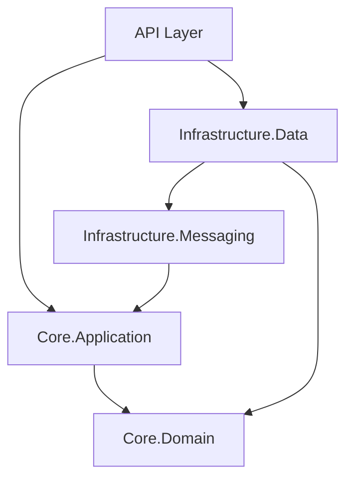

# Module Map

> **Source:** aid-discover (Phase 1)
> **Status:** {✅ Complete | ⚠️ Partial | ❌ Missing}
> **Last Updated:** {date}

---

## Module Inventory

> List every significant module, package, or project. For large codebases, focus on modules that contain business logic — skip pure infrastructure scaffolding.

| Module | Purpose | Dependencies | Size | Test Coverage | Notes |
|--------|---------|-------------|------|--------------|-------|
| {module-name} | {what it does in one sentence} | {list of modules it imports} | {small / medium / large} | {✅ tested / ⚠️ partial / ❌ none} | {tech debt, warnings} |
| {module-name} | {what it does} | {deps} | {small / medium / large} | {coverage} | |

**Example:**
| Module | Purpose | Dependencies | Size | Test Coverage | Notes |
|--------|---------|-------------|------|--------------|-------|
| `Core.Domain` | Entities, value objects, domain events | none | medium | ✅ tested | Pure domain — no infrastructure deps |
| `Core.Application` | Use cases, command/query handlers | `Core.Domain` | medium | ⚠️ partial | Missing tests for edge cases in OrderService |
| `Infrastructure.Data` | EF Core context, repositories | `Core.Domain`, `Core.Application` | medium | ❌ none | No repository tests |
| `Infrastructure.Messaging` | RabbitMQ integration | `Core.Application` | small | ❌ none | |
| `API` | ASP.NET controllers, middleware | All | medium | ⚠️ partial | Integration tests exist but slow |

---

## Dependency Graph

> Show which modules import which. Arrows point from importer to dependency.



> If mermaid isn't available, use text:
```
API → Core.Application
API → Infrastructure.Data
Core.Application → Core.Domain
Infrastructure.Data → Core.Domain
Infrastructure.Messaging → Core.Application
```

---

## Entry Points

| Entry Point | Module | Type | Description |
|-------------|--------|------|-------------|
| {path/to/file} | {module} | {HTTP / CLI / background / test} | {what it starts} |

---

## High-Churn Modules

> Modules that change most frequently — higher bug risk, higher review priority. Name the
> module and WHY it churns; the precise commit count is a point-in-time number (run
> `git log` for current churn), so don't store it.

| Module | Why it churns | Risk |
|--------|---------------|------|
| {module} | {active feature area / unstable interface / frequent bugfixes} | {High / Medium / Low} |

---

## Oversized Modules

> Flag outliers — very large modules often indicate poor separation of concerns. List the
> modules by name (precise file counts drift — let the reader measure); the durable signal
> is WHICH modules are oversized and why that's a risk.

**⚠️ Modules to watch:** {name any module large enough to hide complexity, with a one-line
reason — e.g., `Core.Application` mixes several unrelated concerns}

---

## Conventions

> The project's **own way** of adding/wiring a module -- where it goes, how it is named, how
> it is registered/connected. Without this an agent invents a module convention wrong for
> this project. State the rule, then point at the canonical example module.

- **Where a new module goes:** {e.g. "one project per bounded context under `src/`;
  infrastructure modules go under `src/Infrastructure/`"}.
- **How a module is named:** {e.g. "`{Context}.{Layer}` -- `Orders.Application`"}.
- **How a module is registered/wired:** {e.g. "each module exposes an
  `Add{Module}()` extension method called from composition root"}.

---

## Invariants

> What MUST always hold for the module graph -- an ordering, a dependency-direction rule, a
> single-source-of-truth rule the source enforces silently. Without this an agent violates
> an invariant and breaks the build or a layering rule. State each as a hard MUST/MUST-NOT.

- **{Dependency direction}:** {e.g. "Domain modules MUST NOT depend on Infrastructure
  modules -- enforced by project references"}.
- **{No cycles}:** {e.g. "the module dependency graph MUST stay acyclic"}.
- **{Single owner}:** {e.g. "each entity is owned by exactly one module; no shared mutable
  state across modules"}.

---

## Revision History

| Rev | Date | Source | Description |
|-----|------|--------|-------------|
| 1.0 | {date} | aid-discover | Initial discovery |
