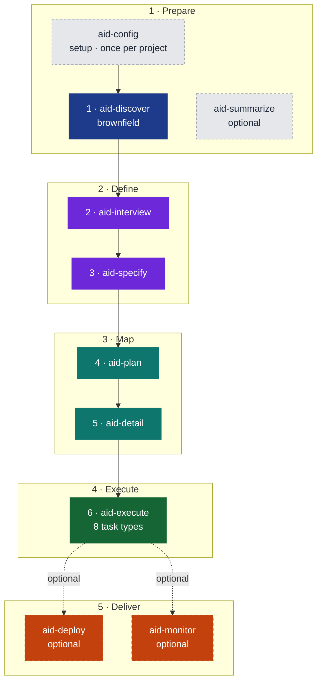
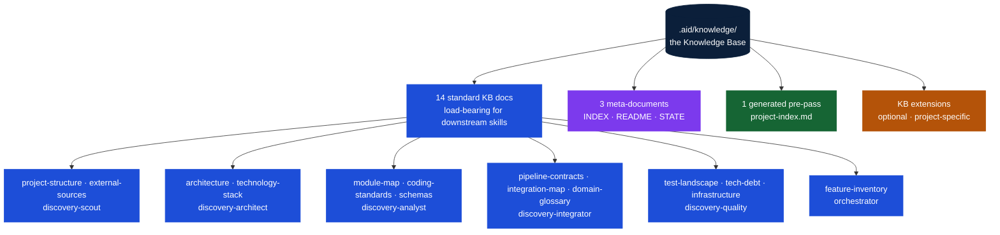
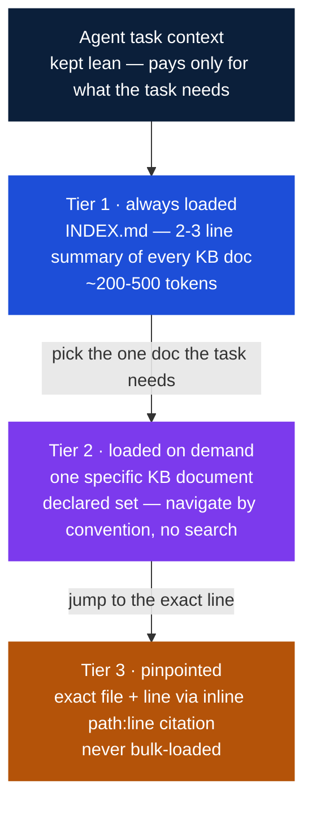
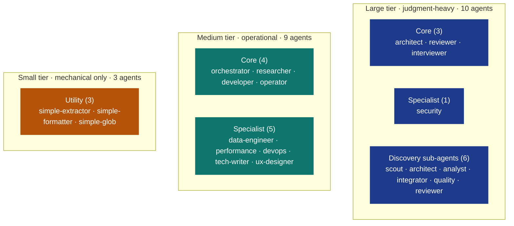
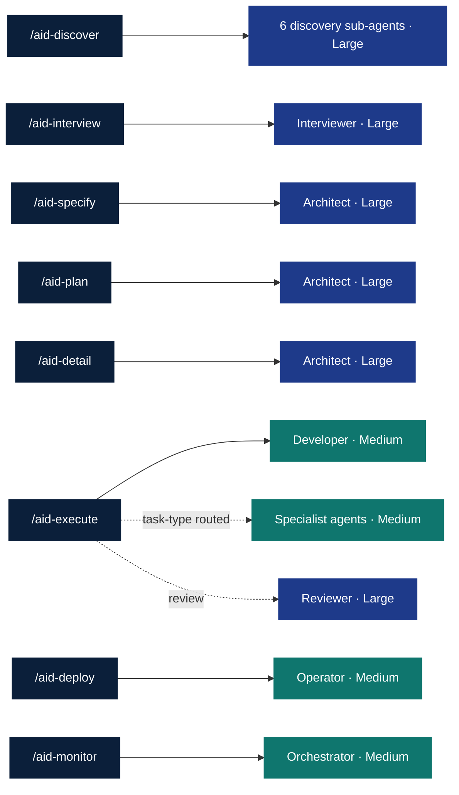

# AID — AI Integrated Development

**A methodology for building software with AI agents across the full lifecycle — from understanding an existing system to monitoring it in production.**

Most AI-coding workflows treat development as a code-generation problem: write a spec, let the agent implement it, review the output. That framing ignores everything *around* the spec — and that is exactly where AI projects fail. AID is the methodology for the rest of the lifecycle.

It ships as an install bundle for **five AI coding tools** (Claude Code, OpenAI Codex CLI, Cursor, GitHub Copilot CLI, Antigravity): an **11-skill pipeline**, **22 specialized agents**, formal feedback loops, and a **Knowledge Base** that every phase reads and any phase can revise.

## Contents

- [What is AID?](#what-is-aid)
- [Why AID? — the failure modes it removes](#why-aid--the-failure-modes-it-removes)
- [The Pipeline](#the-pipeline)
- [The Lite Path](#the-lite-path)
- [The Knowledge Base](#the-knowledge-base--the-gravitational-center)
- [The Agent Model](#the-agent-model--three-tiers)
- [Feedback Loops](#feedback-loops)
- [AID vs. SDD](#aid-vs-sdd)
- [Using AID in your own project](#using-aid-in-your-own-project)
- [Versioning](#versioning)
- [Repository structure](#repository-structure)

---

## What is AID?

AID (AI Integrated Development) covers the **full lifecycle**: understanding an existing system, gathering requirements, writing grounded specifications, planning and detailing work, building with quality gates, shipping, and monitoring production. **Eleven skills, five groups, eleven formal feedback loops.**

It rests on three convictions:

1. **Understanding precedes specification.** You cannot write a useful spec for a system you don't understand — and most real work is brownfield. AID makes Discovery the first thing that happens.
2. **Specs are hypotheses, not contracts.** Implementation reveals truths that specification cannot anticipate. AID gives you formal revision protocols instead of silent workarounds.
3. **The Knowledge Base is the gravitational center.** Not the spec, not the code — the accumulated, living understanding of the project that persists across phases, sprints, and team changes.

AID is not "AI executes, human validates." It is human and AI working together across every phase, with the human as **pilot** — setting direction, making decisions, approving phase transitions.


> AID *contains* SDD (Spec-Driven Development). SDD is the spec→code layer. AID is the complete lifecycle — before the spec, during implementation, and after deployment.

---

## Why AID? — the failure modes it removes

Hand a capable coding agent a vague task and a large repository, and you get predictable failure modes. AID removes each one **structurally** — not with prompt-tuning, but with process.

| Failure mode | What it looks like | How AID removes it |
|---|---|---|
| **Knowledge gaps** | The agent doesn't understand the existing system and invents how it works. | **Discovery builds the Knowledge Base first.** A fixed-shape, evidence-backed picture of the codebase exists *before* any spec is written. |
| **Hallucination** | The agent states things about the code that aren't true. | **Every KB claim carries a `path:line` citation.** Facts are anchored to source; agents navigate to exact lines instead of guessing. |
| **Drift** | The implementation quietly diverges from intent; the spec rots. | **Spec-as-hypothesis + 11 formal feedback loops.** When reality contradicts an artifact, the agent records a Q&A entry in a STATE file (or files an IMPEDIMENT) and the upstream artifact is revised with a traceable revision history. Silent workarounds are forbidden. |
| **Overengineering** | The agent adds abstractions, options, and scope nobody asked for. | **Typed, PR-sized tasks with explicit acceptance criteria.** Detail decomposes work into small bounded tasks; the Reviewer grades against the spec, not vibes. |
| **Oversights** | Bugs, missed edge cases, and untested paths slip through. | **Separate adversarial review.** The agent that writes never grades its own work — a higher-tier reviewer with clean context evaluates every task against a rubric, looping until grade ≥ minimum. |
| **Context exhaustion** | Loading the whole repo into the context window — slow, expensive, lossy. | **A 3-tier context economy.** An always-loaded index → one KB document on demand → an exact `path:line`. The agent pays only for what a task needs. |

The rest of this document is how each mechanism works.

---

## The Pipeline

AID is **11 skills** — one setup skill, six numbered development phases, three optional skills (`aid-summarize`, `aid-deploy`, `aid-monitor`), and one on-demand maintenance skill (`aid-housekeep`) — organized into **five groups**. The development path (Discover → Execute) is linear by default; delivery is optional and runs on demand. The feedback loops are the escape hatches that prevent silent workarounds.



| Group | Phase | Skill | What it produces |
|---|---|---|---|
| **1 · Prepare** | — Init | `/aid-config` | `.aid/` scaffold, KB placeholders (14 templates + meta), `CLAUDE.md` / `AGENTS.md` |
| | 1 · Discover | `/aid-discover` | the 14-document Knowledge Base |
| | — Summarize | `/aid-summarize` | optional offline HTML viewer of the KB |
| **2 · Define** | 2 · Interview | `/aid-interview` | `REQUIREMENTS.md` + per-feature `SPEC.md` stubs (full path) OR work-root `SPEC.md` + `tasks/` (lite path) |
| | 3 · Specify | `/aid-specify` | the technical specification for each feature (full path only) |
| **3 · Map** | 4 · Plan | `/aid-plan` | `PLAN.md` — features sequenced into shippable deliveries (full path only) |
| | 5 · Detail | `/aid-detail` | typed, PR-sized task files with acceptance criteria (full path only) |
| **4 · Execute** | 6 · Execute | `/aid-execute` | implemented + reviewed code, looped to a grade |
| **5 · Deliver** | — Deploy | `/aid-deploy` | *(optional)* a shipped delivery + pull request |
| | — Monitor | `/aid-monitor` | *(optional)* production findings classified and routed to fixes |

`aid-config` (setup), `aid-summarize`, `aid-deploy`, and `aid-monitor` are skills but **not numbered phases** — hence the dashes. `aid-deploy` and `aid-monitor` are optional, on-demand delivery skills positioned at the end of the pipeline: neither is required to complete a cycle and neither presupposes the other. Discovery is brownfield-only; greenfield projects enter at Interview. `aid-housekeep` is an on-demand maintenance skill (off-pipeline) for keeping the Knowledge Base current.

---

## The Lite Path

For small, well-scoped work, AID includes a **lite path** that skips most of the pipeline and gets straight to execution. When you run `/aid-interview`, it begins with a TRIAGE that classifies the work by breadth, size, and type. Small work (≤ 2 features, ≤ a few days, workType: bug-fix / small-refactor / single-doc / small-new-feature) takes the lite path.

**Lite path output:** a work-root `SPEC.md` + `tasks/` directory directly — no `features/` folder, no `REQUIREMENTS.md`, no `PLAN.md`. Then straight to `/aid-execute`.

| workType | Sub-path | Typical output |
|----------|----------|----------------|
| `bug-fix` | LITE-BUG-FIX | 1 IMPLEMENT task (fix + regression test) |
| `small-refactor` | LITE-REFACTOR | 1–3 REFACTOR + TEST tasks |
| `single-doc` | LITE-DOC | 1 DOCUMENT task |
| `small-new-feature` | LITE-FEATURE | 1–5 IMPLEMENT + TEST + DOCUMENT tasks |

**Recipes** speed up the lite path further. Five pre-filled templates live at `canonical/recipes/` (bug-fix, method-refactor, add-crud-endpoint, add-unit-test, write-release-note). A recipe is a YAML frontmatter + `## spec` + `## tasks` block with `{{slot}}` placeholders that `parse-recipe.sh` substitutes — eliminating redundant interview for recurring patterns. A lite work can also be escalated to full mid-flight if scope grows.

---

## The Knowledge Base — the gravitational center

The KB is the central artifact AID is built around. Not the spec, not the code — the **accumulated living understanding** of the project. Every phase reads it; every phase may revise it. Its doc-set is **declared per project** — a standard default set for software projects, adjustable to whatever the project actually is — so downstream skills always know exactly where to look.



The declared doc-set is produced by six discovery sub-agents grouped by domain. Because the set is declared (not ad-hoc), an agent looking for data schemas always reads `schemas.md`; looking for debt, always `tech-debt.md` — navigation is by **convention, not search**. The default set of 14 standard documents is configurable via `discovery.doc_set` in `.aid/settings.yml`.

### Progressive disclosure — the 3-tier context economy

The diagram above shows *what* exists. Just as important is *how an agent reads it*: the KB is structured so an agent **never loads the whole repository — or even the whole KB — into its context window.** Retrieval happens in three tiers, cheapest first.



- **Tier 1 — `INDEX.md`, always loaded.** Every task prompt carries a 2-3 line summary of every KB doc (~200-500 tokens total). The agent knows what knowledge exists and which file holds it, at negligible cost.
- **Tier 2 — one KB document, on demand.** From an INDEX entry the agent reads only the single document a task needs. The fixed 14-doc shape makes this deterministic — no search.
- **Tier 3 — exact repo location, via citation.** Every factual claim in a KB doc carries an inline `path:line` citation. The agent jumps straight to the precise file and line — never globbing, never bulk-loading unrelated source.

**Net effect:** retrieval-augmented behavior with no vector database, no embeddings, no chunking — just predictable structure, a navigation index, and mandatory citations.

---

## The Agent Model — three tiers

Skills are state-machine **orchestrators**; agents are the **workers**. AID defines 22 agents, split into three tiers by cost and capability, applied consistently across all five install bundles.



Each tier is a deliberate cost/precision trade-off:

| Tier | Trade-off | Best for |
|------|-----------|----------|
| **Small** | cheapest and fastest, but more error-prone | small, well-defined, mechanical tasks |
| **Medium** | moderate cost and speed, good accuracy | substantial work that needs reasoning within a known shape |
| **Large** | most expensive and slowest, highest precision | hard, open-ended analysis that demands deep reasoning |

The tiers are **provider-agnostic** — each host tool maps them to a concrete model:

| Tier | Claude Code | Codex CLI | Cursor | Copilot CLI | Antigravity |
|------|-------------|-----------|--------|-------------|-------------|
| **Large** | Claude Opus | GPT-5.5 (high reasoning) | Claude Opus | claude-opus-4.8 | gemini-3-pro |
| **Medium** | Claude Sonnet | GPT-5.4 (medium reasoning) | Claude Sonnet | claude-sonnet-4.6 | gemini-3-pro |
| **Small** | Claude Haiku | GPT-5.4-mini (low reasoning) | Claude Haiku | claude-haiku-4.5 | gemini-3-flash |

### Skill → agent dispatch

Each skill has a default executor agent and a default reviewer. The dispatch is deterministic, and one invariant is enforced everywhere: the **Reviewer's tier is ≥ the Executor's**. The agent that writes the work never grades it.



Grading is **deterministic**: the Reviewer never assigns a letter grade — it produces a severity-tagged issue list, and a script computes the grade from the rubric. Execute loops — fix, re-review — until the grade clears the minimum, with a circuit breaker after three cycles.

---

## Feedback Loops

The development pipeline (Discover → Execute) is sequential by default; the optional Deliver skills run on demand at the end. But real engineering isn't linear. AID defines **eleven formal feedback loops** — eight within development, two connecting production back to development, and one cross-cutting re-entry available from any phase — so any phase can revise an upstream artifact when reality contradicts an assumption.

Every loop produces a formal record (a Q&A entry in a STATE file, an `IMPEDIMENT` file, or a Monitor finding) with a revision trail. The spec evolves — but **traceably**. You can always answer "why did this change?" with evidence.

Key loops:

- **Any phase → Discovery** — a phase finds the KB wrong or incomplete; targeted re-discovery fills the specific gap.
- **Execute → IMPEDIMENT** — the agent hits an assumption that doesn't hold and escalates explicitly, instead of silently working around it.
- **Monitor → Interview** — a production bug takes the short path through Interview's lite bug-fix triage into Execute: root-cause, task, fix.
- **Monitor → Interview** — a change request re-enters as new/changed requirements and runs the pipeline from Interview.

---

## AID vs. SDD

Spec-Driven Development is a good idea. AID contains it and goes further.

| Dimension | SDD | AID |
|---|---|---|
| **Starting point** | You have a spec | You have a problem |
| **Brownfield support** | Not addressed | First-class Discovery phase + 14-document KB |
| **Spec philosophy** | Spec is the source of truth | Spec is a hypothesis — revised by formal protocol |
| **Requirements** | Assumed to exist | Adaptive interview, one question at a time |
| **Planning depth** | A single spec | Two levels: Plan (strategy) → Detail (tactics) |
| **Quality** | Review the output | Separate adversarial reviewer + deterministic grading loop |
| **Feedback loops** | Linear: spec → code → done | 11 formal loops (8 development + 2 post-production + 1 cross-cutting) |
| **Post-delivery** | Not addressed | Monitor classifies findings and routes them back |

> SDD says: *the spec drives development.*
> AID says: *understanding drives the spec, the spec drives development, and production drives the next understanding.*

---

## Using AID in your own project

### 1. Install

AID is distributed by `git clone`. The setup script installs the skills, agents, and templates into your target project in each tool's native format.

```bash
git clone https://github.com/AndreVianna/aid-methodology.git
cd aid-methodology

# Linux / macOS / git-bash
./setup.sh /path/to/your/project

# Windows (PowerShell 5.1+)
.\setup.ps1 C:\path\to\your\project
```

The script shows a menu — select the tools you use and install. Options are:

1. Claude Code
2. OpenAI Codex CLI
3. Cursor
4. GitHub Copilot CLI
5. Antigravity
6. Done

**Re-running is safe:** identical files are skipped, changed files prompt before overwriting. Pass `--force` to overwrite without prompts.

Prefer to install by hand? Copy the tool directory into your project root:

- Claude Code: `profiles/claude-code/.claude/`
- Codex CLI: `profiles/codex/.codex/` + `profiles/codex/.agents/`
- Cursor: `profiles/cursor/.cursor/`
- GitHub Copilot CLI: `profiles/copilot-cli/.github/`
- Antigravity: `profiles/antigravity/.agent/`

### 2. Run the pipeline

Open your AI coding tool in the project and run the skills as slash commands:

```
/aid-config           # once per project — scaffolds .aid/ and the KB structure
/aid-discover         # brownfield: analyze the existing code into the KB
/aid-interview        # begin requirements gathering (TRIAGE routes full or lite path)
/aid-specify          # add the technical spec to each feature (full path only)
/aid-plan             # sequence features into shippable deliveries (full path only)
/aid-detail           # decompose deliveries into typed, PR-sized tasks (full path only)
/aid-execute          # implement each task, with the built-in review loop
/aid-deploy           # optional — package and ship a delivery
/aid-monitor          # optional — observe production; classify findings; route fixes
/aid-summarize        # optional — generate an offline HTML viewer of the KB
/aid-housekeep        # on-demand — keep the Knowledge Base current (off-pipeline)
```

`/aid-config` runs first, always. Then **brownfield** projects run `/aid-discover`; **greenfield** projects start at `/aid-interview`. Every phase is gated — nothing advances without your explicit approval. `/aid-interview` begins with TRIAGE: if the work is small and well-scoped, it routes to the lite path automatically.

### 3. What gets installed

- Tool-specific directories (depending on the tools you picked):
  - `.claude/` — Claude Code
  - `.codex/` + `.agents/` — Codex CLI
  - `.cursor/` — Cursor
  - `.github/` — GitHub Copilot CLI
  - `.agent/` — Antigravity
- `CLAUDE.md` or `AGENTS.md` at the project root — the host-tool project-context file, with placeholders that `/aid-config` and `/aid-discover` populate.
- `.aid/` appended to your project's `.gitignore` — the Knowledge Base stays out of git by default; remove the entry if you want to commit it.

### Runtime requirements

- One or more host AI tools: **Claude Code**, **OpenAI Codex CLI**, **Cursor**, **GitHub Copilot CLI**, or **Antigravity**. Any agent that can read files and write code can use the skill docs as system context.
- **Bash** (or git-bash on Windows) for scripts; **PowerShell 5.1+** for `setup.ps1`.
- **Git**. **Node 18+** is optional — only `/aid-summarize` uses it, for diagram validation.

### Incremental adoption

You don't need the whole pipeline on day one. Common entry points:

- **Start with Detail + Execute** to formalize task decomposition and reviewed execution.
- **Add Discover** when you onboard a brownfield codebase.
- **Add Interview + Specify** when you take on new requirements.
- **Add Plan** to separate delivery strategy from tactics.
- **Add Deploy + Monitor** once you are shipping regularly.

---

## Versioning

AID is at **`0.1.0-dev`** (see the [`VERSION`](VERSION) file) — a pre-release
marker, not a stable release. The canonical position is **"continuous master"**:
there is no formal semver release cadence yet.

- Install via `setup.sh` (or `setup.ps1` on Windows) — it installs the current
  `master` and prints the installed version on completion.
- Re-run `setup.sh` (or `setup.ps1`) to pick up updates.

A formal version bump (with a release/changelog cadence) will be introduced when
the methodology stabilizes — the methodology-flexibility work is the natural
first-version point.

---

## Repository structure

```
aid-methodology/
├── canonical/                           ← single source of truth (never edit profiles/ directly)
│   ├── skills/                          ← 11 user-facing skills
│   ├── agents/                          ← 22 agent definitions
│   ├── templates/                       ← KB templates and document templates
│   ├── recipes/                         ← 5 lite-path seed recipes
│   └── scripts/                         ← helper scripts by phase
├── profiles/                            ← rendered install trees (generated — do not edit)
│   ├── claude-code/
│   ├── codex/
│   ├── cursor/
│   ├── copilot-cli/
│   └── antigravity/
├── methodology/aid-methodology.md       ← the complete methodology spec (~40 min read)
├── docs/                                ← FAQ and glossary
├── examples/                            ← worked tutorial examples
├── setup.sh  ·  setup.ps1              ← cross-platform installers
└── CONTRIBUTING.md  ·  LICENSE
```

| Want to… | Go to |
|---|---|
| Read the complete methodology | [`methodology/aid-methodology.md`](methodology/aid-methodology.md) |
| Look up a term | [`docs/glossary.md`](docs/glossary.md) |
| Answer a how-to question | [`docs/faq.md`](docs/faq.md) |
| See AID applied step by step | [`examples/`](examples/README.md) — greenfield, brownfield full-path, brownfield lite-path |

---

## Contributing

See [CONTRIBUTING.md](CONTRIBUTING.md) for how to contribute skills, templates, examples, or methodology improvements.

## License

MIT — see [LICENSE](LICENSE).

---

*Read the full methodology: [methodology/aid-methodology.md](methodology/aid-methodology.md) · Blog post: [AID — the complete picture](https://casuloailabs.com/blog/aid-methodology/)*
