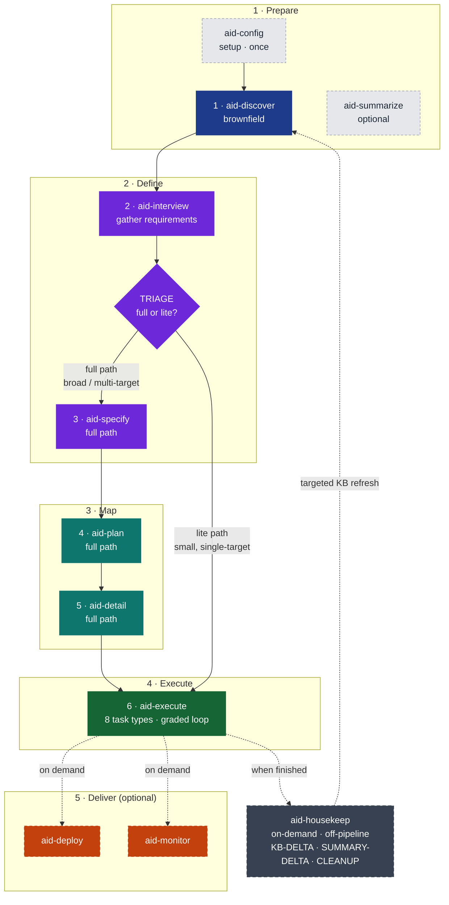

# AID — AI Integrated Development


**A full-lifecycle methodology for building software with AI agents** — from understanding an existing codebase to monitoring it in production.

12-skill pipeline · 9 specialized agents · 5 AI tools · Knowledge Base that every phase reads and any phase can revise.



*12 skills · 5 groups · 2 paths (TRIAGE-routed). Full methodology: [docs/aid-methodology.md](docs/aid-methodology.md).*

> [!TIP]
> New to AID? Install takes 2 minutes. Run slash commands directly in your AI coding tool — no plugins required. Jump to [Install](#install) to get started.

---

## Install

AID uses a persistent global `aid` CLI installed once per machine. After bootstrap, use `aid add <tool>` inside any repo to install the AID profile for that tool.

### Bootstrap the `aid` CLI (once per machine)

**Linux / macOS:**

```bash
curl -fsSL https://raw.githubusercontent.com/AndreVianna/aid-methodology/master/install.sh | bash
```

Installs to `~/.aid/` and adds `~/.aid/bin` to your PATH. Open a new shell after.

**Windows (PowerShell 5.1+):**

```powershell
irm https://raw.githubusercontent.com/AndreVianna/aid-methodology/master/install.ps1 | iex
```

Installs to `%LOCALAPPDATA%\aid\` and adds it to your User PATH. Open a new shell after.

**npm (Node >=18):**

```bash
npm i -g aid-installer
# one-off without a global install:
npx aid-installer add claude-code
```

**PyPI (Python >=3.8):**

```bash
pipx install aid-installer        # recommended — isolated environment
# or:
pip install --user aid-installer
```

**Offline / air-gapped:**

Download a profile tarball from the [GitHub Releases page](https://github.com/AndreVianna/aid-methodology/releases), verify it, then install without network access:

```bash
# Download and verify (example: claude-code at v1.1.0)
curl -LO https://github.com/AndreVianna/aid-methodology/releases/download/v1.1.0/aid-claude-code-v1.1.0.tar.gz
curl -LO https://github.com/AndreVianna/aid-methodology/releases/download/v1.1.0/SHA256SUMS
sha256sum --check --ignore-missing SHA256SUMS     # Linux
shasum -a 256 -c SHA256SUMS                       # macOS

# Install from the local bundle (after bootstrapping the CLI)
aid add claude-code --from-bundle aid-claude-code-v1.1.0.tar.gz
```

All four channels deliver the same `aid` CLI. See [Full install guide →](docs/install.md) for the channel comparison and `aid update self` behavior per channel.

### Use it

```bash
aid add claude-code        # install AID into the current project (also: codex cursor copilot-cli antigravity)
aid add codex,cursor       # multiple tools at once
aid status                 # show what is installed
aid update                 # update all installed tools
aid update self            # update the aid CLI itself
aid remove codex           # remove one tool
aid remove self            # remove the aid CLI itself (asks to confirm)
```

Re-running `aid add` is safe: identical files are skipped. Root agent files (`CLAUDE.md` / `AGENTS.md`) are updated in-place and losslessly: AID rewrites only the region between its own markers and leaves everything you authored outside those markers untouched.

[Full install guide — all channels, offline bundles, version pinning, protect-on-diff, reference →](docs/install.md)

---

## Quick Start

Open your AI coding tool in your project and run the skills as slash commands:

```
/aid-config           # once per project — scaffolds .aid/ and KB structure
/aid-discover         # brownfield only: analyze the codebase into the KB
/aid-interview        # gather requirements; TRIAGE auto-routes full or lite path
/aid-specify          # write the technical spec for each feature (full path only)
/aid-plan             # sequence features into shippable deliveries (full path only)
/aid-detail           # decompose deliveries into typed, PR-sized tasks (full path only)
/aid-execute          # implement each task with the built-in adversarial review loop
/aid-deploy           # optional — package and ship a delivery
/aid-monitor          # optional — classify production findings and route fixes back
/aid-summarize        # optional — generate an offline HTML viewer of the KB
/aid-housekeep        # on-demand — keep the Knowledge Base current (off-pipeline)
/aid-ask              # on-demand — answer free-form questions from the KB + codebase (read-only)
```

**Brownfield** projects run `/aid-config` → `/aid-discover` → `/aid-interview`. **Greenfield** projects skip Discovery and start at `/aid-interview`. Every phase is gated — nothing advances without your approval.

[See it applied step by step →](examples/)

---

## What's New in v1.1.0

### AID dashboard

`aid dashboard start node` or `aid dashboard start python` opens a local, read-only web view of every project this install manages. Each project shows its current pipeline status, installed tools, and a 5-state Knowledge-Base freshness card (including "Outdated" detection). Click through to a task drill-down forensic panel. A 4-level breadcrumb keeps you oriented. The server binds to 127.0.0.1; pass `--remote` to expose the machine-level dashboard over your private tailnet.

### Self-cleaning install and update

Installing or updating AID now prunes stale AID files — files that were renamed, moved, or dropped between versions. Only AID-managed entries are pruned; your files are never touched. Combined with content isolation (see below), updates are clean by default: no orphaned files accumulate across upgrades.

### Content isolation

AID's own folders now install under an `aid/` subtree (`.claude/aid/{scripts,templates,recipes}`) and every AID file in tool-native folders (`agents/`, `skills/`, `rules/`) carries an `aid-` prefix. AID content and your content cannot collide, and `aid update` can prune AID's own stale files in place without any risk of touching yours.

Root-agent files (`CLAUDE.md` / `AGENTS.md`) are now updated in-place and losslessly: AID rewrites only the region between its own `<!-- AID:BEGIN -->` / `<!-- AID:END -->` markers; everything you wrote outside those markers is preserved exactly. The old `.aid-new` sidecar file is gone.

### `aid projects` and the project registry

`aid projects [list|add|remove|help]` manages the projects AID tracks. `list` shows each project's version, installed tools, tier, and a `*` marker for the current directory. The CLI keeps a lightweight registry (`$AID_STATE_HOME/registry.yml`) so the dashboard and `aid update self` always know which projects to display and migrate.

### Upgrade migration

`aid update self` walks every tracked project and offers to migrate it to the current layout — validating and repairing `.aid/settings.yml`, installing any missing files, and registering the project. Choose All / Yes / No / Cancel per project. Migration is idempotent and additive: it preserves your settings and comments. pip/pipx installs (no postinstall hook) are covered by lazy migration on the next `aid` command.

### Worktree-aware dashboard tracking

Work that lives only on a git worktree branch is surfaced under its project (labeled by branch) instead of being invisible. Same-work pipelines across branches are merged into a single view — the most-advanced state wins. The dashboard degrades gracefully to the main checkout when git is unavailable.

### `/aid-ask`

A read-only, on-demand skill that answers free-form questions about your project from the Knowledge Base, the codebase, and in-flight works, with source citations. It never writes anything.

---

## Why AID

Hand a capable coding agent a vague task and a large repository and you get predictable failure modes. AID removes each one structurally — not with prompt-tuning, but with process.

| **Failure mode** | What it looks like | How AID removes it |
|---|---|---|
| **Knowledge gaps** | The agent invents how the existing system works. | Discovery builds the Knowledge Base first — a fixed-shape, evidence-backed picture of the codebase before any spec is written. |
| **Hallucination** | The agent states things about the code that aren't true. | Every KB claim carries a `path:line` citation. Agents navigate to exact lines instead of guessing. |
| **Drift** | Implementation quietly diverges from intent; the spec rots. | Spec-as-hypothesis + 11 formal feedback loops. When reality contradicts an artifact the agent files a Q&A entry or IMPEDIMENT and the upstream artifact is revised — traceably. |
| **Overengineering** | The agent adds scope nobody asked for. | Typed, PR-sized tasks with explicit acceptance criteria. The Reviewer grades against the spec, not vibes. |
| **Oversights** | Bugs and untested paths slip through review. | Separate adversarial review: the agent that writes never grades its own work — a higher-tier Reviewer with clean context loops until grade >= minimum. |
| **Context exhaustion** | Loading the whole repo — slow, expensive, lossy. | A 3-tier context economy: always-loaded index -> one KB doc on demand -> exact `path:line`. The agent pays only for what the task needs. |

[Full philosophy and design rationale →](docs/aid-methodology.md)

---

## How It Works

### The Pipeline

Six numbered development phases form the mandatory sequential path. Deploy and Monitor are optional. `aid-housekeep` runs off the pipeline on demand.

AID's phases are gated: you approve every transition. Nothing auto-advances. [Full pipeline deep-dive →](docs/aid-methodology.md#1-the-pipeline)

### The Lite Path

For small, well-scoped work, `/aid-interview` opens with a TRIAGE: you describe the work in your own words and the agent infers the work-type and the best-matching recipe. A confident, single-target match skips the full pipeline and routes straight to `/aid-execute`.

[Lite path and recipes →](docs/aid-methodology.md#2-philosophy)

### The Knowledge Base

The KB is the central artifact: a living 14-document picture of the project. Every phase reads it; any phase can revise it. A 3-tier retrieval model (INDEX → one doc on demand → exact `path:line`) gives agents precise context at minimal cost — no vectors, no embeddings, no chunking.

[Knowledge Base in depth →](docs/aid-methodology.md#3-the-knowledge-base)

### The Agent Model

AID defines 9 agents across three tiers (Large / Medium / Small), mapped per tool to concrete models. The invariant enforced everywhere: the Reviewer's tier is always >= the Executor's. The agent that writes never grades its own work.

[Full agent roster and dispatch rules →](docs/aid-methodology.md#5-the-agent-model)

**Feedback Loops** — 11 formal pathways so any phase can revise an upstream artifact when reality contradicts an assumption. [All 11 loops →](docs/aid-methodology.md#6-feedback-loops)

**AID vs. SDD** — SDD says the spec drives development. AID says understanding drives the spec, the spec drives development, and production drives the next understanding. [Comparison →](docs/aid-methodology.md#9-comparison-with-sdd)

---

## Documentation

| Document | Contents |
|---|---|
| [docs/aid-methodology.md](docs/aid-methodology.md) | Complete methodology (~40 min read) |
| [docs/install.md](docs/install.md) | Full install guide — all channels, offline, update, remove |
| [docs/repository-structure.md](docs/repository-structure.md) | Repo layout and contributor orientation |
| [docs/release.md](docs/release.md) | Maintainer release runbook |
| [docs/faq.md](docs/faq.md) | How-to questions |
| [docs/glossary.md](docs/glossary.md) | Term definitions |
| [examples/](examples/README.md) | Step-by-step walkthroughs — greenfield, brownfield full-path, brownfield lite-path |

---

## Contributing

See [CONTRIBUTING.md](CONTRIBUTING.md) for how to contribute skills, templates, examples, or methodology improvements.

## License

MIT — see [LICENSE](LICENSE).

---

*Full methodology: [docs/aid-methodology.md](docs/aid-methodology.md) · Blog: [AID — the complete picture](https://casuloailabs.com/blog/aid-methodology/)*
