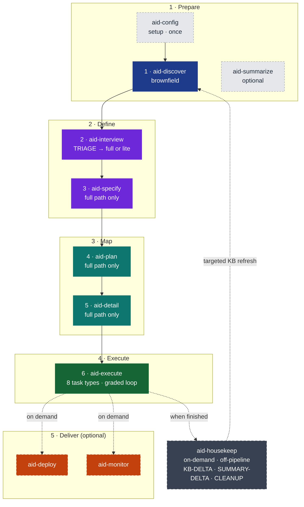
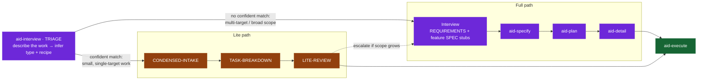
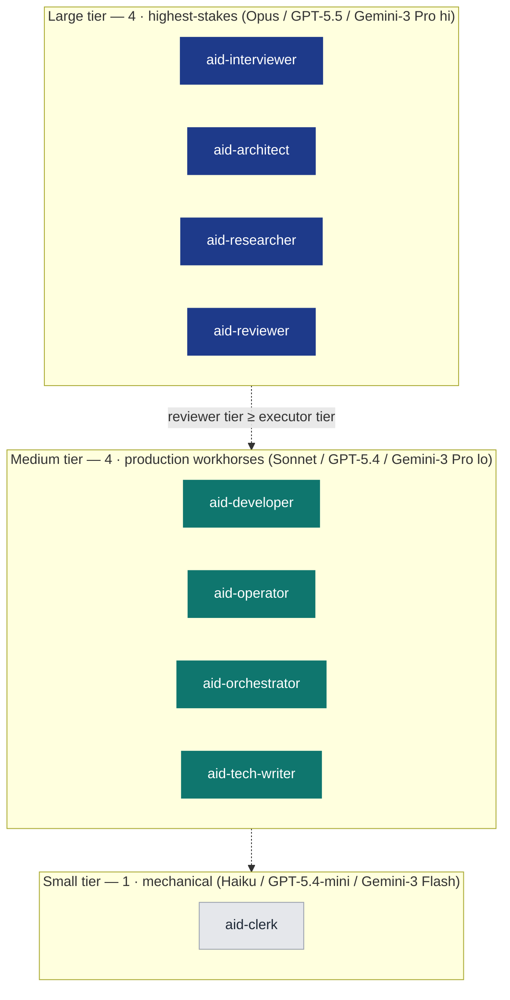

# AID — AI Integrated Development


**A full-lifecycle methodology for building software with AI agents** — from understanding an existing codebase to monitoring it in production.

11-skill pipeline · 9 specialized agents · 5 AI tools · Knowledge Base that every phase reads and any phase can revise.



*11 skills · 5 groups · 2 paths (TRIAGE-routed). Full methodology: [methodology/aid-methodology.md](methodology/aid-methodology.md).*

> [!TIP]
> New to AID? Install takes 2 minutes. Run slash commands directly in your AI coding tool — no plugins required. Jump to [Install](#install) to get started.

---

## Install

AID uses a persistent global `aid` CLI installed once per machine. After bootstrap, use
`aid add <tool>` inside any repo to install the AID profile for that tool.

### 1. Bootstrap the `aid` CLI (once per machine)

**Linux / macOS:**

```bash
curl -fsSL https://raw.githubusercontent.com/AndreVianna/aid-methodology/<ref>/install.sh | bash
```

Installs to `~/.aid/` and adds `~/.aid/bin` to your PATH. Open a new shell after.

**Windows (PowerShell 5.1+):**

```powershell
irm https://raw.githubusercontent.com/AndreVianna/aid-methodology/<ref>/install.ps1 | iex
```

Installs to `%LOCALAPPDATA%\aid\` and adds it to your User PATH. Open a new shell after.

### 2. Add AID to a project (run inside the repo)

```bash
aid add claude-code       # or: codex  cursor  copilot-cli  antigravity
aid add codex,cursor      # multiple tools at once
aid status                # show what is installed
aid update                # update all installed tools
aid update self           # update the aid CLI itself
aid remove codex          # remove one tool
aid remove                # remove AID entirely from this project (asks to confirm)
aid remove self           # remove the aid CLI itself (asks to confirm)
```

**One-line bootstrap + add (first install):**

```bash
# Linux / macOS
curl -fsSL https://raw.githubusercontent.com/AndreVianna/aid-methodology/<ref>/install.sh | bash -s -- add claude-code
```

```powershell
# Windows
$env:AID_TOOL = 'claude-code'
irm https://raw.githubusercontent.com/AndreVianna/aid-methodology/<ref>/install.ps1 | iex
```

Re-running `aid add` is safe: identical files are skipped. Root agent files
(`CLAUDE.md`/`AGENTS.md`) that you wrote yourself are protected — AID writes the incoming
version as `*.aid-new` for you to review rather than overwriting silently.

**Also available via npm and PyPI:**

```bash
# npm (Node >=18)
npm i -g aid-installer
# or: npx aid-installer add claude-code  (one-off, no global install)

# PyPI (Python >=3.8)
pipx install aid-installer
# or: pip install --user aid-installer
```

All channels put the same `aid` CLI on PATH. The `curl`/`irm` bootstrap, npm, and PyPI
are all supported install paths for end users today. See
[docs/install.md](docs/install.md) for the full channel comparison and `aid update self`
behavior per channel.

> [!NOTE]
> Prefer to install by hand? Copy the profile directory for each tool you use directly into your project root:
> - Claude Code: `profiles/claude-code/.claude/`
> - Codex CLI: `profiles/codex/.codex/` + `profiles/codex/.agents/`
> - Cursor: `profiles/cursor/.cursor/`
> - GitHub Copilot CLI: `profiles/copilot-cli/.github/`
> - Antigravity: `profiles/antigravity/.agent/`

**Runtime requirements:** one or more of the five supported AI tools · Bash or PowerShell 5.1+ · Git · Node 18+ (optional, only for `/aid-summarize` diagram validation).

[Full install guide — bootstrap, subcommand reference, offline bundles, version pinning, protect-on-diff, reference →](docs/install.md)

---

## Quick Start

Open your AI coding tool in your project and run the skills as slash commands:

```
/aid-config           # once per project — scaffolds .aid/ and KB structure
/aid-discover         # brownfield only: analyze the codebase into the KB
/aid-interview        # gather requirements; TRIAGE auto-routes full or lite path
/aid-specify          # write the technical spec for each feature (full path only)
/aid-plan             # sequence features into shippable deliveries (full path only)
/aid-detail           # decompose deliveries into typed, PR-sized tasks (full path only)
/aid-execute          # implement each task with the built-in adversarial review loop
/aid-deploy           # optional — package and ship a delivery
/aid-monitor          # optional — classify production findings and route fixes back
/aid-summarize        # optional — generate an offline HTML viewer of the KB
/aid-housekeep        # on-demand — keep the Knowledge Base current (off-pipeline)
```

**Brownfield** projects run `/aid-config` → `/aid-discover` → `/aid-interview`. **Greenfield** projects skip Discovery and start at `/aid-interview`. Every phase is gated — nothing advances without your approval. See [examples/](examples/README.md) for step-by-step walkthroughs.

---

## Why AID? — The Failure Modes It Removes

Hand a capable coding agent a vague task and a large repository and you get predictable failure modes. AID removes each one structurally — not with prompt-tuning, but with process.

| **Failure mode** | What it looks like | How AID removes it |
|---|---|---|
| **Knowledge gaps** | The agent invents how the existing system works. | Discovery builds the Knowledge Base first — a fixed-shape, evidence-backed picture of the codebase before any spec is written. |
| **Hallucination** | The agent states things about the code that aren't true. | Every KB claim carries a `path:line` citation. Agents navigate to exact lines instead of guessing. |
| **Drift** | Implementation quietly diverges from intent; the spec rots. | Spec-as-hypothesis + 11 formal feedback loops. When reality contradicts an artifact the agent files a Q&A entry or IMPEDIMENT and the upstream artifact is revised — traceably. |
| **Overengineering** | The agent adds scope nobody asked for. | Typed, PR-sized tasks with explicit acceptance criteria. The Reviewer grades against the spec, not vibes. |
| **Oversights** | Bugs and untested paths slip through review. | Separate adversarial review: the agent that writes never grades its own work — a higher-tier Reviewer with clean context loops until grade ≥ minimum. |
| **Context exhaustion** | Loading the whole repo — slow, expensive, lossy. | A 3-tier context economy: always-loaded index → one KB doc on demand → exact `path:line`. The agent pays only for what the task needs. |

[Full philosophy and design rationale →](methodology/aid-methodology.md)

---

## The Pipeline

The six numbered development phases form the mandatory sequential path. Deploy and Monitor are optional Deliver skills. `aid-housekeep` runs off the pipeline on demand.

| **Group** | **Phase** | **Skill** | **What it produces** |
|---|---|---|---|
| **1 · Prepare** | — Init | `/aid-config` | `.aid/` scaffold · KB placeholders (14 templates + meta) · `CLAUDE.md` / `AGENTS.md` |
| | 1 · Discover | `/aid-discover` | the 14-standard-document Knowledge Base |
| | — Summarize | `/aid-summarize` | optional offline HTML viewer of the KB |
| **2 · Define** | 2 · Interview | `/aid-interview` | `REQUIREMENTS.md` + per-feature `SPEC.md` stubs (full path) OR work-root `SPEC.md` + `tasks/` (lite path) |
| | 3 · Specify | `/aid-specify` | technical specification for each feature (full path only) |
| **3 · Map** | 4 · Plan | `/aid-plan` | `PLAN.md` — features sequenced into shippable deliveries (full path only) |
| | 5 · Detail | `/aid-detail` | typed, PR-sized task files with acceptance criteria (full path only) |
| **4 · Execute** | 6 · Execute | `/aid-execute` | implemented + reviewed code, looped to grade |
| **5 · Deliver** | — Deploy | `/aid-deploy` | *(optional)* shipped delivery + pull request |
| | — Monitor | `/aid-monitor` | *(optional)* production findings classified and routed to fixes |
| **off-pipeline** | — | `/aid-housekeep` | KB-DELTA refresh · SUMMARY-DELTA · workspace CLEANUP |

[Per-phase deep-dive →](methodology/aid-methodology.md)

---

## The Lite Path

For small, well-scoped work, `/aid-interview` begins with a TRIAGE that routes automatically — no manual cost-benefit decision required. You **describe the work in your own words**; TRIAGE infers the work-type and the best-matching recipe and confirms in one turn.



**Lite path output:** work-root `SPEC.md` + `tasks/` directory — no `features/` folder, no `REQUIREMENTS.md`, no `PLAN.md`. Straight to `/aid-execute`.

The work-type is **inferred** (you never pick it from a menu) and is one of three internal kinds — documentation and reports fold into `new-feature` (adding) or `refactor` (changing):

| **work-type (inferred)** | **Sub-path** | **Typical output** |
|---|---|---|
| `bug-fix` | LITE-BUG-FIX | 1 IMPLEMENT task (fix + regression test) |
| `refactor` | LITE-REFACTOR | 1–3 REFACTOR + TEST tasks |
| `new-feature` | LITE-FEATURE | 1–5 IMPLEMENT + TEST + DOCUMENT tasks |

**Recipes** speed up recurring patterns further. **51 pre-filled templates** live at `canonical/recipes/`, named by the change they make — `add-X` / `change-X` / `fix-X` across target-kind families (API endpoints, UI components, DB entities, jobs, docs/reports, …). TRIAGE reads each recipe's one-line `summary:` to match your description to a recipe; the recipe's YAML frontmatter + `## spec` + `## tasks` blocks (with `{{slot}}` placeholders that `parse-recipe.sh` substitutes) then produce the SPEC and tasks directly, eliminating redundant interview for known work shapes. A lite work can also escalate to full mid-flight if scope grows.

---

## The Knowledge Base

The KB is the central artifact: the accumulated, living understanding of the project. Every phase reads it; every phase may revise it. Its doc-set is declared per project — a standard 14-document default, adjustable via `discovery.doc_set` in `.aid/settings.yml`.

**Standard KB doc-set (14 documents):** `architecture` · `coding-standards` · `domain-glossary` · `external-sources` · `feature-inventory` · `infrastructure` · `integration-map` · `module-map` · `pipeline-contracts` · `project-structure` · `schemas` · `tech-debt` · `technology-stack` · `test-landscape`

Because the set is declared, an agent looking for data schemas always reads `schemas.md`; looking for debt, always `tech-debt.md` — navigation by convention, not search. Retrieval happens in three tiers, cheapest first:

- **Tier 1 — `INDEX.md`, always loaded.** A 2-3 line summary of every KB doc (~200-500 tokens). The agent knows what exists and where, at negligible cost.
- **Tier 2 — one KB document, on demand.** From the INDEX entry the agent reads only the single document a task needs.
- **Tier 3 — exact `path:line` citation.** Every factual claim in a KB doc carries an inline citation. The agent jumps straight to the precise file and line — never bulk-loading unrelated source.

Net effect: retrieval-augmented behavior with no vector database, no embeddings, no chunking.

[Knowledge Base in depth →](methodology/aid-methodology.md)

---

## The Agent Model

Skills are state-machine orchestrators; agents are the workers. AID defines 9 agents across three tiers.



The tiers are provider-agnostic — each host tool maps them to a concrete model:

| **Tier** | **Claude Code** | **Codex CLI** | **Cursor** | **Copilot CLI** | **Antigravity** |
|---|---|---|---|---|---|
| **Large** | Claude Opus | GPT-5.5 (high reasoning) | Claude Opus | claude-opus-4.8 | gemini-3-pro |
| **Medium** | Claude Sonnet | GPT-5.4 (medium reasoning) | Claude Sonnet | claude-sonnet-4.6 | gemini-3-pro |
| **Small** | Claude Haiku | GPT-5.4-mini (low reasoning) | Claude Haiku | claude-haiku-4.5 | gemini-3-flash |

The invariant enforced everywhere: **the Reviewer's tier is always ≥ the Executor's tier.** The agent that writes never grades its own work.

[Full agent roster and dispatch rules →](methodology/aid-methodology.md)

---

## Feedback Loops

The development pipeline is sequential by default. AID defines 11 formal feedback loops so any phase can revise an upstream artifact when reality contradicts an assumption — eight within development, two from production back to development, and one cross-cutting re-entry available from any phase.

Key loops:

- **Any phase → Discovery** — the KB is wrong or incomplete; targeted re-discovery fills the specific gap.
- **Execute → IMPEDIMENT** — the agent hits an assumption that doesn't hold and escalates explicitly instead of working around it silently.
- **Monitor → Interview** — a production bug takes the short path through Interview's lite bug-fix TRIAGE into Execute.
- **Monitor → Interview** — a change request re-enters as new requirements and runs the pipeline from Interview.

Every loop produces a formal record (Q&A entry in a STATE file, an IMPEDIMENT file, or a Monitor finding) with a revision trail. The spec evolves — but traceably.

[All 11 loops described →](methodology/aid-methodology.md)

---

## AID vs. SDD

Spec-Driven Development is a good idea. AID contains it and goes further.

| **Dimension** | **SDD** | **AID** |
|---|---|---|
| **Starting point** | You have a spec | You have a problem |
| **Brownfield support** | Not addressed | First-class Discovery phase + 14-document KB |
| **Spec philosophy** | Spec is the source of truth | Spec is a hypothesis — revised by formal protocol |
| **Requirements** | Assumed to exist | Adaptive interview, one question at a time |
| **Path routing** | One fixed path | TRIAGE routes full or lite automatically |
| **Planning depth** | A single spec | Two levels: Plan (strategy) → Detail (tactics) |
| **Quality** | Review the output | Separate adversarial reviewer + deterministic grading loop |
| **Feedback loops** | Linear: spec → code → done | 11 formal loops (8 development + 2 post-production + 1 cross-cutting) |
| **Post-delivery** | Not addressed | Monitor classifies findings and routes them back |

> SDD says: *the spec drives development.*
> AID says: *understanding drives the spec, the spec drives development, and production drives the next understanding.*

---

## What Gets Installed

<details>
<summary>Expand file listings by tool</summary>

**Claude Code** — installed into `.claude/`:
- `.claude/skills/` — 11 skill markdown files
- `.claude/agents/` — 9 agent markdown files
- `CLAUDE.md` — project-context file at your project root

**Codex CLI** — installed into `.codex/` + `.agents/`:
- `.codex/agents/` — agent TOML files
- `.agents/` — agent TOML files
- `AGENTS.md` — project-context file at your project root

**Cursor** — installed into `.cursor/`:
- `.cursor/rules/` — skill and agent `.mdc` rule files
- `AGENTS.md` — project-context file at your project root

**GitHub Copilot CLI** — installed into `.github/`:
- `.github/copilot-agents/` — agent `.agent.md` files
- `AGENTS.md` — project-context file at your project root

**Antigravity** — installed into `.agent/`:
- `.agent/` — skill and agent files with `trigger:` frontmatter
- `AGENTS.md` — project-context file at your project root

All five profiles contain byte-identical skill/agent bodies — only the wrapper format differs per tool. `.aid/` is appended to your `.gitignore` by default (the Knowledge Base stays out of git; remove the entry if you want to commit it).

</details>

All five profiles are generated from the same canonical source at `canonical/` — byte-identity is verified by `verify_deterministic.py` after every render. Never edit `profiles/` directly; edit `canonical/` and re-run `python run_generator.py`.

---

## Versioning

AID is at **`0.7.0`** (see [`VERSION`](VERSION)). A versioned-release flow is being introduced; until it ships, `master` remains the canonical source.

- Install via `install.sh` (or `install.ps1`) to get current `master`; run `aid update` to pick up tool updates, or `aid update self` to update the CLI.
- A formal version bump will be introduced when the methodology stabilizes.

---

## Repository Structure

<details>
<summary>Expand full repository layout</summary>

```
aid-methodology/
├── canonical/                      ← single source of truth (never edit profiles/ directly)
│   ├── skills/                     ← 11 user-facing skill definitions
│   ├── agents/                     ← 9 agent definitions
│   ├── templates/                  ← KB templates and document templates
│   ├── recipes/                    ← 51 lite-path recipes (add-/change-/fix- families)
│   └── scripts/                    ← helper scripts by phase
├── profiles/                       ← rendered install trees (generated — do not edit)
│   ├── claude-code/
│   ├── codex/
│   ├── cursor/
│   ├── copilot-cli/
│   └── antigravity/
├── methodology/aid-methodology.md  ← the complete methodology (~40 min read)
├── docs/                           ← glossary and FAQ
├── examples/                       ← step-by-step worked tutorial examples
├── install.sh  ·  install.ps1      ← cross-platform installers
└── lib/                            ← shared install-core library
└── CONTRIBUTING.md  ·  LICENSE
```

</details>

| **Want to…** | **Go to** |
|---|---|
| Read the complete methodology | [`methodology/aid-methodology.md`](methodology/aid-methodology.md) |
| Look up a term | [`docs/glossary.md`](docs/glossary.md) |
| Answer a how-to question | [`docs/faq.md`](docs/faq.md) |
| See AID applied step by step | [`examples/`](examples/README.md) — greenfield, brownfield full-path, brownfield lite-path |
| Full install guide (update, remove, offline, version pinning) | [`docs/install.md`](docs/install.md) |
| Cut a release (maintainer runbook) | [`docs/release.md`](docs/release.md) |

---

## Contributing

See [CONTRIBUTING.md](CONTRIBUTING.md) for how to contribute skills, templates, examples, or methodology improvements.

## License

MIT — see [LICENSE](LICENSE).

---

*Full methodology: [methodology/aid-methodology.md](methodology/aid-methodology.md) · Blog: [AID — the complete picture](https://casuloailabs.com/blog/aid-methodology/)*
