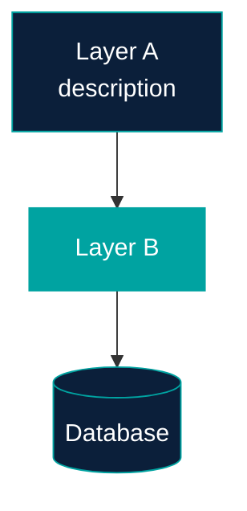
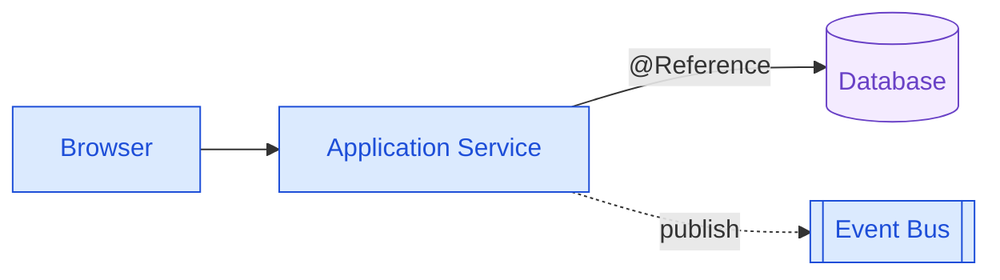
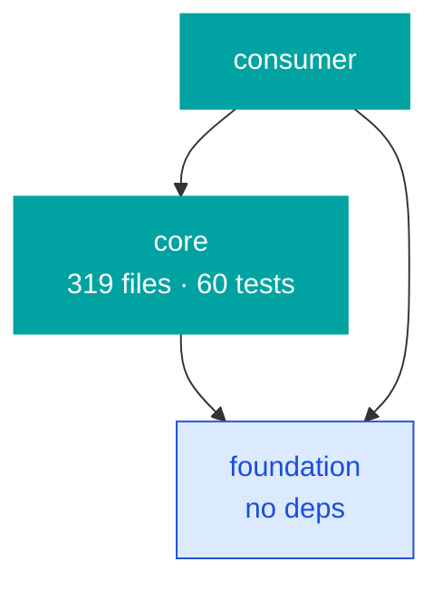
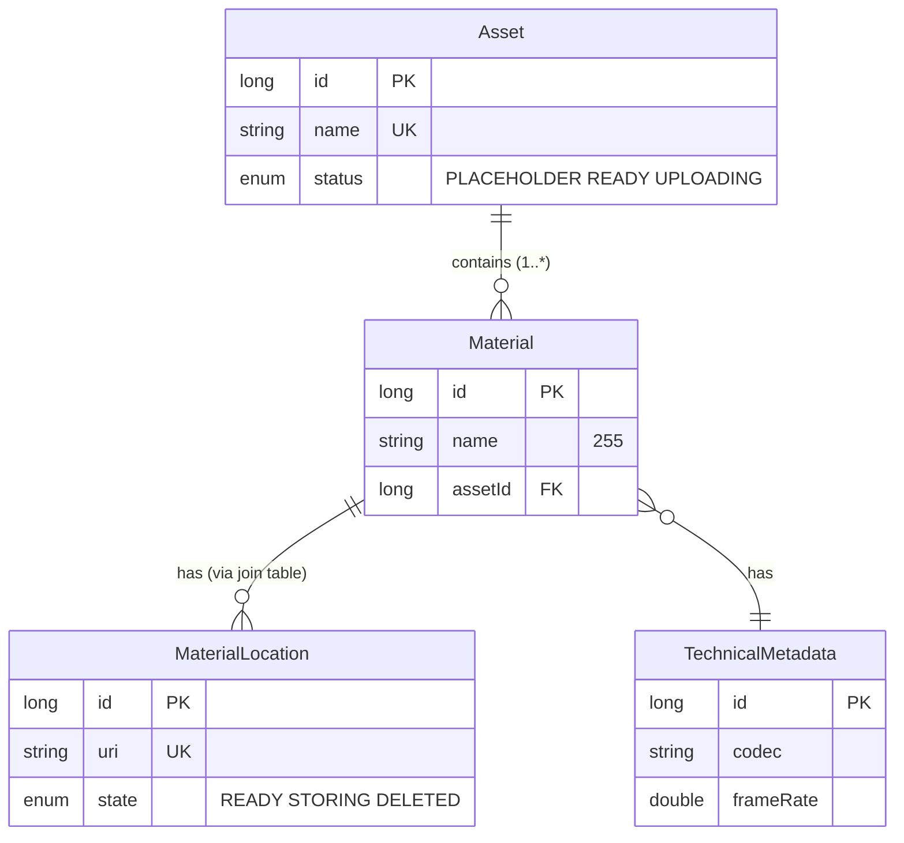
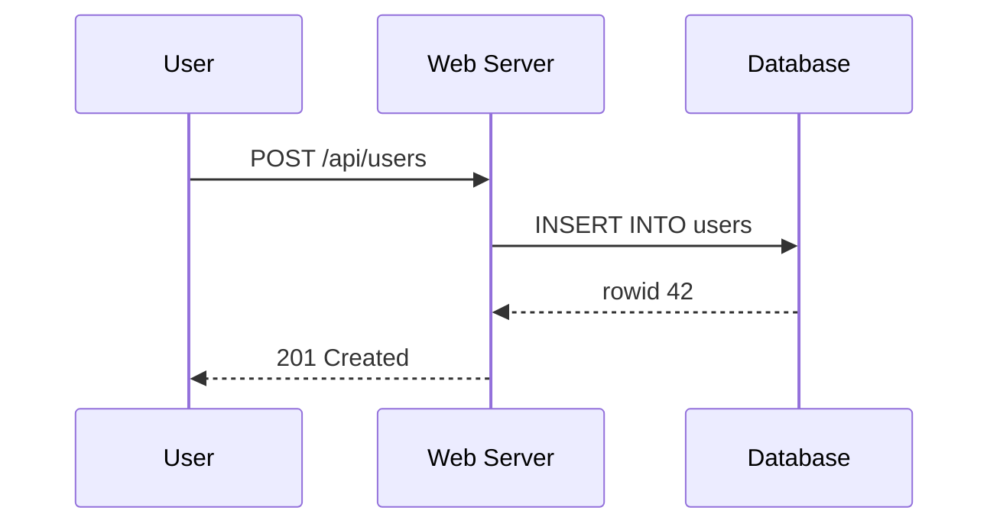
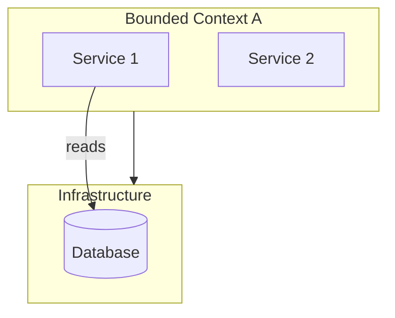

# Mermaid Syntax Reference (for `/aid-summarize`)

One minimal valid example per diagram type, plus a "common failure patterns" table
for the FIX state to use. Mermaid syntax is strict — invalid input renders as a red
error block with no fallback. The skill validates every block via `mermaid.parse()`
before declaring DONE.

---

## Diagram types

### `flowchart TB` (top-to-bottom flowchart)



Use for stack diagrams, layered architectures.

### `flowchart LR` (left-to-right flowchart)



Use for request flows, data flows, integration hubs.

### `graph TD` (top-down dependency graph)



Use for module dependency DAGs, plugin/package graphs.

### `erDiagram` (entity-relationship)



Use for data models. Cardinality syntax:

| Cardinality | Symbol |
|---|---|
| Exactly one | `\|\|` |
| Zero or one | `\|o` or `o\|` |
| Zero or many | `}o` or `o{` |
| One or many | `}\|` or `\|{` |
| Identifying | `--` |
| Non-identifying | `..` |

### `sequenceDiagram`



Use for protocol exchanges, API call sequences.

### `flowchart TD` with subgraphs



Use for grouped flows. Note: subgraph IDs CAN be edge endpoints in modern Mermaid.

---

## Common failure patterns (for FIX state)

When `validate-diagrams.mjs` reports a parse error, look up the symptom here.

| Symptom | Cause | Fix |
|---|---|---|
| `Expecting 'NUM', 'NODE_STRING', got '<'` | HTML-tag-like token in label, e.g. `/api/<userId>/<resource>` | Replace `<word>` with `{word}` or `[word]` |
| `Parse error on line N: ...` near `-.text.->` | Missing spaces around dotted-arrow label | Use `-. text .->` (with spaces) |
| `unrecognized text` after a node line | Continuation arrow with no source: `A --> B\n  --> C` reads `--> C` as orphan | Each edge gets explicit source: `A --> B\nB --> C` |
| `Lexical error ... unrecognized text` containing `"` | Unclosed quote in node label | Find and close the missing `"` |
| `expecting "ATTRIBUTE_NAME"` in erDiagram | Reserved word as type name (rare; e.g. `int` in some versions) | Quote it or rename: `"int" name` or `bigint name` |
| `expected RECTANGLE_START got NODE_STRING` | Used `[(text)]` for cylinder but text contains `[` or `(` | Quote text: `[("text")]` |
| Diagram shows but content is wrong/empty | `htmlLabels: true` rendering text as HTML, unknown elements collapsed | Replace any `<word>` in labels with non-HTML notation |
| Mermaid renders a single dark rectangle in lightbox | `removeAttribute('style')` on cloned SVG strips Mermaid's `max-width` hint | Don't strip style on clone; let wrapper carry chrome (see `lightbox.js`) |
| `Cannot read property 'X' of undefined` in console | Mermaid version mismatch with init config | Re-run `/aid-summarize` so the latest is fetched |

## Hard rules to encode in every diagram

1. **No `<word>` HTML-tag-like tokens.** Only `<b>` and `<br/>` are safe.
2. **Spaces around dotted-arrow labels:** `-. text .->`, not `-.text.->`.
3. **Each edge has explicit source:** prefer `A --> B` and `B --> C` on separate lines
   over `A\n  --> B\n  --> C`.
4. **erDiagram cardinality always paired with quoted label:** `Asset ||--o{ Material : "contains"`.
5. **Use `classDef` consistently:** define classes at the top of each diagram, apply
   to nodes via `Node:::classname`.
6. **Quoted labels** any time the label contains spaces, slashes, parens, dots, or
   special characters: `Node["text with (parens)"]`.

## Color class mapping (matches the design tokens)

Use these standard `classDef` declarations across diagrams for a coherent palette:

```
classDef primary  fill:#0B1F3A,stroke:#00A3A1,color:#fff,stroke-width:2px;
classDef accent   fill:#00A3A1,stroke:#00A3A1,color:#fff,stroke-width:2px;
classDef entry    fill:#DBEAFE,stroke:#1D4ED8,color:#1D4ED8;
classDef service  fill:#E8F5E9,stroke:#2E7D32,color:#2E7D32;
classDef store    fill:#F4EBFF,stroke:#6941C6,color:#6941C6;
classDef warn     fill:#FEF3C7,stroke:#B45309,color:#B45309;
classDef err      fill:#FEE4E2,stroke:#B42318,color:#B42318;
classDef muted    fill:#E3E8EF,stroke:#667085,color:#101828;
```

In dark theme, Mermaid's theme variables (set by `mermaid-init.js`) handle the
overall look — class fills still apply, but text/line colors come from theme.
