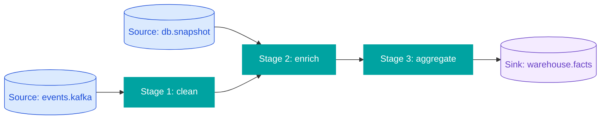

# Section Template — `data-pipeline` Profile

For ETL / streaming / data-pipeline projects. Stage transforms, lineage, and
sources/sinks are central.

## Sections

| # | Title | Featured? | KB Sources |
|---|-------|-----------|------------|
| 1 | At a Glance | | DISCOVERY-STATE.md, project-structure.md |
| 2 | Architecture | ★ | architecture.md |
| 3 | Pipeline DAG | ★ | module-map.md, integration-map.md |
| 4 | Data Schemas | ★ | data-model.md |
| 5 | Sources & Sinks | | integration-map.md |
| 6 | Transforms / Stages | | feature-inventory.md |
| 7 | Schedules & Triggers | | infrastructure.md |
| 8 | Data Quality & Validation | | test-landscape.md, tech-debt.md |
| 9 | Operational Concerns | | security-model.md, tech-debt.md |
| 10 | Build & Deployment | | infrastructure.md |
| 11 | Knowledge Base Index | | INDEX.md |

## Diagrams

| Fig | Type | Subject |
|-----|------|---------|
| 1 | flowchart TB | Stack: sources → ingestion → processing → storage → consumers |
| 2 | flowchart LR (or graph LR) | Pipeline DAG — every transform stage as a node, edges = data flow |
| 3 | erDiagram | Schema lineage (input → intermediate → output schemas) |
| 4 | flowchart LR | Per-stage data flow: input table → transform → output table |
| 5 | sequenceDiagram | Trigger flow (cron / event / webhook → orchestrator → workers) |

## Section content guidance

### §3 Pipeline DAG (FEATURED)
The single most important diagram. Every stage is a node, edges show data
flow. Annotate edges with cardinality (1:1, 1:N), schedule (hourly, on event),
and SLA.

### §4 Data Schemas (FEATURED)
Schemas at each stage:
- **Input schemas:** raw data shapes from sources.
- **Intermediate schemas:** how data is normalized at each stage.
- **Output schemas:** final tables/topics consumers depend on.

Use per-stage ER mini-diagrams or a single comprehensive lineage diagram.

### §5 Sources & Sinks
Two separate tables:
- **Sources:** name, type (S3, Kafka, RDS, etc.), schema, frequency, owner.
- **Sinks:** name, type, downstream consumer, retention, SLA.

### §6 Transforms / Stages
For each transform:
- Stage ID
- Input schema(s)
- Output schema(s)
- Logic summary (one paragraph)
- Idempotency notes
- Error handling (retry policy, DLQ)
- Ownership

### §7 Schedules & Triggers
Cron schedules, event triggers, manual operations. Include a calendar visual
if multiple schedules interleave.

### §8 Data Quality & Validation
Checks performed at each stage. Failure modes. Reconciliation queries. SLAs.

### §9 Operational Concerns
- Backfill procedures
- Replay capabilities
- Audit trail
- PII handling
- Compliance (GDPR, CCPA, SOX) if applicable

## Differences from web-app

- Pipeline DAG (§3) replaces module/plugin DAG.
- Schemas section (§4) is more about "lineage" than "entities".
- "Features" framing → "Transforms" or "Stages".
- Operational concerns get their own section (§9).
- No frontend section.

## Common diagrams content

For Figure 2 (Pipeline DAG), the structure typically looks like:

