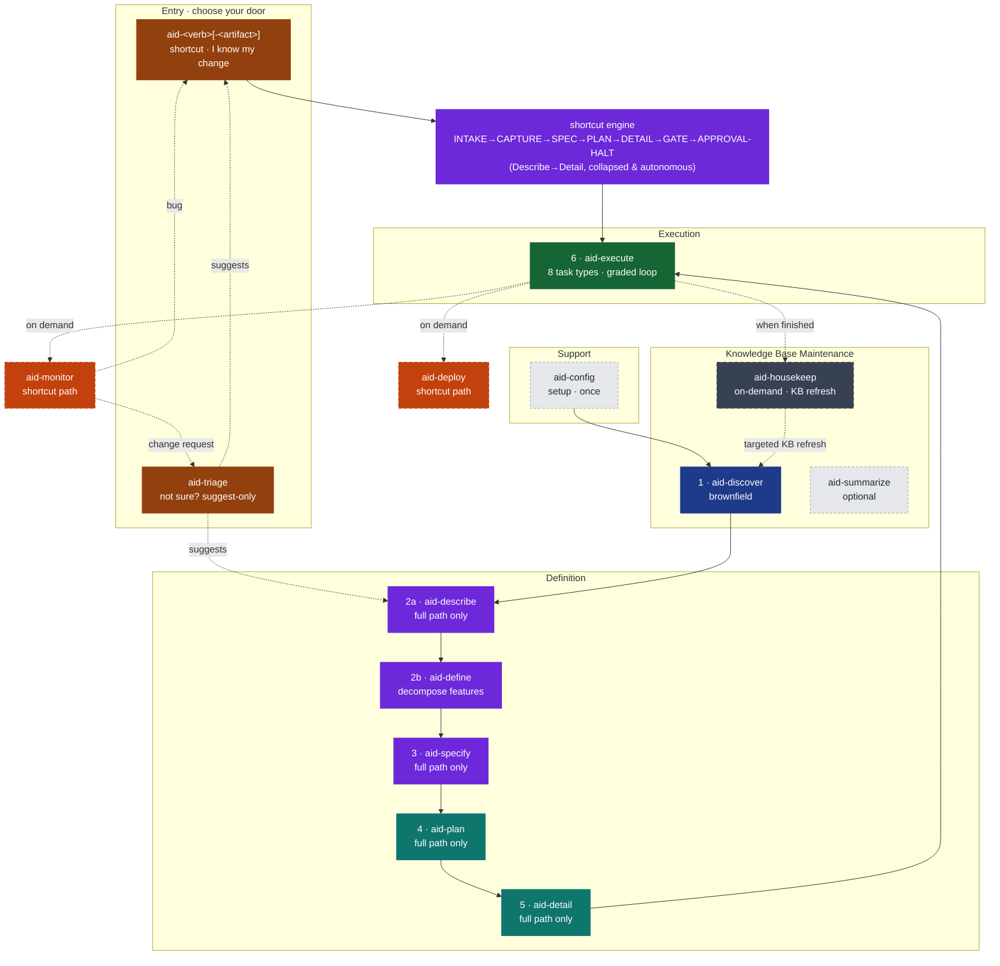
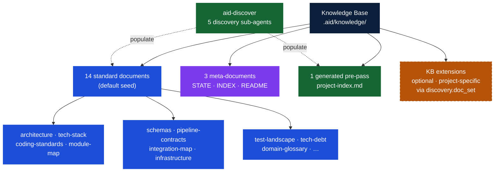
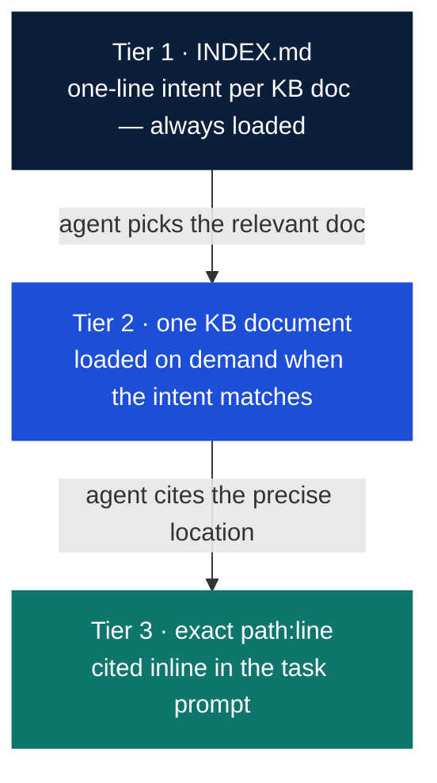
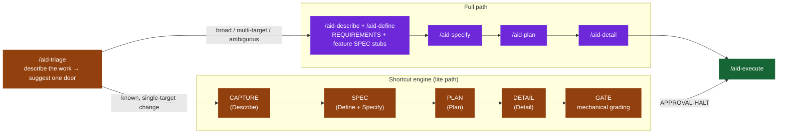
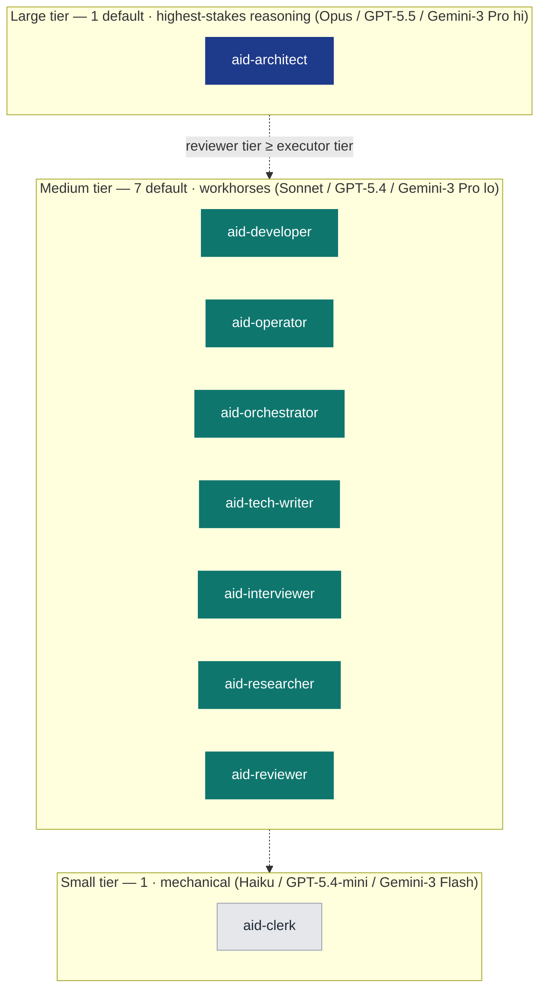
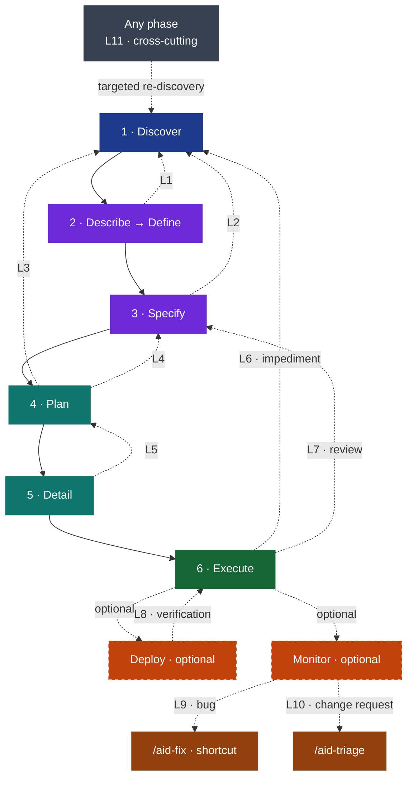
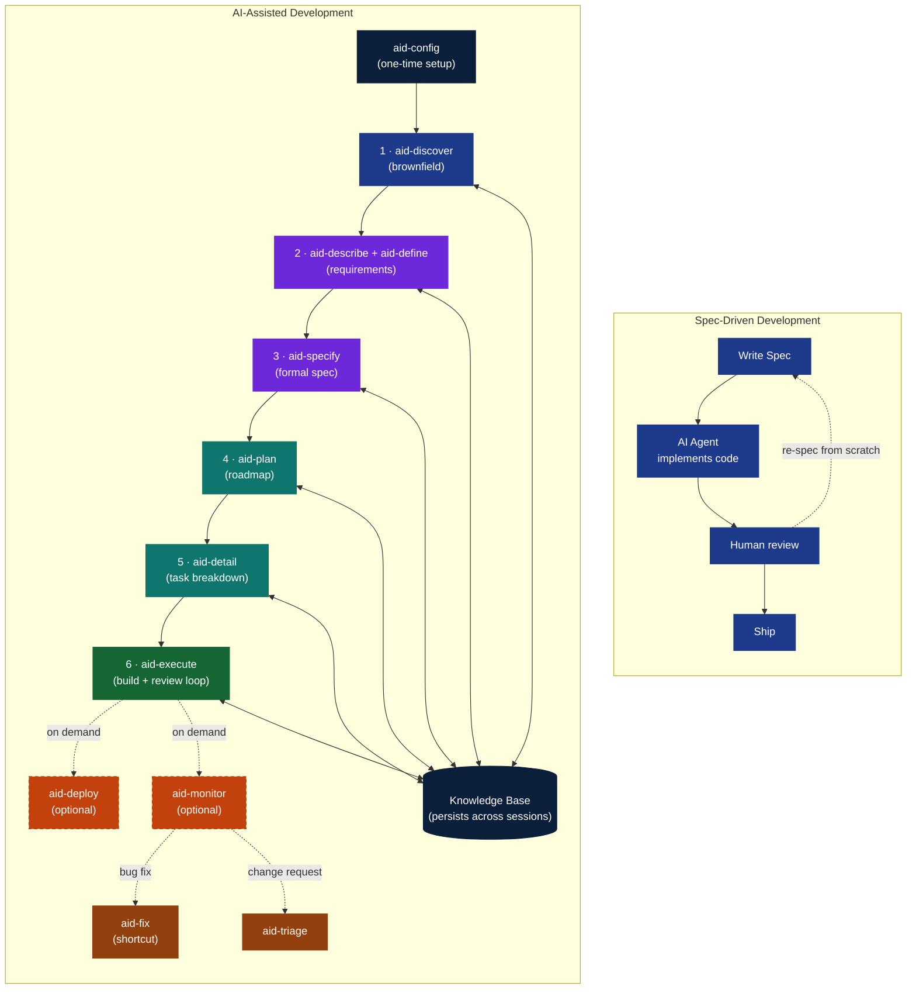

# AID — AI Integrated Development

**A Complete Methodology for AI Integrated Software Development**

*Version 3.2 — June 2026*

---

## Table of Contents

1. [The Pipeline](#1-the-pipeline)
2. [Philosophy](#2-philosophy)
3. [The Knowledge Base](#3-the-knowledge-base)
4. [The Phases](#4-the-phases)
5. [The Agent Model](#5-the-agent-model)
6. [Feedback Loops](#6-feedback-loops)
7. [Artifacts Reference](#7-artifacts-reference)
8. [Case Studies](#8-case-studies)
9. [Comparison with SDD](#9-comparison-with-sdd)
10. [Adoption Guide](#10-adoption-guide)

---

## 1. The Pipeline



*111 skill directories, four skill groups plus a direct-entry shortcut layer. Three doors in: a **shortcut** (`aid-<verb>[-<artifact>]`) when you already know the kind of change; **`/aid-triage`** when you don't — it suggests, never runs, either a shortcut, the full path, or `/aid-ask` when your input is a question rather than a change; or **`/aid-describe`** directly for broad or new-project work. The six numbered phases (Discover through Execute) form the mandatory sequential pipeline for the full path — brownfield enters at Discover, greenfield at Describe (Phase 2a). A shortcut instead drives the shared shortcut engine, which collapses Describe through Detail into one autonomous run and hands off straight to Execute. Deploy and Monitor are optional shortcut paths in the Definition group. `aid-housekeep` is a Knowledge Base Maintenance skill that runs off the pipeline on demand. `/aid-query-kb` (friendly alias: `/aid-ask`) answers project questions on demand and captures knowledge gaps. `/aid-update-kb` applies targeted KB updates through the review gate.*

### The Full Path

Brownfield projects enter at Discover and proceed through every numbered phase: Discover → Describe/Define (2a/2b) → Specify → Plan → Detail → Execute. Each phase is gated — the human approves the output before the next phase begins. The pipeline never auto-advances.

Greenfield projects skip Discover (no existing system to understand) and enter at Describe (Phase 2a). On the full path, `aid-describe` forward-authors a Knowledge Base seed from intent before any code exists — the design documents are the source of truth, and code is built to conform to them.

### Three Doors In

AID does not make you weigh the cost of the full pipeline against the size of a change — that weighing is automated across three entry points:

- **A direct-entry shortcut** (`/aid-fix`, `/aid-create-api`, `/aid-change-cli`, …) — you already know what kind of change this is. 64 verb-first shortcuts, generated from a 94-row catalog, each a thin doorway into a shared **shortcut engine** that collapses Describe → Define → Specify → Plan → Detail into one fast, mostly-autonomous run and produces the full flattened Lite artifact set. Each shortcut binds to one fixed `{verb, artifact}` pair, so the engine already knows the shape of the work before CAPTURE even starts. (The catalog's other 30 rows are hand-authored `repurpose` skills — review, research, report, document, test, prototype, design, and the re-registered `aid-deploy` / `aid-monitor` / `aid-query-kb` / `aid-ask` — each with its own directory but not a thin engine doorway.)
- **`/aid-triage`** — you don't know which door fits. A stateless, write-free, suggest-only router: describe the work in one sentence and it suggests either the matching shortcut, the full path (`/aid-describe`), or — when your input reads as a question rather than a change — `/aid-ask`. It never runs anything on your behalf.
- **`/aid-describe`** — broad, multi-activity, or new-project work. Enters the full path directly; it no longer triages or produces lite work itself.

There's also a non-routing path for when you're not proposing a change at all: **`/aid-ask`** answers a question about the project directly, on demand — the friendly-named alias of the classic `/aid-query-kb` skill (see §1, *Skill Inventory*).

The shortcut path is not a fallback — it is the default entry for the majority of individual tasks. See §4, *The Lite Path: Direct-Entry Shortcuts*, for the shortcut engine's state machine, the family catalog, and the flattened workspace it produces.

### Skill Inventory

*111 skill directories in total — 17 curated pipeline / on-demand / router skills plus the 94-row shortcut catalog's skills (58 canonical names + 36 aliases; 64 engine-generated verb-first shortcut doorways + 30 hand-authored `repurpose` skills). Unchanged: 9 agents, 14 KB doc types.*

**A. The 17 curated skills** — the pipeline phases plus the on-demand and router skills that are *not* in the shortcut catalog; their groups, phase numbers, and mandatory pipeline membership. (`aid-deploy`, `aid-monitor`, and `aid-query-kb` are now catalog `repurpose` rows — see table D.)

| **Skill** | Group | Phase | Mandatory pipeline? |
|-----------|-------|-------|---------------------|
| `aid-config` | Support | — (bootstrap) | Run once before pipeline; not a numbered phase |
| `aid-discover` | Knowledge Base Maintenance | 1 | Mandatory for brownfield; skipped for greenfield |
| `aid-summarize` | Knowledge Base Maintenance | — (optional viewer) | On demand; not a numbered phase |
| `aid-describe` | Definition | 2a | Yes — full path only; no longer triages or produces lite work |
| `aid-define` | Definition | 2b | Full path only — decompose approved requirements into features |
| `aid-specify` | Definition | 3 | Full path only |
| `aid-plan` | Definition | 4 | Full path only |
| `aid-detail` | Definition | 5 | Full path only |
| `aid-execute` | Execution | 6 | Yes |
| `aid-housekeep` | Knowledge Base Maintenance | — | On demand; off the numbered pipeline |
| `aid-update-kb` | Knowledge Base Maintenance | — | On demand; targeted KB update through review gate; human-gated |
| `aid-set-connector` | Support | — | On demand; create or update a connector descriptor for an external tool |
| `aid-unset-connector` | Support | — | On demand; remove a connector descriptor and purge its secret |
| `aid-read-ticket` | Support | — | On demand; non-destructive fetch and display of one ticket via the connector-resolution ladder |
| `aid-create-ticket` | Support | — | On demand; preview + confirm before filing a new ticket via the connector-resolution ladder |
| `aid-update-ticket` | Support | — | On demand; preview + confirm before mutating one part (description/comment/status) of an existing ticket |
| `aid-triage` | Definition | — (router) | On demand; stateless suggest-only router — writes nothing |

**B. `/aid-triage`** — the suggest-only router. Not a pipeline phase and not a shortcut itself: one stateless skill (`INTAKE → CLASSIFY → SUGGEST → HALT`) that reads the shortcut catalog and points at a shortcut, the full path, or — when the input reads as a question rather than a change — `/aid-ask` (below). It writes nothing — no interview, no scaffold, no work folder, no `STATE.md`.

**C. `/aid-ask`** — a friendly-named alias of `/aid-query-kb`. Both are `repurpose` rows in the shortcut catalog (table D below): the same read-only, cited, gap-capturing Q&A skill, under a name that reads as a question — reachable directly, or suggested by `/aid-triage` when your input reads as a question rather than a change. Hand-authored, not generated by the shortcut build helper.

**D. The 94 shortcut-catalog skills**, by family. The catalog (`canonical/aid/templates/shortcut-catalog.yml`) has 94 rows = 58 canonical names + 36 aliases. 64 rows are the verb-first thin doorways the build helper (`build-shortcut-skills.py`) generates as `canonical/skills/<name>/SKILL.md` directories; the other 30 rows are `repurpose: true` — hand-authored skills the helper never generates or overwrites, each of which owns its own directory too. Those 30 are the 4 re-registered classic skills (`aid-deploy`, `aid-monitor`, `aid-query-kb`, `aid-ask`) plus 26 work-005 collapse & kind-sibling skills (review/audit, research/investigate/spike, report, prototype/prototype-ui, design, the document family, and the `aid-test` run-siblings). Every one of the 94 rows owns a `canonical/skills/<name>/` directory.

| **Family** | **Skills** | **Count** |
|-----------|---------------|-----------|
| create (+ `add` alias) | `aid-create`, `aid-create-api`, `-cli`, `-config`, `-data-model`, `-data-pipeline`, `-infra`, `-integration`, `-job`, `-messaging`, `-theme`, `-ui`; `aid-add-*` mirrors each | 24 |
| change (+ `update` alias) | `aid-change`, `aid-change-api`, `-cli`, `-config`, `-data-model`, `-data-pipeline`, `-infra`, `-integration`, `-job`, `-messaging`, `-theme`, `-ui`; `aid-update-*` mirrors each | 24 |
| fix | `aid-fix` | 1 |
| refactor | `aid-refactor` | 1 |
| remove (+ `delete` alias) | `aid-remove`; `aid-delete` mirrors it | 2 |
| deprecate | `aid-deprecate` | 1 |
| migrate | `aid-migrate` | 1 |
| test + experiment | `aid-create-test` / `aid-change-test` (+ `add`/`update-test` aliases); `aid-test` (+ `-security` / `-performance` / `-data-quality` run-siblings, `repurpose`); `aid-experiment` | 9 |
| prototype + design | `aid-prototype`, `aid-prototype-ui`, `aid-design` (`repurpose`) | 3 |
| document | `aid-create-document` / `aid-change-document` (+ `add`/`update-document` aliases); `aid-create-diagram`; `aid-document` (+ 7 genre siblings: `-decision`, `-architecture`, `-guideline`, `-standard`, `-runbook`, `-tutorial`, `-changelog`) — all `repurpose` | 13 |
| report + dashboard | `aid-report` (`repurpose`); `aid-create-dashboard` / `aid-change-dashboard` (+ `add`/`update`/`show-dashboard` aliases) | 6 |
| review (+ `audit` alias) | `aid-review`; `aid-audit` mirrors it (both `repurpose`) | 2 |
| research (+ `investigate`/`spike` aliases) | `aid-research`; `aid-investigate` and `aid-spike` mirror it (all `repurpose`) | 3 |
| deploy + monitor (`repurpose`) | `aid-deploy`, `aid-monitor` | 2 |
| query (+ `ask` alias, `repurpose`) | `aid-query-kb`; `aid-ask` mirrors it | 2 |
| **Total** | | **94** |

---

## 2. Philosophy

### Waterfall + AI — and That Is the Point

Understand → Specify → Plan → Build → Verify → Ship.

This is the Waterfall sequence. AID embraces it deliberately.

Waterfall failed not because the sequence was wrong, but because humans couldn't execute it fast enough to afford iteration. When discovery takes weeks and specs take days, going back to fix a wrong assumption costs a sprint. Teams learned to skip forward, hack around problems, and call it "agile."

AI changes the economics:

- **Discovery** that took weeks takes hours. An agent can scan a 21 GB codebase, map its architecture, catalog its conventions, and produce a structured Knowledge Base in a single session.
- **Specification** that took days takes minutes. With a Knowledge Base as context, generating a grounded spec is a single prompt, not a week of meetings.
- **Iteration is cheap.** Feedback loops cost tokens, not sprints. Going back to Discovery to fill a knowledge gap costs pennies, not calendar weeks.
- **Documents don't rot.** The same agents that write code maintain the Knowledge Base and specs. Keeping them current is nearly free when the overhead is tokens rather than meeting time.

Agile was the right answer to Waterfall's execution problem. AI is the right answer to Agile's rigor problem. AID is Waterfall with AI execution and formal feedback loops — the methodology that finally works because the bottleneck shifted from "humans are slow" to "humans set direction."

This is not anti-Agile. Sprints, backlogs, and retrospectives can coexist with AID phases. What AID replaces is the *missing structure* inside Agile iterations — the skip from "good idea" straight to implementation because discovery and specification felt too slow to be worth doing.

### The Iron Man Model: Human-in-the-Middle


*The Iron Man Model. Every design phase on the full path follows the same loop: AI proposes (grounded in KB and codebase), human and AI discuss, AI writes, AI reviews — and the loop repeats until the output meets the bar. Human approves advancement. Human never leaves the cockpit.*

Every phase is co-executed by human and AI. Not "AI executes, human rubber-stamps." Not "human does the thinking, AI does the typing." The human and AI work together within each phase, with the AI amplifying the human's capabilities.

**Between phases, the human gives the OK to advance.** The pipeline never auto-advances. The human reviews the phase output, decides whether it is good enough, and greenlights the next phase. This is the checkpoint that keeps the human in control without slowing the work to human speed.

**A note on universality.** The Propose → Discuss → Write → Review loop is universal across the full path — Specify, Plan, Detail, and Execute each follow it. The lite path is different: a direct-entry shortcut runs the shared shortcut engine's CAPTURE/SPEC/PLAN/DETAIL states without a per-state human checkpoint — the only interactive moments are a rare CAPTURE gap-question and the terminal approval halt — then GATE grades every document mechanically before that halt. The Iron Man loop shapes every full-path phase; the lite path is a faster, narrower, mostly-autonomous variant designed for proportionate scope, with quality enforced once, mechanically, rather than at every step.

### Three Core Principles

**1. Knowledge Before Specification**

Every methodology tells you to "write good specs." None tells you how to understand a system well enough to write them. AID does. The Discovery phase produces a Knowledge Base — a structured collection of documents covering architecture, conventions, data models, integrations, tech debt, and domain language. The spec is then written *against* this knowledge, not from imagination.

The contrast with greenfield projects is instructive. On greenfield, you skip Discovery — there is no existing system to understand. But understanding still precedes specification. `aid-describe`'s DESCRIBE-SEED state forward-authors a five-element Knowledge Base seed from intent — domain language, intended architecture, conventions, technology stack, and key decisions — before a single line of code exists. This inverts the brownfield direction: the design documents are the source of truth (stamped `source: forward-authored`), and the code is built to conform to them. When code later exists, `aid-housekeep`'s conformance lane checks for divergence and surfaces any gap for human reconciliation, never overwriting the design automatically.

**2. Specs Are Living Documents**

A spec written before implementation is a hypothesis. A spec revised after implementation is knowledge. AID treats specs as living artifacts with formal revision protocols. Every change is tracked, justified, and approved. This is not chaos — it is controlled evolution with a full audit trail.

This matters enormously in brownfield projects. The codebase was built by people who are no longer here, against requirements that have since changed, using patterns that were conventional five years ago. Any spec you write will be partially wrong. The question is not whether you will revise — it is whether you will do so formally (with a traceable revision history) or informally (with silent workarounds and hidden debt).

**3. Feedback Over Forward-Only**

The pipeline is sequential by default, but any phase can trigger upstream revision through structured protocols. Discovery can be re-entered from any phase. Specs can be revised during planning. Tasks can be amended during implementation. The revision trail provides audit transparency while keeping the project moving.

AID defines eleven named feedback loops (see §6). The loops are not a failure mode — they are the design. The pipeline is sequential because that is the right default; the loops are formal because reality is not sequential.

### What AID Removes

Hand a capable coding agent a vague task and a large repository, and you get predictable failure modes. AID removes each one structurally — through process, not prompt-tuning.

| **Failure mode** | What it looks like | How AID removes it |
|------------------|--------------------|---------------------|
| **Knowledge gaps** | The agent doesn't understand the existing system and invents how it works. | Discovery builds the Knowledge Base *before* any spec is written. Understanding precedes specification. |
| **Hallucination** | The agent states things about the code that aren't true. | Every KB claim carries an inline `path:line` citation — facts are anchored to source, not guessed. |
| **Drift** | The implementation quietly diverges from intent; the spec rots. | Spec-as-hypothesis plus eleven formal feedback loops — upstream artifacts are revised with a traceable history, never silently worked around. |
| **Overengineering** | The agent adds abstractions, options, and scope nobody asked for. | Typed, PR-sized tasks with explicit acceptance criteria; the reviewer grades against the spec, not against taste. |
| **Oversights** | Bugs, missed edge cases, and untested paths slip through. | A separate adversarial reviewer — the agent that writes never grades its own work — loops until the grade clears the bar. |
| **Context exhaustion** | Loading the whole repository into the context window — slow, costly, lossy. | A 3-tier context economy (see §3, *Context Feeding Strategy*): an always-loaded index, then one KB document on demand, then an exact `path:line`. |

### Honest Assessment

AID is not a silver bullet. It is a deliberate trade-off.

| **AID wins** | **AID is heavier** |
|-------------|---------------------|
| Brownfield projects with accumulated complexity and missing documentation | Pure greenfield MVPs where the risk of knowledge gaps is low and the cost of discovery is real |
| Regulated environments where audit trails and traceability are requirements, not niceties | Teams with deep existing knowledge of the codebase who would be documenting what they already know |
| Long-running projects where institutional memory loss is a real cost | When "move fast and break things" is the genuine strategy and its costs are accepted |
| Teams new to AI-assisted development who need process guardrails to avoid the failure modes listed above | — |
| Situations where "move fast and break things" has already produced a pile of broken things | — |

**The routing insight:** AID does not make you weigh the cost of its full pipeline against the value of a change. That weighing is automated across three doors. Small, well-scoped work goes straight through a direct-entry shortcut into the shortcut engine. Broad or ambiguous work goes to `/aid-describe` and the full pipeline. Not sure which? `/aid-triage` looks at a one-sentence description and tells you — it suggests, it never runs anything itself. You don't configure this; you name the change, or describe it, and the methodology routes you.

**The honest cost:** AID adds process on the full path. Discovery takes time. Describe → Define takes time. Specify, Plan, and Detail add overhead before a single line of code is written. The payoff is that what gets written is the *right* code, grounded in real understanding, with a spec that won't surprise you mid-implementation. The cost is real; so is the payoff. For small work, a direct-entry shortcut keeps the cost commensurate with scope.

---

## 3. The Knowledge Base



*The Knowledge Base is the gravitational center of the entire methodology. Every phase reads from it. Any phase can trigger updates to it.*

The Knowledge Base (`.aid/knowledge/`) is institutional memory — it outlives any individual session, sprint, or team member.

### Structure

The Knowledge Base is divided into four categories: **standard** documents (the 14-document default seed), **meta** documents (INDEX, STATE, README — navigation and tracking), a **generated** pre-pass artifact (`project-index.md` in `.aid/generated/`), and optional **extensions** declared via `discovery.doc_set` in `.aid/settings.yml`. The diagram below shows these relationships.

### The Declared Doc-Set

The 14-document standard set is the **configurable default seed** — the set synthesized from `canonical/aid/templates/knowledge-base/` when no project-specific override is configured. The doc-set is **project-configurable** via `discovery.doc_set` in `.aid/settings.yml`.

Before dispatching discovery sub-agents, the GENERATE state runs a **propose→confirm checkpoint** (Step 0d): the orchestrator infers a proposed doc-set from the project's file inventory (as a diff against the default seed) and presents it to the user for confirmation or editing. Custom documents can be added; irrelevant standard ones can be dropped. The confirmed set is written to `.aid/settings.yml` and drives all subsequent discovery dispatches.

In practice: a simple CLI tool needs a handful of documents at depth; the rest stay thin. An enterprise monorepo fills all 14 and adds custom extensions. A greenfield project populates `technology-stack.md`, `coding-standards.md`, and `domain-glossary.md` from the interview and leaves the rest to grow. The shape is fixed even when a document is sparse, so the index and navigation remain consistent.

<details>
<summary>Full 14-document default seed listing</summary>

```
.aid/knowledge/
├── INDEX.md               # Meta: 2-3 line summary of every KB document (the navigation map)
├── README.md              # Meta: completeness status per document
├── STATE.md               # Meta: discovery-area state — grade, Q&A entries, review & summarization history
├── project-index.md       # Generated: a file-inventory pre-pass for the discovery sub-agents
│
├── project-structure.md   # Repository layout and file inventory
├── external-sources.md    # Vendor docs and references registered for discovery
├── architecture.md        # Patterns, layers, module boundaries, data flow
├── technology-stack.md    # Languages, frameworks, versions, build tools, runtime
├── module-map.md          # Every module: purpose, dependencies, size, test coverage
├── coding-standards.md    # Naming conventions, formatting, error handling patterns
├── schemas.md             # Database schema, entities, relationships, migrations
├── pipeline-contracts.md  # Pipelines/APIs consumed and exposed: auth models, rate limits
├── integration-map.md     # Message queues, caches, third-party services, webhooks
├── domain-glossary.md     # Business terms, domain language, entity definitions
├── test-landscape.md      # Test frameworks, coverage, test types, CI/CD pipeline
├── tech-debt.md           # Known debt items with file refs, risk ratings, remediation
├── infrastructure.md      # Hosting, networking, environments, deployment model
└── feature-inventory.md   # Canonical feature list, mapped to modules/endpoints/data
```

</details>

The fixed shape has a purpose: downstream skills always know exactly where to look. `schemas.md` always holds schemas. `tech-debt.md` always holds debt. Convention beats search.

### Completeness Is Tracked

The `README.md` at the root of the Knowledge Base tracks what exists and what is missing:

```markdown
# Knowledge Base — {Project Name}

| Document | Status | Last Updated | Source |
|----------|--------|-------------|--------|
| architecture.md | ✅ Complete | Mar 16 | aid-discover |
| coding-standards.md | ⚠️ Partial | Mar 16 | aid-discover (inferred) |
| domain-glossary.md | ❌ Missing | — | Needs interview |
| tech-debt.md | ❌ Missing | — | Needs interview |
```

Partial and missing documents are not failure states — they are the honest acknowledgment of what isn't known yet. A partial `coding-standards.md` is better than a confident but wrong one. The KB grows as understanding accumulates.

### Context Feeding Strategy — RAG by Convention

The Knowledge Base is the project's memory. But memory only works if agents know where to look.

A common failure mode: an agent receives a task spec and the project spec, implements something technically correct — and violates a convention documented in `coding-standards.md` that it never saw. The agent didn't know the document existed. The fix goes through review, gets rejected, comes back, gets redone. Waste.

**AID solves this with the KB Index — a lightweight map of the entire Knowledge Base.**

`aid-config` creates `.aid/knowledge/INDEX.md` at setup with placeholder rows; Discovery regenerates it with real content as its final step (and on the greenfield path, which skips Discovery, `aid-describe` updates it where applicable). This file contains a 2-3 line summary of each KB document — what it covers, when to consult it. It costs almost nothing to include in an agent's context, but it gives the agent the ability to self-serve.

```markdown
# Knowledge Base Index — {Project Name}

Use this index to find the right document before making assumptions.
If your task touches an area covered here, read the relevant document first.

| Document | Summary |
|----------|---------|
| architecture.md | MVVM + Clean Architecture layers. Service registration in ServiceCollectionExtensions.cs. Navigation via INavigationService. |
| coding-standards.md | PascalCase for public, _camelCase for fields. Result<T> for error handling. No exceptions for flow control. Async suffix on all async methods. |
| schemas.md | SQLite via EF Core. 8 entities. Soft deletes on Recording and Transcript. Migrations in /Migrations. |
| module-map.md | 12 modules. Core (services), UI (views/viewmodels), Infrastructure (data access), Tests. Module dependency diagram. |
| ... | ... |
```

**The feeding protocol:**

1. **Every task receives `INDEX.md`.** Always. It is the map. Cost: approximately 200–500 tokens. Value: the agent knows where to look.
2. **The orchestrator selects 2–4 relevant KB docs** based on the task's domain (data work → `schemas.md`, pipeline/API work → `pipeline-contracts.md`).
3. **The task template includes a search instruction:** "If you need context not provided, consult `.aid/knowledge/INDEX.md` and read the relevant document before making assumptions."
4. **Review validates context usage.** One review criterion: did the agent use available KB context, or did it guess?

This is **RAG by convention** — not embeddings and vector databases, but predictable file structure and an index that agents navigate. Retrieval happens in three tiers, cheapest first:



1. **Tier 1 — `INDEX.md`, always loaded.** Every task prompt carries the index (~200–500 tokens total). The agent always knows *what knowledge exists and which file holds it*, at negligible context cost.
2. **Tier 2 — one KB document, on demand.** From an INDEX entry the agent reads the single document a task needs. The fixed-shape directory makes this deterministic — `schemas.md` always holds schemas, `tech-debt.md` always holds debt — so the agent navigates by convention, never by search.
3. **Tier 3 — an exact repository location, via citation.** Every factual claim in a KB document carries an inline `path:line` citation. From a KB doc the agent jumps straight to the precise file and line — never globbing, never bulk-loading unrelated source.

The agent pays a few hundred tokens to know where everything is, then spends its context budget only on the one document and the specific lines a task genuinely needs.

**Why not a vector database?** Because the KB is small enough (14 standard documents, each a short markdown file) that convention beats infrastructure. The bottleneck is not retrieval speed — it is knowing what exists. The INDEX solves that at a fraction of the operational complexity.

**When does the INDEX update?** `aid-config` seeds it at setup; thereafter it is regenerated every time Discovery runs (full or targeted), and `aid-describe` updates it where applicable as requirements evolve. It is always rebuilt from the current state of the KB — never manually maintained.

### The KB Outlives the Project

The Knowledge Base is institutional memory. It outlives any individual session, sprint, or developer. When a new team member joins — human or AI — they read the KB and have the project's full context. When a feature request arrives six months later, the KB tells you what the system looks like now, not what the spec said it should look like.

This is the third conviction underlying AID: the Knowledge Base is the gravitational center. Not the spec. Not the code. The accumulated understanding of the project — architecture, conventions, domain language, tech debt — persists across phases, sprints, and team changes. The code is the output. The KB is the understanding that produces it.

---

## 4. The Phases

*The skill-to-phase mapping in one scan, before the deep-dives.*

| **Skill** | Group | Phase | Output |
|-----------|-------|-------|--------|
| `aid-config` | Support | — (bootstrap) | `.aid/` scaffold · KB placeholders (14 templates + meta) · context file · `STATE.md` seeds |
| `aid-discover` | Knowledge Base Maintenance | 1 | 14-document Knowledge Base · `project-index.md` pre-pass · `STATE.md` discovery grade/Q&A |
| `aid-summarize` | Knowledge Base Maintenance | — (optional viewer) | `knowledge-summary.html` — offline KB viewer |
| `aid-describe` | Definition | 2a | `REQUIREMENTS.md` — full path only |
| `aid-define` | Definition | 2b | Per-feature `SPEC.md` stubs + feature decomposition (full path only) |
| `aid-specify` | Definition | 3 | Technical spec added to each feature's `SPEC.md` |
| `aid-plan` | Definition | 4 | `PLAN.md` + per-delivery `deliveries/delivery-NNN/BLUEPRINT.md` + `STATE.md` |
| `aid-detail` | Definition | 5 | Typed, PR-sized `deliveries/delivery-NNN/tasks/task-NNN/DETAIL.md` files + execution graph |
| `aid-execute` | Execution | 6 | Implemented + reviewed code to grade ≥ minimum; 8 task types |
| `aid-deploy` | Definition (shortcut path) | — (optional) | Release package · `package-NNN.md` · `DEPLOYMENT-STATE.md` |
| `aid-monitor` | Definition (shortcut path) | — (optional) | classified findings → `/aid-fix` (bugs) or `/aid-triage` (change requests); observation log kept in-memory (persistent `MONITOR-STATE.md` deferred) |
| `aid-housekeep` | Knowledge Base Maintenance | — | KB-DELTA refresh · SUMMARY-DELTA · workspace CLEANUP |
| `aid-triage` | Definition | — | A suggested next command (shortcut, `/aid-describe`, or `/aid-ask` for a plain question); writes nothing |
| `aid-<verb>[-<artifact>]` (64 shortcuts) | Definition | — | Full flattened artifact set (`REQUIREMENTS.md`, `SPEC.md`, `PLAN.md`, `BLUEPRINT.md`, `tasks/task-NNN/DETAIL.md`) via the shared shortcut engine |

AID organizes its skills into four groups — **Support**, **Knowledge Base Maintenance**, **Definition**, and **Execution**. Groups are a non-sequential way to organize the skills, not a running order. The six numbered development phases (Discover through Execute) still form the mandatory sequential pipeline: Discover sits in Knowledge Base Maintenance, Describe through Detail sit in Definition, and Execute is the sole Execution skill. `aid-deploy` and `aid-monitor` are **optional** shortcut paths in the Definition group, invoked on demand rather than as required phases. The pipeline is linear with feedback loops.

`aid-config` (bootstrap, run once) is the sole **Support** skill. **Knowledge Base Maintenance** additionally holds the on-demand KB skills: `aid-summarize` (optional KB viewer), `aid-housekeep` (KB drift maintenance between discovery cycles), `aid-update-kb` (targeted KB updates through the review gate), and `aid-query-kb`/`aid-ask` (Q&A). None of these are numbered phases; they do not participate in phase gates. `/aid-triage` — a stateless suggest-only router that also recognizes a plain question and points it at `/aid-ask` — and the 64 direct-entry shortcuts belong to the **Definition** group; each shortcut is a thin doorway into the shared shortcut engine that collapses Describe through Detail into one autonomous run. See below, *The Lite Path: Direct-Entry Shortcuts*, for the deep dive.

---

### Support

*Set up the workspace, once, before the pipeline begins.*

---

#### `aid-config` — Bootstrap (not a numbered phase)

**Purpose:** Initialize the AID workspace. Run once per project before the pipeline begins.

`aid-config` collects project metadata (greenfield or brownfield, project name, description, minimum grade threshold), scaffolds `.aid/knowledge/` with the KB document templates (14 standard templates from the default seed plus the meta-documents), creates the host-tool context file (`CLAUDE.md` for Claude Code; `AGENTS.md` for Codex, Cursor, Copilot CLI, and Antigravity), and asks whether the `.aid/` workspace should be committed to Git.

The scaffold is the blank canvas. After `aid-config`, the KB directory exists with empty placeholders; Discovery fills it.

---

### Knowledge Base Maintenance

*Build and keep current the team's understanding of the existing system.*

This group's deep-dives below cover Discover (Phase 1) and `aid-summarize`. `aid-housekeep` (deep-dive further down, under *Off-Pipeline*), `aid-update-kb`, and `aid-query-kb`/`aid-ask` also belong to this group — see §1, *Skill Inventory*, table A, for their group membership and table B/C for `aid-query-kb`/`aid-ask` detail.

---

#### Phase 1: Discover (`aid-discover`)

**Purpose:** Understand the existing system. Produce the Knowledge Base.

**When to skip:** Pure greenfield projects with no existing code. Describe and Specify populate a minimal KB instead.

**When to re-enter:** Any downstream phase finds the KB wrong or incomplete. Re-entry is always *targeted* — fill the specific gap, not redo full discovery.

> [!WARNING]
> Skipping Discovery on a brownfield project means agents will work without understanding the existing architecture. The result is technically plausible but architecturally wrong code. The 40-minute Discovery investment eliminates hours of review-reject-redo cycles.

**Why this phase exists:** Every other methodology skips it. They assume you already understand the system well enough to write requirements. In brownfield projects — the overwhelming majority of enterprise software work — this assumption is wrong. The developer who built the system is gone; the documentation is stale; the architecture has drifted from whatever was originally designed. Dropping an AI agent into this without a KB produces hallucination: technically plausible but architecturally wrong code. Discovery is the fix.

**Process:**

Discover runs as a state machine: ELICIT → GENERATE → REVIEW → Q-AND-A → FIX → APPROVAL → DONE. One invocation per state. No auto-advance.

The **ELICIT** state runs first and captures the project's external sources and tool integrations before GENERATE runs. The GENERATE state then opens with a fast deterministic **pre-pass** that writes `.aid/generated/project-index.md` — a shared file inventory that all discovery sub-agents read instead of re-scanning the repository independently. This eliminates redundant I/O and ensures sub-agents work from a consistent snapshot.

Before dispatching sub-agents, Discover runs the **declared doc-set propose→confirm** (Step 0d, described in §3). The confirmed doc-set drives which agents are dispatched and what filenames they produce.

Discover then dispatches its sub-agents:

- **`aid-researcher`** (pre-scan, alone, sequential): Writes `project-structure.md` and `external-sources.md` from the project index.
- **`aid-researcher` instances** (in parallel, one per confirmed doc-set scope): Cover the remaining KB documents. Each instance's target list is drawn from the confirmed doc-set; an instance is not dispatched if its target list is empty. This pool of `aid-researcher` instances replaces the former five separate discovery-* agents (discovery-scout, discovery-architect, discovery-analyst, discovery-integrator, discovery-quality).
- **`aid-reviewer`** (after generation): Grades the result adversarially against the universal rubric. KB-doc review is a dispatch parameter — the generation agents never grade their own work.

Across the run, discovery covers:

1. **Structure scan** — Detect project type, map folder layout, list modules/packages.
2. **Architecture analysis** — Identify patterns, layers, boundaries, data flow.
3. **Stack inventory** — Languages, frameworks, versions, build tools, runtime.
4. **Convention mining** — Naming patterns, error handling, logging, config management (inferred from code).
5. **Module mapping** — Every module: purpose, dependencies, size, test coverage.
6. **Data model extraction** — Schema, entities, relationships, migrations.
7. **Integration surface** — External APIs, message queues, caches, third-party services.
8. **Test landscape** — Frameworks, coverage metrics, test types, CI/CD pipeline.
9. **Tech debt audit** — Large files, circular dependencies, missing tests, outdated packages.
10. **Gap identification** — What couldn't be determined from code alone → feeds into Describe.
11. **INDEX generation** — The orchestrator assembles `.aid/knowledge/INDEX.md` with a 2-3 line summary of every KB document produced.

**Output:** `.aid/knowledge/` — all documents in the confirmed doc-set, the generated `project-index.md` pre-pass, the `INDEX.md` and `README.md` meta-documents, and the grade and Q&A recorded into the discovery-area `STATE.md` (at `.aid/knowledge/STATE.md`). `feature-inventory.md` is scaffolded during the run and completed later in the Q&A → FIX cycle.

---

#### `aid-summarize` — Optional KB Viewer (not a numbered phase)

**Purpose:** Generate a single self-contained `knowledge-summary.html` from the approved Knowledge Base.

`aid-summarize` is an optional, read-only skill that produces an offline HTML viewer of the KB — light/dark theme, WCAG-AA accessible, with Mermaid diagrams rendered inline. It is idempotent: re-running it on an unchanged KB is a no-op. Run it after Discovery approval when you want a portable, shareable view of the project's understanding.

---

### Definition

*Gather requirements, specify the technical approach, sequence the roadmap, and decompose into executable tasks.*

---

#### Phase 2: Describe → Define (`aid-describe` → `aid-define`)

**Purpose:** Gather requirements and decompose them into features. Full path only. For a small, well-scoped change, use a direct-entry shortcut instead — see *The Lite Path: Direct-Entry Shortcuts*, right after Specify below — or run `/aid-triage` if you're not sure which door fits.

##### Full Path

**Full-path workspace:** Each interview creates a *work* — a self-contained unit of scope inside `.aid/`:

```
.aid/
  knowledge/                    ← shared KB (from Discovery)
  works/
    work-001-user-auth/           ← one work per interview
      STATE.md                    ← work-area state — process tracking (section status, Q&A, grade)
      REQUIREMENTS.md             ← product (stakeholder requirements)
      features/
        feature-001-login/
          SPEC.md                 ← feature definition — requirements side (Describe) + tech spec (Specify)
        feature-002-password-reset/
          SPEC.md
      deliveries/
        delivery-001/
          BLUEPRINT.md             ← delivery definition (from Plan)
          STATE.md                 ← delivery lifecycle
          tasks/
            task-001/
              DETAIL.md             ← task definition (from Detail)
              STATE.md              ← task lifecycle
```

Multiple works can coexist — a client requests auth now, reporting later. Each work has its own requirements and features, sharing the same KB.

**Full-path process (seven states):**

**States 1–4: The conversational interview.** One question at a time — starting broad (Objective, Problem Statement) and getting specific (Constraints, Acceptance Criteria). State 1 opens the interview and State 3 continues it; **State 2** is a Q&A mode that resolves pending questions raised by a downstream-phase loopback, a cross-reference pass, or review findings; **State 4** is the completion-and-approval gate that finalizes REQUIREMENTS.md.

**The elicitation engine.** The interview is driven by a seasoned-analyst elicitation engine, not a fixed questionnaire. It opens with a single fixed D1 turn ("what do you want to build, and what outcome are you after?") and then runs a deterministic five-step next-move selector on every subsequent turn: stop-check, gap selection, move selection, calibration shaping, and envelope-and-emit. Every question is wrapped in the NFR-7 envelope: a concrete suggested answer plus a grounded rationale, so the user reacts to a concrete proposal rather than a blank prompt. The engine continuously reads the user's expertise level (Expert / Mixed / Novice / Unknown) and shapes question depth accordingly — an Expert session and a Novice session on the same topic read as genuinely different conversations. An expert-advisor stance governs every response: the engine recommends, explains trade-offs, teaches, and cordially disagrees with mistaken assumptions, but always returns the final decision to the user. An anti-anchoring guard prevents deferential users from converging on the analyst's framing: genuinely open, high-stakes questions are presented open-first for novice users. The engine applies to both brownfield and greenfield interviews.

When a KB exists (brownfield), suggested answers are additionally grounded in KB citations: `[From: .aid/knowledge/{source}.md]`. Nothing is silently inferred. This is what makes brownfield interviews short — the KB pre-fills technical context that the engine then uses as the basis for its proposals.

**On greenfield (DESCRIBE-SEED).** When no KB exists, `aid-describe` runs its DESCRIBE-SEED state immediately after the elicitation loop completes — before REQUIREMENTS.md is approved. The engine forward-authors a five-element KB seed from intent: concept-spine and ubiquitous language (`domain-glossary.md`), intended architecture (`architecture.md`), conventions (`coding-standards.md`), technology stack (`technology-stack.md`), and key decisions (`decisions.md`, when rationale-bearing choices emerge). Each document is stamped `source: forward-authored`. A layered coherence check validates internal consistency and ensures every load-bearing REQUIREMENTS term maps to a seed concept. A greenfield-mode review gate then grades the seed using the same universal rubric as Discovery, with intent-evidence substituted for code-evidence. On brownfield, the KB is extracted from existing code. On greenfield, the design documents are the source of truth, and code is built to conform — the inversion.

**State 5: Feature Decomposition.** After REQUIREMENTS.md is approved, the agent proposes a feature breakdown from §5 Functional Requirements. Each approved feature gets its own folder with a SPEC.md containing the requirements side (description, user stories, priority, acceptance criteria). The technical specification section is left empty — that is Specify's job.

**State 6: Cross-Reference.** Validates REQUIREMENTS.md against the full KB. Checks for contradictions, gaps, missing evidence, and staleness. Grades the findings with AID's universal rubric.

**State 7: Done.** REQUIREMENTS.md is approved and each per-feature SPEC.md exists with its requirements side filled in — the work is ready for Specify.

**One grading rubric across the pipeline.** Every development phase that grades — Discover, Describe → Define, Specify, Plan, Detail, Execute — works the same way: the reviewer classifies each issue it finds by severity (`[CRITICAL]` / `[HIGH]` / `[MEDIUM]` / `[LOW]` / `[MINOR]`), and the letter grade is computed **deterministically** — the worst severity present dominates, and the count within that tier sets the modifier. A scale that runs A+ down to F, with an E band for critical-severity issues. The reviewer never hand-picks a grade. Each phase loops until its grade meets the project's minimum (set at `aid-config`). See §7 and `canonical/aid/templates/grading-rubric.md`.

**Output (full path):** `.aid/works/{work}/REQUIREMENTS.md` + `.aid/works/{work}/features/feature-NNN-{name}/SPEC.md` (requirements side only).

##### The Lite Path: Direct-Entry Shortcuts

The lite path is no longer produced by `aid-describe` — it has its own entry. A direct-entry shortcut (`/aid-fix`, `/aid-create-api`, `/aid-change-cli`, …) is one of 64 verb-first shortcut skills generated from a 94-row catalog (`canonical/aid/templates/shortcut-catalog.yml`), grouped into families: create, change, fix, refactor, remove, deprecate, migrate, test + experiment, prototype, design, document, report + dashboard, review, research. Binding a shortcut to one fixed `{verb, artifact}` pair pre-shapes CAPTURE, SPEC, and DETAIL for that specific shape of change, so the engine skips the generic elicitation a from-scratch interview would need — that specialization is what makes the lite path fast, not merely short. See §1, *Skill Inventory*, for the full family breakdown.

**Not sure which shortcut fits — or whether this needs the full path at all?** Run `/aid-triage` first. It is a stateless, write-free, suggest-only router (`INTAKE → CLASSIFY → SUGGEST → HALT`): describe the work in one sentence, and it infers the work-type and scope, then suggests exactly one next step — a matching canonical shortcut for a known, single-target change, or the full path (`/aid-describe`) for anything broad, multi-activity, or ambiguous — and stops. It writes nothing: no interview, no scaffold, no work folder, no `STATE.md`. The conservative default routes anything short of a confident single match to the full path.



*The three doors from §1, focused on what happens after you choose one. `/aid-triage` only ever suggests one of the two branches below — it never runs anything itself; you type the suggested command. A direct-entry shortcut skips both `/aid-triage` and `/aid-describe`, going straight into the shortcut engine's own INTAKE. Every engine state maps to one or more collapsed full-path phases; GATE is the sole quality checkpoint before the human approval halt — there is no per-phase Propose/Discuss/Write/Review loop on this side, and no recipe matching anywhere.*

**The shortcut engine.** Every shortcut is a thin doorway into one shared engine (`canonical/aid/templates/shortcut-engine.md`), which runs the state machine:

```
INTAKE → CAPTURE → SPEC → PLAN → DETAIL → GATE → APPROVAL-HALT
```

The engine **collapses** the five definition phases (Describe → Define → Specify → Plan → Detail) into one fast, mostly-autonomous run — it never *skips* a phase, it collapses the information capture within each. CAPTURE, SPEC, PLAN, and DETAIL run without a per-state human checkpoint, unlike the full path's Propose → Discuss → Write → Review loops — the only interactive moments are a rare CAPTURE gap-question and the terminal APPROVAL-HALT. **GATE** grades every generated document mechanically (A+ by default, or the project minimum) before halting. The engine **never executes** — `/aid-execute` is a separate, user-initiated run after approval. Each invocation allocates a brand-new `work-NNN`; there is no cross-session resume for an interrupted run.

**Flattened Lite workspace** — one delivery; no `deliveries/` folder, no `delivery-001/` folder:

```
.aid/
  works/
    work-NNN-name/
      STATE.md                          ← work lifecycle; the sole delivery's gate + Q&A are
                                           promoted into it (## Delivery Lifecycle / ## Delivery Gate)
      REQUIREMENTS.md
      SPEC.md
      PLAN.md
      BLUEPRINT.md                      ← the single delivery's definition, at the work root
      tasks/
        task-NNN/
          DETAIL.md                     ← task definition (no per-task STATE.md on this path)
```

The engine produces the **full** flattened artifact set — the same document shapes the full path produces, just nested one level shallower and authored without a per-phase checkpoint. One structural difference from the full path: the flattened Lite work has **no per-task `STATE.md`** — each task's mutable cells live in the work-root `STATE.md` under `### Tasks lifecycle`.

---

#### Phase 3: Specify (`aid-specify`)

**Purpose:** Technical refinement of a single feature through conversational collaboration with the developer. The agent acts as a tech lead — proposes concrete solutions grounded in the KB and codebase, discusses trade-offs, and writes the technical specification into the feature's SPEC.md.

**Input:** A feature's SPEC.md (requirements side, from Describe, Phase 2a) + REQUIREMENTS.md + `.aid/knowledge/` + the codebase.

**What this is:** Agile refinement for AI-augmented teams. Describe captured *what* the stakeholder wants. Specify determines *how* to build it — one feature at a time, through discussion with the developer.

The key distinction from generic spec generation: the agent does not ask "what technology do you want to use?" — it proposes based on what the KB and codebase already show. "I see you use Spring Boot with JPMS modules. Here is how this feature fits into the existing module structure." The developer validates, not dictates. This is grounded proposal, not open-ended brainstorming.

**The universal loop:** Each technical section follows the same cycle:

1. **Propose** — the agent proposes a concrete solution referencing specific files, classes, patterns, and conventions from the codebase.
2. **Discuss** — the developer validates, adjusts, or redirects. The agent pushes back on contradictions, presents trade-offs, adapts.
3. **Write** — the agreed section is written to SPEC.md.
4. **Review** — the agent verifies what was written against KB reality and other completed sections. Pass → next section. Fail → back to Propose with findings.

**Re-run = enter at step 4 with existing content.** Running `/aid-specify` on a completed feature reviews all sections against current reality (KB, codebase, requirements), grading each section with the universal rubric. The same loop handles both creation and maintenance.

**Process:** One feature per run. Determines applicable sections: 3 core (Data Model, Feature Flow, Layers & Components) always present, plus up to 19 conditional sections activated by context (API Contracts, UI Specs, Events, Security, Migration, etc.).

**Output:** `## Technical Specification` section added to `.aid/works/{work}/features/feature-NNN/SPEC.md` — Data Model, Feature Flow, Layers & Components, plus activated conditional sections.

**Full path only:** Specify is skipped on the lite path — the shortcut engine's SPEC state collapses Define + Specify into one authoring step.

---

#### Phase 4: Plan (`aid-plan`)

**Purpose:** Sequence features into deliverables — each one a functional MVP that builds on the previous. Plan answers ONE question: *"In what order do we deliver, and does each delivery stand on its own?"*

**Input:** The feature SPECs whose per-feature state Specify has marked `Ready` + REQUIREMENTS.md + KB (architecture, module-map, tech-debt).

**The universal loop:** Each deliverable follows the same cycle as Specify — Propose, Discuss, Write, Review — applied at the delivery level rather than the feature level.

**What Plan does NOT do** (already covered by Specify): module mapping, test scenarios, per-feature risks and trade-offs, spikes, technical details. Plan only adds the *sequencing* dimension — which features go in which delivery and in what order.

**Why two-level planning matters:** In most methodologies there is one level of planning — a backlog, a sprint, a roadmap. AID separates strategy (Plan) from tactics (Detail). Plan answers "what goes in MVP vs. v2 vs. v3." Detail answers "how do we build MVP — what are the tasks, what are their dependencies." Mixing these levels is where planning sessions get bogged down in micro-decisions before the macro-structure is settled.

**Output:** `.aid/works/{work}/PLAN.md` — ordered deliverables (each a shippable MVP), optional cross-cutting risks, optional deferred features list — plus, per approved deliverable, `deliveries/delivery-NNN/BLUEPRINT.md` (the delivery definition: objective, scope, gate criteria, task listing, dependencies) and `deliveries/delivery-NNN/STATE.md` (the delivery's own lifecycle, seeded `Pending-Spec`).

**Full path only:** Plan is skipped on the lite path — the shortcut engine's PLAN state collapses it into a single-delivery `PLAN.md` + work-root `BLUEPRINT.md`.

---

#### Phase 5: Detail (`aid-detail`)

**Purpose:** Break each deliverable into small, sequential, testable tasks. Each task = one agent session = one PR = one human review. The ultimate breakdown.

**Input:** `.aid/works/{work}/PLAN.md` + feature SPECs + KB (architecture, module-map, coding-standards).

**The universal loop:** Each deliverable follows Propose, Discuss, Write, Review — this time producing task files rather than specifications.

**Task format:** Six sections — Title, Type, Source, Depends on, Scope, Acceptance Criteria. Nothing else. The Type drives both how the executor works and how the reviewer evaluates the task. Every task except the first declares at least one `Depends on` entry; the first uses `— (none)`.

The eight task types are:

- **RESEARCH** — investigate, compare options, document findings
- **DESIGN** — mockups, wireframes, UI prototypes, interaction flows
- **IMPLEMENT** — write code + unit tests
- **TEST** — integration, E2E, UI, load tests
- **DOCUMENT** — ADRs, API docs, runbooks, diagrams
- **MIGRATE** — data migration scripts, schema changes
- **REFACTOR** — restructure code without changing behavior
- **CONFIGURE** — config files, CI/CD, environment setup

**Output:** `.aid/works/{work}/deliveries/delivery-NNN/tasks/task-NNN/DETAIL.md` files — each with its own sibling `STATE.md` for task lifecycle — plus an execution graph (dependency and parallel-wave tables) appended to `PLAN.md` under the corresponding delivery.

**Full path only:** Detail is skipped on the lite path — the shortcut engine's DETAIL state decides the task breakdown directly and emits `tasks/task-NNN/DETAIL.md` at the work root, with no per-task `STATE.md` (task mutable state lives in the work-root `STATE.md § ### Tasks lifecycle` table instead).

---

### Execution

*Execute every task to a graded bar — code, tests, research, design, docs, and more.*

---

#### Phase 6: Execute (`aid-execute`)

**Purpose:** Execute tasks based on their type. Not just coding — every task has a type that determines what the agent does and how the reviewer evaluates it.

**Input:** `task-NNN/DETAIL.md` (with Type field) + `PLAN.md` (delivery context + execution graph) + the per-feature `SPEC.md` + `known-issues.md` (if present) + `.aid/knowledge/INDEX.md`.

**Process (universal loop, all types):**

1. Read task type and load relevant KB docs via INDEX.md.
2. Execute according to type-specific rules (code, tests, research, design, etc.).
3. Verify relevant gates pass (build, lint, tests — as applicable to the type).
4. Dispatch separate reviewer agent (clean context, tier ≥ executor tier) with type-specific review criteria.
5. Grade with the deterministic rubric and present all issues to the user.
6. If the grade meets the minimum, mark the task Done. Otherwise: with the user's approval, auto-fix CODE issues and route TASK/SPEC/KB issues as loopbacks.
7. Loop until the grade meets the minimum. Circuit breaker if the grade has not improved (same or worse) after 3 consecutive cycles.

> [!IMPORTANT]
> The reviewer's tier is always ≥ the executor's tier. The agent that writes never grades its own work. Do not lower the minimum grade threshold to skip review — the deterministic grade gate is the mechanism that catches spec, architecture, and convention issues that tests cannot detect.

**The two-tier review design:** Execute uses a two-tier review model. Within each task, a **quick-check** reviewer (Small tier) catches obvious issues without triggering a full grade loop. At the end of each delivery, a **delivery-gate** reviewer (tier matched to delivery complexity) runs a full review-fix-review loop with `grade.sh`. High findings from quick-checks accumulate for the delivery gate. The design means fast tasks stay fast while complex deliveries get the scrutiny they need.

**Parallel pool dispatch:** In delivery mode, Execute uses a continuous parallel pool (PD model) rather than a serial task loop. Up to `max_parallel_tasks` tasks (default 5, configured in `.aid/settings.yml`) run simultaneously. The pool is replenished as tasks complete; failed tasks block their transitive dependents (computed by `compute-block-radius.sh` via BFS). If the host does not support background dispatch, the pool degrades gracefully to sequential execution with a user-visible notice.

**Branch isolation:** One branch per delivery (`aid/{work}-delivery-NNN`). All tasks in a delivery share the branch. RESEARCH and DOCUMENT tasks that produce only `.aid/` artifacts may skip branching.

**Impediment protocol:** When the agent discovers assumptions don't hold, it generates an `IMPEDIMENT-task-NNN.md` rather than silently working around the problem. The impediment is typed (`kb-gap | architecture-conflict | missing-dependency | wrong-assumption`) and presented to the human with options and a recommendation. The human decides.

**Output:** Artifacts appropriate to the task type. Grade ≥ minimum. Full path: the grade and full review history are recorded in the task's own `deliveries/delivery-NNN/tasks/task-NNN/STATE.md` `## Task State` section, and the delivery's `deliveries/delivery-NNN/STATE.md` `## Delivery Lifecycle` advances (Executing → Gated → Done, or Blocked). Lite path: both live in the work-root `STATE.md` — the `### Tasks lifecycle` row for the task, and the promoted `## Delivery Lifecycle` section for the sole delivery.

---

### Optional Deliver Paths

*Optionally ship, monitor, and classify issues.*

`aid-deploy` and `aid-monitor` are not their own group — they are **optional shortcut paths in the Definition group**, invoked on demand rather than as required phases. Both are **optional, on-demand skills, not numbered pipeline phases.** The numbered pipeline ends at Execute; each is a **separate, independently-invoked path** (`/aid-deploy` and `/aid-monitor` each have their own direct entry), not a continuation of the sequence — neither is required to complete a development cycle and neither runs as a step after Execute. A project may ship by other means, may run monitoring without using `aid-deploy`, or may skip both entirely. Run them when the project's delivery model calls for them.

This mirrors `aid-summarize` — an optional skill in the Knowledge Base Maintenance group — and `aid-housekeep`, the optional off-pipeline maintenance skill described below. The feedback loops they participate in (§6, Loops 8–10) apply only when these skills are run.

---

#### Deploy (`aid-deploy`) — optional

**Purpose:** Bundle one or more completed deliveries into a release package, verify it, and ship it to production.

**Process:**

1. **Package selection:** Choose which completed deliveries go into this release package.
2. **Final verification:** Full build + complete test suite + lint/format check. Zero failures, zero warnings.
3. **Package record:** Write `package-NNN-{slug}.md` — deliveries included, verification results, environment, and release notes.
4. **Packaging:** Produce the release artifact prescribed by `infrastructure.md` § Deployment — a pull request, a container image, a published package, an installer, or a static-site deploy.
5. **Documentation routing:** Route any KB-affecting discoveries to Discovery as Q&A entries in the discovery-area `STATE.md` (`.aid/knowledge/STATE.md`). Deploy never edits KB documents directly.
6. **Artifact status update:** Mark the package's deliveries and their tasks `Shipped`.

**Output:** `package-NNN-{slug}.md` + `DEPLOYMENT-STATE.md` + the release artifact prescribed by `infrastructure.md`.

---

#### Monitor (`aid-monitor`) — optional

**Purpose:** Observe production, classify findings, and route actions. Combines telemetry interpretation with triage in a single observe → classify → act cycle.

**The key distinction:** Monitor *interprets*, it does not just collect. A dashboard shows you a spike. Monitor tells you "error rate increased 340% after deploy #47, concentrated in the payment module, affecting ~2,000 users" — and then classifies it as a BUG with root cause analysis and patch scope.

**Bug vs. CR:** If the spec said "do X" and the code doesn't do X — bug. If users now need Y instead of X — CR, even if the code "works."

**Process:**

1. **Observe** — Pull from configured sources. Detect anomalies vs. baseline. Correlate signals across sources.
2. **Classify** — For each finding: BUG (spec right, code wrong), Change Request (spec needs change), Infrastructure (ops), or No Action (false positive).
3. **Analyze** — Root cause analysis for bugs: trace → fault → scope → test requirements.
4. **Propose** — Present findings with routing recommendations to the user.
5. **Act** — Route findings: bugs to `/aid-fix` (a direct-entry shortcut that scaffolds and implements the fix work); change requests to `/aid-triage` (routes to the right entry — a shortcut or the full path); escalate infrastructure findings.

**The short path:** BUG → `/aid-fix` (shortcut engine, scaffold + task) → `/aid-execute`. The short path skips specification and planning because the spec is already correct — only the code is wrong.

**Output:** an in-memory observation log — a last-run summary, active findings (each with classification, severity, evidence, and routing), and resolved findings. A persistent per-work `MONITOR-STATE.md` is deferred until the Monitor area matures.

---

### Off-Pipeline: `aid-housekeep`

**Purpose:** Reconcile Knowledge Base drift without running a full discovery cycle. An optional, on-demand skill with no phase gate — not in the mandatory numbered pipeline flow, though it belongs to the Knowledge Base Maintenance group.

As a project evolves, the codebase drifts from the KB. New dependencies appear. Modules are refactored. Integration patterns shift. The KB becomes stale without a discovery re-run to update it. `aid-housekeep` is the lightweight mechanism for catching and closing that drift without re-running full discovery.

`aid-housekeep` runs on a dedicated `aid/housekeep-*` branch (one commit per stage, never pushes) through a five-state machine:

- **PREFLIGHT** — checks preconditions (branch, workspace, settings).
- **KB-DELTA** — re-discovers KB docs that have drifted from the repo since the last KB approval. For brownfield docs, synthesizes an `**Impact:** Required` Q&A entry to drive `/aid-discover`'s targeted re-discovery. For greenfield forward-authored design docs (stamped `source: forward-authored`), runs a **Conformance Lane** instead: it checks whether as-built code diverges from the forward-authored design, classifies any divergence (`placeholder-resolved`, `code-ahead`, or `contradiction`), and surfaces the findings for human reconciliation. It never silently overwrites the design with as-built — authority stays design-to-code until the human explicitly chooses otherwise.
- **SUMMARY-DELTA** — regenerates the visual summary via `/aid-summarize` if the KB changed.
- **CLEANUP** — sweeps stale `.aid/` work-area artifacts (old work directories, resolved impediments, completed task state files).
- **DONE** — terminal state.

The skill is re-entrant: a stalled run resumes at the stalled stage.

`--cleanup-only` skips KB-DELTA and SUMMARY-DELTA and jumps directly to CLEANUP — useful when you want to tidy the workspace without triggering a discovery cycle.

---

## 5. The Agent Model



*9 specialist agents across three model tiers. The reviewer's tier is always ≥ the executor's tier — the agent that writes never grades its own work.*

AID dispatches 9 specialist agents across three model tiers. The key design invariant: **the reviewer's tier is always ≥ the executor's tier.** The agent that writes never grades its own work.

### The Three Tiers

These are **default** tiers, not fixed ceilings (work-006). Each dispatch site picks the model tier **and** reasoning effort from the task's difficulty via a shared rubric (`agent-dispatch-tiering.md`), defaulting low and escalating the hard minority; effort is a second, independent lever (often better than switching tiers).

- **Large (1 default):** `aid-architect`. The one role kept on the top tier by default — architecture and design decomposition, where reasoning depth genuinely pays off. Escalates to `xhigh` effort for hard decompositions.
- **Medium (7 default):** `aid-developer`, `aid-operator`, `aid-orchestrator`, `aid-tech-writer`, `aid-interviewer`, `aid-researcher`, `aid-reviewer`. The workhorses — implement, operate releases, route, document, interview, research/KB-author, and review. `aid-interviewer`, `aid-researcher`, and `aid-reviewer` were lowered from Large in work-006; each escalates back to Large for genuinely hard work (complex requirement synthesis, deep analysis, complex/security/design review, or to match a Large executor). `aid-researcher` runs at `low` effort by default — depth does not aid retrieval.
- **Small (1 agent):** `aid-clerk`. Deterministic, fast, low-cost. One parameterized utility dispatched for mechanical operations (extract / format / glob) where larger-tier reasoning is unnecessary overhead.

The tier colors in the diagram intentionally echo pipeline group colors — Large tier uses the Knowledge Base Maintenance navy (`#1E3A8A`) because Large agents handle high-stakes judgment (like Discovery); Medium uses the teal (`#0F766E`) shared by Plan and Detail in the Definition group because Medium agents handle operational execution (like Plan, Detail, and Execute). This is semantic overlap by design.

### Tier Mapping per Profile

All five host-tool profiles map the same three tiers to their respective models:

| **Tier** | Claude Code | Codex CLI | Cursor | Copilot CLI | Antigravity |
|---------|------------|-----------|--------|-------------|-------------|
| **Large** | Claude Opus | GPT-5.5 high reasoning | Claude Opus (alias) | Large slug | Gemini-3 Pro high reasoning |
| **Medium** | Claude Sonnet | GPT-5.4 medium reasoning | Claude Sonnet (alias) | Medium slug | Gemini-3 Pro low reasoning |
| **Small** | Claude Haiku | GPT-5.4-mini low reasoning | Claude Haiku (alias) | Small slug | Gemini-3 Flash |

The tier→model mapping is declared per profile in `profiles/{tool}.toml` and rendered into each install tree. Byte-identical skill and agent bodies are emitted for all five profiles; only the model names and agent format differ.

### Agent Formats

The two agent formats emitted by the generator correspond to the ways host tools represent sub-agents:

- **markdown** — Claude Code, Cursor, GitHub Copilot CLI, and Antigravity: the canonical source is `AGENT.md`, rendered into the install tree as `aid-`-prefixed files (`aid-developer.md`, `aid-architect.md`, etc.) with markdown frontmatter.
- **toml** — Codex: `.codex/agents/*.toml` files.

### The Five Profiles

AID ships as five rendered install trees. The single canonical source (`canonical/`) is compiled into five byte-identical-body, format-adapted outputs:

| **#** | Profile | Install root | Context file | Agent format |
|------|---------|-------------|--------------|-------------|
| 1 | Claude Code | `.claude/` | `CLAUDE.md` | markdown |
| 2 | Codex CLI | `.codex/` | `AGENTS.md` | TOML |
| 3 | Cursor | `.cursor/` | `AGENTS.md` | markdown |
| 4 | GitHub Copilot CLI | `.github/` | `AGENTS.md` | markdown |
| 5 | Antigravity | `.agent/` | `AGENTS.md` | markdown |

**The build pipeline:**

```
canonical/  (single source of truth — never edit profiles/ directly)
  ├── skills/        (111 skill directories — 17 curated + 94 catalog skills)
  ├── agents/        (9 agents)
  └── aid/
        ├── templates/     (KB templates, document templates, shortcut-catalog.yml, shortcut-scaffolding/)
        └── scripts/       (helper scripts by phase)
        │
        ▼  python run_generator.py
        │  (renders per profiles/*.toml — 5 profiles)
        │
profiles/{claude-code,codex,cursor,copilot-cli,antigravity}/
  (byte-identical install trees, format-adapted per profile)
        │
        ▼  install.sh / install.ps1  (end-user installer)
        │  (aid add <tool> or auto-detect; diff-aware copy; protect-on-diff)
        │
/path/to/user-project/
  {.claude/ | .codex/ | .cursor/ | .github/ | .agent/}
```

A VERIFY (deterministic) gate re-renders all five profiles into a scratch directory and byte-compares them against the committed install trees after every `run_generator.py` execution. Any byte mismatch is a hard failure. This ensures `canonical/` is always the source of truth.

**Per-tool installs:** `aid add <tool>` installs one tool per invocation (auto-detect when omitted). Codex, Cursor, Copilot CLI, and Antigravity all write a root `AGENTS.md` context file. When a second AGENTS.md-writing tool is installed into a project, the installer uses **protect-on-diff**: if `AGENTS.md` was not written by AID (or was modified since), the installer writes the incoming version as `AGENTS.md.aid-new` rather than overwriting, and exits with a warning to review and merge. Claude Code uses `CLAUDE.md` and is exempt from the `AGENTS.md` collision. Pass `--force` to overwrite unconditionally.

### Skill → Agent Dispatch

Each skill dispatches a defined set of agents — the executor for the work and a separate reviewer whose tier is always ≥ the executor's. The separation is structural: the reviewer agent is invoked in a clean context after the executor's output is complete and never sees the executor's reasoning. This prevents the reviewer from anchoring on the executor's framing rather than evaluating the output independently.

---

## 6. Feedback Loops



*Eleven formal feedback loops — eight within development, two from production out to the shortcut/triage entry layer, one cross-cutting from any phase. Each dashed arrow is a formal protocol that produces a Q&A entry in a STATE file, an IMPEDIMENT file, or an aid-monitor finding.*

The development pipeline (Discover through Execute) is sequential by default; the optional Deploy and Monitor shortcut paths (Definition group) are separate, on-demand paths, not a continuation of it. But real engineering is not linear. Assumptions break. Gaps appear. Production reveals truths that development couldn't anticipate. AID defines **eleven formal feedback loops** — eight within development, two connecting production back to development, and one cross-cutting re-entry available from any phase.

### The Eleven Loops

| **Loop** | From | To | Trigger condition |
|---------|------|-----|------------------|
| L1 | Describe/Define | Discover | A human's answer reveals the KB is wrong or incomplete |
| L2 | Specify | Discover | Writing the spec exposes insufficient understanding of a subsystem |
| L3 | Plan | Discover | Planning reveals the codebase is more complex than the KB captured |
| L4 | Plan | Specify | The KB is complete, but a SPEC is ambiguous or contradictory |
| L5 | Detail | Plan | The plan is too vague to decompose into tasks |
| L6 | Execute | Discover / Specify / Detail | Agent discovers an assumption doesn't hold (`IMPEDIMENT-task-NNN.md`) |
| L7 | Execute Review | Any upstream phase | Reviewer finds issues traced to the task, spec, or KB — not just code quality |
| L8 | Deploy | Execute | Final verification (build + tests + lint) fails before the delivery ships |
| L9 | Monitor | `/aid-fix` (shortcut) | Monitor classifies a finding as BUG |
| L10 | Monitor | `/aid-triage` | Monitor classifies a finding as Change Request |
| L11 | Any phase | Discover | Any phase finds the KB wrong, incomplete, or stale |

#### Development Loops (1–8)

**Loop 1: Describe/Define → Discovery.** During the interview, a human's answer reveals the KB is wrong or incomplete. Describe/Define writes a Q&A entry to the discovery-area `STATE.md` → targeted discovery on the specific area → KB updated → interview resumes with corrected understanding.

**Loop 2: Specify → Discovery.** Writing the spec exposes insufficient understanding of a subsystem. Specify pauses → writes a Q&A entry to the discovery-area `STATE.md` → targeted discovery → KB updated → Specify resumes.

**Loop 3: Plan → Discovery.** Planning reveals the codebase is more complex than the KB captured. Plan writes a Q&A entry → targeted discovery → KB updated → planning resumes.

**Loop 4: Plan → Specify.** The KB is complete, but the SPEC is ambiguous or contradictory. Plan writes a Q&A entry to the feature's `STATE.md` → spec revision (possibly with a targeted interview) → planning resumes.

**Loop 5: Detail → Plan.** The plan is too vague to decompose into tasks. Deliverables are too broad, module boundaries unclear, or test scenarios don't map to features. Detail flags the under-specified deliverable → Plan revises it → Detail resumes.

**Loop 6: Execute → Discovery / Specify / Detail.** While executing a task, the agent discovers an assumption doesn't hold in the actual codebase. `IMPEDIMENT-task-NNN.md` is written, then routed by type — `kb-gap` → targeted discovery; `architecture-conflict` → Specify; `missing-dependency` → Detail; `wrong-assumption` → update the task or SPEC. The agent never silently works around the problem.

**Loop 7: Execute Review → Any Upstream Phase.** The reviewer step inside Execute finds issues that trace to the task, the spec, or the KB — not just code quality. Issues are tagged by source (CODE / TASK / SPEC / KB). CODE issues are auto-fixed inside the Execute loop with the user's approval. A TASK issue routes to a task update; SPEC and KB issues escalate to Specify and Discovery respectively.

**Loop 8: Deploy → Execute.** (Applies only when Deploy is run.) Deploy's final verification — a full build, the complete test suite, and the lint/format check — fails before the delivery ships. Failures are documented → routed back to `/aid-execute` for the fix → Deploy's verification re-runs.

#### Post-Production Loops (9–10)

These loops apply only when Monitor is run.

**Loop 9: Monitor → `/aid-fix` (Bug Path).** Monitor classifies a finding as BUG. Monitor performs root cause analysis and routes the bug to `/aid-fix`, the direct-entry shortcut that scaffolds and implements the fix through the shortcut engine → `/aid-execute` (→ optional `/aid-deploy`). The short path.

**Loop 10: Monitor → `/aid-triage` (Change Request Path).** Monitor classifies a finding as Change Request. Monitor routes the change request to `/aid-triage`, which suggests the right entry — a matching shortcut for a well-scoped change, or the full path (`/aid-describe`) as new/changed requirements for anything broad; a large-enough CR spins up a new work.

#### Cross-Cutting Loop (11)

**Loop 11: Any Phase → Discovery (Targeted Re-Discovery).** Any phase finds the Knowledge Base wrong, incomplete, or stale for the work at hand. A targeted discovery run updates the specific KB document(s) — never a full re-discovery — and the calling phase resumes with corrected understanding. This is the loop that makes the Knowledge Base the gravitational center in practice, not just in principle.

### The Revision Trail

Every change to an upstream artifact is tracked inside the artifact itself — a `## Revision History` table (or, for REQUIREMENTS.md and feature SPEC.md, a `## Change Log` at the top):

```markdown
## Revision History

| Rev | Date | Source | Description |
|-----|------|--------|-------------|
| 1.0 | Mar 1 | aid-specify | Initial spec |
| 1.1 | Mar 5 | Q&A (aid-plan) | Added latency requirements |
| 1.2 | Mar 8 | IMPEDIMENT task-F3a (aid-execute) | Changed sync model |
```

The revision trail is not a formality — it is the audit record that lets any phase understand *why* an artifact changed, not just *what* changed. When a spec contradicts the KB, the revision trail identifies which loop revision introduced the divergence.

### Feedback Loop Artifacts

The design-phase loops record the gap as a **Q&A entry appended to the relevant area's `STATE.md`** — the discovery-area `STATE.md` (`.aid/knowledge/STATE.md`) for a KB gap, the work-area `STATE.md` for a requirements gap. The next run of the owning phase detects the pending entry and resolves it in its Q&A mode:

```markdown
### Q{N}

- **Category:** {category, e.g., Architecture, Requirements, Security}
- **Impact:** {High|Medium|Low|Required}
- **Status:** Pending
- **Context:** {why — what the calling phase found; surfaced by {calling phase, e.g. /aid-plan work-001}}
- **Suggested:** {answer if inferrable, or —}
```

The one feedback loop with its own dedicated file is **`IMPEDIMENT-task-NNN.md`** — written by Execute to `.aid/works/{work}/` when a task hits a contradiction it cannot resolve within scope:

```markdown
# Impediment — task-NNN
> Generated by: aid-execute · Status: Open

## Summary
{one sentence — what the agent found that contradicts its instructions}

## Type
wrong-assumption | missing-dependency | architecture-conflict | kb-gap

## Options
{Option A / B / C — each with approach, effort, and risk}

## Recommendation
{which option the agent recommends, and why — the human decides}
```

---

## 7. Artifacts Reference

### Core Artifacts

| **Artifact** | Location | Produced By | Consumed By | Lifecycle |
|-------------|----------|------------|-------------|-----------|
| Knowledge Base (14 standard docs) | `.aid/knowledge/` | Discover | All phases | Living — updated throughout project |
| INDEX.md | `.aid/knowledge/` | Init, Discover, Describe | All phases | Seeded at init; regenerated by Discovery; maintained by Describe |
| STATE.md (discovery area) | `.aid/knowledge/` | Init, Discover, Summarize | Discover (resume), all phases | Living — grade, review & summarization history; any phase appends Q&A entries |
| project-index.md | `.aid/generated/` | Discover (pre-pass) | Discovery sub-agents | Regenerated each discovery run |
| REQUIREMENTS.md | `.aid/works/{work}/` | Describe (full path) or the shortcut engine's CAPTURE state (lite path) | Specify, Plan / the engine's own SPEC state | Frozen after approval (rev-tracked) |
| SPEC.md (work-root) | `.aid/works/{work}/` | The shortcut engine's SPEC state (lite path only) | Execute | Single consolidated spec for lite works |
| STATE.md (work area) | `.aid/works/{work}/` | Describe (full path) or the shortcut engine's INTAKE state (lite path) | All phases for this work | Process tracking |
| Feature SPEC.md | `.aid/works/{work}/features/{feature}/` | Describe + Specify (full path) | Plan, Detail, Execute | Living — Describe writes requirements side, Specify adds technical spec |
| known-issues.md | `.aid/works/{work}/` | Specify (Monitor updates) | Plan, Execute, Deploy, Monitor | Living — created when the first issue is registered |
| PLAN.md | `.aid/works/{work}/` | Plan (full path) or the shortcut engine's PLAN state (lite path) | Detail, Deploy | Living — rev-tracked; Detail appends the execution graph |
| BLUEPRINT.md (delivery definition) | Full path: `deliveries/delivery-NNN/`; lite path: work root | Plan (full path) or the shortcut engine's PLAN state (lite path) | Detail, Execute | Immutable — objective, scope, gate criteria, task listing, dependencies |
| STATE.md (delivery area) | Full path: `deliveries/delivery-NNN/`; lite path: promoted into the work-root `STATE.md § Delivery Lifecycle` | Plan | Execute | Living — delivery lifecycle, `Pending-Spec` → … → `Done`/`Blocked` |
| DETAIL.md (task definition) | Full path: `deliveries/delivery-NNN/tasks/task-NNN/`; lite path: `.aid/works/{work}/tasks/task-NNN/` | Detail (full path) or the shortcut engine's DETAIL state (lite path) | Execute | Immutable definition; rev-tracked if amended |
| STATE.md (task area) | Full path: `deliveries/delivery-NNN/tasks/task-NNN/`; lite path: rolled into the work-root `STATE.md § Tasks lifecycle` | Detail (seeded); Execute (updated) | Execute (resume), Monitor | Living — full review history for the task |
| IMPEDIMENT-task-NNN.md | `.aid/works/{work}/` | Execute | Specify, Detail, Discovery | Closed when resolved |
| package-NNN-{slug}.md | `.aid/works/{work}/packages/` | Deploy | Monitor, stakeholders | One per shipped release package |
| DEPLOYMENT-STATE.md | `.aid/works/{work}/` | Deploy | Deploy (resume) | Living — operation status + history |
| MONITOR-STATE.md _(deferred)_ | `.aid/works/{work}/` | Monitor | `/aid-fix` (bugs), `/aid-triage` (change requests) | Planned — currently an in-memory observation log across runs |
| KB-DELTA Q&A entry | `.aid/knowledge/STATE.md` | aid-housekeep | aid-discover (targeted re-discovery) | Appended by housekeep; resolved by next targeted discovery run |

Within Execute, the reviewer produces a structured issue list that `canonical/aid/scripts/grade.sh` scores; the issues, the grade, and the full review history are recorded in the task's own `STATE.md` (full path: `deliveries/delivery-NNN/tasks/task-NNN/STATE.md`; lite path: the work-root `STATE.md § Tasks lifecycle` row). There is no separate persistent `REVIEW.md` or `TEST-REPORT.md` file.

### Templates Reference

**REQUIREMENTS.md template:**

```markdown
# Requirements

## Change Log
| Date | Change | Source |
|------|--------|--------|

## 1. Objective
## 2. Problem Statement
## 3. Users & Stakeholders
## 4. Scope
### In Scope
### Out of Scope
## 5. Functional Requirements
## 6. Non-Functional Requirements
## 7. Constraints
## 8. Assumptions & Dependencies
## 9. Acceptance Criteria
## 10. Priority
```

**Feature SPEC.md template:**

Each feature gets its own SPEC.md on the full path. Describe writes the top half (requirements side). Specify adds the bottom half (technical specification).

```markdown
# {Feature Title}

## Change Log
| Date | Change | Source |
|------|--------|--------|

## Source
- REQUIREMENTS.md §5.{n}

## Description
{Stakeholder perspective — what the feature does, not how.}

## User Stories
- As a {user}, I want to {action} so that {benefit}

## Priority
{Must / Should / Could}

## Acceptance Criteria
- [ ] Given {precondition}, when {action}, then {expected result}

---

## Technical Specification
{Added by /aid-specify — sections determined by KB, codebase, and developer discussion.}

### Data Model
### Feature Flow
### Layers & Components
{Plus conditional sections as activated}
```

**PLAN.md template:**

```markdown
# Plan — {Work Name}

## Deliverables

### delivery-001: {Name}
- **What it delivers:** {user-facing value}
- **Features:** feature-001-{name}, feature-003-{name}
- **Depends on:** — (foundation)
- **Priority:** Must

### delivery-002: {Name}
- **What it delivers:** {user-facing value}
- **Features:** feature-002-{name}
- **Depends on:** delivery-001
- **Priority:** Must

## Cross-Cutting Risks
| # | Risk | Impact | Mitigation |
|---|------|--------|------------|
*(Omit if no cross-cutting risks exist.)*

## Deferred
| Feature | Reason | Revisit When |
|---------|--------|--------------|
*(Omit if all features included.)*

## Execution Graph
*(Appended by Detail — per-delivery dependency and parallel-wave tables.)*

## Revision History
| Rev | Date | Source | Description |
|-----|------|--------|-------------|
```

**Delivery BLUEPRINT.md template:**

Plan writes one `BLUEPRINT.md` per delivery immediately after approving that delivery's PLAN.md stanza — the delivery's immutable definition, distinct from its own `STATE.md` (lifecycle). Full path: `deliveries/delivery-NNN/BLUEPRINT.md`. Lite path: the sole delivery's `BLUEPRINT.md` sits at the work root.

```markdown
# Delivery BLUEPRINT — delivery-NNN: {Title}

## Objective
{One paragraph: what this delivery achieves and why it is scoped as a distinct unit.}

## Scope
{What is IN scope — bounded list of deliverables, referencing features/requirements.}

**Out of scope:** {anything explicitly excluded, to avoid scope creep.}

## Gate Criteria
- [ ] {Criterion 1 — concrete and testable}
- [ ] {Criterion 2 — concrete and testable}
- [ ] All section-6 quality gates pass

## Tasks
| Task | Type | Title |
|------|------|-------|
| task-NNN | {TYPE} | {Title} |

## Dependencies
- **Depends on:** delivery-NNN | — (none)
- **Blocks:** delivery-NNN | — (none)

## Notes
{Design notes, constraints, or references not captured in the gate criteria.}
```

**Task DETAIL.md template:**

Detail produces one `DETAIL.md` per task — the task's immutable definition — and appends the execution graph (waves, precedence) to `PLAN.md` under the corresponding delivery. Each task also gets its own sibling `STATE.md` for lifecycle (full path only; the lite path rolls task state into the work-root `STATE.md § Tasks lifecycle` table instead). Full path: `deliveries/delivery-NNN/tasks/task-NNN/DETAIL.md`. Lite path: `tasks/task-NNN/DETAIL.md` at the work root.

```markdown
# task-NNN: {Title}

**Type:** RESEARCH | DESIGN | IMPLEMENT | TEST | DOCUMENT | MIGRATE | REFACTOR | CONFIGURE

**Source:** work-NNN-{name} → delivery-NNN

**Depends on:** task-NNN [, task-NNN] | — (none)

**Scope:**
- {what to produce or modify — depends on Type}

**Acceptance Criteria:**
- [ ] Criterion 1 — concrete, testable
- [ ] Criterion 2 — concrete, testable
- [ ] All section-6 quality gates pass
```

**Review record format:**

Inside Execute, the reviewer produces a structured issue list. Each issue is tagged by severity (`[CRITICAL]` / `[HIGH]` / `[MEDIUM]` / `[LOW]` / `[MINOR]`) and source (`[CODE]` / `[TASK]` / `[SPEC]` / `[KB]`). The reviewer **does not assign a letter grade** — the grade is computed deterministically by `canonical/aid/scripts/grade.sh` from the bracketed severity tags (worst severity dominates; count within that tier sets the `+` / none / `-` modifier). See `canonical/aid/templates/grading-rubric.md` for the full table.

```markdown
## Current Review

**Cycle:** {n}
**Grade:** {computed by grade.sh}

### Issues

| # | Severity | Source | Description |
|---|----------|--------|-------------|
| 1 | [CRITICAL] | [CODE] | ... |
| 2 | [MEDIUM] | [TASK] | ... |

## Review History

| Cycle | Grade | Issues | Date |
|-------|-------|--------|------|
```

**MONITOR-STATE.md template (deferred — the planned shape; the Monitor run currently keeps this in-memory):**

```markdown
# Monitor State

## Last Run
**Date:** {date} | **Window:** {start} → {end} | **Findings:** {count}

## Active Findings
### Finding {id}: {Title}
**Classification:** BUG | Change Request | Infrastructure | No Action
**Severity:** Critical | High | Medium | Low
**Evidence:** {concrete data — error counts, latency, ticket clusters}
**Correlation:** {related events — e.g., "error spike 23 min after the package-007-auth deploy"}
**Root cause:** {for bugs — trace from symptom to the specific fault}
**Routing:** BUG → `/aid-fix` (shortcut) · Change Request → `/aid-triage` · Infrastructure → ops escalation · No Action → closed with justification

## Resolved Findings
| Finding | Classification | Resolution | Date |
|---------|----------------|------------|------|
```

---

## 8. Case Studies

*Three real projects, three different paths through the pipeline.*

| **Case study** | Path used | Key phases | Key insight |
|---------------|-----------|------------|-------------|
| VivaVoz Desktop App | Greenfield · full path | Describe → Define → Specify → Plan → Detail → Execute | Two-level planning (Plan = strategy, Detail = tactics) prevented planning sessions from bogging down in micro-decisions before macro-structure was settled |
| Brownfield Enterprise Java | Brownfield · full path | Discover → Describe → Define → Specify | Without Discovery, an agent dropped into a 21 GB Java codebase hallucinates; the KB gave agents context to work within the existing OSGi architecture rather than against it |
| Zac Pipeline | Brownfield · full path + lite path | All phases; Monitor → `/aid-fix` → Execute for post-launch fixes | After the initial build, individual brand-specific issues were handled as `/aid-fix` shortcut works — 20–30 minutes end to end vs. the multi-day cycle a full path would require |

### Greenfield — VivaVoz Desktop Application

**Context:** MVVM desktop app (Avalonia/.NET) for voice recording and transcription. Built from scratch.

**How AID applied:**

- **Discovery:** Skipped (greenfield). Minimal KB populated during interview.
- **Describe → Define:** Full requirements gathering. User personas, feature priority, platform constraints. Multiple features and multi-week scope — the full path, entered directly via `/aid-describe`.
- **Specify:** Detailed architecture decisions per feature: MVVM pattern, SQLite storage, Whisper integration. Agent proposed based on community conventions, not open-ended prompting.
- **Plan:** Sequenced the roadmap — MVP (core recording), v2 (transcription), v3 (export) — into ordered, independently shippable deliveries.
- **Detail:** Decomposed each delivery into task specs, each carrying explicit C# interface contracts.
- **Execute:** Agent-per-task execution with the built-in review loop — parallel work on independent features, a full unit + E2E test suite graded against the rubric.
- **Deploy:** Incremental deliveries. Each delivery merged independently.

**What worked:** The two-level planning (Plan → Detail) meant strategic decisions were separated from tactical decomposition. The plan defined "what goes in MVP" while detail defined "how to build each piece." Without this separation, planning sessions routinely get bogged down debating implementation micro-decisions before the macro-structure is settled.

**What would have been faster with lite path:** Individual bug fixes discovered during Execute were routed through `/aid-fix` — a diagnosis from Monitor plus a single IMPLEMENT task, no re-spec, no re-plan.

### Brownfield Enterprise Java

**Context:** 21 GB enterprise Java codebase (Maven/Tycho, OSGi bundles). Client needed a developer to understand and extend the search engine.

**How AID applied:**

- **Discovery:** Full codebase analysis. Module listing across hundreds of packages. Architecture report covering 15 sections. The KB captured: OSGi bundle manifest structure, search indexing pattern, key extension points, naming conventions, and the deployment model (target platform).
- **Describe → Define:** Targeted — client explained business context, search requirements. Short interview because Discovery pre-filled all technical context. The agent's questions came with suggested answers: "Based on `architecture.md`: the search service extends `org.eclipse.search.ui.ISearchPage`. Does the new feature plug in at this extension point? [Y/N/custom]"
- **Specify:** Spec grounded in the KB. Referenced actual package names, existing interfaces, OSGi service bindings.

**Key insight:** Without Discovery, an agent dropped into this codebase would have hallucinated. The KB gave agents the context they needed to work within the existing architecture rather than against it. The Specify session took 40 minutes; the equivalent effort without a KB would have been a multi-day exploration that still wouldn't have caught the OSGi service lifecycle constraints that the KB surfaced in its first section.

### Operational Automation — Zac Pipeline

**Context:** E-commerce advertising pipeline. Pull data from Meta/Google/Klaviyo, validate, process with specialist AI agents, grade output quality.

**How AID applied:**

- **Describe → Define:** One question at a time. "What are your brands?" → "What platforms?" → "What does a good report look like?" → "What data don't you agree with?" That last question discovered a timezone bug in the existing data aggregation — before a line of spec was written.
- **Specify:** Pipeline spec with data flow, agent roles, grading criteria.
- **Execute:** Multi-agent orchestration — 4 specialist agents + orchestrator + executive-summary generator — validated against a domain-specific quality gate (Grade A): source match (1% tolerance), traceability, cross-agent consistency.
- **Monitor:** Watches quality-gate results across brands. When a report fails, Monitor classifies it — a data-processing bug (short path: `/aid-fix` → Execute) or a source-format change (full cycle: new requirements → new spec). Nothing falls through.

**The lite path in practice:** After the initial build, individual brand-specific issues were handled as `/aid-fix` shortcut works — each a single IMPLEMENT task taking 20-30 minutes end to end, vs. the multi-day cycle the full path would require.

---

## 9. Comparison with SDD

### Where We Overlap

Both AID and SDD:
- Use specifications as the central development artifact.
- Employ AI agents for code implementation.
- Rely on tests as contracts between spec and code.
- Require human review of agent output.
- Use markdown as the specification format.

### Where We Diverge



*Left: SDD starts from a written spec and loops back to re-spec from scratch on changes. Right: AID begins with Discovery and a persistent Knowledge Base, uses two-level planning, eleven formal feedback loops, and the optional Deploy/Monitor shortcut paths that route post-production changes out to the shortcut/triage entry layer rather than back into the numbered pipeline.*

| **Dimension** | SDD | AID |
|--------------|-----|-----|
| **Starting point** | A spec | Understanding (Discovery) |
| **Brownfield support** | Gap acknowledged | First-class Discovery phase with a 14-document KB (project-configurable) |
| **Spec philosophy** | Spec is source of truth | Spec is hypothesis — revised by formal protocol |
| **Requirements** | Assumed to exist | Gathered through adaptive interview |
| **Planning depth** | Single spec | Two-level: Plan (strategy) → Detail (tactics) |
| **Feedback loops** | Rebuild spec from scratch | Eleven formal loops (8 development + 2 post-production + 1 cross-cutting) |
| **Testing** | Not addressed as separate phase | TEST is a first-class task type inside Execute; Deploy runs a full final-verification gate |
| **Quality gates** | Generic conformance tests | One universal severity rubric (deterministic — computed, not judged) plus project-defined quality checks |
| **Agent model** | One agent per spec | 9 specialist agents across 3 tiers; reviewer tier ≥ executor tier invariant |
| **Delivery model** | Spec → code → done | Discover → specify → plan → detail → execute → optional deploy/monitor |
| **Memory** | Stateless | Knowledge Base persists across sessions |
| **Post-delivery** | Not addressed | Monitor routes bugs to `/aid-fix`, change requests to `/aid-triage` |
| **Scope** | Code generation | Full lifecycle: discovery through production maintenance |
| **Human role** | Spec writer, reviewer | Co-pilot across all phases |
| **Scale options** | One path | Full path (`/aid-describe`) + a lite path via 64 direct-entry shortcuts, with `/aid-triage` to route when unsure, or `/aid-ask` for a plain question |

### The Core Argument

SDD says: "Write better specs, get better code."

AID says: "Understand the system first. Then write specs grounded in that understanding. Then plan the roadmap. Then detail the execution. Then build, review, and test it inside Execute's graded loop. Then ship when the delivery model requires it. And when any of that reveals you were wrong — revise formally, don't hack around it."

SDD is not wrong. It is incomplete. AID is SDD + Discovery + Feedback Loops + Two-Level Planning + a Built-in Review Loop + Institutional Memory + Production Lifecycle + a Lite Path for small work.

---

## 10. Adoption Guide

### Getting AID onto Your Machine

AID installs in one command. Pick the channel that fits your environment:

```bash
# Linux / macOS
curl -fsSL https://raw.githubusercontent.com/AndreVianna/aid-methodology/master/install.sh | bash

# Windows PowerShell
irm https://raw.githubusercontent.com/AndreVianna/aid-methodology/master/install.ps1 | iex

# npm (Node >=18)
npm i -g aid-installer

# PyPI (Python >=3.8)
pipx install aid-installer
```

Offline / air-gapped environments can download a profile tarball from the GitHub
Releases page and install with `aid add <tool> --from-bundle <file.tar.gz>` — no
network required after the initial download. All channels deliver the same persistent
`aid` CLI; once bootstrapped, use `aid add <tool>` inside any project.

### Starting with an Existing Project (Brownfield)

1. Run `/aid-config` to initialize the workspace (once per project).
2. Run `/aid-discover` on the codebase. This produces your Knowledge Base.
3. Review the KB. Fill gaps with human knowledge during the Q&A state.
4. For the next piece of work: if you know what kind of change it is, run the matching direct-entry shortcut (`/aid-fix`, `/aid-create-api`, …). Not sure? Run `/aid-triage` and describe it in a sentence — it suggests the right door. Broad or multi-feature work: run `/aid-describe` directly. Just have a question, not a change? Run `/aid-ask`.
5. **Full path:** Run `/aid-define` to decompose requirements into features. Run `/aid-specify` to add a technical spec to each feature. Run `/aid-plan` to sequence features into deliveries. Run `/aid-detail` to decompose deliveries into typed tasks. Run `/aid-execute` for each task.
6. **Lite path:** the shortcut you ran drives the shared shortcut engine straight through to an approval halt, then hands off task(s) directly to `/aid-execute`.
7. Optionally run `/aid-deploy` to verify, package, and ship; then `/aid-monitor` once the delivery is in production.
8. Run `/aid-housekeep` periodically to reconcile KB drift without a full discovery cycle.

### Starting a New Project (Greenfield)

1. Run `/aid-config`, then `/aid-describe` for the initial, broad requirements gathering — greenfield projects with multiple features start on the full path.
2. On the full path, `aid-describe` runs its DESCRIBE-SEED state: it forward-authors a five-element KB seed (domain language, intended architecture, conventions, technology stack, and key decisions) from intent before any code exists. The seed is stamped `source: forward-authored` — the design is the source of truth, and code is built to conform to it.
3. **Full path:** Run `/aid-define` → `/aid-specify` → `/aid-plan` → `/aid-detail` → `/aid-execute`.
4. **Lite path (small greenfield change):** run the matching direct-entry shortcut (or `/aid-triage` first if unsure); the shortcut engine halts for approval, then run `/aid-execute`.
5. As the codebase develops, run `/aid-housekeep` periodically. Its conformance lane will check whether as-built code diverges from the forward-authored design and surface any gaps for your decision — it never overwrites the design automatically.

### Using the Direct-Entry Shortcuts

For small, well-scoped changes — bug fixes, doc updates, refactors, small new features:

1. Run the matching shortcut directly (`/aid-fix "login crash on special characters"`, `/aid-create-api "an /orders endpoint"`, …) — or run `/aid-triage` first if you're not sure which one fits; it suggests the canonical shortcut (or the full path) from a one-sentence description and stops.
2. The shortcut engine runs INTAKE → CAPTURE → SPEC → PLAN → DETAIL autonomously (a rare CAPTURE question aside), producing the full flattened artifact set (`REQUIREMENTS.md`, `SPEC.md`, `PLAN.md`, `BLUEPRINT.md`, `tasks/task-NNN/DETAIL.md`).
3. GATE grades every document mechanically, then APPROVAL-HALT presents the flattened work for your approval. Nothing has executed yet.
4. Run `/aid-execute`.

### Adopting Incrementally

You do not need to use all six phases from day one — though `/aid-config` always runs once first:

| **Starting point** | Add-on | What you gain |
|-------------------|--------|---------------|
| Detail + Execute | — | Formalized task decomposition and reviewed execution — Execute codes, reviews, and grades in one loop |
| + Plan | — | Separate delivery strategy from tactical decomposition with two-level planning |
| + Discover | — | For brownfield projects, build the Knowledge Base before specifying anything |
| + Describe → Define + Specify | — | For client engagements, gather requirements through the adaptive interview, then refine each feature technically |
| + Deploy + Monitor | — | Once shipping regularly, formalize delivery and production monitoring |
| Full pipeline | All phases | Sequenced phases with feedback loops — the complete AID experience |

### Anti-Patterns

- **Skipping Discovery on brownfield.** Agents will hallucinate about your architecture. The 40-minute Discovery investment eliminates hours of review-reject-redo cycles.
- **Treating the spec as sacred.** It is a hypothesis. Revise it when implementation proves it wrong — formally, with the revision trail.
- **Ignoring impediments.** If an agent reports an impediment, stop and decide. Do not let it work around the problem. The impediment file is not bureaucracy — it is the agent saying "I found a contradiction and I am not going to silently paper over it."
- **Bypassing Execute's review loop.** "The tests pass" is not enough. Execute dispatches a separate adversarial reviewer that catches spec, architecture, and convention issues tests cannot detect. The deterministic grade gate is what makes that bite. Do not lower the minimum grade to dodge it.
- **Not maintaining the KB.** A stale KB is worse than no KB. Every phase should update it when new knowledge is acquired. Run `/aid-housekeep` periodically to catch drift.
- **Sending agents blind.** Including TASK + SPEC without the KB INDEX means the agent does not know what context exists. It will guess instead of look. Always include INDEX.md.
- **Auto-advancing between phases.** The human approves every transition. That is the checkpoint that keeps the methodology safe.
- **Using the full path for every change.** A two-line bug fix does not need Specify, Plan, and Detail. A direct-entry shortcut — or `/aid-triage` if you're unsure which one — routes proportionately. Trust it.

---

*AID V3.2 — June 2026*
*Built from practice, not theory. Every phase, every template, every feedback loop was born from real projects.*
