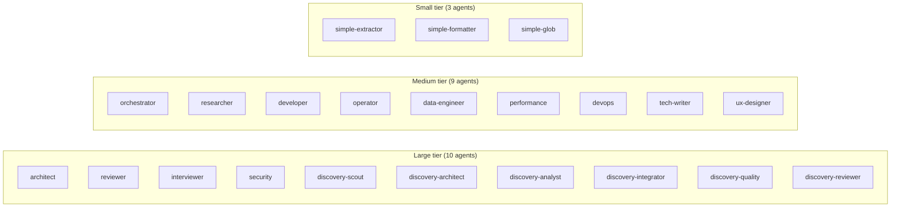
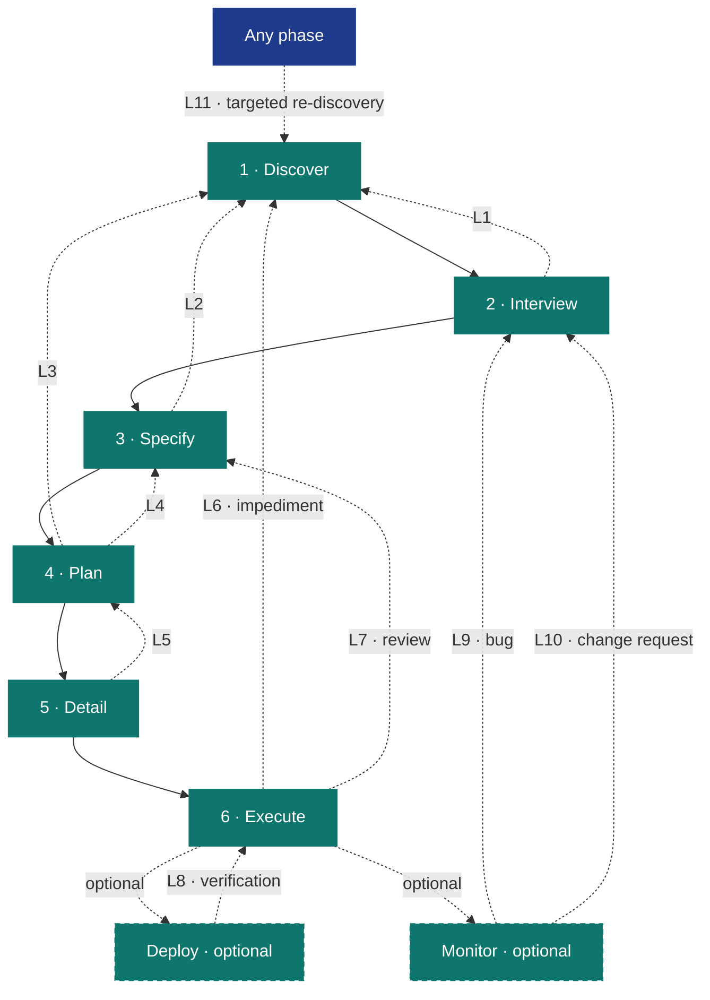
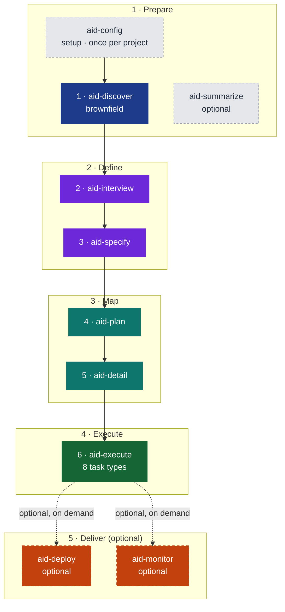
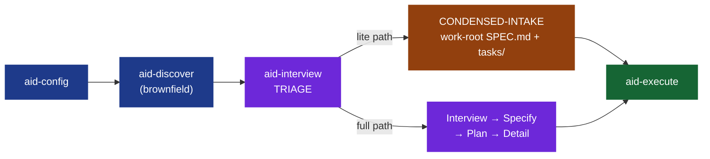

# AID — AI Integrated Development

**A Complete Methodology for AI Integrated Software Development**

*Version 3.2 — June 2026*

---

## Table of Contents

1. [Philosophy](#1-philosophy)
2. [The Knowledge Base](#2-the-knowledge-base)
3. [The Phases](#3-the-phases)
4. [The Lite Path](#4-the-lite-path)
5. [The Agent Model](#5-the-agent-model)
6. [Feedback Loops](#6-feedback-loops)
7. [Artifacts Reference](#7-artifacts-reference)
8. [The Pipeline](#8-the-pipeline)
9. [Case Studies](#9-case-studies)
10. [Comparison with SDD](#10-comparison-with-sdd)
11. [Adoption Guide](#11-adoption-guide)

---

## 1. Philosophy

### It's Waterfall. And That's the Point.

Understand → Specify → Plan → Build → Verify → Ship.

This is the Waterfall sequence. AID embraces it deliberately.

Waterfall failed not because the sequence was wrong, but because humans couldn't execute it fast enough to afford iteration. When discovery takes weeks and specs take days, going back to fix a wrong assumption costs a sprint. Teams learned to skip forward, hack around problems, and call it "agile."

AI changes the economics:

- **Discovery** that took weeks takes hours. An agent can scan a 21 GB codebase, map its architecture, catalog its conventions, and produce a structured Knowledge Base in a single session.
- **Specification** that took days takes minutes. With a Knowledge Base as context, generating a grounded spec is a single prompt, not a week of meetings.
- **Iteration is cheap.** Feedback loops cost tokens, not sprints. Going back to Discovery to fill a knowledge gap costs pennies, not calendar weeks.
- **Documents don't rot.** The same agents that write code maintain the Knowledge Base and specs. Keeping them current is nearly free when the overhead is tokens rather than meeting time.

Agile was the right answer to Waterfall's execution problem. AI is the right answer to Agile's rigor problem. AID is Waterfall with AI execution and formal feedback loops — the methodology that finally works because the bottleneck shifted from "humans are slow" to "humans set direction."

This is not anti-Agile. Sprints, backlogs, and retrospectives can coexist with AID phases. What AID replaces is the *missing structure* inside Agile iterations — the skip from "good idea" straight to implementation because discovery and specification felt too slow to be worth doing.

### The Iron Man Model: Human-in-the-Middle

Every phase is co-executed by human and AI. Not "AI executes, human rubber-stamps." Not "human does the thinking, AI does the typing." The human and AI work together within each phase, with the AI amplifying the human's capabilities.


*The Iron Man Model. Every design phase follows the same universal loop: AI proposes (grounded in KB and codebase), human and AI discuss, AI writes, AI reviews — and the loop repeats until the output meets the bar. Human approves advancement. Human never leaves the cockpit.*

**Between phases, the human gives the OK to advance.** The pipeline never auto-advances. The human reviews the phase output, decides whether it is good enough, and greenlights the next phase. This is the checkpoint that keeps the human in control without slowing the work to human speed.

**The roles:**

| Role | Responsibility |
|------|---------------|
| **Director** | A human. Sets direction, makes judgment calls, holds accountability, approves phase transitions. Orchestrates — does not code. |
| **Orchestrator** | An AI agent (or human). Manages the pipeline: spawns sub-agents, routes feedback loops, enforces quality gates, maintains the Knowledge Base. |
| **Specialist** | An AI coding agent — Claude Code, Codex CLI, Cursor, GitHub Copilot CLI, Antigravity, or similar. Executes tasks within defined scope. Reports impediments rather than working around them. |

The Director never writes code. The Specialist never makes architectural decisions. The Orchestrator bridges both. In Iron Man terms: the Director is the pilot; the Orchestrator and Specialists together are the suit.

### Three Core Principles

**1. Knowledge Before Specification**

Every methodology tells you to "write good specs." None tells you how to understand a system well enough to write them. AID does. The Discovery phase produces a Knowledge Base — a structured collection of documents covering architecture, conventions, data models, integrations, tech debt, and domain language. The spec is then written *against* this knowledge, not from imagination.

The contrast with greenfield projects is instructive. On greenfield, you skip Discovery — there is no existing system to understand. But you still populate a minimal Knowledge Base from the interview. Even for new projects, understanding precedes specification: understanding the domain, the users, the constraints, the technology choices.

**2. Specs Are Living Documents**

A spec written before implementation is a hypothesis. A spec revised after implementation is knowledge. AID treats specs as living artifacts with formal revision protocols. Every change is tracked, justified, and approved. This is not chaos — it is controlled evolution with a full audit trail.

This matters enormously in brownfield projects. The codebase was built by people who are no longer here, against requirements that have since changed, using patterns that were conventional five years ago. Any spec you write will be partially wrong. The question is not whether you will revise — it is whether you will do so formally (with a traceable revision history) or informally (with silent workarounds and hidden debt).

**3. Feedback Over Forward-Only**

The pipeline is sequential by default, but any phase can trigger upstream revision through structured protocols. Discovery can be re-entered from any phase. Specs can be revised during planning. Tasks can be amended during implementation. The revision trail provides audit transparency while keeping the project moving.

AID defines eleven named feedback loops (see §6). The loops are not a failure mode — they are the design. The pipeline is sequential because that is the right default; the loops are formal because reality is not sequential.

### What AID Removes

Hand a capable coding agent a vague task and a large repository, and you get predictable failure modes. AID removes each one structurally — through process, not prompt-tuning.

| Failure mode | What it looks like | How AID removes it |
|--------------|--------------------|--------------------|
| **Knowledge gaps** | The agent doesn't understand the existing system and invents how it works. | Discovery builds the Knowledge Base *before* any spec is written. Understanding precedes specification. |
| **Hallucination** | The agent states things about the code that aren't true. | Every KB claim carries an inline `path:line` citation — facts are anchored to source, not guessed. |
| **Drift** | The implementation quietly diverges from intent; the spec rots. | Spec-as-hypothesis plus eleven formal feedback loops — upstream artifacts are revised with a traceable history, never silently worked around. |
| **Overengineering** | The agent adds abstractions, options, and scope nobody asked for. | Typed, PR-sized tasks with explicit acceptance criteria; the reviewer grades against the spec, not against taste. |
| **Oversights** | Bugs, missed edge cases, and untested paths slip through. | A separate adversarial reviewer — the agent that writes never grades its own work — loops until the grade clears the bar. |
| **Context exhaustion** | Loading the whole repository into the context window — slow, costly, lossy. | A 3-tier context economy (see §2, *Context Feeding Strategy*): an always-loaded index, then one KB document on demand, then an exact `path:line`. |

The rest of this document is how each mechanism works.

### Pros and Cons: Honest Assessment

AID is not a silver bullet. It is a deliberate trade-off.

**Where AID wins:**
- Brownfield projects with accumulated complexity and missing documentation.
- Regulated environments where audit trails and traceability are requirements, not niceties.
- Long-running projects where institutional memory loss is a real cost.
- Teams new to AI-assisted development who need process guardrails to avoid the failure modes listed above.
- Situations where "move fast and break things" has already produced a pile of broken things.

**Where AID is heavier than you need:**
- Pure greenfield MVPs where the risk of knowledge gaps is low and the cost of discovery is real.
- Tiny, well-scoped changes (a bug fix, a one-line config change, a single doc update) — for these, AID's lite path (§4) collapses the overhead dramatically.
- Teams with deep existing knowledge of the codebase who would be documenting what they already know.

**The honest cost:** AID adds process. Discovery takes time. Interview takes time. Specify, Plan, and Detail add overhead before a single line of code is written. The payoff is that what gets written is the *right* code, grounded in real understanding, with a spec that won't surprise you mid-implementation. The cost is real; so is the payoff. AID's lite path (§4) is specifically designed to make the cost commensurate with scope — small work takes a small path.

---

## 2. The Knowledge Base

The Knowledge Base (`.aid/knowledge/`) is the gravitational center of the entire methodology. Every phase reads from it. Any phase can trigger updates to it. It is institutional memory — it outlives any individual session, sprint, or team member.

### Structure

```
.aid/knowledge/
├── INDEX.md               # Meta: 2-3 line summary of every KB document (the navigation map)
├── README.md              # Meta: completeness status per document
├── STATE.md               # Meta: discovery-area state — grade, Q&A entries, review & summarization history
├── project-index.md       # Generated: a file-inventory pre-pass for the discovery sub-agents
│
├── project-structure.md   # Repository layout and file inventory
├── external-sources.md    # Vendor docs and references registered for discovery
├── architecture.md        # Patterns, layers, module boundaries, data flow
├── technology-stack.md    # Languages, frameworks, versions, build tools, runtime
├── module-map.md          # Every module: purpose, dependencies, size, test coverage
├── coding-standards.md    # Naming conventions, formatting, error handling patterns
├── schemas.md             # Database schema, entities, relationships, migrations
├── pipeline-contracts.md  # Pipelines/APIs consumed and exposed: auth models, rate limits
├── integration-map.md     # Message queues, caches, third-party services, webhooks
├── domain-glossary.md     # Business terms, domain language, entity definitions
├── test-landscape.md      # Test frameworks, coverage, test types, CI/CD pipeline
├── tech-debt.md           # Known debt items with file refs, risk ratings, remediation
├── infrastructure.md      # Hosting, networking, environments, deployment model
└── feature-inventory.md   # Canonical feature list, mapped to modules/endpoints/data
```

The fixed shape has a purpose: downstream skills always know exactly where to look. `schemas.md` always holds schemas. `tech-debt.md` always holds debt. Convention beats search.

### The Declared Doc-Set

The 14-document standard set above is the **default seed** — the set synthesized from `canonical/templates/knowledge-base/` when no project-specific override is configured. But the doc-set is **project-configurable** via `discovery.doc_set` in `.aid/settings.yml`.

Before dispatching discovery sub-agents, the GENERATE state runs a **propose→confirm checkpoint** (Step 0d): the orchestrator infers a proposed doc-set from the project's file inventory (as a diff against the default seed) and presents it to the user for confirmation or editing. Custom documents can be added; irrelevant standard ones can be dropped. The confirmed set is written to `.aid/settings.yml` and drives all subsequent discovery dispatches.

In practice: a simple CLI tool needs a handful of documents at depth; the rest stay thin. An enterprise monorepo fills all 14 and adds custom extensions. A greenfield project populates `technology-stack.md`, `coding-standards.md`, and `domain-glossary.md` from the interview and leaves the rest to grow. The shape is fixed even when a document is sparse, so the index and navigation remain consistent.

### Completeness Is Tracked

The `README.md` at the root of the Knowledge Base tracks what exists and what is missing:

```markdown
# Knowledge Base — {Project Name}

| Document | Status | Last Updated | Source |
|----------|--------|-------------|--------|
| architecture.md | ✅ Complete | Mar 16 | aid-discover |
| coding-standards.md | ⚠️ Partial | Mar 16 | aid-discover (inferred) |
| domain-glossary.md | ❌ Missing | — | Needs interview |
| tech-debt.md | ❌ Missing | — | Needs interview |
```

Partial and missing documents are not failure states — they are the honest acknowledgment of what isn't known yet. A partial `coding-standards.md` is better than a confident but wrong one. The KB grows as understanding accumulates.

### Context Feeding Strategy

The Knowledge Base is the project's memory. But memory only works if agents know where to look.

A common failure mode: an agent receives a task spec and the project spec, implements something technically correct — and violates a convention documented in `coding-standards.md` that it never saw. The agent didn't know the document existed. The fix goes through review, gets rejected, comes back, gets redone. Waste.

**AID solves this with the KB Index — a lightweight map of the entire Knowledge Base.**

`aid-config` creates `.aid/knowledge/INDEX.md` at setup with placeholder rows; Discovery regenerates it with real content as its final step (and on the greenfield path, which skips Discovery, `aid-interview` updates it where applicable). This file contains a 2-3 line summary of each KB document — what it covers, when to consult it. It costs almost nothing to include in an agent's context, but it gives the agent the ability to self-serve.

```markdown
# Knowledge Base Index — {Project Name}

Use this index to find the right document before making assumptions.
If your task touches an area covered here, read the relevant document first.

| Document | Summary |
|----------|---------|
| architecture.md | MVVM + Clean Architecture layers. Service registration in ServiceCollectionExtensions.cs. Navigation via INavigationService. |
| coding-standards.md | PascalCase for public, _camelCase for fields. Result<T> for error handling. No exceptions for flow control. Async suffix on all async methods. |
| schemas.md | SQLite via EF Core. 8 entities. Soft deletes on Recording and Transcript. Migrations in /Migrations. |
| module-map.md | 12 modules. Core (services), UI (views/viewmodels), Infrastructure (data access), Tests. Module dependency diagram. |
| ... | ... |
```

**The feeding protocol:**

1. **Every task receives `INDEX.md`.** Always. It is the map. Cost: approximately 200–500 tokens. Value: the agent knows where to look.
2. **The orchestrator selects 2–4 relevant KB docs** based on the task's domain (data work → `schemas.md`, pipeline/API work → `pipeline-contracts.md`).
3. **The task template includes a search instruction:** "If you need context not provided, consult `.aid/knowledge/INDEX.md` and read the relevant document before making assumptions."
4. **Review validates context usage.** One review criterion: did the agent use available KB context, or did it guess?

This is **RAG by convention** — not embeddings and vector databases, but predictable file structure and an index that agents navigate. Retrieval happens in three tiers, cheapest first:

1. **Tier 1 — `INDEX.md`, always loaded.** Every task prompt carries the index (~200–500 tokens total). The agent always knows *what knowledge exists and which file holds it*, at negligible context cost.
2. **Tier 2 — one KB document, on demand.** From an INDEX entry the agent reads the single document a task needs. The fixed-shape directory makes this deterministic — `schemas.md` always holds schemas, `tech-debt.md` always holds debt — so the agent navigates by convention, never by search.
3. **Tier 3 — an exact repository location, via citation.** Every factual claim in a KB document carries an inline `path:line` citation. From a KB doc the agent jumps straight to the precise file and line — never globbing, never bulk-loading unrelated source.

The agent pays a few hundred tokens to know where everything is, then spends its context budget only on the one document and the specific lines a task genuinely needs.

**Why not a vector database?** Because the KB is small enough (14 standard documents, each a short markdown file) that convention beats infrastructure. The bottleneck is not retrieval speed — it is knowing what exists. The INDEX solves that at a fraction of the operational complexity.

**When does the INDEX update?** `aid-config` seeds it at setup; thereafter it is regenerated every time Discovery runs (full or targeted), and `aid-interview` updates it where applicable as requirements evolve. It is always rebuilt from the current state of the KB — never manually maintained.

### The KB Outlives the Project

The Knowledge Base is institutional memory. It outlives any individual session, sprint, or developer. When a new team member joins — human or AI — they read the KB and have the project's full context. When a feature request arrives six months later, the KB tells you what the system looks like now, not what the spec said it should look like.

This is the third conviction underlying AID: the Knowledge Base is the gravitational center. Not the spec. Not the code. The accumulated understanding of the project — architecture, conventions, domain language, tech debt — persists across phases, sprints, and team changes. The code is the output. The KB is the understanding that produces it.

---

## 3. The Phases

AID organizes six numbered development phases into five groups. The six phases (Discover through Execute) form the mandatory sequential pipeline; the fifth group, Deliver, holds two **optional** end-of-pipeline skills (`aid-deploy`, `aid-monitor`) that are invoked on demand rather than as required sequential phases. The pipeline is linear with feedback loops.

The Prepare group also holds two non-phase skills: `aid-config` (bootstrap, run once) and `aid-summarize` (optional KB viewer). A third optional skill, `aid-housekeep`, runs off the pipeline entirely — on-demand KB maintenance when drift accumulates between discovery cycles. These optional skills are not numbered phases; they do not participate in phase gates.

---

### Group 1: Prepare

*Set up the workspace and build an understanding of the existing system.*

---

#### `aid-config` — Bootstrap (not a numbered phase)

**Purpose:** Initialize the AID workspace. Run once per project before the pipeline begins.

`aid-config` collects project metadata (greenfield or brownfield, project name, description, minimum grade threshold), scaffolds `.aid/knowledge/` with the KB document templates (14 standard templates from the default seed plus the meta-documents), creates the host-tool context file (`CLAUDE.md` for Claude Code; `AGENTS.md` for Codex, Cursor, Copilot CLI, and Antigravity), and asks whether the `.aid/` workspace should be committed to Git.

The scaffold is the blank canvas. After `aid-config`, the KB directory exists with empty placeholders; Discovery fills it.

---

#### Phase 1: Discover (`aid-discover`)

**Purpose:** Understand the existing system. Produce the Knowledge Base.

**When to skip:** Pure greenfield projects with no existing code. Interview and Specify populate a minimal KB instead.

**When to re-enter:** Any downstream phase finds the KB wrong or incomplete. Re-entry is always *targeted* — fill the specific gap, not redo full discovery.

**Why this phase exists:** Every other methodology skips it. They assume you already understand the system well enough to write requirements. In brownfield projects — the overwhelming majority of enterprise software work — this assumption is wrong. The developer who built the system is gone; the documentation is stale; the architecture has drifted from whatever was originally designed. Dropping an AI agent into this without a KB produces hallucination: technically plausible but architecturally wrong code. Discovery is the fix.

**Process:**

Discover runs as a state machine: GENERATE → REVIEW → Q-AND-A → FIX → APPROVAL → DONE. One invocation per state. No auto-advance.

The GENERATE state opens with a fast deterministic **pre-pass** that writes `.aid/generated/project-index.md` — a shared file inventory that all discovery sub-agents read instead of re-scanning the repository independently. This eliminates redundant I/O and ensures sub-agents work from a consistent snapshot.

Before dispatching sub-agents, Discover runs the **declared doc-set propose→confirm** (Step 0d, described in §2). The confirmed doc-set drives which agents are dispatched and what filenames they produce.

Discover then dispatches its sub-agents:

- **discovery-scout** (alone, sequential): Maps project structure, detects project type, writes `project-structure.md` and `external-sources.md`.
- **discovery-architect, discovery-analyst, discovery-integrator, discovery-quality** (in parallel): Cover the remaining KB documents divided by ownership — architecture and patterns, data models and standards, integrations, tests and debt.
- **discovery-reviewer** (after generation): Grades the result adversarially against the universal rubric. The generation agents never grade their own work.

Across the run, discovery covers:

1. **Structure scan** — Detect project type, map folder layout, list modules/packages.
2. **Architecture analysis** — Identify patterns, layers, boundaries, data flow.
3. **Stack inventory** — Languages, frameworks, versions, build tools, runtime.
4. **Convention mining** — Naming patterns, error handling, logging, config management (inferred from code).
5. **Module mapping** — Every module: purpose, dependencies, size, test coverage.
6. **Data model extraction** — Schema, entities, relationships, migrations.
7. **Integration surface** — External APIs, message queues, caches, third-party services.
8. **Test landscape** — Frameworks, coverage metrics, test types, CI/CD pipeline.
9. **Tech debt audit** — Large files, circular dependencies, missing tests, outdated packages.
10. **Gap identification** — What couldn't be determined from code alone → feeds into Interview.
11. **INDEX generation** — The orchestrator assembles `.aid/knowledge/INDEX.md` with a 2-3 line summary of every KB document produced.

**Output:** `.aid/knowledge/` — all documents in the confirmed doc-set, the generated `project-index.md` pre-pass, the `INDEX.md` and `README.md` meta-documents, and the grade and Q&A recorded into the discovery-area `STATE.md` (at `.aid/knowledge/STATE.md`). `feature-inventory.md` is scaffolded during the run and completed later in the Q&A → FIX cycle.

---

#### `aid-summarize` — Optional KB Viewer (not a numbered phase)

**Purpose:** Generate a single self-contained `knowledge-summary.html` from the approved Knowledge Base.

`aid-summarize` is an optional, read-only skill that produces an offline HTML viewer of the KB — light/dark theme, WCAG-AA accessible, with Mermaid diagrams rendered inline. It is idempotent: re-running it on an unchanged KB is a no-op. Run it after Discovery approval when you want a portable, shareable view of the project's understanding.

---

### Group 2: Define

*Gather requirements and formalize the problem statement.*

---

#### Phase 2: Interview (`aid-interview`)

**Purpose:** Gather requirements and decompose them into features (full path) or directly into a task set (lite path). Produce the work-area artifacts that drive the rest of the pipeline.

**The TRIAGE routing decision.** Every interview begins with a 2-3 question deterministic triage that routes the work to either the full path or the lite path:

- **T1 (breadth):** How many features does this work touch? ≤ 2 → lean lite.
- **T2 (size):** How long will implementation take? A few days or less → lean lite.
- **T3 (type):** What kind of work is this? `bug-fix | small-refactor | single-doc | small-new-feature` → lite sub-path. Anything else → full path.

The router is conservative: any "large" signal on any question routes to FULL. See §4 for the complete lite path description.

**Full-path workspace:** Each interview creates a *work* — a self-contained unit of scope inside `.aid/`:

```
.aid/
  knowledge/                    ← shared KB (from Discovery)
  work-001-user-auth/           ← one work per interview
    STATE.md                    ← work-area state — process tracking (section status, Q&A, grade)
    REQUIREMENTS.md             ← product (stakeholder requirements)
    features/
      feature-001-login/
        SPEC.md                 ← requirements side (from Interview) + tech spec (from Specify)
      feature-002-password-reset/
        SPEC.md
```

Multiple works can coexist — a client requests auth now, reporting later. Each work has its own requirements and features, sharing the same KB.

**Full-path process (seven states):**

**States 1–4: The conversational interview.** One question at a time — starting broad (Objective, Problem Statement) and getting specific (Constraints, Acceptance Criteria). State 1 opens the interview and State 3 continues it; **State 2** is a Q&A mode that resolves pending questions raised by a downstream-phase loopback, a cross-reference pass, or review findings; **State 4** is the completion-and-approval gate that finalizes REQUIREMENTS.md.

When a KB exists (brownfield), questions come with suggested answers and source citations: `[From: .aid/knowledge/{source}.md]` with options to accept, skip, or provide a custom answer. Nothing is silently inferred. This is what makes brownfield interviews short — the KB pre-fills technical context.

**State 5: Feature Decomposition.** After REQUIREMENTS.md is approved, the agent proposes a feature breakdown from §5 Functional Requirements. Each approved feature gets its own folder with a SPEC.md containing the requirements side (description, user stories, priority, acceptance criteria). The technical specification section is left empty — that is Specify's job.

**State 6: Cross-Reference.** Validates REQUIREMENTS.md against the full KB. Checks for contradictions, gaps, missing evidence, and staleness. Grades the findings with AID's universal rubric.

**State 7: Done.** REQUIREMENTS.md is approved and each per-feature SPEC.md exists with its requirements side filled in — the work is ready for Specify.

**One grading rubric across the pipeline.** Every development phase that grades — Discover, Interview, Specify, Plan, Detail, Execute — works the same way: the reviewer classifies each issue it finds by severity (`[CRITICAL]` / `[HIGH]` / `[MEDIUM]` / `[LOW]` / `[MINOR]`), and the letter grade is computed **deterministically** — the worst severity present dominates, and the count within that tier sets the modifier. A scale that runs A+ down to F, with an E band for critical-severity issues. The reviewer never hand-picks a grade. Each phase loops until its grade meets the project's minimum (set at `aid-config`). See §7 and `canonical/templates/grading-rubric.md`.

**Output (full path):** `.aid/{work}/REQUIREMENTS.md` + `.aid/{work}/features/feature-NNN-{name}/SPEC.md` (requirements side only).

---

#### Phase 3: Specify (`aid-specify`)

**Purpose:** Technical refinement of a single feature through conversational collaboration with the developer. The agent acts as a tech lead — proposes concrete solutions grounded in the KB and codebase, discusses trade-offs, and writes the technical specification into the feature's SPEC.md.

**Input:** A feature's SPEC.md (requirements side, from Interview) + REQUIREMENTS.md + `.aid/knowledge/` + the codebase.

**What this is:** Agile refinement for AI-augmented teams. Interview captured *what* the stakeholder wants. Specify determines *how* to build it — one feature at a time, through discussion with the developer.

The key distinction from generic spec generation: the agent does not ask "what technology do you want to use?" — it proposes based on what the KB and codebase already show. "I see you use Spring Boot with JPMS modules. Here is how this feature fits into the existing module structure." The developer validates, not dictates. This is grounded proposal, not open-ended brainstorming.

**The universal loop:** Each technical section follows the same cycle:

1. **Propose** — the agent proposes a concrete solution referencing specific files, classes, patterns, and conventions from the codebase.
2. **Discuss** — the developer validates, adjusts, or redirects. The agent pushes back on contradictions, presents trade-offs, adapts.
3. **Write** — the agreed section is written to SPEC.md.
4. **Review** — the agent verifies what was written against KB reality and other completed sections. Pass → next section. Fail → back to Propose with findings.

**Re-run = enter at step 4 with existing content.** Running `/aid-specify` on a completed feature reviews all sections against current reality (KB, codebase, requirements), grading each section with the universal rubric. The same loop handles both creation and maintenance.

**Process:** One feature per run. Determines applicable sections: 3 core (Data Model, Feature Flow, Layers & Components) always present, plus up to 19 conditional sections activated by context (API Contracts, UI Specs, Events, Security, Migration, etc.).

**Output:** `## Technical Specification` section added to `.aid/{work}/features/feature-NNN/SPEC.md` — Data Model, Feature Flow, Layers & Components, plus activated conditional sections.

**Full path only:** Specify is skipped on the lite path, which collapses Specify + Plan + Detail into the Interview's TRIAGE-routed condensed flow.

---

### Group 3: Map

*Define the roadmap and decompose into executable tasks.*

---

#### Phase 4: Plan (`aid-plan`)

**Purpose:** Sequence features into deliverables — each one a functional MVP that builds on the previous. Plan answers ONE question: *"In what order do we deliver, and does each delivery stand on its own?"*

**Input:** The feature SPECs whose per-feature state Specify has marked `Ready` + REQUIREMENTS.md + KB (architecture, module-map, tech-debt).

**The universal loop:** Each deliverable follows the same cycle as Specify — Propose, Discuss, Write, Review — applied at the delivery level rather than the feature level.

**What Plan does NOT do** (already covered by Specify): module mapping, test scenarios, per-feature risks and trade-offs, spikes, technical details. Plan only adds the *sequencing* dimension — which features go in which delivery and in what order.

**Why two-level planning matters:** In most methodologies there is one level of planning — a backlog, a sprint, a roadmap. AID separates strategy (Plan) from tactics (Detail). Plan answers "what goes in MVP vs. v2 vs. v3." Detail answers "how do we build MVP — what are the tasks, what are their dependencies." Mixing these levels is where planning sessions get bogged down in micro-decisions before the macro-structure is settled.

**Output:** `.aid/{work}/PLAN.md` — ordered deliverables (each a shippable MVP), optional cross-cutting risks, optional deferred features list.

**Full path only:** Plan is skipped on the lite path.

---

#### Phase 5: Detail (`aid-detail`)

**Purpose:** Break each deliverable into small, sequential, testable tasks. Each task = one agent session = one PR = one human review. The ultimate breakdown.

**Input:** `.aid/{work}/PLAN.md` + feature SPECs + KB (architecture, module-map, coding-standards).

**The universal loop:** Each deliverable follows Propose, Discuss, Write, Review — this time producing task files rather than specifications.

**Task format:** Six sections — Title, Type, Source, Depends on, Scope, Acceptance Criteria. Nothing else. The Type drives both how the executor works and how the reviewer evaluates the task. Every task except the first declares at least one `Depends on` entry; the first uses `— (none)`.

The eight task types are:

- **RESEARCH** — investigate, compare options, document findings
- **DESIGN** — mockups, wireframes, UI prototypes, interaction flows
- **IMPLEMENT** — write code + unit tests
- **TEST** — integration, E2E, UI, load tests
- **DOCUMENT** — ADRs, API docs, runbooks, diagrams
- **MIGRATE** — data migration scripts, schema changes
- **REFACTOR** — restructure code without changing behavior
- **CONFIGURE** — config files, CI/CD, environment setup

**Output:** `.aid/{work}/tasks/task-NNN.md` files — sequential tasks numbered globally across all deliverables — plus an execution graph (dependency and parallel-wave tables) appended to `PLAN.md`.

**Full path only:** Detail is skipped on the lite path, which produces tasks directly.

---

### Group 4: Execute

*Execute every task to a graded bar — code, tests, research, design, docs, and more.*

---

#### Phase 6: Execute (`aid-execute`)

**Purpose:** Execute tasks based on their type. Not just coding — every task has a type that determines what the agent does and how the reviewer evaluates it.

**Input:** `task-NNN.md` (with Type field) + `PLAN.md` (delivery context + execution graph) + the per-feature `SPEC.md` + `known-issues.md` (if present) + `.aid/knowledge/INDEX.md`.

**Process (universal loop, all types):**

1. Read task type and load relevant KB docs via INDEX.md.
2. Execute according to type-specific rules (code, tests, research, design, etc.).
3. Verify relevant gates pass (build, lint, tests — as applicable to the type).
4. Dispatch separate reviewer agent (clean context, tier ≥ executor tier) with type-specific review criteria.
5. Grade with the deterministic rubric and present all issues to the user.
6. If the grade meets the minimum, mark the task Done. Otherwise: with the user's approval, auto-fix CODE issues and route TASK/SPEC/KB issues as loopbacks.
7. Loop until the grade meets the minimum. Circuit breaker if the grade has not improved (same or worse) after 3 consecutive cycles.

**The two-tier review design:** Execute uses a two-tier review model. Within each task, a **quick-check** reviewer (Small tier) catches obvious issues without triggering a full grade loop. At the end of each delivery, a **delivery-gate** reviewer (tier matched to delivery complexity) runs a full review-fix-review loop with `grade.sh`. High findings from quick-checks accumulate for the delivery gate. The design means fast tasks stay fast while complex deliveries get the scrutiny they need.

**Parallel pool dispatch:** In delivery mode, Execute uses a continuous parallel pool (PD model) rather than a serial task loop. Up to `max_parallel_tasks` tasks (default 5, configured in `.aid/settings.yml`) run simultaneously. The pool is replenished as tasks complete; failed tasks block their transitive dependents (computed by `compute-block-radius.sh` via BFS). If the host does not support background dispatch, the pool degrades gracefully to sequential execution with a user-visible notice.

**Branch isolation:** One branch per delivery (`aid/delivery-NNN`). All tasks in a delivery share the branch. RESEARCH and DOCUMENT tasks that produce only `.aid/` artifacts may skip branching.

**Impediment protocol:** When the agent discovers assumptions don't hold, it generates an `IMPEDIMENT-task-NNN.md` rather than silently working around the problem. The impediment is typed (`kb-gap | architecture-conflict | missing-dependency | wrong-assumption`) and presented to the human with options and a recommendation. The human decides.

**Output:** Artifacts appropriate to the task type. Grade ≥ minimum. Full review history in `task-NNN-STATE.md` (via the work-area `STATE.md`).

---

### Group 5: Deliver

*Optionally ship, monitor, and classify issues.*

The two Deliver-group skills — `aid-deploy` and `aid-monitor` — are **optional, on-demand skills, not numbered pipeline phases.** They are positioned at the end of the pipeline, but neither is required to complete a development cycle and neither is a forced sequential step after Execute. A project may ship by other means, may run monitoring without using `aid-deploy`, or may skip both entirely. Run them when the project's delivery model calls for them.

This mirrors `aid-summarize` — an optional skill in the Prepare group — and `aid-housekeep`, the optional off-pipeline maintenance skill described below. The feedback loops they participate in (§6, Loops 8–10) apply only when these skills are run.

---

#### Deploy (`aid-deploy`) — optional

**Purpose:** Bundle one or more completed deliveries into a release package, verify it, and ship it to production.

**Process:**

1. **Package selection:** Choose which completed deliveries go into this release package.
2. **Final verification:** Full build + complete test suite + lint/format check. Zero failures, zero warnings.
3. **Package record:** Write `package-NNN-{slug}.md` — deliveries included, verification results, environment, and release notes.
4. **Packaging:** Produce the release artifact prescribed by `infrastructure.md` § Deployment — a pull request, a container image, a published package, an installer, or a static-site deploy.
5. **Documentation routing:** Route any KB-affecting discoveries to Discovery as Q&A entries in the discovery-area `STATE.md` (`.aid/knowledge/STATE.md`). Deploy never edits KB documents directly.
6. **Artifact status update:** Mark the package's deliveries and their tasks `Shipped`.

**Output:** `package-NNN-{slug}.md` + `DEPLOYMENT-STATE.md` + the release artifact prescribed by `infrastructure.md`.

---

#### Monitor (`aid-monitor`) — optional

**Purpose:** Observe production, classify findings, and route actions. Combines telemetry interpretation with triage in a single observe → classify → act cycle.

**The key distinction:** Monitor *interprets*, it does not just collect. A dashboard shows you a spike. Monitor tells you "error rate increased 340% after deploy #47, concentrated in the payment module, affecting ~2,000 users" — and then classifies it as a BUG with root cause analysis and patch scope.

**Bug vs. CR:** If the spec said "do X" and the code doesn't do X — bug. If users now need Y instead of X — CR, even if the code "works."

**Process:**

1. **Observe** — Pull from configured sources. Detect anomalies vs. baseline. Correlate signals across sources.
2. **Classify** — For each finding: BUG (spec right, code wrong), Change Request (spec needs change), Infrastructure (ops), or No Action (false positive).
3. **Analyze** — Root cause analysis for bugs: trace → fault → scope → test requirements.
4. **Propose** — Present findings with routing recommendations to the user.
5. **Act** — Route findings: bugs via Interview's LITE-BUG-FIX triage → Execute; change requests as new/changed requirements to Interview (full pipeline or new work); escalate infrastructure findings.

**The short path:** BUG → aid-interview (LITE-BUG-FIX triage → task) → aid-execute. The short path skips specification and planning because the spec is already correct — only the code is wrong.

**Output:** `MONITOR-STATE.md` — a last-run log, active findings (each with classification, severity, evidence, and routing), and resolved findings.

---

#### `aid-housekeep` — Off-Pipeline KB Maintenance (optional, on-demand)

**Purpose:** Reconcile Knowledge Base drift without running a full discovery cycle. An optional, on-demand skill with no phase gate — not in the mandatory pipeline flow.

As a project evolves, the codebase drifts from the KB. New dependencies appear. Modules are refactored. Integration patterns shift. The KB becomes stale without a discovery re-run to update it. `aid-housekeep` is the lightweight mechanism for catching and closing that drift without re-running full discovery.

`aid-housekeep` runs on a dedicated `aid/housekeep-*` branch (one commit per stage, never pushes) through a five-state machine:

- **PREFLIGHT** — checks preconditions (branch, workspace, settings).
- **KB-DELTA** — re-discovers KB docs that have drifted from the repo since the last KB approval. Synthesizes a `**Impact:** Required` Q&A entry to drive `/aid-discover`'s targeted re-discovery.
- **SUMMARY-DELTA** — regenerates the visual summary via `/aid-summarize` if the KB changed.
- **CLEANUP** — sweeps stale `.aid/` work-area artifacts (old work directories, resolved impediments, completed task state files).
- **DONE** — terminal state.

The skill is re-entrant: a stalled run resumes at the stalled stage.

`--cleanup-only` skips KB-DELTA and SUMMARY-DELTA and jumps directly to CLEANUP — useful when you want to tidy the workspace without triggering a discovery cycle.

---

## 4. The Lite Path

For small, well-scoped work — a bug fix, a single-document update, a small refactor, a small new feature — the full path (Interview → Specify → Plan → Detail → Execute) is disproportionate overhead. AID's lite path collapses those phases into a single condensed flow.

### When the Lite Path Applies

The TRIAGE state inside `aid-interview` routes to lite or full via three deterministic questions:

| Question | Signal → Lite | Signal → Full |
|----------|--------------|---------------|
| **T1: Breadth** — how many features does this touch? | ≤ 2 features | > 2 features |
| **T2: Size** — how long will implementation take? | A few days or less | More than a few days |
| **T3: Type** — what kind of work? | bug-fix, small-refactor, single-doc, small-new-feature | Anything else |

The router is conservative. Any "large" signal on any question routes to FULL.

### The Lite Workspace

A lite work produces a simpler artifact tree:

```
.aid/
  knowledge/                    ← shared KB (from Discovery, if brownfield)
  work-002-fix-login-bug/       ← one work per interview
    STATE.md                    ← work-area state
    SPEC.md                     ← work-root spec (no features/ folder, no REQUIREMENTS.md)
    tasks/
      task-001.md               ← typed task(s) produced directly
```

No `features/` folder. No `REQUIREMENTS.md`. No `PLAN.md`. One work-root `SPEC.md` holds the consolidated requirements and technical context.

### The Four Lite Sub-Paths

| workType | Sub-path | Typical task set |
|----------|----------|-----------------|
| `bug-fix` | LITE-BUG-FIX | 1 IMPLEMENT task (fix + regression test) |
| `small-refactor` | LITE-REFACTOR | 1–3 REFACTOR + TEST tasks |
| `single-doc` | LITE-DOC | Exactly 1 DOCUMENT task |
| `small-new-feature` | LITE-FEATURE | 1–5 IMPLEMENT + TEST + DOCUMENT tasks |

After TRIAGE routes to a sub-path, the interview is condensed: a conversational slot-fill produces the work-root SPEC.md (CONDENSED-INTAKE state), an architect agent proposes the typed task breakdown directly from the SPEC (TASK-BREAKDOWN state), a reviewer adversarially validates the task set (LITE-REVIEW state), and the terminal LITE-DONE state provides the hand-off prompt to `/aid-execute`.

### Recipes

For recurring patterns — the same kind of change you make repeatedly to the same kind of project — AID ships five **seed recipes** at `canonical/recipes/`:

| Recipe | Applies to |
|--------|-----------|
| `bug-fix.md` | bug-fix workType |
| `method-refactor.md` | small-refactor workType |
| `add-crud-endpoint.md` | small-new-feature workType |
| `add-unit-test.md` | small-new-feature workType |
| `write-release-note.md` | any workType |

A recipe is a pre-filled template: YAML frontmatter + a `## spec` block + a `## tasks` block + `{{slot}}` placeholders. The placeholders are substituted at render time by `canonical/scripts/interview/parse-recipe.sh`. Using a recipe eliminates the conversational interview for a known pattern — you fill the slots, the recipe produces the SPEC.md and task set directly.

Recipes are a shortcut, not a bypass. The task set a recipe produces is the same structured, typed, reviewed artifact that the full interview would produce. The difference is speed for patterns you know well enough to template.

### Escalation

A lite work can be promoted to full mid-flight. If the scope expands during the condensed interview — more features than TRIAGE anticipated, more complexity than the slot-fill can handle — the skill escalates. `Path: escalated` is treated identically to `Path: full`; the work enters the full Interview flow. The `## Escalation Carry` block in `STATE.md` preserves slot answers and decisions already gathered, so the user is not asked again for information already given.

---

## 5. The Agent Model

AID dispatches 22 specialist agents across three model tiers. The key design invariant: **the reviewer's tier is always ≥ the executor's tier.** The agent that writes never grades its own work.

### The Three Tiers



- **Large (10 agents):** architect, reviewer, interviewer, security; and the five discovery sub-agents (scout, architect, analyst, integrator, quality) plus discovery-reviewer. Large agents handle the highest-stakes work — architectural decisions, adversarial review, requirements gathering, security analysis, and the entire discovery sub-system.
- **Medium (9 agents):** orchestrator, researcher, developer, operator, data-engineer, performance, devops, tech-writer, ux-designer. The production workhorses — they implement, research, design, and orchestrate within a delivery.
- **Small (3 agents):** simple-extractor, simple-formatter, simple-glob. Deterministic, fast, low-cost. Used for mechanical tasks (extracting structured data, formatting output, globbing files) where Large-tier reasoning is unnecessary overhead.

### Tier Mapping per Profile

All five host-tool profiles (Claude Code, Codex CLI, Cursor, GitHub Copilot CLI, Antigravity) map the same three tiers to their respective models:

| Tier | Claude Code | Codex CLI | Cursor | Copilot CLI | Antigravity |
|------|------------|-----------|--------|-------------|-------------|
| **Large** | Claude Opus | GPT-5.5 high reasoning | Claude Opus (alias) | Large slug | Gemini-3 Pro high reasoning |
| **Medium** | Claude Sonnet | GPT-5.4 medium reasoning | Claude Sonnet (alias) | Medium slug | Gemini-3 Pro low reasoning |
| **Small** | Claude Haiku | GPT-5.4-mini low reasoning | Claude Haiku (alias) | Small slug | Gemini-3 Flash |

The tier→model mapping is declared per profile in `profiles/{tool}.toml` and rendered into each install tree. Byte-identical skill and agent bodies are emitted for all five profiles; only the model names and agent format differ.

### Agent Formats

The four agent formats emitted by the generator correspond to the four ways host tools represent sub-agents:

- **markdown** — Claude Code and Cursor: the canonical source is `AGENT.md`, rendered into the install tree as lowercase per-role files (`developer.md`, `architect.md`, etc.) with markdown frontmatter.
- **toml** — Codex: `.codex/agents/*.toml` files.
- **copilot-agent** — GitHub Copilot CLI: `.github/agents/*.agent.md` with `name/description/tools/model` frontmatter.
- **antigravity-rule** — Antigravity: `.agent/rules/*.md` with `trigger:`-style frontmatter (personas → `trigger: always_on`).

### The Five Profiles (Install Trees)

AID ships as five rendered install trees. The single canonical source (`canonical/`) is compiled into five byte-identical-body, format-adapted outputs:

| # | Profile | Install root | Context file | Agent format |
|---|---------|-------------|--------------|-------------|
| 1 | Claude Code | `.claude/` | `CLAUDE.md` | markdown |
| 2 | Codex CLI | `.codex/agents/` + `.agents/` | `AGENTS.md` | TOML |
| 3 | Cursor | `.cursor/` | `AGENTS.md` | markdown + `.mdc` rules |
| 4 | GitHub Copilot CLI | `.github/` | `AGENTS.md` | copilot-agent |
| 5 | Antigravity | `.agent/` | `AGENTS.md` | antigravity-rule |

**The build pipeline:**

```
canonical/  (single source of truth — never edit profiles/ directly)
  ├── skills/        (11 user-facing skills)
  ├── agents/        (22 agents)
  ├── templates/     (KB templates, document templates)
  ├── recipes/       (5 lite-path seed recipes)
  └── scripts/       (helper scripts by phase)
        │
        ▼  python run_generator.py
        │  (renders per profiles/*.toml — 5 profiles)
        │
profiles/{claude-code,codex,cursor,copilot-cli,antigravity}/
  (byte-identical install trees, format-adapted per profile)
        │
        ▼  setup.sh / setup.ps1  (end-user installer)
        │  (interactive menu: 5 tools + Done; diff-aware copy)
        │
/path/to/user-project/
  {.claude/ | .codex/+.agents/ | .cursor/ | .github/ | .agent/}
```

A VERIFY (deterministic) gate re-renders all five profiles into a scratch directory and byte-compares them against the committed install trees after every `run_generator.py` execution. Any byte mismatch is a hard failure. This ensures canonical/ is always the source of truth.

**Multi-tool installs:** `setup.sh` handles selection of multiple profiles. Codex, Cursor, Copilot CLI, and Antigravity all write a root `AGENTS.md` context file; when ≥ 2 are selected, last-write-wins (highest-numbered selected tool's `AGENTS.md` survives). Claude Code uses `CLAUDE.md` and is exempt from this collision.

---

## 6. Feedback Loops

The development pipeline (Discover through Execute) is sequential by default; the optional Deliver-group skills (Deploy, Monitor) run on demand at the end. But real engineering is not linear. Assumptions break. Gaps appear. Production reveals truths that development couldn't anticipate. AID defines **eleven formal feedback loops** — eight within development, two connecting production back to development, and one cross-cutting re-entry available from any phase.



*Each dotted arrow is drawn to a single representative target for legibility; several loops route to more than one phase — the loop descriptions below give each loop's full set of targets.*

### The Eleven Loops

#### Development Loops (1–8)

**Loop 1: Interview → Discovery.** During the interview, a human's answer reveals the KB is wrong or incomplete. Interview writes a Q&A entry to the discovery-area `STATE.md` → targeted discovery on the specific area → KB updated → interview resumes with corrected understanding.

**Loop 2: Specify → Discovery.** Writing the spec exposes insufficient understanding of a subsystem. Specify pauses → writes a Q&A entry to the discovery-area `STATE.md` → targeted discovery → KB updated → Specify resumes.

**Loop 3: Plan → Discovery.** Planning reveals the codebase is more complex than the KB captured. Plan writes a Q&A entry → targeted discovery → KB updated → planning resumes.

**Loop 4: Plan → Specify.** The KB is complete, but the SPEC is ambiguous or contradictory. Plan writes a Q&A entry to the feature's `STATE.md` → spec revision (possibly with a targeted interview) → planning resumes.

**Loop 5: Detail → Plan.** The plan is too vague to decompose into tasks. Deliverables are too broad, module boundaries unclear, or test scenarios don't map to features. Detail flags the under-specified deliverable → Plan revises it → Detail resumes.

**Loop 6: Execute → Discovery / Specify / Detail.** While executing a task, the agent discovers an assumption doesn't hold in the actual codebase. `IMPEDIMENT-task-NNN.md` is written, then routed by type — `kb-gap` → targeted discovery; `architecture-conflict` → Specify; `missing-dependency` → Detail; `wrong-assumption` → update the task or SPEC. The agent never silently works around the problem.

**Loop 7: Execute Review → Any Upstream Phase.** The reviewer step inside Execute finds issues that trace to the task, the spec, or the KB — not just code quality. Issues are tagged by source (CODE / TASK / SPEC / KB). CODE issues are auto-fixed inside the Execute loop with the user's approval. A TASK issue routes to a task update; SPEC and KB issues escalate to Specify and Discovery respectively.

**Loop 8: Deploy → Execute.** (Applies only when Deploy is run.) Deploy's final verification — a full build, the complete test suite, and the lint/format check — fails before the delivery ships. Failures are documented → routed back to `/aid-execute` for the fix → Deploy's verification re-runs.

#### Post-Production Loops (9–10, apply only when Monitor is run)

**Loop 9: Monitor → Interview (Bug Path).** Monitor classifies a finding as BUG. Monitor performs root cause analysis and routes the bug to `aid-interview`'s LITE-BUG-FIX triage, which creates the task(s) → aid-execute (→ optional aid-deploy). The short path.

**Loop 10: Monitor → Interview (Change Request Path).** Monitor classifies a finding as Change Request. Monitor routes the change request to `aid-interview` as new/changed requirements → the pipeline runs from Interview (Specify → Plan → Detail → Execute); a large-enough CR spins up a new work.

#### Cross-Cutting Loop (11)

**Loop 11: Any Phase → Discovery (Targeted Re-Discovery).** Any phase finds the Knowledge Base wrong, incomplete, or stale for the work at hand. A targeted discovery run updates the specific KB document(s) — never a full re-discovery — and the calling phase resumes with corrected understanding. This is the loop that makes the Knowledge Base the gravitational center in practice, not just in principle.

### The Revision Trail

Every change to an upstream artifact is tracked inside the artifact itself — a `## Revision History` table (or, for REQUIREMENTS.md and feature SPEC.md, a `## Change Log` at the top):

```markdown
## Revision History

| Rev | Date | Source | Description |
|-----|------|--------|-------------|
| 1.0 | Mar 1 | aid-specify | Initial spec |
| 1.1 | Mar 5 | Q&A (aid-plan) | Added latency requirements |
| 1.2 | Mar 8 | IMPEDIMENT task-F3a (aid-execute) | Changed sync model |
```

The revision trail is not a formality — it is the audit record that lets any phase understand *why* an artifact changed, not just *what* changed. When a spec contradicts the KB, the revision trail identifies which loop revision introduced the divergence.

### Feedback Loop Artifacts

The design-phase loops record the gap as a **Q&A entry appended to the relevant area's `STATE.md`** — the discovery-area `STATE.md` (`.aid/knowledge/STATE.md`) for a KB gap, the work-area `STATE.md` for a requirements gap. The next run of the owning phase detects the pending entry and resolves it in its Q&A mode:

```markdown
### Q{N}

- **Category:** {category, e.g., Architecture, Requirements, Security}
- **Impact:** {High|Medium|Low|Required}
- **Status:** Pending
- **Context:** {why — what the calling phase found; surfaced by {calling phase, e.g. /aid-plan work-001}}
- **Suggested:** {answer if inferrable, or —}
```

The one feedback loop with its own dedicated file is **`IMPEDIMENT-task-NNN.md`** — written by Execute to `.aid/{work}/` when a task hits a contradiction it cannot resolve within scope:

```markdown
# Impediment — task-NNN
> Generated by: aid-execute · Status: Open

## Summary
{one sentence — what the agent found that contradicts its instructions}

## Type
wrong-assumption | missing-dependency | architecture-conflict | kb-gap

## Options
{Option A / B / C — each with approach, effort, and risk}

## Recommendation
{which option the agent recommends, and why — the human decides}
```

---

## 7. Artifacts Reference

### Core Artifacts

| Artifact | Location | Produced By | Consumed By | Lifecycle |
|----------|----------|------------|-------------|-----------|
| Knowledge Base (14 standard docs) | `.aid/knowledge/` | Discover | All phases | Living — updated throughout project |
| INDEX.md | `.aid/knowledge/` | Init, Discover, Interview | All phases | Seeded at init; regenerated by Discovery; maintained by Interview |
| STATE.md (discovery area) | `.aid/knowledge/` | Init, Discover, Summarize | Discover (resume), all phases | Living — grade, review & summarization history; any phase appends Q&A entries |
| project-index.md | `.aid/generated/` | Discover (pre-pass) | Discovery sub-agents | Regenerated each discovery run |
| REQUIREMENTS.md | `.aid/{work}/` | Interview (full path) | Specify, Plan | Frozen after approval (rev-tracked) |
| SPEC.md (work-root) | `.aid/{work}/` | Interview (lite path) | Execute | Single consolidated spec for lite works |
| STATE.md (work area) | `.aid/{work}/` | Interview | All phases for this work | Process tracking |
| Feature SPEC.md | `.aid/{work}/features/{feature}/` | Interview + Specify (full path) | Plan, Detail, Execute | Living — Interview writes requirements side, Specify adds technical spec |
| known-issues.md | `.aid/{work}/` | Specify (Monitor updates) | Plan, Execute, Deploy, Monitor | Living — created when the first issue is registered |
| PLAN.md | `.aid/{work}/` | Plan (full path) | Detail, Deploy | Living — rev-tracked; Detail appends the execution graph |
| task-NNN.md | `.aid/{work}/tasks/` | Detail (full path) or Interview (lite path) | Execute | Rev-tracked if amended |
| IMPEDIMENT-task-NNN.md | `.aid/{work}/` | Execute | Specify, Detail, Discovery | Closed when resolved |
| package-NNN-{slug}.md | `.aid/{work}/packages/` | Deploy | Monitor, stakeholders | One per shipped release package |
| DEPLOYMENT-STATE.md | `.aid/{work}/` | Deploy | Deploy (resume) | Living — operation status + history |
| MONITOR-STATE.md | `.aid/{work}/` | Monitor | Execute (bugs), Discover (CRs) | Living — observation log across runs |

Within Execute, the reviewer produces a structured issue list that `canonical/scripts/grade.sh` scores; the issues, the grade, and the full review history are recorded in the work-area `STATE.md`. There is no separate persistent `REVIEW.md` or `TEST-REPORT.md` file.

### REQUIREMENTS.md Template

```markdown
# Requirements

## Change Log
| Date | Change | Source |
|------|--------|--------|

## 1. Objective
## 2. Problem Statement
## 3. Users & Stakeholders
## 4. Scope
### In Scope
### Out of Scope
## 5. Functional Requirements
## 6. Non-Functional Requirements
## 7. Constraints
## 8. Assumptions & Dependencies
## 9. Acceptance Criteria
## 10. Priority
```

### Feature SPEC.md Template

Each feature gets its own SPEC.md on the full path. Interview writes the top half (requirements side). Specify adds the bottom half (technical specification).

```markdown
# {Feature Title}

## Change Log
| Date | Change | Source |
|------|--------|--------|

## Source
- REQUIREMENTS.md §5.{n}

## Description
{Stakeholder perspective — what the feature does, not how.}

## User Stories
- As a {user}, I want to {action} so that {benefit}

## Priority
{Must / Should / Could}

## Acceptance Criteria
- [ ] Given {precondition}, when {action}, then {expected result}

---

## Technical Specification
{Added by /aid-specify — sections determined by KB, codebase, and developer discussion.}

### Data Model
### Feature Flow
### Layers & Components
{Plus conditional sections as activated}
```

### PLAN.md Template

```markdown
# Plan — {Work Name}

## Deliverables

### delivery-001: {Name}
- **What it delivers:** {user-facing value}
- **Features:** feature-001-{name}, feature-003-{name}
- **Depends on:** — (foundation)
- **Priority:** Must

### delivery-002: {Name}
- **What it delivers:** {user-facing value}
- **Features:** feature-002-{name}
- **Depends on:** delivery-001
- **Priority:** Must

## Cross-Cutting Risks
| # | Risk | Impact | Mitigation |
|---|------|--------|------------|
*(Omit if no cross-cutting risks exist.)*

## Deferred
| Feature | Reason | Revisit When |
|---------|--------|--------------|
*(Omit if all features included.)*

## Execution Graph
*(Appended by Detail — per-delivery dependency and parallel-wave tables.)*

## Revision History
| Rev | Date | Source | Description |
|-----|------|--------|-------------|
```

### task-NNN.md Template

Detail produces one `task-NNN.md` per task and appends the execution graph (waves, precedence) to `PLAN.md` — there is no separate `DETAIL.md` artifact.

```markdown
# task-NNN: {Title}

**Type:** RESEARCH | DESIGN | IMPLEMENT | TEST | DOCUMENT | MIGRATE | REFACTOR | CONFIGURE

**Source:** feature-NNN-{name} → delivery-NNN

**Depends on:** task-NNN [, task-NNN] | — (none)

**Scope:**
- {what to produce or modify — depends on Type}

**Acceptance Criteria:**
- [ ] Criterion 1 — concrete, testable
- [ ] Criterion 2 — concrete, testable
```

Six sections — Title, Type, Source, Depends on, Scope, Acceptance Criteria. Nothing else.

### Review Record Format

Inside Execute, the reviewer produces a structured issue list. Each issue is tagged by severity (`[CRITICAL]` / `[HIGH]` / `[MEDIUM]` / `[LOW]` / `[MINOR]`) and source (`[CODE]` / `[TASK]` / `[SPEC]` / `[KB]`). The reviewer **does not assign a letter grade** — the grade is computed deterministically by `canonical/scripts/grade.sh` from the bracketed severity tags (worst severity dominates; count within that tier sets the `+` / none / `-` modifier). See `canonical/templates/grading-rubric.md` for the full table.

```markdown
## Current Review

**Cycle:** {n}
**Grade:** {computed by grade.sh}

### Issues

| # | Severity | Source | Description |
|---|----------|--------|-------------|
| 1 | [CRITICAL] | [CODE] | ... |
| 2 | [MEDIUM] | [TASK] | ... |

## Review History

| Cycle | Grade | Issues | Date |
|-------|-------|--------|------|
```

### MONITOR-STATE.md Template

```markdown
# Monitor State

## Last Run
**Date:** {date} | **Window:** {start} → {end} | **Findings:** {count}

## Active Findings
### Finding {id}: {Title}
**Classification:** BUG | Change Request | Infrastructure | No Action
**Severity:** Critical | High | Medium | Low
**Evidence:** {concrete data — error counts, latency, ticket clusters}
**Correlation:** {related events — e.g., "error spike 23 min after the package-007-auth deploy"}
**Root cause:** {for bugs — trace from symptom to the specific fault}
**Routing:** BUG → aid-interview (LITE-BUG-FIX) · Change Request → aid-interview · Infrastructure → ops escalation · No Action → closed with justification

## Resolved Findings
| Finding | Classification | Resolution | Date |
|---------|----------------|------------|------|
```

---

## 8. The Pipeline

### Visual Overview

The complete AID pipeline — six numbered development phases plus optional skills at each end:



*The six numbered phases (Discover through Execute) form the mandatory sequential pipeline. Deploy and Monitor are optional end-of-pipeline Deliver skills — dashed boxes, dashed arrows — invoked on demand when the project's delivery model requires them. Neither is a forced sequential step after Execute; a project may skip one, both, or use them in any order.*

<!-- TODO(maintainer): regenerate `methodology/images/2-comparison.png`.
     Content is stale because the current image shows aid-deploy and aid-monitor as solid
     numbered boxes labeled "Deploy" and "Monitor" in the Deliver group with a solid mandatory
     arrow Exe → Dep → Mon, implying they are required numbered phases 7 and 8.
     The correct shape (V3.2) has Deploy and Monitor as OPTIONAL, unnumbered end-of-pipeline
     Deliver skills — dashed boxes and dashed/optional arrows from Execute to each, matching
     the Mermaid diagrams above and in §6.
     The regenerated image should match the §8 Mermaid diagram above: six numbered phases
     (Init unnumbered, phases 1–6 numbered, Summarize unnumbered optional), with Deploy and
     Monitor as dashed/optional nodes in the Deliver group with no numbers and dashed arrows
     from Execute. The SDD vs. AID comparison content on the left side of the image is still
     accurate and should be preserved. -->

The forward path is the default; the eleven feedback loops (see §6) are the escape hatches. Brownfield projects enter at Discover; greenfield projects skip Discover and enter at Interview. `aid-config` runs once before the pipeline, and `aid-summarize` is an optional read-only viewer of the Knowledge Base. `aid-housekeep` runs off the pipeline entirely, on demand.

### The Lite Path (Condensed)

On the lite path, Interview's TRIAGE state routes small work directly to a condensed flow that skips Specify, Plan, and Detail:



*TRIAGE routes at the start of every interview. Full path: the complete pipeline. Lite path: condensed interview produces a work-root SPEC.md and tasks/ directly, skipping Specify, Plan, and Detail.*

### The Two Post-Production Paths

**Bug path (short):** Monitor → Interview → Execute. Monitor maps the root cause — diagnosis, files to touch, tests to add — and hands it to Interview's LITE-BUG-FIX triage, which creates the task; Execute implements. No re-specification, no re-planning.

**Change Request path (full):** Monitor → Interview. The CR re-enters as new or changed requirements; when its scope is large enough it spins up a new work — its own spec, its own plan. The full pipeline ensures changes are understood before they are built.

### Flow Rules

1. **Linear by default.** Discover → Interview → Specify → Plan → Detail → Execute. Deploy and Monitor are optional end-of-pipeline skills, run on demand.
2. **Human approves each phase transition.** The pipeline never auto-advances.
3. **Feedback to KB.** Any phase can trigger targeted discovery. The KB is always the return target.
4. **Feedback to Spec.** Plan, Detail, and Execute can trigger spec revision.
5. **Greenfield starts at Interview** with minimal KB populated from answers.
6. **Brownfield starts at Discover** with full KB populated from code.
7. **Each phase produces persistent artifacts.** Each artifact has a revision history.
8. **The KB outlives the project.** It is institutional memory for future work.
9. **Bugs take the short path.** Monitor → Interview (LITE-BUG-FIX) → Execute. No re-specification.
10. **CRs take the full path.** Monitor routes to Interview. New/changed requirements, new spec, new plan.
11. **Monitor and Deploy run on demand.** They are optional Deliver skills, not required phases.
12. **The lite path is for small work.** TRIAGE decides — not the user's subjective judgment.

---

## 9. Case Studies

### VivaVoz — Greenfield Desktop Application

**Context:** MVVM desktop app (Avalonia/.NET) for voice recording and transcription. Built from scratch.

**How AID applied:**

- **Discovery:** Skipped (greenfield). Minimal KB populated during interview.
- **Interview:** Full requirements gathering. User personas, feature priority, platform constraints. TRIAGE routed to full path — multiple features, multi-week scope.
- **Specify:** Detailed architecture decisions per feature: MVVM pattern, SQLite storage, Whisper integration. Agent proposed based on community conventions, not open-ended prompting.
- **Plan:** Sequenced the roadmap — MVP (core recording), v2 (transcription), v3 (export) — into ordered, independently shippable deliveries.
- **Detail:** Decomposed each delivery into task specs, each carrying explicit C# interface contracts.
- **Execute:** Agent-per-task execution with the built-in review loop — parallel work on independent features, a full unit + E2E test suite graded against the rubric.
- **Deploy:** Incremental deliveries. Each delivery merged independently.

**What worked:** The two-level planning (Plan → Detail) meant strategic decisions were separated from tactical decomposition. The plan defined "what goes in MVP" while detail defined "how to build each piece." Without this separation, planning sessions routinely get bogged down debating implementation micro-decisions before the macro-structure is settled.

**What would have been faster with lite path:** Individual bug fixes discovered during Execute were routed through LITE-BUG-FIX — a diagnosis from Monitor plus a single IMPLEMENT task, no re-spec, no re-plan.

### Brownfield Enterprise Java

**Context:** 21 GB enterprise Java codebase (Maven/Tycho, OSGi bundles). Client needed a developer to understand and extend the search engine.

**How AID applied:**

- **Discovery:** Full codebase analysis. Module listing across hundreds of packages. Architecture report covering 15 sections. The KB captured: OSGi bundle manifest structure, search indexing pattern, key extension points, naming conventions, and the deployment model (target platform).
- **Interview:** Targeted — client explained business context, search requirements. Short interview because Discovery pre-filled all technical context. The agent's questions came with suggested answers: "Based on `architecture.md`: the search service extends `org.eclipse.search.ui.ISearchPage`. Does the new feature plug in at this extension point? [Y/N/custom]"
- **Specify:** Spec grounded in the KB. Referenced actual package names, existing interfaces, OSGi service bindings.

**Key insight:** Without Discovery, an agent dropped into this codebase would have hallucinated. The KB gave agents the context they needed to work within the existing architecture rather than against it. The Specify session took 40 minutes; the equivalent effort without a KB would have been a multi-day exploration that still wouldn't have caught the OSGi service lifecycle constraints that the KB surfaced in its first section.

### Zac Pipeline — Operational Automation

**Context:** E-commerce advertising pipeline. Pull data from Meta/Google/Klaviyo, validate, process with specialist AI agents, grade output quality.

**How AID applied:**

- **Interview:** One question at a time. "What are your brands?" → "What platforms?" → "What does a good report look like?" → "What data don't you agree with?" That last question discovered a timezone bug in the existing data aggregation — before a line of spec was written.
- **Specify:** Pipeline spec with data flow, agent roles, grading criteria.
- **Execute:** Multi-agent orchestration — 4 specialist agents + orchestrator + executive-summary generator — validated against a domain-specific quality gate (Grade A): source match (1% tolerance), traceability, cross-agent consistency.
- **Monitor:** Watches quality-gate results across brands. When a report fails, Monitor classifies it — a data-processing bug (short path: LITE-BUG-FIX → Execute) or a source-format change (full cycle: new requirements → new spec). Nothing falls through.

**The lite path in practice:** After the initial build, individual brand-specific issues were handled as LITE-BUG-FIX works — each a single IMPLEMENT task taking 20-30 minutes end to end, vs. the multi-day cycle the full path would require.

---

## 10. Comparison with SDD

### What is SDD?

Spec-Driven Development (SDD) is the practice of using specifications as the primary development artifact, with AI agents implementing code from specs. Key tools: GitHub Spec Kit, AWS Kiro, Tessl Framework.

### Where We Overlap

Both AID and SDD:
- Use specifications as the central development artifact.
- Employ AI agents for code implementation.
- Rely on tests as contracts between spec and code.
- Require human review of agent output.
- Use markdown as the specification format.

### Where We Diverge

<!-- TODO(maintainer): regenerate `methodology/images/2-comparison.png` — see note in §8. -->

| Dimension | SDD | AID |
|-----------|-----|-----|
| **Starting point** | A spec | Understanding (Discovery) |
| **Brownfield support** | Gap acknowledged | First-class Discovery phase with a 14-document KB (project-configurable) |
| **Spec philosophy** | Spec is source of truth | Spec is hypothesis — revised by formal protocol |
| **Requirements** | Assumed to exist | Gathered through adaptive interview |
| **Planning depth** | Single spec | Two-level: Plan (strategy) → Detail (tactics) |
| **Feedback loops** | Rebuild spec from scratch | Eleven formal loops (7 development + 3 post-production) |
| **Testing** | Not addressed as separate phase | TEST is a first-class task type inside Execute; Deploy runs a full final-verification gate |
| **Quality gates** | Generic conformance tests | One universal severity rubric (deterministic — computed, not judged) plus project-defined quality checks |
| **Agent model** | One agent per spec | 22 specialist agents across 3 tiers; reviewer tier ≥ executor tier invariant |
| **Delivery model** | Spec → code → done | Discover → specify → plan → detail → execute → optional deploy/monitor |
| **Memory** | Stateless | Knowledge Base persists across sessions |
| **Post-delivery** | Not addressed | Monitor → Interview (bugs via LITE-BUG-FIX + CRs) |
| **Scope** | Code generation | Full lifecycle: discovery through production maintenance |
| **Human role** | Spec writer, reviewer | Co-pilot across all phases |
| **Scale options** | One path | Full path + lite path (TRIAGE-routed) for small work; recipes for recurring patterns |

### The Core Argument

SDD says: "Write better specs, get better code."

AID says: "Understand the system first. Then write specs grounded in that understanding. Then plan the roadmap. Then detail the execution. Then build, review, and test it inside Execute's graded loop. Then ship when the delivery model requires it. And when any of that reveals you were wrong — revise formally, don't hack around it."

SDD is not wrong. It is incomplete. AID is SDD + Discovery + Feedback Loops + Two-Level Planning + a Built-in Review Loop + Institutional Memory + Production Lifecycle + a Lite Path for small work.

---

## 11. Adoption Guide

### Starting with an Existing Project (Brownfield)

1. Run `/aid-config` to initialize the workspace (once per project).
2. Run `/aid-discover` on the codebase. This produces your Knowledge Base.
3. Review the KB. Fill gaps with human knowledge during the Q&A state.
4. For the next feature request, run `/aid-interview`. TRIAGE will route to full or lite path.
5. **Full path:** Run `/aid-specify` to add a technical spec to each feature. Run `/aid-plan` to sequence features into deliveries. Run `/aid-detail` to decompose deliveries into typed tasks. Run `/aid-execute` for each task.
6. **Lite path:** `/aid-interview` completes the condensed flow and hands off task(s) directly to `/aid-execute`.
7. Optionally run `/aid-deploy` to verify, package, and ship; then `/aid-monitor` once the delivery is in production.
8. Run `/aid-housekeep` periodically to reconcile KB drift without a full discovery cycle.

### Starting a New Project (Greenfield)

1. Run `/aid-config`, then `/aid-interview`. TRIAGE will assess scope; greenfield projects with multiple features will route to full path.
2. A minimal KB is populated from interview answers during the full-path flow.
3. **Full path:** Run `/aid-specify` → `/aid-plan` → `/aid-detail` → `/aid-execute`.
4. **Lite path (small greenfield change):** `/aid-interview` completes condensed flow; run `/aid-execute`.
5. The KB grows organically as the codebase develops. Run `/aid-discover` once meaningful code exists to backfill discovery.

### Using the Lite Path and Recipes

For small, well-scoped changes — bug fixes, single-doc updates, small refactors, small new features:

1. Run `/aid-interview`. TRIAGE asks 2-3 questions and routes to the appropriate LITE sub-path.
2. The condensed interview produces a work-root SPEC.md and task(s) directly.
3. Run `/aid-execute`.

For recurring patterns:
1. Identify which seed recipe matches the pattern (`bug-fix`, `method-refactor`, `add-crud-endpoint`, `add-unit-test`, or `write-release-note`).
2. Fill the recipe's `{{slot}}` placeholders.
3. `parse-recipe.sh` produces the SPEC.md and task(s). Run `/aid-execute`.

### Adopting Incrementally

You do not need to use all six phases from day one — though `/aid-config` always runs once first:

- **Start with Detail + Execute.** If you already have specs, formalize your task decomposition and reviewed execution — Execute codes, reviews, and grades in one loop.
- **Add Plan.** Separate delivery strategy from tactical decomposition with two-level planning.
- **Add Discover.** For the next brownfield project, build the Knowledge Base first.
- **Add Interview + Specify.** For the next client engagement, gather requirements through the adaptive interview, then refine each feature technically.
- **Add Deploy + Monitor.** Once you are shipping regularly, formalize delivery and production monitoring.
- **Go full pipeline.** Once each phase is familiar, run them sequentially with feedback loops.

### Anti-Patterns

- **Skipping Discovery on brownfield.** Agents will hallucinate about your architecture. The 40-minute Discovery investment eliminates hours of review-reject-redo cycles.
- **Treating the spec as sacred.** It is a hypothesis. Revise it when implementation proves it wrong — formally, with the revision trail.
- **Ignoring impediments.** If an agent reports an impediment, stop and decide. Do not let it work around the problem. The impediment file is not bureaucracy — it is the agent saying "I found a contradiction and I am not going to silently paper over it."
- **Bypassing Execute's review loop.** "The tests pass" is not enough. Execute dispatches a separate adversarial reviewer that catches spec, architecture, and convention issues tests cannot detect. The deterministic grade gate is what makes that bite. Do not lower the minimum grade to dodge it.
- **Not maintaining the KB.** A stale KB is worse than no KB. Every phase should update it when new knowledge is acquired. Run `/aid-housekeep` periodically to catch drift.
- **Sending agents blind.** Including TASK + SPEC without the KB INDEX means the agent does not know what context exists. It will guess instead of look. Always include INDEX.md.
- **Auto-advancing between phases.** The human approves every transition. That is the checkpoint that keeps the methodology safe.
- **Using the full path for every change.** A two-line bug fix does not need Specify, Plan, and Detail. TRIAGE exists to route proportionately. Trust it.

---

*AID V3.2 — June 2026*
*Built from practice, not theory. Every phase, every template, every feedback loop was born from real projects.*
