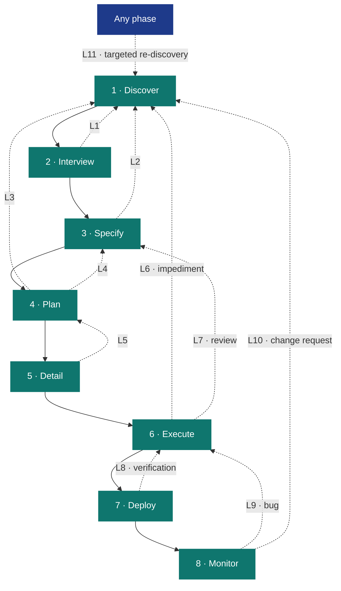
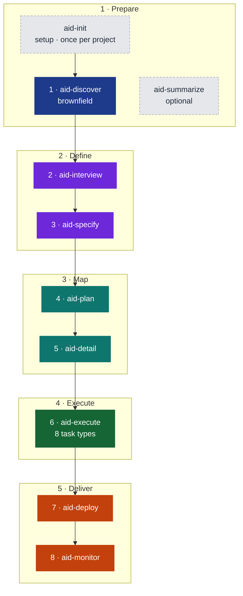

# AID — AI-Integrated Development

**A Complete Methodology for AI-Integrated Software Development**

*Version 3.1 — May 2026*

---

## Executive Summary

AID (AI-Integrated Development) is a structured methodology for building and maintaining software with AI agents. It defines eight development phases — plus a one-time setup step and an optional summary skill — organized into five groups, from problem mapping through production monitoring and issue routing, with formal feedback loops that allow any phase to revise upstream artifacts when reality contradicts assumptions.

Each phase is **co-executed by human and AI**. The AI is the Iron Man suit — it amplifies the human's capabilities. The human is the pilot — setting direction, making decisions, approving advancement between phases. The human never leaves the cockpit. This is not "AI executes, human validates." It is "human and AI work together, human drives."

The methodology covers the full lifecycle in five groups:

- **Prepare** (1 phase): Set up the workspace and build an understanding of the existing system.
- **Define** (2 phases): Gather requirements and formalize the problem statement.
- **Map** (2 phases): Plan the roadmap and decompose it into executable tasks.
- **Execute** (1 phase): Build, review, and test — one typed-task phase with a built-in review loop.
- **Deliver** (2 phases): Ship to production, then monitor and route what breaks.

Bugs take a short path back through Execute. Change requests start a new development cycle. Nothing falls on the floor.

The methodology is built on three convictions:

1. **Understanding precedes specification.** You cannot write a useful spec for a system you don't understand. Brownfield projects — the overwhelming majority of enterprise work — require structured discovery before anything else.
2. **Specs are hypotheses, not contracts.** Implementation reveals truths that specification cannot anticipate. A methodology without formal revision protocols is a methodology that produces silent workarounds and hidden debt.
3. **The Knowledge Base is the gravitational center.** Not the spec. Not the code. The accumulated understanding of the project — architecture, conventions, domain language, tech debt — persists across phases, sprints, and team changes.

This document defines the complete methodology: philosophy, phases, artifacts, feedback loops, and practical guidance for adoption.

---

## Table of Contents

1. [Philosophy](#1-philosophy)
2. [The Knowledge Base](#2-the-knowledge-base)
3. [The Phases](#3-the-phases)
4. [Feedback Loops](#4-feedback-loops)
5. [Artifacts Reference](#5-artifacts-reference)
6. [The Pipeline](#6-the-pipeline)
7. [Case Studies](#7-case-studies)
8. [Comparison with SDD](#8-comparison-with-sdd)
9. [Adoption Guide](#9-adoption-guide)

---

## 1. Philosophy

### It's Waterfall. And That's the Point.

Understand → Specify → Plan → Build → Verify → Ship.

This is the Waterfall sequence. We embrace it deliberately.

Waterfall failed not because the sequence was wrong, but because humans couldn't execute it fast enough to afford iteration. When discovery takes weeks and specs take days, going back to fix a wrong assumption costs a sprint. Teams learned to skip forward, hack around problems, and call it "agile."

AI changes the economics:

- **Discovery** that took weeks takes hours. An agent can scan a 21GB codebase, map its architecture, catalog its conventions, and produce a Knowledge Base in a single session.
- **Specification** that took days takes minutes. With a Knowledge Base as context, generating a grounded spec is a single prompt, not a week of meetings.
- **Iteration is cheap.** Feedback loops cost tokens, not sprints. Going back to Discovery to fill a knowledge gap costs pennies, not calendar weeks.
- **Documents don't rot.** The same agents that write code maintain the Knowledge Base and specs. They don't get stale because maintaining them is nearly free.

Agile was the right answer to Waterfall's execution problem. AI is the right answer to Agile's rigor problem. AID is Waterfall with AI execution and formal feedback loops — the methodology that finally works because the bottleneck shifted from "humans are slow" to "humans set direction."

### Human-in-the-Middle

Every phase is co-executed by human + AI. Not "AI executes, human rubber-stamps." Not "human does the thinking, AI does the typing." The human and AI work together within each phase, with the AI amplifying the human's capabilities.

**Between phases, the human gives the OK to advance.** The pipeline never auto-advances. The human reviews the phase output, decides if it's good enough, and greenlights the next phase. This is the checkpoint that keeps the human in control without slowing the work to human speed.

**The roles:**
- **Human:** Pilot. Sets direction, makes judgment calls, holds accountability, approves phase transitions.
- **AI:** Iron Man suit. Amplifies capability — scans codebases in hours, generates specs in minutes, implements tasks, runs reviews, monitors production. Does what the human directs, faster and more thoroughly than the human alone could.

This framing matters. The AI is not autonomous. The AI is not a junior developer that needs supervision. The AI is a power multiplier that makes the human dangerous.

### Three Core Principles

**1. Knowledge Before Specification**

Every methodology tells you to "write good specs." None tells you how to understand a system well enough to write them. AID does. The Discovery phase produces a Knowledge Base — a structured collection of documents covering architecture, conventions, data models, integrations, tech debt, and domain language. The spec is then written *against* this knowledge, not from imagination.

**2. Specs Are Living Documents**

A spec written before implementation is a hypothesis. A spec revised after implementation is knowledge. AID treats specs as living artifacts with formal revision protocols. Every change is tracked, justified, and approved. This isn't chaos — it's controlled evolution.

**3. Feedback Over Forward-Only**

The pipeline is sequential by default, but any phase can trigger upstream revision through structured protocols. Discovery can be re-entered from any phase. Specs can be revised during planning. Tasks can be amended during implementation. The revision trail provides audit transparency while keeping the project moving.

### What AID Removes

Hand a capable coding agent a vague task and a large repository, and you get predictable failure modes. AID is built to remove each one **structurally** — through process, not prompt-tuning.

| Failure mode | What it looks like | How AID removes it |
|--------------|--------------------|--------------------|
| **Knowledge gaps** | The agent doesn't understand the existing system and invents how it works. | Discovery builds the Knowledge Base *before* any spec is written. Understanding precedes specification. |
| **Hallucination** | The agent states things about the code that aren't true. | Every KB claim carries an inline `path:line` citation — facts are anchored to source, not guessed. |
| **Drift** | The implementation quietly diverges from intent; the spec rots. | Spec-as-hypothesis plus eleven formal feedback loops — upstream artifacts are revised with a traceable history, never silently worked around. |
| **Overengineering** | The agent adds abstractions, options, and scope nobody asked for. | Typed, PR-sized tasks with explicit acceptance criteria; the reviewer grades against the spec, not against taste. |
| **Oversights** | Bugs, missed edge cases, and untested paths slip through. | A separate adversarial reviewer — the agent that writes never grades its own work — loops until the grade clears the bar. |
| **Context exhaustion** | Loading the whole repository into the context window — slow, costly, lossy. | A 3-tier context economy (see §2): an always-loaded index, then one KB document on demand, then an exact `path:line`. |

The rest of this document is how each mechanism works.

### Roles

AID defines three roles:

| Role | Responsibility |
|------|---------------|
| **Director** | A human. Sets direction, makes decisions, reviews artifacts, approves phase transitions — orchestrating, not coding. |
| **Orchestrator** | An AI agent (or human). Manages the pipeline: spawns agents, routes feedback loops, enforces quality gates, maintains the Knowledge Base. |
| **Specialist** | An AI coding agent (Claude Code, Codex, or similar). Executes tasks within defined scope. Reports impediments rather than working around them. |

The Director never writes code. The Specialist never makes architectural decisions. The Orchestrator bridges both. In the Iron Man terms from earlier in this section: the Director is the pilot; the Orchestrator and Specialists together are the suit.

---

## 2. The Knowledge Base

The Knowledge Base (`.aid/knowledge/`) is the gravitational center of the entire methodology. Every phase reads from it. Any phase can trigger updates to it.

### Structure

```
.aid/knowledge/
├── INDEX.md               # Meta: 2-3 line summary of every KB document (the navigation map)
├── README.md              # Meta: completeness status per document
├── DISCOVERY-STATE.md     # Meta: discovery grade, open questions, review history
├── project-index.md       # Generated: a file-inventory pre-pass for the discovery sub-agents
│
├── project-structure.md   # Repository layout and file inventory
├── external-sources.md    # Vendor docs and references registered for discovery
├── architecture.md        # Patterns, layers, module boundaries, data flow
├── technology-stack.md    # Languages, frameworks, versions, build tools, runtime
├── module-map.md          # Every module: purpose, dependencies, size, test coverage
├── coding-standards.md    # Naming conventions, formatting, error handling patterns
├── data-model.md          # Database schema, entities, relationships, migrations
├── api-contracts.md       # APIs consumed and exposed: auth models, rate limits
├── integration-map.md     # Message queues, caches, third-party services, webhooks
├── domain-glossary.md     # Business terms, domain language, entity definitions
├── test-landscape.md      # Test frameworks, coverage, test types, CI/CD pipeline
├── security-model.md      # Auth/authz, secrets management, compliance requirements
├── tech-debt.md           # Known debt items with file refs, risk ratings, remediation
├── infrastructure.md      # Hosting, networking, environments, deployment model
├── ui-architecture.md     # Front-end / UI architecture (sparse for non-UI projects)
└── feature-inventory.md   # Canonical feature list, mapped to modules/endpoints/data
```

### Completeness Is Tracked

The `README.md` at the root of the Knowledge Base tracks what exists and what's missing:

```markdown
# Knowledge Base — {Project Name}

| Document | Status | Last Updated | Source |
|----------|--------|-------------|--------|
| architecture.md | ✅ Complete | Mar 16 | aid-discover |
| coding-standards.md | ⚠️ Partial | Mar 16 | aid-discover (inferred) |
| domain-glossary.md | ❌ Missing | — | Needs interview |
| security-model.md | ❌ Missing | — | Needs interview |
```

### Not Every Document Is Required

The Knowledge Base has a fixed core — **16 standard documents**, 3 meta-documents, and 1 generated pre-pass (`project-index.md`) — and a project may add extension documents beyond the core (for example, a host-tools matrix). Not every standard document carries deep content on every project:

- **Simple CLI tool?** A handful of documents carry real depth; the rest stay thin.
- **Enterprise monorepo?** All 16 fill out.
- **Greenfield?** `technology-stack.md`, `coding-standards.md`, and `domain-glossary.md` are populated from the interview, not from code; the rest grow as the codebase does.

The shape is fixed even when a document is sparse, so downstream skills always know exactly where to look.

### Context Feeding Strategy

The Knowledge Base is the project's memory. But memory only works if agents know where to look.

A common failure mode: an agent receives a task spec and the project spec, implements something technically correct — and violates a convention documented in `coding-standards.md` that it never saw. The agent didn't know the document existed. The fix goes through review, gets rejected, comes back, gets redone. Waste.

**AID solves this with the KB Index — a lightweight map of the entire Knowledge Base.**

`aid-init` creates `.aid/knowledge/INDEX.md` at setup with placeholder rows; Discovery regenerates it with real content as its final step (and on the greenfield path, which skips Discovery, `aid-interview` updates it where applicable). This file contains a 2-3 line summary of each KB document — what it covers, when to consult it. It costs almost nothing to include in an agent's context, but it gives the agent the ability to self-serve.

```markdown
# Knowledge Base Index — {Project Name}

Use this index to find the right document before making assumptions.
If your task touches an area covered here, read the relevant document first.

| Document | Summary |
|----------|---------|
| architecture.md | MVVM + Clean Architecture layers. Service registration in ServiceCollectionExtensions.cs. Navigation via INavigationService. |
| coding-standards.md | PascalCase for public, _camelCase for fields. Result<T> for error handling. No exceptions for flow control. Async suffix on all async methods. |
| data-model.md | SQLite via EF Core. 8 entities. Soft deletes on Recording and Transcript. Migrations in /Migrations. |
| module-map.md | 12 modules. Core (services), UI (views/viewmodels), Infrastructure (data access), Tests. Module dependency diagram. |
| ... | ... |
```

**The feeding protocol:**

1. **Every task receives INDEX.md.** Always. It's the map. Cost: ~200-500 tokens. Value: the agent knows where to look.
2. **The orchestrator selects 2-4 relevant KB docs** based on the task's domain (data work → data-model.md, API work → api-contracts.md).
3. **The task template includes a search instruction:** "If you need context not provided, consult `.aid/knowledge/INDEX.md` and read the relevant document before making assumptions."
4. **Review validates context usage.** One review criterion: did the agent use available KB context, or did it guess?

This is **RAG by convention** — not embeddings and vector databases, but predictable file structure and an index that agents navigate. Retrieval happens in three tiers, cheapest first:

1. **Tier 1 — `INDEX.md`, always loaded.** Every task prompt carries the index (~200–500 tokens total). The agent always knows *what knowledge exists and which file holds it*, at negligible context cost.
2. **Tier 2 — one KB document, on demand.** From an INDEX entry the agent reads the single document a task needs. The fixed-shape directory makes this deterministic — `data-model.md` always holds schemas, `tech-debt.md` always holds debt — so the agent navigates by convention, never by search.
3. **Tier 3 — an exact repository location, via citation.** Every factual claim in a KB document carries an inline `path:line` citation. From a KB doc the agent jumps straight to the precise file and line — never globbing, never bulk-loading unrelated source.

The agent pays a few hundred tokens to know where everything is, then spends its context budget only on the one document and the specific lines a task genuinely needs.

**Why not a vector database?** Because the KB is small enough (16 standard documents, typically 2–20KB each) that convention beats infrastructure. The bottleneck isn't retrieval speed — it's knowing what exists. The INDEX solves that.

**When does the INDEX update?** `aid-init` seeds it at setup; thereafter it is regenerated every time Discovery runs (full or targeted), and `aid-interview` updates it where applicable as requirements evolve. It is always rebuilt from the current state of the KB — never manually maintained.

### The KB Outlives the Project

The Knowledge Base is institutional memory. It outlives any individual session, sprint, or developer. When a new team member joins — human or AI — they read the KB and have the project's full context. When a feature request arrives six months later, the KB tells you what the system looks like now, not what the spec said it should look like.

---

## 3. The Phases

AID organizes eight development phases into five groups. The pipeline is linear with feedback loops. The Monitor phase observes production and routes issues back into development through one of two paths:

- **Bug path (short):** Monitor → Execute → Deploy. Surgical. Monitor identifies the bug, performs root cause analysis, creates a task, and routes to Execute. No re-specification, no re-planning.
- **Change Request path (full cycle):** Monitor → Discover. The CR routes back to Discovery as a Q&A entry; a large-enough CR spins up a new work and runs the complete cycle from the beginning.

---

### Group 1: Prepare

*Set up the workspace and build an understanding of the existing system. This group also holds two non-phase skills, `aid-init` and `aid-summarize` — see Prepare-Group Skills below.*

---

#### Phase 1: Discover (`aid-discover`)

**Purpose:** Understand the existing system. Produce the Knowledge Base.

**Input:** Access to the codebase (git repo, file system, or archive).

**Process:**

Discover runs as a state machine — one invocation per step: **generate** the Knowledge Base, **review** it, resolve **open questions** with the human, **fix**, then **approve**.

Generation opens with a fast, deterministic pre-pass that writes `.aid/knowledge/project-index.md` — a shared file inventory the sub-agents read instead of re-scanning the repository. Discover then dispatches **five sub-agents** — a structure scout first, then four more in parallel — that together generate the Knowledge Base; a separate **reviewer** grades it in the review step. Across the run, discovery covers:

1. **Structure scan** — Detect project type, map folder layout, list modules/packages.
2. **Architecture analysis** — Identify patterns, layers, boundaries, data flow.
3. **Stack inventory** — Languages, frameworks, versions, build tools, runtime.
4. **Convention mining** — Naming patterns, error handling, logging, config management (inferred from code).
5. **Module mapping** — Every module: purpose, dependencies, size, test coverage.
6. **Data model extraction** — Schema, entities, relationships, migrations.
7. **Integration surface** — External APIs, message queues, caches, third-party services.
8. **Test landscape** — Frameworks, coverage metrics, test types, CI/CD pipeline.
9. **Tech debt audit** — Large files, circular dependencies, missing tests, outdated packages.
10. **Gap identification** — What we couldn't determine from code alone → feeds into Interview.
11. **INDEX generation** — Generate `.aid/knowledge/INDEX.md` with a 2-3 line summary of every KB document produced. This lightweight index is included in every task context so agents know what's available and can self-serve additional context on demand. See [Context Feeding Strategy](#context-feeding-strategy).

**Output:** `.aid/knowledge/` — the project's Knowledge Base: all 16 standard documents, the generated `project-index.md` pre-pass, and the meta-documents (`INDEX.md`, `README.md`, and the Q&A in `DISCOVERY-STATE.md`). `feature-inventory.md` is scaffolded during the run and completed later, in the Q&A → fix cycle.

**When to skip:** Pure greenfield projects with no existing code. Interview and Specify populate a minimal KB instead.

**When to re-enter:** Any downstream phase finds the KB wrong or incomplete and routes a feedback loop back to Discovery (§4). Re-entry is always *targeted* — fill the specific gap, not redo full discovery.

#### Prepare-Group Skills: `aid-init` and `aid-summarize`

Two skills sit in the Prepare group but are **not numbered phases**:

- **`aid-init`** — the bootstrap skill, run once before the pipeline begins. It collects project metadata (greenfield or brownfield, name, description, minimum grade), scaffolds `.aid/knowledge/` with the 16 KB document templates plus the meta-documents, creates the host-tool context file (`CLAUDE.md` or `AGENTS.md`), and asks whether the `.aid/` workspace should be committed to Git.
- **`aid-summarize`** — an optional, read-only skill, run after Discovery is approved. It generates a single self-contained `knowledge-summary.html` from the Knowledge Base — offline, light/dark theme, accessibility-first, with Mermaid diagrams. It is idempotent: re-running it on an unchanged KB is a no-op.

---

### Group 2: Define

*Gather requirements and formalize the problem statement.*

---

#### Phase 2: Interview (`aid-interview`)

**Purpose:** Gather requirements and decompose them into features. Produce REQUIREMENTS.md and, for each feature, a SPEC.md with its requirements side filled in.

**Input:** KB (if brownfield) or project description (if greenfield). A human to interview.

**Workspace:** Each interview creates a *work* — a self-contained unit of scope inside `.aid/`:

```
.aid/
  knowledge/                    ← shared KB (from Discovery)
  work-001-user-auth/           ← one work per interview
    INTERVIEW-STATE.md          ← process tracking (section status, Q&A, grade)
    REQUIREMENTS.md             ← product (stakeholder requirements)
    features/
      feature-001-login/
        SPEC.md                 ← requirements side (from Interview) + tech spec (from Specify)
        STATE.md                ← per-feature process tracking (from Specify)
      feature-002-password-reset/
        SPEC.md
        STATE.md
```

Multiple works can coexist — a client requests auth now, reporting later. Each work has its own requirements and features, sharing the same KB.

**Process:**

The interview runs as a seven-state machine, advancing one state per run (State 7 is the terminal Done state):

**States 1–4: The conversational interview.** One question at a time — starting broad (Objective, Problem Statement) and getting specific (Constraints, Acceptance Criteria). State 1 opens the interview and State 3 continues it; **State 2** is a re-entry mode that folds in questions injected by downstream phases; **State 4** is the completion-and-approval gate that finalizes REQUIREMENTS.md. When KB exists (brownfield), questions come with suggested answers and source citations: `[From: .aid/knowledge/{source}.md]` with options to accept, skip, or provide a custom answer. Nothing is silently inferred.

**State 5: Feature Decomposition.** After REQUIREMENTS.md is approved, the agent proposes a feature breakdown from §5 Functional Requirements. Each approved feature gets its own folder with a SPEC.md containing the requirements side (description, user stories, priority, acceptance criteria). The technical specification section is left empty — that's Specify's job.

**State 6: Cross-Reference.** Validates REQUIREMENTS.md against the full KB. Checks for contradictions, gaps, missing evidence, and staleness, then grades the findings with AID's universal rubric. Grade is a snapshot — doesn't change within the same run.

**One grading rubric across the pipeline.** Every development phase that grades — Discover, Interview, Specify, Plan, Detail, Execute — works the same way: the reviewer classifies each issue it finds by severity (`[CRITICAL]` / `[HIGH]` / `[MEDIUM]` / `[LOW]` / `[MINOR]`), and the letter grade is then **computed deterministically** — the worst severity present dominates, the count within that tier sets the modifier (A+ … F). The reviewer never hand-picks a grade. Each phase loops until its grade meets the project's minimum (set at `aid-init`). See §5 and `templates/grading-rubric.md`. The one exception is the optional `aid-summarize` skill — not a pipeline phase — which validates its generated HTML against a separate, purpose-built rubric: an automated quality score plus a human visual-review score, rather than the severity rubric described here.

**State 7: Done.** REQUIREMENTS.md is approved and each per-feature SPEC.md exists with its requirements side filled in — the work is ready for Specify. Re-running `/aid-interview` from Done re-enters at State 6 (Cross-Reference) to re-validate against a changed KB.

**REQUIREMENTS.md sections:** Objective, Problem Statement, Users & Stakeholders, Scope, Functional Requirements, Non-Functional Requirements, Constraints, Assumptions & Dependencies, Acceptance Criteria, Priority. A Change Log at the top tracks every modification.

**Key behaviors:**
- One question at a time. Humans think better with focused prompts.
- Each answer shapes the next question. Adaptive, not scripted.
- Brownfield interviews are shorter (KB pre-fills technical context). Greenfield are longer.
- KB findings are never silently inferred — always presented as suggested answers for user confirmation.
- Downstream phases can route a requirements question back into the interview's cross-reference step.

**Output:** `.aid/{work}/REQUIREMENTS.md` + `.aid/{work}/features/feature-NNN-{name}/SPEC.md` (requirements side only).

**Feedback to Discovery:** If an answer reveals the KB is wrong or incomplete, the interview triggers targeted discovery (Loop 1, §4), then resumes with corrected understanding.

#### Phase 3: Specify (`aid-specify`)

**Purpose:** Technical refinement of a single feature through conversational collaboration with the developer. The agent acts as a tech lead — proposes concrete solutions grounded in the KB and codebase, discusses trade-offs, and writes the technical specification into the feature's SPEC.md.

**Input:** A feature's SPEC.md (requirements side, from Interview) + REQUIREMENTS.md + `.aid/knowledge/` + the codebase.

**What this is:** Agile refinement for AI-augmented teams. Interview captured *what* the stakeholder wants. Specify determines *how* to build it — one feature at a time, through discussion with the developer.

**The universal loop:** Each technical section follows the same cycle that drives all design phases:

1. **Propose** — the agent proposes a concrete solution referencing specific files, classes, patterns, and conventions from the codebase.
2. **Discuss** — the developer validates, adjusts, or redirects. The agent pushes back on contradictions, presents trade-offs, adapts.
3. **Write** — the agreed section is written to SPEC.md.
4. **Review** — the agent verifies what was written against KB reality and other completed sections. Pass → next section. Fail → back to Propose with findings.

**Re-run = enter at step 4 with existing content.** Running `/aid-specify` on a completed feature reviews all sections against current reality (KB, codebase, requirements), grading each section with the universal rubric. The same loop handles both creation and maintenance.

**What makes this different from generic spec generation:** The agent doesn't ask "what technology do you want to use?" — it proposes based on what the KB and codebase already show. "I see you use Spring Boot with JPMS modules. Here's how this feature fits into the existing module structure." The developer validates, not dictates.

**Process:** One feature per run. Determines applicable sections: 3 core (Data Model, Feature Flow, Layers & Components) always present, plus up to 19 conditional sections activated by context (API Contracts, UI Specs, Events, Security, Migration, etc.). Then runs the loop for each section in order.

**Output:** `## Technical Specification` section added to `.aid/{work}/features/feature-NNN/SPEC.md` — Data Model, Feature Flow, Layers & Components, plus activated conditional sections. Each feature's SPEC.md now contains both the requirements (from Interview) and the technical specification.

**Feedback loops:**
- KB wrong or incomplete → fix directly if trivial, otherwise trigger targeted re-discovery.
- Requirements wrong or incomplete → fix directly if trivial, otherwise trigger a targeted re-interview.
- Spike needed → pause the feature, record what needs investigation.
- Feature needs to be split or merged → create/merge feature folders, redistribute content.

---

### Group 3: Map

*Define the roadmap and decompose into executable tasks.*

---

#### Phase 4: Plan (`aid-plan`)

**Purpose:** Sequence features into deliverables — each one a functional MVP that builds on the previous. Plan answers ONE question: *"In what order do we deliver, and does each delivery stand on its own?"*

**Input:** The feature SPECs whose per-feature `STATE.md` Specify has marked `Ready` + REQUIREMENTS.md + KB (architecture, module-map, tech-debt).

**The universal loop:** Each deliverable follows the same cycle:

1. **Propose** — the agent maps dependencies and proposes a deliverable grouping.
2. **Discuss** — the developer negotiates: move features, reorder, split, merge, defer, change priority. The agent checks dependencies on every adjustment.
3. **Write** — the agreed deliverable is saved to PLAN.md.
4. **Review** — the agent verifies the deliverable is standalone-functional with satisfied dependencies. Pass → next deliverable. Fail → back to Propose with findings.

**Re-run = enter at step 4 with existing PLAN.md.** Reviews each deliverable against current SPECs and KB, grading with the universal rubric.

**What Plan does NOT do** (already covered by Specify): module mapping, test scenarios, per-feature risks and trade-offs, spikes, technical details. Plan only adds the *sequencing* dimension.

**Output:** `.aid/{work}/PLAN.md` — ordered deliverables (each a shippable MVP), optional cross-cutting risks, optional deferred features list.

**Feedback loops:**
- KB insufficient for dependency analysis → trigger targeted re-discovery.
- SPEC ambiguous about what a feature needs or enables → trigger spec revision.
- Requirements priority unclear → trigger a targeted re-interview.

#### Phase 5: Detail (`aid-detail`)

**Purpose:** Break each deliverable into small, sequential, testable tasks. Each task = one agent session = one PR = one human review. The ultimate breakdown.

**Input:** `.aid/{work}/PLAN.md` + feature SPECs + KB (architecture, module-map, coding-standards).

**The universal loop:** Each deliverable follows the same cycle:

1. **Propose** — the agent proposes a sequential task breakdown for a deliverable.
2. **Discuss** — the developer and agent refine: size, scope, sequence, acceptance criteria. Split, merge, reorder until right.
3. **Write** — the agreed task files are saved.
4. **Review** — the agent verifies: sequence holds, no gaps, scope aligned with SPECs, criteria testable. Pass → next deliverable. Fail → back to Propose with findings.

**Re-run = enter at step 4 with existing tasks.** Reviews tasks against current PLAN.md and SPECs, grading with the universal rubric.

**Detail is pure breakdown.** No new decisions — everything is already in PLAN + SPECs. Detail just slices deliverables into tasks small enough for an agent to execute in one session.

**Task format:** Six sections — Title, Type, Source, Depends on, Scope, Acceptance Criteria. Nothing else. The Type drives both how the executor works and how the reviewer evaluates the task. Every task after the first carries at least one `Depends on` entry; only a delivery's first task uses `— (none)`.

**Output:** `.aid/{work}/tasks/task-NNN.md` files — sequential tasks numbered globally across all deliverables — plus an execution graph (dependency and parallel-wave tables) appended to `PLAN.md`.

**Feedback loops:**
- Plan too vague to decompose → return to Plan.
- SPEC missing detail for scope → trigger spec revision.
- KB gap → trigger targeted re-discovery.

---

### Group 4: Execute

*Execute every task to a graded bar — code, tests, research, design, docs, and more.*

---

#### Phase 6: Execute (`aid-execute`)

**Purpose:** Execute tasks based on their type. Not just coding — every task has a type that
determines what the agent does and how the reviewer evaluates it.

**Task Types:**
- **RESEARCH** — investigate, compare options, document findings
- **DESIGN** — mockups, wireframes, UI prototypes, interaction flows
- **IMPLEMENT** — write code + unit tests
- **TEST** — integration, E2E, UI, load tests
- **DOCUMENT** — ADRs, API docs, runbooks, diagrams
- **MIGRATE** — data migration scripts, schema changes
- **REFACTOR** — restructure code without changing behavior
- **CONFIGURE** — config files, CI/CD, environment setup

**Input:** `task-NNN.md` (with Type field) + `PLAN.md` (delivery context + execution graph) + the per-feature `SPEC.md` + `known-issues.md` (if present) + `.aid/knowledge/INDEX.md`.

**Process (universal loop, all types):**
1. Read task type and load relevant KB docs via INDEX.md.
2. Execute according to type-specific rules (code, tests, research, design, etc.).
3. Verify relevant gates pass (build, lint, tests — as applicable to the type).
4. Dispatch separate reviewer agent (clean context) with type-specific review criteria.
5. Grade with the deterministic rubric and present all issues to the user.
6. If the grade meets the minimum, mark the task Done. Otherwise: with the user's approval, auto-fix CODE issues, and route TASK/SPEC/KB issues as loopbacks.
7. Loop until the grade meets the minimum. Circuit breaker if the grade has not improved (same or worse) after 3 consecutive cycles.

**Branch isolation:** One branch per delivery (`aid/delivery-NNN`). All tasks in a
delivery share the branch. RESEARCH and DOCUMENT tasks that produce only `.aid/`
artifacts may skip branching.

**Impediment protocol:** When the agent discovers assumptions don't hold, it generates
an `IMPEDIMENT-task-NNN.md` rather than silently working around the problem.

**Output:** Artifacts appropriate to the task type. Grade ≥ minimum. Full review history in `task-NNN-STATE.md`.

---

### Group 5: Deliver

*Ship, monitor, and classify issues.*

---

#### Phase 7: Deploy (`aid-deploy`)

**Purpose:** Bundle one or more completed deliveries into a release package, verify it, and ship it to production.

**Input:** One or more completed deliveries — every task in them at grade ≥ minimum (per its `task-NNN-STATE.md`) — plus `PLAN.md`, the feature SPECs, `known-issues.md`, and the KB.

**Process:**
1. **Package selection:** Choose which completed deliveries go into this release package.
2. **Final verification:** Full build + complete test suite + lint/format check. Zero failures, zero warnings.
3. **Package record:** Write `package-NNN-{slug}.md` — deliveries included, verification results, environment, and release notes.
4. **PR creation:** Structured description referencing the package, its deliveries, and test results.
5. **Documentation routing:** Route any KB-affecting discoveries to Discovery as `DISCOVERY-STATE.md` Q&A entries — Deploy never edits KB documents directly.
6. **Artifact status update:** Mark the package's deliveries and their tasks `Shipped`.

**Output:**
- `package-NNN-{slug}.md` — the release package record, one per shipped package.
- `DEPLOYMENT-STATE.md` — updated to Done with a History entry.
- Pull Request ready for merge.
- KB-affecting discoveries routed to Discovery via `DISCOVERY-STATE.md` Q&A; `PLAN.md` deliveries marked shipped.

#### Phase 8: Monitor (`aid-monitor`)

**Purpose:** Observe production, classify findings, and route actions. Combines telemetry interpretation with triage in a single observe → classify → act cycle. Per-work scope.

**Input:** Telemetry, error logs, issue tracking, performance metrics, user feedback, CI/CD results + `.aid/knowledge/` + per-feature SPECs.

**Process:**
1. **Observe** — Pull from configured sources. Detect anomalies vs. baseline. Correlate signals across sources ("error spike started 23 min after deploy of package-007-auth").
2. **Classify** — For each finding: BUG (spec right, code wrong), Change Request (spec needs change), Infrastructure (ops), or No Action (false positive).
3. **Analyze** — Root cause analysis for bugs: trace → fault → scope → test requirements.
4. **Propose** — Present findings with routing recommendations to the user.
5. **Act** — Create tasks for bugs (→ aid-execute), Q&A entries for CRs (→ aid-discover), escalate infra.

**Key distinction:** Monitor *interprets*, it doesn't just collect. A dashboard shows you a spike. Monitor tells you "error rate increased 340% after deploy #47, concentrated in the payment module, affecting ~2,000 users" — and then classifies it as a BUG with root cause analysis and patch scope.

**Bug vs. CR:** If the spec said "do X" and the code doesn't do X — bug. If users now need Y instead of X — CR, even if the code "works."

**The short path:** BUG → new task → aid-execute → aid-deploy. The short path skips specification and planning because the spec is already correct — only the code is wrong.

**When to trigger:** On deployment, on schedule, on alert threshold, or on-demand.

**Output:** `MONITOR-STATE.md` — a last-run log (observation window and finding count), active findings (each with classification, severity, evidence, and routing), and resolved findings.

---

## 4. Feedback Loops

The pipeline is sequential by default. But real engineering isn't linear. Assumptions break. Gaps appear. Production reveals truths that development couldn't anticipate. AID defines **eleven formal feedback loops** — eight within development, two connecting production back to development, and one cross-cutting re-entry available from any phase.



*Each dotted arrow is drawn to a single representative target for legibility; several loops route to more than one phase — the loop descriptions below give each loop's full set of targets.*

### The Eleven Loops

These are AID's principal, named feedback loops. Each phase's entry in §3 also lists that phase's full set of feedback targets.

#### Development Loops (1–8)

#### Loop 1: Interview → Discovery

**Trigger:** During the interview, a human's answer reveals the KB is wrong or incomplete.

**Protocol:** A `GAP.md` (type `discovery-needed`) is generated → targeted discovery on the specific area → KB updated → interview resumes with corrected understanding.

#### Loop 2: Specify → Discovery

**Trigger:** Writing the spec exposes insufficient understanding of a subsystem.

**Protocol:** Specify pauses → a `GAP.md` (type `discovery-needed`) is generated → targeted discovery → KB updated → specify resumes.

#### Loop 3: Plan → Discovery

**Trigger:** Planning reveals that the codebase is more complex than the KB captured.

**Protocol:** A `GAP.md` (type `discovery-needed`) is generated → targeted discovery → KB updated → planning resumes.

#### Loop 4: Plan → Specify

**Trigger:** The KB is complete, but the SPEC is ambiguous or contradictory.

**Protocol:** A `GAP.md` (type `ambiguity`) is generated → spec revision (possibly with a targeted interview) → planning resumes.

#### Loop 5: Detail → Plan

**Trigger:** The plan is too vague to decompose into tasks. Deliverables are too broad, module boundaries unclear, or test scenarios don't map to features.

**Protocol:** A `GAP.md` (type `plan-too-vague`) is generated → Plan revises the affected deliverable → Detail resumes.

#### Loop 6: Execute → Discovery / Specify / Detail

**Trigger:** While executing a task, the agent discovers that an assumption doesn't hold in the actual codebase.

**Protocol:** `IMPEDIMENT-task-NNN.md` is written, then routed by type — `kb-gap` → targeted discovery; `architecture-conflict` → Specify; `missing-dependency` → Detail; `wrong-assumption` → update the task or SPEC. The agent never silently works around the problem.

#### Loop 7: Execute Review → Any Upstream Phase

**Trigger:** The reviewer step inside Execute finds issues that trace to the task, the spec, or the KB — not just code quality.

**Protocol:** Issues are tagged by source (CODE / TASK / SPEC / KB). CODE issues are auto-fixed inside the Execute loop, with the user's approval. A TASK issue routes to a task update; SPEC and KB issues escalate to Specify and Discovery respectively.

#### Loop 8: Deploy → Execute

**Trigger:** Deploy's final verification — a full build, the complete test suite, and the lint/format check — fails before the delivery ships.

**Protocol:** Failures are documented → routed back to `/aid-execute` for the fix → Deploy's verification re-runs.

#### Post-Production Loops (9–10)

#### Loop 9: Monitor → Execute (Bug Path)

**Trigger:** Monitor classifies a finding as BUG.

**Protocol:** Monitor performs root cause analysis, creates a task in `.aid/{work}/tasks/`, routes to aid-execute → aid-deploy. The short path.

#### Loop 10: Monitor → Discover (Change Request Path)

**Trigger:** Monitor classifies a finding as Change Request.

**Protocol:** Monitor writes Q&A entry to DISCOVERY-STATE.md → new cycle starts at aid-discover (or aid-interview for greenfield) → full pipeline.

#### Cross-Cutting Loop (11)

#### Loop 11: Any Phase → Discovery (Targeted Re-Discovery)

**Trigger:** Any phase finds the Knowledge Base wrong, incomplete, or stale for the work at hand.

**Protocol:** A targeted discovery run updates the specific KB document(s) — never a full re-discovery — and the calling phase resumes with corrected understanding. The KB is always the return target; this is the loop that makes the Knowledge Base the gravitational center in practice, not just in principle.

### The Revision Trail

Every change to an upstream artifact is tracked inside the artifact itself — a `## Revision History` table (or, for REQUIREMENTS.md and feature SPEC.md, a `## Change Log` at the top):

```markdown
## Revision History

| Rev | Date | Source | Description |
|-----|------|--------|-------------|
| 1.0 | Mar 1 | aid-specify | Initial spec |
| 1.1 | Mar 5 | GAP-001 (aid-plan) | Added latency requirements |
| 1.2 | Mar 8 | IMPEDIMENT task-F3a (aid-execute) | Changed sync model |
```

### Feedback Loop Artifacts

The development loops carry two artifacts. Both are abbreviated below — the full templates live in `templates/feedback-artifacts/`.

**`GAP.md`** — generated by a design phase (Interview, Specify, Plan, Detail) when the KB or an upstream artifact is deficient. The orchestrator routes it to the owning phase by its `type`:

```markdown
# GAP: GAP-{id}
> Generated by: {phase} · Status: Open

## Summary
{one sentence — what is missing, wrong, or ambiguous, and why it blocks progress}

## Type
discovery-needed | ambiguity | contradiction | plan-too-vague

## Source
{generating phase, the artifact, and what the gap blocks}

## Resolution Required
discovery | needs-human | needs-spike | spec-revision
```

**`IMPEDIMENT-task-NNN.md`** — written by Execute to `.aid/{work}/` when a task hits a contradiction it cannot resolve within scope:

```markdown
# Impediment — task-NNN
> Generated by: aid-execute · Status: Open

## Summary
{one sentence — what the agent found that contradicts its instructions}

## Type
wrong-assumption | missing-dependency | architecture-conflict | kb-gap

## Options
{Option A / B / C — each with approach, effort, and risk}

## Recommendation
{which option the agent recommends, and why — the human decides}
```

---

## 5. Artifacts Reference

### Core Artifacts

| Artifact | Location | Produced By | Consumed By | Lifecycle |
|----------|----------|------------|-------------|-----------|
| Knowledge Base (16 docs) | `.aid/knowledge/` | Discover | All phases | Living — updated throughout project |
| INDEX.md | `.aid/knowledge/` | Init, Discover, Interview | All phases | Seeded at init; regenerated by Discovery; maintained by Interview |
| DISCOVERY-STATE.md | `.aid/knowledge/` | Init, Discover | Discover (resume), all phases | Living — grade and review history; any phase appends Q&A entries |
| project-index.md | `.aid/knowledge/` | Discover (pre-pass) | Discovery sub-agents | Regenerated each discovery run |
| REQUIREMENTS.md | `.aid/{work}/` | Interview | Specify, Plan | Frozen after approval (rev-tracked) |
| INTERVIEW-STATE.md | `.aid/{work}/` | Interview | Interview (resume) | Process tracking |
| Feature SPEC.md | `.aid/{work}/features/{feature}/` | Interview + Specify | Plan, Detail, Execute | Living — Interview writes requirements side, Specify adds technical spec |
| Feature STATE.md | `.aid/{work}/features/{feature}/` | Specify | Specify (resume) | Process tracking |
| known-issues.md | `.aid/{work}/` | Specify (Monitor updates) | Plan, Execute, Deploy, Monitor | Living — created when the first issue is registered |
| PLAN.md | `.aid/{work}/` | Plan | Detail, Deploy | Living — rev-tracked; Detail appends the execution graph |
| task-NNN.md | `.aid/{work}/tasks/` | Detail | Execute | Rev-tracked if amended |
| task-NNN-STATE.md | `.aid/{work}/tasks/` | Execute | Execute (resume), Deploy | Per-task execution, review history, and grade |
| GAP.md | `.aid/{work}/` | Interview, Specify, Plan, Detail | Discovery, Specify, Interview | Closed when resolved |
| IMPEDIMENT-task-NNN.md | `.aid/{work}/` | Execute | Specify, Detail, Discovery | Closed when resolved |
| package-NNN-{slug}.md | `.aid/{work}/packages/` | Deploy | Monitor, stakeholders | One per shipped release package |
| DEPLOYMENT-STATE.md | `.aid/{work}/` | Deploy | Deploy (resume) | Living — operation status + history |
| MONITOR-STATE.md | `.aid/{work}/` | Monitor | Execute (bugs), Discover (CRs) | Living — observation log across runs |

Within Execute, the reviewer produces a structured issue list that `grade.sh` scores; the issues, the grade, and the full review history are recorded in the task's `task-NNN-STATE.md`. There is no separate persistent `REVIEW.md` or `TEST-REPORT.md` file — review and test outcomes live in the task's state file.

### REQUIREMENTS.md Template

```markdown
# Requirements

## Change Log
| Date | Change | Source |
|------|--------|--------|

## 1. Objective
## 2. Problem Statement
## 3. Users & Stakeholders
## 4. Scope
### In Scope
### Out of Scope
## 5. Functional Requirements
## 6. Non-Functional Requirements
## 7. Constraints
## 8. Assumptions & Dependencies
## 9. Acceptance Criteria
## 10. Priority
```

### Feature SPEC.md Template

Each feature gets its own SPEC.md. Interview writes the top half (requirements side). Specify adds the bottom half (technical specification).

```markdown
# {Feature Title}

## Change Log
| Date | Change | Source |
|------|--------|--------|

## Source
- REQUIREMENTS.md §5.{n}

## Description
{Stakeholder perspective — what the feature does, not how.}

## User Stories
- As a {user}, I want to {action} so that {benefit}

## Priority
{Must / Should / Could}

## Acceptance Criteria
- [ ] Given {precondition}, when {action}, then {expected result}

---

## Technical Specification
{Added by /aid-specify — sections determined by KB, codebase, and developer discussion.}

### Data Model
### Feature Flow
### Layers & Components
{Plus conditional sections as activated}
```

### PLAN.md Template

```markdown
# Plan — {Work Name}

## Deliverables

### delivery-001: {Name}
- **What it delivers:** {user-facing value}
- **Features:** feature-001-{name}, feature-003-{name}
- **Depends on:** — (foundation)
- **Priority:** Must

### delivery-002: {Name}
- **What it delivers:** {user-facing value}
- **Features:** feature-002-{name}
- **Depends on:** delivery-001
- **Priority:** Must

## Cross-Cutting Risks
| # | Risk | Impact | Mitigation |
|---|------|--------|------------|
*(Omit if no cross-cutting risks exist.)*

## Deferred
| Feature | Reason | Revisit When |
|---------|--------|--------------|
*(Omit if all features included.)*

## Execution Graph
*(Appended by Detail — per-delivery dependency and parallel-wave tables.)*

## Revision History
| Rev | Date | Source | Description |
|-----|------|--------|-------------|
```

### task-NNN.md Template

Detail produces one `task-NNN.md` per task and appends the execution graph (waves, precedence) to `PLAN.md` — there is no separate `DETAIL.md` artifact.

```markdown
# task-NNN: {Title}

**Type:** RESEARCH | DESIGN | IMPLEMENT | TEST | DOCUMENT | MIGRATE | REFACTOR | CONFIGURE

**Source:** feature-NNN-{name} → delivery-NNN

**Depends on:** task-NNN [, task-NNN] | — (none)

**Scope:**
- {what to produce or modify — depends on Type}

**Acceptance Criteria:**
- [ ] Criterion 1 — concrete, testable
- [ ] Criterion 2 — concrete, testable
```

Six elements — a `# task-NNN` title line and five fields (Type, Source, Depends on, Scope, Acceptance Criteria). Nothing else. The Type drives both how the executor works and how the reviewer evaluates the task.

### Review Record Format

Inside Execute, the reviewer produces a structured issue list. Each issue is tagged by severity (`[CRITICAL]` / `[HIGH]` / `[MEDIUM]` / `[LOW]` / `[MINOR]`) and source (`[CODE]` / `[TASK]` / `[SPEC]` / `[KB]`). The reviewer **does not assign a letter grade** — the grade is computed deterministically by `templates/scripts/grade.sh` from the bracketed severity tags (worst severity dominates; count within that tier sets the `+` / none / `-` modifier). See `templates/grading-rubric.md` for the full table.

There is no standalone review document. The reviewer records each cycle in the task's `task-NNN-STATE.md`:

```markdown
## Current Review

**Cycle:** {n}
**Grade:** {computed by grade.sh}

### Issues

| # | Severity | Source | Description |
|---|----------|--------|-------------|
| 1 | [CRITICAL] | [CODE] | ... |
| 2 | [MEDIUM] | [TASK] | ... |

## Review History

| Cycle | Grade | Issues | Date |
|-------|-------|--------|------|
```

### MONITOR-STATE.md Template

```markdown
# Monitor State

## Last Run
**Date:** {date} | **Window:** {start} → {end} | **Findings:** {count}

## Active Findings
### Finding {id}: {Title}
**Classification:** BUG | Change Request | Infrastructure | No Action
**Severity:** Critical | High | Medium | Low
**Evidence:** {concrete data — error counts, latency, ticket clusters}
**Correlation:** {related events — e.g., "error spike 23 min after the package-007-auth deploy"}
**Root cause:** {for bugs — trace from symptom to the specific fault}
**Routing:** BUG → aid-execute · Change Request → aid-discover · Infrastructure → ops escalation · No Action → closed with justification

## Resolved Findings
| Finding | Classification | Resolution | Date |
|---------|----------------|------------|------|
```

---

## 6. The Pipeline

### Visual Overview



The forward path is the default; the eleven feedback loops (see §4) are the escape hatches. Brownfield projects enter at Discover; greenfield projects skip Discover and enter at Interview. `aid-init` runs once before the pipeline, and `aid-summarize` is an optional read-only viewer of the Knowledge Base.

### The Two Post-Production Paths

**Bug path (short):** Monitor → Execute → Deploy. Monitor maps the root cause — diagnosis, files to touch, tests to add — and hands it to Execute as a task. No re-specification, no re-planning.

**Change Request path (full):** Monitor → Discover. The CR routes back to Discovery as a Q&A entry; when its scope is large enough it spins up a new work — its own requirements, its own spec, its own plan. The full pipeline ensures that changes are understood before they're built.

### Flow Rules

1. **Linear by default.** Discover → Interview → Specify → Plan → Detail → Execute → Deploy → Monitor.
2. **Human approves each phase transition.** The pipeline never auto-advances.
3. **Feedback to KB.** Any phase can trigger targeted discovery. The KB is always the return target.
4. **Feedback to Spec.** Plan, Detail, and Execute can trigger spec revision.
5. **Greenfield starts at Interview** with minimal KB populated from answers.
6. **Brownfield starts at Discover** with full KB populated from code.
7. **Each phase produces persistent artifacts.** Each artifact has a revision history.
8. **The KB outlives the project.** It's institutional memory for future work.
9. **Bugs take the short path.** Monitor → Execute → Deploy. No re-specification.
10. **CRs take the full path.** Monitor routes to Discover. New cycle, new spec, new plan.
11. **Monitor runs on demand.** It observes production on deployment, on schedule, or on alert.
12. **Detail feeds Execute.** Plan feeds Detail. Strategy flows down; tactics flow up when strategy is insufficient.

---

## 7. Case Studies

### VivaVoz — Greenfield Desktop Application

**Context:** MVVM desktop app (Avalonia/.NET) for voice recording and transcription. Built from scratch.

**How AID applied:**

- **Discovery:** Skipped (greenfield). Minimal KB populated during interview.
- **Interview:** Full requirements gathering. User personas, feature priority, platform constraints.
- **Specify:** Detailed architecture decisions per feature: MVVM pattern, SQLite storage, Whisper integration.
- **Plan:** Sequenced the roadmap — MVP (core recording), v2 (transcription), v3 (export) — into ordered, independently shippable deliveries.
- **Detail:** Decomposed each delivery into task specs, each carrying explicit C# interface contracts.
- **Execute:** Agent-per-task execution with the built-in review loop — parallel work on independent features, a full unit + E2E test suite graded against the rubric.
- **Deploy:** Incremental deliveries. Each delivery merged independently.

**What worked:** The two-level planning (Plan → Detail) meant strategic decisions were separated from tactical decomposition. The plan defined "what goes in MVP" while detail defined "how to build each piece."

### Brownfield Enterprise Java

**Context:** 21GB enterprise Java codebase (Maven/Tycho, OSGi bundles). Client needed a developer to understand and extend the search engine.

**How AID applied:**

- **Discovery:** Full codebase analysis. Module listing across hundreds of packages. Architecture report covering 15 sections.
- **Interview:** Targeted — client explained business context, search requirements. Short interview because Discovery pre-filled all technical context.
- **Specify:** Spec grounded in the KB. Referenced actual package names, existing interfaces, OSGi service bindings.

**Key insight:** Without Discovery, an agent dropped into this codebase would have hallucinated. The KB gave agents the context they needed to work within the existing architecture rather than against it.

### Zac Pipeline — Operational Automation

**Context:** E-commerce advertising pipeline. Pull data from Meta/Google/Klaviyo, validate, process with specialist AI agents, grade output quality.

**How AID applied:**

- **Interview:** One question at a time. "What are your brands?" → "What platforms?" → "What does a good report look like?" → "What data don't you agree with?" That last question discovered a timezone bug.
- **Specify:** Pipeline spec with data flow, agent roles, grading criteria.
- **Execute:** Multi-agent orchestration — 4 specialist agents + orchestrator + executive-summary generator — validated against a domain-specific quality gate (Grade A): source match (1% tolerance), traceability, cross-agent consistency.
- **Monitor:** Watches quality-gate results across brands. When a report fails, Monitor classifies it — a data-processing bug (short path) or a source-format change (full cycle).

---

## 8. Comparison with SDD

### What is SDD?

Spec-Driven Development (SDD) is the practice of using specifications as the primary development artifact, with AI agents implementing code from specs. Key tools: GitHub Spec Kit, AWS Kiro, Tessl Framework.

### Where We Overlap

Both AID and SDD:
- Use specifications as the central development artifact.
- Employ AI agents for code implementation.
- Rely on tests as contracts between spec and code.
- Require human review of agent output.
- Use markdown as the specification format.

### Where We Diverge

| Dimension | SDD | AID |
|-----------|-----|-----|
| **Starting point** | A spec | Understanding (Discovery) |
| **Brownfield support** | Gap acknowledged | First-class Discovery phase with a 16-document KB |
| **Spec philosophy** | Spec is source of truth | Spec is hypothesis — revised by formal protocol |
| **Requirements** | Assumed to exist | Gathered through adaptive interview |
| **Planning depth** | Single spec | Two-level: Plan (strategy) → Detail (tactics) |
| **Feedback loops** | Rebuild spec from scratch | Eleven formal loops (8 development + 2 post-production + 1 cross-cutting) |
| **Testing** | Not addressed as separate phase | TEST is a first-class task type inside Execute; Deploy runs a full final-verification gate |
| **Quality gates** | Generic conformance tests | One universal severity rubric (deterministic A+–F) plus project-defined quality checks |
| **Agent model** | One agent per spec | Multi-agent orchestration with specialists |
| **Delivery model** | Spec → code → done | Discover → specify → plan → detail → execute → deploy → monitor |
| **Memory** | Stateless | Knowledge Base persists across sessions |
| **Post-delivery** | Not addressed | Monitor → Execute (bugs) / Discover (CRs) |
| **Scope** | Code generation | Full lifecycle: discovery through production maintenance |
| **Human role** | Spec writer, reviewer | Co-pilot across all phases |

### The Core Argument

SDD says: "Write better specs, get better code."

We say: "Understand the system first. Then write specs grounded in that understanding. Then plan the roadmap. Then detail the execution. Then build, review, and test it inside Execute's graded loop. Then ship. And when any of that reveals you were wrong — revise formally, don't hack around it."

SDD is not wrong. It's incomplete. AID is SDD + Discovery + Feedback Loops + Two-Level Planning + a Built-in Review Loop + Institutional Memory + Production Lifecycle.

---

## 9. Adoption Guide

### Starting with an Existing Project (Brownfield)

1. Run `/aid-init`, then `/aid-discover` on the codebase. This produces your Knowledge Base.
2. Review the KB. Fill gaps with human knowledge.
3. For the next feature request, run `/aid-interview` with the stakeholder.
4. Run `/aid-specify` to add a technical spec to each feature.
5. Run `/aid-plan` to sequence features into deliveries.
6. Run `/aid-detail` to decompose deliveries into typed tasks.
7. Run `/aid-execute` for each task — it codes, reviews, and grades in one loop until the grade clears the bar.
8. Run `/aid-deploy` to verify, package, and ship the delivery; then `/aid-monitor` once it is in production.

### Starting a New Project (Greenfield)

1. Run `/aid-init`, then `/aid-interview` with the stakeholder. This is your starting point.
2. A minimal KB is populated from interview answers.
3. Run `/aid-specify` to add a technical spec to each feature.
4. Continue with Plan → Detail → Execute → Deploy → Monitor.
5. The KB grows organically as the codebase develops.

### Adopting Incrementally

You don't need to use all eight phases from day one — though `/aid-init` always runs once first:

- **Start with Detail + Execute.** If you already have specs, formalize your task decomposition and reviewed execution — Execute codes, reviews, and grades in one loop.
- **Add Plan.** Separate delivery strategy from tactical decomposition with two-level planning.
- **Add Discover.** For the next brownfield project, build the Knowledge Base first.
- **Add Interview + Specify.** For the next client engagement, gather requirements through the adaptive interview, then refine each feature technically.
- **Add Deploy + Monitor.** Once you're shipping regularly, formalize delivery and production monitoring.
- **Go full pipeline.** Once each phase is familiar, run them sequentially with feedback loops.

### Anti-Patterns

- **Skipping Discovery on brownfield.** Agents will hallucinate about your architecture.
- **Treating the spec as sacred.** It's a hypothesis. Revise it when implementation proves it wrong.
- **Ignoring impediments.** If an agent reports an impediment, stop and decide. Don't let it work around the problem.
- **Bypassing Execute's review loop.** "The tests pass" is not enough. Execute dispatches a separate adversarial reviewer that catches spec, architecture, and convention issues tests cannot — and the deterministic grade gate is what makes that bite. Don't lower the minimum grade to dodge it.
- **Not maintaining the KB.** A stale KB is worse than no KB. Every phase should update it when new knowledge is acquired.
- **Sending agents blind.** Including TASK + SPEC without the KB INDEX means the agent doesn't know what context exists. It will guess instead of look. Always include INDEX.md.
- **Auto-advancing between phases.** The human approves every transition. That's the checkpoint that keeps the methodology safe.

---

*AID V3.1 — May 2026*
*Built from practice, not theory. Every phase, every template, every feedback loop was born from real projects.*