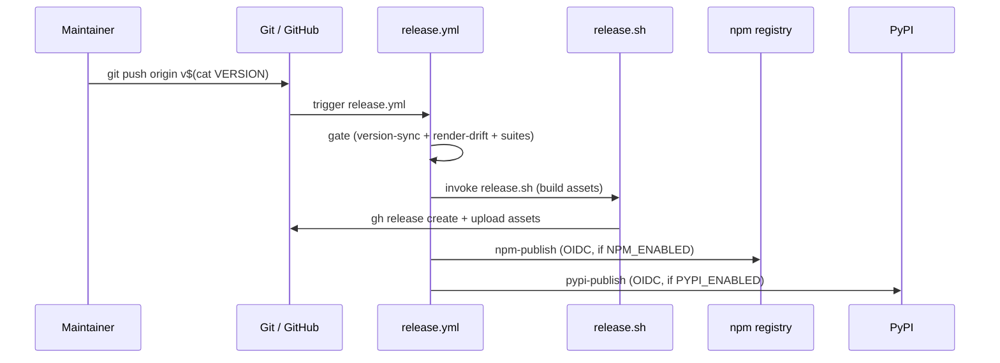
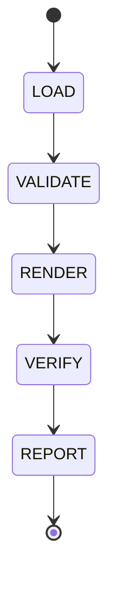

import { Steps, Tabs, TabItem, Aside, CardGrid, LinkCard } from '@astrojs/starlight/components';

## Who this is for

This page is for **maintainers and contributors to AID itself** — people who cut releases
or modify the canonical source and need to keep the five host-tool install trees in sync.

End users of AID (adopters running the pipeline in their own projects) do not need this
page. See the [pipeline guide](/guides/pipeline) instead.

<CardGrid>
  <LinkCard
    title="Cut a release"
    description="Tag-triggered CI path and manual release.sh fallback."
    href="#cut-a-release"
  />
  <LinkCard
    title="Regenerate the host-tool trees/profiles"
    description="Run the generator after canonical/ edits; assert no render drift."
    href="#regenerate-the-host-tool-treesprofiles"
  />
</CardGrid>

---

## Cut a release

The primary release path is a single pushed `v*` tag that triggers the `release.yml` CI
workflow. The manual `release.sh` path is available as a fallback when CI is not
accessible.

### How releases work

A single pushed `v*` tag triggers `release.yml`, which runs four sequential stages:

1. **Gate** — re-runs the full correctness suite (render-drift + canonical helper suites
   + generator self-tests + FR10 version-sync) on the tagged commit.
2. **GitHub Release** — builds five per-profile tarballs, the `aid-cli` bundle, two
   install-core library files, and `SHA256SUMS`; creates the GitHub Release with all
   assets via `release.sh`.
3. **npm** — publishes `aid-installer` to npm with OIDC provenance (gated by the
   `NPM_ENABLED` repo variable).
4. **PyPI** — publishes `aid-installer` to PyPI via Trusted Publishing (OIDC; gated by
   the `PYPI_ENABLED` repo variable).

All four channels — GitHub tarballs, npm, PyPI, and the offline bundle — are produced
from the same tag in one workflow run.



### Prerequisites

Before running either release path:

- **`VERSION` file is set to the intended release version.** `release.yml` enforces that
  the tag, `VERSION`, `packages/npm/package.json`, and `packages/pypi/pyproject.toml` all
  agree (FR10 version-sync gate).
- **Clean, passing CI on master.** Push the tag only from a commit where `test.yml` is
  green.
- **Render-drift clean.** `profiles/` must be in sync with `canonical/`. See the
  [Regenerate trees](#regenerate-the-host-tool-treesprofiles) section below. The gate
  re-runs the check and fails the workflow if they diverge.
- **No existing tag `v<VERSION>`.** Both paths fail early on a collision.
- **`gh` CLI authenticated.** `gh auth status` must show write access to the repo.

```bash
# Quick precondition check
git status
git tag -l "v$(cat VERSION)"
gh auth status
python .claude/skills/generate-profile/scripts/run_generator.py && git diff --exit-code -- profiles/
```

### Primary path (tag-triggered CI) and manual path (release.sh)

<Tabs syncKey="release-path">
<TabItem label="CI path (primary)">

<Steps>
1. **Verify preconditions**

   ```bash
   git status                                     # must be clean
   git tag -l "v$(cat VERSION)"                   # must print nothing
   gh run list --workflow test.yml --limit 5      # confirm CI is green on master
   python .claude/skills/generate-profile/scripts/run_generator.py && git diff --exit-code -- profiles/
   ```

2. **Dry run (optional)**

   Use the `workflow_dispatch` trigger with `dry_run: true` to build and validate without
   publishing:

   ```bash
   gh workflow run release.yml --ref master -f ref="v$(cat VERSION)" -f dry_run=true
   gh run watch   # monitor progress
   ```

3. **Push the version tag**

   ```bash
   git tag "v$(cat VERSION)"
   git push origin "v$(cat VERSION)"
   ```

   This triggers the full `release.yml` run: gate → github-release → npm-publish +
   pypi-publish (in parallel).

4. **Monitor the workflow**

   ```bash
   gh run watch
   ```

   On success, the GitHub Release is live and the package registries are updated. On any
   failure, see [Recovery and idempotency](#recovery-and-idempotency).
</Steps>

</TabItem>
<TabItem label="Manual path (release.sh)">

Use `release.sh` directly when you need to cut a release outside of CI (for example, a
hotfix). It produces the same GitHub Release assets as the CI path but does **not**
publish to npm or PyPI.

<Steps>
1. **Verify preconditions**

   Run `--dry-run` to validate without creating a tag or release:

   ```bash
   bash release.sh --dry-run
   ```

   Expected output:

   ```
   [release.sh] version: 1.0.0  tag: v1.0.0
   [release.sh] checking worktree is clean...  ok
   [release.sh] checking tag v1.0.0 does not exist...  ok
   [release.sh] verifying render-drift gate...  ok
   [release.sh] staging dir: .aid/.temp/release-1.0.0/
   [release.sh] packaging aid-antigravity-v1.0.0.tar.gz...  ok
   [release.sh] packaging aid-claude-code-v1.0.0.tar.gz...  ok
   [release.sh] packaging aid-codex-v1.0.0.tar.gz...  ok
   [release.sh] packaging aid-copilot-cli-v1.0.0.tar.gz...  ok
   [release.sh] packaging aid-cursor-v1.0.0.tar.gz...  ok
   [release.sh] packaging aid-cli-v1.0.0.tar.gz...  ok
   [release.sh] writing SHA256SUMS...  ok
   [release.sh] --dry-run: staging complete. Run without --dry-run to create the GitHub Release.
   ```

   Common failures:

   | Failure | Message | Fix |
   |---------|---------|-----|
   | Dirty worktree | `working tree has uncommitted changes` | `git stash` or commit the changes |
   | Render drift | `profiles/ is out of sync with canonical/` | Run the generator and commit (see [Regenerate trees](#regenerate-the-host-tool-treesprofiles)) |
   | Version mismatch | `--version X does not match VERSION file (Y)` | Drop `--version` or update `./VERSION` |
   | Tag already exists | `tag v1.0.0 already exists` | See [Recovery and idempotency](#recovery-and-idempotency) |

2. **Inspect staged artifacts**

   After a successful dry run:

   ```bash
   ls -lh ".aid/.temp/release-$(cat VERSION)/"
   ```

   Verify the five profile tarballs, the `aid-cli` bundle, two lib files, and
   `SHA256SUMS` are present. Spot-check a tarball:

   ```bash
   tar -tzf ".aid/.temp/release-$(cat VERSION)/aid-claude-code-v$(cat VERSION).tar.gz" | head -20
   cd ".aid/.temp/release-$(cat VERSION)/"
   sha256sum --check SHA256SUMS        # Linux
   shasum -a 256 -c SHA256SUMS         # macOS
   ```

3. **Create a draft release**

   ```bash
   bash release.sh --draft
   ```

   This calls `gh release create "v<VERSION>" --title "AID v<VERSION>" --draft` with all
   assets attached. Open the draft URL on the GitHub web UI, verify all assets and release
   notes, then publish.

   To supply release notes:

   ```bash
   bash release.sh --draft --notes-file /path/to/RELEASE-NOTES.md
   ```

4. **Publish the draft**

   From the GitHub web UI: open the draft release → verify assets and notes → click
   **Publish release**. Or from the CLI:

   ```bash
   gh release edit "v$(cat VERSION)" --draft=false
   ```
</Steps>

</TabItem>
</Tabs>

### What a release produces

`release.sh` (invoked by the CI workflow) stages artifacts under
`.aid/.temp/release-<VERSION>/` and uploads them to the GitHub Release:

**Five per-profile tarballs:**
- `aid-claude-code-v<VERSION>.tar.gz`
- `aid-codex-v<VERSION>.tar.gz`
- `aid-cursor-v<VERSION>.tar.gz`
- `aid-copilot-cli-v<VERSION>.tar.gz`
- `aid-antigravity-v<VERSION>.tar.gz`

**`aid-cli-v<VERSION>.tar.gz`** — the `aid` CLI bundle (bootstrapped by `install.sh` /
`install.ps1` and by `aid update self`).

**Two install-core library files:**
- `aid-install-core.sh` — Bash install-core library sourced by `install.sh`.
- `AidInstallCore.psm1` — PowerShell install-core module imported by `install.ps1`.

**`SHA256SUMS`** — one `<64-hex>  <filename>` line per asset, sorted by filename.

Each tarball contains exactly the install-relevant files for that tool (dot directory
tree + root agent file). The layout is flat/root-relative — `tar -xzf` into a temp
directory yields the files as they land in the target project. No tarball should contain
`README.md` or `emission-manifest.jsonl`.

**npm:** `aid-installer` published at the version from `packages/npm/package.json`.

**PyPI:** `aid-installer` published at the version from `packages/pypi/pyproject.toml`.

### Recovery and idempotency

<Aside type="caution">
**Read this section before re-running a failed release.** The npm-publish and
pypi-publish jobs are idempotent (they skip with a notice if the version is already
published), but the GitHub Release step is not automatically cleaned up.
</Aside>

**Dry run is always safe to re-run.** `--dry-run` never creates a tag, never calls `gh`,
and overwrites the staging directory on each run.

**If the CI workflow fails mid-publish:** Re-triggering `workflow_dispatch` with the same
tag is safe for the npm/PyPI jobs. If `github-release` fails mid-upload:

1. Delete the draft release: GitHub web UI → Releases → Edit → Delete.
2. Delete the local tag: `git tag -d v1.0.0`
3. Delete the remote tag: `git push origin :refs/tags/v1.0.0`
4. Fix the root cause and re-run from Step 1.

**If the tag already exists but no release exists:**

```bash
git tag -d v1.0.0
git push origin :refs/tags/v1.0.0
# Then re-run
git tag v1.0.0 && git push origin v1.0.0
```

**Staging directory cleanup:** the staging directory at `.aid/.temp/release-<VERSION>/`
is gitignored. Clean it up when no longer needed:

```bash
rm -rf ".aid/.temp/release-$(cat VERSION)/"
```

### Flag reference (release.sh)

```bash
bash release.sh [--version X.Y.Z] [--sign] [--draft] [--dry-run]
                [--notes-file FILE] [-h|--help]
```

| Flag | Default | Description |
|------|---------|-------------|
| `--version X.Y.Z` | content of `VERSION` file | Release version. Must match `VERSION` file; fails on mismatch (exit 3). |
| `--sign` | off | Emit a detached signature over `SHA256SUMS`. Currently exits non-zero — signing is deferred. Do not use. |
| `--draft` | off | Create the GitHub Release as a draft. Recommended: always draft first, review, then publish. |
| `--dry-run` | off | Assemble tarballs and `SHA256SUMS`, stop before `gh release create`. No network I/O; no tag created. |
| `--notes-file FILE` | generated stub | Release notes body passed to `gh release create`. |
| `-h`, `--help` | — | Print help and exit 0. |

**Exit codes:**

| Code | Meaning |
|------|---------|
| `0` | Success (dry-run: staging complete; live: release created). |
| `1` | General failure (dirty worktree, render-drift, `gh` error). |
| `2` | Usage / argument error. |
| `3` | Version mismatch (`--version` does not match `VERSION` file). |
| `4` | Tag already exists (local git tag or GitHub Release). |

---

## Regenerate the host-tool trees/profiles

AID maintains five host-tool install trees (`claude-code/`, `codex/`, `cursor/`,
`copilot-cli/`, `antigravity/`) generated from a single canonical source
(`canonical/`) and per-tool profiles (`profiles/*.toml`). This section explains how to
keep them in sync.

### When to run

Run the generator any time you edit a canonical skill, agent, or template — and before
committing install-tree changes. Also run it to verify the trees are in sync after any
manual edits.

The render-drift CI convention requires that committed `profiles/` content matches a
fresh render. The `release.yml` gate re-runs this check and fails the workflow if they
diverge — so unclean profiles block releases. See the
[Cut a release → Prerequisites](#prerequisites) section above.

### What it does

The generator reads `canonical/` and `profiles/*.toml`, then renders the five install
trees. It runs through a five-state machine:



| State | What happens |
|-------|-------------|
| **LOAD** | Parse each profile TOML; load the previous emission manifest (if any). |
| **VALIDATE** | Confirm canonical completeness — the full skill and agent set (14 skills, 9 agents) and non-empty templates. |
| **RENDER** | Run the three renderers (`render_agents.py`, `render_skills.py`, `render_templates.py`) per profile; write the emission manifest; run the deletion pass (live mode only). |
| **VERIFY** | Hard-gate: byte-identical re-render check + presence audit + frontmatter parse. Advisory: conformance check (always exits 0; surfaces warnings in REPORT). |
| **REPORT** | Print a summary: profiles rendered, files emitted/deleted per profile, verify results, `git diff --stat`. |

**Emission-manifest safety boundary:** the generator only writes to and deletes files it
previously emitted (recorded in `profiles/{tool}/emission-manifest.jsonl`). User-created
files inside install trees are never touched.

### Prerequisites

- **Python 3.11+** (required for `tomllib`, stdlib from 3.11):
  ```bash
  python --version
  ```
- **A git working tree** (for the REPORT `git diff --stat`):
  ```bash
  git rev-parse --git-dir
  ```
- **At least one profile TOML** under `profiles/`.
- **`canonical/` directory** at the repo root with `agents/`, `skills/`, `templates/`,
  and `rules/` subdirectories.

### Regenerate all trees

<Steps>
1. **Run the full generator**

   ```bash
   python .claude/skills/generate-profile/scripts/run_generator.py
   ```

   The script takes no command-line arguments. It always runs the full LOAD → VALIDATE
   → RENDER → VERIFY → REPORT state machine for all five profiles.

2. **Assert no render drift**

   ```bash
   git diff --exit-code -- profiles/
   ```

   Exit 0 means the committed trees already matched the canonical source (no changes).
   A non-zero exit means the generator produced a diff — review and commit the changes.

3. **Commit any changes**

   ```bash
   git add profiles/
   git commit -m "regen: sync install trees with canonical/"
   ```
</Steps>

<Aside type="tip">
**Always run the full `run_generator.py`, not individual renderer scripts.** Running a
single renderer (e.g. `render_skills.py` directly) leaves the emission manifest stale,
which causes the render-drift CI check to fail. The full generator updates manifests and
runs the deletion pass atomically.
</Aside>

### Regenerate one tree or dry-run

The `/generate-profile` skill (invoked inside your AI tool) exposes two flags for targeted
and non-destructive runs. These flags are parsed by the **skill**, not by
`run_generator.py` (which takes no arguments):

**`--tool <name>`** — regenerate only one install tree. Valid values:
`claude-code`, `codex`, `cursor`, `copilot-cli`, `antigravity`.

Example: `/generate-profile --tool cursor` regenerates only the Cursor install tree.

**`--dry-run`** — render to a temporary scratch directory and print a diff report
without writing to the install trees or updating the emission manifest. Safe to run
at any time.

Example: `/generate-profile --dry-run` lets you preview what would change before committing.

Combining both: `/generate-profile --tool claude-code --dry-run` previews changes for a
single profile without touching the live install tree.

### Verify and report

After `run_generator.py` completes, the VERIFY and REPORT states run automatically.
Check the output for:

- **VERIFY (deterministic): PASS** — byte-identical re-render check passed. If this
  fails, the generator output is non-deterministic; do not commit.
- **VERIFY (advisory):** review `skipped_count` (URLs pending fetch) and `warning_count`.
  Advisory failures do not block commits.
- **Git diff section** — confirms only install-tree paths changed (no `canonical/`
  modifications).

Confirm with:

```bash
git diff --stat -- profiles/claude-code/ profiles/codex/ profiles/cursor/ profiles/copilot-cli/ profiles/antigravity/
```

The stat output should show only paths under `profiles/` — never `canonical/` or
`.claude/`.

<LinkCard
  title="Repository structure reference"
  description="Full layout of the AID repository — canonical/, profiles/, and install tree conventions."
  href="/reference/repository-structure"
/>
