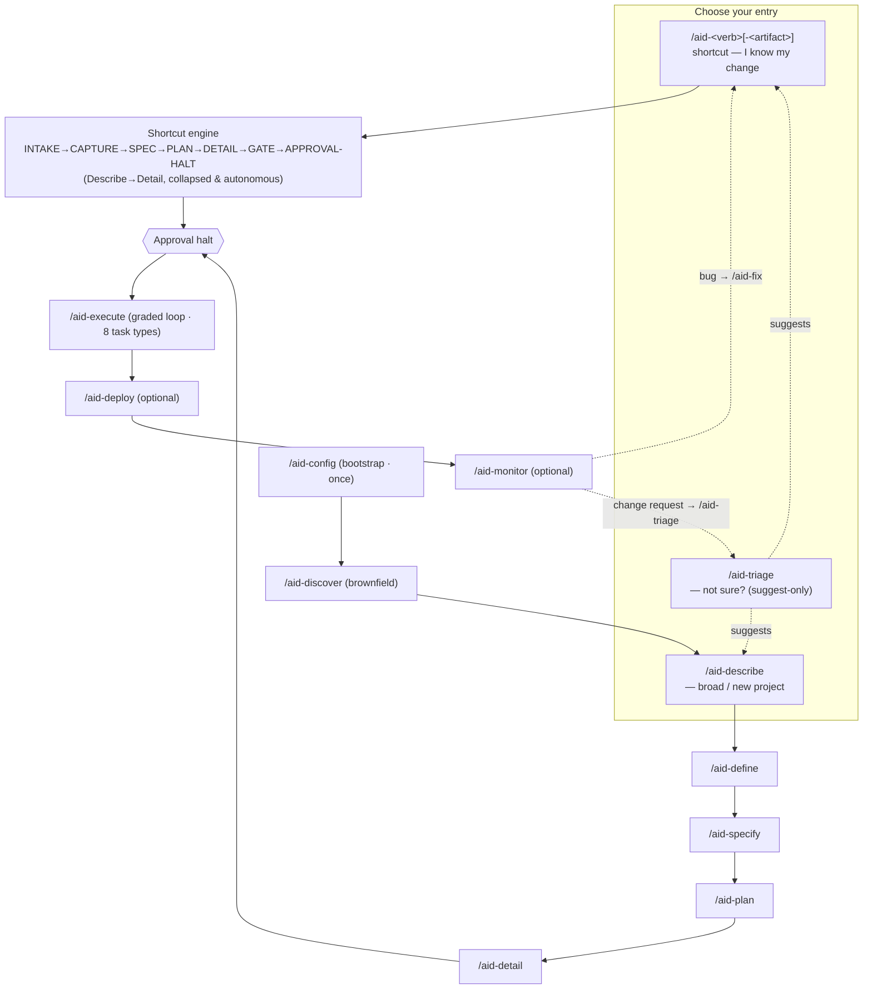

import { Steps, Tabs, TabItem, Aside, CardGrid, LinkCard } from '@astrojs/starlight/components';

## Before you start

This page is the **how** — a step-by-step guide to driving a real piece of work through
the AID methodology from discovery to deployment.

Before running the pipeline, make sure AID is installed and added to your project. See the
[Installation guide](/guides/installation) for the one-liner bootstrap and the `aid add <tool>` step.

For the **why** behind each phase — the mental model, the philosophy, the full methodology
explanation — read the [Methodology](/concepts/methodology) concept page. This guide does not
duplicate that depth; it points you at the right command and artifact for each step.

## The pipeline at a glance

The diagram shows three ways in: a **shortcut** if you already know your change, `/aid-triage`
if you're not sure, or `/aid-describe` for broad or new-project work. `/aid-config` bootstraps
the project once; brownfield projects run `/aid-discover` before Describe, greenfield projects
go directly from Configure to Describe. A shortcut runs the shared **shortcut engine** — a
collapsed, autonomous Describe→Detail — straight to the approval halt; `/aid-describe` walks
each phase through its own human gate instead. Both converge on the same halt before Execute.
The Deliver skills (deploy + monitor) are optional; Monitor routes bug findings to `/aid-fix`
and change-request findings to `/aid-triage`, closing the loop.

## Step 0 — Configure (`/aid-config`)

Run `/aid-config` once before starting any new piece of work. It scaffolds or inspects
`.aid/settings.yml` and lets you set the project name, review grade threshold, and other
workspace-level options.

<Steps>
1. **Invoke the skill** — type `/aid-config` in your AI tool.

2. **Review the generated settings file** — the skill creates or updates
   `.aid/settings.yml`. Confirm the `project.name` and `review.grade` fields.

3. **Commit the settings file** — `.aid/settings.yml` is checked in. All agents read
   it; keep it accurate.
</Steps>

<Aside type="tip">
Re-run `/aid-config` any time you want to inspect or change workspace settings. It is
idempotent — running it on an existing project does not reset your configuration.
</Aside>

## The six phases

Each phase has a corresponding `/aid-*` skill. Invoke the skill in your AI tool; the
skill runs its state machine and produces the named artifact.

### Phase 1 — Discover (`/aid-discover`)

**Brownfield projects only.** The Discover skill analyses an existing repository and
populates the Knowledge Base with what it finds (architecture, conventions, existing
patterns). State machine: GENERATE → REVIEW → … → DONE.

**Artifact produced:** `.aid/knowledge/` entries describing the existing codebase.

<Aside type="note">
**Greenfield projects skip this phase.** If you are starting a brand-new repository with
no existing code, go directly to Phase 2 (Describe → Define).
</Aside>

<LinkCard
  title="Skills reference"
  description="Full roster of AID skills with descriptions and argument hints."
  href="/reference/skills"
/>

### Phase 2a — Describe (`/aid-describe`)

The Describe skill gathers requirements conversationally — full path only. It asks you
structured questions about your goals, constraints, and scope through its elicitation engine,
then writes `REQUIREMENTS.md`. State machine:
`FIRST-RUN → Q-AND-A → CONTINUE → {greenfield: DESCRIBE-SEED →} COMPLETION [PAUSE → /aid-define]`. It no longer triages or
produces lite work — for a small, well-scoped change, invoke a shortcut or ask `/aid-triage`
instead (see [Lite path quickstart](/get-started/lite-path/)).

**Artifact produced:** `REQUIREMENTS.md`.

### Phase 2b — Define (`/aid-define`)

The Define skill (full path only) begins from an approved `REQUIREMENTS.md` and
decomposes requirements into feature files under `.aid/<work>/features/`, then cross-references
and grades the decomposition.

**Artifact produced:** `REQUIREMENTS.md` + `features/feature-NNN-*.md` stubs.

<LinkCard
  title="Skills reference"
  description="Full roster of AID skills with descriptions and argument hints."
  href="/reference/skills"
/>

### Phase 3 — Specify (`/aid-specify`)

The Specify skill writes a technical specification for one feature at a time. Point it at
a feature file; it reads `REQUIREMENTS.md`, the Knowledge Base, and the feature stub,
then appends a `SPEC.md` section with design decisions and an acceptance-criteria mapping.

**Artifact produced:** `SPEC.md` appended to `features/feature-NNN-*.md`.

**Run once per feature** — repeat this phase for each feature before moving to Plan.

<LinkCard
  title="Skills reference"
  description="Full roster of AID skills with descriptions and argument hints."
  href="/reference/skills"
/>

### Phase 4 — Plan (`/aid-plan`)

The Plan skill reads all your feature specs and sequences them into a delivery roadmap.
It decides which features go into which delivery, respecting dependencies, writes `PLAN.md`
with the strategy, and creates a `deliveries/delivery-NNN/` folder per delivery with its
`BLUEPRINT.md` — the delivery definition (scope, gate criteria, dependencies).

**Artifact produced:** `PLAN.md` — the delivery sequence and dependency graph — plus one
`deliveries/delivery-NNN/BLUEPRINT.md` per delivery.

<LinkCard
  title="Skills reference"
  description="Full roster of AID skills with descriptions and argument hints."
  href="/reference/skills"
/>

### Phase 5 — Detail (`/aid-detail`)

The Detail skill breaks a delivery into typed tasks and produces an execution graph. Each
task gets its own `deliveries/delivery-NNN/tasks/task-NNN/` folder with a `DETAIL.md` — the
task definition — covering one of the eight task types (RESEARCH, DESIGN, IMPLEMENT, TEST,
DOCUMENT, MIGRATE, REFACTOR, CONFIGURE), acceptance criteria, and dependencies.

**Artifact produced:** `deliveries/delivery-NNN/tasks/task-NNN/DETAIL.md` files + an
execution graph.

**Run once per delivery** — repeat for each delivery in your plan.

<LinkCard
  title="Skills reference"
  description="Full roster of AID skills with descriptions and argument hints."
  href="/reference/skills"
/>

### Phase 6 — Execute (`/aid-execute`)

The Execute skill picks up a typed task and implements it on a per-delivery branch, with
a built-in review loop. The Developer agent writes the code; the Reviewer agent grades it
against the task's acceptance criteria; failing grades loop back for revision.

**Artifact produced:** committed code on a delivery branch, graded and merged.

**Run once per task** — repeat for each task in the execution graph, respecting the
dependency order.

<Aside type="tip">
The Execute skill tracks the current delivery branch automatically. Run tasks in
dependency order; the skill warns you if a dependency is not yet complete.
</Aside>

<LinkCard
  title="Skills reference"
  description="Full roster of AID skills with descriptions and argument hints."
  href="/reference/skills"
/>

## Delivering: deploy and monitor (optional)

After all Execute tasks are complete, the optional **Deliver** skills package and observe
the work.

### Deploy (`/aid-deploy`)

The Deploy skill packages completed deliveries into a release — tarballs, changelogs, and
registry publishes. It reads the delivery branch state and the `VERSION` file, and
invokes the release pipeline.

### Monitor (`/aid-monitor`)

The Monitor skill observes the deployed system, classifies incoming findings, and routes
actionable items to the entry point that fits: a finding classified **BUG** routes to
`/aid-fix`; a finding classified **change request** routes to `/aid-triage`. This closes the
feedback loop.

<Aside type="note">
Neither Deliver skill is required to use AID. Many teams run the six core phases and
handle deployment through their existing CI/CD pipeline without `/aid-deploy` or
`/aid-monitor`.
</Aside>

## Lite vs full path

Not every change needs all six phases. For small, well-scoped work, skip the full pipeline
entirely: invoke the matching **shortcut** (`/aid-fix`, `/aid-create-api`, …), or ask
`/aid-triage` if you're not sure which one fits. The shortcut engine collapses Describe
through Detail into one fast, mostly-autonomous run and produces the same flattened artifact
set before halting for your approval — see [Lite path quickstart](/get-started/lite-path/)
for the flow and the [Methodology](/concepts/methodology) page for when a shortcut is the
right call versus the full pipeline.

The [Installation guide](/guides/installation) also covers the quick-start flow for new
adopters who want to get something working before reading the full pipeline.

## Next steps

<CardGrid>
  <LinkCard
    title="CLI reference"
    description="All AID subcommands, flags, and exit codes."
    href="/reference/cli"
  />
  <LinkCard
    title="Skills reference"
    description="Full roster of AID skills with descriptions and argument hints."
    href="/reference/skills"
  />
  <LinkCard
    title="Agents reference"
    description="The specialist agents that AID dispatches during Execute."
    href="/reference/agents"
  />
  <LinkCard
    title="Methodology"
    description="The why behind the pipeline — mental model and design decisions."
    href="/concepts/methodology"
  />
  <LinkCard
    title="Maintainer guide"
    description="Cut a release and regenerate host-tool install trees."
    href="/guides/maintainer"
  />
</CardGrid>
