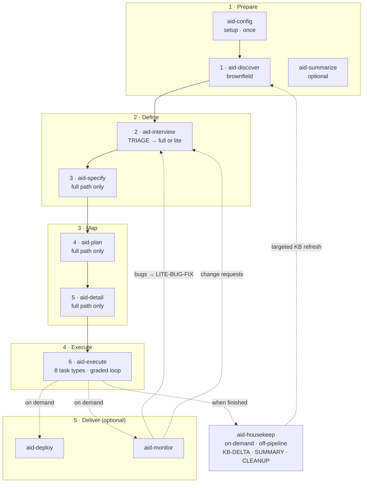

import InstallCommand from '../../components/InstallCommand.astro';
import VersionBadge from '../../components/VersionBadge.astro';
import { CardGrid, LinkCard } from '@astrojs/starlight/components';

## Why AID?

Most AI-assisted development today is ad hoc: a chat, a suggestion, a quick edit. That works for isolated tasks — but it breaks down when the work spans discovery, specification, planning, implementation, and delivery. Without structure, AI agents repeat the same mistakes that plagued unassisted development: incomplete understanding, drifting requirements, unreviewed output.

AID gives AI-assisted development the structure it needs. A six-phase pipeline — Discover → Interview → Specify → Plan → Detail → Execute — carries a work item from first contact to delivered code, with the human approving every gate. The result is traceable, repeatable, and genuinely grounded in how the codebase works.

The full pipeline runs when the scope demands it. For small, well-bounded changes, the **lite path** skips Specify, Plan, and Detail and goes straight to execution — the same rigour, proportionate overhead.

## The Pipeline

*Eleven user-facing skills, five groups. The six numbered phases form the mandatory sequential pipeline. `/aid-interview`'s TRIAGE routes small work to the lite path automatically.*

See the [full methodology explanation](/concepts/methodology/) for the complete phase guide, philosophy, and lite-vs-full routing logic.

## Install in one line

Current release: <VersionBadge href="/releases/changelog/" />

<InstallCommand channel="curl" />

[All install channels (npm, PyPI, Windows, offline)](/guides/installation/)

## Explore the docs

<CardGrid>
  <LinkCard title="Get Started" href="/get-started/overview/" description="What AID is, install it, run your first work." />
  <LinkCard title="Guides" href="/guides/installation/" description="Installation across every channel and the full pipeline how-to." />
  <LinkCard title="Concepts" href="/concepts/methodology/" description="The methodology, phases, philosophy, and FAQ." />
  <LinkCard title="Reference" href="/reference/overview/" description="CLI, repository structure, settings, and glossary." />
  <LinkCard title="Releases" href="/releases/changelog/" description="Every release, with offline bundle assets." />
</CardGrid>
