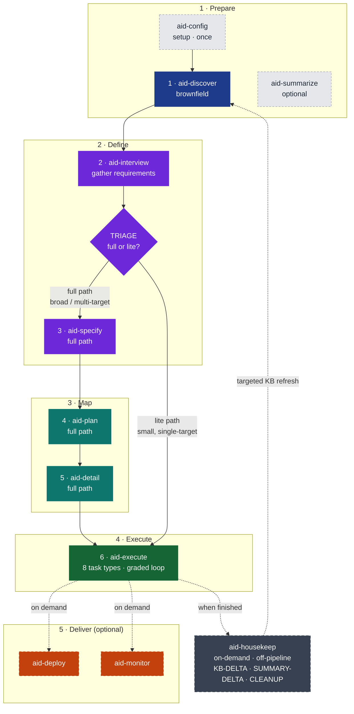

import { Tabs, TabItem, LinkCard, CardGrid } from '@astrojs/starlight/components';
import InstallCommand from '../../components/InstallCommand.astro';
import VersionBadge from '../../components/VersionBadge.astro';

AID — **AI Integrated Development** — is a methodology and toolchain for building software with AI
coding agents. A structured, human-gated pipeline carries a work item from first understanding all
the way to delivered code, without the ad-hoc drift of unstructured AI assistance. "Integrated"
is the point: the human and the AI co-execute every phase — the AI proposes, the human steers, and
nothing advances without an explicit OK.

These docs are the reference for both the **methodology** and the **tool** that ships it. If you are
new, read on; the sections are ordered the way you will actually use AID.

## The pipeline at a glance

Every work item moves through the same phases. Each produces a reviewable artifact and ends at a
**human gate** — you approve before the next phase begins. The flow starts at configuration and ends
at delivered, optionally monitored, code.

*Eleven user-facing skills · five groups · two paths (TRIAGE-routed). The six numbered
phases — Discover through Execute — are the mandatory pipeline; TRIAGE routes small,
single-target work down the **lite path** straight to Execute.*

The six core phases, in order:

1. **Discover** — map an existing codebase into a Knowledge Base the agents can reason over. (Brownfield only; greenfield starts at Interview.)
2. **Interview** — gather requirements conversationally; TRIAGE routes small work to the lite path automatically.
3. **Specify** — turn each feature into a technical SPEC, with an agent acting as tech lead.
4. **Plan** — sequence SPECs into deliveries, each a functional, buildable MVP.
5. **Detail** — break deliveries into small, typed, dependency-ordered tasks.
6. **Execute** — run each task with a built-in adversarial review loop until it clears the grade bar.

Eleven user-facing skills across five groups deliver these phases. When the work is small and
well-scoped, the **lite path** skips Specify, Plan, and Detail — the same rigour, proportionate
overhead.

## Install

AID installs as a global `aid` CLI; you then run `aid add <tool>` inside a repository to drop the
skills, agents, and Knowledge Base scaffold into your project. Pick the channel for your platform:

<Tabs syncKey="install-channel">
  <TabItem label="macOS / Linux"><InstallCommand channel="curl" /></TabItem>
  <TabItem label="Windows"><InstallCommand channel="irm" /></TabItem>
  <TabItem label="npm"><InstallCommand channel="npm" /></TabItem>
  <TabItem label="PyPI"><InstallCommand channel="pypi" /></TabItem>
</Tabs>

Current release: <VersionBadge href="/releases/changelog/" />. After install, run `aid add claude-code`
(or another tool), then `/aid-config` in your AI tool to scaffold the Knowledge Base.
The [Installation guide](/guides/installation/) covers every channel, per-OS detail, updates, and removal.

## How to navigate these docs

The docs are organized to match the order you will actually use AID.

<CardGrid>
  <LinkCard
    title="Get Started"
    href="/get-started/overview/"
    description="Install AID, run your first work item, and try the lite quickstart path."
  />
  <LinkCard
    title="Guides"
    href="/guides/installation/"
    description="Task-focused walkthroughs: installation, working the pipeline, and maintaining a release."
  />
  <LinkCard
    title="Concepts"
    href="/concepts/methodology/"
    description="The methodology in depth — the pipeline, philosophy, the Knowledge Base, and the FAQ."
  />
  <LinkCard
    title="Reference"
    href="/reference/overview/"
    description="Exhaustive lookups: CLI, skills, agents, the KB, settings, artifacts, and the glossary."
  />
</CardGrid>
