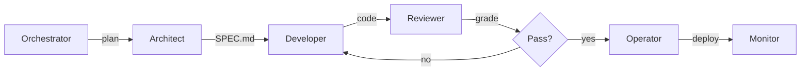

This page proves the Mermaid integration is working (AC5 enabler).

## AID Pipeline Overview

The diagram above shows the high-level AID agent pipeline: the Orchestrator coordinates
the Architect, Developer, Reviewer, Operator, and Monitor agents through iterative cycles.
