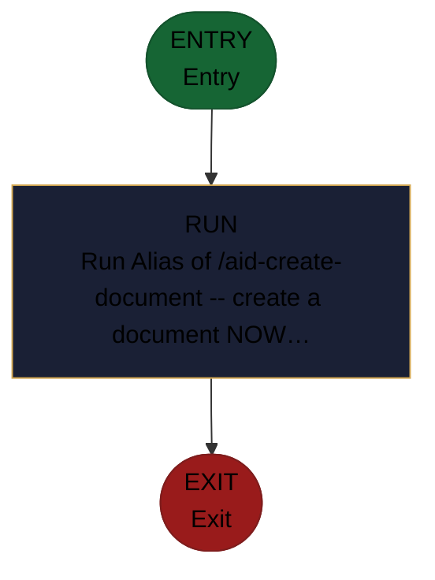

<!-- generated — do not edit; source: canonical/skills/aid-add-document/SKILL.md -->

## Frontmatter

- **`name`** — aid-add-document
- **`description`** — Alias of /aid-create-document -- create a document NOW (markdown/reference/how-to, an ADR, an architecture write-up, a runbook, a tutorial, a changelog, a mermaid diagram, a table), determining the format AND structure from the request, in one pass. Grounded in and accuracy-checked against the Knowledge Base (.aid/knowledge/) and the project source; produced by aid-tech-writer, verified by aid-reviewer. It RESOLVES NOTHING -- drafts, you approve, then it is placed. NEVER writes into .aid/knowledge/. This file carries no logic of its own -- its full behavior is defined by canonical/skills/aid-create-document/SKILL.md.
- **`allowed-tools`** — Read, Glob, Grep, Bash, Write, Edit, Agent
- **`argument-hint`** — &lt;subject> -- what to document

[Definition: `canonical/skills/aid-add-document/SKILL.md`](https://github.com/AndreVianna/aid-methodology/blob/master/canonical/skills/aid-add-document/SKILL.md)

## Flow

> **Approximate:** This chart is derived by heuristic; exact transitions may differ from runtime behaviour.

