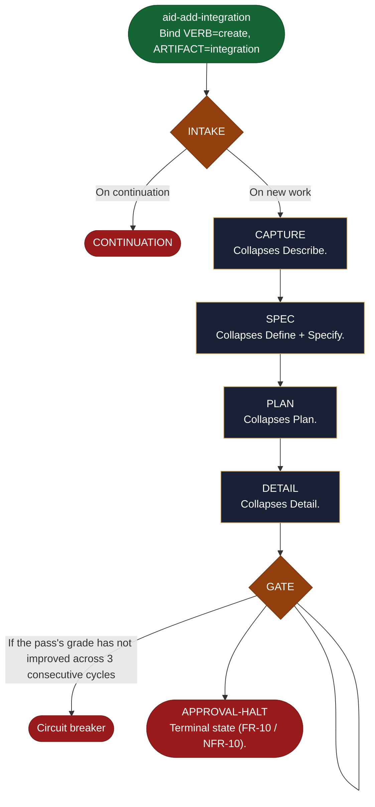

<!-- generated — do not edit; source: canonical/skills/aid-add-integration/SKILL.md -->

## Frontmatter

- **`name`** — aid-add-integration
- **`description`** — Direct-entry Lite-path shortcut (Alias of aid-create-integration.) -- skips the aid-describe interview/triage. Binds VERB=`create` ARTIFACT=`integration` and runs the shared shortcut engine, producing a fully-graded flattened Lite work that halts for approval. State machine: delegated to canonical/aid/templates/shortcut-engine.md (INTAKE -> CAPTURE -> SPEC -> PLAN -> DETAIL -> GATE -> APPROVAL-HALT).
- **`allowed-tools`** — Read, Glob, Grep, Bash, Write, Edit, Agent
- **`argument-hint`** — [description]  -- what to create; runs straight to a graded flattened Lite work

[Definition: `canonical/skills/aid-add-integration/SKILL.md`](https://github.com/AndreVianna/aid-methodology/blob/master/canonical/skills/aid-add-integration/SKILL.md)

## Flow

