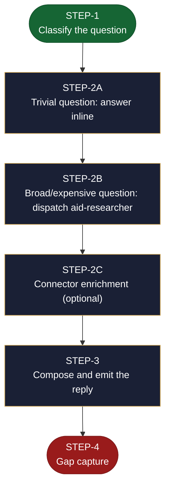

<!-- generated — do not edit; source: canonical/skills/aid-ask/SKILL.md -->

## Frontmatter

- **`name`** — aid-ask
- **`description`** — Answer a question about this project, with citations. Use this skill when you want to know something -- how a part of the system works, what a document says, where a piece of work stands -- and you want a grounded answer rather than a guess. It reads three sources: the Knowledge Base, the live codebase, and any AID work currently in flight, and cites whichever it used, by document name, file path, or work reference. When those sources genuinely cannot answer, it says so instead of inventing an answer, and records the gap so it feeds back into improving the Knowledge Base. Trivial questions are answered inline; broad investigations are dispatched read-only. The only thing it ever writes is that recorded gap.
- **`allowed-tools`** — Read, Glob, Grep, Agent, Write, Edit
- **`argument-hint`** — &lt;question>  — a free-form question about the project

[Definition: `canonical/skills/aid-ask/SKILL.md`](https://github.com/AndreVianna/aid-methodology/blob/master/canonical/skills/aid-ask/SKILL.md)

## Flow

> **Approximate:** This chart is derived by heuristic; exact transitions may differ from runtime behaviour.

## Source fragments

Every node in the chart above, in chart order, with the exact `canonical/` text it was derived from.

**1 · `STEP-1`** — Classify the question · _entry_

~~~~plaintext title="canonical/skills/aid-ask/SKILL.md#L51" wrap
### Step 1 — Classify the question
~~~~

[Source: `canonical/skills/aid-ask/SKILL.md#L51`](https://github.com/AndreVianna/aid-methodology/blob/master/canonical/skills/aid-ask/SKILL.md#L51)

**2 · `STEP-2A`** — Trivial question: answer inline · _step_

~~~~plaintext title="canonical/skills/aid-ask/SKILL.md#L63" wrap
### Step 2a — Trivial question: answer inline
~~~~

[Source: `canonical/skills/aid-ask/SKILL.md#L63`](https://github.com/AndreVianna/aid-methodology/blob/master/canonical/skills/aid-ask/SKILL.md#L63)

**3 · `STEP-2B`** — Broad/expensive question: dispatch aid-researcher · _step_

~~~~plaintext title="canonical/skills/aid-ask/SKILL.md#L77" wrap
### Step 2b — Broad/expensive question: dispatch aid-researcher
~~~~

[Source: `canonical/skills/aid-ask/SKILL.md#L77`](https://github.com/AndreVianna/aid-methodology/blob/master/canonical/skills/aid-ask/SKILL.md#L77)

**4 · `STEP-2C`** — Connector enrichment (optional) · _step_

~~~~plaintext title="canonical/skills/aid-ask/SKILL.md#L102" wrap
### Step 2c — Connector enrichment (optional)
~~~~

[Source: `canonical/skills/aid-ask/SKILL.md#L102`](https://github.com/AndreVianna/aid-methodology/blob/master/canonical/skills/aid-ask/SKILL.md#L102)

**5 · `STEP-3`** — Compose and emit the reply · _step_

~~~~plaintext title="canonical/skills/aid-ask/SKILL.md#L112" wrap
### Step 3 — Compose and emit the reply
~~~~

[Source: `canonical/skills/aid-ask/SKILL.md#L112`](https://github.com/AndreVianna/aid-methodology/blob/master/canonical/skills/aid-ask/SKILL.md#L112)

**6 · `STEP-4`** — Gap capture · _exit_ · UNSPECIFIED

~~~~plaintext title="canonical/skills/aid-ask/SKILL.md#L159" wrap
### Step 4 -- Gap capture
~~~~

[Source: `canonical/skills/aid-ask/SKILL.md#L159`](https://github.com/AndreVianna/aid-methodology/blob/master/canonical/skills/aid-ask/SKILL.md#L159)
