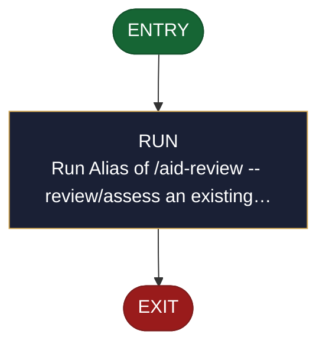

<!-- generated — do not edit; source: canonical/skills/aid-audit/SKILL.md -->

## Frontmatter

- **`name`** — aid-audit
- **`description`** — Alias of /aid-review -- review/assess an existing artifact (code, a change/diff, a design, a PR, a ticket, a document, a UI, ...) against criteria and return findings + recommendations NOW, in one pass. Single-shot, grounded in the Knowledge Base (.aid/knowledge/) and the project source, produced by the aid-reviewer agent in a clean context and independently verified; you approve before anything is published to an external target. This file carries no logic of its own -- its full behavior is defined by canonical/skills/aid-review/SKILL.md.
- **`allowed-tools`** — Read, Glob, Grep, Bash, Write, Edit, Agent
- **`argument-hint`** — [target] -- what to review (a file/dir, PR link, ticket id, work-NNN, 'my changes', or a described target)

[Definition: `canonical/skills/aid-audit/SKILL.md`](https://github.com/AndreVianna/aid-methodology/blob/master/canonical/skills/aid-audit/SKILL.md)

## Flow

> **Approximate:** This chart is derived by heuristic; exact transitions may differ from runtime behaviour.

