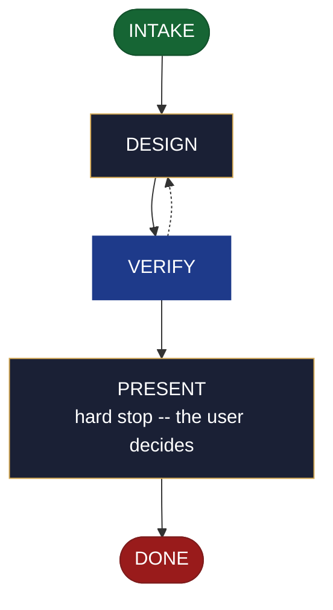

<!-- generated — do not edit; source: canonical/skills/aid-brainstorm/SKILL.md -->

## Frontmatter

- **`name`** — aid-brainstorm
- **`description`** — Diverge on a problem not yet formed into an answerable question, then converge it to a DESIGN SEED in `.aid/design/<slug>.md` -- exploration, framings, and the candidate directions worth pursuing. Use this skill when a problem space is still open and you want to explore it, rather than answer one specific question. Grounded in the Knowledge Base (`.aid/knowledge/`) and the project source. It WRITES NO production code and NO KB document, and it RESOLVES NOTHING -- you decide what to do with the seed. For an already-answerable technical question that wants a curated, verified answer, use `/aid-research` instead. Produced by the aid-architect agent and independently verified by aid-reviewer. Allocates a work-NNN folder.
- **`allowed-tools`** — Read, Glob, Grep, Bash, Write, Edit, Agent
- **`argument-hint`** — &lt;subject> -- a fuzzy problem or theme to explore (not yet a formed question)

[Definition: `canonical/skills/aid-brainstorm/SKILL.md`](https://github.com/AndreVianna/aid-methodology/blob/master/canonical/skills/aid-brainstorm/SKILL.md)

## Flow

## Source fragments

Every node in the chart above, in chart order, with the exact `canonical/` text it was derived from.

**1 · `INTAKE`** · _entry_

~~~~plaintext title="canonical/skills/aid-brainstorm/SKILL.md#L37-L50" wrap
## State: INTAKE

1. **Require a subject.** Empty argument -> ask one bootstrapping question ("What problem
   or theme do you want to explore?") and wait. The subject may be fuzzy -- an unformed
   problem is exactly this skill's case, so INTAKE never refuses an argument for not being
   a question.
2. **Confirm the seed slug.** Because `artifact` is empty, feature-002 §4's `<token>` =
   `artifact` rule does not apply: derive a kebab-case `<slug>` from the subject and
   **confirm it with the user**, then the seed is `.aid/design/<slug>.md`.
3. **Allocate** through the Work Initiation Gate exactly as the contract's Allocation rule
   requires (`canonical/skills/aid-design/SKILL.md` INTAKE step 4 is the shape), with
   `initiator: aid-brainstorm`. `phase` is not driven. The `work-NNN` folder is where
   `STATE.md` and the review gate live, even though the seed is the deliverable.
4. **Classify complexity** for the `aid-architect` dispatch (verifier tier >= producer).
~~~~

[Source: `canonical/skills/aid-brainstorm/SKILL.md#L37-L50`](https://github.com/AndreVianna/aid-methodology/blob/master/canonical/skills/aid-brainstorm/SKILL.md#L37-L50) · [full step: `canonical/skills/aid-brainstorm/SKILL.md#L37-L52`](https://github.com/AndreVianna/aid-methodology/blob/master/canonical/skills/aid-brainstorm/SKILL.md#L37-L52)

**2 · `DESIGN`** · _step_

~~~~plaintext title="canonical/skills/aid-brainstorm/SKILL.md#L56-L64" wrap
## State: DESIGN

Dispatch **`aid-architect`** (clean context, tiered) to write or iterate
`.aid/design/<slug>.md` in the seed shape the contract fixes (`design-seed.md`;
feature-002 §4), grounded in `.aid/knowledge/` and the project source plus any prior seed.
It diverges -- framings, angles, prior art -- then converges to the candidate directions
worth pursuing. The seed's `## Destination` is **optional** here: brainstorm has no fixed
destination until the user promotes the seed. **Never writes `.aid/knowledge/` and never
writes production code** -- the `design` invariant (`design-lifecycle.md`).
~~~~

[Source: `canonical/skills/aid-brainstorm/SKILL.md#L56-L64`](https://github.com/AndreVianna/aid-methodology/blob/master/canonical/skills/aid-brainstorm/SKILL.md#L56-L64) · [full step: `canonical/skills/aid-brainstorm/SKILL.md#L56-L66`](https://github.com/AndreVianna/aid-methodology/blob/master/canonical/skills/aid-brainstorm/SKILL.md#L56-L66)

**3 · `VERIFY`** · _loop-back_

~~~~plaintext title="canonical/skills/aid-brainstorm/SKILL.md#L70-L73" wrap
## State: VERIFY

**Full verify**, as `design-lifecycle.md` defines it. Not clean -> loop to DESIGN; the
3-cycle circuit breaker there escalates to IMPEDIMENT + `lifecycle: Blocked`.
~~~~

[Source: `canonical/skills/aid-brainstorm/SKILL.md#L70-L73`](https://github.com/AndreVianna/aid-methodology/blob/master/canonical/skills/aid-brainstorm/SKILL.md#L70-L73) · [full step: `canonical/skills/aid-brainstorm/SKILL.md#L70-L75`](https://github.com/AndreVianna/aid-methodology/blob/master/canonical/skills/aid-brainstorm/SKILL.md#L70-L75)

**4 · `PRESENT`** — hard stop -- the user decides · _step_

~~~~plaintext title="canonical/skills/aid-brainstorm/SKILL.md#L79-L83" wrap
## State: PRESENT (hard stop -- the user decides)

Set `lifecycle: Paused-Awaiting-Input`. Present the seed clearly. Assert no resolution --
the user iterates (re-invoke this skill), promotes the seed into a `design` lifecycle
entry, or takes it forward however they choose.
~~~~

[Source: `canonical/skills/aid-brainstorm/SKILL.md#L79-L83`](https://github.com/AndreVianna/aid-methodology/blob/master/canonical/skills/aid-brainstorm/SKILL.md#L79-L83) · [full step: `canonical/skills/aid-brainstorm/SKILL.md#L79-L85`](https://github.com/AndreVianna/aid-methodology/blob/master/canonical/skills/aid-brainstorm/SKILL.md#L79-L85)

**5 · `DONE`** · _exit_ · UNSPECIFIED

~~~~plaintext title="canonical/skills/aid-brainstorm/SKILL.md#L89-L92" wrap
## State: DONE

Set `lifecycle: Completed`, `updated` now, append a `## Lifecycle History` row. The seed
persists at `.aid/design/<slug>.md`; brainstorm has no `create` counterpart to consume it.
~~~~

[Source: `canonical/skills/aid-brainstorm/SKILL.md#L89-L92`](https://github.com/AndreVianna/aid-methodology/blob/master/canonical/skills/aid-brainstorm/SKILL.md#L89-L92) · [full step: `canonical/skills/aid-brainstorm/SKILL.md#L89-L92`](https://github.com/AndreVianna/aid-methodology/blob/master/canonical/skills/aid-brainstorm/SKILL.md#L89-L92)
