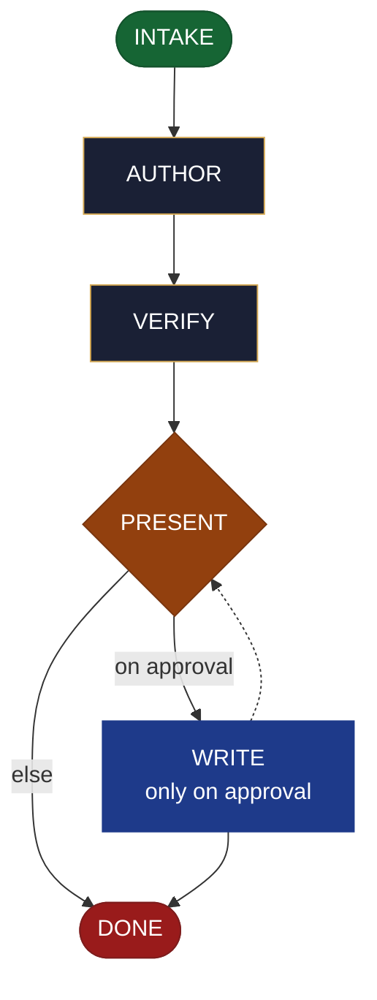

<!-- generated — do not edit; source: canonical/skills/aid-change-document/SKILL.md -->

## Frontmatter

- **`name`** — aid-change-document
- **`description`** — Update an EXISTING document NOW -- revise/extend a markdown doc, an ADR, a runbook, a changelog, a diagram, etc. -- in one pass. Reads the existing document first, then edits it, grounded in and accuracy-checked against the Knowledge Base (.aid/knowledge/) and the project source. It RESOLVES NOTHING: it drafts the change, you approve (with a diff shown), then it is written back. Produced by aid-tech-writer, verified by aid-reviewer. NEVER writes into .aid/knowledge/ (that is /aid-update-kb). /aid-update-document is its alias.
- **`allowed-tools`** — Read, Glob, Grep, Bash, Write, Edit, Agent
- **`argument-hint`** — &lt;document + change> -- which existing document to update, and how

[Definition: `canonical/skills/aid-change-document/SKILL.md`](https://github.com/AndreVianna/aid-methodology/blob/master/canonical/skills/aid-change-document/SKILL.md)

## Flow

