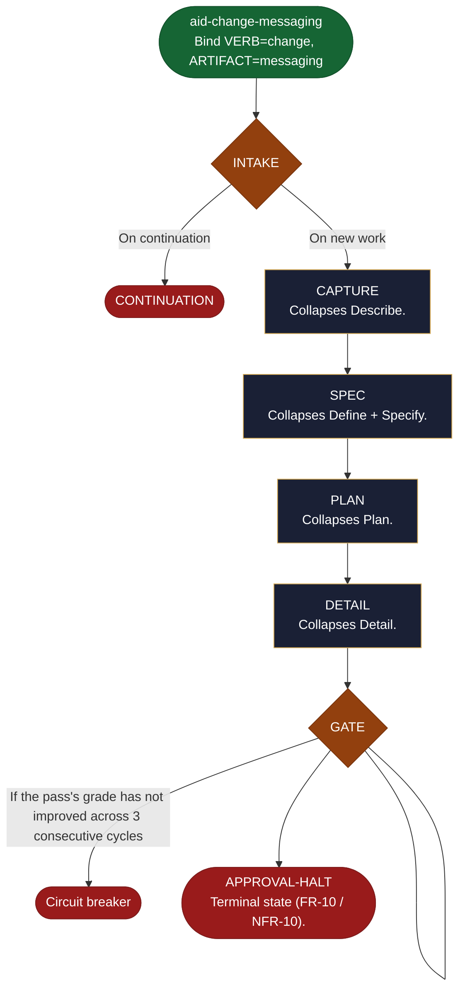

<!-- generated — do not edit; source: canonical/skills/aid-change-messaging/SKILL.md -->

## Frontmatter

- **`name`** — aid-change-messaging
- **`description`** — Direct-entry Lite-path shortcut (Change an existing message/event schema or its emission.) -- skips the aid-describe interview/triage. Binds VERB=`change` ARTIFACT=`messaging` and runs the shared shortcut engine, producing a fully-graded flattened Lite work that halts for approval. State machine: delegated to canonical/aid/templates/shortcut-engine.md (INTAKE -> CAPTURE -> SPEC -> PLAN -> DETAIL -> GATE -> APPROVAL-HALT).
- **`allowed-tools`** — Read, Glob, Grep, Bash, Write, Edit, Agent
- **`argument-hint`** — [description]  -- what to change; runs straight to a graded flattened Lite work

[Definition: `canonical/skills/aid-change-messaging/SKILL.md`](https://github.com/AndreVianna/aid-methodology/blob/master/canonical/skills/aid-change-messaging/SKILL.md)

## Flow

## Source fragments

Every node in the chart above, in chart order, with the exact `canonical/` text it was derived from.

**1 · `aid-change-messaging`** — Bind VERB=change, ARTIFACT=messaging · _entry_

~~~~plaintext title="canonical/skills/aid-change-messaging/SKILL.md#L18" wrap
Bind **VERB=`change`**, **ARTIFACT=`messaging`**, then run the shared engine at `canonical/aid/templates/shortcut-engine.md`. The engine scaffolds the flattened Lite work (feature-001 structure), authors REQUIREMENTS -> SPEC -> PLAN + BLUEPRINT -> DETAIL tasks with reduced capture, runs the per-document Grading Gates (feature-004), and halts at the FR-10 approval gate. It never executes. This shortcut's `default_type`/`group`/`alias_of` are its row in `canonical/aid/templates/shortcut-catalog.yml`.
~~~~

[Source: `canonical/skills/aid-change-messaging/SKILL.md#L18`](https://github.com/AndreVianna/aid-methodology/blob/master/canonical/skills/aid-change-messaging/SKILL.md#L18)

**2 · `INTAKE`** — parse the bound invocation values; resolve the catalog row… · _decision_

~~~~plaintext title="canonical/aid/templates/shortcut-engine.md#L89" wrap
| INTAKE | below | inline | CHAIN -> CAPTURE |
~~~~

[Source: `canonical/aid/templates/shortcut-engine.md#L89`](https://github.com/AndreVianna/aid-methodology/blob/master/canonical/aid/templates/shortcut-engine.md#L89) · [full step: `canonical/aid/templates/shortcut-engine.md#L217-L356`](https://github.com/AndreVianna/aid-methodology/blob/master/canonical/aid/templates/shortcut-engine.md#L217-L356)

**3 · `CONTINUATION`** · _exit_ · HALT

~~~~plaintext title="canonical/aid/templates/work-initiation-gate.md#L129" wrap
### 3b. CONTINUATION -> route to the chosen work's resume entry point, then STOP
~~~~

[Source: `canonical/aid/templates/work-initiation-gate.md#L129`](https://github.com/AndreVianna/aid-methodology/blob/master/canonical/aid/templates/work-initiation-gate.md#L129)

**4 · `CAPTURE`** — Collapses Describe. · _step_

~~~~plaintext title="canonical/aid/templates/shortcut-engine.md#L90" wrap
| CAPTURE | below | `aid-architect` (Large) | CHAIN -> SPEC |
~~~~

[Source: `canonical/aid/templates/shortcut-engine.md#L90`](https://github.com/AndreVianna/aid-methodology/blob/master/canonical/aid/templates/shortcut-engine.md#L90) · [full step: `canonical/aid/templates/shortcut-engine.md#L360-L444`](https://github.com/AndreVianna/aid-methodology/blob/master/canonical/aid/templates/shortcut-engine.md#L360-L444)

**5 · `SPEC`** — Collapses Define + Specify. · _step_

~~~~plaintext title="canonical/aid/templates/shortcut-engine.md#L91" wrap
| SPEC | below | `aid-architect` (Large) | CHAIN -> PLAN |
~~~~

[Source: `canonical/aid/templates/shortcut-engine.md#L91`](https://github.com/AndreVianna/aid-methodology/blob/master/canonical/aid/templates/shortcut-engine.md#L91) · [full step: `canonical/aid/templates/shortcut-engine.md#L448-L494`](https://github.com/AndreVianna/aid-methodology/blob/master/canonical/aid/templates/shortcut-engine.md#L448-L494)

**6 · `PLAN`** — Collapses Plan. · _step_

~~~~plaintext title="canonical/aid/templates/shortcut-engine.md#L92" wrap
| PLAN | below | `aid-architect` (Large) | CHAIN -> DETAIL |
~~~~

[Source: `canonical/aid/templates/shortcut-engine.md#L92`](https://github.com/AndreVianna/aid-methodology/blob/master/canonical/aid/templates/shortcut-engine.md#L92) · [full step: `canonical/aid/templates/shortcut-engine.md#L498-L581`](https://github.com/AndreVianna/aid-methodology/blob/master/canonical/aid/templates/shortcut-engine.md#L498-L581)

**7 · `DETAIL`** — Collapses Detail. · _step_

~~~~plaintext title="canonical/aid/templates/shortcut-engine.md#L93" wrap
| DETAIL | below | `aid-architect` (Large) | CHAIN -> GATE |
~~~~

[Source: `canonical/aid/templates/shortcut-engine.md#L93`](https://github.com/AndreVianna/aid-methodology/blob/master/canonical/aid/templates/shortcut-engine.md#L93) · [full step: `canonical/aid/templates/shortcut-engine.md#L585-L672`](https://github.com/AndreVianna/aid-methodology/blob/master/canonical/aid/templates/shortcut-engine.md#L585-L672)

**8 · `GATE`** — Runs feature-004's two batched Grading-Gate passes over the… · _decision_

~~~~plaintext title="canonical/aid/templates/shortcut-engine.md#L94" wrap
| GATE | below | `aid-reviewer` (Large) | CHAIN -> APPROVAL-HALT |
~~~~

[Source: `canonical/aid/templates/shortcut-engine.md#L94`](https://github.com/AndreVianna/aid-methodology/blob/master/canonical/aid/templates/shortcut-engine.md#L94) · [full step: `canonical/aid/templates/shortcut-engine.md#L674-L845`](https://github.com/AndreVianna/aid-methodology/blob/master/canonical/aid/templates/shortcut-engine.md#L674-L845)

**9 · `Circuit breaker`** · _exit_ · HALT

~~~~plaintext title="canonical/aid/templates/shortcut-engine.md#L807" wrap
   **Circuit breaker.** If the pass's grade has not improved across 3
~~~~

[Source: `canonical/aid/templates/shortcut-engine.md#L807`](https://github.com/AndreVianna/aid-methodology/blob/master/canonical/aid/templates/shortcut-engine.md#L807)

**10 · `APPROVAL-HALT`** — Terminal state (FR-10 / NFR-10). · _exit_ · HALT

~~~~plaintext title="canonical/aid/templates/shortcut-engine.md#L95" wrap
| APPROVAL-HALT | below | inline | HALT |
~~~~

[Source: `canonical/aid/templates/shortcut-engine.md#L95`](https://github.com/AndreVianna/aid-methodology/blob/master/canonical/aid/templates/shortcut-engine.md#L95) · [full step: `canonical/aid/templates/shortcut-engine.md#L849-L897`](https://github.com/AndreVianna/aid-methodology/blob/master/canonical/aid/templates/shortcut-engine.md#L849-L897)
