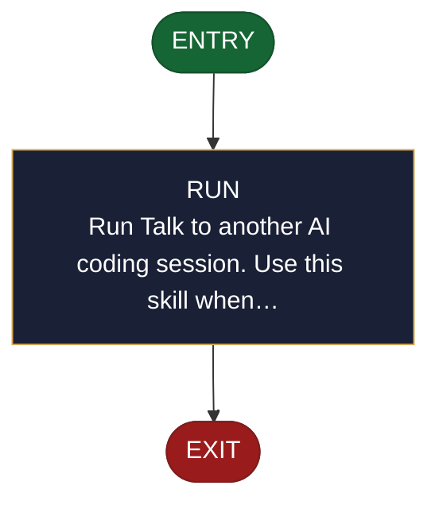

<!-- generated — do not edit; source: canonical/skills/aid-chat/SKILL.md -->

## Frontmatter

- **`name`** — aid-chat
- **`description`** — Talk to another AI coding session. Use this skill when you want to ask a peer agent something, answer one that has asked you, or work alongside one -- whether it runs in this same tool or a different one. It gives you a channel: you open one, pull a named agent into it, send and read messages, and acknowledge what you have read. Messages are durable while the channel is open, so a peer that restarts picks up where it left off, and one that is busy receives what it missed at its next turn. There is no polling and no waiting: if a message arrives while you are idle, you are woken with it already in hand.
- **`allowed-tools`** — Bash
- **`argument-hint`** — &lt;what you want to do>  -- e.g. 'ask the agent named api-work about the schema'

[Definition: `canonical/skills/aid-chat/SKILL.md`](https://github.com/AndreVianna/aid-methodology/blob/master/canonical/skills/aid-chat/SKILL.md)

## Flow

> **Approximate:** This chart is derived by heuristic; exact transitions may differ from runtime behaviour.

## Source fragments

Every node in the chart above, in chart order, with the exact `canonical/` text it was derived from.

**1 · `ENTRY`** · _entry_

~~~~plaintext title="canonical/skills/aid-chat/SKILL.md#L1" wrap
---
~~~~

[Source: `canonical/skills/aid-chat/SKILL.md#L1`](https://github.com/AndreVianna/aid-methodology/blob/master/canonical/skills/aid-chat/SKILL.md#L1)

**2 · `RUN`** — Run Talk to another AI coding session. Use this skill when… · _step_

~~~~plaintext title="canonical/skills/aid-chat/SKILL.md#L3" wrap
description: >
~~~~

[Source: `canonical/skills/aid-chat/SKILL.md#L3`](https://github.com/AndreVianna/aid-methodology/blob/master/canonical/skills/aid-chat/SKILL.md#L3)

**3 · `EXIT`** · _exit_ · HALT

~~~~plaintext title="canonical/skills/aid-chat/SKILL.md#L13" wrap
---
~~~~

[Source: `canonical/skills/aid-chat/SKILL.md#L13`](https://github.com/AndreVianna/aid-methodology/blob/master/canonical/skills/aid-chat/SKILL.md#L13)
