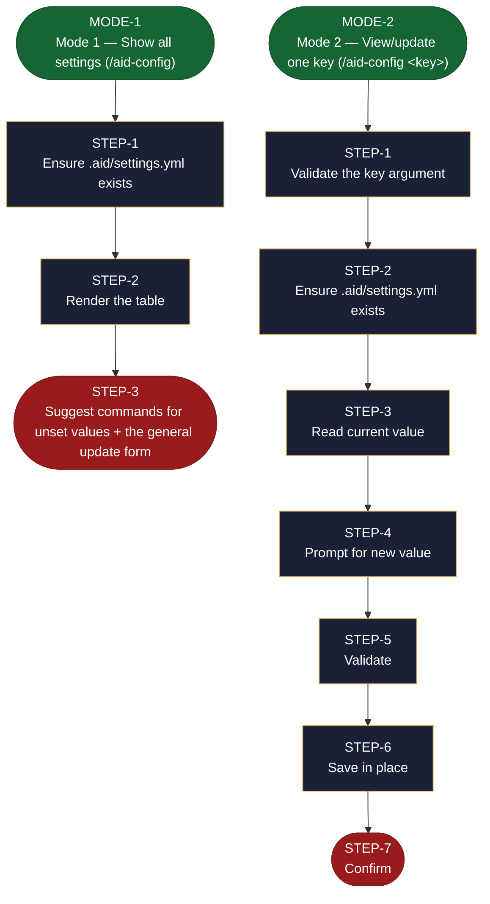

<!-- generated — do not edit; source: canonical/skills/aid-config/SKILL.md -->

## Frontmatter

- **`name`** — aid-config
- **`description`** — View or update AID pipeline settings. Use this skill when you need to see how the pipeline is configured, or change one setting such as the project name, its type, or the minimum grade. A bare invocation prints every value in a table and, on the first run, creates `.aid/settings.yml` from the template. Passing a key -- `/aid-config` name -- views and updates that one setting interactively.
- **`allowed-tools`** — Read, Glob, Grep, Bash, Write, Edit, AskUserQuestion
- **`argument-hint`** — (none) view all  |  &lt;key> view+update one (e.g., name, minimum_grade)

[Definition: `canonical/skills/aid-config/SKILL.md`](https://github.com/AndreVianna/aid-methodology/blob/master/canonical/skills/aid-config/SKILL.md)

## Flow

> **Approximate:** This chart is derived by heuristic; exact transitions may differ from runtime behaviour.

## Source fragments

Every node in the chart above, in chart order, with the exact `canonical/` text it was derived from.

**1 · `MODE-1`** — Mode 1 — Show all settings (/aid-config) · _entry_

~~~~plaintext title="canonical/skills/aid-config/SKILL.md#L37" wrap
## Mode 1 — Show all settings (`/aid-config`)
~~~~

[Source: `canonical/skills/aid-config/SKILL.md#L37`](https://github.com/AndreVianna/aid-methodology/blob/master/canonical/skills/aid-config/SKILL.md#L37)

**2 · `STEP-1`** — Ensure .aid/settings.yml exists · _step_

~~~~plaintext title="canonical/skills/aid-config/SKILL.md#L39" wrap
### Step 1: Ensure `.aid/settings.yml` exists
~~~~

[Source: `canonical/skills/aid-config/SKILL.md#L39`](https://github.com/AndreVianna/aid-methodology/blob/master/canonical/skills/aid-config/SKILL.md#L39)

**3 · `STEP-2`** — Render the table · _step_

~~~~plaintext title="canonical/skills/aid-config/SKILL.md#L46" wrap
### Step 2: Render the table
~~~~

[Source: `canonical/skills/aid-config/SKILL.md#L46`](https://github.com/AndreVianna/aid-methodology/blob/master/canonical/skills/aid-config/SKILL.md#L46)

**4 · `STEP-3`** — Suggest commands for unset values + the general update form · _exit_ · UNSPECIFIED

~~~~plaintext title="canonical/skills/aid-config/SKILL.md#L55" wrap
### Step 3: Suggest commands for unset values + the general update form
~~~~

[Source: `canonical/skills/aid-config/SKILL.md#L55`](https://github.com/AndreVianna/aid-methodology/blob/master/canonical/skills/aid-config/SKILL.md#L55)

**5 · `MODE-2`** — Mode 2 — View/update one key (/aid-config &lt;key>) · _entry_

~~~~plaintext title="canonical/skills/aid-config/SKILL.md#L74" wrap
## Mode 2 — View/update one key (`/aid-config <key>`)
~~~~

[Source: `canonical/skills/aid-config/SKILL.md#L74`](https://github.com/AndreVianna/aid-methodology/blob/master/canonical/skills/aid-config/SKILL.md#L74)

**6 · `STEP-1`** — Validate the key argument · _step_

~~~~plaintext title="canonical/skills/aid-config/SKILL.md#L76" wrap
### Step 1: Validate the key argument
~~~~

[Source: `canonical/skills/aid-config/SKILL.md#L76`](https://github.com/AndreVianna/aid-methodology/blob/master/canonical/skills/aid-config/SKILL.md#L76)

**7 · `STEP-2`** — Ensure .aid/settings.yml exists · _step_

~~~~plaintext title="canonical/skills/aid-config/SKILL.md#L88" wrap
### Step 2: Ensure `.aid/settings.yml` exists
~~~~

[Source: `canonical/skills/aid-config/SKILL.md#L88`](https://github.com/AndreVianna/aid-methodology/blob/master/canonical/skills/aid-config/SKILL.md#L88)

**8 · `STEP-3`** — Read current value · _step_

~~~~plaintext title="canonical/skills/aid-config/SKILL.md#L92" wrap
### Step 3: Read current value
~~~~

[Source: `canonical/skills/aid-config/SKILL.md#L92`](https://github.com/AndreVianna/aid-methodology/blob/master/canonical/skills/aid-config/SKILL.md#L92)

**9 · `STEP-4`** — Prompt for new value · _step_

~~~~plaintext title="canonical/skills/aid-config/SKILL.md#L101" wrap
### Step 4: Prompt for new value
~~~~

[Source: `canonical/skills/aid-config/SKILL.md#L101`](https://github.com/AndreVianna/aid-methodology/blob/master/canonical/skills/aid-config/SKILL.md#L101)

**10 · `STEP-5`** — Validate · _step_

~~~~plaintext title="canonical/skills/aid-config/SKILL.md#L119" wrap
### Step 5: Validate
~~~~

[Source: `canonical/skills/aid-config/SKILL.md#L119`](https://github.com/AndreVianna/aid-methodology/blob/master/canonical/skills/aid-config/SKILL.md#L119)

**11 · `STEP-6`** — Save in place · _step_

~~~~plaintext title="canonical/skills/aid-config/SKILL.md#L123" wrap
### Step 6: Save in place
~~~~

[Source: `canonical/skills/aid-config/SKILL.md#L123`](https://github.com/AndreVianna/aid-methodology/blob/master/canonical/skills/aid-config/SKILL.md#L123)

**12 · `STEP-7`** — Confirm · _exit_ · UNSPECIFIED

~~~~plaintext title="canonical/skills/aid-config/SKILL.md#L132" wrap
### Step 7: Confirm
~~~~

[Source: `canonical/skills/aid-config/SKILL.md#L132`](https://github.com/AndreVianna/aid-methodology/blob/master/canonical/skills/aid-config/SKILL.md#L132)
