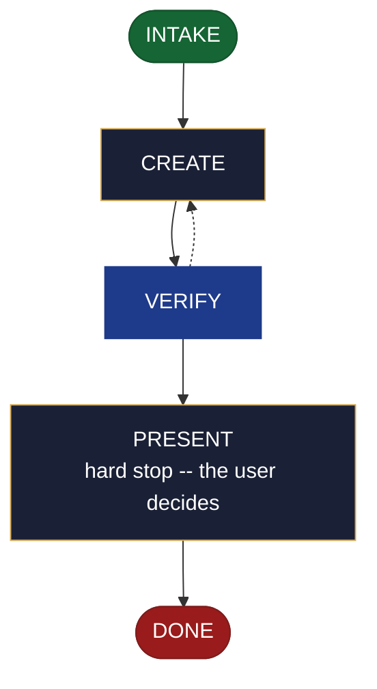

<!-- generated — do not edit; source: canonical/skills/aid-create-architecture/SKILL.md -->

## Frontmatter

- **`name`** — aid-create-architecture
- **`description`** — Realize a ready architecture seed from `.aid/design/architecture.md` into the project's build-and-shape (C1) Knowledge Base document -- components and their responsibilities, boundaries, interactions, and the invariants a change must not break. Use this skill when an architecture seed is ready and the project has no architecture document yet. When it creates the document it also registers it in `.aid/settings.yml` and `.aid/knowledge/README.md` in the same run, which opts that document into the Conformance Lane permanently -- a choice you are making by running this skill. To revise C1 content this lifecycle already committed, use `/aid-update-architecture`; to write documentation ABOUT an architecture rather than realize a design seed, use `/aid-document-architecture`. Produced by the aid-architect agent and independently verified by aid-reviewer (full verify). Allocates a work-NNN folder.
- **`allowed-tools`** — Read, Glob, Grep, Bash, Write, Edit, Agent
- **`argument-hint`** — [&lt;direction>] -- which parts of the architecture seed to realize

[Definition: `canonical/skills/aid-create-architecture/SKILL.md`](https://github.com/AndreVianna/aid-methodology/blob/master/canonical/skills/aid-create-architecture/SKILL.md)

## Flow

## Source fragments

Every node in the chart above, in chart order, with the exact `canonical/` text it was derived from.

**1 · `INTAKE`** · _entry_

~~~~plaintext title="canonical/skills/aid-create-architecture/SKILL.md#L39-L54" wrap
## State: INTAKE

1. **Allocate** through the Work Initiation Gate exactly as the contract's Allocation rule
   requires (`canonical/skills/aid-design/SKILL.md` INTAKE step 4 is the shape), with
   `initiator: aid-create-architecture`. `phase` is not driven.
2. **Read the seed** at `.aid/design/architecture.md`.
3. **Resolve the destination by concern, not filename.** This skill binds concern **C1**
   (build & shape, `canonical/aid/templates/kb-authoring/concern-model.md`). The seed's
   `## Destination` names the resolved path; where it does not, resolve C1 against
   `.aid/settings.yml` `knowledge.doc_set`, falling back to the C1 row of
   `canonical/aid/templates/kb-authoring/domain-doc-matrix.md`, and confirm with the user.
   C1's default set holds both `project-structure.md` and `architecture.md`; this skill
   targets the document describing the system's shape and **never**
   `project-structure.md`. An ambiguous realization is **asked**, never picked silently.
4. **Read the whole destination** if it exists, and note its `source:` field.
5. **Classify complexity** for the `aid-architect` dispatch (verifier tier >= producer).
~~~~

[Source: `canonical/skills/aid-create-architecture/SKILL.md#L39-L54`](https://github.com/AndreVianna/aid-methodology/blob/master/canonical/skills/aid-create-architecture/SKILL.md#L39-L54) · [full step: `canonical/skills/aid-create-architecture/SKILL.md#L39-L56`](https://github.com/AndreVianna/aid-methodology/blob/master/canonical/skills/aid-create-architecture/SKILL.md#L39-L56)

**2 · `CREATE`** · _step_

~~~~plaintext title="canonical/skills/aid-create-architecture/SKILL.md#L60-L62" wrap
## State: CREATE

**Exactly three conditions refuse. There is no fourth.**
~~~~

[Source: `canonical/skills/aid-create-architecture/SKILL.md#L60-L62`](https://github.com/AndreVianna/aid-methodology/blob/master/canonical/skills/aid-create-architecture/SKILL.md#L60-L62) · [full step: `canonical/skills/aid-create-architecture/SKILL.md#L60-L94`](https://github.com/AndreVianna/aid-methodology/blob/master/canonical/skills/aid-create-architecture/SKILL.md#L60-L94)

**3 · `VERIFY`** · _loop-back_

~~~~plaintext title="canonical/skills/aid-create-architecture/SKILL.md#L98-L101" wrap
## State: VERIFY

**Full verify**, as `design-lifecycle.md` defines it. Not clean -> loop to CREATE; the
3-cycle circuit breaker there escalates to IMPEDIMENT + `lifecycle: Blocked`.
~~~~

[Source: `canonical/skills/aid-create-architecture/SKILL.md#L98-L101`](https://github.com/AndreVianna/aid-methodology/blob/master/canonical/skills/aid-create-architecture/SKILL.md#L98-L101) · [full step: `canonical/skills/aid-create-architecture/SKILL.md#L98-L103`](https://github.com/AndreVianna/aid-methodology/blob/master/canonical/skills/aid-create-architecture/SKILL.md#L98-L103)

**4 · `PRESENT`** — hard stop -- the user decides · _step_

~~~~plaintext title="canonical/skills/aid-create-architecture/SKILL.md#L107-L111" wrap
## State: PRESENT (hard stop -- the user decides)

Set `lifecycle: Paused-Awaiting-Input`. Present the realized document and assert: the seed
was consumed only for what was written; on the creation path both registration surfaces were
written; and anything routed to `/aid-update-architecture` is named.
~~~~

[Source: `canonical/skills/aid-create-architecture/SKILL.md#L107-L111`](https://github.com/AndreVianna/aid-methodology/blob/master/canonical/skills/aid-create-architecture/SKILL.md#L107-L111) · [full step: `canonical/skills/aid-create-architecture/SKILL.md#L107-L113`](https://github.com/AndreVianna/aid-methodology/blob/master/canonical/skills/aid-create-architecture/SKILL.md#L107-L113)

**5 · `DONE`** · _exit_ · UNSPECIFIED

~~~~plaintext title="canonical/skills/aid-create-architecture/SKILL.md#L117-L119" wrap
## State: DONE

Set `lifecycle: Completed`, `updated` now, append a `## Lifecycle History` row.
~~~~

[Source: `canonical/skills/aid-create-architecture/SKILL.md#L117-L119`](https://github.com/AndreVianna/aid-methodology/blob/master/canonical/skills/aid-create-architecture/SKILL.md#L117-L119) · [full step: `canonical/skills/aid-create-architecture/SKILL.md#L117-L119`](https://github.com/AndreVianna/aid-methodology/blob/master/canonical/skills/aid-create-architecture/SKILL.md#L117-L119)
