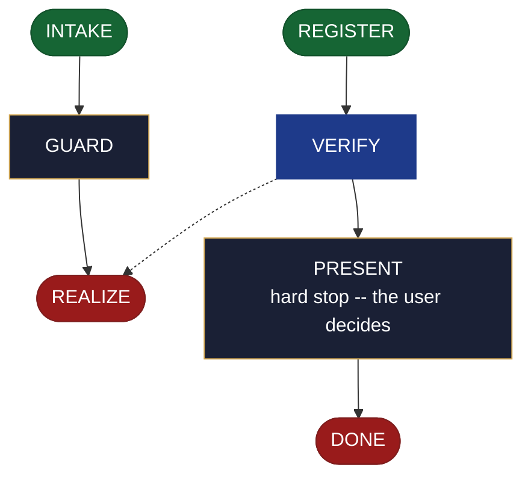

<!-- generated — do not edit; source: canonical/skills/aid-create-backlog/SKILL.md -->

## Frontmatter

- **`name`** — aid-create-backlog
- **`description`** — Realize a ready backlog seed into `.aid/knowledge/backlog.md` -- frontmatter, preamble, ## Contents index, ## Next Release, ## Prioritized, and ## Gotchas. Use this skill when a backlog seed is ready and the project needs its backlog document written for the first time. Moves accepted tech-debt.md items into backlog.md in the same run (id unchanged; row deleted from tech-debt.md). Registers the document in `.aid/settings.yml` and `.aid/knowledge/README.md` on first creation. Routes to `/aid-update-backlog` when the item sections already carry committed content.
- **`allowed-tools`** — Read, Glob, Grep, Bash, Write, Edit, Agent
- **`argument-hint`** — [&lt;direction>] -- which items to accept and how to prioritize them (fills item sections from the seed)

[Definition: `canonical/skills/aid-create-backlog/SKILL.md`](https://github.com/AndreVianna/aid-methodology/blob/master/canonical/skills/aid-create-backlog/SKILL.md)

## Flow

## Source fragments

Every node in the chart above, in chart order, with the exact `canonical/` text it was derived from.

**1 · `INTAKE`** · _entry_

~~~~plaintext title="canonical/skills/aid-create-backlog/SKILL.md#L33-L49" wrap
## State: INTAKE

1. **Require a subject.** Empty argument -> ask one bootstrapping question ("What items do
   you want to accept into the backlog -- or run `/aid-design-backlog` first?") and wait.
2. **Allocate, exactly per `design-lifecycle.md § Skill shape -- Allocation`** -- the Work
   Initiation Gate, then `initiator: aid-create-backlog`, `active_skill:
   aid-create-backlog`, `pipeline.path: lite`, `lifecycle: Running`. `phase` is not
   driven.
3. **Read the seed** at `.aid/design/backlog.md`. If no seed exists, inform the user and
   ask whether to proceed without one (items entered interactively) or to run
   `/aid-design-backlog` first; do not proceed silently.
4. **Read the destination** at `.aid/knowledge/backlog.md` if it exists. Classify its
   state: absent | present-sections-empty | present-sections-populated.
5. **Read `tech-debt.md`** at `.aid/knowledge/tech-debt.md` if it exists. The seed may
   name candidate rows to promote; know their current state before the confirm gate runs.
6. **Classify complexity (model + effort)** for the `aid-architect` dispatch below;
   verifier tier >= producer tier (`agent-dispatch-tiering.md`).
~~~~

[Source: `canonical/skills/aid-create-backlog/SKILL.md#L33-L49`](https://github.com/AndreVianna/aid-methodology/blob/master/canonical/skills/aid-create-backlog/SKILL.md#L33-L49) · [full step: `canonical/skills/aid-create-backlog/SKILL.md#L33-L51`](https://github.com/AndreVianna/aid-methodology/blob/master/canonical/skills/aid-create-backlog/SKILL.md#L33-L51)

**2 · `GUARD`** · _step_

~~~~plaintext title="canonical/skills/aid-create-backlog/SKILL.md#L55-L58" wrap
## State: GUARD

**Readiness gate (class-1 contract, feature-002 §3b).** Inspect the seed for a non-empty
`## Open questions` section per `design-lifecycle.md`'s detection rule.
~~~~

[Source: `canonical/skills/aid-create-backlog/SKILL.md#L55-L58`](https://github.com/AndreVianna/aid-methodology/blob/master/canonical/skills/aid-create-backlog/SKILL.md#L55-L58) · [full step: `canonical/skills/aid-create-backlog/SKILL.md#L55-L65`](https://github.com/AndreVianna/aid-methodology/blob/master/canonical/skills/aid-create-backlog/SKILL.md#L55-L65)

**3 · `REALIZE`** · _exit_ · UNSPECIFIED

~~~~plaintext title="canonical/skills/aid-create-backlog/SKILL.md#L69-L72" wrap
## State: REALIZE

Dispatch **`aid-architect`** (clean context, tiered) to realize the seed. Apply the case
determined in INTAKE:
~~~~

[Source: `canonical/skills/aid-create-backlog/SKILL.md#L69-L72`](https://github.com/AndreVianna/aid-methodology/blob/master/canonical/skills/aid-create-backlog/SKILL.md#L69-L72) · [full step: `canonical/skills/aid-create-backlog/SKILL.md#L69-L154`](https://github.com/AndreVianna/aid-methodology/blob/master/canonical/skills/aid-create-backlog/SKILL.md#L69-L154)

**4 · `REGISTER`** · _entry_

~~~~plaintext title="canonical/skills/aid-create-backlog/SKILL.md#L172-L175" wrap
## State: REGISTER

**On creation only** (destination was absent in INTAKE). Write two surfaces atomically
in the same run, per `feature-003 §6b` (REQUIREMENTS CC-1, CC-2):
~~~~

[Source: `canonical/skills/aid-create-backlog/SKILL.md#L172-L175`](https://github.com/AndreVianna/aid-methodology/blob/master/canonical/skills/aid-create-backlog/SKILL.md#L172-L175) · [full step: `canonical/skills/aid-create-backlog/SKILL.md#L172-L187`](https://github.com/AndreVianna/aid-methodology/blob/master/canonical/skills/aid-create-backlog/SKILL.md#L172-L187)

**5 · `VERIFY`** · _loop-back_

~~~~plaintext title="canonical/skills/aid-create-backlog/SKILL.md#L191-L195" wrap
## State: VERIFY

**Full verify** -- exactly as `design-lifecycle.md § Skill shape -- "Full verify"`
defines it. Not clean -> loop to REALIZE; the circuit-breaker there governs escalation
to IMPEDIMENT + `lifecycle: Blocked`.
~~~~

[Source: `canonical/skills/aid-create-backlog/SKILL.md#L191-L195`](https://github.com/AndreVianna/aid-methodology/blob/master/canonical/skills/aid-create-backlog/SKILL.md#L191-L195) · [full step: `canonical/skills/aid-create-backlog/SKILL.md#L191-L197`](https://github.com/AndreVianna/aid-methodology/blob/master/canonical/skills/aid-create-backlog/SKILL.md#L191-L197)

**6 · `PRESENT`** — hard stop -- the user decides · _step_

~~~~plaintext title="canonical/skills/aid-create-backlog/SKILL.md#L201-L203" wrap
## State: PRESENT (hard stop -- the user decides)

Set `lifecycle: Paused-Awaiting-Input`. Present the realized document clearly. Assert:
~~~~

[Source: `canonical/skills/aid-create-backlog/SKILL.md#L201-L203`](https://github.com/AndreVianna/aid-methodology/blob/master/canonical/skills/aid-create-backlog/SKILL.md#L201-L203) · [full step: `canonical/skills/aid-create-backlog/SKILL.md#L201-L210`](https://github.com/AndreVianna/aid-methodology/blob/master/canonical/skills/aid-create-backlog/SKILL.md#L201-L210)

**7 · `DONE`** · _exit_ · UNSPECIFIED

~~~~plaintext title="canonical/skills/aid-create-backlog/SKILL.md#L214-L216" wrap
## State: DONE

Set `lifecycle: Completed`, `updated` now, append a `## Lifecycle History` row.
~~~~

[Source: `canonical/skills/aid-create-backlog/SKILL.md#L214-L216`](https://github.com/AndreVianna/aid-methodology/blob/master/canonical/skills/aid-create-backlog/SKILL.md#L214-L216) · [full step: `canonical/skills/aid-create-backlog/SKILL.md#L214-L216`](https://github.com/AndreVianna/aid-methodology/blob/master/canonical/skills/aid-create-backlog/SKILL.md#L214-L216)
