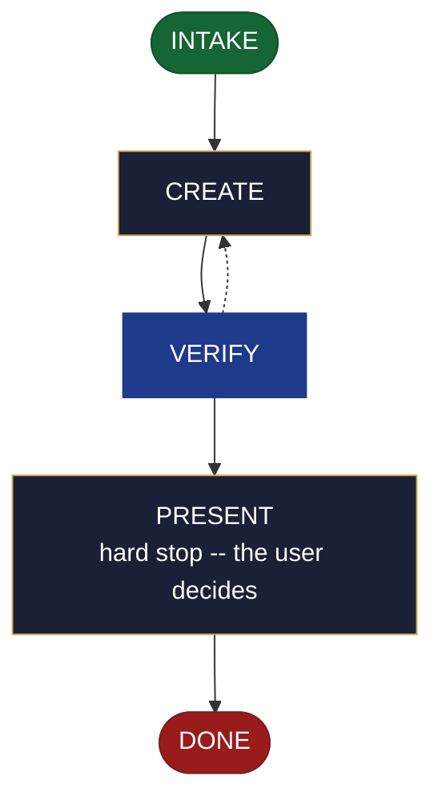

<!-- generated — do not edit; source: canonical/skills/aid-create-cicd/SKILL.md -->

## Frontmatter

- **`name`** — aid-create-cicd
- **`description`** — Realize a ready CI/CD seed from .aid/design/cicd.md into the project's shipping (C8) Knowledge Base document -- the pipeline stages and their order, the triggers, the environments and promotion between them, and the release flow. Use this skill when a CI/CD seed is ready and the project has no record of its delivery pipeline yet. It writes the KB record by default, and emits a workflow file only if you ask for one in that run. Creating the document also registers it, in the same run, which opts it into the Conformance Lane permanently -- a choice you make by running this skill. To revise C8 content already committed use /aid-update-cicd; for a resource the pipeline ships to, /aid-create-infra or /aid-update-infra; for a data pipeline rather than a delivery one, /aid-create-data-pipeline or /aid-update-data-pipeline; to ship a built artifact now, /aid-deploy.
- **`allowed-tools`** — Read, Glob, Grep, Bash, Write, Edit, Agent
- **`argument-hint`** — [&lt;direction>] -- which parts of the CI/CD seed to realize

[Definition: `canonical/skills/aid-create-cicd/SKILL.md`](https://github.com/AndreVianna/aid-methodology/blob/master/canonical/skills/aid-create-cicd/SKILL.md)

## Flow

## Source fragments

Every node in the chart above, in chart order, with the exact `canonical/` text it was derived from.

**1 · `INTAKE`** · _entry_

~~~~plaintext title="canonical/skills/aid-create-cicd/SKILL.md#L41-L57" wrap
## State: INTAKE

1. **Allocate** through the Work Initiation Gate exactly as the contract's Allocation rule
   requires (`canonical/skills/aid-design/SKILL.md` INTAKE step 4 is the shape), with
   `initiator: aid-create-cicd`. `phase` is not driven.
2. **Read the seed** at `.aid/design/cicd.md`.
3. **Resolve the destination by concern, not filename.** This skill binds concern **C8**
   (shipping & operation, `canonical/aid/templates/kb-authoring/concern-model.md`). The seed's
   `## Destination` names the resolved path; where it does not, resolve C8 against
   `.aid/settings.yml` `knowledge.doc_set`, falling back to the C8 row of
   `canonical/aid/templates/kb-authoring/domain-doc-matrix.md`, and confirm with the user. An
   ambiguous realization is **asked**, never picked silently.
4. **Read the whole destination** if it exists, and note its `source:` field.
5. **Ask whether the user also wants production config this run.** Emitting a workflow file
   is **opt-in per run and never the default**; the KB record is what this skill writes
   unless the user asks in this run.
6. **Classify complexity** for the `aid-architect` dispatch (verifier tier >= producer).
~~~~

[Source: `canonical/skills/aid-create-cicd/SKILL.md#L41-L57`](https://github.com/AndreVianna/aid-methodology/blob/master/canonical/skills/aid-create-cicd/SKILL.md#L41-L57) · [full step: `canonical/skills/aid-create-cicd/SKILL.md#L41-L59`](https://github.com/AndreVianna/aid-methodology/blob/master/canonical/skills/aid-create-cicd/SKILL.md#L41-L59)

**2 · `CREATE`** · _step_

~~~~plaintext title="canonical/skills/aid-create-cicd/SKILL.md#L63-L65" wrap
## State: CREATE

**Exactly three conditions refuse. There is no fourth.**
~~~~

[Source: `canonical/skills/aid-create-cicd/SKILL.md#L63-L65`](https://github.com/AndreVianna/aid-methodology/blob/master/canonical/skills/aid-create-cicd/SKILL.md#L63-L65) · [full step: `canonical/skills/aid-create-cicd/SKILL.md#L63-L97`](https://github.com/AndreVianna/aid-methodology/blob/master/canonical/skills/aid-create-cicd/SKILL.md#L63-L97)

**3 · `VERIFY`** · _loop-back_

~~~~plaintext title="canonical/skills/aid-create-cicd/SKILL.md#L101-L104" wrap
## State: VERIFY

**Full verify**, as `design-lifecycle.md` defines it. Not clean -> loop to CREATE; the
3-cycle circuit breaker there escalates to IMPEDIMENT + `lifecycle: Blocked`.
~~~~

[Source: `canonical/skills/aid-create-cicd/SKILL.md#L101-L104`](https://github.com/AndreVianna/aid-methodology/blob/master/canonical/skills/aid-create-cicd/SKILL.md#L101-L104) · [full step: `canonical/skills/aid-create-cicd/SKILL.md#L101-L106`](https://github.com/AndreVianna/aid-methodology/blob/master/canonical/skills/aid-create-cicd/SKILL.md#L101-L106)

**4 · `PRESENT`** — hard stop -- the user decides · _step_

~~~~plaintext title="canonical/skills/aid-create-cicd/SKILL.md#L110-L114" wrap
## State: PRESENT (hard stop -- the user decides)

Set `lifecycle: Paused-Awaiting-Input`. Present the realized document and assert: whether a
workflow file was emitted and that it was asked for; on the creation path both registration
surfaces were written; and anything routed to `/aid-update-cicd` is named.
~~~~

[Source: `canonical/skills/aid-create-cicd/SKILL.md#L110-L114`](https://github.com/AndreVianna/aid-methodology/blob/master/canonical/skills/aid-create-cicd/SKILL.md#L110-L114) · [full step: `canonical/skills/aid-create-cicd/SKILL.md#L110-L116`](https://github.com/AndreVianna/aid-methodology/blob/master/canonical/skills/aid-create-cicd/SKILL.md#L110-L116)

**5 · `DONE`** · _exit_ · UNSPECIFIED

~~~~plaintext title="canonical/skills/aid-create-cicd/SKILL.md#L120-L122" wrap
## State: DONE

Set `lifecycle: Completed`, `updated` now, append a `## Lifecycle History` row.
~~~~

[Source: `canonical/skills/aid-create-cicd/SKILL.md#L120-L122`](https://github.com/AndreVianna/aid-methodology/blob/master/canonical/skills/aid-create-cicd/SKILL.md#L120-L122) · [full step: `canonical/skills/aid-create-cicd/SKILL.md#L120-L122`](https://github.com/AndreVianna/aid-methodology/blob/master/canonical/skills/aid-create-cicd/SKILL.md#L120-L122)
