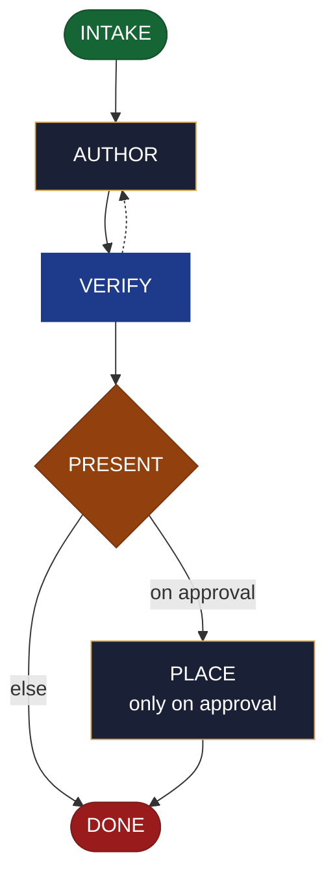

<!-- generated — do not edit; source: canonical/skills/aid-create-document/SKILL.md -->

## Frontmatter

- **`name`** — aid-create-document
- **`description`** — Create a document in one pass, working out both its format and its structure from what you ask for -- a how-to, a reference page, an ADR, an architecture write-up, a runbook, a tutorial, a changelog, a diagram, a table. Use this skill when you need a document written now and do not want to decide its genre first. It is grounded in, and accuracy-checked against, the Knowledge Base (`.aid/knowledge/`) and the project source; aid-tech-writer produces it and aid-reviewer verifies it. It resolves nothing: it drafts, you approve, and only then is the document placed. It never writes into `.aid/knowledge/` -- that is `/aid-update-kb`'s territory. The genre skills such as `/aid-document-decision`, and `/aid-create-diagram`, all delegate here. To settle a document's direction as a reusable design seed first, use `/aid-design-document`.
- **`allowed-tools`** — Read, Glob, Grep, Bash, Write, Edit, Agent
- **`argument-hint`** — &lt;subject> -- what to document (optionally a kind: adr, runbook, tutorial, changelog, diagram, ...)

[Definition: `canonical/skills/aid-create-document/SKILL.md`](https://github.com/AndreVianna/aid-methodology/blob/master/canonical/skills/aid-create-document/SKILL.md)

## Flow

## Source fragments

Every node in the chart above, in chart order, with the exact `canonical/` text it was derived from.

**1 · `INTAKE`** · _entry_

~~~~plaintext title="canonical/skills/aid-create-document/SKILL.md#L41-L64" wrap
## State: INTAKE

1. **Require a subject.** Empty argument -> ask one bootstrapping question ("What do you
   want documented, and for whom?") and wait.
2. **Resolve format + genre** from the request (or the hint a kind-sibling bound): e.g. "an
   ADR for X" -> markdown ADR; "a diagram of the pipeline" -> mermaid; "the release notes"
   -> changelog. Use the genre structures in `document.md`.
3. **Pick the path:** **Fast** -- a clear subject + kind -> author now. **Guided** -- vague
   -> scope subject / audience / kind first.
4. **Classify complexity (model + effort):** most docs -> `aid-tech-writer` at **sonnet /
   medium**; a heavy architecture write-up -> **opus / high**. Verifier tier >= producer.
5. **Consult the Work Initiation Gate, then allocate the work folder + STATE.** First run
   the gate (`canonical/aid/templates/work-initiation-gate.md`):
   `bash canonical/aid/scripts/works/enumerate-works.sh` (main tree + every git worktree).
   Empty -> allocate, no prompt. Works exist -> ask new-vs-continuation; on **continuation**
   route to the chosen work's resume door and STOP (allocate nothing); on **new work**:
   create and enter the worktree per the gate's `§ 3a` step 2
   (`worktree-lifecycle.sh create <work-id> <name>`, STOP on a non-zero exit or empty path,
   else enter the resolved path), **then** allocate (`pipeline.path: lite`, `initiator:
   aid-create-document`, `lifecycle: Running`, `active_skill: aid-create-document`;
   `phase` not driven).
6. **Read the design seed, if present.** If `.aid/design/document.md` exists, read it as
   prior context before drafting; it is an input, never a substitute, and is not modified
   by this run.
~~~~

[Source: `canonical/skills/aid-create-document/SKILL.md#L41-L64`](https://github.com/AndreVianna/aid-methodology/blob/master/canonical/skills/aid-create-document/SKILL.md#L41-L64) · [full step: `canonical/skills/aid-create-document/SKILL.md#L41-L66`](https://github.com/AndreVianna/aid-methodology/blob/master/canonical/skills/aid-create-document/SKILL.md#L41-L66)

**2 · `AUTHOR`** · _step_

~~~~plaintext title="canonical/skills/aid-create-document/SKILL.md#L70-L77" wrap
## State: AUTHOR

Dispatch **`aid-tech-writer`** (clean context, tiered) to write the document in the resolved
format + genre structure, **grounded in and accurate to** the KB + project source
(`task-type-rules.md ## DOCUMENT` -- verify accuracy against the current codebase and KB).
It drafts into the work folder (not yet placed). Text formats are produced natively
(markdown, mermaid, HTML, CSV/tables); for a format it cannot cleanly emit (native
`.pptx`/`.xlsx`), it produces the best text form and notes the conversion handoff.
~~~~

[Source: `canonical/skills/aid-create-document/SKILL.md#L70-L77`](https://github.com/AndreVianna/aid-methodology/blob/master/canonical/skills/aid-create-document/SKILL.md#L70-L77) · [full step: `canonical/skills/aid-create-document/SKILL.md#L70-L79`](https://github.com/AndreVianna/aid-methodology/blob/master/canonical/skills/aid-create-document/SKILL.md#L70-L79)

**3 · `VERIFY`** · _loop-back_

~~~~plaintext title="canonical/skills/aid-create-document/SKILL.md#L83-L91" wrap
## State: VERIFY

1. **Mechanical grounding check** (no dispatch): claims about the project cite a KB doc or
   `file:line`; the genre's required structure is present.
2. **Adversarial verification** -- clean-context **`aid-reviewer`** checks the draft:
   accurate against KB + codebase, complete for its genre, no fabricated content. Writes a
   review-quality ledger to `.aid/.temp/review-pending/<work>-verify.md`.
3. **Gate, then grade:** `bash canonical/aid/scripts/review/check-gaps.sh --ledger <ledger>` (exit 1 = an open criteria gap; do not grade), then `bash canonical/aid/scripts/grade.sh --explain <ledger>`. Not clean -> loop
   to AUTHOR. Circuit-breaker: 3 cycles -> IMPEDIMENT + `lifecycle: Blocked`.
~~~~

[Source: `canonical/skills/aid-create-document/SKILL.md#L83-L91`](https://github.com/AndreVianna/aid-methodology/blob/master/canonical/skills/aid-create-document/SKILL.md#L83-L91) · [full step: `canonical/skills/aid-create-document/SKILL.md#L83-L93`](https://github.com/AndreVianna/aid-methodology/blob/master/canonical/skills/aid-create-document/SKILL.md#L83-L93)

**4 · `PRESENT`** — hard stop -- human final say before placing · _decision_

~~~~plaintext title="canonical/skills/aid-create-document/SKILL.md#L97-L101" wrap
## State: PRESENT  (hard stop -- human final say before placing)

Set `lifecycle: Paused-Awaiting-Input`. Present the drafted document **and the proposed
target location** (KB-informed: `docs/`, an ADR dir, `CHANGELOG.md`, a runbook path, ...).
Await approval. **Never writes `.aid/knowledge/`.**
~~~~

[Source: `canonical/skills/aid-create-document/SKILL.md#L97-L101`](https://github.com/AndreVianna/aid-methodology/blob/master/canonical/skills/aid-create-document/SKILL.md#L97-L101) · [full step: `canonical/skills/aid-create-document/SKILL.md#L97-L103`](https://github.com/AndreVianna/aid-methodology/blob/master/canonical/skills/aid-create-document/SKILL.md#L97-L103)

**5 · `PLACE`** — only on approval · _step_

~~~~plaintext title="canonical/skills/aid-create-document/SKILL.md#L107-L113" wrap
## State: PLACE  (only on approval)

Write the document to its approved target location. **Extra care on overwrite or on the
published `docs/` tree:** inspect the target first and show the diff -- never silently
overwrite an existing doc. Then optionally print handoffs the user may act on: `/aid-update-kb`
(if it belongs in the KB), `/aid-create*` (if it describes something not yet built),
`/aid-refactor` (an ADR mandating a refactor).
~~~~

[Source: `canonical/skills/aid-create-document/SKILL.md#L107-L113`](https://github.com/AndreVianna/aid-methodology/blob/master/canonical/skills/aid-create-document/SKILL.md#L107-L113) · [full step: `canonical/skills/aid-create-document/SKILL.md#L107-L115`](https://github.com/AndreVianna/aid-methodology/blob/master/canonical/skills/aid-create-document/SKILL.md#L107-L115)

**6 · `DONE`** · _exit_ · UNSPECIFIED

~~~~plaintext title="canonical/skills/aid-create-document/SKILL.md#L119-L122" wrap
## State: DONE

Set `lifecycle: Completed`, `updated` now, append a `## Lifecycle History` row. Keep the
work folder (draft + verify ledger) as the audit record.
~~~~

[Source: `canonical/skills/aid-create-document/SKILL.md#L119-L122`](https://github.com/AndreVianna/aid-methodology/blob/master/canonical/skills/aid-create-document/SKILL.md#L119-L122) · [full step: `canonical/skills/aid-create-document/SKILL.md#L119-L122`](https://github.com/AndreVianna/aid-methodology/blob/master/canonical/skills/aid-create-document/SKILL.md#L119-L122)
