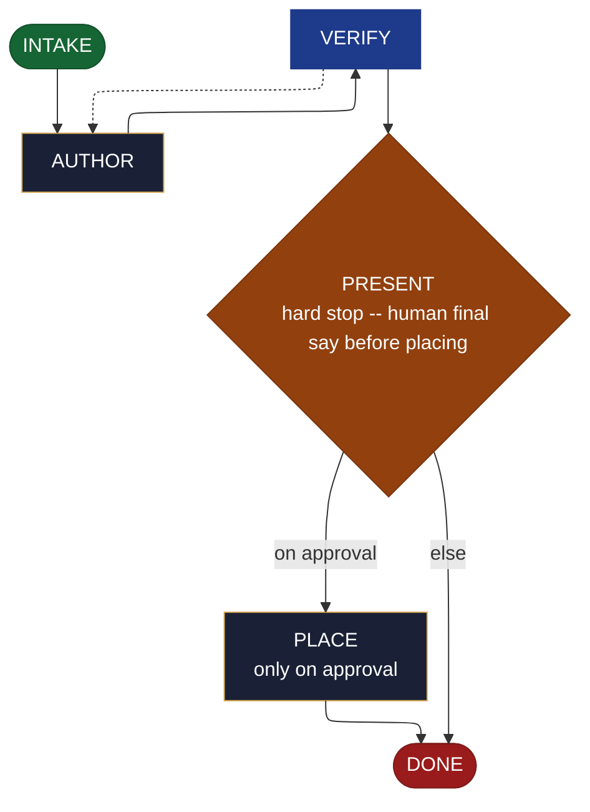

<!-- generated — do not edit; source: canonical/skills/aid-create-document/SKILL.md -->

## Frontmatter

- **`name`** — aid-create-document
- **`description`** — Create a document NOW -- markdown/reference/how-to, an ADR, an architecture write-up, a runbook, a tutorial, a changelog, a mermaid diagram, a table -- determining the format AND structure from the request, in one pass. Grounded in and accuracy-checked against the Knowledge Base (.aid/knowledge/) and the project source. It RESOLVES NOTHING: it drafts the document, you approve, then it is placed. Produced by the aid-tech-writer agent and verified by aid-reviewer. NEVER writes into .aid/knowledge/ (that is /aid-update-kb's territory). Allocates a work-NNN folder. /aid-add-document is its alias; the genre skills (/aid-document-decision, ...) and /aid-create-diagram delegate here.
- **`allowed-tools`** — Read, Glob, Grep, Bash, Write, Edit, Agent
- **`argument-hint`** — &lt;subject> -- what to document (optionally a kind: adr, runbook, tutorial, changelog, diagram, ...)

[Definition: `canonical/skills/aid-create-document/SKILL.md`](https://github.com/AndreVianna/aid-methodology/blob/master/canonical/skills/aid-create-document/SKILL.md)

## Flow

