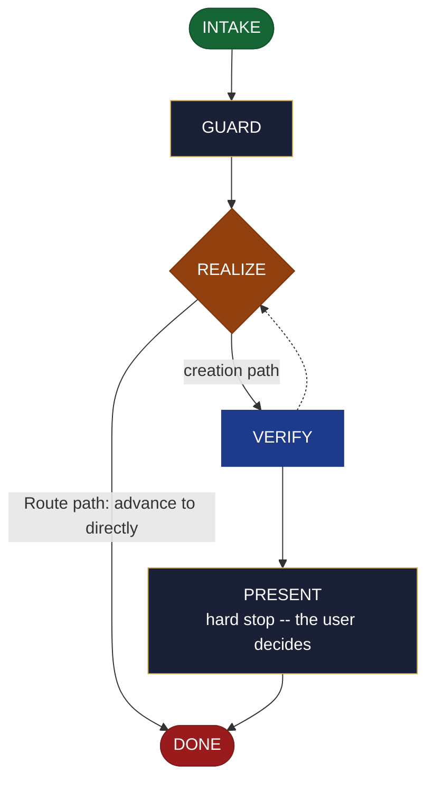

<!-- generated — do not edit; source: canonical/skills/aid-create-mvp/SKILL.md -->

## Frontmatter

- **`name`** — aid-create-mvp
- **`description`** — Realize a ready MVP seed into roadmap.md's ## MVP section only -- the first shippable slice: what it includes, why the line falls there, what was cut, and its current status. Use this skill when an MVP seed is ready and the roadmap's MVP section has not been written yet. The roadmap document itself is /aid-create-roadmap's to create; when roadmap.md is absent this skill routes to /aid-create-roadmap without writing anything and leaves the seed in place. Routes to /aid-update-mvp when ## MVP already carries committed content. Writes no document and no registration entry -- it owns a section, not a file.
- **`allowed-tools`** — Read, Glob, Grep, Bash, Write, Edit, Agent
- **`argument-hint`** — [&lt;slice>] -- what to realize into the ## MVP section (fills the section from the seed)

[Definition: `canonical/skills/aid-create-mvp/SKILL.md`](https://github.com/AndreVianna/aid-methodology/blob/master/canonical/skills/aid-create-mvp/SKILL.md)

## Flow

## Source fragments

Every node in the chart above, in chart order, with the exact `canonical/` text it was derived from.

**1 · `INTAKE`** · _entry_

~~~~plaintext title="canonical/skills/aid-create-mvp/SKILL.md#L42-L57" wrap
## State: INTAKE

1. **Require a subject.** Empty argument -> ask one bootstrapping question ("What
   belongs in the first shippable slice, and where does the line fall -- or run
   `/aid-design-mvp` first?") and wait.
2. **Allocate, exactly per `design-lifecycle.md § Skill shape -- Allocation`** -- the
   Work Initiation Gate, then `initiator: aid-create-mvp`, `active_skill:
   aid-create-mvp`, `pipeline.path: lite`, `lifecycle: Running`. `phase` is not
   driven.
3. **Read the seed** at `.aid/design/mvp.md`. If no seed exists, inform the user and
   ask whether to proceed without one (slice entered interactively) or to run
   `/aid-design-mvp` first; do not proceed silently.
4. **Read the destination** at `.aid/knowledge/roadmap.md` if it exists. Classify its
   state: absent | present-MVP-absent | present-MVP-populated.
5. **Classify complexity (model + effort)** for the `aid-architect` dispatch below;
   verifier tier >= producer tier (`agent-dispatch-tiering.md`).
~~~~

[Source: `canonical/skills/aid-create-mvp/SKILL.md#L42-L57`](https://github.com/AndreVianna/aid-methodology/blob/master/canonical/skills/aid-create-mvp/SKILL.md#L42-L57) · [full step: `canonical/skills/aid-create-mvp/SKILL.md#L42-L59`](https://github.com/AndreVianna/aid-methodology/blob/master/canonical/skills/aid-create-mvp/SKILL.md#L42-L59)

**2 · `GUARD`** · _step_

~~~~plaintext title="canonical/skills/aid-create-mvp/SKILL.md#L63-L66" wrap
## State: GUARD

**Readiness gate (class-1 contract, feature-002 §3b).** Inspect the seed for a
non-empty `## Open questions` section per `design-lifecycle.md`'s detection rule.
~~~~

[Source: `canonical/skills/aid-create-mvp/SKILL.md#L63-L66`](https://github.com/AndreVianna/aid-methodology/blob/master/canonical/skills/aid-create-mvp/SKILL.md#L63-L66) · [full step: `canonical/skills/aid-create-mvp/SKILL.md#L63-L74`](https://github.com/AndreVianna/aid-methodology/blob/master/canonical/skills/aid-create-mvp/SKILL.md#L63-L74)

**3 · `REALIZE`** · _decision_

~~~~plaintext title="canonical/skills/aid-create-mvp/SKILL.md#L78-L81" wrap
## State: REALIZE

Dispatch **`aid-architect`** (clean context, tiered) to realize the seed. Apply the
case determined in INTAKE:
~~~~

[Source: `canonical/skills/aid-create-mvp/SKILL.md#L78-L81`](https://github.com/AndreVianna/aid-methodology/blob/master/canonical/skills/aid-create-mvp/SKILL.md#L78-L81) · [full step: `canonical/skills/aid-create-mvp/SKILL.md#L78-L117`](https://github.com/AndreVianna/aid-methodology/blob/master/canonical/skills/aid-create-mvp/SKILL.md#L78-L117)

**4 · `VERIFY`** · _loop-back_

~~~~plaintext title="canonical/skills/aid-create-mvp/SKILL.md#L121-L125" wrap
## State: VERIFY

**Full verify** -- exactly as `design-lifecycle.md § Skill shape -- "Full verify"`
defines it. Not clean -> loop to REALIZE; the circuit-breaker there governs escalation
to IMPEDIMENT + `lifecycle: Blocked`.
~~~~

[Source: `canonical/skills/aid-create-mvp/SKILL.md#L121-L125`](https://github.com/AndreVianna/aid-methodology/blob/master/canonical/skills/aid-create-mvp/SKILL.md#L121-L125) · [full step: `canonical/skills/aid-create-mvp/SKILL.md#L121-L127`](https://github.com/AndreVianna/aid-methodology/blob/master/canonical/skills/aid-create-mvp/SKILL.md#L121-L127)

**5 · `PRESENT`** — hard stop -- the user decides · _step_

~~~~plaintext title="canonical/skills/aid-create-mvp/SKILL.md#L131-L134" wrap
## State: PRESENT (hard stop -- the user decides)

Set `lifecycle: Paused-Awaiting-Input`. Present the realized `## MVP` section clearly.
Assert:
~~~~

[Source: `canonical/skills/aid-create-mvp/SKILL.md#L131-L134`](https://github.com/AndreVianna/aid-methodology/blob/master/canonical/skills/aid-create-mvp/SKILL.md#L131-L134) · [full step: `canonical/skills/aid-create-mvp/SKILL.md#L131-L144`](https://github.com/AndreVianna/aid-methodology/blob/master/canonical/skills/aid-create-mvp/SKILL.md#L131-L144)

**6 · `DONE`** · _exit_ · UNSPECIFIED

~~~~plaintext title="canonical/skills/aid-create-mvp/SKILL.md#L148-L150" wrap
## State: DONE

Set `lifecycle: Completed`, `updated` now, append a `## Lifecycle History` row.
~~~~

[Source: `canonical/skills/aid-create-mvp/SKILL.md#L148-L150`](https://github.com/AndreVianna/aid-methodology/blob/master/canonical/skills/aid-create-mvp/SKILL.md#L148-L150) · [full step: `canonical/skills/aid-create-mvp/SKILL.md#L148-L150`](https://github.com/AndreVianna/aid-methodology/blob/master/canonical/skills/aid-create-mvp/SKILL.md#L148-L150)
