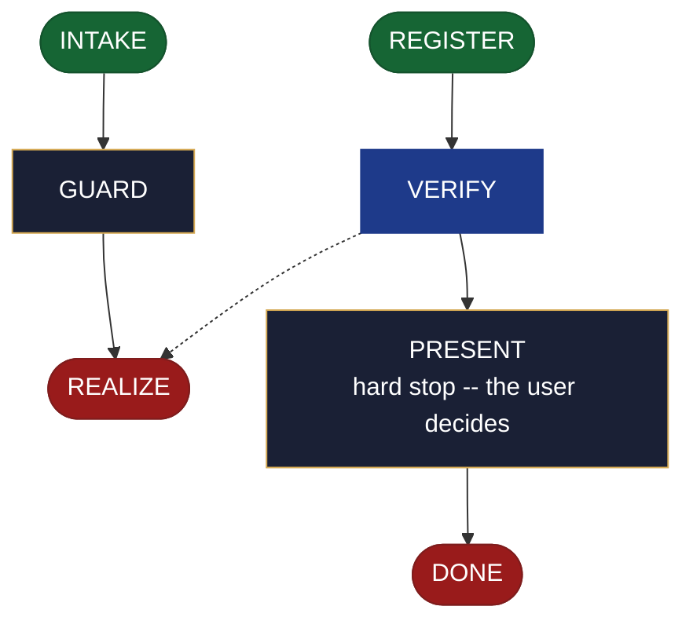

<!-- generated — do not edit; source: canonical/skills/aid-create-roadmap/SKILL.md -->

## Frontmatter

- **`name`** — aid-create-roadmap
- **`description`** — Realize a ready roadmap seed into .aid/knowledge/roadmap.md -- frontmatter, preamble, ## Contents index (including the forward ## MVP entry), and the three horizon sections ## Now, ## Next, ## Later. Use this skill when a roadmap seed is ready and the project needs its roadmap document written for the first time. Registers the document in .aid/settings.yml and .aid/knowledge/README.md on first creation. Routes to /aid-update-roadmap when the horizon sections already carry committed content. The ## MVP section belongs entirely to /aid-create-mvp -- this skill writes only its ## Contents index entry.
- **`allowed-tools`** — Read, Glob, Grep, Bash, Write, Edit, Agent
- **`argument-hint`** — [&lt;direction>] -- what to realize (fills horizon sections from the seed)

[Definition: `canonical/skills/aid-create-roadmap/SKILL.md`](https://github.com/AndreVianna/aid-methodology/blob/master/canonical/skills/aid-create-roadmap/SKILL.md)

## Flow

## Source fragments

Every node in the chart above, in chart order, with the exact `canonical/` text it was derived from.

**1 · `INTAKE`** · _entry_

~~~~plaintext title="canonical/skills/aid-create-roadmap/SKILL.md#L38-L52" wrap
## State: INTAKE

1. **Require a subject.** Empty argument -> ask one bootstrapping question ("What direction
   do you want to realize into roadmap.md -- or run `/aid-design-roadmap` first?") and wait.
2. **Allocate, exactly per `design-lifecycle.md § Skill shape -- Allocation`** -- the Work
   Initiation Gate, then `initiator: aid-create-roadmap`, `active_skill:
   aid-create-roadmap`, `pipeline.path: lite`, `lifecycle: Running`. `phase` is not
   driven.
3. **Read the seed** at `.aid/design/roadmap.md`. If no seed exists, inform the user and
   ask whether to proceed without one (direction entered interactively) or to run
   `/aid-design-roadmap` first; do not proceed silently.
4. **Read the destination** at `.aid/knowledge/roadmap.md` if it exists. Classify its state:
   absent | present-horizon-empty | present-horizon-populated.
5. **Classify complexity (model + effort)** for the `aid-architect` dispatch below;
   verifier tier >= producer tier (`agent-dispatch-tiering.md`).
~~~~

[Source: `canonical/skills/aid-create-roadmap/SKILL.md#L38-L52`](https://github.com/AndreVianna/aid-methodology/blob/master/canonical/skills/aid-create-roadmap/SKILL.md#L38-L52) · [full step: `canonical/skills/aid-create-roadmap/SKILL.md#L38-L54`](https://github.com/AndreVianna/aid-methodology/blob/master/canonical/skills/aid-create-roadmap/SKILL.md#L38-L54)

**2 · `GUARD`** · _step_

~~~~plaintext title="canonical/skills/aid-create-roadmap/SKILL.md#L58-L61" wrap
## State: GUARD

**Readiness gate (class-1 contract, feature-002 §3b).** Inspect the seed for a non-empty
`## Open questions` section per `design-lifecycle.md`'s detection rule.
~~~~

[Source: `canonical/skills/aid-create-roadmap/SKILL.md#L58-L61`](https://github.com/AndreVianna/aid-methodology/blob/master/canonical/skills/aid-create-roadmap/SKILL.md#L58-L61) · [full step: `canonical/skills/aid-create-roadmap/SKILL.md#L58-L68`](https://github.com/AndreVianna/aid-methodology/blob/master/canonical/skills/aid-create-roadmap/SKILL.md#L58-L68)

**3 · `REALIZE`** · _exit_ · UNSPECIFIED

~~~~plaintext title="canonical/skills/aid-create-roadmap/SKILL.md#L72-L75" wrap
## State: REALIZE

Dispatch **`aid-architect`** (clean context, tiered) to realize the seed. Apply the case
determined in INTAKE:
~~~~

[Source: `canonical/skills/aid-create-roadmap/SKILL.md#L72-L75`](https://github.com/AndreVianna/aid-methodology/blob/master/canonical/skills/aid-create-roadmap/SKILL.md#L72-L75) · [full step: `canonical/skills/aid-create-roadmap/SKILL.md#L72-L109`](https://github.com/AndreVianna/aid-methodology/blob/master/canonical/skills/aid-create-roadmap/SKILL.md#L72-L109)

**4 · `REGISTER`** · _entry_

~~~~plaintext title="canonical/skills/aid-create-roadmap/SKILL.md#L131-L134" wrap
## State: REGISTER

**On creation only** (destination was absent in INTAKE). Write two surfaces atomically
in the same run, per `feature-003 §6b` (REQUIREMENTS CC-1, CC-2):
~~~~

[Source: `canonical/skills/aid-create-roadmap/SKILL.md#L131-L134`](https://github.com/AndreVianna/aid-methodology/blob/master/canonical/skills/aid-create-roadmap/SKILL.md#L131-L134) · [full step: `canonical/skills/aid-create-roadmap/SKILL.md#L131-L146`](https://github.com/AndreVianna/aid-methodology/blob/master/canonical/skills/aid-create-roadmap/SKILL.md#L131-L146)

**5 · `VERIFY`** · _loop-back_

~~~~plaintext title="canonical/skills/aid-create-roadmap/SKILL.md#L150-L154" wrap
## State: VERIFY

**Full verify** -- exactly as `design-lifecycle.md § Skill shape -- "Full verify"`
defines it. Not clean -> loop to REALIZE; the circuit-breaker there governs escalation
to IMPEDIMENT + `lifecycle: Blocked`.
~~~~

[Source: `canonical/skills/aid-create-roadmap/SKILL.md#L150-L154`](https://github.com/AndreVianna/aid-methodology/blob/master/canonical/skills/aid-create-roadmap/SKILL.md#L150-L154) · [full step: `canonical/skills/aid-create-roadmap/SKILL.md#L150-L156`](https://github.com/AndreVianna/aid-methodology/blob/master/canonical/skills/aid-create-roadmap/SKILL.md#L150-L156)

**6 · `PRESENT`** — hard stop -- the user decides · _step_

~~~~plaintext title="canonical/skills/aid-create-roadmap/SKILL.md#L160-L162" wrap
## State: PRESENT (hard stop -- the user decides)

Set `lifecycle: Paused-Awaiting-Input`. Present the realized document clearly. Assert:
~~~~

[Source: `canonical/skills/aid-create-roadmap/SKILL.md#L160-L162`](https://github.com/AndreVianna/aid-methodology/blob/master/canonical/skills/aid-create-roadmap/SKILL.md#L160-L162) · [full step: `canonical/skills/aid-create-roadmap/SKILL.md#L160-L169`](https://github.com/AndreVianna/aid-methodology/blob/master/canonical/skills/aid-create-roadmap/SKILL.md#L160-L169)

**7 · `DONE`** · _exit_ · UNSPECIFIED

~~~~plaintext title="canonical/skills/aid-create-roadmap/SKILL.md#L173-L175" wrap
## State: DONE

Set `lifecycle: Completed`, `updated` now, append a `## Lifecycle History` row.
~~~~

[Source: `canonical/skills/aid-create-roadmap/SKILL.md#L173-L175`](https://github.com/AndreVianna/aid-methodology/blob/master/canonical/skills/aid-create-roadmap/SKILL.md#L173-L175) · [full step: `canonical/skills/aid-create-roadmap/SKILL.md#L173-L175`](https://github.com/AndreVianna/aid-methodology/blob/master/canonical/skills/aid-create-roadmap/SKILL.md#L173-L175)
