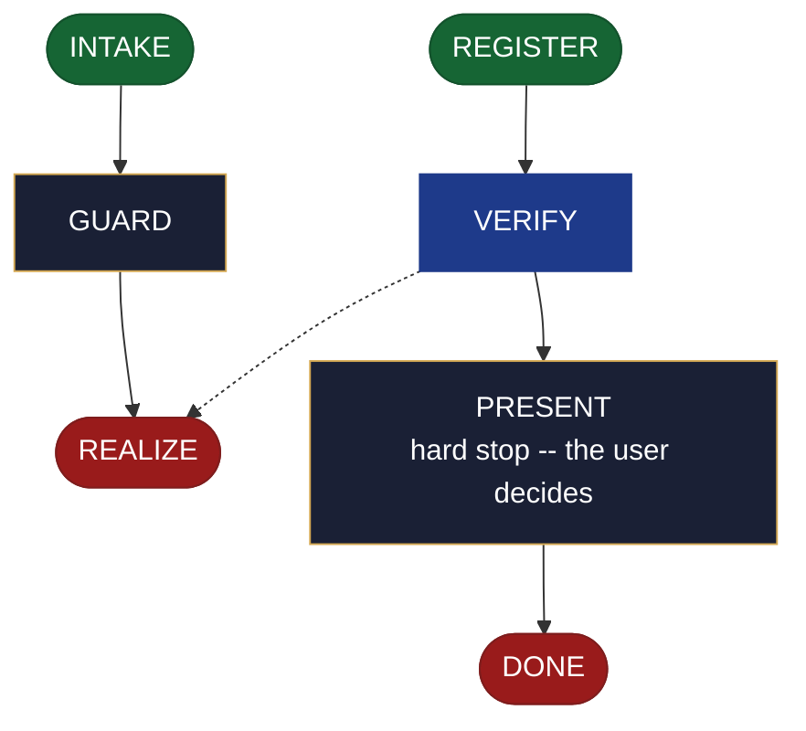

<!-- generated — do not edit; source: canonical/skills/aid-create-roadmap/SKILL.md -->

## Frontmatter

- **`name`** — aid-create-roadmap
- **`description`** — Write roadmap.md from a ready seed. Use when the roadmap document does not exist yet.
- **`allowed-tools`** — Read Glob Grep Bash Shell Terminal Write Edit Agent
- **`argument-hint`** — [&lt;direction>] -- what to realize (fills horizon sections from the seed)

[Definition: `canonical/skills/aid-create-roadmap/SKILL.md`](https://github.com/AndreVianna/aid-methodology/blob/master/canonical/skills/aid-create-roadmap/SKILL.md)

## Flow

```mermaid
flowchart TB
  classDef aidNode color:#fff
  classDef aidEntry fill:#166534,stroke:#14532d,color:#fff
  classDef aidExit fill:#991b1b,stroke:#7f1d1d,color:#fff
  classDef aidDecision fill:#92400e,stroke:#78350f,color:#fff
  classDef aidLoopBack fill:#1e3a8a,stroke:#1e3a8a,color:#fff
  classDef aidStep fill:#1a2035,stroke:#d4a853,color:#f1f5f9
  n1(["INTAKE"])
  n2["GUARD"]
  n3(["REALIZE"])
  n4(["REGISTER"])
  n5["VERIFY"]
  n6["PRESENT<br/>hard stop -- the user decides"]
  n7(["DONE"])
  n1 --> n2
  n2 --> n3
  n4 --> n5
  n5 -.-> n3
  n5 --> n6
  n6 --> n7
  class n1 aidEntry
  class n2 aidStep
  class n3 aidExit
  class n4 aidEntry
  class n5 aidLoopBack
  class n6 aidStep
  class n7 aidExit
  class n1 aidNode
  class n2 aidNode
  class n3 aidNode
  class n4 aidNode
  class n5 aidNode
  class n6 aidNode
  class n7 aidNode
```
## Source fragments

Every node in the chart above, in chart order, with the exact `canonical/` text it was derived from.

**1 · `INTAKE`** · _entry_

~~~~plaintext title="canonical/skills/aid-create-roadmap/SKILL.md#L31-L45" wrap
## State: INTAKE

1. **Require a subject.** Empty argument -> ask one bootstrapping question ("What direction
   do you want to realize into roadmap.md -- or run `/aid-design-roadmap` first?") and wait.
2. **Allocate, exactly per `design-lifecycle.md § Skill shape -- Allocation`** -- the Work
   Initiation Gate, then `initiator: aid-create-roadmap`, `active_skill:
   aid-create-roadmap`, `pipeline.path: lite`, `lifecycle: Running`. `phase` is not
   driven.
3. **Read the seed** at `.aid/design/roadmap.md`. If no seed exists, inform the user and
   ask whether to proceed without one (direction entered interactively) or to run
   `/aid-design-roadmap` first; do not proceed silently.
4. **Read the destination** at `.aid/knowledge/roadmap.md` if it exists. Classify its state:
   absent | present-horizon-empty | present-horizon-populated.
5. **Classify complexity (model + effort)** for the `aid-architect` dispatch below;
   verifier tier >= producer tier (`agent-dispatch-tiering.md`).
~~~~

[Source: `canonical/skills/aid-create-roadmap/SKILL.md#L31-L45`](https://github.com/AndreVianna/aid-methodology/blob/master/canonical/skills/aid-create-roadmap/SKILL.md#L31-L45) · [full step: `canonical/skills/aid-create-roadmap/SKILL.md#L31-L47`](https://github.com/AndreVianna/aid-methodology/blob/master/canonical/skills/aid-create-roadmap/SKILL.md#L31-L47)

**2 · `GUARD`** · _step_

~~~~plaintext title="canonical/skills/aid-create-roadmap/SKILL.md#L51-L54" wrap
## State: GUARD

**Readiness gate (class-1 contract, feature-002 §3b).** Inspect the seed for a non-empty
`## Open questions` section per `design-lifecycle.md`'s detection rule.
~~~~

[Source: `canonical/skills/aid-create-roadmap/SKILL.md#L51-L54`](https://github.com/AndreVianna/aid-methodology/blob/master/canonical/skills/aid-create-roadmap/SKILL.md#L51-L54) · [full step: `canonical/skills/aid-create-roadmap/SKILL.md#L51-L61`](https://github.com/AndreVianna/aid-methodology/blob/master/canonical/skills/aid-create-roadmap/SKILL.md#L51-L61)

**3 · `REALIZE`** · _exit_ · UNSPECIFIED

~~~~plaintext title="canonical/skills/aid-create-roadmap/SKILL.md#L65-L68" wrap
## State: REALIZE

Dispatch **`aid-architect`** (clean context, tiered) to realize the seed. Apply the case
determined in INTAKE:
~~~~

[Source: `canonical/skills/aid-create-roadmap/SKILL.md#L65-L68`](https://github.com/AndreVianna/aid-methodology/blob/master/canonical/skills/aid-create-roadmap/SKILL.md#L65-L68) · [full step: `canonical/skills/aid-create-roadmap/SKILL.md#L65-L102`](https://github.com/AndreVianna/aid-methodology/blob/master/canonical/skills/aid-create-roadmap/SKILL.md#L65-L102)

**4 · `REGISTER`** · _entry_

~~~~plaintext title="canonical/skills/aid-create-roadmap/SKILL.md#L124-L127" wrap
## State: REGISTER

**On creation only** (destination was absent in INTAKE). Write two surfaces atomically
in the same run, per `feature-003 §6b` (REQUIREMENTS CC-1, CC-2):
~~~~

[Source: `canonical/skills/aid-create-roadmap/SKILL.md#L124-L127`](https://github.com/AndreVianna/aid-methodology/blob/master/canonical/skills/aid-create-roadmap/SKILL.md#L124-L127) · [full step: `canonical/skills/aid-create-roadmap/SKILL.md#L124-L139`](https://github.com/AndreVianna/aid-methodology/blob/master/canonical/skills/aid-create-roadmap/SKILL.md#L124-L139)

**5 · `VERIFY`** · _loop-back_

~~~~plaintext title="canonical/skills/aid-create-roadmap/SKILL.md#L143-L147" wrap
## State: VERIFY

**Full verify** -- exactly as `design-lifecycle.md § Skill shape -- "Full verify"`
defines it. Not clean -> loop to REALIZE; the circuit-breaker there governs escalation
to IMPEDIMENT + `lifecycle: Blocked`.
~~~~

[Source: `canonical/skills/aid-create-roadmap/SKILL.md#L143-L147`](https://github.com/AndreVianna/aid-methodology/blob/master/canonical/skills/aid-create-roadmap/SKILL.md#L143-L147) · [full step: `canonical/skills/aid-create-roadmap/SKILL.md#L143-L149`](https://github.com/AndreVianna/aid-methodology/blob/master/canonical/skills/aid-create-roadmap/SKILL.md#L143-L149)

**6 · `PRESENT`** — hard stop -- the user decides · _step_

~~~~plaintext title="canonical/skills/aid-create-roadmap/SKILL.md#L153-L155" wrap
## State: PRESENT (hard stop -- the user decides)

Set `lifecycle: Paused-Awaiting-Input`. Present the realized document clearly. Assert:
~~~~

[Source: `canonical/skills/aid-create-roadmap/SKILL.md#L153-L155`](https://github.com/AndreVianna/aid-methodology/blob/master/canonical/skills/aid-create-roadmap/SKILL.md#L153-L155) · [full step: `canonical/skills/aid-create-roadmap/SKILL.md#L153-L162`](https://github.com/AndreVianna/aid-methodology/blob/master/canonical/skills/aid-create-roadmap/SKILL.md#L153-L162)

**7 · `DONE`** · _exit_ · UNSPECIFIED

~~~~plaintext title="canonical/skills/aid-create-roadmap/SKILL.md#L166-L168" wrap
## State: DONE

Set `lifecycle: Completed`, `updated` now, append a `## Lifecycle History` row.
~~~~

[Source: `canonical/skills/aid-create-roadmap/SKILL.md#L166-L168`](https://github.com/AndreVianna/aid-methodology/blob/master/canonical/skills/aid-create-roadmap/SKILL.md#L166-L168) · [full step: `canonical/skills/aid-create-roadmap/SKILL.md#L166-L168`](https://github.com/AndreVianna/aid-methodology/blob/master/canonical/skills/aid-create-roadmap/SKILL.md#L166-L168)
