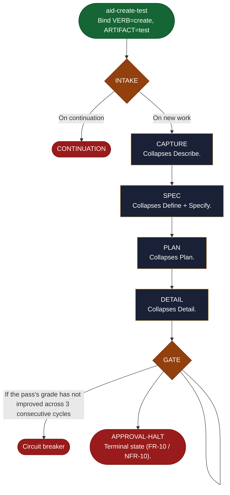

<!-- generated — do not edit; source: canonical/skills/aid-create-test/SKILL.md -->

## Frontmatter

- **`name`** — aid-create-test
- **`description`** — Author new tests (unit/integration/e2e); each test traces to an acceptance criterion; framework inferred from the KB. Use this skill when you already know what to create and want it scoped, specified, and broken into reviewable tasks in a single pass, with no requirements interview. You approve the resulting plan before anything is built: this skill plans and stops, so run `/aid-execute` to carry the plan out.
- **`allowed-tools`** — Read, Glob, Grep, Bash, Write, Edit, Agent
- **`argument-hint`** — [description]  -- what to create; runs straight to a graded flattened Lite work

[Definition: `canonical/skills/aid-create-test/SKILL.md`](https://github.com/AndreVianna/aid-methodology/blob/master/canonical/skills/aid-create-test/SKILL.md)

## Flow

## Source fragments

Every node in the chart above, in chart order, with the exact `canonical/` text it was derived from.

**1 · `aid-create-test`** — Bind VERB=create, ARTIFACT=test · _entry_

~~~~plaintext title="canonical/skills/aid-create-test/SKILL.md#L17" wrap
Bind **VERB=`create`**, **ARTIFACT=`test`**, then run the shared engine at `canonical/aid/templates/shortcut-engine.md`. The engine scaffolds the flattened Lite work (feature-001 structure), authors REQUIREMENTS -> SPEC -> PLAN + BLUEPRINT -> DETAIL tasks with reduced capture, runs the per-document Grading Gates (feature-004), and halts at the FR-10 approval gate. It never executes. This shortcut's `default_type`/`group` are its row in `canonical/aid/templates/shortcut-catalog.yml`.
~~~~

[Source: `canonical/skills/aid-create-test/SKILL.md#L17`](https://github.com/AndreVianna/aid-methodology/blob/master/canonical/skills/aid-create-test/SKILL.md#L17)

**2 · `INTAKE`** — parse the bound invocation values; resolve the catalog row… · _decision_

~~~~plaintext title="canonical/aid/templates/shortcut-engine.md#L92" wrap
| INTAKE | below | inline | CHAIN -> CAPTURE |
~~~~

[Source: `canonical/aid/templates/shortcut-engine.md#L92`](https://github.com/AndreVianna/aid-methodology/blob/master/canonical/aid/templates/shortcut-engine.md#L92) · [full step: `canonical/aid/templates/shortcut-engine.md#L222-L362`](https://github.com/AndreVianna/aid-methodology/blob/master/canonical/aid/templates/shortcut-engine.md#L222-L362)

**3 · `CONTINUATION`** · _exit_ · HALT

~~~~plaintext title="canonical/aid/templates/work-initiation-gate.md#L129" wrap
### 3b. CONTINUATION -> route to the chosen work's resume entry point, then STOP
~~~~

[Source: `canonical/aid/templates/work-initiation-gate.md#L129`](https://github.com/AndreVianna/aid-methodology/blob/master/canonical/aid/templates/work-initiation-gate.md#L129)

**4 · `CAPTURE`** — Collapses Describe. · _step_

~~~~plaintext title="canonical/aid/templates/shortcut-engine.md#L93" wrap
| CAPTURE | below | `aid-architect` (Large) | CHAIN -> SPEC |
~~~~

[Source: `canonical/aid/templates/shortcut-engine.md#L93`](https://github.com/AndreVianna/aid-methodology/blob/master/canonical/aid/templates/shortcut-engine.md#L93) · [full step: `canonical/aid/templates/shortcut-engine.md#L366-L461`](https://github.com/AndreVianna/aid-methodology/blob/master/canonical/aid/templates/shortcut-engine.md#L366-L461)

**5 · `SPEC`** — Collapses Define + Specify. · _step_

~~~~plaintext title="canonical/aid/templates/shortcut-engine.md#L94" wrap
| SPEC | below | `aid-architect` (Large) | CHAIN -> PLAN |
~~~~

[Source: `canonical/aid/templates/shortcut-engine.md#L94`](https://github.com/AndreVianna/aid-methodology/blob/master/canonical/aid/templates/shortcut-engine.md#L94) · [full step: `canonical/aid/templates/shortcut-engine.md#L465-L516`](https://github.com/AndreVianna/aid-methodology/blob/master/canonical/aid/templates/shortcut-engine.md#L465-L516)

**6 · `PLAN`** — Collapses Plan. · _step_

~~~~plaintext title="canonical/aid/templates/shortcut-engine.md#L95" wrap
| PLAN | below | `aid-architect` (Large) | CHAIN -> DETAIL |
~~~~

[Source: `canonical/aid/templates/shortcut-engine.md#L95`](https://github.com/AndreVianna/aid-methodology/blob/master/canonical/aid/templates/shortcut-engine.md#L95) · [full step: `canonical/aid/templates/shortcut-engine.md#L520-L606`](https://github.com/AndreVianna/aid-methodology/blob/master/canonical/aid/templates/shortcut-engine.md#L520-L606)

**7 · `DETAIL`** — Collapses Detail. · _step_

~~~~plaintext title="canonical/aid/templates/shortcut-engine.md#L96" wrap
| DETAIL | below | `aid-architect` (Large) | CHAIN -> GATE |
~~~~

[Source: `canonical/aid/templates/shortcut-engine.md#L96`](https://github.com/AndreVianna/aid-methodology/blob/master/canonical/aid/templates/shortcut-engine.md#L96) · [full step: `canonical/aid/templates/shortcut-engine.md#L610-L708`](https://github.com/AndreVianna/aid-methodology/blob/master/canonical/aid/templates/shortcut-engine.md#L610-L708)

**8 · `GATE`** — Runs feature-004's two batched Grading-Gate passes over the… · _decision_

~~~~plaintext title="canonical/aid/templates/shortcut-engine.md#L97" wrap
| GATE | below | `aid-reviewer` (Large) | CHAIN -> APPROVAL-HALT |
~~~~

[Source: `canonical/aid/templates/shortcut-engine.md#L97`](https://github.com/AndreVianna/aid-methodology/blob/master/canonical/aid/templates/shortcut-engine.md#L97) · [full step: `canonical/aid/templates/shortcut-engine.md#L710-L892`](https://github.com/AndreVianna/aid-methodology/blob/master/canonical/aid/templates/shortcut-engine.md#L710-L892)

**9 · `Circuit breaker`** · _exit_ · HALT

~~~~plaintext title="canonical/aid/templates/shortcut-engine.md#L848" wrap
   **Circuit breaker.** If the pass's grade has not improved across 3
~~~~

[Source: `canonical/aid/templates/shortcut-engine.md#L848`](https://github.com/AndreVianna/aid-methodology/blob/master/canonical/aid/templates/shortcut-engine.md#L848)

**10 · `APPROVAL-HALT`** — Terminal state (FR-10 / NFR-10). · _exit_ · HALT

~~~~plaintext title="canonical/aid/templates/shortcut-engine.md#L98" wrap
| APPROVAL-HALT | below | inline | HALT |
~~~~

[Source: `canonical/aid/templates/shortcut-engine.md#L98`](https://github.com/AndreVianna/aid-methodology/blob/master/canonical/aid/templates/shortcut-engine.md#L98) · [full step: `canonical/aid/templates/shortcut-engine.md#L896-L944`](https://github.com/AndreVianna/aid-methodology/blob/master/canonical/aid/templates/shortcut-engine.md#L896-L944)
