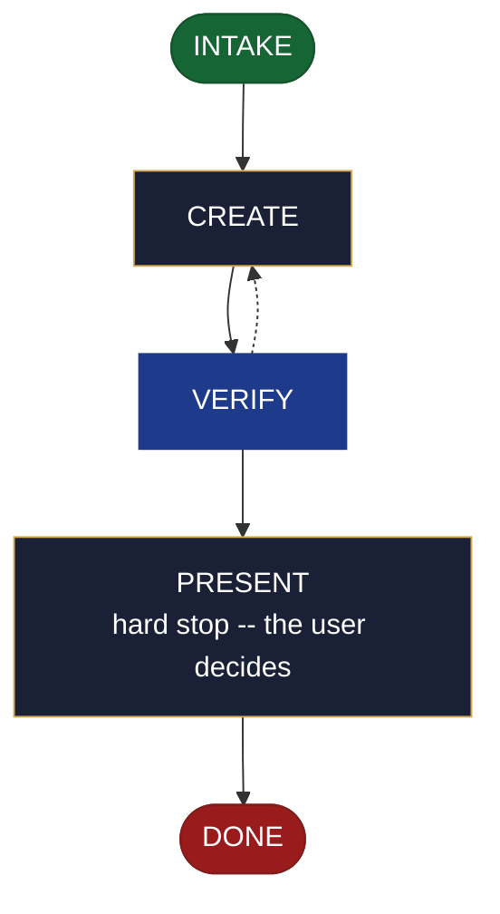

<!-- generated — do not edit; source: canonical/skills/aid-create-testing-strategy/SKILL.md -->

## Frontmatter

- **`name`** — aid-create-testing-strategy
- **`description`** — Realize a ready testing-strategy seed from `.aid/design/testing-strategy.md` into the project's quality (C6) documents -- the test landscape (levels, coverage expectations, CI lane mapping, known gaps) and the gate policy (what blocks a merge, the thresholds, who may waive one). Use this skill when a testing-strategy seed is ready and the project has no record of its test lanes or merge gates yet. Creates the gate document on first use and registers it in `.aid/settings.yml` and `.aid/knowledge/README.md` in the same run, which opts that document into the Conformance Lane permanently -- a choice you are making by running this skill. To revise C6 content this lifecycle already committed, use `/aid-update-testing-strategy`; to author or revise test CODE rather than the strategy, use `/aid-create-test` or `/aid-update-test`. Produced by the aid-architect agent and independently verified by aid-reviewer (full verify). Allocates a work-NNN folder.
- **`allowed-tools`** — Read, Glob, Grep, Bash, Write, Edit, Agent
- **`argument-hint`** — [&lt;direction>] -- which parts of the testing-strategy seed to realize

[Definition: `canonical/skills/aid-create-testing-strategy/SKILL.md`](https://github.com/AndreVianna/aid-methodology/blob/master/canonical/skills/aid-create-testing-strategy/SKILL.md)

## Flow

## Source fragments

Every node in the chart above, in chart order, with the exact `canonical/` text it was derived from.

**1 · `INTAKE`** · _entry_

~~~~plaintext title="canonical/skills/aid-create-testing-strategy/SKILL.md#L39-L52" wrap
## State: INTAKE

1. **Allocate** through the Work Initiation Gate exactly as the contract's Allocation rule
   requires (`canonical/skills/aid-design/SKILL.md` INTAKE step 4 is the shape), with
   `initiator: aid-create-testing-strategy`. `phase` is not driven.
2. **Read the seed** at `.aid/design/testing-strategy.md`.
3. **Resolve the destinations by concern, not filename.** This skill binds concern **C6**
   (quality & testing, `canonical/aid/templates/kb-authoring/concern-model.md`) and owns
   **two** documents. The seed's `## Destination` names both halves; where it does not,
   resolve C6 against `.aid/settings.yml` `knowledge.doc_set`, falling back to the C6 row of
   `canonical/aid/templates/kb-authoring/domain-doc-matrix.md`, and confirm with the user. An
   ambiguous realization is **asked**, never picked silently.
4. **Read both destinations** whole where they exist, and note each one's `source:` field.
5. **Classify complexity** for the `aid-architect` dispatch (verifier tier >= producer).
~~~~

[Source: `canonical/skills/aid-create-testing-strategy/SKILL.md#L39-L52`](https://github.com/AndreVianna/aid-methodology/blob/master/canonical/skills/aid-create-testing-strategy/SKILL.md#L39-L52) · [full step: `canonical/skills/aid-create-testing-strategy/SKILL.md#L39-L54`](https://github.com/AndreVianna/aid-methodology/blob/master/canonical/skills/aid-create-testing-strategy/SKILL.md#L39-L54)

**2 · `CREATE`** · _step_

~~~~plaintext title="canonical/skills/aid-create-testing-strategy/SKILL.md#L58-L60" wrap
## State: CREATE

**Exactly three conditions refuse. There is no fourth.**
~~~~

[Source: `canonical/skills/aid-create-testing-strategy/SKILL.md#L58-L60`](https://github.com/AndreVianna/aid-methodology/blob/master/canonical/skills/aid-create-testing-strategy/SKILL.md#L58-L60) · [full step: `canonical/skills/aid-create-testing-strategy/SKILL.md#L58-L92`](https://github.com/AndreVianna/aid-methodology/blob/master/canonical/skills/aid-create-testing-strategy/SKILL.md#L58-L92)

**3 · `VERIFY`** · _loop-back_

~~~~plaintext title="canonical/skills/aid-create-testing-strategy/SKILL.md#L96-L99" wrap
## State: VERIFY

**Full verify**, as `design-lifecycle.md` defines it. Not clean -> loop to CREATE; the
3-cycle circuit breaker there escalates to IMPEDIMENT + `lifecycle: Blocked`.
~~~~

[Source: `canonical/skills/aid-create-testing-strategy/SKILL.md#L96-L99`](https://github.com/AndreVianna/aid-methodology/blob/master/canonical/skills/aid-create-testing-strategy/SKILL.md#L96-L99) · [full step: `canonical/skills/aid-create-testing-strategy/SKILL.md#L96-L101`](https://github.com/AndreVianna/aid-methodology/blob/master/canonical/skills/aid-create-testing-strategy/SKILL.md#L96-L101)

**4 · `PRESENT`** — hard stop -- the user decides · _step_

~~~~plaintext title="canonical/skills/aid-create-testing-strategy/SKILL.md#L105-L109" wrap
## State: PRESENT (hard stop -- the user decides)

Set `lifecycle: Paused-Awaiting-Input`. Present both realized documents and assert: which
half went where; on a creation path both registration surfaces were written; and anything
routed to `/aid-update-testing-strategy` is named.
~~~~

[Source: `canonical/skills/aid-create-testing-strategy/SKILL.md#L105-L109`](https://github.com/AndreVianna/aid-methodology/blob/master/canonical/skills/aid-create-testing-strategy/SKILL.md#L105-L109) · [full step: `canonical/skills/aid-create-testing-strategy/SKILL.md#L105-L111`](https://github.com/AndreVianna/aid-methodology/blob/master/canonical/skills/aid-create-testing-strategy/SKILL.md#L105-L111)

**5 · `DONE`** · _exit_ · UNSPECIFIED

~~~~plaintext title="canonical/skills/aid-create-testing-strategy/SKILL.md#L115-L117" wrap
## State: DONE

Set `lifecycle: Completed`, `updated` now, append a `## Lifecycle History` row.
~~~~

[Source: `canonical/skills/aid-create-testing-strategy/SKILL.md#L115-L117`](https://github.com/AndreVianna/aid-methodology/blob/master/canonical/skills/aid-create-testing-strategy/SKILL.md#L115-L117) · [full step: `canonical/skills/aid-create-testing-strategy/SKILL.md#L115-L117`](https://github.com/AndreVianna/aid-methodology/blob/master/canonical/skills/aid-create-testing-strategy/SKILL.md#L115-L117)
