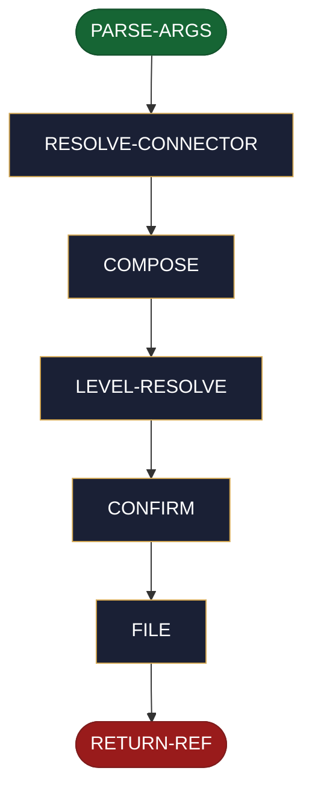

<!-- generated — do not edit; source: canonical/skills/aid-create-ticket/SKILL.md -->

## Frontmatter

- **`name`** — aid-create-ticket
- **`description`** — On-demand utility skill that files one new ticket via whatever issue-tracker connector the project has registered, or the host tool's own tracker MCP when none is catalogued. Parses `--connector <stem>`, `--level epic|story|task`, and `--parent <ref>` flags in any order ahead of a free-text `<description>` (create has no leading-token connector heuristic), resolves the connector via the shared ladder, composes the new-ticket payload (fixing level and parent by precedence, defaulting neither silently), resolves the canonical tier to the tracker's concrete issue-type at runtime via a non-destructive read (graceful degradation when the tracker has no matching type), previews the exact payload, and gates on one in-run AskUserQuestion confirm -- which also carries the epic|story|task pick when the level is neither explicit nor inferable -- before filing. Returns the new `<connector-stem>:<external-id>` only after the user confirms; nothing is filed, and no local file is ever written, before that.
- **`allowed-tools`** — Read, Glob, Grep, AskUserQuestion
- **`argument-hint`** — [--connector &lt;stem>] [--level epic|story|task] [--parent &lt;ref>] &lt;description>

[Definition: `canonical/skills/aid-create-ticket/SKILL.md`](https://github.com/AndreVianna/aid-methodology/blob/master/canonical/skills/aid-create-ticket/SKILL.md)

## Flow

> **Approximate:** This chart is derived by heuristic; exact transitions may differ from runtime behaviour.

