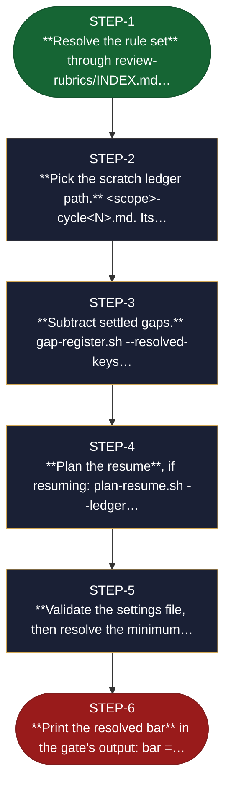

<!-- generated — do not edit; source: canonical/skills/aid-deep-review/SKILL.md -->

## Frontmatter

- **`name`** — aid-deep-review
- **`description`** — The graded adversarial review, callable by any skill. Dispatches aid-reviewer against a resolved rule set, reconciles findings into the durable ledger, gates on open criteria gaps, grades, and runs the FIX loop to the caller's minimum grade. This is the pass a quality gate reads.
- **`allowed-tools`** — Read, Glob, Grep, Bash, Task

[Definition: `canonical/skills/aid-deep-review/SKILL.md`](https://github.com/AndreVianna/aid-methodology/blob/master/canonical/skills/aid-deep-review/SKILL.md)

## Flow

> **Approximate:** This chart is derived by heuristic; exact transitions may differ from runtime behaviour.

## Source fragments

Every node in the chart above, in chart order, with the exact `canonical/` text it was derived from.

**1 · `STEP-1`** — \*\*Resolve the rule set\*\* through review-rubrics/INDEX.md… · _entry_

~~~~plaintext title="canonical/skills/aid-deep-review/SKILL.md#L22" wrap
1. **Resolve the rule set** through `review-rubrics/INDEX.md`, in its stated order: exact route →
~~~~

[Source: `canonical/skills/aid-deep-review/SKILL.md#L22`](https://github.com/AndreVianna/aid-methodology/blob/master/canonical/skills/aid-deep-review/SKILL.md#L22)

**2 · `STEP-2`** — \*\*Pick the scratch ledger path.\*\* &lt;scope>-cycle&lt;N>.md. Its… · _step_

~~~~plaintext title="canonical/skills/aid-deep-review/SKILL.md#L26" wrap
2. **Pick the scratch ledger path.** `<scope>-cycle<N>.md`. Its presence decides the mode: present →
~~~~

[Source: `canonical/skills/aid-deep-review/SKILL.md#L26`](https://github.com/AndreVianna/aid-methodology/blob/master/canonical/skills/aid-deep-review/SKILL.md#L26)

**3 · `STEP-3`** — \*\*Subtract settled gaps.\*\* gap-register.sh --resolved-keys… · _step_

~~~~plaintext title="canonical/skills/aid-deep-review/SKILL.md#L28" wrap
3. **Subtract settled gaps.** `gap-register.sh --resolved-keys` — anything `Answered`, `Declined` or
~~~~

[Source: `canonical/skills/aid-deep-review/SKILL.md#L28`](https://github.com/AndreVianna/aid-methodology/blob/master/canonical/skills/aid-deep-review/SKILL.md#L28)

**4 · `STEP-4`** — \*\*Plan the resume\*\*, if resuming: plan-resume.sh --ledger… · _step_

~~~~plaintext title="canonical/skills/aid-deep-review/SKILL.md#L31" wrap
4. **Plan the resume**, if resuming: `plan-resume.sh --ledger <scratch>` and apply its verdicts with
~~~~

[Source: `canonical/skills/aid-deep-review/SKILL.md#L31`](https://github.com/AndreVianna/aid-methodology/blob/master/canonical/skills/aid-deep-review/SKILL.md#L31)

**5 · `STEP-5`** — \*\*Validate the settings file, then resolve the minimum… · _step_

~~~~plaintext title="canonical/skills/aid-deep-review/SKILL.md#L33" wrap
5. **Validate the settings file, then resolve the minimum grade.**
~~~~

[Source: `canonical/skills/aid-deep-review/SKILL.md#L33`](https://github.com/AndreVianna/aid-methodology/blob/master/canonical/skills/aid-deep-review/SKILL.md#L33)

**6 · `STEP-6`** — \*\*Print the resolved bar\*\* in the gate's output: bar =… · _exit_ · UNSPECIFIED

~~~~plaintext title="canonical/skills/aid-deep-review/SKILL.md#L51" wrap
6. **Print the resolved bar** in the gate's output: `bar = <grade> (from .aid/settings.yml)`. A gate that
~~~~

[Source: `canonical/skills/aid-deep-review/SKILL.md#L51`](https://github.com/AndreVianna/aid-methodology/blob/master/canonical/skills/aid-deep-review/SKILL.md#L51)
