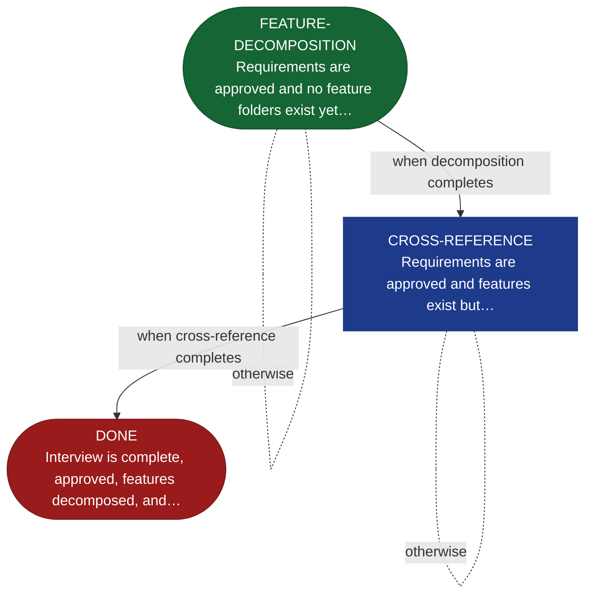

<!-- generated — do not edit; source: canonical/skills/aid-define/SKILL.md -->

## Frontmatter

- **`name`** — aid-define
- **`description`** — Feature decomposition and cross-reference validation from approved requirements. Begins from an approved REQUIREMENTS.md (produced by /aid-describe) and decomposes functional requirements into discrete feature folders with SPEC.md stubs (FEATURE-DECOMPOSITION), then validates the requirements and feature boundaries against the KB and codebase (CROSS-REFERENCE), then halts at DONE ready for /aid-specify. State machine: (Approved REQUIREMENTS) -> FEATURE-DECOMPOSITION -> CROSS-REFERENCE -> DONE [HALT -> /aid-specify].
- **`allowed-tools`** — Read, Glob, Grep, Bash, Write, Edit
- **`argument-hint`** — [work-001] decompose approved requirements  [--features work-001] re-run feature decomposition

[Definition: `canonical/skills/aid-define/SKILL.md`](https://github.com/AndreVianna/aid-methodology/blob/master/canonical/skills/aid-define/SKILL.md)

## Flow

## Source fragments

Every node in the chart above, in chart order, with the exact `canonical/` text it was derived from.

**1 · `FEATURE-DECOMPOSITION`** — Requirements are approved and no feature folders exist yet… · _entry_

~~~~plaintext title="canonical/skills/aid-define/SKILL.md#L230" wrap
| FEATURE-DECOMPOSITION | `references/state-feature-decomposition.md` | `aid-architect` | → CROSS-REFERENCE |
~~~~

[Source: `canonical/skills/aid-define/SKILL.md#L230`](https://github.com/AndreVianna/aid-methodology/blob/master/canonical/skills/aid-define/SKILL.md#L230) · [full step: `canonical/skills/aid-define/references/state-feature-decomposition.md#L1-L21`](https://github.com/AndreVianna/aid-methodology/blob/master/canonical/skills/aid-define/references/state-feature-decomposition.md#L1-L21)

**2 · `CROSS-REFERENCE`** — Requirements are approved and features exist but… · _loop-back_

~~~~plaintext title="canonical/skills/aid-define/SKILL.md#L231" wrap
| CROSS-REFERENCE | `references/state-cross-reference.md` | `aid-reviewer` | → DONE |
~~~~

[Source: `canonical/skills/aid-define/SKILL.md#L231`](https://github.com/AndreVianna/aid-methodology/blob/master/canonical/skills/aid-define/SKILL.md#L231) · [full step: `canonical/skills/aid-define/references/state-cross-reference.md#L1-L36`](https://github.com/AndreVianna/aid-methodology/blob/master/canonical/skills/aid-define/references/state-cross-reference.md#L1-L36)

**3 · `DONE`** — Interview is complete, approved, features decomposed, and… · _exit_ · HALT

~~~~plaintext title="canonical/skills/aid-define/SKILL.md#L232" wrap
| DONE | `references/state-done.md` | `inline` | → halt |
~~~~

[Source: `canonical/skills/aid-define/SKILL.md#L232`](https://github.com/AndreVianna/aid-methodology/blob/master/canonical/skills/aid-define/SKILL.md#L232) · [full step: `canonical/skills/aid-define/references/state-done.md#L1-L38`](https://github.com/AndreVianna/aid-methodology/blob/master/canonical/skills/aid-define/references/state-done.md#L1-L38)
