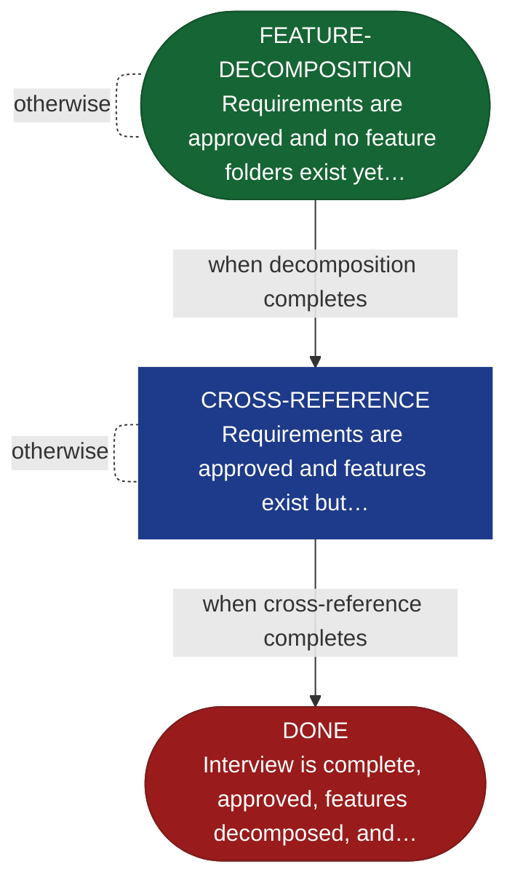

<!-- generated — do not edit; source: canonical/skills/aid-define/SKILL.md -->

## Frontmatter

- **`name`** — aid-define
- **`description`** — Feature decomposition and cross-reference validation from approved requirements. Begins from an approved REQUIREMENTS.md (produced by /aid-describe) and decomposes functional requirements into discrete feature folders with SPEC.md stubs (FEATURE-DECOMPOSITION), then validates the requirements and feature boundaries against the KB and codebase (CROSS-REFERENCE), then halts at DONE ready for /aid-specify. State machine: (Approved REQUIREMENTS) -> FEATURE-DECOMPOSITION -> CROSS-REFERENCE -> DONE [HALT -> /aid-specify].
- **`allowed-tools`** — Read, Glob, Grep, Bash, Write, Edit
- **`argument-hint`** — [work-001] decompose approved requirements  [--features work-001] re-run feature decomposition

[Definition: `canonical/skills/aid-define/SKILL.md`](https://github.com/AndreVianna/aid-methodology/blob/master/canonical/skills/aid-define/SKILL.md)

## Flow

